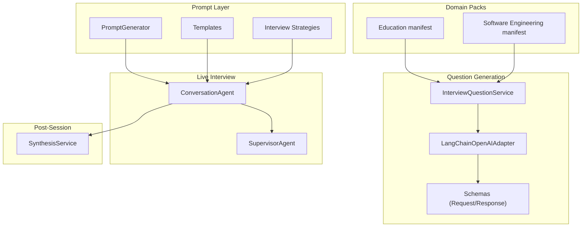
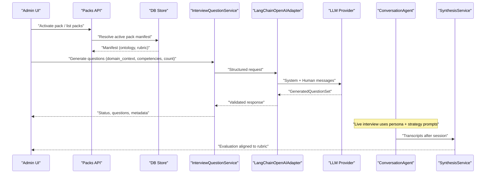
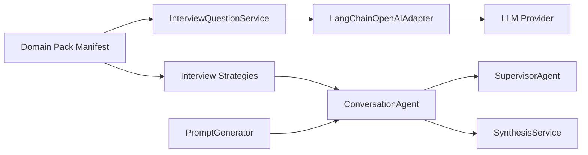
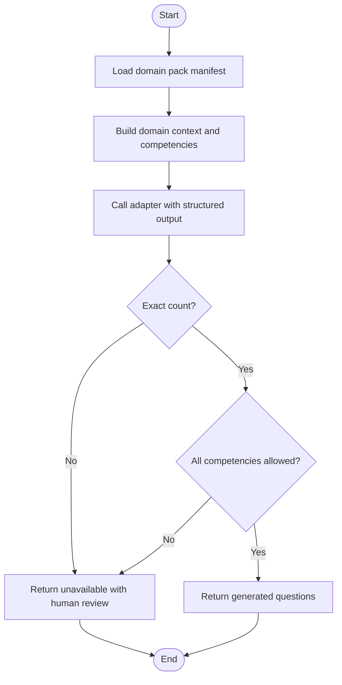

# Question Generation System

<cite>
**Referenced Files in This Document**
- [manifest.json](file://domain-packs/education/manifest.json)
- [manifest.json](file://domain-packs/software-engineering/manifest.json)
- [generator.py](file://Backend/app/ai/prompts/generator.py)
- [templates.py](file://Backend/app/ai/prompts/templates.py)
- [interview_strategies.py](file://Backend/app/ai/prompts/interview_strategies.py)
- [service.py](file://Backend/app/services/ai/service.py)
- [adapter.py](file://Backend/app/services/ai/adapter.py)
- [ai.py](file://Backend/app/schemas/ai.py)
- [packs.py](file://Backend/app/api/v1/packs.py)
- [store.py](file://Backend/app/db/store.py)
- [conversation.py](file://Backend/app/ai/agents/conversation.py)
- [synthesis_service.py](file://Backend/app/services/synthesis_service.py)
</cite>

## Table of Contents
1. Introduction
2. Project Structure
3. Core Components
4. Architecture Overview
5. Detailed Component Analysis
6. Dependency Analysis
7. Performance Considerations
8. Troubleshooting Guide
9. Conclusion
10. Appendices

## Introduction
This document explains the AI-powered question generation system that creates domain-specific interview questions using domain context from manifests, prompt engineering, and LLM integration. It covers how domain packs define competencies and evaluation rubrics, how strategies steer question style (scenario-based, technical, behavioral), how candidate profiles personalize interviews, and the full lifecycle from generation to evaluation with quality checks and feedback loops. It also provides examples of generated questions for different domains and customization options for difficulty, focus areas, and assessment criteria.

## Project Structure
The system is composed of:
- Domain packs: JSON manifests defining ontology, question pools, task styles, and evaluation rubrics per domain.
- Prompt layer: Templates and generators that build persona-driven prompts and strategy instructions for live interviews.
- Question generation service: A structured LLM call that produces concise, competency-mapped questions from domain context.
- Live interview agents: Agents that conduct time-bounded interviews guided by supervisor logic and KPI coverage guards.
- Post-session synthesis: LLM-based analysis of transcripts into structured evaluations aligned to rubric dimensions.

**Diagram sources**
- [manifest.json:1-143](file://domain-packs/education/manifest.json#L1-L143)
- [manifest.json:1-140](file://domain-packs/software-engineering/manifest.json#L1-L140)
- [generator.py:25-217](file://Backend/app/ai/prompts/generator.py#L25-L217)
- [templates.py:7-252](file://Backend/app/ai/prompts/templates.py#L7-L252)
- [interview_strategies.py:18-118](file://Backend/app/ai/prompts/interview_strategies.py#L18-L118)
- [service.py:13-86](file://Backend/app/services/ai/service.py#L13-L86)
- [adapter.py:18-50](file://Backend/app/services/ai/adapter.py#L18-L50)
- [ai.py:6-52](file://Backend/app/schemas/ai.py#L6-L52)
- [conversation.py:184-311](file://Backend/app/ai/agents/conversation.py#L184-L311)
- [synthesis_service.py:154-297](file://Backend/app/services/synthesis_service.py#L154-L297)

**Section sources**
- [manifest.json:1-143](file://domain-packs/education/manifest.json#L1-L143)
- [manifest.json:1-140](file://domain-packs/software-engineering/manifest.json#L1-L140)
- [packs.py:41-104](file://Backend/app/api/v1/packs.py#L41-L104)

## Core Components
- Domain packs: Provide ontology (skills, certifications, concepts), question pools for profile and applied interviews, task styles, matching weights, and evaluation rubrics.
- Prompt generator: Builds a persona via an LLM and fills conversation and supervisor agent templates with configuration, candidate profile, and strategy.
- Interview strategies: Select strategy content based on interview type (profile screening vs job interview) and inject evidence axes and role instructions.
- Question generation service: Validates inputs, calls adapter, enforces competency constraints, and returns structured results or fallback status.
- Adapter: Uses LangChain OpenAI with structured output to produce exactly the requested number of questions mapped to competencies.
- Live interview agents: Conduct time-bounded interviews with supervisor oversight, KPI coverage, anti-repeat guards, and transcript persistence.
- Synthesis service: Analyzes transcripts into structured evaluations aligned to rubric dimensions, with identity verification notes and data quality flags.

**Section sources**
- [manifest.json:1-143](file://domain-packs/education/manifest.json#L1-L143)
- [manifest.json:1-140](file://domain-packs/software-engineering/manifest.json#L1-L140)
- [generator.py:25-217](file://Backend/app/ai/prompts/generator.py#L25-L217)
- [interview_strategies.py:18-118](file://Backend/app/ai/prompts/interview_strategies.py#L18-L118)
- [service.py:13-86](file://Backend/app/services/ai/service.py#L13-L86)
- [adapter.py:18-50](file://Backend/app/services/ai/adapter.py#L18-L50)
- [ai.py:6-52](file://Backend/app/schemas/ai.py#L6-L52)
- [conversation.py:184-311](file://Backend/app/ai/agents/conversation.py#L184-L311)
- [synthesis_service.py:154-297](file://Backend/app/services/synthesis_service.py#L154-L297)

## Architecture Overview
The system supports two complementary flows:
- Static question generation: Build a set of concise, competency-mapped questions from domain-pack context.
- Live interview orchestration: Generate persona and strategy prompts, run a time-bounded conversation with supervisor oversight, persist transcripts, and synthesize post-session evaluations.

**Diagram sources**
- [packs.py:41-104](file://Backend/app/api/v1/packs.py#L41-L104)
- [store.py:677-687](file://Backend/app/db/store.py#L677-L687)
- [service.py:43-86](file://Backend/app/services/ai/service.py#L43-L86)
- [adapter.py:32-50](file://Backend/app/services/ai/adapter.py#L32-L50)
- [conversation.py:184-311](file://Backend/app/ai/agents/conversation.py#L184-L311)
- [synthesis_service.py:182-262](file://Backend/app/services/synthesis_service.py#L182-L262)

## Detailed Component Analysis

### Domain Packs: Manifest Schema and Examples
- Education pack defines skills, concepts, resume extraction signals, matching weights, profile/applied interview question pools with scenario task style, and a three-dimension rubric (structure, reasoning, domain correctness).
- Software engineering pack similarly defines skills, concepts, question pools, and rubric dimensions tailored to engineering practice.

Examples of question themes present in manifests:
- Education: instructional design, curriculum design, academic integrity, student engagement, inclusive teaching, continuous improvement.
- Software engineering: incident response, API design, system design, collaboration, observability, architecture judgment, testing, performance, security basics, delivery judgment.

Customization knobs available via manifests:
- Task style per interview type (e.g., scenario).
- Question counts per interview type.
- Evaluation rubric dimensions and labels.
- Matching weights between CV match and interview score.

**Section sources**
- [manifest.json:1-143](file://domain-packs/education/manifest.json#L1-L143)
- [manifest.json:1-140](file://domain-packs/software-engineering/manifest.json#L1-L140)
- [packs.py:151-211](file://Backend/app/api/v1/packs.py#L151-L211)

### Prompt Generator and Templates
- The prompt generator builds a persona via an LLM and then fills conversation and supervisor agent templates with configuration, candidate profile summary, and strategy injection.
- Conversation template enforces domain boundaries, dual-axis coverage (evaluation themes and KPIs), difficulty, language, duration, opening sequence, time management, and strict adherence to topic, interviewer type, difficulty, and language.
- Supervisor template monitors flow, time, quality, and configuration adherence, providing corrective guidance to keep the interview on track.

Key personalization inputs:
- Candidate profile summary (name, role, subject, evaluation title/description, job description, KPIs, CV sections).
- Strategy injection (interview focus and role instructions).
- Difficulty, language, length, pronouns, and interviewer type.

**Section sources**
- [generator.py:25-217](file://Backend/app/ai/prompts/generator.py#L25-L217)
- [templates.py:7-252](file://Backend/app/ai/prompts/templates.py#L7-L252)
- [templates.py:254-381](file://Backend/app/ai/prompts/templates.py#L254-L381)

### Interview Strategies: Scenario-Based, Technical, Behavioral
- Strategy selection depends on interview type (profile screening vs job interview).
- Profile screening strategy emphasizes building portable skill signals from concrete examples, identifying strongest area, and deep-diving with STAR probing.
- Job interview strategy emphasizes locked question pool coverage, mapping answers to JD requirements, and consistent assessment across candidates.
- Both strategies inject evidence axes to ground questions in either pack competencies/profile facts or locked pool/JD facts.

**Section sources**
- [interview_strategies.py:18-118](file://Backend/app/ai/prompts/interview_strategies.py#L18-L118)

### Question Generation Service and Adapter
- Request schema enforces domain context size, unique competencies, and question count bounds.
- Service validates provider availability, ensures exact question count, and filters out unknown competencies; otherwise returns unavailable with human review flag.
- Adapter constructs system and human prompts from domain context and competencies, invokes structured output model, and validates result against schema.

Quality controls:
- Competency whitelist enforcement.
- Exact count enforcement.
- Structured output validation.

**Section sources**
- [ai.py:6-52](file://Backend/app/schemas/ai.py#L6-L52)
- [service.py:13-86](file://Backend/app/services/ai/service.py#L13-L86)
- [adapter.py:18-50](file://Backend/app/services/ai/adapter.py#L18-L50)

### Live Interview Orchestration and Quality Guards
- Conversation agent manages floor phases, speech handling, timer start, transcript persistence, and websocket events.
- Supervisor agent coordinates turn updates, time warnings, wrap-up phase, and off-domain redirection.
- KPI coverage and anti-repeat guards ensure balanced coverage and avoid repetition.

Lifecycle highlights:
- Timer starts on first user speech or agent response.
- User speech deduplication and merging.
- End-interview confirmation flow in preferred language.
- Transcript persistence and real-time updates.

**Section sources**
- [conversation.py:70-79](file://Backend/app/ai/agents/conversation.py#L70-L79)
- [conversation.py:184-311](file://Backend/app/ai/agents/conversation.py#L184-L311)
- [conversation.py:576-757](file://Backend/app/ai/agents/conversation.py#L576-L757)

### Post-Session Synthesis and Feedback Loop
- Synthesis service flattens transcripts, checks minimum word threshold, calls LLM with analysis prompt, attaches identity verification notes, maps scores to ATS scale, and persists evaluation.
- Data quality label indicates insufficient data when thresholds are not met.
- Evaluation includes strengths, gaps, evidence, and requires human decision flag.

Feedback loop:
- Rubric dimensions from domain packs guide scoring dimensions.
- Identity verification can surface concerns in executive summary.
- Requires human decision ensures final hiring decisions remain human-led.

**Section sources**
- [synthesis_service.py:60-151](file://Backend/app/services/synthesis_service.py#L60-L151)
- [synthesis_service.py:182-262](file://Backend/app/services/synthesis_service.py#L182-L262)

## Dependency Analysis
- Domain packs feed both static question generation and live interview strategies.
- Prompt generator depends on templates and strategy outputs to construct agent instructions.
- Question generation service depends on adapter and schemas for validated LLM interaction.
- Live interview agents depend on supervisor logic and KPI coverage utilities.
- Synthesis service depends on stored transcripts and rubric-aligned evaluation mapping.

**Diagram sources**
- [packs.py:41-104](file://Backend/app/api/v1/packs.py#L41-L104)
- [generator.py:25-217](file://Backend/app/ai/prompts/generator.py#L25-L217)
- [interview_strategies.py:18-118](file://Backend/app/ai/prompts/interview_strategies.py#L18-L118)
- [service.py:13-86](file://Backend/app/services/ai/service.py#L13-L86)
- [adapter.py:18-50](file://Backend/app/services/ai/adapter.py#L18-L50)
- [conversation.py:184-311](file://Backend/app/ai/agents/conversation.py#L184-L311)
- [synthesis_service.py:182-262](file://Backend/app/services/synthesis_service.py#L182-L262)

**Section sources**
- [packs.py:41-104](file://Backend/app/api/v1/packs.py#L41-L104)
- [store.py:677-687](file://Backend/app/db/store.py#L677-L687)

## Performance Considerations
- Use structured output in adapter to reduce parsing overhead and enforce schema at the model level.
- Keep domain context concise to minimize token usage while preserving essential ontology and rubric details.
- Enforce exact question counts and competency whitelisting to avoid retries and invalid responses.
- In live interviews, rely on supervisor guidance to prevent excessive follow-ups and maintain pacing within duration limits.
- For synthesis, ensure sufficient transcript length to avoid insufficient-data reports that require rescheduling.

[No sources needed since this section provides general guidance]

## Troubleshooting Guide
Common issues and resolutions:
- AI disabled: If no provider key is configured, generation returns disabled with human review required. Configure provider settings to enable generation.
- Unexpected question count: Service raises error if provider returns wrong count; re-run with corrected prompts or adjust provider behavior.
- Unknown competency: Ensure all returned competencies exist in the allowed set; update request or restrict provider output.
- Insufficient transcript data: Synthesis returns insufficient report if participant words below threshold; encourage fuller responses or reschedule.
- Off-domain requests: Supervisor guides conversation agent to refuse and redirect to in-scope topics; monitor logs for repeated attempts.

**Section sources**
- [service.py:43-86](file://Backend/app/services/ai/service.py#L43-L86)
- [synthesis_service.py:81-112](file://Backend/app/services/synthesis_service.py#L81-L112)
- [templates.py:58-68](file://Backend/app/ai/prompts/templates.py#L58-L68)

## Conclusion
The system combines domain packs, robust prompt engineering, and structured LLM calls to generate high-quality, competency-mapped questions and to conduct time-bounded, supervisor-guided interviews. Candidate profiles personalize the experience, while rubric-aligned synthesis provides actionable evaluations with human-in-the-loop safeguards. Administrators can customize difficulty, focus areas, and assessment criteria through manifests and strategy injection points.

[No sources needed since this section summarizes without analyzing specific files]

## Appendices

### Question Lifecycle Flow

**Diagram sources**
- [service.py:43-86](file://Backend/app/services/ai/service.py#L43-L86)
- [adapter.py:32-50](file://Backend/app/services/ai/adapter.py#L32-L50)
- [ai.py:6-52](file://Backend/app/schemas/ai.py#L6-L52)

### Example Questions by Domain
- Education (from manifest):
  - Instructional design scenario focusing on diagnosing midterm failures and adjusting teaching.
  - Curriculum design scenario for creating a new elective under outcome-based education.
  - Academic integrity scenario addressing plagiarism accusations and fair process.
  - Student engagement scenario for improving participation in large courses.
  - Inclusive teaching scenario balancing accommodations with core requirements.
  - Continuous improvement scenario maintaining currency while managing workload.
- Software Engineering (from manifest):
  - Incident response scenario stabilizing intermittent production errors.
  - API design scenario ensuring idempotency and correct state under retries.
  - System design scenario sequencing changes across services to reduce risk.
  - Collaboration scenario coaching junior engineers on clarity and maintainability.
  - Observability scenario introducing metrics, traces, logs, and alerts.
  - Architecture judgment scenario deciding modularization versus service extraction.

These examples illustrate scenario-based questioning grounded in domain competencies and expected concepts.

**Section sources**
- [manifest.json:50-90](file://domain-packs/education/manifest.json#L50-L90)
- [manifest.json:92-132](file://domain-packs/education/manifest.json#L92-L132)
- [manifest.json:47-87](file://domain-packs/software-engineering/manifest.json#L47-L87)
- [manifest.json:89-129](file://domain-packs/software-engineering/manifest.json#L89-L129)

### Customization Options
- Difficulty: Configurable via interview configuration injected into prompts; enforced throughout the session.
- Focus areas: Controlled by evaluation focus plan, KPI lists, and strategy injection; dual-axis coverage ensures balance.
- Assessment criteria: Defined by rubric dimensions in domain packs; synthesis maps LLM scores to ATS scale and includes rationale.
- Language and tone: Enforced by templates and supervisor monitoring; supports multilingual sessions with consistent language policy.
- Length: Duration enforced by time-based management and supervisor guidance to fill the full interval.

**Section sources**
- [templates.py:101-172](file://Backend/app/ai/prompts/templates.py#L101-L172)
- [templates.py:212-252](file://Backend/app/ai/prompts/templates.py#L212-L252)
- [packs.py:151-211](file://Backend/app/api/v1/packs.py#L151-L211)
- [synthesis_service.py:115-151](file://Backend/app/services/synthesis_service.py#L115-L151)