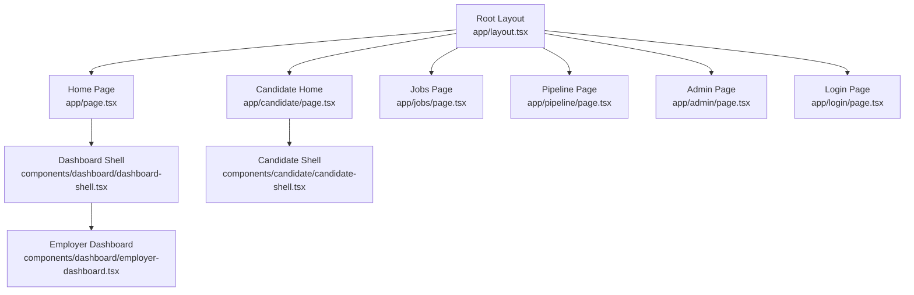
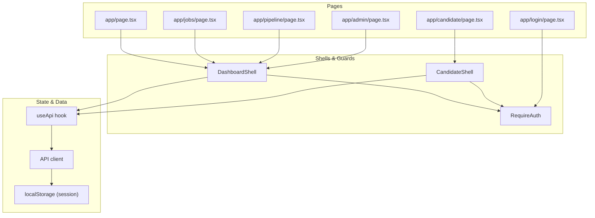
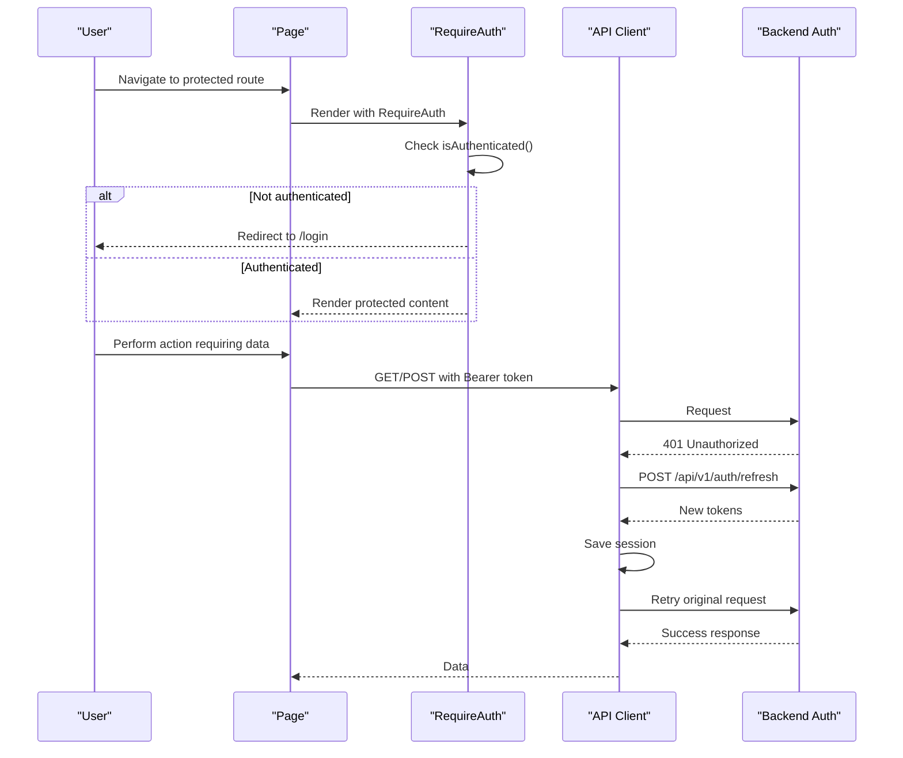
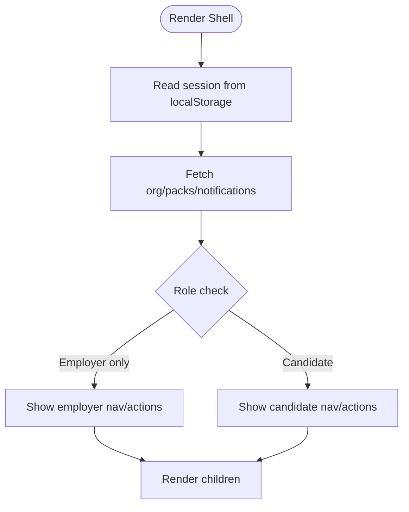
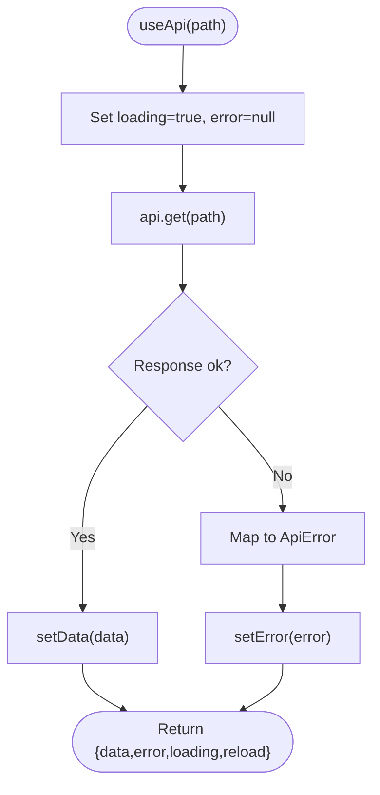
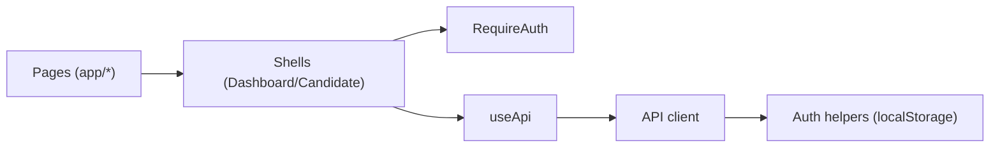

# Application Architecture

<cite>
**Referenced Files in This Document**
- [next.config.ts](file://Frontend/next.config.ts)
- [layout.tsx](file://Frontend/app/layout.tsx)
- [page.tsx](file://Frontend/app/page.tsx)
- [package.json](file://Frontend/package.json)
- [auth.ts](file://Frontend/lib/auth.ts)
- [api.ts](file://Frontend/lib/api.ts)
- [dashboard-shell.tsx](file://Frontend/components/dashboard/dashboard-shell.tsx)
- [candidate-shell.tsx](file://Frontend/components/candidate/candidate-shell.tsx)
- [require-auth.tsx](file://Frontend/components/auth/require-auth.tsx)
- [employer-dashboard.tsx](file://Frontend/components/dashboard/employer-dashboard.tsx)
- [candidate-overview.tsx](file://Frontend/components/candidate/candidate-overview.tsx)
- [use-api.ts](file://Frontend/lib/use-api.ts)
- [jobs-page.tsx](file://Frontend/app/jobs/page.tsx)
- [pipeline-page.tsx](file://Frontend/app/pipeline/page.tsx)
- [admin-page.tsx](file://Frontend/app/admin/page.tsx)
- [login-page.tsx](file://Frontend/app/login/page.tsx)
- [persona.ts](file://Frontend/lib/persona.ts)
</cite>

## Table of Contents
1. [Introduction](#introduction)
2. [Project Structure](#project-structure)
3. [Core Components](#core-components)
4. [Architecture Overview](#architecture-overview)
5. [Detailed Component Analysis](#detailed-component-analysis)
6. [Dependency Analysis](#dependency-analysis)
7. [Performance Considerations](#performance-considerations)
8. [Troubleshooting Guide](#troubleshooting-guide)
9. [Conclusion](#conclusion)
10. [Appendices](#appendices)

## Introduction
This document describes the Next.js frontend application architecture for a hiring platform with distinct experiences for candidates, employers, and administrators. It explains routing patterns using the Next.js App Router, shell components that provide role-based layouts, API integration including authentication flow and error handling, state management via React hooks and local storage, and strategies for performance and extensibility.

## Project Structure
The application uses the Next.js App Router with file-based routing under app/. The root layout defines global metadata and loads global styles. Feature areas are organized by persona:
- Employer workspace: / (dashboard), /jobs, /pipeline, /talent, /admin
- Candidate portal: /candidate/*
- Public flows: /login, /register/*
- Interview rooms: /interviews/[roomName]

**Diagram sources**
- [layout.tsx:1-17](file://Frontend/app/layout.tsx#L1-L17)
- [page.tsx:1-7](file://Frontend/app/page.tsx#L1-L7)
- [dashboard-shell.tsx:1-178](file://Frontend/components/dashboard/dashboard-shell.tsx#L1-L178)
- [employer-dashboard.tsx:1-193](file://Frontend/components/dashboard/employer-dashboard.tsx#L1-L193)
- [candidate-shell.tsx:1-93](file://Frontend/components/candidate/candidate-shell.tsx#L1-L93)
- [jobs-page.tsx:1-18](file://Frontend/app/jobs/page.tsx#L1-L18)
- [pipeline-page.tsx:1-18](file://Frontend/app/pipeline/page.tsx#L1-L18)
- [admin-page.tsx:1-14](file://Frontend/app/admin/page.tsx#L1-L14)
- [login-page.tsx:1-9](file://Frontend/app/login/page.tsx#L1-L9)

**Section sources**
- [next.config.ts:1-8](file://Frontend/next.config.ts#L1-L8)
- [layout.tsx:1-17](file://Frontend/app/layout.tsx#L1-L17)
- [page.tsx:1-7](file://Frontend/app/page.tsx#L1-L7)
- [package.json:1-36](file://Frontend/package.json#L1-L36)

## Core Components
- Root layout sets site metadata and global CSS.
- Shell components encapsulate navigation, user info, and role-based access:
  - DashboardShell for employer/admin routes
  - CandidateShell for candidate routes
- RequireAuth enforces authentication and optional employer-only access.
- API layer provides typed fetch wrappers, token refresh, and error mapping.
- useApi hook centralizes data fetching with loading/error states.

Key responsibilities:
- Routing and page composition live in app/*.tsx files.
- UI shells provide consistent chrome and guard protected routes.
- API utilities handle auth tokens, refresh flows, and form uploads.
- Hooks abstract data fetching to keep pages declarative.

**Section sources**
- [layout.tsx:1-17](file://Frontend/app/layout.tsx#L1-L17)
- [dashboard-shell.tsx:1-178](file://Frontend/components/dashboard/dashboard-shell.tsx#L1-L178)
- [candidate-shell.tsx:1-93](file://Frontend/components/candidate/candidate-shell.tsx#L1-L93)
- [require-auth.tsx:1-42](file://Frontend/components/auth/require-auth.tsx#L1-L42)
- [api.ts:1-199](file://Frontend/lib/api.ts#L1-L199)
- [use-api.ts:1-34](file://Frontend/lib/use-api.ts#L1-L34)

## Architecture Overview
The frontend follows a layered architecture:
- Presentation: Pages compose shells and feature components.
- State: Local component state plus localStorage for session persistence.
- Data: Centralized API client with automatic token refresh and error normalization.
- Auth: Client-side guards and server-validated sessions via tokens.

**Diagram sources**
- [page.tsx:1-7](file://Frontend/app/page.tsx#L1-L7)
- [dashboard-shell.tsx:1-178](file://Frontend/components/dashboard/dashboard-shell.tsx#L1-L178)
- [candidate-shell.tsx:1-93](file://Frontend/components/candidate/candidate-shell.tsx#L1-L93)
- [require-auth.tsx:1-42](file://Frontend/components/auth/require-auth.tsx#L1-L42)
- [use-api.ts:1-34](file://Frontend/lib/use-api.ts#L1-L34)
- [api.ts:1-199](file://Frontend/lib/api.ts#L1-L199)

## Detailed Component Analysis

### Authentication Flow
- Login registers or authenticates users and persists tokens and session metadata in localStorage.
- Subsequent requests attach Authorization headers; 401 triggers a single refresh attempt and retries once.
- Logout clears local session and optionally revokes refresh token on the server.

**Diagram sources**
- [require-auth.tsx:1-42](file://Frontend/components/auth/require-auth.tsx#L1-L42)
- [api.ts:25-104](file://Frontend/lib/api.ts#L25-L104)
- [api.ts:157-188](file://Frontend/lib/api.ts#L157-L188)
- [auth.ts:26-69](file://Frontend/lib/auth.ts#L26-L69)

**Section sources**
- [api.ts:25-104](file://Frontend/lib/api.ts#L25-L104)
- [api.ts:157-188](file://Frontend/lib/api.ts#L157-L188)
- [auth.ts:26-69](file://Frontend/lib/auth.ts#L26-L69)
- [require-auth.tsx:1-42](file://Frontend/components/auth/require-auth.tsx#L1-L42)

### Shell Components and Role-Based Experiences
- DashboardShell wraps employer/admin routes with sidebar navigation, tenant context, notifications, and logout. It enforces employer-only access when needed.
- CandidateShell wraps candidate routes with top navigation, pack badge, unread notifications, and logout.
- Both shells read current session from localStorage and fetch lightweight metadata (e.g., organization name, packs, notifications).

**Diagram sources**
- [dashboard-shell.tsx:1-178](file://Frontend/components/dashboard/dashboard-shell.tsx#L1-L178)
- [candidate-shell.tsx:1-93](file://Frontend/components/candidate/candidate-shell.tsx#L1-L93)
- [require-auth.tsx:1-42](file://Frontend/components/auth/require-auth.tsx#L1-L42)

**Section sources**
- [dashboard-shell.tsx:1-178](file://Frontend/components/dashboard/dashboard-shell.tsx#L1-L178)
- [candidate-shell.tsx:1-93](file://Frontend/components/candidate/candidate-shell.tsx#L1-L93)
- [require-auth.tsx:1-42](file://Frontend/components/auth/require-auth.tsx#L1-L42)

### Data Fetching Strategy and Error Handling
- useApi provides a simple pattern: call with a path, receive {data, error, loading, reload}.
- api.get/post/patch/put/delete wrap fetch with JSON serialization, headers, and no-store caching.
- Errors are normalized into ApiError with status, code, and message; UI components render LoadingState, EmptyState, and ErrorState consistently.

**Diagram sources**
- [use-api.ts:1-34](file://Frontend/lib/use-api.ts#L1-L34)
- [api.ts:59-104](file://Frontend/lib/api.ts#L59-L104)

**Section sources**
- [use-api.ts:1-34](file://Frontend/lib/use-api.ts#L1-L34)
- [api.ts:59-104](file://Frontend/lib/api.ts#L59-L104)

### Routing Patterns and Page Composition
- File-based routes map directly to URL paths.
- Suspense is used around heavy components to show loading placeholders.
- Shells are composed at the page level to provide consistent chrome and guards.

Examples:
- Employer dashboard: / renders DashboardShell + EmployerDashboard
- Jobs and Pipeline: /jobs and /pipeline wrap their features in Suspense within DashboardShell
- Candidate home: /candidate renders CandidateShell + CandidateOverview
- Admin: /admin renders DashboardShell + AdminPage
- Login: /login renders LoginForm without shell

**Section sources**
- [page.tsx:1-7](file://Frontend/app/page.tsx#L1-L7)
- [jobs-page.tsx:1-18](file://Frontend/app/jobs/page.tsx#L1-L18)
- [pipeline-page.tsx:1-18](file://Frontend/app/pipeline/page.tsx#L1-L18)
- [admin-page.tsx:1-14](file://Frontend/app/admin/page.tsx#L1-L14)
- [login-page.tsx:1-9](file://Frontend/app/login/page.tsx#L1-L9)

### State Management and Persistence
- Session persistence: Access token, refresh token, and full session object stored in localStorage keys.
- Persona simulation: A small identity store allows switching between personas for development/testing.
- Component state: Each page/shell manages local UI state (e.g., mobile menu, unread counts).

**Section sources**
- [auth.ts:26-69](file://Frontend/lib/auth.ts#L26-L69)
- [persona.ts:1-39](file://Frontend/lib/persona.ts#L1-L39)

## Dependency Analysis
- Pages depend on shells for layout and guards.
- Shells depend on RequireAuth and API client for metadata and actions.
- Features depend on useApi for data fetching.
- API client depends on auth helpers for token retrieval and session persistence.

**Diagram sources**
- [page.tsx:1-7](file://Frontend/app/page.tsx#L1-L7)
- [dashboard-shell.tsx:1-178](file://Frontend/components/dashboard/dashboard-shell.tsx#L1-L178)
- [candidate-shell.tsx:1-93](file://Frontend/components/candidate/candidate-shell.tsx#L1-L93)
- [require-auth.tsx:1-42](file://Frontend/components/auth/require-auth.tsx#L1-L42)
- [use-api.ts:1-34](file://Frontend/lib/use-api.ts#L1-L34)
- [api.ts:1-199](file://Frontend/lib/api.ts#L1-L199)
- [auth.ts:1-70](file://Frontend/lib/auth.ts#L1-L70)

**Section sources**
- [api.ts:1-199](file://Frontend/lib/api.ts#L1-L199)
- [auth.ts:1-70](file://Frontend/lib/auth.ts#L1-L70)
- [use-api.ts:1-34](file://Frontend/lib/use-api.ts#L1-L34)

## Performance Considerations
- Build configuration enables React Strict Mode for improved development experience.
- Use Suspense boundaries around data-heavy components to improve perceived performance.
- Prefer client-side data fetching via useApi for interactive pages; avoid unnecessary re-renders by memoizing derived values where appropriate.
- Keep shell metadata calls lightweight; consider debouncing or conditional fetching based on route changes.
- Leverage browser caching policies by setting cache: "no-store" for dynamic endpoints to ensure fresh data.

[No sources needed since this section provides general guidance]

## Troubleshooting Guide
Common issues and resolutions:
- Network unreachable: The API client throws a network error when the backend is not reachable. Ensure the backend service is running and accessible at the configured base URL.
- 401 Unauthorized: The client automatically attempts a token refresh once. If refresh fails, the session is cleared and the user is redirected to login.
- Stale session data: Clearing or corrupting localStorage can cause inconsistent behavior. Re-login to restore a valid session.
- Missing permissions: Employer-only routes redirect to the candidate portal if the user lacks an employer membership.

Operational tips:
- Verify environment variables for API base URL.
- Inspect localStorage keys for session presence and validity.
- Use browser dev tools to monitor network requests and responses.

**Section sources**
- [api.ts:25-104](file://Frontend/lib/api.ts#L25-L104)
- [api.ts:157-188](file://Frontend/lib/api.ts#L157-L188)
- [auth.ts:26-69](file://Frontend/lib/auth.ts#L26-L69)
- [require-auth.tsx:1-42](file://Frontend/components/auth/require-auth.tsx#L1-L42)

## Conclusion
The frontend architecture separates concerns cleanly: pages focus on composition, shells provide consistent UX and guards, and the API layer centralizes networking and auth. This design supports multiple personas, simplifies adding new features, and maintains consistency across the application. Extending the system involves creating new pages, composing them with appropriate shells, and using the existing API and state patterns.

[No sources needed since this section summarizes without analyzing specific files]

## Appendices

### Deployment and Build Configuration
- Development scripts: dev, build, start, lint, typecheck, test.
- Production builds use Next.js defaults; ensure environment variables are set for API base URL and any integrations.
- Global styles and third-party styles (e.g., LiveKit) are imported at the root layout.

**Section sources**
- [package.json:1-36](file://Frontend/package.json#L1-L36)
- [layout.tsx:1-17](file://Frontend/app/layout.tsx#L1-L17)
- [next.config.ts:1-8](file://Frontend/next.config.ts#L1-L8)

### Extending the Architecture
- Add a new persona or role:
  - Create a new shell component mirroring the pattern of DashboardShell/CandidateShell.
  - Wrap new routes with the shell and RequireAuth with appropriate role checks.
- Add a new feature page:
  - Create a page under app/<feature>/page.tsx.
  - Compose with the appropriate shell and use Suspense for heavy components.
  - Implement data fetching with useApi and handle loading/error states with shared UI components.
- Integrate new APIs:
  - Extend the API client methods or add domain-specific helpers.
  - Normalize errors and handle token refresh transparently.
- Maintain consistency:
  - Follow naming conventions for components and hooks.
  - Use shared UI primitives for buttons, tables, pills, and states.
  - Keep metadata consistent in each page’s export.

**Section sources**
- [dashboard-shell.tsx:1-178](file://Frontend/components/dashboard/dashboard-shell.tsx#L1-L178)
- [candidate-shell.tsx:1-93](file://Frontend/components/candidate/candidate-shell.tsx#L1-L93)
- [use-api.ts:1-34](file://Frontend/lib/use-api.ts#L1-L34)
- [api.ts:1-199](file://Frontend/lib/api.ts#L1-L199)
- [employer-dashboard.tsx:1-193](file://Frontend/components/dashboard/employer-dashboard.tsx#L1-L193)
- [candidate-overview.tsx:1-179](file://Frontend/components/candidate/candidate-overview.tsx#L1-L179)