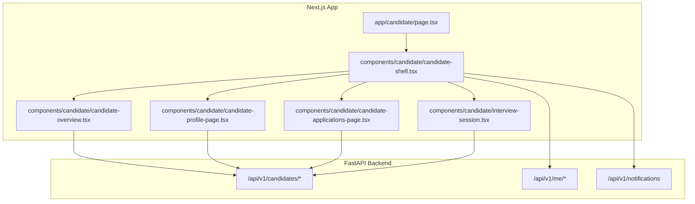
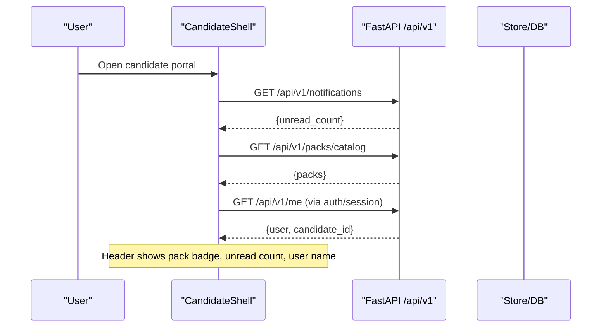
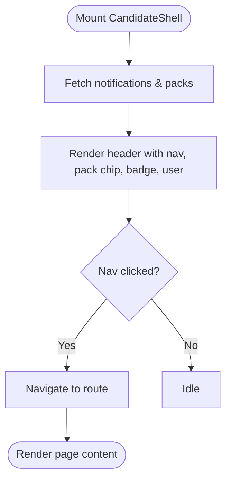
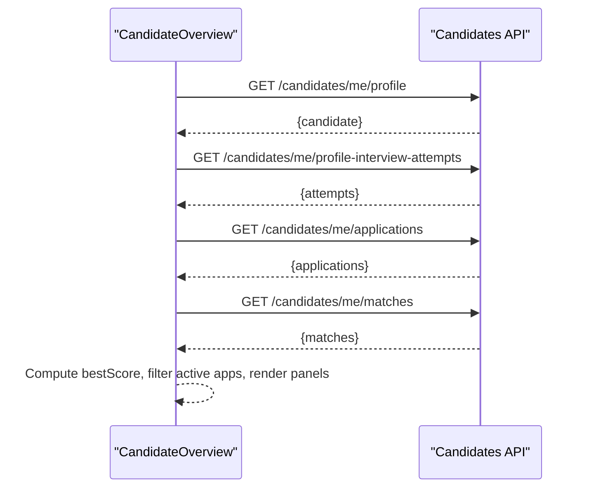
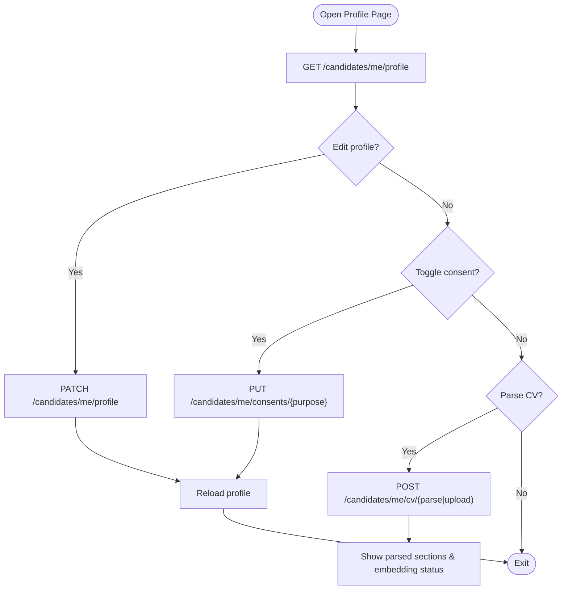
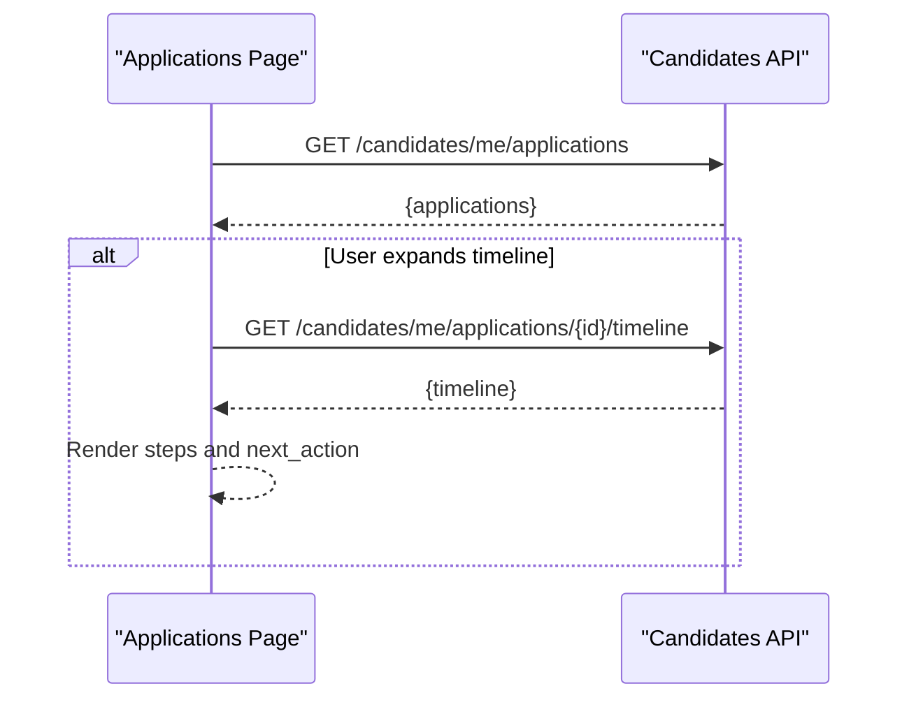
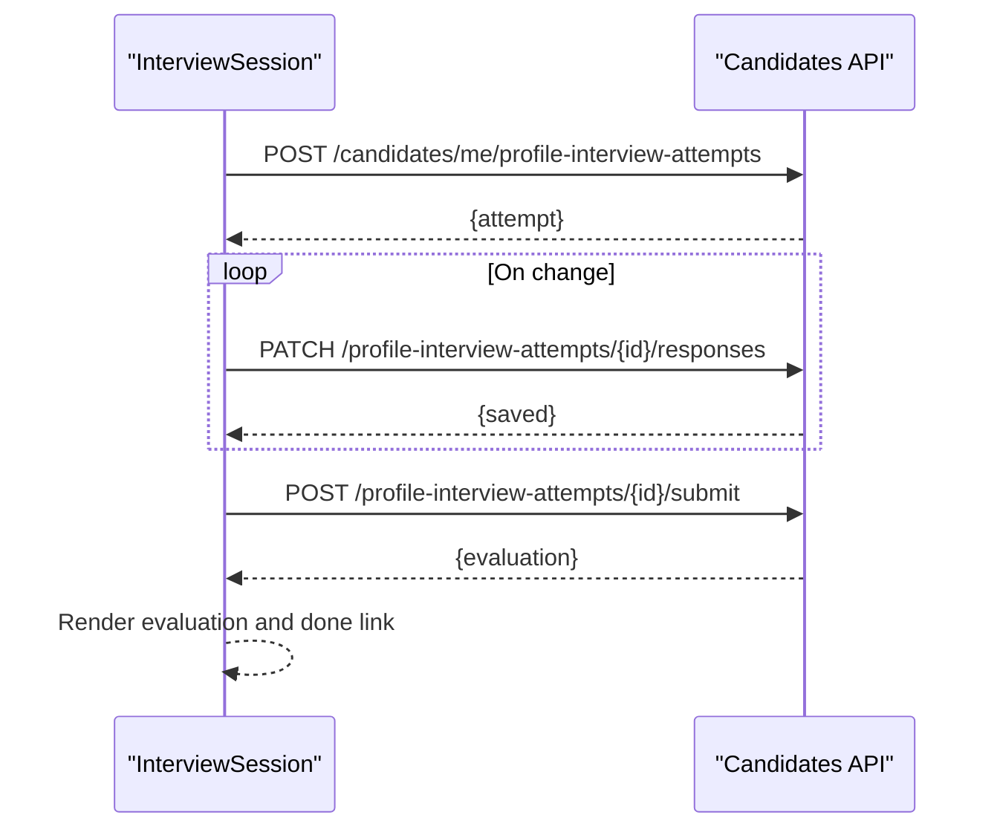
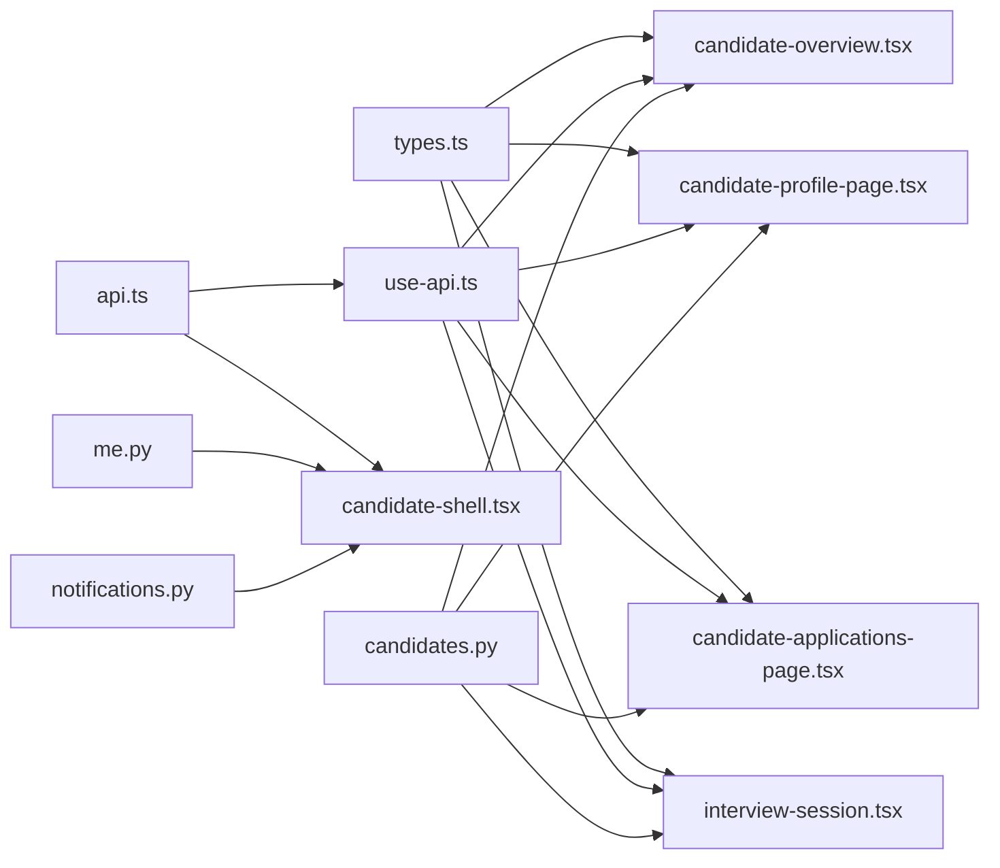

# Candidate Dashboard

<cite>
**Referenced Files in This Document**
- [candidate-shell.tsx](file://Frontend/components/candidate/candidate-shell.tsx)
- [candidate-overview.tsx](file://Frontend/components/candidate/candidate-overview.tsx)
- [candidate-profile-page.tsx](file://Frontend/components/candidate/candidate-profile-page.tsx)
- [candidate-applications-page.tsx](file://Frontend/components/candidate/candidate-applications-page.tsx)
- [interview-session.tsx](file://Frontend/components/candidate/interview-session.tsx)
- [page.tsx (candidate home)](file://Frontend/app/candidate/page.tsx)
- [page.tsx (profile)](file://Frontend/app/candidate/profile/page.tsx)
- [page.tsx (applications)](file://Frontend/app/candidate/applications/page.tsx)
- [page.tsx (jobs)](file://Frontend/app/candidate/jobs/page.tsx)
- [types.ts](file://Frontend/lib/types.ts)
- [use-api.ts](file://Frontend/lib/use-api.ts)
- [api.ts](file://Frontend/lib/api.ts)
- [candidates.py](file://Backend/app/api/v1/candidates.py)
- [me.py](file://Backend/app/api/v1/me.py)
- [notifications.py](file://Backend/app/api/v1/notifications.py)
</cite>

## Table of Contents
1. Introduction
2. Project Structure
3. Core Components
4. Architecture Overview
5. Detailed Component Analysis
6. Dependency Analysis
7. Performance Considerations
8. Troubleshooting Guide
9. Conclusion
10. Appendices

## Introduction
This document explains the candidate dashboard system that provides job seekers with a personal hiring workspace. It focuses on:
- The candidate shell component for navigation, profile management, and application tracking
- The candidate overview features including application status monitoring, interview scheduling, profile completion indicators, and personalized job recommendations
- Responsive design patterns, user experience flows, and integration with backend services
- Guidance for extending functionality, adding profile sections, and implementing notifications and alerts

## Project Structure
The candidate portal is implemented as a Next.js client application with a FastAPI backend. Key areas:
- Frontend pages under app/candidate wrap content in a shared CandidateShell
- Candidate components render overview, profile, applications, and interviews
- Backend endpoints expose candidate-specific data and actions

**Diagram sources**
- [page.tsx (candidate home):1-14](file://Frontend/app/candidate/page.tsx#L1-L14)
- [candidate-shell.tsx:1-93](file://Frontend/components/candidate/candidate-shell.tsx#L1-L93)
- [candidate-overview.tsx:1-179](file://Frontend/components/candidate/candidate-overview.tsx#L1-L179)
- [candidate-profile-page.tsx:1-295](file://Frontend/components/candidate/candidate-profile-page.tsx#L1-L295)
- [candidate-applications-page.tsx:1-120](file://Frontend/components/candidate/candidate-applications-page.tsx#L1-L120)
- [interview-session.tsx:1-332](file://Frontend/components/candidate/interview-session.tsx#L1-L332)
- [candidates.py:147-482](file://Backend/app/api/v1/candidates.py#L147-L482)
- [me.py:22-110](file://Backend/app/api/v1/me.py#L22-L110)
- [notifications.py:11-27](file://Backend/app/api/v1/notifications.py#L11-L27)

**Section sources**
- [page.tsx (candidate home):1-14](file://Frontend/app/candidate/page.tsx#L1-L14)
- [page.tsx (profile):1-14](file://Frontend/app/candidate/profile/page.tsx#L1-L14)
- [page.tsx (applications):1-14](file://Frontend/app/candidate/applications/page.tsx#L1-L14)
- [page.tsx (jobs):1-14](file://Frontend/app/candidate/jobs/page.tsx#L1-L14)

## Core Components
- CandidateShell: Provides authenticated navigation, header branding, pack badge, unread notification count, user display name, and sign-out. It wraps all candidate pages behind RequireAuth and fetches notifications and packs catalog on mount.
- CandidateOverview: Aggregates profile, interview attempts, active applications, and suggested jobs. Displays best score from attempts, profile summary, discovery consent, and links to start or resume interviews.
- CandidateProfilePage: Edits headline, summary, skills, credentials; toggles privacy consents; parses and embeds CV text or file; shows parsed preview and matching index readiness.
- CandidateApplicationsPage: Lists applications with status pills, AI match score when available, and per-application timeline with next action hints. Supports opening/closing timelines.
- InterviewSession: Reusable session UI for scenario interviews with autosave, progress indicator, submission flow, idempotent submit, and evaluation results. Includes loaders for profile interviews and applied interviews.

**Section sources**
- [candidate-shell.tsx:11-93](file://Frontend/components/candidate/candidate-shell.tsx#L11-L93)
- [candidate-overview.tsx:10-179](file://Frontend/components/candidate/candidate-overview.tsx#L10-L179)
- [candidate-profile-page.tsx:11-295](file://Frontend/components/candidate/candidate-profile-page.tsx#L11-L295)
- [candidate-applications-page.tsx:10-120](file://Frontend/components/candidate/candidate-applications-page.tsx#L10-L120)
- [interview-session.tsx:13-332](file://Frontend/components/candidate/interview-session.tsx#L13-L332)

## Architecture Overview
The candidate dashboard follows a clear separation between UI and API:
- Client uses a typed useApi hook to fetch data and handle loading/error states
- api.ts centralizes HTTP calls, token injection, refresh-on-401, and error mapping
- Backend exposes candidate-specific endpoints for profile, CV parsing/embedding, interview attempts, and consents
- Notifications and identity/avatar endpoints support shell actions and profile enhancements

**Diagram sources**
- [candidate-shell.tsx:25-35](file://Frontend/components/candidate/candidate-shell.tsx#L25-L35)
- [notifications.py:11-17](file://Backend/app/api/v1/notifications.py#L11-L17)
- [me.py:22-61](file://Backend/app/api/v1/me.py#L22-L61)

## Detailed Component Analysis

### Candidate Shell
Responsibilities:
- Enforces authentication via RequireAuth
- Renders top navigation with active state detection
- Loads unread notifications and current pack name
- Displays user info and sign-out action

Key behaviors:
- Active link highlighting based on pathname
- Badge showing unread notification count
- Pack chip displaying domain pack context
- Sign-out clears session and redirects to login

**Diagram sources**
- [candidate-shell.tsx:18-84](file://Frontend/components/candidate/candidate-shell.tsx#L18-L84)

**Section sources**
- [candidate-shell.tsx:11-93](file://Frontend/components/candidate/candidate-shell.tsx#L11-L93)

### Candidate Overview
Features:
- Profile Screening panel with best score and attempt list
- Profile summary with edit link
- Suggested jobs with scores and reasons
- Active applications with status and interview completion link

Data sources:
- Profile: GET /api/v1/candidates/me/profile
- Attempts: GET /api/v1/candidates/me/profile-interview-attempts
- Applications: GET /api/v1/candidates/me/applications
- Matches: GET /api/v1/candidates/me/matches

UX notes:
- Loading and error states handled by useApi
- Empty states guide users to take screening or browse jobs
- Links to resume or start interviews based on attempt status

**Diagram sources**
- [candidate-overview.tsx:10-179](file://Frontend/components/candidate/candidate-overview.tsx#L10-L179)
- [candidates.py:147-189](file://Backend/app/api/v1/candidates.py#L147-L189)
- [candidates.py:268-287](file://Backend/app/api/v1/candidates.py#L268-L287)

**Section sources**
- [candidate-overview.tsx:10-179](file://Frontend/components/candidate/candidate-overview.tsx#L10-L179)

### Candidate Profile Page
Capabilities:
- Edit profile fields (headline, summary, skills, credentials)
- Toggle privacy consents (discovery, application_processing)
- Parse and embed CV from file or pasted text
- Preview structured CV sections and embedding status

Backend interactions:
- PATCH /candidates/me/profile updates profile and refreshes embedding
- PUT /candidates/me/consents/{purpose} toggles consent flags
- POST /candidates/me/cv/parse or /cv/upload parses and embeds CV

**Diagram sources**
- [candidate-profile-page.tsx:41-112](file://Frontend/components/candidate/candidate-profile-page.tsx#L41-L112)
- [candidates.py:162-189](file://Backend/app/api/v1/candidates.py#L162-L189)
- [candidates.py:248-265](file://Backend/app/api/v1/candidates.py#L248-L265)
- [candidates.py:198-241](file://Backend/app/api/v1/candidates.py#L198-L241)

**Section sources**
- [candidate-profile-page.tsx:11-295](file://Frontend/components/candidate/candidate-profile-page.tsx#L11-L295)

### Candidate Applications Page
Capabilities:
- List applications with status and dates
- Show AI match score when provided
- Expandable timeline per application with steps and next action
- Link to complete interview if invited or in progress

Timeline details:
- Fetches per-application timeline via GET /candidates/me/applications/{id}/timeline
- Displays completed/current/upcoming steps with timestamps

**Diagram sources**
- [candidate-applications-page.tsx:10-120](file://Frontend/components/candidate/candidate-applications-page.tsx#L10-L120)

**Section sources**
- [candidate-applications-page.tsx:10-120](file://Frontend/components/candidate/candidate-applications-page.tsx#L10-L120)

### Interview Session
Capabilities:
- Autosave responses with debounced flush
- Track answered questions and show progress
- Submit with idempotency key to prevent duplicate submissions
- Display evaluation results with dimension scores, strengths, and gaps
- Loaders for profile interviews and applied interviews

Flow highlights:
- Start profile interview by selecting a domain pack
- Resume in-progress attempts automatically
- Applied interview loader retrieves job-specific interview

**Diagram sources**
- [interview-session.tsx:184-279](file://Frontend/components/candidate/interview-session.tsx#L184-L279)
- [candidates.py:294-362](file://Backend/app/api/v1/candidates.py#L294-L362)
- [candidates.py:392-422](file://Backend/app/api/v1/candidates.py#L392-L422)
- [candidates.py:429-481](file://Backend/app/api/v1/candidates.py#L429-L481)

**Section sources**
- [interview-session.tsx:13-332](file://Frontend/components/candidate/interview-session.tsx#L13-L332)

## Dependency Analysis
Client-side dependencies:
- use-api.ts provides a uniform hook for fetching data with loading/error states
- api.ts handles authentication, token refresh, and error mapping
- types.ts defines shared contracts for candidates, applications, interviews, and more

Backend dependencies:
- candidates.py implements candidate profile, CV parsing/embedding, consents, and interview attempts
- me.py provides user identity and avatar endpoints used by shell and profile
- notifications.py supplies unread counts for the shell badge

**Diagram sources**
- [types.ts:1-267](file://Frontend/lib/types.ts#L1-L267)
- [use-api.ts:1-34](file://Frontend/lib/use-api.ts#L1-L34)
- [api.ts:1-199](file://Frontend/lib/api.ts#L1-L199)
- [candidates.py:147-482](file://Backend/app/api/v1/candidates.py#L147-L482)
- [me.py:22-110](file://Backend/app/api/v1/me.py#L22-L110)
- [notifications.py:11-27](file://Backend/app/api/v1/notifications.py#L11-L27)

**Section sources**
- [types.ts:1-267](file://Frontend/lib/types.ts#L1-L267)
- [use-api.ts:1-34](file://Frontend/lib/use-api.ts#L1-L34)
- [api.ts:1-199](file://Frontend/lib/api.ts#L1-L199)
- [candidates.py:147-482](file://Backend/app/api/v1/candidates.py#L147-L482)
- [me.py:22-110](file://Backend/app/api/v1/me.py#L22-L110)
- [notifications.py:11-27](file://Backend/app/api/v1/notifications.py#L11-L27)

## Performance Considerations
- Debounced autosave in interview sessions reduces network churn while typing
- Idempotent submission keys prevent duplicate evaluations on retries
- Embedding refresh after profile or CV updates ensures matching stays current
- Lightweight shell requests (notifications, packs) minimize initial load overhead
- Use of loading/error states avoids unnecessary re-renders and improves perceived performance

[No sources needed since this section provides general guidance]

## Troubleshooting Guide
Common issues and resolutions:
- Network unreachable: Ensure backend is running and reachable at configured base URL
- 401 Unauthorized: Token refresh is automatic; if it fails, session is cleared and user redirected to login
- Attempt cooldown or cap: Retaking profile interviews may be blocked until cooldown expires or cap reached
- Unknown question IDs: Responses must reference questions included in the current attempt
- Missing timeline or not found: Verify attempt/application IDs and permissions

Relevant endpoints and behaviors:
- Notification count retrieval and marking read
- Profile update and embedding refresh
- CV parse/upload errors and feedback
- Interview attempt lifecycle and idempotent submit

**Section sources**
- [api.ts:25-57](file://Frontend/lib/api.ts#L25-L57)
- [api.ts:86-103](file://Frontend/lib/api.ts#L86-L103)
- [api.ts:128-145](file://Frontend/lib/api.ts#L128-L145)
- [candidates.py:317-338](file://Backend/app/api/v1/candidates.py#L317-L338)
- [candidates.py:404-419](file://Backend/app/api/v1/candidates.py#L404-L419)
- [notifications.py:11-27](file://Backend/app/api/v1/notifications.py#L11-L27)

## Conclusion
The candidate dashboard delivers a cohesive hiring workspace with:
- A robust shell for navigation, notifications, and session management
- An overview that surfaces profile screening, applications, and job matches
- A comprehensive profile editor with CV parsing and embedding
- Application tracking with timelines and next actions
- A resilient interview flow with autosave and idempotent submission
Extending the system involves adding new profile fields, integrating additional packs, and wiring up new notification types through existing hooks and endpoints.

[No sources needed since this section summarizes without analyzing specific files]

## Appendices

### Extending Candidate Functionality
- Add new profile sections:
  - Extend CandidateProfile type and backend response shape
  - Add form fields in CandidateProfilePage and map to PATCH payload
  - Update backend validation and store updates
- Implement candidate-specific notifications:
  - Create or extend backend endpoints to list/mark notifications
  - Wire into CandidateShell to fetch and display badges
  - Provide user actions to mark items read or navigate to details
- Integrate new interview types:
  - Define new attempt endpoints similar to profile interviews
  - Reuse InterviewSession with custom loaders and save/submit handlers
  - Persist and evaluate responses using existing evaluation pipeline

[No sources needed since this section provides general guidance]