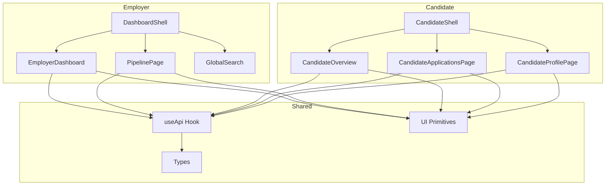
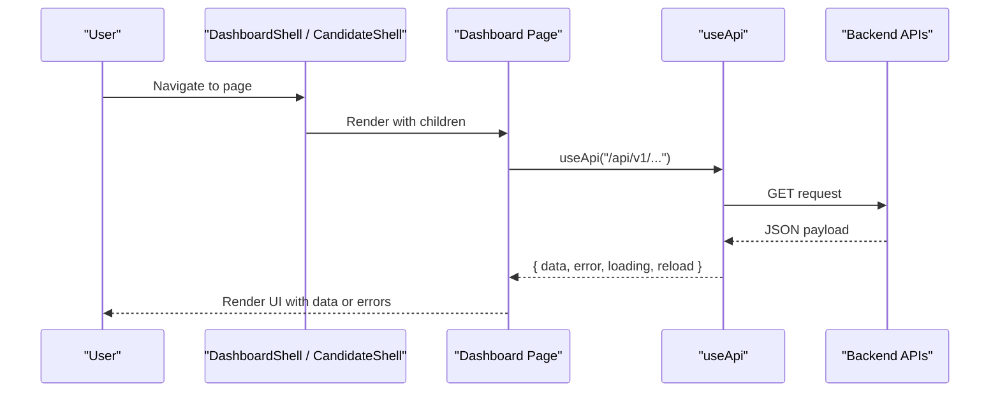
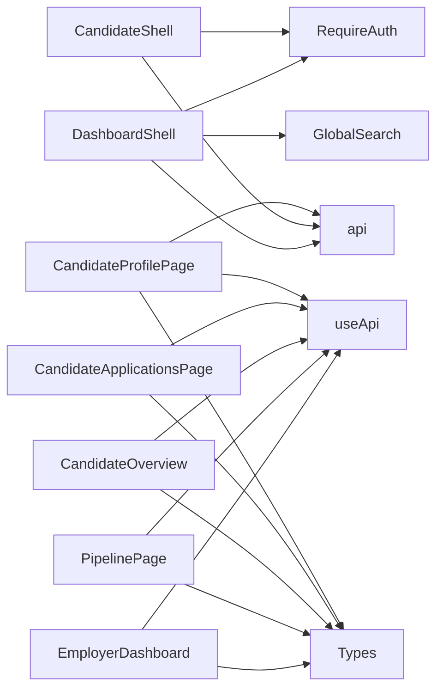

# Dashboard Components

<cite>
**Referenced Files in This Document**
- [dashboard-shell.tsx](file://Frontend/components/dashboard/dashboard-shell.tsx)
- [employer-dashboard.tsx](file://Frontend/components/dashboard/employer-dashboard.tsx)
- [global-search.tsx](file://Frontend/components/dashboard/global-search.tsx)
- [candidate-shell.tsx](file://Frontend/components/candidate/candidate-shell.tsx)
- [candidate-overview.tsx](file://Frontend/components/candidate/candidate-overview.tsx)
- [candidate-applications-page.tsx](file://Frontend/components/candidate/candidate-applications-page.tsx)
- [candidate-profile-page.tsx](file://Frontend/components/candidate/candidate-profile-page.tsx)
- [pipeline-page.tsx](file://Frontend/components/pipeline/pipeline-page.tsx)
- [attention-queue-card.tsx](file://Frontend/components/ui/attention-queue-card.tsx)
- [use-api.ts](file://Frontend/lib/use-api.ts)
- [types.ts](file://Frontend/lib/types.ts)
- [layout.tsx](file://Frontend/app/layout.tsx)
</cite>

## Table of Contents
1. [Introduction](#introduction)
2. [Project Structure](#project-structure)
3. [Core Components](#core-components)
4. [Architecture Overview](#architecture-overview)
5. [Detailed Component Analysis](#detailed-component-analysis)
6. [Dependency Analysis](#dependency-analysis)
7. [Performance Considerations](#performance-considerations)
8. [Troubleshooting Guide](#troubleshooting-guide)
9. [Conclusion](#conclusion)
10. [Appendices](#appendices)

## Introduction
This document explains the role-specific dashboard components for employers and candidates, including shell layouts that manage navigation and user context, employer features (job management, candidate pipeline, analytics), candidate features (applications, profile management, interview scheduling), global search with filtering and results presentation, responsive design patterns, data visualization components, interactive elements, and guidance for extending dashboards and integrating with backend data sources.

## Project Structure
The frontend organizes dashboards by role:
- Employer workspace shell and dashboard live under Frontend/components/dashboard.
- Candidate portal shell and pages live under Frontend/components/candidate.
- Shared UI primitives are under Frontend/components/ui.
- Data fetching is centralized via a client-side hook in Frontend/lib/use-api.ts.
- Types define contracts between UI and API responses in Frontend/lib/types.ts.
- The root layout sets metadata and global styles in Frontend/app/layout.tsx.

**Diagram sources**
- [dashboard-shell.tsx:1-178](file://Frontend/components/dashboard/dashboard-shell.tsx#L1-L178)
- [employer-dashboard.tsx:1-193](file://Frontend/components/dashboard/employer-dashboard.tsx#L1-L193)
- [pipeline-page.tsx:1-329](file://Frontend/components/pipeline/pipeline-page.tsx#L1-L329)
- [global-search.tsx:1-154](file://Frontend/components/dashboard/global-search.tsx#L1-L154)
- [candidate-shell.tsx:1-93](file://Frontend/components/candidate/candidate-shell.tsx#L1-L93)
- [candidate-overview.tsx:1-179](file://Frontend/components/candidate/candidate-overview.tsx#L1-L179)
- [candidate-applications-page.tsx:1-120](file://Frontend/components/candidate/candidate-applications-page.tsx#L1-L120)
- [candidate-profile-page.tsx:1-295](file://Frontend/components/candidate/candidate-profile-page.tsx#L1-L295)
- [use-api.ts:1-34](file://Frontend/lib/use-api.ts#L1-L34)
- [types.ts:1-267](file://Frontend/lib/types.ts#L1-L267)

**Section sources**
- [layout.tsx:1-17](file://Frontend/app/layout.tsx#L1-L17)

## Core Components
- DashboardShell: Employer-only authenticated shell providing sidebar navigation, topbar actions, organization context, pack badge, notifications, and mobile menu. It wraps content with RequireAuth to enforce employer access.
- EmployerDashboard: Aggregates analytics, active requisitions, attention queue, recent activity, and next actions using useApi hooks.
- GlobalSearch: Debounced search across jobs and applications with keyboard shortcut and result panel.
- CandidateShell: Candidate-only authenticated shell with top navigation, pack badge, notification count, and sign-out.
- CandidateOverview: Displays skill profile screening attempts, profile summary, suggested job matches, and active applications.
- CandidateApplicationsPage: Lists applications with status badges, interview completion links, and per-application timeline expansion.
- CandidateProfilePage: Editable profile form, privacy consents, CV parsing/upload, and avatar management.
- PipelinePage: Kanban board and list view of candidate pipeline with stage transitions, filters, and application drawer.

**Section sources**
- [dashboard-shell.tsx:1-178](file://Frontend/components/dashboard/dashboard-shell.tsx#L1-L178)
- [employer-dashboard.tsx:1-193](file://Frontend/components/dashboard/employer-dashboard.tsx#L1-L193)
- [global-search.tsx:1-154](file://Frontend/components/dashboard/global-search.tsx#L1-L154)
- [candidate-shell.tsx:1-93](file://Frontend/components/candidate/candidate-shell.tsx#L1-L93)
- [candidate-overview.tsx:1-179](file://Frontend/components/candidate/candidate-overview.tsx#L1-L179)
- [candidate-applications-page.tsx:1-120](file://Frontend/components/candidate/candidate-applications-page.tsx#L1-L120)
- [candidate-profile-page.tsx:1-295](file://Frontend/components/candidate/candidate-profile-page.tsx#L1-L295)
- [pipeline-page.tsx:1-329](file://Frontend/components/pipeline/pipeline-page.tsx#L1-L329)

## Architecture Overview
The dashboards follow a consistent pattern:
- Shell components wrap pages with authentication and shared chrome (navigation, topbar).
- Pages fetch data via useApi, which encapsulates loading/error states and provides reload.
- UI primitives render reusable cards, pills, tables, and state indicators.
- Types ensure strong contracts for API payloads.

**Diagram sources**
- [dashboard-shell.tsx:96-178](file://Frontend/components/dashboard/dashboard-shell.tsx#L96-L178)
- [candidate-shell.tsx:18-93](file://Frontend/components/candidate/candidate-shell.tsx#L18-L93)
- [use-api.ts:6-34](file://Frontend/lib/use-api.ts#L6-L34)
- [employer-dashboard.tsx:18-31](file://Frontend/components/dashboard/employer-dashboard.tsx#L18-L31)
- [candidate-overview.tsx:10-20](file://Frontend/components/candidate/candidate-overview.tsx#L10-L20)

## Detailed Component Analysis

### Employer Dashboard Shell
Responsibilities:
- Enforces employer-only access via RequireAuth.
- Loads current organization name, active domain pack, and unread notifications.
- Provides primary and secondary navigation with active state detection.
- Renders topbar with global search, notifications link, and quick create action.
- Supports mobile menu toggle and accessibility skip link.

Key interactions:
- Sidebar navigation uses pathname-based active highlighting.
- Footer shows user initials, display name, role, and sign-out action.
- Topbar integrates PackChip and notification dot based on counts.

**Section sources**
- [dashboard-shell.tsx:12-178](file://Frontend/components/dashboard/dashboard-shell.tsx#L12-L178)

### Employer Dashboard Content
Features:
- Attention queue cards derived from pipeline columns and analytics.
- Active requisitions table sourced from postings endpoint with status pills and next actions.
- Recent activity feed from notifications endpoint.
- Next actions panel with time-bound tasks linking to pipeline and interviews.

Data flow:
- useApi calls: analytics/pipeline, postings, pipeline, notifications.
- Derived metrics: new applications count, interviews to score, in-flight stats.

Error handling:
- Each section renders LoadingState, ErrorState with retry, or EmptyState when appropriate.

**Section sources**
- [employer-dashboard.tsx:18-193](file://Frontend/components/dashboard/employer-dashboard.tsx#L18-L193)
- [attention-queue-card.tsx:1-38](file://Frontend/components/ui/attention-queue-card.tsx#L1-L38)

### Global Search
Behavior:
- Debounced query execution after short delay to reduce requests.
- Keyboard shortcut (⌘K/Ctrl+K) focuses input and opens panel; Escape closes it.
- Click outside closes panel.
- Results grouped into Jobs and Applications with links to detail views.

Filtering and presentation:
- Minimum character threshold before querying.
- Empty state messaging when no matches found.
- Links navigate to job details or filtered pipeline.

**Section sources**
- [global-search.tsx:20-154](file://Frontend/components/dashboard/global-search.tsx#L20-L154)

### Candidate Shell
Responsibilities:
- Wraps candidate pages with RequireAuth.
- Displays top navigation with active state based on pathname.
- Shows pack badge and unread notification count.
- Provides sign-out functionality.

**Section sources**
- [candidate-shell.tsx:11-93](file://Frontend/components/candidate/candidate-shell.tsx#L11-L93)

### Candidate Overview
Features:
- Profile Screening attempts with best score highlight and status pills.
- Profile summary with edit link to profile page.
- Suggested jobs with match scores and reasons.
- Active applications with status and interview completion links.

Data flow:
- useApi calls: candidates/me/profile, profile-interview-attempts, candidates/me/applications, candidates/me/matches.

**Section sources**
- [candidate-overview.tsx:10-179](file://Frontend/components/candidate/candidate-overview.tsx#L10-L179)

### Candidate Applications
Features:
- List of applications with organization, job title, status pill, and AI match score if available.
- Expandable timeline per application showing steps, dates, and next action.
- Interview completion button when invited or in progress.

Data flow:
- useApi call: candidates/me/applications.
- Per-application timeline via candidates/me/applications/{id}/timeline.

**Section sources**
- [candidate-applications-page.tsx:10-120](file://Frontend/components/candidate/candidate-applications-page.tsx#L10-L120)

### Candidate Profile
Features:
- Editable headline, summary, skills, credentials with save and validation feedback.
- Privacy controls toggling consents for discovery and application processing.
- CV parsing/upload supporting file or text input, structured preview, and embedding status.
- Avatar management via AvatarPanel.

Data flow:
- useApi call: candidates/me/profile.
- Direct API calls for patch profile, put consent, post parse/upload.

**Section sources**
- [candidate-profile-page.tsx:11-295](file://Frontend/components/candidate/candidate-profile-page.tsx#L11-L295)

### Pipeline
Features:
- Board and list views with filtering by posting.
- Drag-and-drop moves with validation and reason/note capture.
- Application drawer for detailed view and transitions.
- Status badges, score badges, and move menus.

Data flow:
- useApi calls: pipeline (with optional posting filter), postings.
- Transition POST to applications/{id}/transitions with idempotency key.

**Section sources**
- [pipeline-page.tsx:105-329](file://Frontend/components/pipeline/pipeline-page.tsx#L105-L329)

## Dependency Analysis
Component relationships:
- Shells depend on RequireAuth and api utilities for session and logout.
- Dashboards depend on useApi for data fetching and types for response shapes.
- UI primitives provide consistent rendering for cards, pills, tables, and state indicators.
- GlobalSearch depends on api and navigational links to jobs and pipeline.

**Diagram sources**
- [dashboard-shell.tsx:1-178](file://Frontend/components/dashboard/dashboard-shell.tsx#L1-L178)
- [employer-dashboard.tsx:1-193](file://Frontend/components/dashboard/employer-dashboard.tsx#L1-L193)
- [pipeline-page.tsx:1-329](file://Frontend/components/pipeline/pipeline-page.tsx#L1-L329)
- [candidate-shell.tsx:1-93](file://Frontend/components/candidate/candidate-shell.tsx#L1-L93)
- [candidate-overview.tsx:1-179](file://Frontend/components/candidate/candidate-overview.tsx#L1-L179)
- [candidate-applications-page.tsx:1-120](file://Frontend/components/candidate/candidate-applications-page.tsx#L1-L120)
- [candidate-profile-page.tsx:1-295](file://Frontend/components/candidate/candidate-profile-page.tsx#L1-L295)
- [use-api.ts:1-34](file://Frontend/lib/use-api.ts#L1-L34)
- [types.ts:1-267](file://Frontend/lib/types.ts#L1-L267)

**Section sources**
- [use-api.ts:1-34](file://Frontend/lib/use-api.ts#L1-L34)
- [types.ts:1-267](file://Frontend/lib/types.ts#L1-L267)

## Performance Considerations
- Debounced search reduces network load during typing.
- useApi centralizes loading/error state and provides reload to avoid redundant logic.
- Conditional rendering of panels prevents unnecessary DOM updates.
- Filtering pipeline by posting minimizes data transferred when focusing on a single job.
- Avoid heavy computations in render paths; derive metrics once and memoize where needed.

[No sources needed since this section provides general guidance]

## Troubleshooting Guide
Common issues and resolutions:
- Authentication failures: Ensure RequireAuth guards are applied to shells and that sessions are valid. Check logout flows and redirects.
- Data loading errors: Use ErrorState with reload to re-fetch data. Verify API endpoints and permissions.
- Search not returning results: Confirm minimum character threshold and backend search availability. Validate query encoding.
- Pipeline transitions failing: Check required reason fields and idempotency keys. Handle conflict errors by reloading pipeline.
- Profile saves failing: Validate inputs and handle ApiError messages. Refresh profile after successful save.

**Section sources**
- [pipeline-page.tsx:129-160](file://Frontend/components/pipeline/pipeline-page.tsx#L129-L160)
- [candidate-profile-page.tsx:41-70](file://Frontend/components/candidate/candidate-profile-page.tsx#L41-L70)
- [global-search.tsx:28-53](file://Frontend/components/dashboard/global-search.tsx#L28-L53)
- [use-api.ts:11-32](file://Frontend/lib/use-api.ts#L11-L32)

## Conclusion
The dashboard system provides clear separation between employer and candidate experiences through dedicated shells and role-specific pages. Data fetching is standardized via useApi, while UI primitives ensure consistency. Global search enhances discoverability across jobs and applications. The pipeline supports both board and list views with robust transition workflows. Extensibility is straightforward by adding new widgets, leveraging existing hooks and components, and adhering to type contracts.

[No sources needed since this section summarizes without analyzing specific files]

## Appendices

### Adding New Dashboard Widgets
Steps:
- Create a new component under the relevant dashboard folder or reuse UI primitives.
- Fetch data using useApi with typed responses defined in types.ts.
- Integrate into the dashboard layout with appropriate sections and error/loading states.
- Add navigation links if necessary and update shell navigation arrays.

Guidance:
- Follow existing patterns for attention cards, tables, and panels.
- Use Pill and ScoreBadge for status and scoring displays.
- Ensure accessibility labels and aria attributes are present.

**Section sources**
- [employer-dashboard.tsx:46-84](file://Frontend/components/dashboard/employer-dashboard.tsx#L46-L84)
- [attention-queue-card.tsx:5-38](file://Frontend/components/ui/attention-queue-card.tsx#L5-L38)
- [types.ts:258-267](file://Frontend/lib/types.ts#L258-L267)

### Customizing Layouts
Approach:
- Modify shell navigation arrays to add or remove links.
- Adjust topbar actions to include new features like pack badges or notifications.
- Use responsive classes and mobile menu toggles for adaptability.

**Section sources**
- [dashboard-shell.tsx:12-68](file://Frontend/components/dashboard/dashboard-shell.tsx#L12-L68)
- [candidate-shell.tsx:11-58](file://Frontend/components/candidate/candidate-shell.tsx#L11-L58)

### Integrating with Backend Data Sources
Patterns:
- Define types in types.ts matching API responses.
- Use useApi for GET endpoints; direct api calls for mutations.
- Handle errors with ApiError and provide retry mechanisms.
- Leverage idempotency keys for critical operations like transitions.

**Section sources**
- [use-api.ts:6-34](file://Frontend/lib/use-api.ts#L6-L34)
- [pipeline-page.tsx:129-160](file://Frontend/components/pipeline/pipeline-page.tsx#L129-L160)
- [candidate-profile-page.tsx:41-112](file://Frontend/components/candidate/candidate-profile-page.tsx#L41-L112)