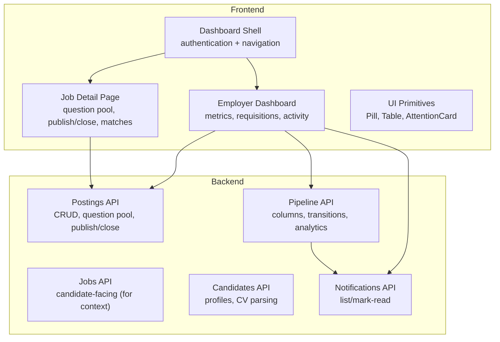
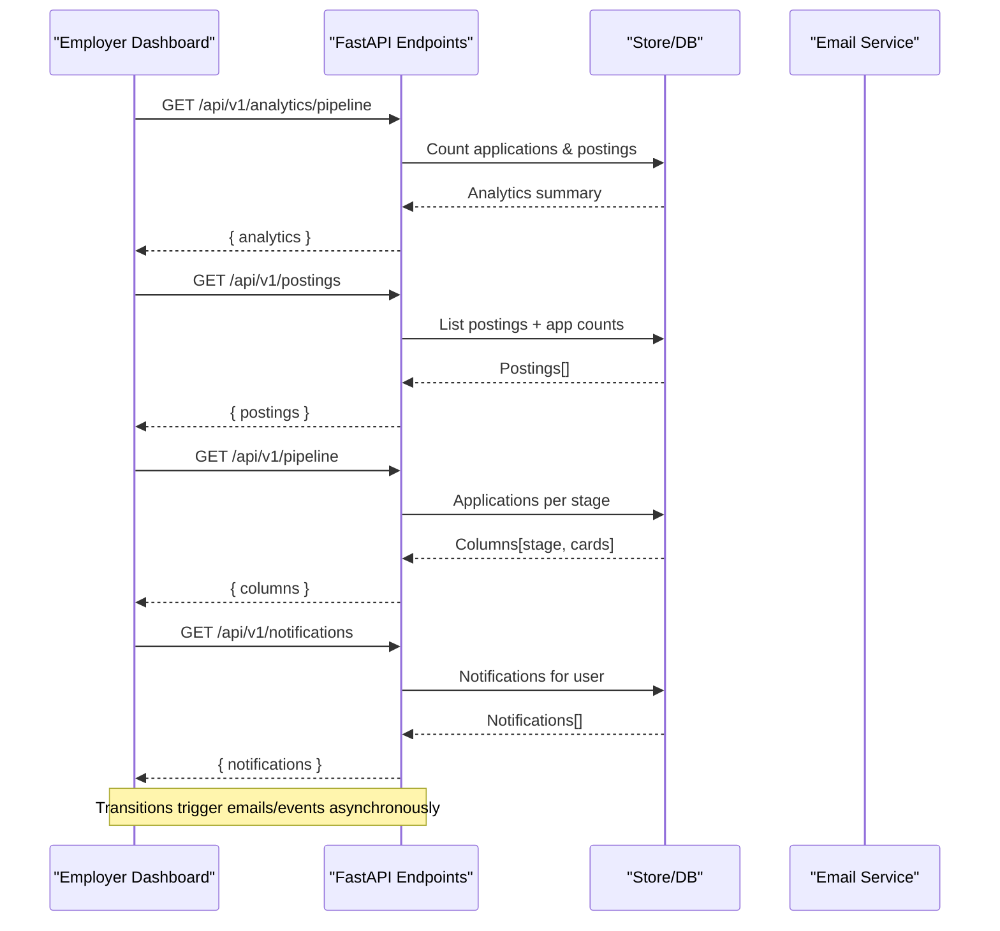
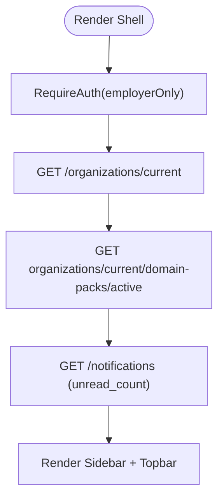
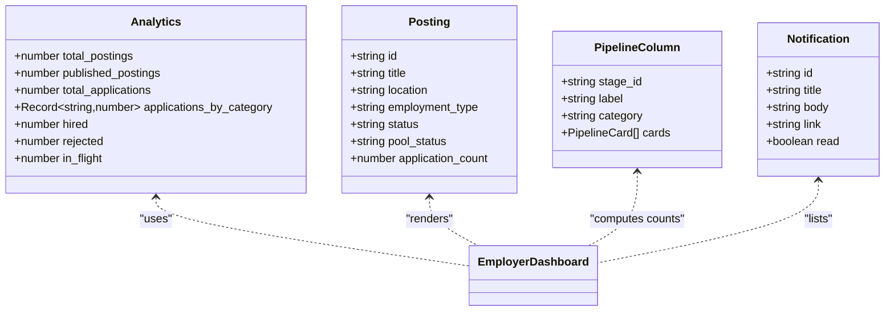
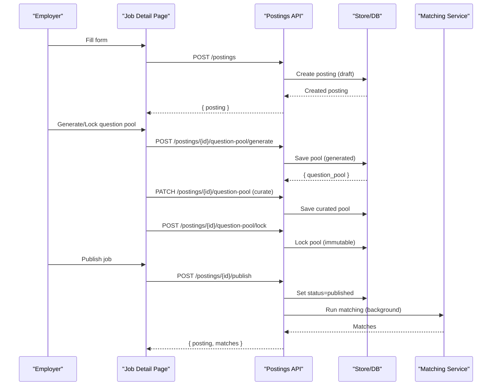
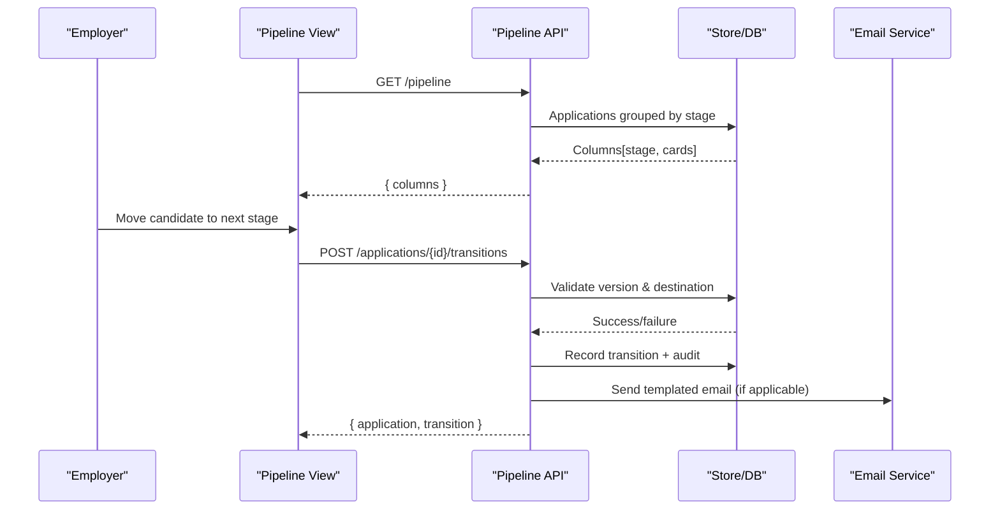
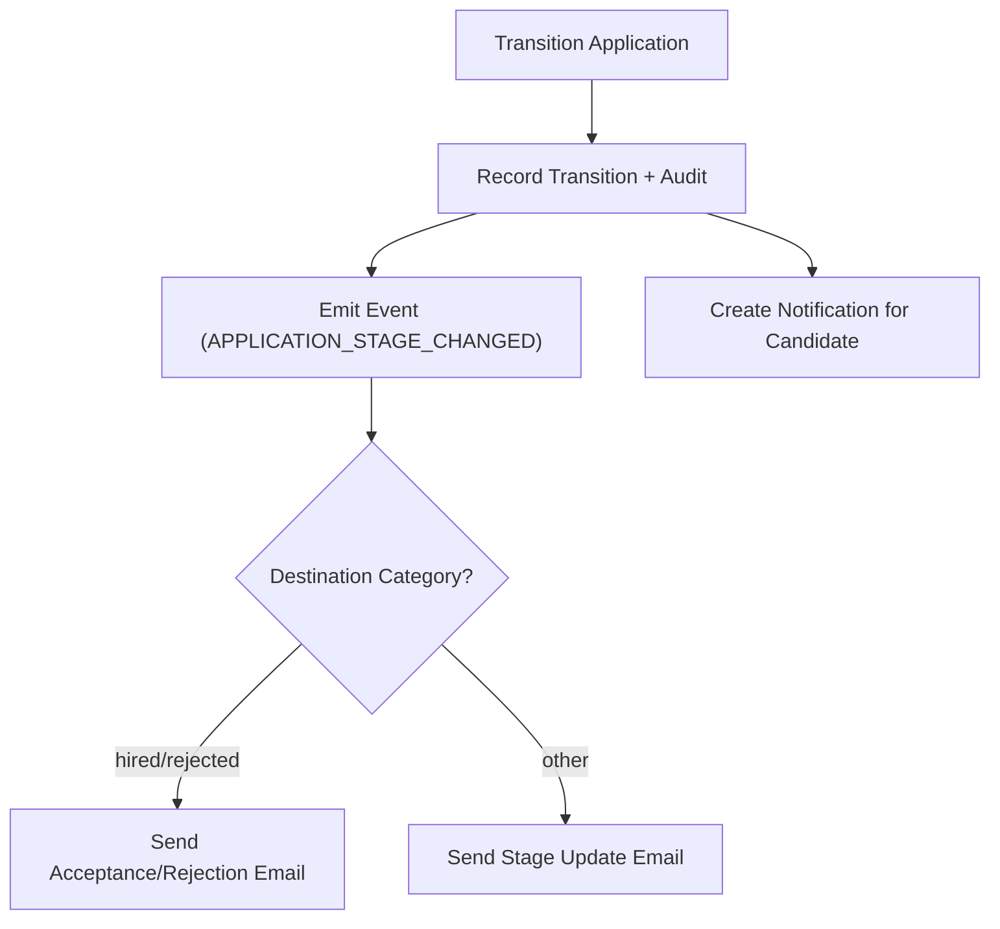
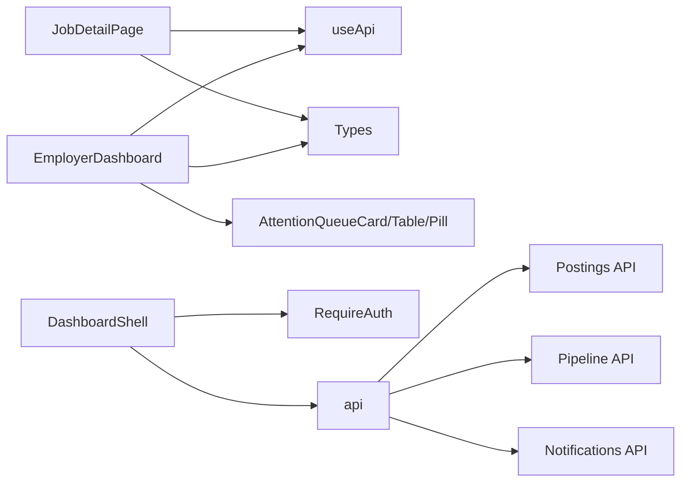

# Employer Dashboard

<cite>
**Referenced Files in This Document**
- [employer-dashboard.tsx](file://Frontend/components/dashboard/employer-dashboard.tsx)
- [dashboard-shell.tsx](file://Frontend/components/dashboard/dashboard-shell.tsx)
- [attention-queue-card.tsx](file://Frontend/components/ui/attention-queue-card.tsx)
- [job-detail-page.tsx](file://Frontend/components/jobs/job-detail-page.tsx)
- [types.ts](file://Frontend/lib/types.ts)
- [use-api.ts](file://Frontend/lib/use-api.ts)
- [jobs.py](file://Backend/app/api/v1/jobs.py)
- [candidates.py](file://Backend/app/api/v1/candidates.py)
- [postings.py](file://Backend/app/api/v1/postings.py)
- [pipeline.py](file://Backend/app/api/v1/pipeline.py)
- [notifications.py](file://Backend/app/api/v1/notifications.py)
</cite>

## Table of Contents
1. [Introduction](#introduction)
2. [Project Structure](#project-structure)
3. [Core Components](#core-components)
4. [Architecture Overview](#architecture-overview)
5. [Detailed Component Analysis](#detailed-component-analysis)
6. [Dependency Analysis](#dependency-analysis)
7. [Performance Considerations](#performance-considerations)
8. [Troubleshooting Guide](#troubleshooting-guide)
9. [Conclusion](#conclusion)
10. [Appendices](#appendices)

## Introduction
This document explains the Employer Dashboard that provides hiring managers with a unified view of job postings, candidate pipeline, application statistics, and real-time activity. It covers dashboard layout, key metrics, job posting management, candidate pipeline overview, data visualization components, integration points with backend APIs, and guidance for customization and role-based access control.

## Project Structure
The employer dashboard is implemented as a Next.js client component within an authenticated shell, backed by FastAPI endpoints for jobs, postings, pipeline analytics, and notifications.

**Diagram sources**
- [dashboard-shell.tsx:171-178](file://Frontend/components/dashboard/dashboard-shell.tsx#L171-L178)
- [employer-dashboard.tsx:18-31](file://Frontend/components/dashboard/employer-dashboard.tsx#L18-L31)
- [job-detail-page.tsx:199-309](file://Frontend/components/jobs/job-detail-page.tsx#L199-L309)
- [postings.py:48-56](file://Backend/app/api/v1/postings.py#L48-L56)
- [pipeline.py:155-201](file://Backend/app/api/v1/pipeline.py#L155-L201)
- [notifications.py:11-17](file://Backend/app/api/v1/notifications.py#L11-L17)

**Section sources**
- [dashboard-shell.tsx:171-178](file://Frontend/components/dashboard/dashboard-shell.tsx#L171-L178)
- [employer-dashboard.tsx:18-31](file://Frontend/components/dashboard/employer-dashboard.tsx#L18-L31)
- [postings.py:48-56](file://Backend/app/api/v1/postings.py#L48-L56)
- [pipeline.py:155-201](file://Backend/app/api/v1/pipeline.py#L155-L201)
- [notifications.py:11-17](file://Backend/app/api/v1/notifications.py#L11-L17)

## Core Components
- Dashboard Shell: Provides authentication gating, workspace navigation, tenant branding, global search, notification badge, and “Create job” action.
- Employer Dashboard: Aggregates analytics, active requisitions, attention queue, recent activity, and next actions.
- Job Detail Page: Manages question pools, publishing/closing jobs, viewing suggested talent matches, and workflow stages.
- UI Primitives: Reusable cards, pills, tables, and stateful loaders/errors.

Key responsibilities:
- Fetch and render live metrics and lists via typed hooks.
- Enforce role-based access through the shell’s auth guard.
- Provide clear error states and retry flows.

**Section sources**
- [dashboard-shell.tsx:12-68](file://Frontend/components/dashboard/dashboard-shell.tsx#L12-L68)
- [dashboard-shell.tsx:96-169](file://Frontend/components/dashboard/dashboard-shell.tsx#L96-L169)
- [employer-dashboard.tsx:18-193](file://Frontend/components/dashboard/employer-dashboard.tsx#L18-L193)
- [job-detail-page.tsx:19-144](file://Frontend/components/jobs/job-detail-page.tsx#L19-L144)
- [job-detail-page.tsx:146-197](file://Frontend/components/jobs/job-detail-page.tsx#L146-L197)
- [attention-queue-card.tsx:5-38](file://Frontend/components/ui/attention-queue-card.tsx#L5-L38)

## Architecture Overview
The dashboard uses a client-side hook to fetch data from backend APIs and renders sections based on loading/error/data states. The backend enforces roles, validates inputs, persists changes, emits events, and returns structured responses consumed by the frontend types.

**Diagram sources**
- [employer-dashboard.tsx:19-22](file://Frontend/components/dashboard/employer-dashboard.tsx#L19-L22)
- [pipeline.py:676-702](file://Backend/app/api/v1/pipeline.py#L676-L702)
- [postings.py:48-56](file://Backend/app/api/v1/postings.py#L48-L56)
- [pipeline.py:155-201](file://Backend/app/api/v1/pipeline.py#L155-L201)
- [notifications.py:11-17](file://Backend/app/api/v1/notifications.py#L11-L17)

## Detailed Component Analysis

### Dashboard Shell and Role-Based Access
- Wraps all employer pages with RequireAuth(employerOnly).
- Loads organization name, active domain pack, and unread notification count.
- Provides topbar actions including “Create job”.

**Diagram sources**
- [dashboard-shell.tsx:171-178](file://Frontend/components/dashboard/dashboard-shell.tsx#L171-L178)
- [dashboard-shell.tsx:104-120](file://Frontend/components/dashboard/dashboard-shell.tsx#L104-L120)
- [dashboard-shell.tsx:137-169](file://Frontend/components/dashboard/dashboard-shell.tsx#L137-L169)

**Section sources**
- [dashboard-shell.tsx:12-68](file://Frontend/components/dashboard/dashboard-shell.tsx#L12-L68)
- [dashboard-shell.tsx:96-169](file://Frontend/components/dashboard/dashboard-shell.tsx#L96-L169)

### Employer Dashboard: Layout and Metrics
- Attention Queue: Cards for new applications, interviews to score, and candidates in flight. Counts derived from pipeline columns and analytics.
- Active Requisitions: Table of postings with status pill, application count, question pool status, and next action links.
- Recent Activity: Notification list with open links.
- Next Actions: Quick links to review applications, score interviews, and join live interview room.

Data sources:
- Analytics: GET /api/v1/analytics/pipeline
- Postings: GET /api/v1/postings
- Pipeline: GET /api/v1/pipeline
- Notifications: GET /api/v1/notifications

**Diagram sources**
- [types.ts:258-266](file://Frontend/lib/types.ts#L258-L266)
- [types.ts:1-18](file://Frontend/lib/types.ts#L1-L18)
- [types.ts:79-84](file://Frontend/lib/types.ts#L79-L84)
- [types.ts:236-243](file://Frontend/lib/types.ts#L236-L243)
- [employer-dashboard.tsx:19-31](file://Frontend/components/dashboard/employer-dashboard.tsx#L19-L31)

**Section sources**
- [employer-dashboard.tsx:18-193](file://Frontend/components/dashboard/employer-dashboard.tsx#L18-L193)
- [pipeline.py:676-702](file://Backend/app/api/v1/pipeline.py#L676-L702)
- [postings.py:48-56](file://Backend/app/api/v1/postings.py#L48-L56)
- [notifications.py:11-17](file://Backend/app/api/v1/notifications.py#L11-L17)

### Job Posting Management Interface
- Create: POST /api/v1/postings with required fields; pins domain pack and workflow snapshot; idempotency support.
- Update: PATCH /api/v1/postings/{id} only when draft.
- Publish: POST /api/v1/postings/{id}/publish requires locked question pool and workflow snapshot; triggers matching and events.
- Close: POST /api/v1/postings/{id}/close marks closed and records audit.
- Question Pool: Generate, curate, lock; ensures immutability after lock.

**Diagram sources**
- [postings.py:81-180](file://Backend/app/api/v1/postings.py#L81-L180)
- [postings.py:190-228](file://Backend/app/api/v1/postings.py#L190-L228)
- [postings.py:231-328](file://Backend/app/api/v1/postings.py#L231-L328)
- [postings.py:394-566](file://Backend/app/api/v1/postings.py#L394-L566)
- [job-detail-page.tsx:19-144](file://Frontend/components/jobs/job-detail-page.tsx#L19-L144)

**Section sources**
- [postings.py:81-180](file://Backend/app/api/v1/postings.py#L81-L180)
- [postings.py:190-228](file://Backend/app/api/v1/postings.py#L190-L228)
- [postings.py:231-328](file://Backend/app/api/v1/postings.py#L231-L328)
- [postings.py:394-566](file://Backend/app/api/v1/postings.py#L394-L566)
- [job-detail-page.tsx:199-309](file://Frontend/components/jobs/job-detail-page.tsx#L199-L309)

### Candidate Pipeline Overview
- Pipeline columns are built from workflow stages; each card includes candidate info, scores, applied interview status, and valid destinations.
- Transition endpoint enforces optimistic concurrency, valid destination, reason codes where required, and emits events and emails.

**Diagram sources**
- [pipeline.py:155-201](file://Backend/app/api/v1/pipeline.py#L155-L201)
- [pipeline.py:277-514](file://Backend/app/api/v1/pipeline.py#L277-L514)

**Section sources**
- [pipeline.py:155-201](file://Backend/app/api/v1/pipeline.py#L155-L201)
- [pipeline.py:277-514](file://Backend/app/api/v1/pipeline.py#L277-L514)

### Data Visualization Components
- AttentionQueueCard: Displays count, title, detail, tone, and action link.
- Pill: Status indicators for posting status and pool status.
- Table: Lists active requisitions with sortable columns and empty/error/loading states.
- ScoreBadge: Visualizes match or evaluation scores in job details.

These components consume typed data structures defined in the frontend types module.

**Section sources**
- [attention-queue-card.tsx:5-38](file://Frontend/components/ui/attention-queue-card.tsx#L5-L38)
- [types.ts:1-18](file://Frontend/lib/types.ts#L1-L18)
- [types.ts:79-84](file://Frontend/lib/types.ts#L79-L84)
- [job-detail-page.tsx:146-197](file://Frontend/components/jobs/job-detail-page.tsx#L146-L197)

### Real-Time Updates and Notifications
- Notifications: List and mark-read endpoints provide recent activity and unread counts shown in the shell header.
- Pipeline transitions emit events and send emails; these can be surfaced to users via notifications or polling.

**Diagram sources**
- [pipeline.py:349-514](file://Backend/app/api/v1/pipeline.py#L349-L514)
- [notifications.py:11-27](file://Backend/app/api/v1/notifications.py#L11-L27)

**Section sources**
- [pipeline.py:349-514](file://Backend/app/api/v1/pipeline.py#L349-L514)
- [notifications.py:11-27](file://Backend/app/api/v1/notifications.py#L11-L27)

### Integration with Backend APIs
- useApi hook: Centralized client-side data fetching with loading/error states and reload capability.
- Types: Strongly-typed models ensure consistent contracts between frontend and backend.
- Jobs/Candidates APIs: Provide context for candidate-facing features and profile data used in pipeline cards.

**Section sources**
- [use-api.ts:6-33](file://Frontend/lib/use-api.ts#L6-L33)
- [types.ts:146-179](file://Frontend/lib/types.ts#L146-L179)
- [jobs.py:49-77](file://Backend/app/api/v1/jobs.py#L49-L77)
- [candidates.py:147-189](file://Backend/app/api/v1/candidates.py#L147-L189)

## Dependency Analysis
- Frontend dependencies:
  - Dashboard Shell depends on RequireAuth, GlobalSearch, PackChip, api, currentSession.
  - Employer Dashboard depends on useApi, UI primitives, and types.
  - Job Detail Page depends on useApi, Button, Pill, ScoreBadge, and types.
- Backend dependencies:
  - Postings API depends on store, pack registry, matching service, and email templates.
  - Pipeline API depends on store, domain stages, mail templates, and matching services.
  - Notifications API depends on store and current user.

**Diagram sources**
- [employer-dashboard.tsx:1-11](file://Frontend/components/dashboard/employer-dashboard.tsx#L1-L11)
- [job-detail-page.tsx:1-11](file://Frontend/components/jobs/job-detail-page.tsx#L1-L11)
- [dashboard-shell.tsx:1-11](file://Frontend/components/dashboard/dashboard-shell.tsx#L1-L11)
- [postings.py:1-21](file://Backend/app/api/v1/postings.py#L1-L21)
- [pipeline.py:1-38](file://Backend/app/api/v1/pipeline.py#L1-L38)
- [notifications.py:1-8](file://Backend/app/api/v1/notifications.py#L1-L8)

**Section sources**
- [employer-dashboard.tsx:1-11](file://Frontend/components/dashboard/employer-dashboard.tsx#L1-L11)
- [job-detail-page.tsx:1-11](file://Frontend/components/jobs/job-detail-page.tsx#L1-L11)
- [dashboard-shell.tsx:1-11](file://Frontend/components/dashboard/dashboard-shell.tsx#L1-L11)
- [postings.py:1-21](file://Backend/app/api/v1/postings.py#L1-L21)
- [pipeline.py:1-38](file://Backend/app/api/v1/pipeline.py#L1-L38)
- [notifications.py:1-8](file://Backend/app/api/v1/notifications.py#L1-L8)

## Performance Considerations
- Use idempotency keys for create/post operations to prevent duplicate work and enable safe retries.
- Batch reads where possible; the dashboard composes multiple small GETs which is acceptable for typical dashboards but consider caching strategies if latency increases.
- Avoid heavy computations on the critical path; background tasks (matching, emails) are already offloaded in the pipeline.
- Leverage optimistic concurrency checks to reduce conflict resolution overhead.

[No sources needed since this section provides general guidance]

## Troubleshooting Guide
Common issues and resolutions:
- Empty requisitions table: Ensure at least one posting exists; create a job via the topbar “Create job” button.
- Cannot publish job: Verify question pool is generated and locked; workflow snapshot must be present.
- Transition conflicts: Refresh the pipeline to get the latest stage version before moving candidates.
- Error states: Use the provided ErrorState components with retry actions to re-fetch data.

**Section sources**
- [employer-dashboard.tsx:91-139](file://Frontend/components/dashboard/employer-dashboard.tsx#L91-L139)
- [job-detail-page.tsx:219-226](file://Frontend/components/jobs/job-detail-page.tsx#L219-L226)
- [postings.py:231-260](file://Backend/app/api/v1/postings.py#L231-L260)
- [pipeline.py:306-324](file://Backend/app/api/v1/pipeline.py#L306-L324)

## Conclusion
The Employer Dashboard consolidates hiring operations into a single interface with clear metrics, actionable queues, and robust job management. It integrates tightly with backend APIs to provide accurate, auditable, and extensible functionality. Employers can create and manage postings, monitor candidate pipelines, and act on real-time notifications while maintaining strong role-based access controls.

[No sources needed since this section summarizes without analyzing specific files]

## Appendices

### Customizing Dashboard Widgets
- Add new metric cards by extending the attention grid and fetching additional analytics endpoints.
- Introduce new panels by composing existing UI primitives (Table, Pill, Loading/Error states).
- Wire new data sources using the useApi hook and update types accordingly.

[No sources needed since this section provides general guidance]

### Adding New Analytics Views
- Implement a new backend endpoint under the pipeline or analytics namespace to compute metrics.
- Expose strongly-typed response models in frontend types.
- Create a new panel in the dashboard that calls the endpoint and renders results.

[No sources needed since this section provides general guidance]

### Implementing Role-Based Access Controls
- Use RequireAuth(employerOnly) in the shell to restrict access to employer-only routes.
- Backend endpoints enforce roles via require_role(context, EMPLOYER_ROLES | PIPELINE_ROLES).
- Extend roles as needed and gate sensitive actions behind role checks.

**Section sources**
- [dashboard-shell.tsx:171-178](file://Frontend/components/dashboard/dashboard-shell.tsx#L171-L178)
- [postings.py:81-90](file://Backend/app/api/v1/postings.py#L81-L90)
- [pipeline.py:155-161](file://Backend/app/api/v1/pipeline.py#L155-L161)