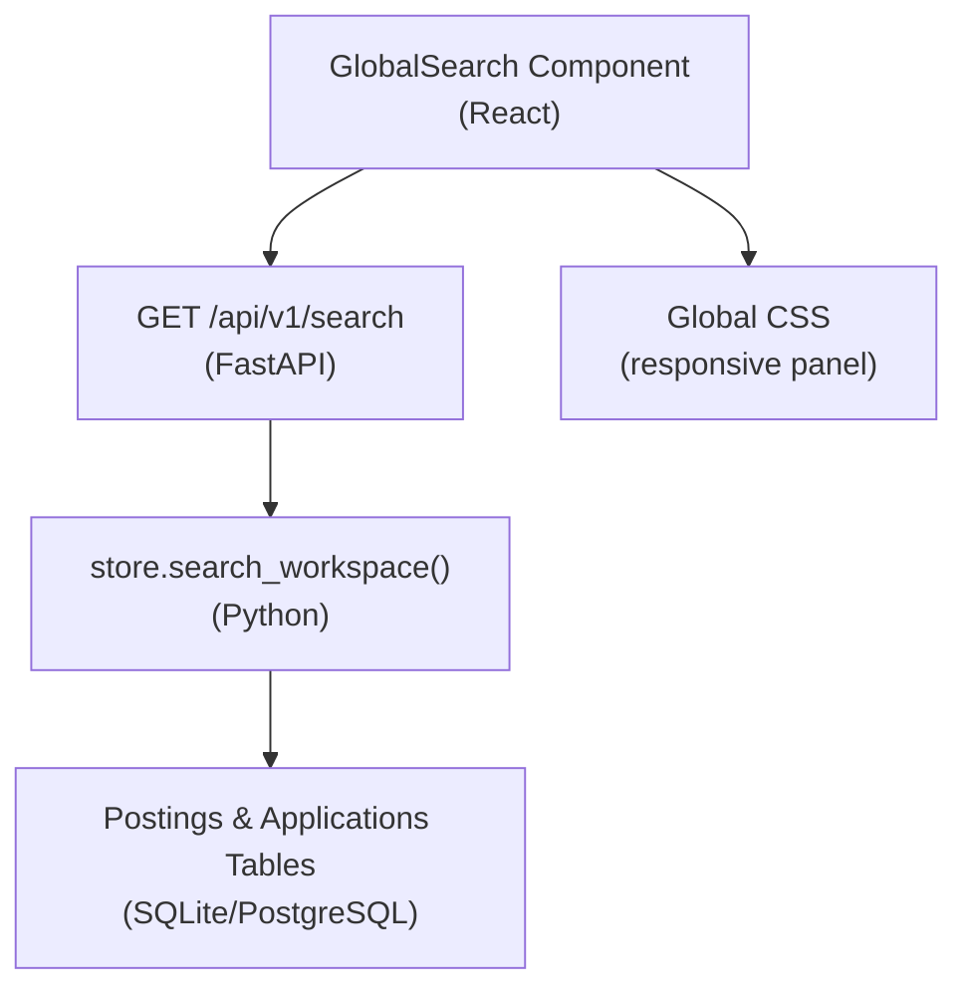
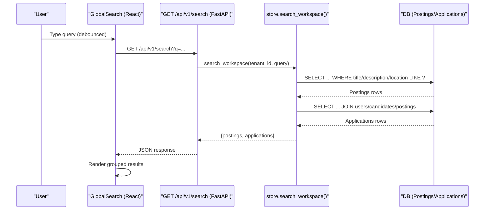
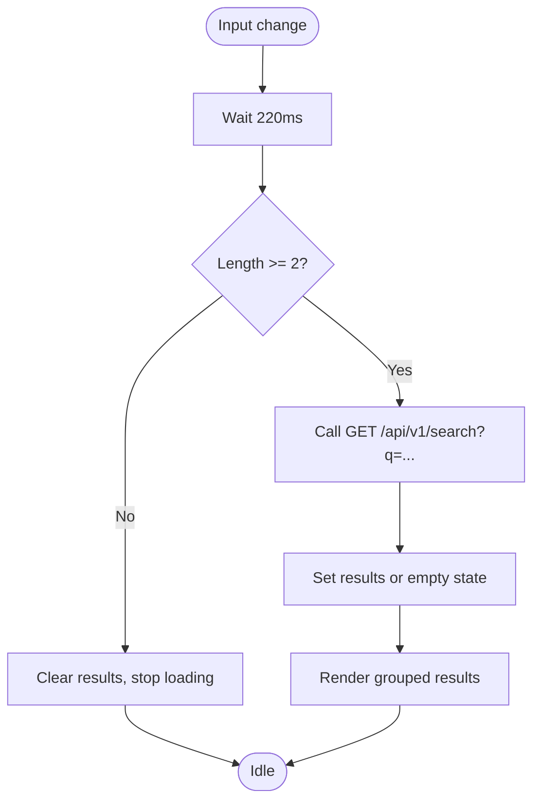
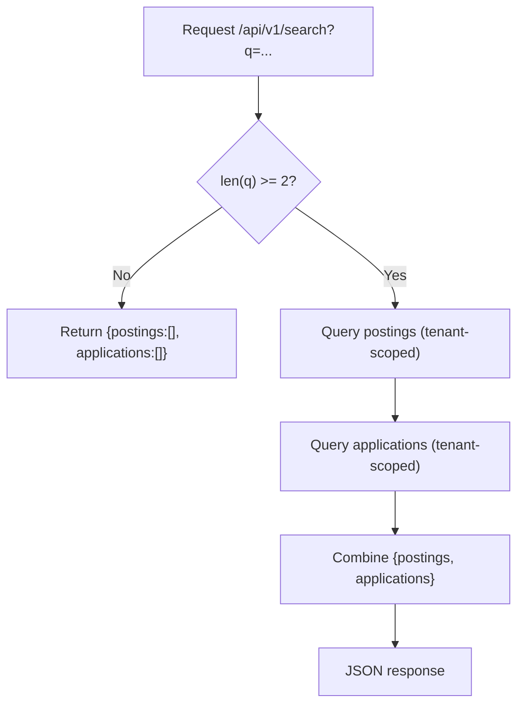
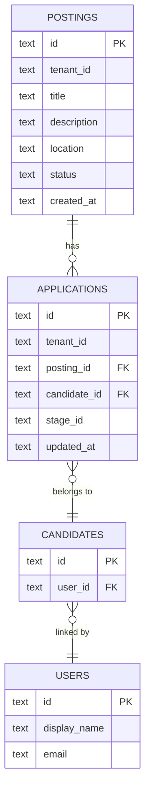
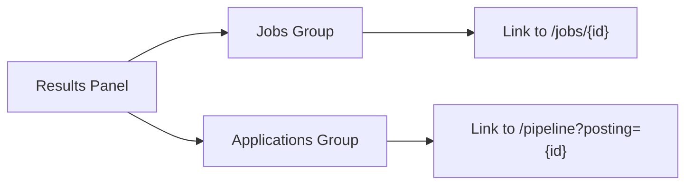
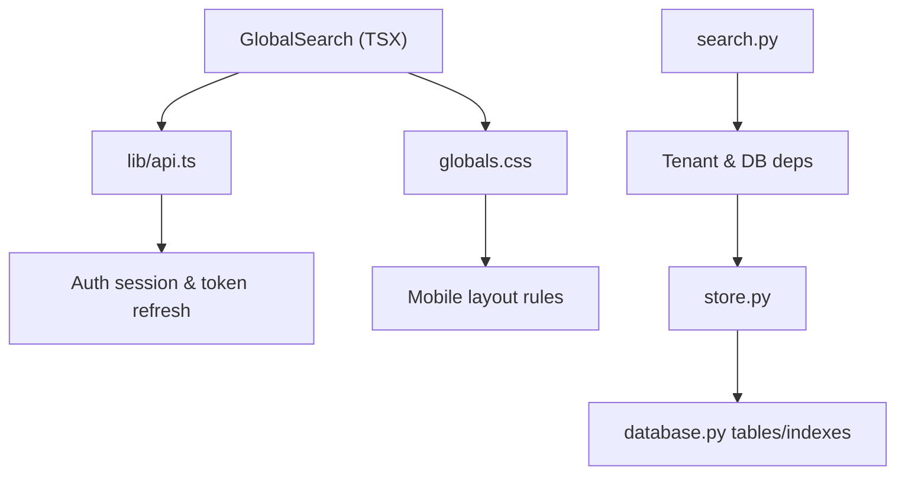

# Global Search

<cite>
**Referenced Files in This Document**
- [global-search.tsx](file://Frontend/components/dashboard/global-search.tsx)
- [dashboard-shell.tsx](file://Frontend/components/dashboard/dashboard-shell.tsx)
- [globals.css](file://Frontend/app/globals.css)
- [api.ts](file://Frontend/lib/api.ts)
- [search.py](file://Backend/app/api/v1/search.py)
- [store.py](file://Backend/app/db/store.py)
- [database.py](file://Backend/app/db/database.py)
</cite>

## Table of Contents
1. [Introduction](#introduction)
2. [Project Structure](#project-structure)
3. [Core Components](#core-components)
4. [Architecture Overview](#architecture-overview)
5. [Detailed Component Analysis](#detailed-component-analysis)
6. [Dependency Analysis](#dependency-analysis)
7. [Performance Considerations](#performance-considerations)
8. [Troubleshooting Guide](#troubleshooting-guide)
9. [Conclusion](#conclusion)
10. [Appendices](#appendices)

## Introduction
This document explains the Global Search feature that provides unified search across jobs (postings), candidates, and applications within an employer workspace. It covers the user interface design, input handling, result filtering, display formatting, backend search algorithm, indexing strategy, performance optimizations, navigation integration, accessibility, keyboard shortcuts, mobile responsiveness, and guidance for extending search to new entity types.

## Project Structure
The Global Search spans both frontend and backend:
- Frontend: A reusable search component embedded in the dashboard header, with styling and responsive behavior.
- Backend: A FastAPI endpoint that delegates tenant-scoped search to a database store layer, which queries postings and applications.

**Diagram sources**
- [global-search.tsx:20-153](file://Frontend/components/dashboard/global-search.tsx#L20-L153)
- [search.py:16-26](file://Backend/app/api/v1/search.py#L16-L26)
- [store.py:989-1027](file://Backend/app/db/store.py#L989-L1027)
- [database.py:165-206](file://Backend/app/db/database.py#L165-L206)
- [globals.css:75-93](file://Frontend/app/globals.css#L75-L93)

**Section sources**
- [global-search.tsx:20-153](file://Frontend/components/dashboard/global-search.tsx#L20-L153)
- [dashboard-shell.tsx:137-144](file://Frontend/components/dashboard/dashboard-shell.tsx#L137-L144)
- [search.py:16-26](file://Backend/app/api/v1/search.py#L16-L26)
- [store.py:989-1027](file://Backend/app/db/store.py#L989-L1027)
- [database.py:165-206](file://Backend/app/db/database.py#L165-L206)
- [globals.css:75-93](file://Frontend/app/globals.css#L75-L93)

## Core Components
- GlobalSearch (frontend): Debounced input, keyboard shortcut (⌘/Ctrl+K), focus management, and results panel rendering grouped by Jobs and Applications.
- Dashboard shell: Renders the GlobalSearch in the topbar and integrates with navigation.
- Search API: Validates query length and returns tenant-scoped results.
- Store layer: Executes SQL LIKE searches on postings and applications, limited per group.

Key responsibilities:
- Input handling and debouncing to reduce network calls.
- Tenant scoping via context passed to the backend.
- Grouped result presentation with links to job detail and pipeline views.
- Accessibility labels and keyboard support.

**Section sources**
- [global-search.tsx:20-153](file://Frontend/components/dashboard/global-search.tsx#L20-L153)
- [dashboard-shell.tsx:137-144](file://Frontend/components/dashboard/dashboard-shell.tsx#L137-L144)
- [search.py:16-26](file://Backend/app/api/v1/search.py#L16-L26)
- [store.py:989-1027](file://Backend/app/db/store.py#L989-L1027)

## Architecture Overview
End-to-end flow from user input to displayed results:

**Diagram sources**
- [global-search.tsx:28-53](file://Frontend/components/dashboard/global-search.tsx#L28-L53)
- [search.py:16-26](file://Backend/app/api/v1/search.py#L16-L26)
- [store.py:989-1027](file://Backend/app/db/store.py#L989-L1027)
- [database.py:165-206](file://Backend/app/db/database.py#L165-L206)

## Detailed Component Analysis

### Frontend: GlobalSearch Component
- Debounced search: Triggers after 220ms of inactivity to avoid excessive requests.
- Minimum query length: Requires at least 2 characters before searching.
- Keyboard shortcuts: ⌘/Ctrl+K focuses the input; Escape closes the panel; click-outside closes it.
- Results grouping: Displays “Jobs” and “Applications” sections when available.
- Navigation: Links to job detail pages and pipeline filtered by posting.
- Accessibility: Uses aria-labels and screen-reader-only text for clarity.

**Diagram sources**
- [global-search.tsx:28-53](file://Frontend/components/dashboard/global-search.tsx#L28-L53)
- [global-search.tsx:75-153](file://Frontend/components/dashboard/global-search.tsx#L75-L153)

**Section sources**
- [global-search.tsx:20-153](file://Frontend/components/dashboard/global-search.tsx#L20-L153)

### Backend: Search Endpoint and Store
- Endpoint: GET /api/v1/search accepts q (max 200 chars). Returns early if query is too short.
- Store: Performs two tenant-scoped LIKE queries:
  - Postings: matches title, description, location.
  - Applications: matches candidate name/email, job title, stage_id.
- Limits: Each group capped to a default limit to control payload size.

**Diagram sources**
- [search.py:16-26](file://Backend/app/api/v1/search.py#L16-L26)
- [store.py:989-1027](file://Backend/app/db/store.py#L989-L1027)

**Section sources**
- [search.py:16-26](file://Backend/app/api/v1/search.py#L16-L26)
- [store.py:989-1027](file://Backend/app/db/store.py#L989-L1027)

### Data Model and Indexing Strategy
- Tables involved:
  - postings: id, tenant_id, title, description, location, status, timestamps.
  - applications: id, tenant_id, posting_id, candidate_id, stage_id, timestamps.
  - users/candidates: joined to resolve candidate names and emails.
- Indexes:
  - idx_postings_tenant on postings.tenant_id supports tenant scoping.
  - idx_applications_tenant on applications.tenant_id supports tenant scoping.
  - Additional indexes exist for related entities (e.g., applications.candidate_id).
- Matching strategy:
  - Case-insensitive LIKE with lower() and %needle% patterns.
  - Limited result sets per group to maintain performance.

**Diagram sources**
- [database.py:165-206](file://Backend/app/db/database.py#L165-L206)

**Section sources**
- [database.py:165-206](file://Backend/app/db/database.py#L165-L206)
- [store.py:989-1027](file://Backend/app/db/store.py#L989-L1027)

### Result Presentation and Navigation Integration
- Grouped sections: Jobs and Applications are rendered separately with clear labels.
- Links:
  - Job results link to /jobs/[id].
  - Application results link to /pipeline?posting=[id] to filter the pipeline view.
- Styling: Panel uses absolute/fixed positioning depending on viewport; groups have hover states and typography hierarchy.

**Diagram sources**
- [global-search.tsx:106-146](file://Frontend/components/dashboard/global-search.tsx#L106-L146)
- [globals.css:79-93](file://Frontend/app/globals.css#L79-L93)

**Section sources**
- [global-search.tsx:106-146](file://Frontend/components/dashboard/global-search.tsx#L106-L146)
- [globals.css:79-93](file://Frontend/app/globals.css#L79-L93)

### Accessibility, Keyboard Navigation, and Mobile Responsiveness
- Accessibility:
  - Screen-reader-only label describes purpose.
  - Results panel has role="listbox" and aria-label for assistive tech.
- Keyboard:
  - ⌘/Ctrl+K opens and focuses the search input.
  - Escape closes the panel.
  - Click outside closes the panel.
- Mobile:
  - On small screens, the search input adapts width and the panel becomes fixed overlay.
  - Keyboard hint is hidden on mobile to save space.

**Section sources**
- [global-search.tsx:55-73](file://Frontend/components/dashboard/global-search.tsx#L55-L73)
- [globals.css:75-93](file://Frontend/app/globals.css#L75-L93)
- [globals.css:166-172](file://Frontend/app/globals.css#L166-L172)

## Dependency Analysis
- Frontend dependencies:
  - React hooks for state and effects.
  - Next.js Link for client-side navigation.
  - api helper for authenticated requests and token refresh.
- Backend dependencies:
  - FastAPI router and Query validation.
  - Tenant context dependency for scoping.
  - Database store functions for querying.

**Diagram sources**
- [global-search.tsx:1-153](file://Frontend/components/dashboard/global-search.tsx#L1-L153)
- [api.ts:59-104](file://Frontend/lib/api.ts#L59-L104)
- [search.py:1-26](file://Backend/app/api/v1/search.py#L1-L26)
- [store.py:989-1027](file://Backend/app/db/store.py#L989-L1027)
- [database.py:165-206](file://Backend/app/db/database.py#L165-L206)

**Section sources**
- [global-search.tsx:1-153](file://Frontend/components/dashboard/global-search.tsx#L1-L153)
- [api.ts:59-104](file://Frontend/lib/api.ts#L59-L104)
- [search.py:1-26](file://Backend/app/api/v1/search.py#L1-L26)
- [store.py:989-1027](file://Backend/app/db/store.py#L989-L1027)
- [database.py:165-206](file://Backend/app/db/database.py#L165-L206)

## Performance Considerations
- Debouncing: Reduces request frequency during typing.
- Minimum query length: Prevents unnecessary queries for very short inputs.
- Server-side limits: Each result group is capped to a default limit to control payload size and query time.
- Tenant scoping: Queries include tenant_id filters and leverage indexes for faster lookups.
- LIKE matching: Case-insensitive substring matching is efficient for small to medium datasets; consider full-text search or vector search for large-scale deployments.

[No sources needed since this section provides general guidance]

## Troubleshooting Guide
Common issues and resolutions:
- No results appear:
  - Ensure query is at least 2 characters.
  - Verify tenant context is correctly set on the backend.
  - Check that postings/applications contain searchable fields matching the query.
- Network errors:
  - Confirm backend is reachable and API base URL is correct.
  - Auth token refresh may be required; the API client handles 401 retries automatically.
- Panel not closing:
  - Ensure click-outside handler is active; verify event listeners are attached and removed properly.

**Section sources**
- [global-search.tsx:28-53](file://Frontend/components/dashboard/global-search.tsx#L28-L53)
- [api.ts:59-104](file://Frontend/lib/api.ts#L59-L104)

## Conclusion
The Global Search delivers a fast, accessible, and tenant-safe unified search experience across jobs and applications. It balances UX with performance through debouncing, minimum query thresholds, and server-side limits. The architecture cleanly separates concerns between UI, API, and data layers, making it straightforward to extend with additional entity types and advanced filters.

[No sources needed since this section summarizes without analyzing specific files]

## Appendices

### Extending Search to New Entity Types
Steps to add a new entity (for example, “Candidates” or “Interviews”):
- Frontend:
  - Extend the SearchResult type to include the new entity array.
  - Add a new group in the results panel with appropriate links and metadata.
  - Update placeholder and accessibility labels if needed.
- Backend:
  - Add a new query in store.search_workspace() scoped by tenant_id.
  - Use LIKE matching on relevant fields and apply a reasonable limit.
  - Return the new entity array alongside existing results.
- Database:
  - Ensure indexes exist on frequently searched columns (e.g., tenant_id, searchable fields).
  - Consider adding full-text indexes or vector embeddings for complex matching needs.

**Section sources**
- [global-search.tsx:7-18](file://Frontend/components/dashboard/global-search.tsx#L7-L18)
- [global-search.tsx:106-146](file://Frontend/components/dashboard/global-search.tsx#L106-L146)
- [store.py:989-1027](file://Backend/app/db/store.py#L989-L1027)
- [database.py:165-206](file://Backend/app/db/database.py#L165-L206)

### Implementing Advanced Filters
- Frontend:
  - Add filter controls (e.g., status, location, score) above or inside the search panel.
  - Serialize filters into query parameters and pass them to the backend.
- Backend:
  - Accept additional query parameters in the endpoint.
  - Compose SQL conditions with AND/OR based on selected filters.
  - Maintain tenant scoping and enforce access rules.
- Performance:
  - Use indexed columns for filters where possible.
  - Apply pagination or limits to prevent heavy payloads.

[No sources needed since this section provides general guidance]

### Customizing Search Result Layouts
- Styling:
  - Adjust .search-panel__group styles for different layouts (grid vs list).
  - Customize typography and spacing for better readability.
- Content:
  - Include additional metadata (e.g., scores, tags) in backend responses.
  - Render badges or chips for quick scanning.
- Interaction:
  - Add keyboard navigation within the results list (arrow keys, Enter to open).
  - Provide “Open in new tab” options where appropriate.

**Section sources**
- [globals.css:79-93](file://Frontend/app/globals.css#L79-L93)
- [global-search.tsx:106-146](file://Frontend/components/dashboard/global-search.tsx#L106-L146)