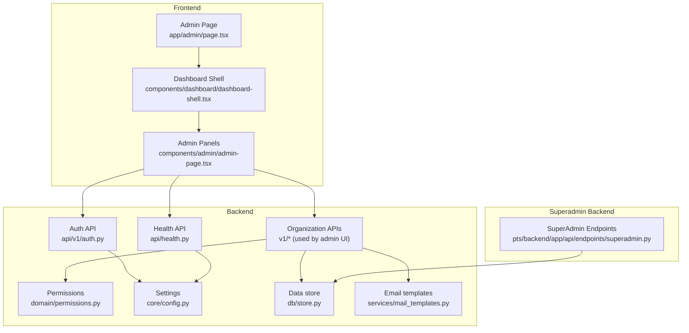
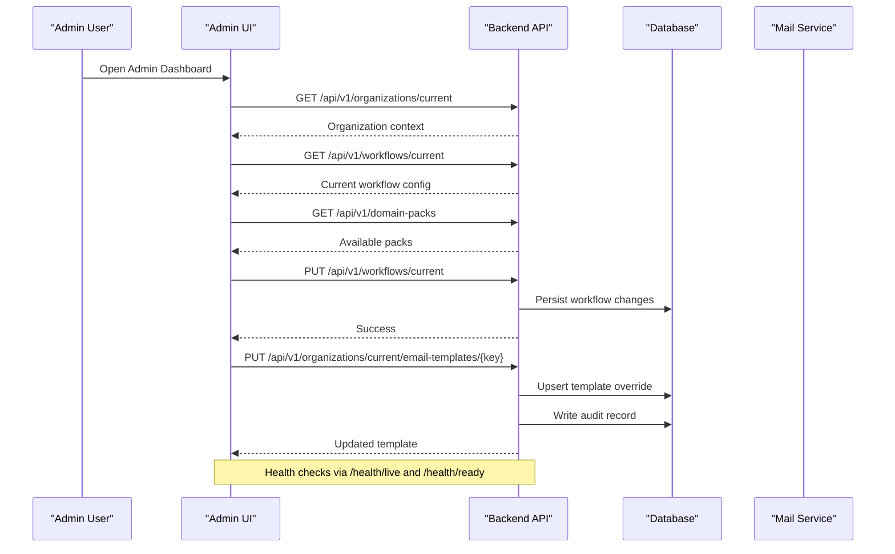
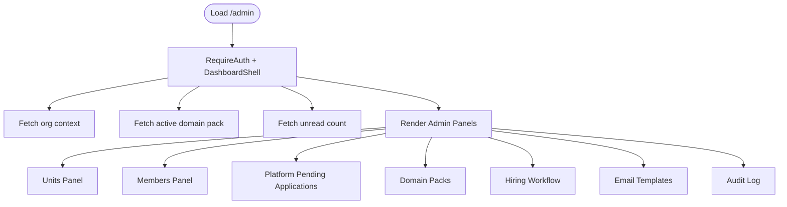
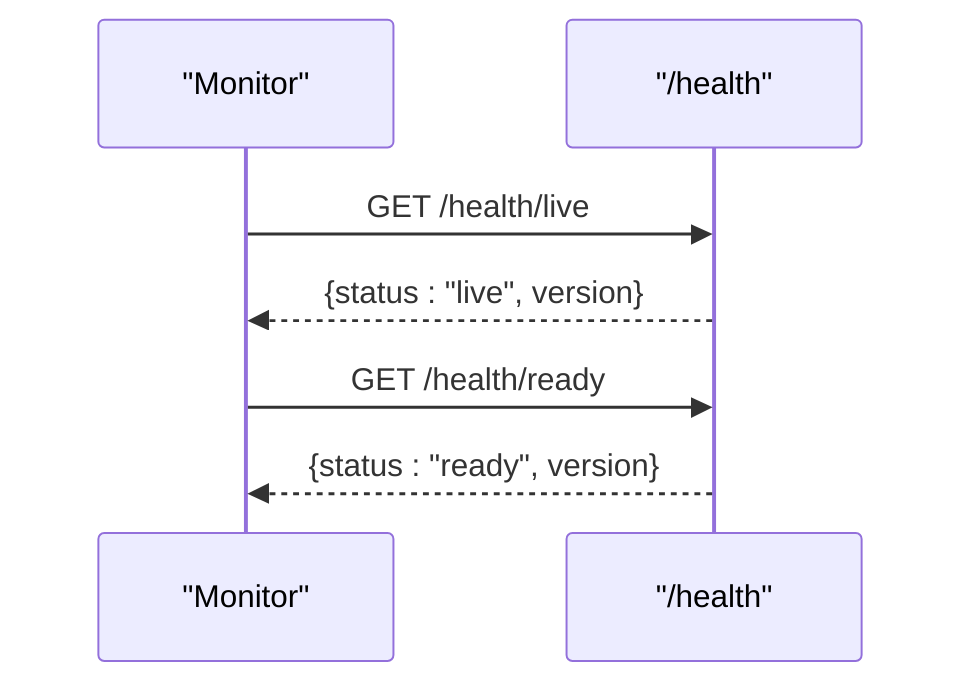
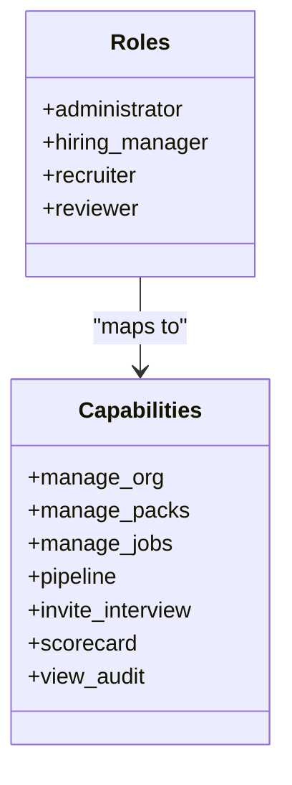
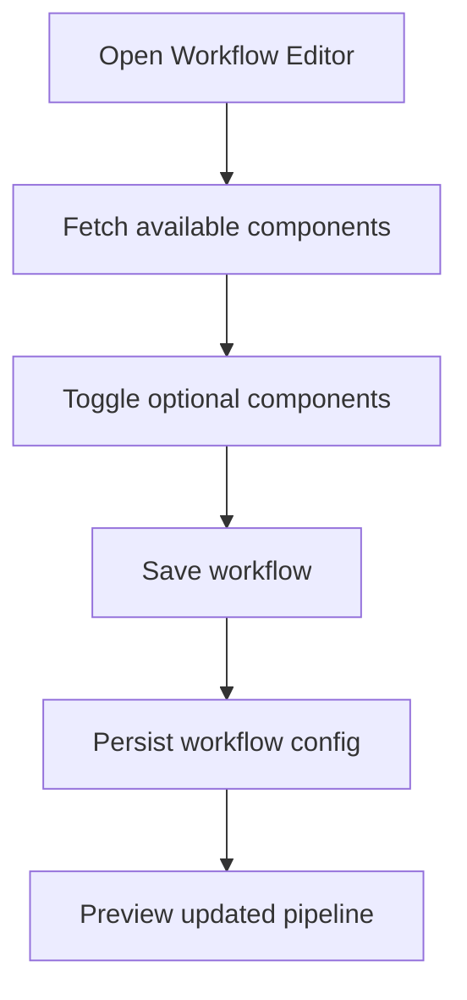
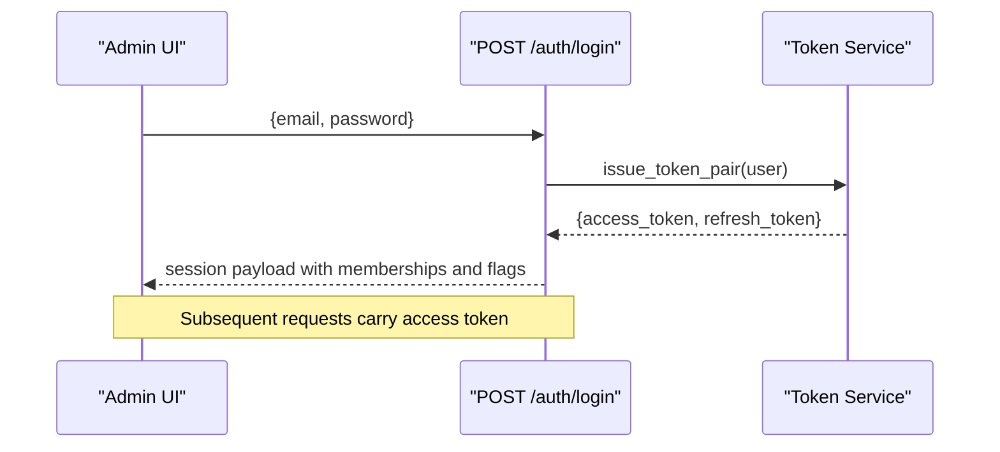
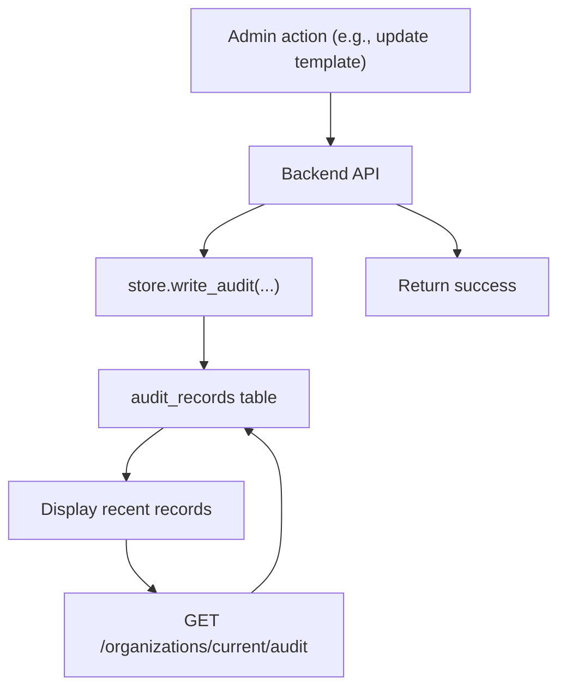
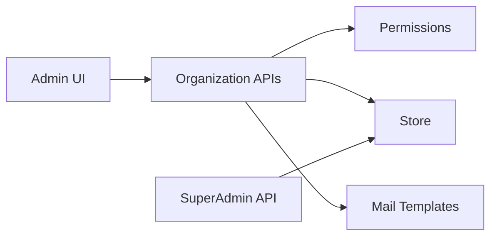

# Administrative Interface

<cite>
**Referenced Files in This Document**
- [page.tsx](file://Frontend/app/admin/page.tsx)
- [admin-page.tsx](file://Frontend/components/admin/admin-page.tsx)
- [dashboard-shell.tsx](file://Frontend/components/dashboard/dashboard-shell.tsx)
- [auth.py](file://Backend/app/api/v1/auth.py)
- [permissions.py](file://Backend/app/domain/permissions.py)
- [health.py](file://Backend/app/api/health.py)
- [superadmin.py](file://pts/backend/app/api/endpoints/superadmin.py)
- [config.py](file://Backend/app/core/config.py)
- [store.py](file://Backend/app/db/store.py)
- [mail_templates.py](file://Backend/app/services/mail_templates.py)
</cite>

## Table of Contents
1. [Introduction](#introduction)
2. [Project Structure](#project-structure)
3. [Core Components](#core-components)
4. [Architecture Overview](#architecture-overview)
5. [Detailed Component Analysis](#detailed-component-analysis)
6. [Dependency Analysis](#dependency-analysis)
7. [Performance Considerations](#performance-considerations)
8. [Troubleshooting Guide](#troubleshooting-guide)
9. [Conclusion](#conclusion)
10. [Appendices](#appendices)

## Introduction
This document describes the administrative pages and system management interfaces for the platform. It covers the admin dashboard layout, system monitoring endpoints, user and organization management features, configuration tools (workflows, domain packs, email templates), access control and role-based permissions, audit logging, and health checks. It also provides guidance on extending the admin area with new features and custom tools.

## Project Structure
The administrative interface spans both frontend and backend:
- Frontend admin page renders a shell with navigation and panels for organization structure, members, workflows, domain packs, email templates, and audit logs.
- Backend exposes authentication, permissions, health endpoints, and organization-scoped APIs used by the admin UI. A separate superadmin API manages tenants and tenant admins.

**Diagram sources**
- [page.tsx:1-14](file://Frontend/app/admin/page.tsx#L1-L14)
- [dashboard-shell.tsx:1-178](file://Frontend/components/dashboard/dashboard-shell.tsx#L1-L178)
- [admin-page.tsx:1-1002](file://Frontend/components/admin/admin-page.tsx#L1-L1002)
- [auth.py:1-185](file://Backend/app/api/v1/auth.py#L1-L185)
- [health.py:1-22](file://Backend/app/api/health.py#L1-L22)
- [permissions.py:1-64](file://Backend/app/domain/permissions.py#L1-L64)
- [config.py:1-215](file://Backend/app/core/config.py#L1-L215)
- [store.py:601-635](file://Backend/app/db/store.py#L601-L635)
- [mail_templates.py:86-136](file://Backend/app/services/mail_templates.py#L86-L136)
- [superadmin.py:1-498](file://pts/backend/app/api/endpoints/superadmin.py#L1-L498)

**Section sources**
- [page.tsx:1-14](file://Frontend/app/admin/page.tsx#L1-L14)
- [dashboard-shell.tsx:1-178](file://Frontend/components/dashboard/dashboard-shell.tsx#L1-L178)

## Core Components
- Admin page entry point: Renders the admin shell and delegates to the admin panel component.
- Dashboard shell: Provides authenticated navigation, tenant context, notifications, and links to admin and job creation.
- Admin panels:
  - Departments and units: Create hierarchical organizational units within the current tenant.
  - Members and roles: Invite or create staff users with roles such as administrator, hiring manager, recruiter, reviewer.
  - Platform pending applications: Verify or reject organization applications (platform-level admin).
  - Domain packs: Activate built-in or custom packs; edit custom pack metadata and prompts.
  - Hiring workflow: Configure optional pipeline components; fixed stages are always included.
  - Email templates: Customize subject/body per template key; reset to defaults.
  - Audit log: View recent tenant-scoped audit records.

**Section sources**
- [admin-page.tsx:54-130](file://Frontend/components/admin/admin-page.tsx#L54-L130)
- [admin-page.tsx:132-228](file://Frontend/components/admin/admin-page.tsx#L132-L228)
- [admin-page.tsx:230-303](file://Frontend/components/admin/admin-page.tsx#L230-L303)
- [admin-page.tsx:305-569](file://Frontend/components/admin/admin-page.tsx#L305-L569)
- [admin-page.tsx:624-754](file://Frontend/components/admin/admin-page.tsx#L624-L754)
- [admin-page.tsx:756-925](file://Frontend/components/admin/admin-page.tsx#L756-L925)
- [admin-page.tsx:928-952](file://Frontend/components/admin/admin-page.tsx#L928-L952)

## Architecture Overview
The admin UI is a client-side Next.js application that calls backend APIs under the current tenant context. Authentication uses JWT access tokens and refresh tokens. Role-based capabilities gate certain actions. Health endpoints provide liveness/readiness for operational monitoring. The superadmin API is isolated for platform-level operations like managing clients and their admins.

**Diagram sources**
- [admin-page.tsx:624-754](file://Frontend/components/admin/admin-page.tsx#L624-L754)
- [admin-page.tsx:756-925](file://Frontend/components/admin/admin-page.tsx#L756-L925)
- [health.py:14-21](file://Backend/app/api/health.py#L14-L21)
- [store.py:1949-1984](file://Backend/app/db/store.py#L1949-L1984)

## Detailed Component Analysis

### Admin Dashboard Layout
- Entry route mounts a shell that enforces employer-only access and displays workspace navigation including Administration.
- The admin page composes multiple panels grouped by functional areas: structure, people, platform governance, domain intelligence, configuration, and governance (audit).

**Diagram sources**
- [dashboard-shell.tsx:104-120](file://Frontend/components/dashboard/dashboard-shell.tsx#L104-L120)
- [dashboard-shell.tsx:171-178](file://Frontend/components/dashboard/dashboard-shell.tsx#L171-L178)
- [admin-page.tsx:54-130](file://Frontend/components/admin/admin-page.tsx#L54-L130)
- [admin-page.tsx:132-228](file://Frontend/components/admin/admin-page.tsx#L132-L228)
- [admin-page.tsx:230-303](file://Frontend/components/admin/admin-page.tsx#L230-L303)
- [admin-page.tsx:305-569](file://Frontend/components/admin/admin-page.tsx#L305-L569)
- [admin-page.tsx:624-754](file://Frontend/components/admin/admin-page.tsx#L624-L754)
- [admin-page.tsx:756-925](file://Frontend/components/admin/admin-page.tsx#L756-L925)
- [admin-page.tsx:928-952](file://Frontend/components/admin/admin-page.tsx#L928-L952)

**Section sources**
- [dashboard-shell.tsx:1-178](file://Frontend/components/dashboard/dashboard-shell.tsx#L1-178)
- [page.tsx:1-14](file://Frontend/app/admin/page.tsx#L1-L14)

### System Monitoring Capabilities
- Health endpoints expose liveness and readiness status along with the application version. These are suitable for probes and dashboards.
- The admin UI includes an “All systems operational” indicator on the employer dashboard, while the actual health endpoint is independent and can be polled externally.

**Diagram sources**
- [health.py:14-21](file://Backend/app/api/health.py#L14-L21)

**Section sources**
- [health.py:1-22](file://Backend/app/api/health.py#L1-L22)

### User Management Features
- Members panel allows creating staff accounts with roles: administrator, hiring manager, recruiter, reviewer. Invitations are tracked and recent invites are shown.
- Roles map to capabilities enforced by the backend permission layer.

**Diagram sources**
- [permissions.py:7-50](file://Backend/app/domain/permissions.py#L7-L50)

**Section sources**
- [admin-page.tsx:132-228](file://Frontend/components/admin/admin-page.tsx#L132-L228)
- [permissions.py:1-64](file://Backend/app/domain/permissions.py#L1-L64)

### Administrative Tools for Configuration
- Hiring workflow editor lets administrators toggle optional components; fixed stages are always present. Changes apply to new jobs.
- Domain packs allow activating built-in or custom packs; custom packs can be edited and deleted if not linked to jobs.
- Email templates can be customized per tenant and reset to defaults; updates are audited.

**Diagram sources**
- [admin-page.tsx:624-754](file://Frontend/components/admin/admin-page.tsx#L624-L754)

**Section sources**
- [admin-page.tsx:305-569](file://Frontend/components/admin/admin-page.tsx#L305-L569)
- [admin-page.tsx:624-754](file://Frontend/components/admin/admin-page.tsx#L624-L754)
- [admin-page.tsx:756-925](file://Frontend/components/admin/admin-page.tsx#L756-L925)

### Access Control Mechanisms and Role-Based Permissions
- Authentication issues short-lived access tokens and longer-lived refresh tokens; login flow validates credentials and account status.
- Role-to-capability mapping enforces fine-grained permissions for employer actions.
- Superadmin endpoints require explicit superadmin dependency and manage clients and tenant admins separately from employer features.

**Diagram sources**
- [auth.py:104-127](file://Backend/app/api/v1/auth.py#L104-L127)
- [auth.py:67-86](file://Backend/app/services/auth_tokens.py#L67-L86)

**Section sources**
- [auth.py:1-185](file://Backend/app/api/v1/auth.py#L1-L185)
- [permissions.py:1-64](file://Backend/app/domain/permissions.py#L1-L64)
- [superadmin.py:1-498](file://pts/backend/app/api/endpoints/superadmin.py#L1-L498)

### Administrative APIs Integration
- Organization-scoped APIs support:
  - Units management (create/list)
  - Members and invitations
  - Domain packs listing and activation
  - Workflow configuration
  - Email template customization
  - Audit log retrieval
- Superadmin APIs support:
  - Client CRUD and logo upload
  - Admin CRUD per client with role enforcement
  - Soft deactivation flows

**Section sources**
- [admin-page.tsx:54-130](file://Frontend/components/admin/admin-page.tsx#L54-L130)
- [admin-page.tsx:305-569](file://Frontend/components/admin/admin-page.tsx#L305-L569)
- [admin-page.tsx:624-754](file://Frontend/components/admin/admin-page.tsx#L624-L754)
- [admin-page.tsx:756-925](file://Frontend/components/admin/admin-page.tsx#L756-L925)
- [superadmin.py:49-142](file://pts/backend/app/api/endpoints/superadmin.py#L49-L142)
- [superadmin.py:292-498](file://pts/backend/app/api/endpoints/superadmin.py#L292-L498)

### Audit Logging
- Tenant-scoped audit records are retrieved and displayed in the admin UI.
- Template updates and resets write audit entries through the store.

**Diagram sources**
- [store.py:632-635](file://Backend/app/db/store.py#L632-L635)
- [mail_templates.py:573-591](file://Backend/app/services/mail_templates.py#L573-L591)
- [admin-page.tsx:928-952](file://Frontend/components/admin/admin-page.tsx#L928-L952)

**Section sources**
- [store.py:632-635](file://Backend/app/db/store.py#L632-L635)
- [mail_templates.py:563-622](file://Backend/app/services/mail_templates.py#L563-L622)
- [admin-page.tsx:928-952](file://Frontend/components/admin/admin-page.tsx#L928-L952)

### System Health Monitoring
- Liveness and readiness endpoints return status and version for integration with orchestration platforms.

**Section sources**
- [health.py:14-21](file://Backend/app/api/health.py#L14-L21)

## Dependency Analysis
- Frontend admin panels depend on backend organization APIs for data and mutations.
- Backend organization APIs depend on:
  - Permission layer for capability checks
  - Data store for persistence and audit writes
  - Mail templates service for rendering and sending emails
- Superadmin API depends on database models and JWT-based superadmin checks.

**Diagram sources**
- [admin-page.tsx:305-569](file://Frontend/components/admin/admin-page.tsx#L305-L569)
- [permissions.py:1-64](file://Backend/app/domain/permissions.py#L1-L64)
- [store.py:601-635](file://Backend/app/db/store.py#L601-L635)
- [mail_templates.py:86-136](file://Backend/app/services/mail_templates.py#L86-L136)
- [superadmin.py:1-498](file://pts/backend/app/api/endpoints/superadmin.py#L1-L498)

**Section sources**
- [permissions.py:1-64](file://Backend/app/domain/permissions.py#L1-L64)
- [store.py:601-635](file://Backend/app/db/store.py#L601-L635)
- [mail_templates.py:86-136](file://Backend/app/services/mail_templates.py#L86-L136)
- [superadmin.py:1-498](file://pts/backend/app/api/endpoints/superadmin.py#L1-L498)

## Performance Considerations
- Use pagination and filtering where applicable (e.g., superadmin client/admin lists) to reduce payload sizes.
- Cache frequently read configurations (e.g., workflow catalog) on the client side until invalidated by save actions.
- Avoid unnecessary re-fetches by leveraging reload only after mutations.
- Keep admin panels lightweight; defer heavy computations to the backend.

[No sources needed since this section provides general guidance]

## Troubleshooting Guide
- Authentication failures:
  - Invalid or expired access tokens trigger refresh flows; ensure refresh token rotation is handled.
  - Disabled accounts are rejected at login.
- Permission errors:
  - Forbidden responses indicate missing capabilities for the current role; verify role assignments.
- Data integrity:
  - Domain uniqueness and email uniqueness checks prevent conflicts during creation/update.
- Health checks:
  - If liveness/readiness fail, inspect environment configuration and dependencies.

**Section sources**
- [auth.py:104-127](file://Backend/app/api/v1/auth.py#L104-L127)
- [auth.py:130-148](file://Backend/app/api/v1/auth.py#L130-L148)
- [permissions.py:53-64](file://Backend/app/domain/permissions.py#L53-L64)
- [health.py:14-21](file://Backend/app/api/health.py#L14-L21)

## Conclusion
The administrative interface provides a comprehensive set of tools for managing organizations, users, workflows, domain packs, and communications, backed by robust authentication, permissions, audit logging, and health monitoring. Extending the admin area involves adding new panels that call existing organization APIs or introducing new endpoints with appropriate capability checks and audit trails.

[No sources needed since this section summarizes without analyzing specific files]

## Appendices

### Adding New Administrative Features
- Frontend:
  - Add a new panel component under the admin page composition.
  - Use the shared hooks and error/loading states for consistent UX.
  - Call organization-scoped APIs with proper parameters and handle errors gracefully.
- Backend:
  - Implement endpoints under the organization router with capability checks.
  - Persist changes via the store and write audit records for governance.
  - Validate inputs and enforce tenant isolation.

**Section sources**
- [admin-page.tsx:305-569](file://Frontend/components/admin/admin-page.tsx#L305-L569)
- [admin-page.tsx:624-754](file://Frontend/components/admin/admin-page.tsx#L624-L754)
- [admin-page.tsx:756-925](file://Frontend/components/admin/admin-page.tsx#L756-L925)
- [permissions.py:1-64](file://Backend/app/domain/permissions.py#L1-L64)
- [store.py:1949-1984](file://Backend/app/db/store.py#L1949-L1984)

### Implementing Custom Admin Tools
- For platform-level tools, use the superadmin endpoints to manage clients and tenant admins.
- Ensure all sensitive operations are logged and protected by superadmin checks.
- Provide clear feedback and confirmation dialogs for destructive actions.

**Section sources**
- [superadmin.py:49-142](file://pts/backend/app/api/endpoints/superadmin.py#L49-L142)
- [superadmin.py:292-498](file://pts/backend/app/api/endpoints/superadmin.py#L292-L498)