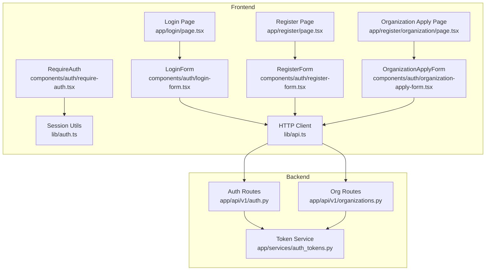
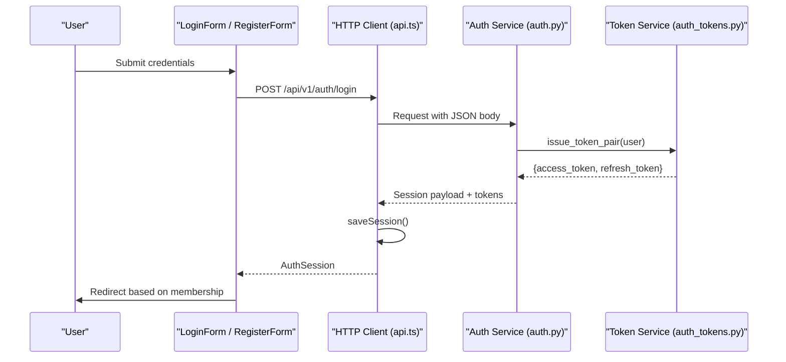
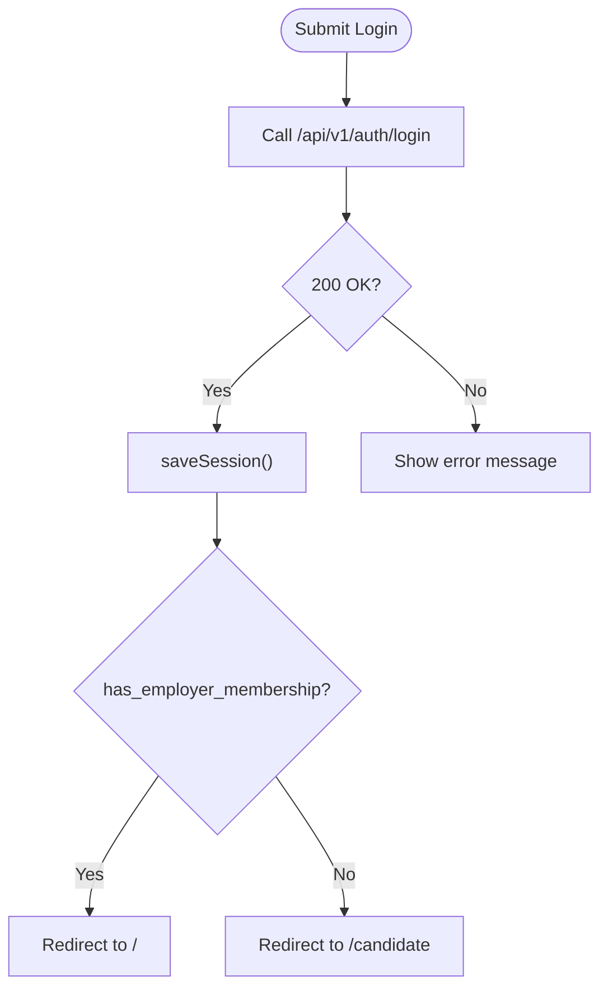
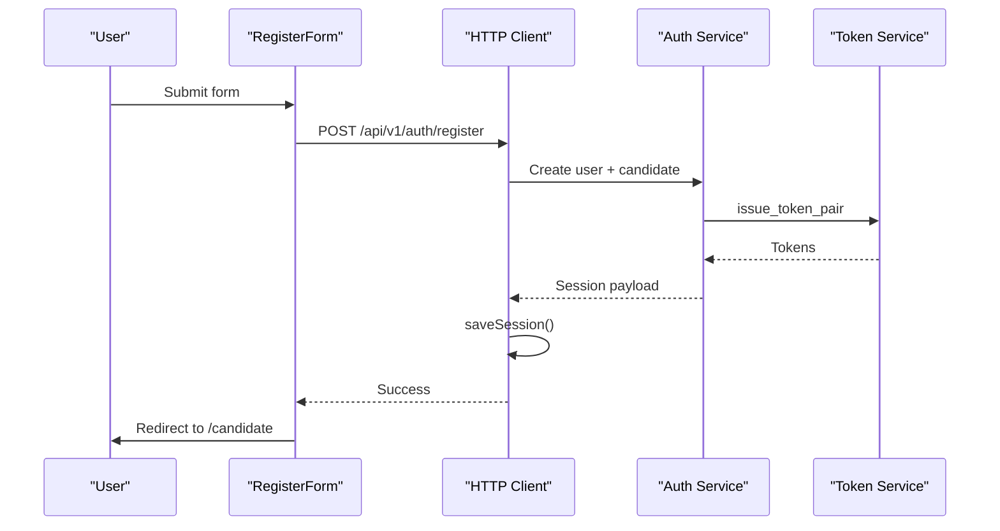
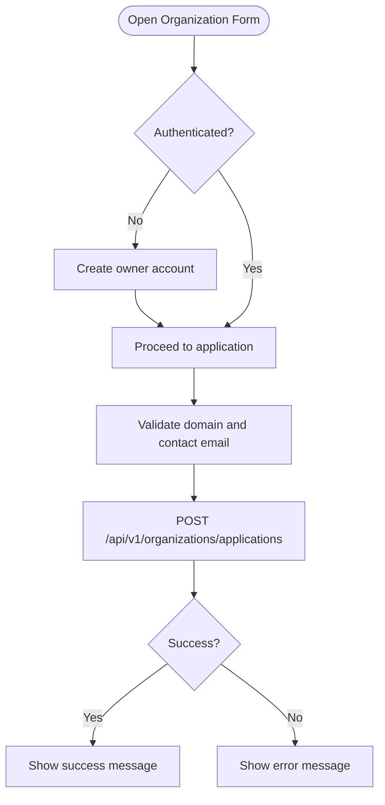
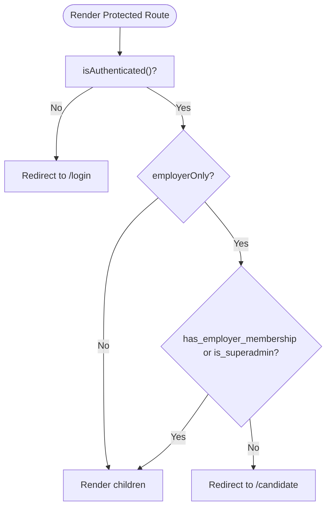
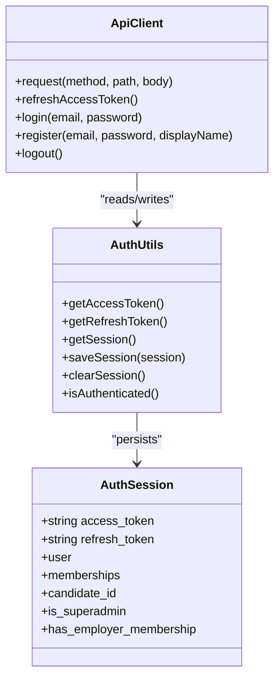
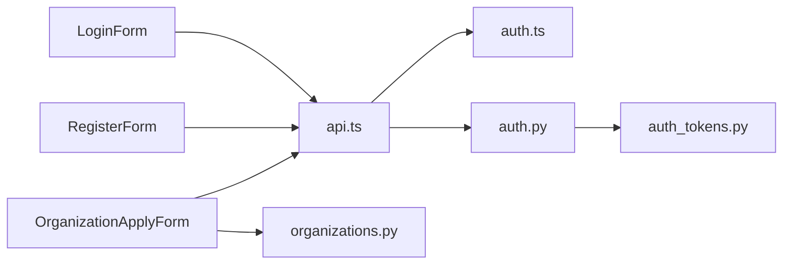

# Authentication & User Registration

<cite>
**Referenced Files in This Document**
- [login-form.tsx](file://Frontend/components/auth/login-form.tsx)
- [register-form.tsx](file://Frontend/components/auth/register-form.tsx)
- [organization-apply-form.tsx](file://Frontend/components/auth/organization-apply-form.tsx)
- [require-auth.tsx](file://Frontend/components/auth/require-auth.tsx)
- [auth.ts](file://Frontend/lib/auth.ts)
- [api.ts](file://Frontend/lib/api.ts)
- [page.tsx (login)](file://Frontend/app/login/page.tsx)
- [page.tsx (register)](file://Frontend/app/register/page.tsx)
- [page.tsx (register organization)](file://Frontend/app/register/organization/page.tsx)
- [auth.py](file://Backend/app/api/v1/auth.py)
- [organizations.py](file://Backend/app/api/v1/organizations.py)
- [auth_tokens.py](file://Backend/app/services/auth_tokens.py)
</cite>

## Table of Contents
1. [Introduction](#introduction)
2. [Project Structure](#project-structure)
3. [Core Components](#core-components)
4. [Architecture Overview](#architecture-overview)
5. [Detailed Component Analysis](#detailed-component-analysis)
6. [Dependency Analysis](#dependency-analysis)
7. [Performance Considerations](#performance-considerations)
8. [Troubleshooting Guide](#troubleshooting-guide)
9. [Conclusion](#conclusion)
10. [Appendices](#appendices)

## Introduction
This document explains the authentication and user registration system for the ATS platform. It covers:
- Login form implementation and navigation
- Multi-step registration flow including personal account creation and organization application
- Route protection with RequireAuth and session-based role checks
- Backend authentication endpoints, token issuance, refresh, and logout
- Organization application workflow for new employer signups
- Token management and session handling on the frontend
- Error states and recovery strategies
- Guidance for extending the registration flow and integrating custom authentication providers

## Project Structure
The authentication experience is split between Next.js pages and reusable components on the frontend, and FastAPI routes plus services on the backend.

**Diagram sources**
- [page.tsx (login):1-9](file://Frontend/app/login/page.tsx#L1-L9)
- [page.tsx (register):1-9](file://Frontend/app/register/page.tsx#L1-L9)
- [page.tsx (register organization):1-9](file://Frontend/app/register/organization/page.tsx#L1-L9)
- [login-form.tsx:1-75](file://Frontend/components/auth/login-form.tsx#L1-L75)
- [register-form.tsx:1-79](file://Frontend/components/auth/register-form.tsx#L1-L79)
- [organization-apply-form.tsx:1-192](file://Frontend/components/auth/organization-apply-form.tsx#L1-L192)
- [require-auth.tsx:1-42](file://Frontend/components/auth/require-auth.tsx#L1-L42)
- [auth.ts:1-70](file://Frontend/lib/auth.ts#L1-L70)
- [api.ts:1-199](file://Frontend/lib/api.ts#L1-L199)
- [auth.py:1-185](file://Backend/app/api/v1/auth.py#L1-L185)
- [organizations.py:1-623](file://Backend/app/api/v1/organizations.py#L1-L623)
- [auth_tokens.py:1-127](file://Backend/app/services/auth_tokens.py#L1-L127)

**Section sources**
- [page.tsx (login):1-9](file://Frontend/app/login/page.tsx#L1-L9)
- [page.tsx (register):1-9](file://Frontend/app/register/page.tsx#L1-L9)
- [page.tsx (register organization):1-9](file://Frontend/app/register/organization/page.tsx#L1-L9)
- [login-form.tsx:1-75](file://Frontend/components/auth/login-form.tsx#L1-L75)
- [register-form.tsx:1-79](file://Frontend/components/auth/register-form.tsx#L1-L79)
- [organization-apply-form.tsx:1-192](file://Frontend/components/auth/organization-apply-form.tsx#L1-L192)
- [require-auth.tsx:1-42](file://Frontend/components/auth/require-auth.tsx#L1-L42)
- [auth.ts:1-70](file://Frontend/lib/auth.ts#L1-L70)
- [api.ts:1-199](file://Frontend/lib/api.ts#L1-L199)
- [auth.py:1-185](file://Backend/app/api/v1/auth.py#L1-L185)
- [organizations.py:1-623](file://Backend/app/api/v1/organizations.py#L1-L623)
- [auth_tokens.py:1-127](file://Backend/app/services/auth_tokens.py#L1-L127)

## Core Components
- LoginForm: Captures email/password, calls login, and redirects based on membership status.
- RegisterForm: Creates a personal candidate account and redirects to candidate area.
- OrganizationApplyForm: Two-phase flow—optionally creates an owner account if not authenticated, then submits an organization application.
- RequireAuth: Guards routes by checking local session and optionally enforcing employer-only access.
- Session utilities: Persist and read tokens and session metadata from localStorage.
- HTTP client: Adds Authorization headers, handles 401 flows with refresh, and exposes login/register/logout helpers.

Key behaviors:
- On successful login, users are routed to "/" if they have employer membership or "/candidate" otherwise.
- Personal registration creates a candidate profile automatically on the backend.
- Organization applications require a valid company domain and matching contact email; submissions are idempotent.

**Section sources**
- [login-form.tsx:15-27](file://Frontend/components/auth/login-form.tsx#L15-L27)
- [register-form.tsx:16-28](file://Frontend/components/auth/register-form.tsx#L16-L28)
- [organization-apply-form.tsx:30-60](file://Frontend/components/auth/organization-apply-form.tsx#L30-L60)
- [require-auth.tsx:17-31](file://Frontend/components/auth/require-auth.tsx#L17-L31)
- [auth.ts:26-65](file://Frontend/lib/auth.ts#L26-L65)
- [api.ts:157-176](file://Frontend/lib/api.ts#L157-L176)

## Architecture Overview
End-to-end authentication flow from UI to backend and back:

**Diagram sources**
- [login-form.tsx:15-27](file://Frontend/components/auth/login-form.tsx#L15-L27)
- [api.ts:157-161](file://Frontend/lib/api.ts#L157-L161)
- [auth.py:104-127](file://Backend/app/api/v1/auth.py#L104-L127)
- [auth_tokens.py:67-86](file://Backend/app/services/auth_tokens.py#L67-L86)

## Detailed Component Analysis

### Login Flow
- The login page renders LoginForm which collects email and password.
- On submit, it calls the login helper, saves the session, and navigates to "/" for employers or "/candidate" for candidates.
- Errors are surfaced via ApiError messages.

**Diagram sources**
- [login-form.tsx:15-27](file://Frontend/components/auth/login-form.tsx#L15-L27)
- [api.ts:157-161](file://Frontend/lib/api.ts#L157-L161)
- [auth.py:104-127](file://Backend/app/api/v1/auth.py#L104-L127)

**Section sources**
- [login-form.tsx:1-75](file://Frontend/components/auth/login-form.tsx#L1-L75)
- [api.ts:157-161](file://Frontend/lib/api.ts#L157-L161)
- [auth.py:104-127](file://Backend/app/api/v1/auth.py#L104-L127)

### Personal Registration Flow
- RegisterForm collects full name, email, and password.
- Calls register, which posts to /api/v1/auth/register and persists the session.
- Backend creates a user, auto-creates a candidate record if no memberships exist, and issues tokens.

**Diagram sources**
- [register-form.tsx:16-28](file://Frontend/components/auth/register-form.tsx#L16-L28)
- [api.ts:163-176](file://Frontend/lib/api.ts#L163-L176)
- [auth.py:74-101](file://Backend/app/api/v1/auth.py#L74-L101)
- [auth_tokens.py:67-86](file://Backend/app/services/auth_tokens.py#L67-L86)

**Section sources**
- [register-form.tsx:1-79](file://Frontend/components/auth/register-form.tsx#L1-L79)
- [api.ts:163-176](file://Frontend/lib/api.ts#L163-L176)
- [auth.py:74-101](file://Backend/app/api/v1/auth.py#L74-L101)

### Organization Application Workflow (New Employer Signup)
- If not authenticated, the form first registers an owner account using the provided details, then proceeds.
- Submits an organization application with validated fields (domain, contact email must match domain).
- Applications are idempotent and can be pending or verified depending on environment settings.

**Diagram sources**
- [organization-apply-form.tsx:25-60](file://Frontend/components/auth/organization-apply-form.tsx#L25-L60)
- [organizations.py:130-218](file://Backend/app/api/v1/organizations.py#L130-L218)

**Section sources**
- [organization-apply-form.tsx:1-192](file://Frontend/components/auth/organization-apply-form.tsx#L1-L192)
- [organizations.py:130-218](file://Backend/app/api/v1/organizations.py#L130-L218)

### Route Protection with RequireAuth
- RequireAuth checks if a session exists; if not, redirects to /login.
- For employer-only routes, it reads the session from localStorage and ensures the user has employer membership or is a superadmin; otherwise, redirects to /candidate.
- Displays a brief “Checking your session…” state while validating.

**Diagram sources**
- [require-auth.tsx:17-31](file://Frontend/components/auth/require-auth.tsx#L17-L31)
- [auth.ts:63-65](file://Frontend/lib/auth.ts#L63-L65)

**Section sources**
- [require-auth.tsx:1-42](file://Frontend/components/auth/require-auth.tsx#L1-L42)
- [auth.ts:63-65](file://Frontend/lib/auth.ts#L63-L65)

### Password Reset Flows
- The current main frontend does not include a dedicated “forgot password” page.
- A separate frontend branch includes a setup-password flow that forces a temporary password change after login when required by the server.
- For this repository’s primary frontend, consider adding a forgot-password endpoint and UI that calls a backend reset flow and sends email instructions.

[No sources needed since this section provides general guidance]

### Token Management and Session Handling
- Tokens and session metadata are stored in localStorage under specific keys.
- The HTTP client attaches Bearer tokens to requests and handles 401 responses by refreshing the access token using the refresh token.
- Logout revokes the refresh token (best-effort) and clears local storage.

**Diagram sources**
- [auth.ts:1-70](file://Frontend/lib/auth.ts#L1-L70)
- [api.ts:23-57](file://Frontend/lib/api.ts#L23-L57)
- [api.ts:157-188](file://Frontend/lib/api.ts#L157-L188)

**Section sources**
- [auth.ts:26-65](file://Frontend/lib/auth.ts#L26-L65)
- [api.ts:23-57](file://Frontend/lib/api.ts#L23-L57)
- [api.ts:157-188](file://Frontend/lib/api.ts#L157-L188)
- [auth_tokens.py:22-64](file://Backend/app/services/auth_tokens.py#L22-L64)
- [auth_tokens.py:67-127](file://Backend/app/services/auth_tokens.py#L67-L127)

### Backend Authentication Endpoints
- POST /api/v1/auth/register: Creates user, optional candidate record, issues tokens, returns session payload.
- POST /api/v1/auth/login: Validates credentials, checks account status, issues tokens, returns session payload.
- POST /api/v1/auth/refresh: Rotates refresh token and issues new pair.
- POST /api/v1/auth/logout: Revokes refresh token.
- GET /api/v1/auth/me: Returns current user info, memberships, and application status.

**Section sources**
- [auth.py:19-35](file://Backend/app/api/v1/auth.py#L19-L35)
- [auth.py:74-101](file://Backend/app/api/v1/auth.py#L74-L101)
- [auth.py:104-127](file://Backend/app/api/v1/auth.py#L104-L127)
- [auth.py:130-148](file://Backend/app/api/v1/auth.py#L130-L148)
- [auth.py:151-185](file://Backend/app/api/v1/auth.py#L151-L185)

## Dependency Analysis
- Frontend components depend on lib/api.ts for network operations and lib/auth.ts for session persistence.
- api.ts depends on auth.ts to read/write tokens and session data.
- Backend auth routes depend on auth_tokens service for JWT and refresh token lifecycle.
- Organization application route validates inputs and persists applications with idempotency.

**Diagram sources**
- [login-form.tsx:1-75](file://Frontend/components/auth/login-form.tsx#L1-L75)
- [register-form.tsx:1-79](file://Frontend/components/auth/register-form.tsx#L1-L79)
- [organization-apply-form.tsx:1-192](file://Frontend/components/auth/organization-apply-form.tsx#L1-L192)
- [api.ts:1-199](file://Frontend/lib/api.ts#L1-L199)
- [auth.ts:1-70](file://Frontend/lib/auth.ts#L1-L70)
- [auth.py:1-185](file://Backend/app/api/v1/auth.py#L1-L185)
- [organizations.py:1-623](file://Backend/app/api/v1/organizations.py#L1-L623)
- [auth_tokens.py:1-127](file://Backend/app/services/auth_tokens.py#L1-L127)

**Section sources**
- [api.ts:1-199](file://Frontend/lib/api.ts#L1-L199)
- [auth.ts:1-70](file://Frontend/lib/auth.ts#L1-L70)
- [auth.py:1-185](file://Backend/app/api/v1/auth.py#L1-L185)
- [organizations.py:1-623](file://Backend/app/api/v1/organizations.py#L1-L623)
- [auth_tokens.py:1-127](file://Backend/app/services/auth_tokens.py#L1-L127)

## Performance Considerations
- Use idempotency keys for organization applications to prevent duplicate submissions.
- Avoid unnecessary re-renders in RequireAuth by keeping validation minimal and leveraging React state efficiently.
- Batch token refresh attempts to avoid concurrent refresh calls (already implemented via a single promise guard).
- Keep session payloads small; only store necessary fields in localStorage.

[No sources needed since this section provides general guidance]

## Troubleshooting Guide
Common errors and resolutions:
- Invalid credentials: Ensure correct email/password; check backend logs for account status.
- Account disabled: Contact administrator to reactivate the account.
- Domain mismatch in organization application: Provide a valid company domain and ensure contact email matches.
- Network unreachable: Verify backend is running and accessible; check CORS and base URL configuration.
- Token expired: The client will attempt to refresh; if refresh fails, clear session and sign in again.

**Section sources**
- [auth.py:112-123](file://Backend/app/api/v1/auth.py#L112-L123)
- [organizations.py:147-166](file://Backend/app/api/v1/organizations.py#L147-L166)
- [api.ts:78-103](file://Frontend/lib/api.ts#L78-L103)
- [api.ts:23-57](file://Frontend/lib/api.ts#L23-L57)

## Conclusion
The authentication and registration system provides a secure, user-friendly flow for both candidates and employers. The frontend manages sessions locally and delegates identity verification to the backend, which issues short-lived access tokens and long-lived refresh tokens. Organization applications enforce domain validation and support idempotent submissions. RequireAuth ensures protected routes are only accessible to authorized users. Extensibility points exist for adding password reset flows, additional registration fields, and custom authentication providers.

[No sources needed since this section summarizes without analyzing specific files]

## Appendices

### Extending Registration with Additional Fields
- Add new fields to RegisterForm and validate them client-side.
- Update the backend RegisterRequest schema to accept new fields and persist them in the user record.
- Adjust session payload if new fields should be included in the client session.

[No sources needed since this section provides general guidance]

### Implementing Custom Authentication Providers
- Introduce a provider abstraction in the frontend to encapsulate login/register/logout calls.
- Map provider-specific responses to the internal AuthSession shape used by the rest of the app.
- On the backend, add routes or middleware to handle external provider callbacks and issue standard token pairs.

[No sources needed since this section provides general guidance]