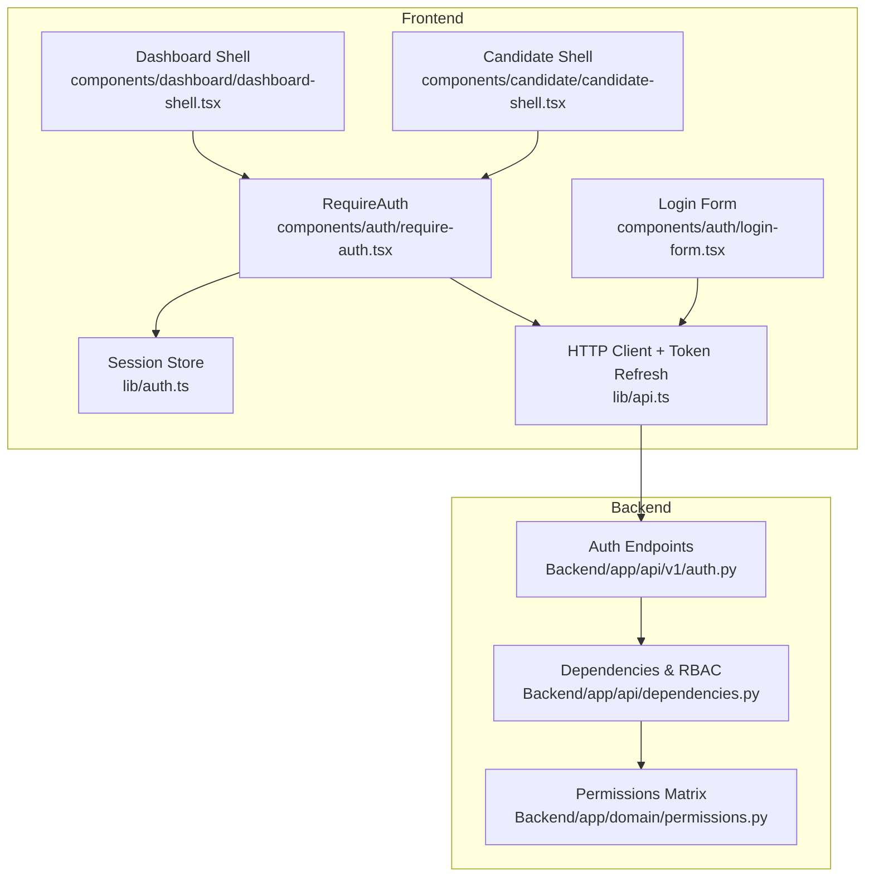
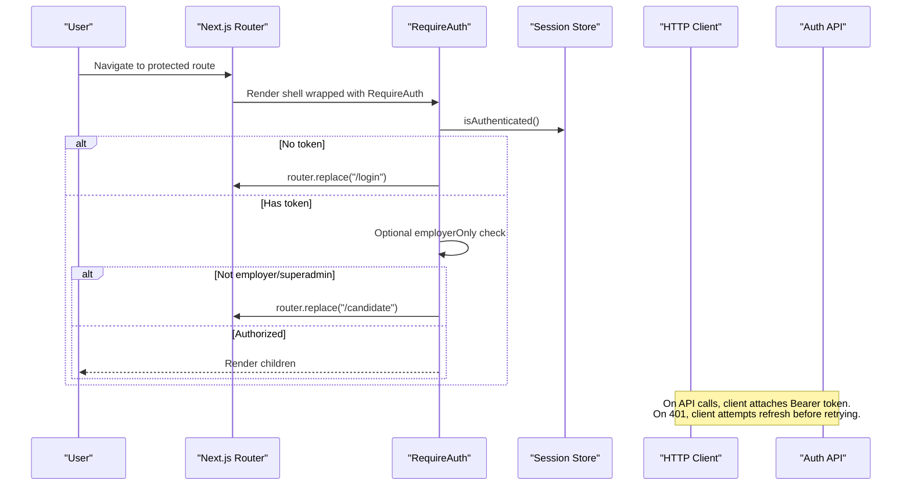
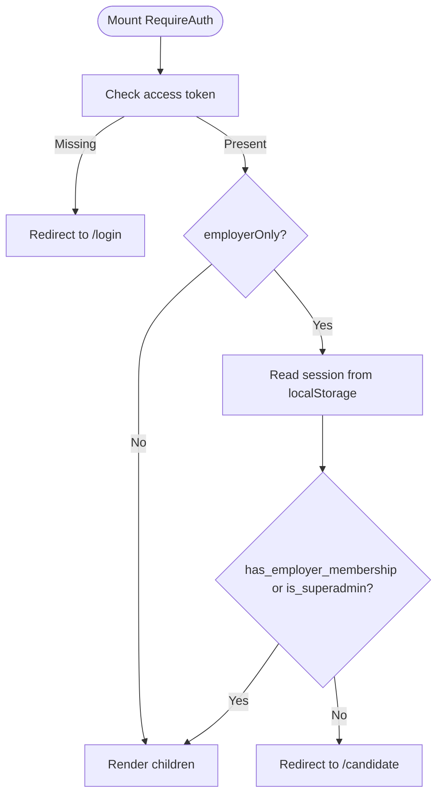
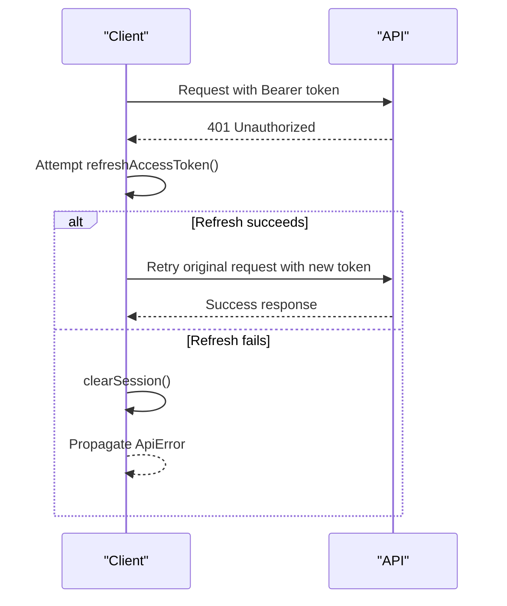
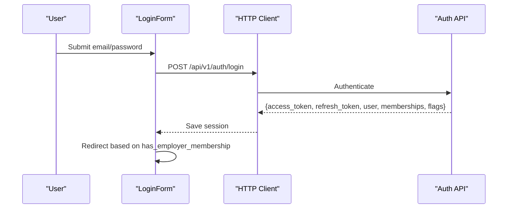
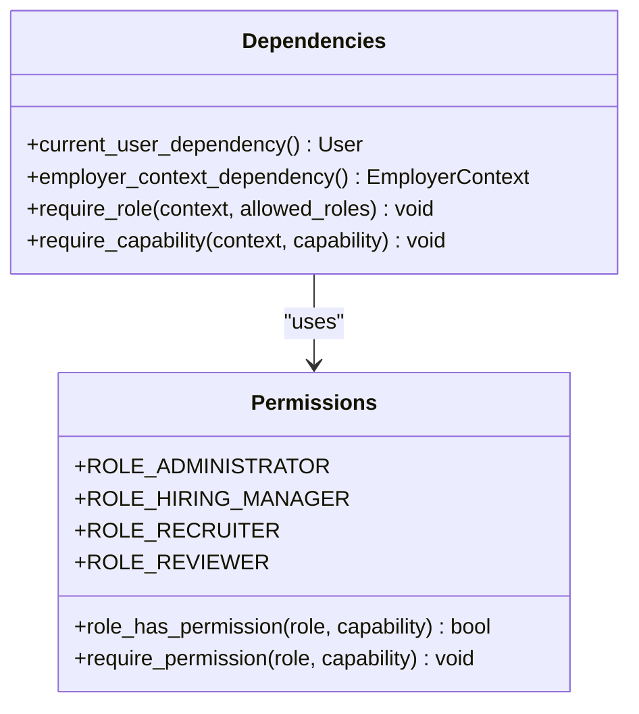

# Authentication Guard & Route Protection

<cite>
**Referenced Files in This Document**
- [require-auth.tsx](file://Frontend/components/auth/require-auth.tsx)
- [auth.ts](file://Frontend/lib/auth.ts)
- [api.ts](file://Frontend/lib/api.ts)
- [login-form.tsx](file://Frontend/components/auth/login-form.tsx)
- [dashboard-shell.tsx](file://Frontend/components/dashboard/dashboard-shell.tsx)
- [candidate-shell.tsx](file://Frontend/components/candidate/candidate-shell.tsx)
- [auth.py](file://Backend/app/api/v1/auth.py)
- [dependencies.py](file://Backend/app/api/dependencies.py)
- [permissions.py](file://Backend/app/domain/permissions.py)
</cite>

## Table of Contents
1. [Introduction](#introduction)
2. [Project Structure](#project-structure)
3. [Core Components](#core-components)
4. [Architecture Overview](#architecture-overview)
5. [Detailed Component Analysis](#detailed-component-analysis)
6. [Dependency Analysis](#dependency-analysis)
7. [Performance Considerations](#performance-considerations)
8. [Troubleshooting Guide](#troubleshooting-guide)
9. [Conclusion](#conclusion)
10. [Appendices](#appendices)

## Introduction
This document explains the RequireAuth component and route protection mechanisms used to guard client-side routes, manage user sessions, and enforce role-based access across the application. It covers how authentication state is checked, how unauthenticated users are redirected, how Next.js routing integrates with the guard, and how token validation and session refresh work end-to-end with the backend. It also provides best practices for protecting different types of routes and implementing role-based access control patterns.

## Project Structure
The authentication flow spans three layers:
- Frontend components that wrap protected routes (RequireAuth and shells).
- Frontend utilities that store and validate tokens and sessions.
- Backend endpoints that issue, refresh, and revoke tokens and enforce permissions.

**Diagram sources**
- [require-auth.tsx:1-41](file://Frontend/components/auth/require-auth.tsx#L1-L41)
- [auth.ts:1-70](file://Frontend/lib/auth.ts#L1-L70)
- [api.ts:23-104](file://Frontend/lib/api.ts#L23-L104)
- [login-form.tsx:15-27](file://Frontend/components/auth/login-form.tsx#L15-L27)
- [dashboard-shell.tsx:171-177](file://Frontend/components/dashboard/dashboard-shell.tsx#L171-L177)
- [candidate-shell.tsx:86-92](file://Frontend/components/candidate/candidate-shell.tsx#L86-L92)
- [auth.py:104-148](file://Backend/app/api/v1/auth.py#L104-L148)
- [dependencies.py:93-114](file://Backend/app/api/dependencies.py#L93-L114)
- [permissions.py:27-63](file://Backend/app/domain/permissions.py#L27-L63)

**Section sources**
- [require-auth.tsx:1-41](file://Frontend/components/auth/require-auth.tsx#L1-L41)
- [auth.ts:1-70](file://Frontend/lib/auth.ts#L1-L70)
- [api.ts:23-104](file://Frontend/lib/api.ts#L23-L104)
- [login-form.tsx:15-27](file://Frontend/components/auth/login-form.tsx#L15-L27)
- [dashboard-shell.tsx:171-177](file://Frontend/components/dashboard/dashboard-shell.tsx#L171-L177)
- [candidate-shell.tsx:86-92](file://Frontend/components/candidate/candidate-shell.tsx#L86-L92)
- [auth.py:104-148](file://Backend/app/api/v1/auth.py#L104-L148)
- [dependencies.py:93-114](file://Backend/app/api/dependencies.py#L93-L114)
- [permissions.py:27-63](file://Backend/app/domain/permissions.py#L27-L63)

## Core Components
- RequireAuth: A client-side guard that checks if a user has an active access token and optionally enforces employer-only access. It renders a loading state while checking and redirects as needed using Next.js navigation.
- Session storage: Centralized helpers to read/write access token, refresh token, and full session object from localStorage.
- HTTP client: Adds Authorization headers, handles 401 responses by refreshing tokens, and surfaces typed errors.
- Login form: Authenticates against the backend, saves the session, and navigates based on membership.

Key behaviors:
- Unauthenticated users are redirected to /login.
- Employer-only routes redirect non-employers to /candidate.
- Token refresh is automatic on 401 responses; failed refresh clears the session.

**Section sources**
- [require-auth.tsx:7-41](file://Frontend/components/auth/require-auth.tsx#L7-L41)
- [auth.ts:26-69](file://Frontend/lib/auth.ts#L26-L69)
- [api.ts:23-104](file://Frontend/lib/api.ts#L23-L104)
- [login-form.tsx:15-27](file://Frontend/components/auth/login-form.tsx#L15-L27)

## Architecture Overview
The guard operates at the UI layer and delegates session persistence and network requests to dedicated modules. The backend issues JWTs and supports refresh flows. Role-based checks are enforced server-side via dependencies and permission matrices.

**Diagram sources**
- [require-auth.tsx:17-31](file://Frontend/components/auth/require-auth.tsx#L17-L31)
- [auth.ts:63-69](file://Frontend/lib/auth.ts#L63-L69)
- [api.ts:59-104](file://Frontend/lib/api.ts#L59-L104)
- [auth.py:104-148](file://Backend/app/api/v1/auth.py#L104-L148)

## Detailed Component Analysis

### RequireAuth Component
Responsibilities:
- Check authentication via stored access token.
- Enforce optional employer-only constraint by inspecting session flags.
- Redirect unauthenticated or unauthorized users to appropriate routes.
- Show a brief loading indicator during checks.

Props:
- children: ReactNode to render when authorized.
- employerOnly?: boolean to restrict to employers or superadmins.

Flow:
- On mount, if no access token exists, redirect to login.
- If employerOnly is true, verify session.has_employer_membership or session.is_superadmin; otherwise redirect to candidate.
- Once checks pass, set internal ok flag to render children.

Integration with Next.js:
- Uses next/navigation’s router.replace to avoid history stacking.
- Works well with App Router pages that wrap content in layout/shell components.

**Diagram sources**
- [require-auth.tsx:17-31](file://Frontend/components/auth/require-auth.tsx#L17-L31)
- [auth.ts:40-49](file://Frontend/lib/auth.ts#L40-L49)

**Section sources**
- [require-auth.tsx:7-41](file://Frontend/components/auth/require-auth.tsx#L7-L41)

### Session Storage and Token Management
- Stores access_token, refresh_token, and full session under stable keys.
- Provides helpers to get, save, clear, and check authentication status.
- Supports safe parsing of session JSON and guards against undefined environments.

Best practices:
- Always use getSession/saveSession/clearSession instead of direct localStorage access.
- Use currentSession where you need the full context (e.g., memberships, flags).

**Section sources**
- [auth.ts:1-70](file://Frontend/lib/auth.ts#L1-L70)

### HTTP Client and Token Refresh
- Attaches Authorization header with Bearer token when present.
- On 401, attempts a single refresh call; on success, retries the original request once.
- On refresh failure or invalid credentials, clears local session to force re-login.
- Wraps errors into a typed ApiError with code and message for consistent handling.

**Diagram sources**
- [api.ts:23-57](file://Frontend/lib/api.ts#L23-L57)
- [api.ts:59-104](file://Frontend/lib/api.ts#L59-L104)

**Section sources**
- [api.ts:23-104](file://Frontend/lib/api.ts#L23-L104)

### Login Flow and Post-Login Routing
- Submits credentials to the backend login endpoint.
- Saves returned session to localStorage.
- Navigates to dashboard if the user has employer membership; otherwise to candidate portal.

**Diagram sources**
- [login-form.tsx:15-27](file://Frontend/components/auth/login-form.tsx#L15-L27)
- [auth.py:104-127](file://Backend/app/api/v1/auth.py#L104-L127)

**Section sources**
- [login-form.tsx:15-27](file://Frontend/components/auth/login-form.tsx#L15-L27)
- [auth.py:104-127](file://Backend/app/api/v1/auth.py#L104-L127)

### Protecting Different Types of Routes
- Candidate routes: Wrap page content in CandidateShell which uses RequireAuth without employerOnly.
- Employer routes: Wrap in DashboardShell which uses RequireAuth with employerOnly to ensure only employers/superadmins can access.
- Public routes: Do not wrap with RequireAuth (e.g., login, register).

Examples:
- Candidate portal: CandidateShell wraps all candidate pages.
- Employer dashboard: DashboardShell wraps employer workspace pages.

**Section sources**
- [candidate-shell.tsx:86-92](file://Frontend/components/candidate/candidate-shell.tsx#L86-L92)
- [dashboard-shell.tsx:171-177](file://Frontend/components/dashboard/dashboard-shell.tsx#L171-L177)

### Role-Based Access Control (RBAC) Patterns
- Frontend-level gating: RequireAuth with employerOnly protects high-level areas.
- Backend-level enforcement: Dependencies extract current user and organization context; require_role and require_capability enforce fine-grained permissions per endpoint.
- Permission matrix: Centralized mapping of roles to capabilities ensures consistent authorization decisions.

**Diagram sources**
- [permissions.py:27-63](file://Backend/app/domain/permissions.py#L27-L63)
- [dependencies.py:93-114](file://Backend/app/api/dependencies.py#L93-L114)
- [dependencies.py:165-175](file://Backend/app/api/dependencies.py#L165-L175)

**Section sources**
- [permissions.py:27-63](file://Backend/app/domain/permissions.py#L27-L63)
- [dependencies.py:93-114](file://Backend/app/api/dependencies.py#L93-L114)
- [dependencies.py:165-175](file://Backend/app/api/dependencies.py#L165-L175)

## Dependency Analysis
- RequireAuth depends on:
  - next/navigation for routing.
  - lib/auth for token presence checks.
  - localStorage for reading session data when enforcing employerOnly.
- HTTP client depends on:
  - lib/auth for token/session retrieval and mutation.
  - Backend auth endpoints for login/register/refresh/logout.
- Shells depend on RequireAuth to protect their entire subtree.

Potential coupling risks:
- Direct localStorage reads in RequireAuth for employerOnly could be centralized into a helper in lib/auth for consistency and testability.
- Ensure all protected routes go through shells or RequireAuth to avoid bypasses.

**Section sources**
- [require-auth.tsx:17-31](file://Frontend/components/auth/require-auth.tsx#L17-L31)
- [auth.ts:40-69](file://Frontend/lib/auth.ts#L40-L69)
- [api.ts:59-104](file://Frontend/lib/api.ts#L59-L104)

## Performance Considerations
- Keep RequireAuth lightweight; it performs synchronous checks and minimal DOM updates.
- Avoid redundant session reads by caching session in component state when necessary (as shells do).
- Token refresh is coalesced to a single in-flight request to prevent thundering herds on 401 storms.
- Prefer wrapping entire shells rather than individual pages to reduce repeated guard logic.

[No sources needed since this section provides general guidance]

## Troubleshooting Guide
Common issues and resolutions:
- Infinite redirect loop:
  - Ensure RequireAuth only redirects when checks fail; confirm employerOnly usage matches intended audience.
  - Verify login flow sets session and navigates correctly.
- Stuck on “Checking your session…”:
  - Confirm access token exists in localStorage and is valid.
  - Check network connectivity to backend; ensure refresh endpoint responds.
- 401 loops after logout:
  - Ensure logout clears session and refresh token.
  - Confirm backend revokes refresh token on logout.
- Unauthorized access to employer routes:
  - Validate session.has_employer_membership or is_superadmin flags are set post-login.
  - Review backend RBAC to ensure endpoints enforce roles.

Operational tips:
- Use ApiError codes to surface meaningful messages to users.
- Log refresh attempts and failures to diagnose token lifecycle issues.
- Add explicit error boundaries around protected shells to catch rendering errors after redirects.

**Section sources**
- [api.ts:23-57](file://Frontend/lib/api.ts#L23-L57)
- [api.ts:59-104](file://Frontend/lib/api.ts#L59-L104)
- [auth.py:130-148](file://Backend/app/api/v1/auth.py#L130-L148)

## Conclusion
RequireAuth provides a simple, effective client-side gate for protected routes, integrating seamlessly with Next.js routing and the application’s session store. Combined with robust token refresh in the HTTP client and strict backend RBAC, it delivers a secure and user-friendly authentication experience. For best results, wrap entire shells with RequireAuth, centralize session operations, and rely on backend dependencies for fine-grained authorization.

[No sources needed since this section summarizes without analyzing specific files]

## Appendices

### Best Practices for Using the Authentication Guard
- Always wrap protected shells with RequireAuth to avoid per-page duplication.
- Use employerOnly for employer-only sections; keep candidate sections open to any authenticated user.
- Centralize session reads/writes via lib/auth helpers to maintain consistency.
- Handle 401 errors gracefully by relying on automatic refresh; clear session on persistent failures.
- Enforce permissions server-side using require_role and require_capability for every sensitive endpoint.

[No sources needed since this section provides general guidance]