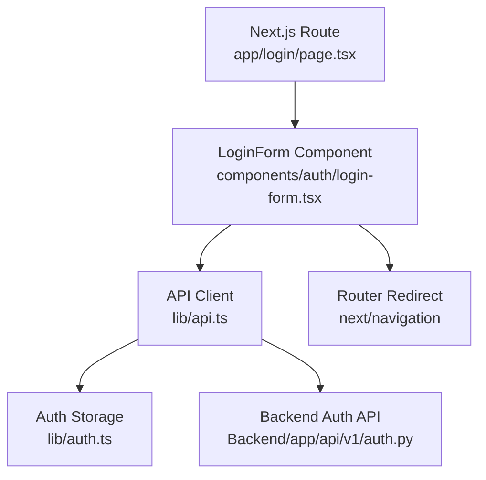
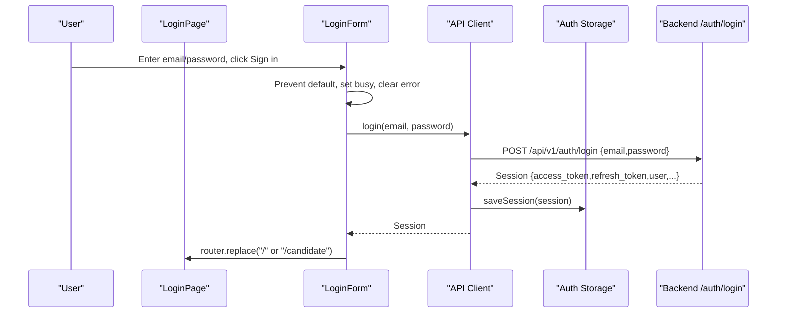
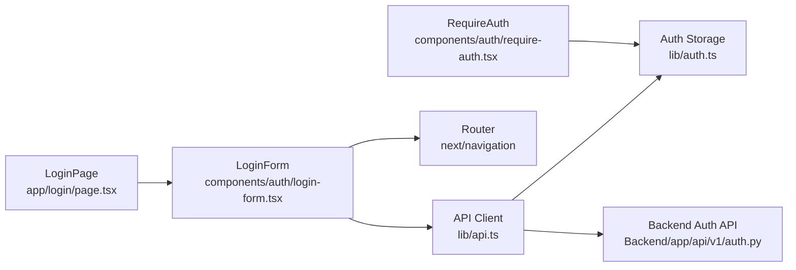

# Login Page & Form

<cite>
**Referenced Files in This Document**
- [page.tsx](file://Frontend/app/login/page.tsx)
- [login-form.tsx](file://Frontend/components/auth/login-form.tsx)
- [api.ts](file://Frontend/lib/api.ts)
- [auth.ts](file://Frontend/lib/auth.ts)
- [require-auth.tsx](file://Frontend/components/auth/require-auth.tsx)
- [auth.py](file://Backend/app/api/v1/auth.py)
- [globals.css](file://Frontend/app/globals.css)
</cite>

## Table of Contents
1. [Introduction](#introduction)
2. [Project Structure](#project-structure)
3. [Core Components](#core-components)
4. [Architecture Overview](#architecture-overview)
5. [Detailed Component Analysis](#detailed-component-analysis)
6. [Dependency Analysis](#dependency-analysis)
7. [Performance Considerations](#performance-considerations)
8. [Troubleshooting Guide](#troubleshooting-guide)
9. [Conclusion](#conclusion)

## Introduction
This document explains the login page and form implementation, covering how the LoginPage renders the LoginForm component, the UI inputs, validation, error handling, submission flow, authentication state management, token storage, redirect logic after successful login, backend integration, accessibility features, and responsive design considerations.

## Project Structure
The login feature spans a minimal Next.js page that renders a client-side form component. The form calls a centralized API client which handles network requests, token refresh, and session persistence. On success, the user is redirected based on their membership type.

**Diagram sources**
- [page.tsx:1-9](file://Frontend/app/login/page.tsx#L1-L9)
- [login-form.tsx:1-75](file://Frontend/components/auth/login-form.tsx#L1-L75)
- [api.ts:157-161](file://Frontend/lib/api.ts#L157-L161)
- [auth.ts:26-65](file://Frontend/lib/auth.ts#L26-L65)
- [auth.py:104-127](file://Backend/app/api/v1/auth.py#L104-L127)

**Section sources**
- [page.tsx:1-9](file://Frontend/app/login/page.tsx#L1-L9)
- [login-form.tsx:1-75](file://Frontend/components/auth/login-form.tsx#L1-L75)

## Core Components
- LoginPage (route): Renders the LoginForm component and sets the page metadata.
- LoginForm (client component): Manages email/password state, submits to the backend via the API client, handles errors, and redirects upon success.
- API client: Provides login/register/logout helpers, automatic token refresh, and consistent error mapping.
- Auth storage: Persists access token, refresh token, and full session in localStorage with getters/setters.
- RequireAuth: Protects routes by checking authentication and role-based access.

Key responsibilities:
- UI: Two input fields (email, password), submit button, error display, links to registration.
- Validation: HTML5 required attributes; no custom regex validation in the form.
- Submission: Prevent default, call login(), save session, then redirect.
- Error handling: Display server-provided messages or generic fallback.
- Redirect: Navigate to home for employer members, otherwise candidate portal.

**Section sources**
- [login-form.tsx:8-75](file://Frontend/components/auth/login-form.tsx#L8-L75)
- [api.ts:157-161](file://Frontend/lib/api.ts#L157-L161)
- [auth.ts:26-65](file://Frontend/lib/auth.ts#L26-L65)
- [require-auth.tsx:1-42](file://Frontend/components/auth/require-auth.tsx#L1-L42)

## Architecture Overview
End-to-end login flow from UI to backend and back:

**Diagram sources**
- [login-form.tsx:15-27](file://Frontend/components/auth/login-form.tsx#L15-L27)
- [api.ts:157-161](file://Frontend/lib/api.ts#L157-L161)
- [auth.ts:51-55](file://Frontend/lib/auth.ts#L51-L55)
- [auth.py:104-127](file://Backend/app/api/v1/auth.py#L104-L127)

## Detailed Component Analysis

### LoginPage
- Purpose: Route entry point for sign-in.
- Behavior: Imports and renders LoginForm; sets page title via metadata.

**Section sources**
- [page.tsx:1-9](file://Frontend/app/login/page.tsx#L1-L9)

### LoginForm
- State:
  - email, password: Controlled inputs with initial demo values.
  - error: Stores last error message.
  - busy: Disables submit during request.
- Inputs:
  - Email input with type="email", required, and autocomplete="username".
  - Password input with type="password", required, and autocomplete="current-password".
- Submission:
  - Prevents default form submission.
  - Calls login() from API client.
  - On success, redirects using next/navigation router.replace to "/" if has_employer_membership is true, else "/candidate".
  - On failure, sets error to ApiError.message or a generic message.
- UI:
  - Displays an error paragraph with role="alert" when present.
  - Button shows loading text while busy and is disabled during submission.
  - Includes links to register and organization registration.

Validation and error handling:
- Uses native browser validation (required).
- Backend returns structured errors mapped to ApiError; UI displays message.

Redirect logic:
- Based on session.has_employer_membership returned by the backend.

Accessibility:
- Semantic labels via label elements.
- aria roles used for error announcements.
- Focus styles provided globally.

Responsive design:
- Styled via auth-page and auth-card classes for centered card layout.

**Section sources**
- [login-form.tsx:8-75](file://Frontend/components/auth/login-form.tsx#L8-L75)
- [globals.css:383-415](file://Frontend/app/globals.css#L383-L415)

### API Client (login helper)
- login(email, password):
  - POSTs to /api/v1/auth/login with JSON body.
  - Saves session via saveSession on success.
  - Returns session object to caller.
- Error handling:
  - Network errors throw ApiError with code "network_unreachable".
  - HTTP errors map to ApiError with status, code, and message.
- Token refresh:
  - Automatic refresh on 401 for non-auth endpoints; not invoked for login itself.

**Section sources**
- [api.ts:12-21](file://Frontend/lib/api.ts#L12-L21)
- [api.ts:25-57](file://Frontend/lib/api.ts#L25-L57)
- [api.ts:59-104](file://Frontend/lib/api.ts#L59-L104)
- [api.ts:157-161](file://Frontend/lib/api.ts#L157-L161)

### Auth Storage
- Keys:
  - thos.access_token
  - thos.refresh_token
  - thos.session (JSON stringified)
- Functions:
  - getAccessToken/getRefreshToken/getSession: read-only accessors.
  - saveSession: persists tokens and session.
  - clearSession: removes all keys.
  - isAuthenticated: checks presence of access token.
  - currentSession: alias to getSession.

Security note: Tokens are stored in localStorage; consider environment constraints and security policies.

**Section sources**
- [auth.ts:1-24](file://Frontend/lib/auth.ts#L1-L24)
- [auth.ts:26-65](file://Frontend/lib/auth.ts#L26-L65)

### RequireAuth (Route Protection)
- Checks isAuthenticated before rendering protected content.
- If not authenticated, redirects to /login.
- For employerOnly routes, verifies has_employer_membership or is_superadmin; otherwise redirects to /candidate.

**Section sources**
- [require-auth.tsx:1-42](file://Frontend/components/auth/require-auth.tsx#L1-L42)

### Backend Authentication API
- Endpoints:
  - POST /api/v1/auth/login: Validates credentials, issues token pair, returns session including memberships and flags like has_employer_membership.
  - POST /api/v1/auth/register: Creates user and returns session.
  - POST /api/v1/auth/refresh: Rotates refresh token and returns new session.
  - POST /api/v1/auth/logout: Revokes refresh token.
  - GET /api/v1/auth/me: Returns current user info and memberships.
- Errors:
  - Invalid credentials: 401 with code "invalid_credentials".
  - Disabled account: 403 with code "account_disabled".
  - Registration conflicts: 409 with code "email_already_registered".

**Section sources**
- [auth.py:19-36](file://Backend/app/api/v1/auth.py#L19-L36)
- [auth.py:104-127](file://Backend/app/api/v1/auth.py#L104-L127)
- [auth.py:130-148](file://Backend/app/api/v1/auth.py#L130-L148)
- [auth.py:151-184](file://Backend/app/api/v1/auth.py#L151-L184)

## Dependency Analysis
High-level dependencies between components:

**Diagram sources**
- [page.tsx:1-9](file://Frontend/app/login/page.tsx#L1-L9)
- [login-form.tsx:1-75](file://Frontend/components/auth/login-form.tsx#L1-L75)
- [api.ts:157-161](file://Frontend/lib/api.ts#L157-L161)
- [auth.ts:26-65](file://Frontend/lib/auth.ts#L26-L65)
- [auth.py:104-127](file://Backend/app/api/v1/auth.py#L104-L127)
- [require-auth.tsx:1-42](file://Frontend/components/auth/require-auth.tsx#L1-L42)

**Section sources**
- [login-form.tsx:1-75](file://Frontend/components/auth/login-form.tsx#L1-L75)
- [api.ts:157-161](file://Frontend/lib/api.ts#L157-L161)
- [auth.ts:26-65](file://Frontend/lib/auth.ts#L26-L65)
- [auth.py:104-127](file://Backend/app/api/v1/auth.py#L104-L127)
- [require-auth.tsx:1-42](file://Frontend/components/auth/require-auth.tsx#L1-L42)

## Performance Considerations
- Minimal state updates: Only four local states in LoginForm reduce re-renders.
- Single network call per login attempt; API client centralizes retry and refresh logic.
- No heavy computations; UI remains responsive during submission due to disabled button and async flow.
- Avoid unnecessary re-renders by keeping controlled inputs simple.

[No sources needed since this section provides general guidance]

## Troubleshooting Guide
Common issues and resolutions:
- Network unreachable:
  - Symptom: Error message indicates API is unreachable.
  - Cause: Backend not running or wrong API base URL.
  - Resolution: Start backend service and verify NEXT_PUBLIC_API_URL.
- Invalid credentials:
  - Symptom: Error displayed with “Email or password is incorrect.”
  - Cause: Wrong email/password or inactive account.
  - Resolution: Verify credentials; check account status on backend.
- Account disabled:
  - Symptom: 403 error indicating disabled account.
  - Resolution: Reactivate account via admin or configuration.
- Redirect mismatch:
  - Symptom: Unexpected redirect after login.
  - Cause: Missing or incorrect has_employer_membership flag in session.
  - Resolution: Ensure backend returns correct memberships and flags.

**Section sources**
- [api.ts:12-21](file://Frontend/lib/api.ts#L12-L21)
- [api.ts:59-104](file://Frontend/lib/api.ts#L59-L104)
- [auth.py:104-127](file://Backend/app/api/v1/auth.py#L104-L127)

## Conclusion
The login page is a focused route that delegates all logic to a client-side LoginForm component. It uses native HTML validation, a robust API client with token refresh, and persistent session storage. After successful authentication, users are redirected based on their membership type. The backend enforces credential validation and returns structured sessions. Accessibility and responsive design are supported through semantic markup and global CSS utilities.

[No sources needed since this section summarizes without analyzing specific files]