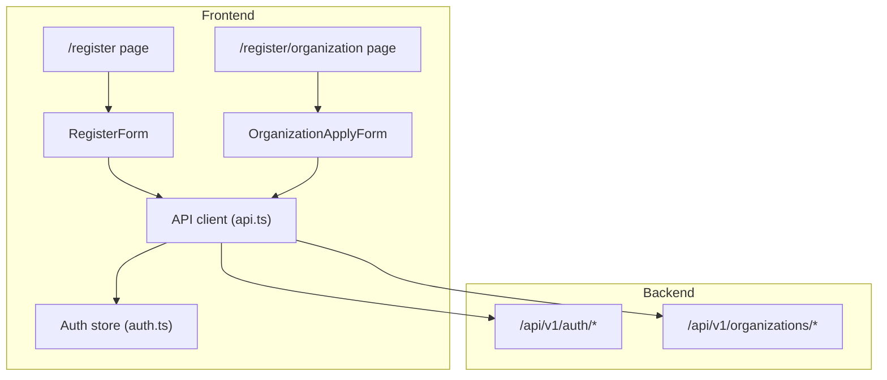
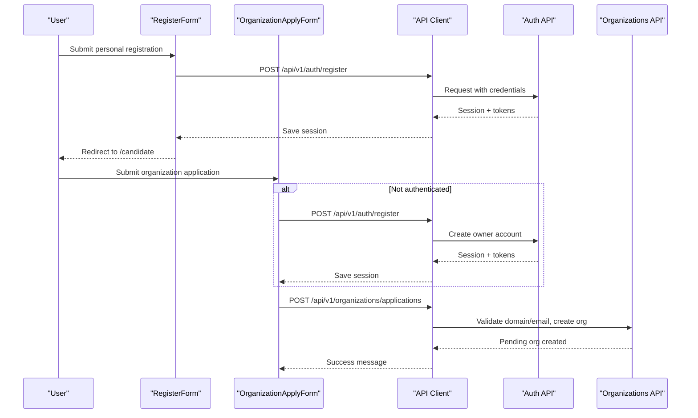
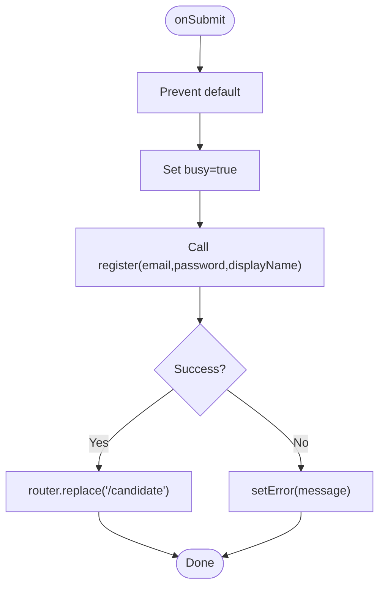
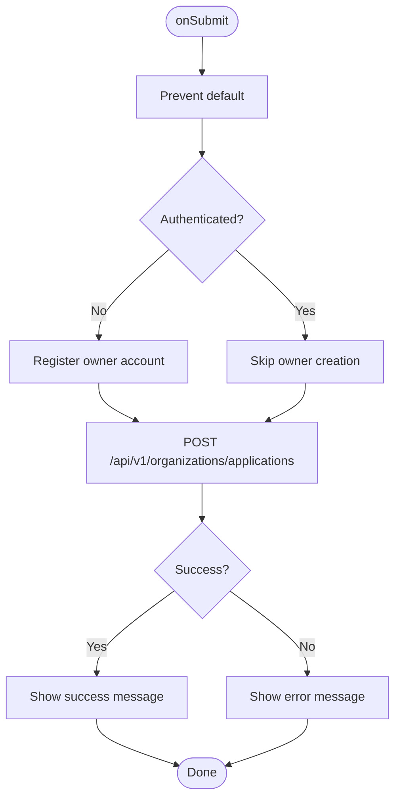
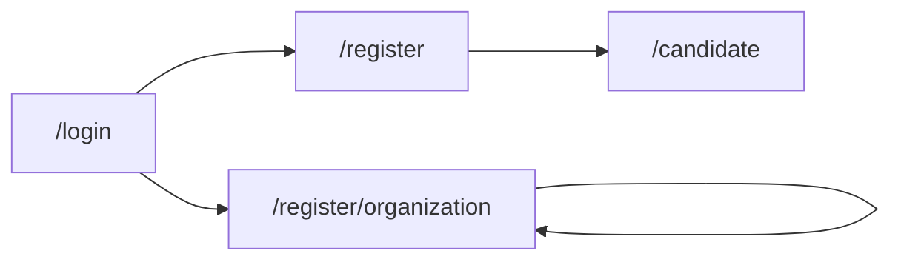
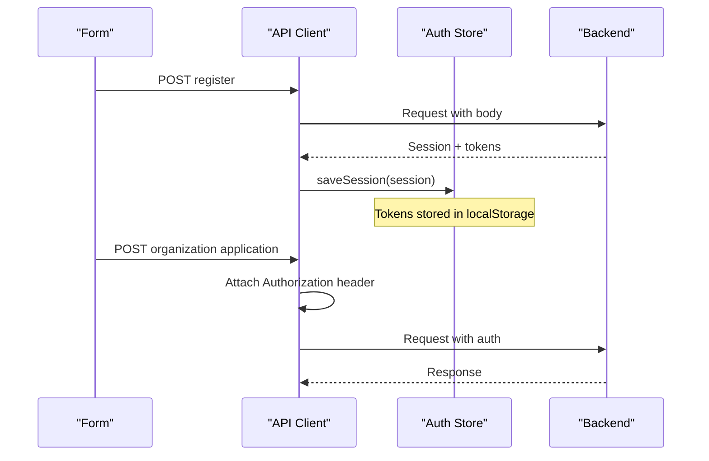
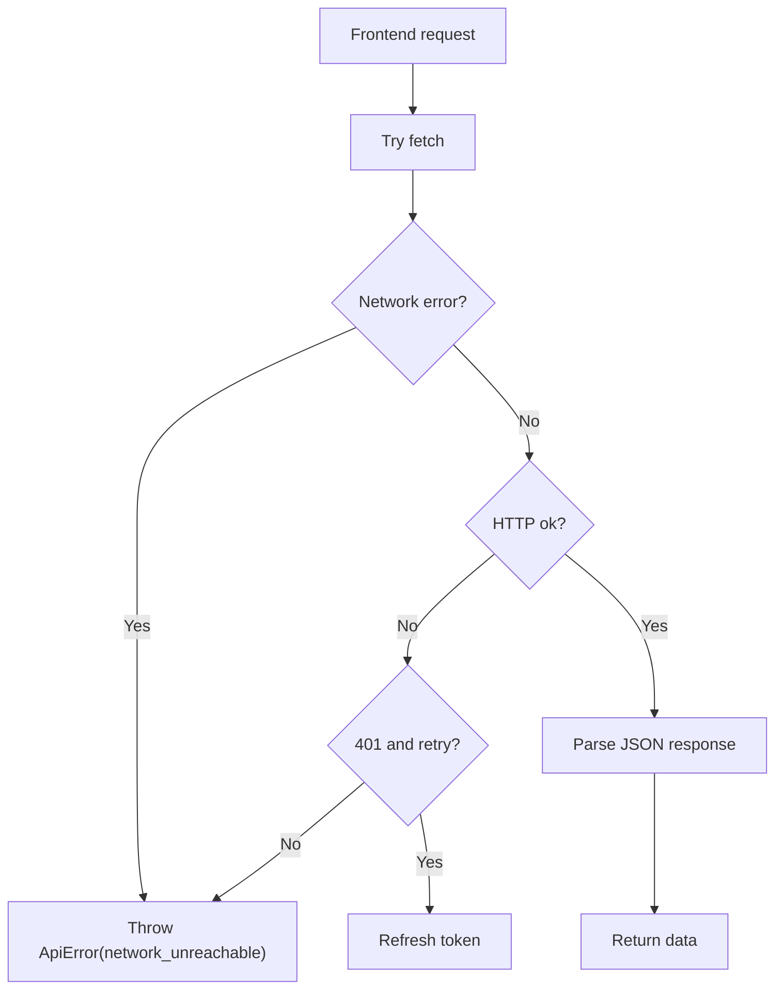
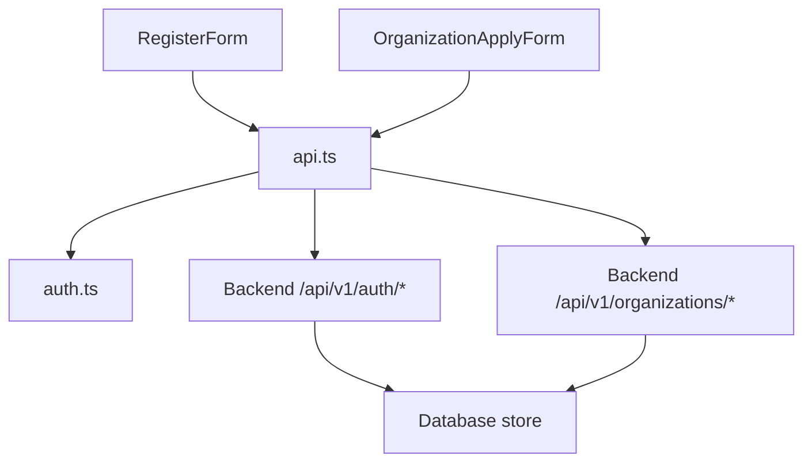

# Registration & Organization Setup

<cite>
**Referenced Files in This Document**
- [register-form.tsx](file://Frontend/components/auth/register-form.tsx)
- [organization-apply-form.tsx](file://Frontend/components/auth/organization-apply-form.tsx)
- [page.tsx (Register)](file://Frontend/app/register/page.tsx)
- [page.tsx (Organization Register)](file://Frontend/app/register/organization/page.tsx)
- [api.ts](file://Frontend/lib/api.ts)
- [auth.ts](file://Frontend/lib/auth.ts)
- [auth.py](file://Backend/app/api/v1/auth.py)
- [organizations.py](file://Backend/app/api/v1/organizations.py)
</cite>

## Table of Contents
1. [Introduction](#introduction)
2. [Project Structure](#project-structure)
3. [Core Components](#core-components)
4. [Architecture Overview](#architecture-overview)
5. [Detailed Component Analysis](#detailed-component-analysis)
6. [Dependency Analysis](#dependency-analysis)
7. [Performance Considerations](#performance-considerations)
8. [Troubleshooting Guide](#troubleshooting-guide)
9. [Conclusion](#conclusion)
10. [Appendices](#appendices)

## Introduction
This document explains the end-to-end user registration and organization setup flows, including:
- Individual candidate registration via the RegisterForm component
- Employer onboarding via the OrganizationApplyForm component
- Routing between registration steps
- State persistence during multi-step interactions
- Error handling across frontend and backend
- Guidance for extending forms with additional fields and validation rules

The system supports two primary paths:
- Candidate signup: creates a personal account and redirects to the candidate area
- Organization application: collects employer details, optionally creates an owner account, and submits a pending organization application for admin verification

## Project Structure
Registration-related UI is implemented as Next.js pages that render React form components. The frontend calls backend APIs through a centralized API client that handles authentication, token refresh, and error mapping. Backend endpoints enforce validation, persist data, and manage the organization application lifecycle.

**Diagram sources**
- [page.tsx (Register):1-9](file://Frontend/app/register/page.tsx#L1-L9)
- [page.tsx (Organization Register):1-9](file://Frontend/app/register/organization/page.tsx#L1-L9)
- [register-form.tsx:1-79](file://Frontend/components/auth/register-form.tsx#L1-L79)
- [organization-apply-form.tsx:1-192](file://Frontend/components/auth/organization-apply-form.tsx#L1-L192)
- [api.ts:59-104](file://Frontend/lib/api.ts#L59-L104)
- [auth.ts:26-65](file://Frontend/lib/auth.ts#L26-L65)
- [auth.py:74-101](file://Backend/app/api/v1/auth.py#L74-L101)
- [organizations.py:130-218](file://Backend/app/api/v1/organizations.py#L130-L218)

**Section sources**
- [page.tsx (Register):1-9](file://Frontend/app/register/page.tsx#L1-L9)
- [page.tsx (Organization Register):1-9](file://Frontend/app/register/organization/page.tsx#L1-L9)
- [register-form.tsx:1-79](file://Frontend/components/auth/register-form.tsx#L1-L79)
- [organization-apply-form.tsx:1-192](file://Frontend/components/auth/organization-apply-form.tsx#L1-L192)
- [api.ts:1-199](file://Frontend/lib/api.ts#L1-L199)
- [auth.ts:1-70](file://Frontend/lib/auth.ts#L1-L70)
- [auth.py:1-185](file://Backend/app/api/v1/auth.py#L1-L185)
- [organizations.py:1-623](file://Backend/app/api/v1/organizations.py#L1-L623)

## Core Components
- RegisterForm: Collects display name, email, and password; validates inputs using HTML attributes; submits to the backend register endpoint; saves session and navigates to the candidate area.
- OrganizationApplyForm: Optionally creates an owner account if not authenticated; collects organization details; posts an organization application; shows success or error messages; supports idempotent submissions.

Key responsibilities:
- Client-side validation via required fields and input types
- Submission state management (busy/error/success)
- Session persistence after successful registration
- Idempotency for organization applications

**Section sources**
- [register-form.tsx:8-79](file://Frontend/components/auth/register-form.tsx#L8-L79)
- [organization-apply-form.tsx:8-192](file://Frontend/components/auth/organization-apply-form.tsx#L8-L192)
- [api.ts:163-176](file://Frontend/lib/api.ts#L163-L176)
- [auth.ts:51-65](file://Frontend/lib/auth.ts#L51-L65)

## Architecture Overview
The registration flow involves coordinated frontend and backend steps:

- Candidate registration:
  - User fills out the form and submits
  - Frontend calls /api/v1/auth/register
  - Backend validates payload, creates user, issues tokens, returns session
  - Frontend persists session and redirects to /candidate

- Organization application:
  - If not authenticated, the form first registers an owner account
  - Then it posts organization details to /api/v1/organizations/applications
  - Backend validates domain and contact email, creates a pending organization, and returns confirmation
  - Frontend displays success message indicating admin verification is required

**Diagram sources**
- [register-form.tsx:16-28](file://Frontend/components/auth/register-form.tsx#L16-L28)
- [organization-apply-form.tsx:30-60](file://Frontend/components/auth/organization-apply-form.tsx#L30-L60)
- [api.ts:163-176](file://Frontend/lib/api.ts#L163-L176)
- [auth.py:74-101](file://Backend/app/api/v1/auth.py#L74-L101)
- [organizations.py:130-218](file://Backend/app/api/v1/organizations.py#L130-L218)

## Detailed Component Analysis

### RegisterForm
- Inputs: display name, email, password
- Validation: HTML required and type constraints; minimum password length enforced by backend
- Submission: Calls register from api.ts which posts to /api/v1/auth/register
- State: busy flag disables submit button; error displayed on failure
- Navigation: On success, replaces route to /candidate

**Diagram sources**
- [register-form.tsx:16-28](file://Frontend/components/auth/register-form.tsx#L16-L28)
- [api.ts:163-176](file://Frontend/lib/api.ts#L163-L176)
- [auth.py:74-101](file://Backend/app/api/v1/auth.py#L74-L101)

**Section sources**
- [register-form.tsx:8-79](file://Frontend/components/auth/register-form.tsx#L8-L79)
- [api.ts:163-176](file://Frontend/lib/api.ts#L163-L176)
- [auth.py:74-101](file://Backend/app/api/v1/auth.py#L74-L101)

### OrganizationApplyForm
- Optional owner account creation: If not authenticated, registers owner account before submitting application
- Organization details: name, legal name, trading name, domain, contact email, phone, address, registration number
- Backend validation: Domain must be valid and unique; contact email domain must match company domain
- Idempotency: Uses idempotency key to prevent duplicate submissions
- Feedback: Shows success message indicating admin verification is required; errors surfaced to user

**Diagram sources**
- [organization-apply-form.tsx:30-60](file://Frontend/components/auth/organization-apply-form.tsx#L30-L60)
- [api.ts:194-198](file://Frontend/lib/api.ts#L194-L198)
- [organizations.py:130-218](file://Backend/app/api/v1/organizations.py#L130-L218)

**Section sources**
- [organization-apply-form.tsx:8-192](file://Frontend/components/auth/organization-apply-form.tsx#L8-L192)
- [api.ts:194-198](file://Frontend/lib/api.ts#L194-L198)
- [organizations.py:130-218](file://Backend/app/api/v1/organizations.py#L130-L218)

### Routing Between Registration Steps
- Candidate registration page renders RegisterForm and redirects to /candidate on success
- Organization registration page renders OrganizationApplyForm and remains on the same page to show success/error states
- Login page provides links to both registration flows

**Diagram sources**
- [page.tsx (Register):1-9](file://Frontend/app/register/page.tsx#L1-L9)
- [page.tsx (Organization Register):1-9](file://Frontend/app/register/organization/page.tsx#L1-L9)
- [login-form.tsx:62-66](file://Frontend/components/auth/login-form.tsx#L62-L66)

**Section sources**
- [page.tsx (Register):1-9](file://Frontend/app/register/page.tsx#L1-L9)
- [page.tsx (Organization Register):1-9](file://Frontend/app/register/organization/page.tsx#L1-L9)
- [login-form.tsx:62-66](file://Frontend/components/auth/login-form.tsx#L62-L66)

### State Persistence During Multi-Step Forms
- Authentication session is persisted in localStorage via saveSession after successful registration
- API client automatically includes Authorization header and refreshes tokens when needed
- OrganizationApplyForm checks authentication status and conditionally creates owner account

**Diagram sources**
- [api.ts:59-104](file://Frontend/lib/api.ts#L59-L104)
- [api.ts:163-176](file://Frontend/lib/api.ts#L163-L176)
- [auth.ts:51-65](file://Frontend/lib/auth.ts#L51-L65)

**Section sources**
- [api.ts:59-104](file://Frontend/lib/api.ts#L59-L104)
- [api.ts:163-176](file://Frontend/lib/api.ts#L163-L176)
- [auth.ts:51-65](file://Frontend/lib/auth.ts#L51-L65)

### Error Handling Throughout Registration
- Frontend:
  - ApiError wraps backend errors with status, code, and message
  - Network errors handled gracefully with user-friendly messages
  - Token refresh handled automatically for 401 responses
- Backend:
  - Validation errors return appropriate HTTP status codes and error codes
  - Duplicate email returns conflict status
  - Invalid domain or mismatched contact email returns validation errors

**Diagram sources**
- [api.ts:59-104](file://Frontend/lib/api.ts#L59-L104)
- [auth.py:74-101](file://Backend/app/api/v1/auth.py#L74-L101)
- [organizations.py:130-218](file://Backend/app/api/v1/organizations.py#L130-L218)

**Section sources**
- [api.ts:59-104](file://Frontend/lib/api.ts#L59-L104)
- [api.ts:12-21](file://Frontend/lib/api.ts#L12-L21)
- [auth.py:74-101](file://Backend/app/api/v1/auth.py#L74-L101)
- [organizations.py:130-218](file://Backend/app/api/v1/organizations.py#L130-L218)

## Dependency Analysis
The registration flow depends on several interconnected components:

**Diagram sources**
- [register-form.tsx:1-79](file://Frontend/components/auth/register-form.tsx#L1-L79)
- [organization-apply-form.tsx:1-192](file://Frontend/components/auth/organization-apply-form.tsx#L1-L192)
- [api.ts:1-199](file://Frontend/lib/api.ts#L1-L199)
- [auth.ts:1-70](file://Frontend/lib/auth.ts#L1-L70)
- [auth.py:1-185](file://Backend/app/api/v1/auth.py#L1-L185)
- [organizations.py:1-623](file://Backend/app/api/v1/organizations.py#L1-L623)

**Section sources**
- [register-form.tsx:1-79](file://Frontend/components/auth/register-form.tsx#L1-L79)
- [organization-apply-form.tsx:1-192](file://Frontend/components/auth/organization-apply-form.tsx#L1-L192)
- [api.ts:1-199](file://Frontend/lib/api.ts#L1-L199)
- [auth.ts:1-70](file://Frontend/lib/auth.ts#L1-L70)
- [auth.py:1-185](file://Backend/app/api/v1/auth.py#L1-L185)
- [organizations.py:1-623](file://Backend/app/api/v1/organizations.py#L1-L623)

## Performance Considerations
- Idempotency keys prevent duplicate organization applications
- Token refresh is handled centrally to avoid redundant network requests
- Form submission uses busy states to prevent multiple simultaneous submissions
- Client-side validation reduces unnecessary backend calls

[No sources needed since this section provides general guidance]

## Troubleshooting Guide
Common issues and their resolutions:

- Email already registered:
  - Occurs when attempting to register with an existing email
  - Resolution: Use sign-in instead of registration

- Invalid domain or contact email mismatch:
  - Organization domain must be valid and contact email must match the domain
  - Resolution: Ensure domain format is correct and contact email uses the same domain

- Network unreachable:
  - Backend server not running or inaccessible
  - Resolution: Start the backend server and verify connectivity

- Account disabled:
  - User account has been deactivated
  - Resolution: Contact administrator to reactivate account

**Section sources**
- [auth.py:74-101](file://Backend/app/api/v1/auth.py#L74-L101)
- [organizations.py:130-218](file://Backend/app/api/v1/organizations.py#L130-L218)
- [api.ts:59-104](file://Frontend/lib/api.ts#L59-L104)

## Conclusion
The registration and organization setup flows provide a robust foundation for user onboarding. The system separates candidate registration from organization application, ensuring appropriate validation and approval workflows. The frontend components handle user interaction and state management effectively, while the backend enforces business rules and data integrity. The idempotency mechanism and comprehensive error handling contribute to a reliable user experience.

[No sources needed since this section summarizes without analyzing specific files]

## Appendices

### Extending Registration Forms
To add new fields to registration forms:

1. **Add form fields**:
   - Update RegisterForm or OrganizationApplyForm with new input elements
   - Add corresponding state variables using useState hooks

2. **Update validation**:
   - Add HTML5 validation attributes (required, type, minLength, etc.)
   - Implement custom validation logic in onSubmit handlers

3. **Update API payloads**:
   - Modify api.ts functions to include new fields in request bodies
   - Update backend models in auth.py or organizations.py to accept new fields

4. **Handle backend validation**:
   - Add Pydantic field validations in backend request models
   - Implement custom validation logic in endpoint handlers

5. **Update error handling**:
   - Extend ApiError handling for new validation scenarios
   - Provide user-friendly error messages for validation failures

**Section sources**
- [register-form.tsx:30-79](file://Frontend/components/auth/register-form.tsx#L30-L79)
- [organization-apply-form.tsx:64-192](file://Frontend/components/auth/organization-apply-form.tsx#L64-L192)
- [auth.py:19-23](file://Backend/app/api/v1/auth.py#L19-L23)
- [organizations.py:36-47](file://Backend/app/api/v1/organizations.py#L36-L47)
- [api.ts:163-176](file://Frontend/lib/api.ts#L163-L176)