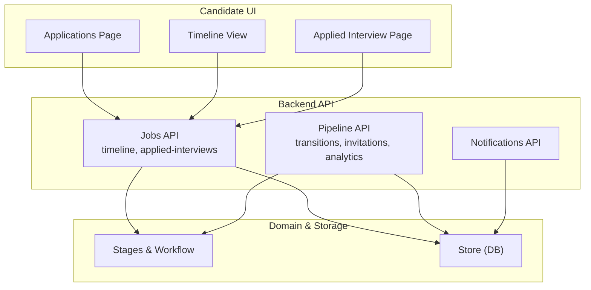
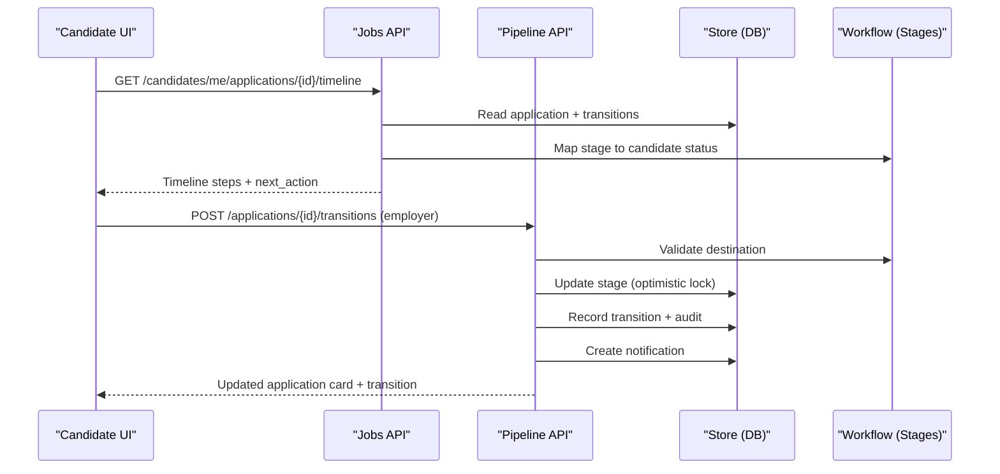
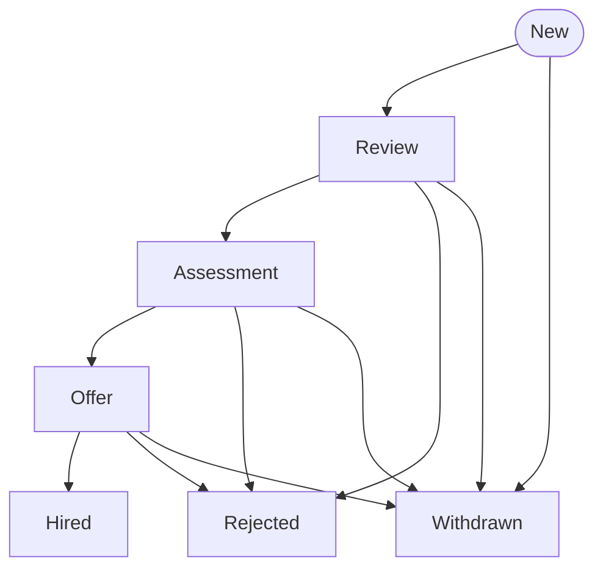
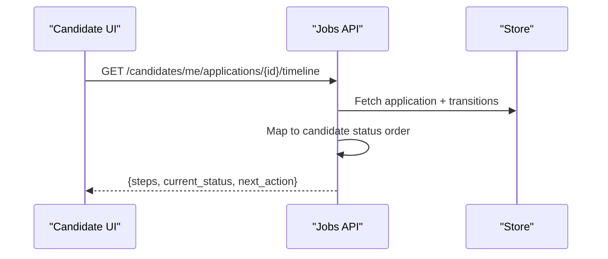
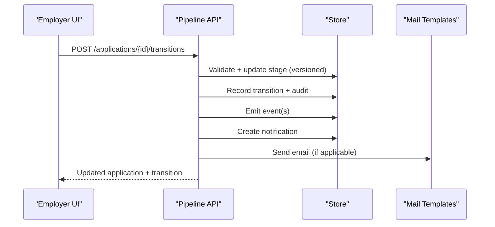
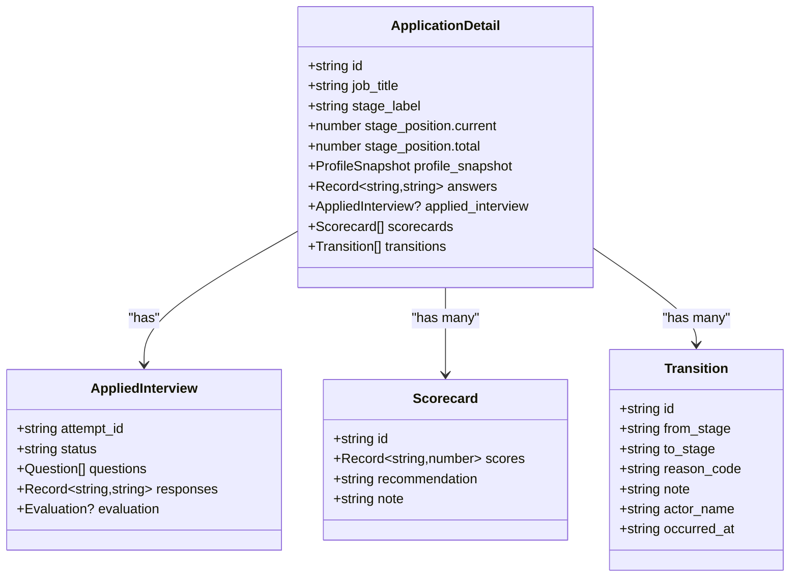
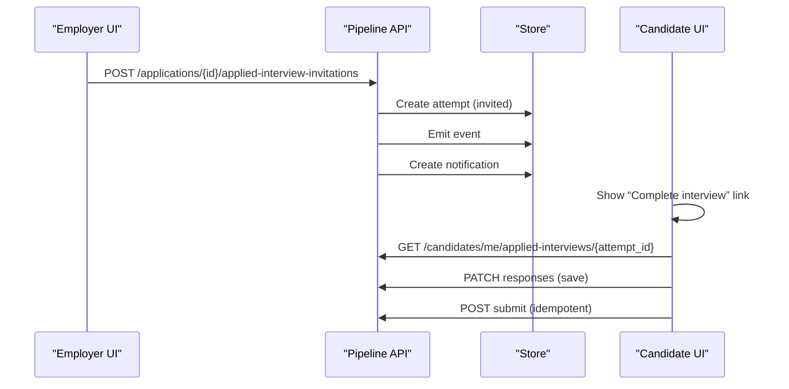
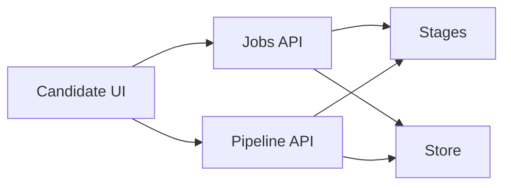

# Application Tracking

<cite>
**Referenced Files in This Document**
- [pipeline.py](file://Backend/app/api/v1/pipeline.py)
- [jobs.py](file://Backend/app/api/v1/jobs.py)
- [stages.py](file://Backend/app/domain/stages.py)
- [candidates.py](file://Backend/app/api/v1/candidates.py)
- [notifications.py](file://Backend/app/api/v1/notifications.py)
- [errors.py](file://Backend/app/core/errors.py)
- [store.py](file://Backend/app/db/store.py)
- [candidate-applications-page.tsx](file://Frontend/components/candidate/candidate-applications-page.tsx)
- [applications page](file://Frontend/app/candidate/applications/page.tsx)
- [applied interview page](file://Frontend/app/candidate/applied/[attemptId]/page.tsx)
- [types.ts](file://Frontend/lib/types.ts)
</cite>

## Table of Contents
1. [Introduction](#introduction)
2. [Project Structure](#project-structure)
3. [Core Components](#core-components)
4. [Architecture Overview](#architecture-overview)
5. [Detailed Component Analysis](#detailed-component-analysis)
6. [Dependency Analysis](#dependency-analysis)
7. [Performance Considerations](#performance-considerations)
8. [Troubleshooting Guide](#troubleshooting-guide)
9. [Conclusion](#conclusion)

## Introduction
This document explains how candidates view their application status, track progress through hiring stages, and access application details. It covers the application lifecycle states, status updates, notifications, application history, interview scheduling integration, feedback viewing, error handling for failed applications, retry mechanisms, and guidance for incomplete applications.

## Project Structure
The application tracking system spans backend APIs and a candidate-facing frontend:
- Backend API endpoints manage applications, transitions, timelines, interviews, and notifications.
- Domain logic defines canonical stages and workflow rules.
- Frontend pages render the candidate’s applications list, timeline, and interview flows.

**Diagram sources**
- [pipeline.py:155-201](file://Backend/app/api/v1/pipeline.py#L155-L201)
- [jobs.py:240-307](file://Backend/app/api/v1/jobs.py#L240-L307)
- [stages.py:196-242](file://Backend/app/domain/stages.py#L196-L242)
- [notifications.py:11-26](file://Backend/app/api/v1/notifications.py#L11-L26)

**Section sources**
- [pipeline.py:155-201](file://Backend/app/api/v1/pipeline.py#L155-L201)
- [jobs.py:240-307](file://Backend/app/api/v1/jobs.py#L240-L307)
- [stages.py:196-242](file://Backend/app/domain/stages.py#L196-L242)
- [notifications.py:11-26](file://Backend/app/api/v1/notifications.py#L11-L26)

## Core Components
- Candidate Applications List: Displays each application with current status, applied-at/updated-at timestamps, optional AI match score, and quick actions to complete an Applied Interview if invited or in progress.
- Timeline: Shows a candidate-safe progression from “Application received” → “Under review” → “Interview” → “Decision,” with completed/current/upcoming states and next-action guidance.
- Transitions: Employers move applications between stages via a validated transition endpoint that enforces workflow rules, optimistic concurrency, audit logging, and notifications.
- Applied Interviews: Candidates can start, save responses, and submit interviews; employers can invite candidates to take an Applied Interview per posting.
- Notifications: System creates in-app notifications when application status changes or when interview invitations are sent.

**Section sources**
- [candidate-applications-page.tsx:42-119](file://Frontend/components/candidate/candidate-applications-page.tsx#L42-L119)
- [jobs.py:240-307](file://Backend/app/api/v1/jobs.py#L240-L307)
- [pipeline.py:277-514](file://Backend/app/api/v1/pipeline.py#L277-L514)
- [pipeline.py:521-614](file://Backend/app/api/v1/pipeline.py#L521-L614)
- [notifications.py:11-26](file://Backend/app/api/v1/notifications.py#L11-L26)

## Architecture Overview
The tracking flow is driven by a canonical workflow defined in domain logic. The frontend requests data from the Jobs API for timeline and interview state, while Pipeline API handles employer-driven stage transitions and invitations. Notifications are created on key events.

**Diagram sources**
- [jobs.py:240-307](file://Backend/app/api/v1/jobs.py#L240-L307)
- [pipeline.py:277-514](file://Backend/app/api/v1/pipeline.py#L277-L514)
- [stages.py:196-242](file://Backend/app/domain/stages.py#L196-L242)

## Detailed Component Analysis

### Application Lifecycle States
- Canonical categories include new, review, assessment, offer, hired, rejected, withdrawn, closed.
- Candidates see a simplified four-step status order: “Application received,” “Under review,” “Interview,” “Decision.”
- Valid transitions are enforced by the workflow engine, allowing forward/backward movement along non-terminal stages and specific terminal moves (rejection/withdrawal from any non-terminal; hiring from Offer or last pipeline stage).

**Diagram sources**
- [stages.py:10-44](file://Backend/app/domain/stages.py#L10-L44)
- [stages.py:212-242](file://Backend/app/domain/stages.py#L212-L242)

**Section sources**
- [stages.py:10-44](file://Backend/app/domain/stages.py#L10-L44)
- [stages.py:212-242](file://Backend/app/domain/stages.py#L212-L242)

### Candidate Application History and Timeline
- The timeline endpoint computes steps based on transitions and maps internal stages to candidate-friendly statuses.
- Each step shows whether it is completed, current, or upcoming, with timestamps when available.
- Next action guidance is provided based on interview invitation status and decision stage.

**Diagram sources**
- [jobs.py:240-307](file://Backend/app/api/v1/jobs.py#L240-L307)

**Section sources**
- [jobs.py:240-307](file://Backend/app/api/v1/jobs.py#L240-L307)

### Status Updates and Real-Time Notifications
- When an employer transitions an application, the system:
  - Validates the destination against the workflow.
  - Applies optimistic concurrency using stage_version.
  - Records the transition and writes an audit log.
  - Emits events for downstream consumers.
  - Creates an in-app notification for the candidate with a mapped status.
  - Sends templated emails for acceptance/rejection or generic stage updates.

**Diagram sources**
- [pipeline.py:277-514](file://Backend/app/api/v1/pipeline.py#L277-L514)
- [notifications.py:11-26](file://Backend/app/api/v1/notifications.py#L11-L26)

**Section sources**
- [pipeline.py:277-514](file://Backend/app/api/v1/pipeline.py#L277-L514)
- [notifications.py:11-26](file://Backend/app/api/v1/notifications.py#L11-L26)

### Application Details and Feedback Viewing
- Employers can retrieve full application details including profile snapshot, answers, applied interview data, scorecards, and transition history.
- Scorecards capture reviewer scores, recommendations, and notes.
- Transition history includes actor names, reasons, notes, and timestamps.

**Diagram sources**
- [pipeline.py:204-266](file://Backend/app/api/v1/pipeline.py#L204-L266)
- [types.ts:107-144](file://Frontend/lib/types.ts#L107-L144)

**Section sources**
- [pipeline.py:204-266](file://Backend/app/api/v1/pipeline.py#L204-L266)
- [types.ts:107-144](file://Frontend/lib/types.ts#L107-L144)

### Interview Scheduling Integration
- Employers can invite candidates to an Applied Interview for a locked question pool.
- Candidates receive an in-app notification and can navigate to the interview page to complete it.
- The candidate UI shows a “Complete interview” button when the interview is invited or in progress.

**Diagram sources**
- [pipeline.py:521-614](file://Backend/app/api/v1/pipeline.py#L521-L614)
- [jobs.py:319-439](file://Backend/app/api/v1/jobs.py#L319-L439)
- [candidate-applications-page.tsx:86-111](file://Frontend/components/candidate/candidate-applications-page.tsx#L86-L111)

**Section sources**
- [pipeline.py:521-614](file://Backend/app/api/v1/pipeline.py#L521-L614)
- [jobs.py:319-439](file://Backend/app/api/v1/jobs.py#L319-L439)
- [candidate-applications-page.tsx:86-111](file://Frontend/components/candidate/candidate-applications-page.tsx#L86-L111)

### Error Handling for Failed Applications and Retry Mechanisms
- Validation errors return structured error responses with codes and messages.
- Conflicts (e.g., concurrent edits) return explicit conflict codes instructing users to refresh and retry.
- Idempotency keys prevent duplicate submissions for transitions and interview submissions.
- Missing resources return not found errors.

Common scenarios:
- Invalid transition destination: returns invalid_transition with guidance.
- Stage version mismatch: returns application_stage_conflict with instruction to refresh.
- Duplicate submission: returns already_applied or attempt_already_submitted.
- Unknown consent purpose or unknown question: returns validation errors with details.

**Section sources**
- [errors.py:20-112](file://Backend/app/core/errors.py#L20-L112)
- [pipeline.py:306-348](file://Backend/app/api/v1/pipeline.py#L306-L348)
- [pipeline.py:535-555](file://Backend/app/api/v1/pipeline.py#L535-L555)
- [candidates.py:248-265](file://Backend/app/api/v1/candidates.py#L248-L265)
- [jobs.py:356-378](file://Backend/app/api/v1/jobs.py#L356-L378)

### Guidance for Incomplete Applications
- If an Applied Interview is invited or in progress, the timeline suggests completing the interview.
- If the application is in a decision stage but not yet finalized, the timeline indicates no immediate action is needed.
- The candidate applications page surfaces quick actions to resume or complete interviews when applicable.

**Section sources**
- [jobs.py:286-307](file://Backend/app/api/v1/jobs.py#L286-L307)
- [candidate-applications-page.tsx:86-111](file://Frontend/components/candidate/candidate-applications-page.tsx#L86-L111)

## Dependency Analysis
- Jobs API depends on Store for reading applications and transitions, and on Stages for mapping to candidate status.
- Pipeline API depends on Store for writing transitions, audits, and notifications, and on Stages for validating destinations.
- Frontend components depend on API types defined in types.ts to render timelines, applications, and interviews.

**Diagram sources**
- [jobs.py:240-307](file://Backend/app/api/v1/jobs.py#L240-L307)
- [pipeline.py:277-514](file://Backend/app/api/v1/pipeline.py#L277-L514)
- [types.ts:160-179](file://Frontend/lib/types.ts#L160-L179)

**Section sources**
- [jobs.py:240-307](file://Backend/app/api/v1/jobs.py#L240-L307)
- [pipeline.py:277-514](file://Backend/app/api/v1/pipeline.py#L277-L514)
- [types.ts:160-179](file://Frontend/lib/types.ts#L160-L179)

## Performance Considerations
- Use idempotency keys for transitions and interview submissions to avoid duplicate work and ensure safe retries.
- Leverage optimistic concurrency (stage_version) to minimize locking overhead and detect conflicts early.
- Background tasks (e.g., sending emails, computing matches) should be offloaded to reduce request latency.
- Minimize payload size by returning only necessary fields for candidate views.

[No sources needed since this section provides general guidance]

## Troubleshooting Guide
- Not Found: Ensure the application exists and belongs to the authenticated candidate or employer tenant.
- Conflict: Refresh the application card before attempting another transition; check stage_version.
- Validation Errors: Verify required fields such as reason codes for human approval categories and valid question IDs for interview responses.
- Already Submitted: Use idempotency keys to safely retry submissions; duplicate attempts will be rejected.
- Notifications: Confirm that notifications were created for status changes and interview invitations; mark them read via the notifications endpoint.

**Section sources**
- [errors.py:60-112](file://Backend/app/core/errors.py#L60-L112)
- [pipeline.py:306-348](file://Backend/app/api/v1/pipeline.py#L306-L348)
- [notifications.py:11-26](file://Backend/app/api/v1/notifications.py#L11-L26)

## Conclusion
Candidates can reliably track their application progress through a clear, mapped timeline, receive actionable next steps, and engage with interview workflows. Employers control the process via validated transitions with robust error handling and auditability. Notifications keep candidates informed, and idempotency ensures safe retries for critical operations.

[No sources needed since this section summarizes without analyzing specific files]