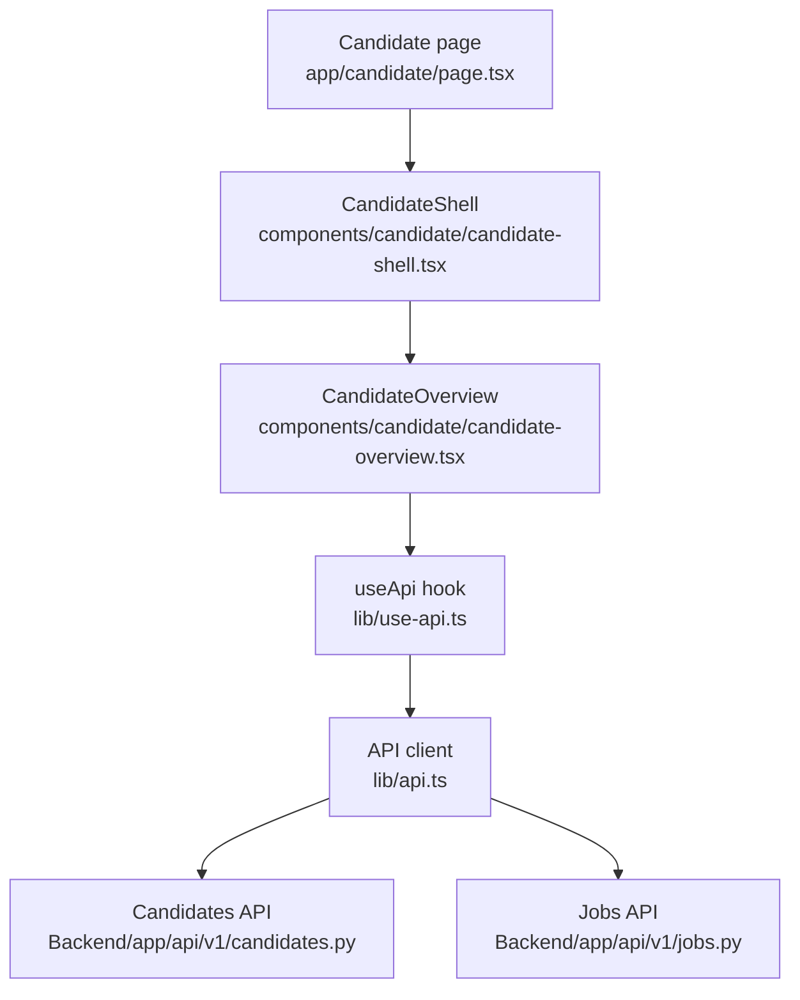
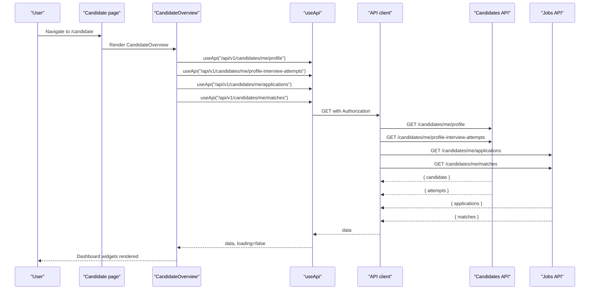
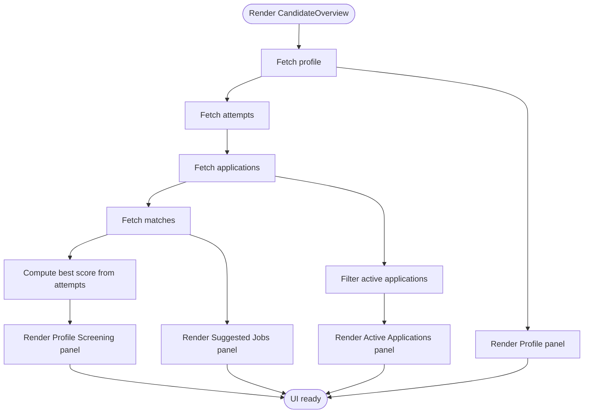
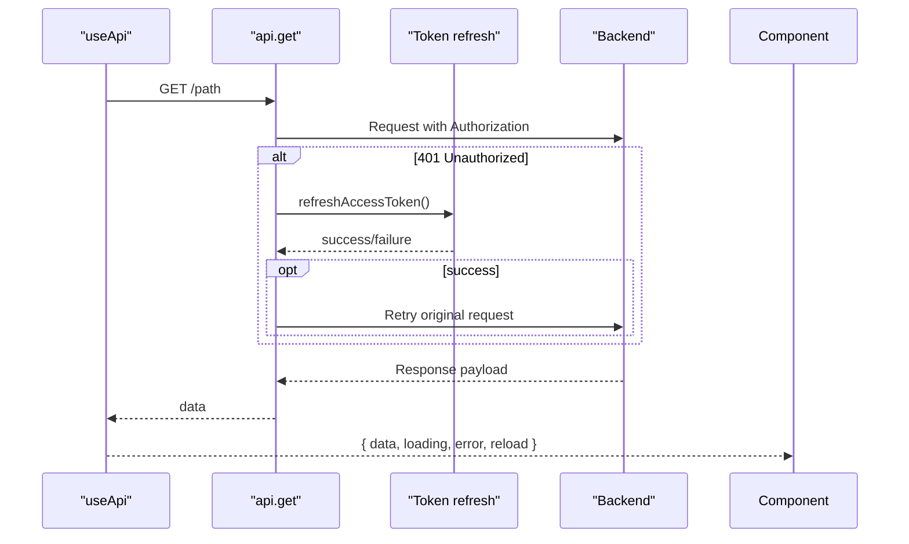
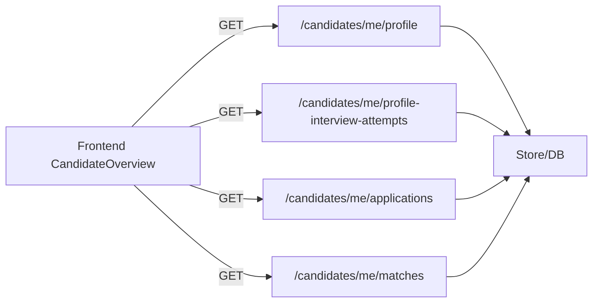
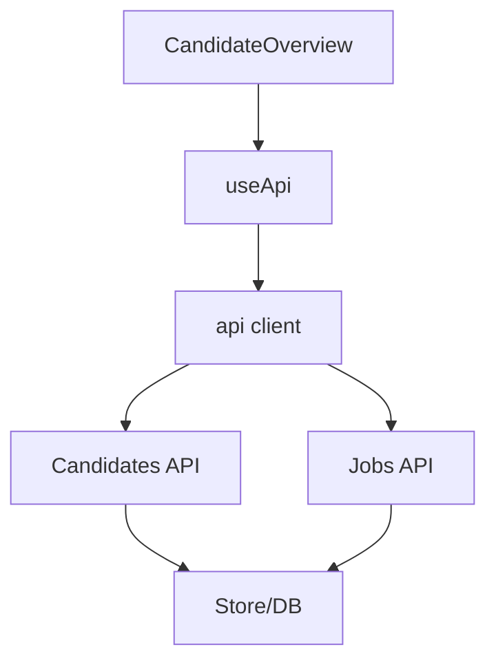

# Candidate Dashboard

<cite>
**Referenced Files in This Document**
- [candidate-overview.tsx](file://Frontend/components/candidate/candidate-overview.tsx)
- [page.tsx](file://Frontend/app/candidate/page.tsx)
- [use-api.ts](file://Frontend/lib/use-api.ts)
- [api.ts](file://Frontend/lib/api.ts)
- [types.ts](file://Frontend/lib/types.ts)
- [state.tsx](file://Frontend/components/ui/state.tsx)
- [candidates.py](file://Backend/app/api/v1/candidates.py)
- [jobs.py](file://Backend/app/api/v1/jobs.py)
</cite>

## Table of Contents
1. [Introduction](#introduction)
2. [Project Structure](#project-structure)
3. [Core Components](#core-components)
4. [Architecture Overview](#architecture-overview)
5. [Detailed Component Analysis](#detailed-component-analysis)
6. [Dependency Analysis](#dependency-analysis)
7. [Performance Considerations](#performance-considerations)
8. [Troubleshooting Guide](#troubleshooting-guide)
9. [Conclusion](#conclusion)

## Introduction
This document explains the Candidate Dashboard, centered on the CandidateOverview component. It shows how the dashboard aggregates candidate statistics, recent activities, and key metrics from applications, interviews, and profile information. It also covers data fetching patterns, state management, real-time update strategies, widget examples, performance optimizations, and error handling.

## Project Structure
The candidate dashboard is a Next.js client feature composed of:
- A page that renders the CandidateShell and CandidateOverview
- The CandidateOverview component that fetches and displays profile, attempts, applications, and job matches
- A shared useApi hook for declarative data fetching with loading/error states
- An API client with authentication and token refresh
- Backend endpoints for candidates and jobs that supply the dashboard data

**Diagram sources**
- [page.tsx:1-14](file://Frontend/app/candidate/page.tsx#L1-L14)
- [candidate-overview.tsx:1-179](file://Frontend/components/candidate/candidate-overview.tsx#L1-L179)
- [use-api.ts:1-34](file://Frontend/lib/use-api.ts#L1-L34)
- [api.ts:1-199](file://Frontend/lib/api.ts#L1-L199)
- [candidates.py:147-287](file://Backend/app/api/v1/candidates.py#L147-L287)
- [jobs.py:182-237](file://Backend/app/api/v1/jobs.py#L182-L237)

**Section sources**
- [page.tsx:1-14](file://Frontend/app/candidate/page.tsx#L1-L14)
- [candidate-overview.tsx:1-179](file://Frontend/components/candidate/candidate-overview.tsx#L1-L179)
- [use-api.ts:1-34](file://Frontend/lib/use-api.ts#L1-L34)
- [api.ts:1-199](file://Frontend/lib/api.ts#L1-L199)
- [candidates.py:147-287](file://Backend/app/api/v1/candidates.py#L147-L287)
- [jobs.py:182-237](file://Backend/app/api/v1/jobs.py#L182-L237)

## Core Components
- CandidateOverview: Renders four main widgets:
  - Profile Screening (attempt list and best score)
  - Profile (headline, skills, discovery consent)
  - Suggested jobs (matches with scores and reasons)
  - Active applications (status and interview prompts)
- Data fetching: Uses useApi to call endpoints for profile, attempts, applications, and matches. Each call returns data, loading, error, and reload.
- State management: Local React state per hook instance; no global store used for dashboard data.
- Real-time updates: Polling or WebSocket not implemented in this component; manual refresh via reload is supported.

**Section sources**
- [candidate-overview.tsx:10-179](file://Frontend/components/candidate/candidate-overview.tsx#L10-L179)
- [use-api.ts:6-33](file://Frontend/lib/use-api.ts#L6-L33)

## Architecture Overview
The dashboard follows a client-driven architecture:
- The page mounts CandidateShell and CandidateOverview
- CandidateOverview triggers multiple parallel GET requests via useApi
- The API client attaches Authorization headers and handles 401 by refreshing tokens
- Backend endpoints return structured JSON consumed by the frontend types

**Diagram sources**
- [candidate-overview.tsx:11-20](file://Frontend/components/candidate/candidate-overview.tsx#L11-L20)
- [use-api.ts:11-32](file://Frontend/lib/use-api.ts#L11-L32)
- [api.ts:59-104](file://Frontend/lib/api.ts#L59-L104)
- [candidates.py:147-149](file://Backend/app/api/v1/candidates.py#L147-L149)
- [candidates.py:268-287](file://Backend/app/api/v1/candidates.py#L268-L287)
- [jobs.py:182-189](file://Backend/app/api/v1/jobs.py#L182-L189)
- [jobs.py:192-237](file://Backend/app/api/v1/jobs.py#L192-L237)

## Detailed Component Analysis

### CandidateOverview Widget Breakdown
- Profile Screening widget:
  - Displays attempt list and best overall score
  - Provides action to start or resume screening
  - Aggregates best score from attempts
- Profile widget:
  - Shows headline, skills, and discovery consent status
- Suggested jobs widget:
  - Lists matching jobs with score and reason snippets
  - Links to browse all jobs
- Active applications widget:
  - Filters out closed applications
  - Shows current status and links to complete interviews when applicable

**Diagram sources**
- [candidate-overview.tsx:11-20](file://Frontend/components/candidate/candidate-overview.tsx#L11-L20)
- [candidate-overview.tsx:22-33](file://Frontend/components/candidate/candidate-overview.tsx#L22-L33)
- [candidate-overview.tsx:51-173](file://Frontend/components/candidate/candidate-overview.tsx#L51-L173)

**Section sources**
- [candidate-overview.tsx:10-179](file://Frontend/components/candidate/candidate-overview.tsx#L10-L179)

### Data Fetching Patterns
- Declarative fetching with useApi:
  - Each endpoint is called with a path; hook manages loading, error, and reload
  - Errors are normalized into ApiError instances with code and message
- Authentication and token refresh:
  - API client attaches Bearer token
  - On 401, client attempts refresh once and retries the request
- Parallel requests:
  - CandidateOverview calls four endpoints concurrently for faster initial render

**Diagram sources**
- [use-api.ts:11-32](file://Frontend/lib/use-api.ts#L11-L32)
- [api.ts:25-57](file://Frontend/lib/api.ts#L25-L57)
- [api.ts:59-104](file://Frontend/lib/api.ts#L59-L104)

**Section sources**
- [use-api.ts:1-34](file://Frontend/lib/use-api.ts#L1-L34)
- [api.ts:1-199](file://Frontend/lib/api.ts#L1-L199)

### Backend Data Sources
- Profile:
  - GET /api/v1/candidates/me/profile returns candidate profile and metadata
- Attempts:
  - GET /api/v1/candidates/me/profile-interview-attempts returns attempt summaries including scores
- Applications:
  - GET /api/v1/candidates/me/applications returns application items with status and applied interview info
- Matches:
  - GET /api/v1/candidates/me/matches returns suggested jobs with scores and reasons

**Diagram sources**
- [candidates.py:147-149](file://Backend/app/api/v1/candidates.py#L147-L149)
- [candidates.py:268-287](file://Backend/app/api/v1/candidates.py#L268-L287)
- [jobs.py:182-189](file://Backend/app/api/v1/jobs.py#L182-L189)
- [jobs.py:192-237](file://Backend/app/api/v1/jobs.py#L192-L237)

**Section sources**
- [candidates.py:147-287](file://Backend/app/api/v1/candidates.py#L147-L287)
- [jobs.py:182-237](file://Backend/app/api/v1/jobs.py#L182-L237)

### Types and Contracts
- Frontend types define shapes for Posting, ApplicationDetail, CandidateApplication, AttemptSummary, CandidateProfile, etc., ensuring type safety across components and hooks.
- These types align with backend responses, enabling consistent UI rendering and logic.

**Section sources**
- [types.ts:1-267](file://Frontend/lib/types.ts#L1-L267)

## Dependency Analysis
- CandidateOverview depends on:
  - useApi for data fetching
  - api client for HTTP and auth
  - UI primitives (Pill, ScoreBadge, LoadingState, ErrorState)
- Backend endpoints depend on:
  - Store layer for data access
  - Evaluation services for attempt scoring
  - Organization/posting lookups for application context

**Diagram sources**
- [candidate-overview.tsx:1-179](file://Frontend/components/candidate/candidate-overview.tsx#L1-L179)
- [use-api.ts:1-34](file://Frontend/lib/use-api.ts#L1-L34)
- [api.ts:1-199](file://Frontend/lib/api.ts#L1-L199)
- [candidates.py:147-287](file://Backend/app/api/v1/candidates.py#L147-L287)
- [jobs.py:182-237](file://Backend/app/api/v1/jobs.py#L182-L237)

**Section sources**
- [candidate-overview.tsx:1-179](file://Frontend/components/candidate/candidate-overview.tsx#L1-L179)
- [use-api.ts:1-34](file://Frontend/lib/use-api.ts#L1-L34)
- [api.ts:1-199](file://Frontend/lib/api.ts#L1-L199)
- [candidates.py:147-287](file://Backend/app/api/v1/candidates.py#L147-L287)
- [jobs.py:182-237](file://Backend/app/api/v1/jobs.py#L182-L237)

## Performance Considerations
- Parallel requests: CandidateOverview triggers multiple independent GETs simultaneously to reduce time-to-first-render.
- Minimal re-renders: Each useApi instance maintains isolated state; avoid unnecessary prop changes.
- Token refresh deduplication: The API client uses a single refresh promise to prevent concurrent refresh storms.
- Server-side filtering: Applications endpoint filters and enriches data before sending to the client.
- Recommendations:
  - Add polling or WebSocket updates if near-real-time dashboards are required
  - Consider caching repeated reads at the client level (e.g., memoization or local cache)
  - Paginate large lists (applications/matches) if they grow beyond typical viewport sizes

[No sources needed since this section provides general guidance]

## Troubleshooting Guide
Common issues and resolutions:
- Network unreachable:
  - Symptom: ErrorState with network_unreachable
  - Cause: Backend not running or unreachable
  - Resolution: Ensure backend server is started and accessible
- Unauthorized errors:
  - Symptom: 401 responses followed by automatic retry after token refresh
  - Cause: Expired access token
  - Resolution: Refresh flow handled automatically; if it fails, user may need to re-login
- Empty states:
  - No attempts, matches, or active applications:
    - Provide actionable copy and links to guide users (already implemented)
- Retry behavior:
  - Each useApi instance exposes reload; ErrorState can trigger reload via onRetry

**Section sources**
- [api.ts:12-21](file://Frontend/lib/api.ts#L12-L21)
- [api.ts:25-57](file://Frontend/lib/api.ts#L25-L57)
- [api.ts:59-104](file://Frontend/lib/api.ts#L59-L104)
- [use-api.ts:11-32](file://Frontend/lib/use-api.ts#L11-L32)
- [state.tsx:13-29](file://Frontend/components/ui/state.tsx#L13-L29)

## Conclusion
The CandidateDashboard centers on CandidateOverview, which composes multiple widgets by aggregating profile, attempts, applications, and matches through a robust data-fetching layer. The useApi hook simplifies stateful requests, while the API client ensures secure and resilient communication with the backend. The design supports clear error handling, empty states, and actionable UI. For enhanced responsiveness, consider adding polling or WebSockets and implementing client-side caching for frequently accessed data.