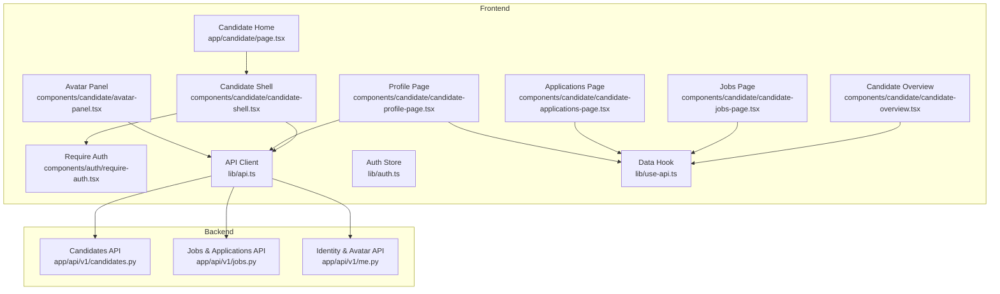
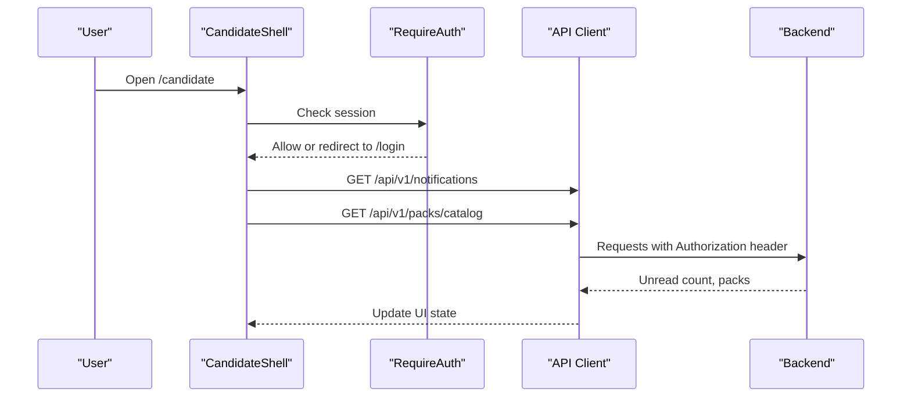
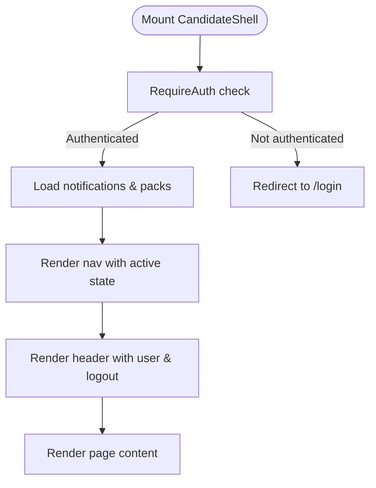
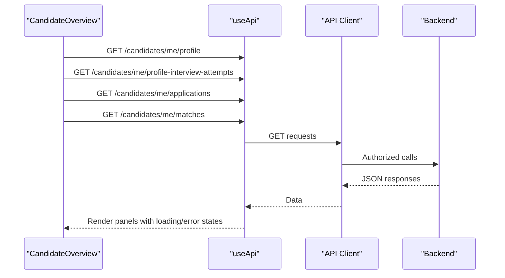
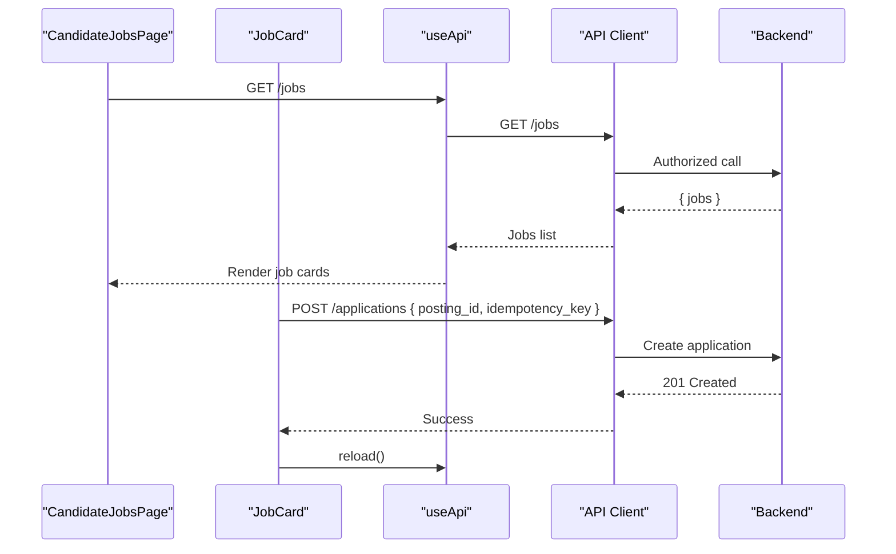
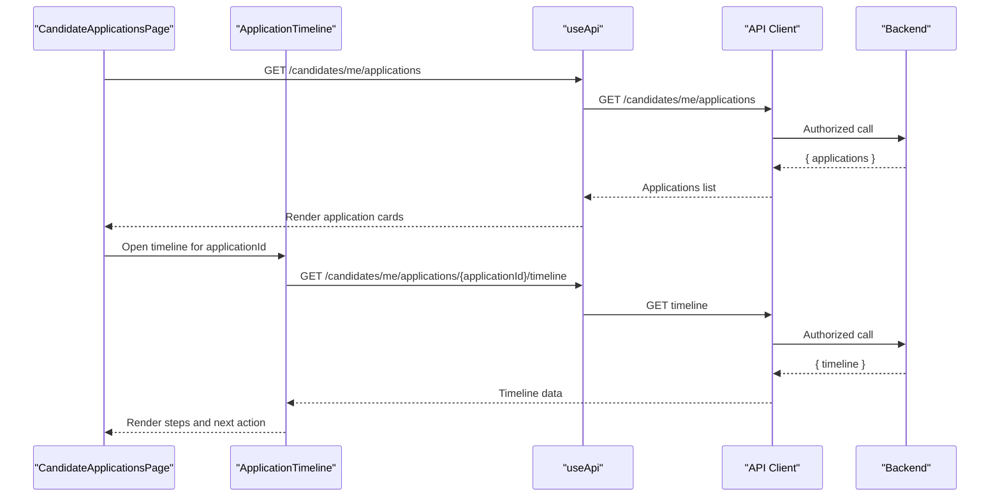
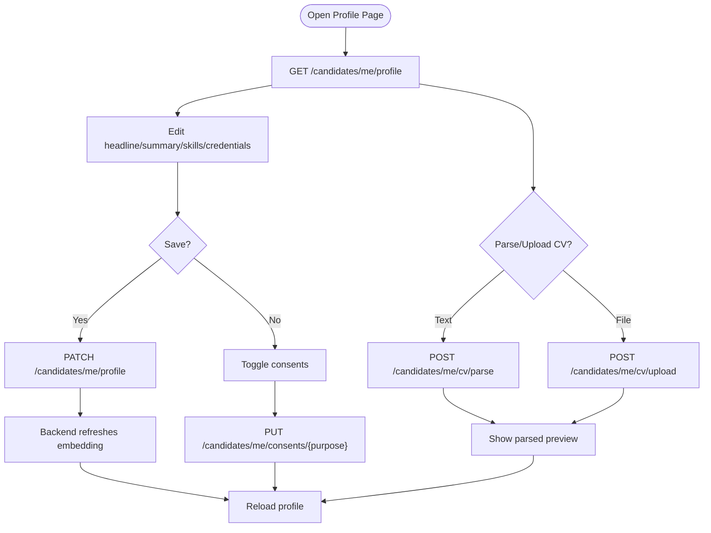
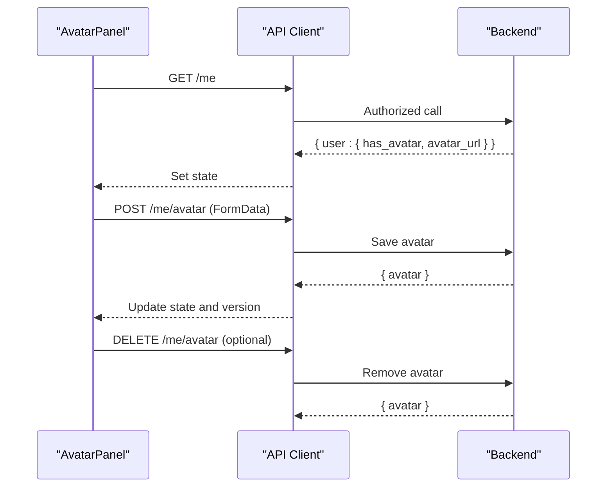
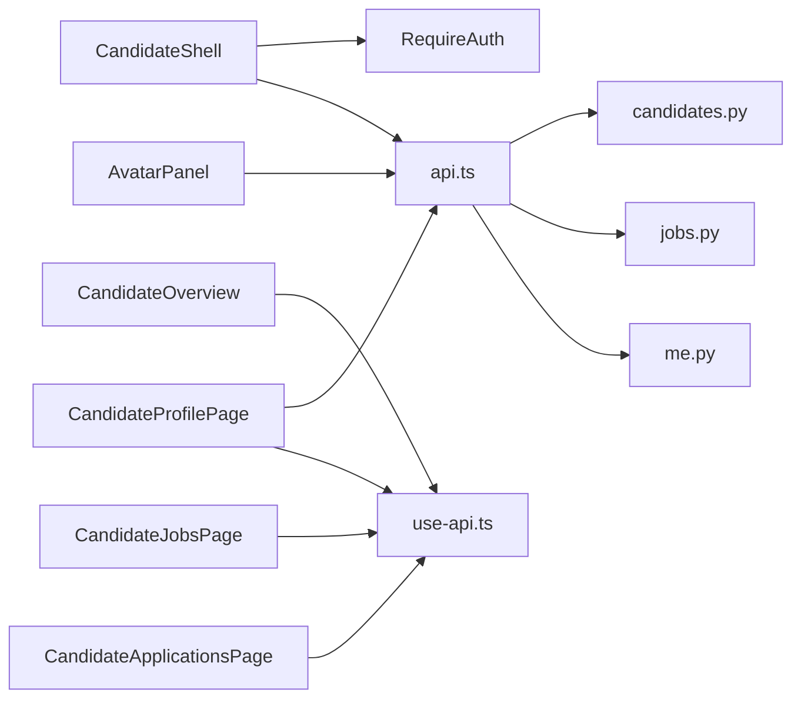

# Candidate Portal Pages

<cite>
**Referenced Files in This Document**
- [page.tsx](file://Frontend/app/candidate/page.tsx)
- [candidate-shell.tsx](file://Frontend/components/candidate/candidate-shell.tsx)
- [candidate-overview.tsx](file://Frontend/components/candidate/candidate-overview.tsx)
- [candidate-jobs-page.tsx](file://Frontend/components/candidate/candidate-jobs-page.tsx)
- [candidate-applications-page.tsx](file://Frontend/components/candidate/candidate-applications-page.tsx)
- [candidate-profile-page.tsx](file://Frontend/components/candidate/candidate-profile-page.tsx)
- [avatar-panel.tsx](file://Frontend/components/candidate/avatar-panel.tsx)
- [require-auth.tsx](file://Frontend/components/auth/require-auth.tsx)
- [api.ts](file://Frontend/lib/api.ts)
- [auth.ts](file://Frontend/lib/auth.ts)
- [use-api.ts](file://Frontend/lib/use-api.ts)
- [types.ts](file://Frontend/lib/types.ts)
- [jobs.py](file://Backend/app/api/v1/jobs.py)
- [candidates.py](file://Backend/app/api/v1/candidates.py)
- [me.py](file://Backend/app/api/v1/me.py)
</cite>

## Table of Contents
1. [Introduction](#introduction)
2. [Project Structure](#project-structure)
3. [Core Components](#core-components)
4. [Architecture Overview](#architecture-overview)
5. [Detailed Component Analysis](#detailed-component-analysis)
6. [Dependency Analysis](#dependency-analysis)
7. [Performance Considerations](#performance-considerations)
8. [Troubleshooting Guide](#troubleshooting-guide)
9. [Conclusion](#conclusion)

## Introduction
This document explains the candidate portal pages and their functionality across the frontend and backend. It covers:
- Candidate dashboard (overview), profile management, job browsing, and application tracking
- The CandidateShell component for consistent navigation and state
- The CandidateOverview component for statistics and recent activities
- Job search and filtering capabilities, application status tracking, and profile editing workflows
- Candidate-specific authentication, data fetching patterns, and error handling

## Project Structure
The candidate portal is implemented as Next.js pages that wrap content with a shared shell and use reusable components to fetch and display data. Backend endpoints provide candidate-scoped APIs for profiles, jobs, applications, interviews, and identity features.

**Diagram sources**
- [page.tsx:1-14](file://Frontend/app/candidate/page.tsx#L1-L14)
- [candidate-shell.tsx:1-93](file://Frontend/components/candidate/candidate-shell.tsx#L1-L93)
- [candidate-overview.tsx:1-179](file://Frontend/components/candidate/candidate-overview.tsx#L1-L179)
- [candidate-jobs-page.tsx:1-96](file://Frontend/components/candidate/candidate-jobs-page.tsx#L1-L96)
- [candidate-applications-page.tsx:1-120](file://Frontend/components/candidate/candidate-applications-page.tsx#L1-L120)
- [candidate-profile-page.tsx:1-295](file://Frontend/components/candidate/candidate-profile-page.tsx#L1-L295)
- [avatar-panel.tsx:1-178](file://Frontend/components/candidate/avatar-panel.tsx#L1-L178)
- [require-auth.tsx:1-42](file://Frontend/components/auth/require-auth.tsx#L1-L42)
- [api.ts:1-199](file://Frontend/lib/api.ts#L1-L199)
- [auth.ts:1-70](file://Frontend/lib/auth.ts#L1-L70)
- [use-api.ts:1-34](file://Frontend/lib/use-api.ts#L1-L34)
- [candidates.py:1-482](file://Backend/app/api/v1/candidates.py#L1-L482)
- [jobs.py:1-452](file://Backend/app/api/v1/jobs.py#L1-L452)
- [me.py:1-110](file://Backend/app/api/v1/me.py#L1-L110)

**Section sources**
- [page.tsx:1-14](file://Frontend/app/candidate/page.tsx#L1-L14)
- [candidate-shell.tsx:1-93](file://Frontend/components/candidate/candidate-shell.tsx#L1-L93)

## Core Components
- CandidateShell: Provides authenticated layout, top navigation, notifications badge, pack branding, user info, and sign-out. It enforces authentication via RequireAuth and loads session, unread notifications, and pack catalog on mount.
- CandidateOverview: Displays skill profile screening attempts, current profile summary, suggested job matches, and active applications. Uses a data hook to fetch and render loading/error states.
- CandidateJobsPage: Lists published jobs, shows “already applied” state, allows applying with idempotency keys, and refreshes after successful application.
- CandidateApplicationsPage: Lists all applications with status pills, interview completion links when applicable, and expandable timelines per application.
- CandidateProfilePage: Edits headline, summary, skills, credentials; toggles privacy consents; parses or uploads CVs to build embeddings; integrates avatar panel.
- AvatarPanel: Uploads/removes profile photo and renders an authenticated image via a local object URL.

**Section sources**
- [candidate-shell.tsx:1-93](file://Frontend/components/candidate/candidate-shell.tsx#L1-L93)
- [candidate-overview.tsx:1-179](file://Frontend/components/candidate/candidate-overview.tsx#L1-L179)
- [candidate-jobs-page.tsx:1-96](file://Frontend/components/candidate/candidate-jobs-page.tsx#L1-L96)
- [candidate-applications-page.tsx:1-120](file://Frontend/components/candidate/candidate-applications-page.tsx#L1-L120)
- [candidate-profile-page.tsx:1-295](file://Frontend/components/candidate/candidate-profile-page.tsx#L1-L295)
- [avatar-panel.tsx:1-178](file://Frontend/components/candidate/avatar-panel.tsx#L1-L178)

## Architecture Overview
The candidate portal uses a client-side architecture:
- Authentication: RequireAuth checks for an access token and redirects to login if missing. Session tokens are stored in localStorage and used by the API client.
- Data Fetching: useApi wraps GET requests, manages loading/error states, and exposes reload. All candidate endpoints require authentication and return candidate-scoped data.
- Backend Enforcement: Endpoints rely on a CandidateContextDependency to ensure the caller is a candidate and scoped to their own resources.

**Diagram sources**
- [candidate-shell.tsx:18-35](file://Frontend/components/candidate/candidate-shell.tsx#L18-L35)
- [require-auth.tsx:17-31](file://Frontend/components/auth/require-auth.tsx#L17-L31)
- [api.ts:59-104](file://Frontend/lib/api.ts#L59-L104)

## Detailed Component Analysis

### CandidateShell
- Responsibilities:
  - Enforce authentication using RequireAuth
  - Render top navigation with active state detection
  - Load unread notification count and pack catalog
  - Display user display name and sign-out action
- Navigation:
  - Links to overview, jobs, applications, and profile
  - Active link highlighting based on pathname
- State:
  - Session from local storage
  - Unread notifications count
  - Pack name for branding

**Diagram sources**
- [candidate-shell.tsx:18-83](file://Frontend/components/candidate/candidate-shell.tsx#L18-L83)
- [require-auth.tsx:17-31](file://Frontend/components/auth/require-auth.tsx#L17-L31)

**Section sources**
- [candidate-shell.tsx:1-93](file://Frontend/components/candidate/candidate-shell.tsx#L1-L93)

### CandidateOverview
- Displays:
  - Profile Screening attempts with best score
  - Current profile summary and discovery consent
  - Suggested job matches with scores and reasons
  - Active applications with status and interview completion links
- Data:
  - Profile, attempts, applications, and matches fetched via useApi
- Error Handling:
  - LoadingState and ErrorState with retry via reload

**Diagram sources**
- [candidate-overview.tsx:10-20](file://Frontend/components/candidate/candidate-overview.tsx#L10-L20)
- [use-api.ts:6-32](file://Frontend/lib/use-api.ts#L6-L32)
- [api.ts:59-104](file://Frontend/lib/api.ts#L59-L104)

**Section sources**
- [candidate-overview.tsx:1-179](file://Frontend/components/candidate/candidate-overview.tsx#L1-L179)

### Jobs Page
- Features:
  - List published jobs with organization, location, employment type
  - Show “Job Interview required” pill when applicable
  - Apply with idempotency key to prevent duplicate submissions
  - Refresh list after successful application
- Data:
  - Jobs fetched from /api/v1/jobs
- Error Handling:
  - ApiError messages displayed inline

**Diagram sources**
- [candidate-jobs-page.tsx:11-30](file://Frontend/components/candidate/candidate-jobs-page.tsx#L11-L30)
- [candidate-jobs-page.tsx:68-96](file://Frontend/components/candidate/candidate-jobs-page.tsx#L68-L96)
- [jobs.py:86-179](file://Backend/app/api/v1/jobs.py#L86-L179)

**Section sources**
- [candidate-jobs-page.tsx:1-96](file://Frontend/components/candidate/candidate-jobs-page.tsx#L1-L96)
- [jobs.py:49-179](file://Backend/app/api/v1/jobs.py#L49-L179)

### Applications Page
- Features:
  - List applications with status and dates
  - Show AI match score when available
  - Link to complete interview if invited/in progress
  - Expandable timeline per application
- Timeline:
  - Shows steps with completed/current/upcoming states and next action hints
- Data:
  - Applications from /api/v1/candidates/me/applications
  - Timeline from /api/v1/candidates/me/applications/{id}/timeline

**Diagram sources**
- [candidate-applications-page.tsx:10-40](file://Frontend/components/candidate/candidate-applications-page.tsx#L10-L40)
- [candidate-applications-page.tsx:42-120](file://Frontend/components/candidate/candidate-applications-page.tsx#L42-L120)
- [jobs.py:192-307](file://Backend/app/api/v1/jobs.py#L192-L307)

**Section sources**
- [candidate-applications-page.tsx:1-120](file://Frontend/components/candidate/candidate-applications-page.tsx#L1-L120)
- [jobs.py:192-307](file://Backend/app/api/v1/jobs.py#L192-L307)

### Profile Page
- Features:
  - Edit profile fields (headline, summary, skills, credentials)
  - Toggle consents for discovery and application processing
  - Parse or upload CV to build structured sections and embeddings
  - View parsed preview and status messages
- Data:
  - Profile from /api/v1/candidates/me/profile
  - Save profile via PATCH /api/v1/candidates/me/profile
  - Consent updates via PUT /api/v1/candidates/me/consents/{purpose}
  - CV parse/upload via POST /api/v1/candidates/me/cv/parse or /cv/upload
- Error Handling:
  - Inline form errors and success messages
  - Retry via reload where applicable

**Diagram sources**
- [candidate-profile-page.tsx:41-112](file://Frontend/components/candidate/candidate-profile-page.tsx#L41-L112)
- [candidates.py:162-241](file://Backend/app/api/v1/candidates.py#L162-L241)

**Section sources**
- [candidate-profile-page.tsx:1-295](file://Frontend/components/candidate/candidate-profile-page.tsx#L1-L295)
- [candidates.py:147-241](file://Backend/app/api/v1/candidates.py#L147-L241)

### Avatar Panel
- Features:
  - Upload profile photo (JPEG/PNG/WebP, max 5 MB)
  - Remove existing photo
  - Render authenticated image via object URL
- Data:
  - User info including avatar presence via /api/v1/me
  - Upload/remove via /api/v1/me/avatar

**Diagram sources**
- [avatar-panel.tsx:54-103](file://Frontend/components/candidate/avatar-panel.tsx#L54-L103)
- [me.py:22-110](file://Backend/app/api/v1/me.py#L22-L110)

**Section sources**
- [avatar-panel.tsx:1-178](file://Frontend/components/candidate/avatar-panel.tsx#L1-L178)
- [me.py:22-110](file://Backend/app/api/v1/me.py#L22-L110)

## Dependency Analysis
- Frontend dependencies:
  - CandidateShell depends on RequireAuth, api, and auth modules
  - CandidateOverview depends on useApi and types for rendering
  - CandidateJobsPage and CandidateApplicationsPage depend on useApi and types
  - CandidateProfilePage depends on api and useApi for mutations and reads
  - AvatarPanel depends on api for file operations and user info
- Backend dependencies:
  - Candidates endpoints enforce CandidateContextDependency and manage embeddings
  - Jobs endpoints enforce CandidateContextDependency and expose candidate-safe views
  - Identity endpoints manage user info and avatars

**Diagram sources**
- [candidate-shell.tsx:1-93](file://Frontend/components/candidate/candidate-shell.tsx#L1-L93)
- [candidate-overview.tsx:1-179](file://Frontend/components/candidate/candidate-overview.tsx#L1-L179)
- [candidate-jobs-page.tsx:1-96](file://Frontend/components/candidate/candidate-jobs-page.tsx#L1-L96)
- [candidate-applications-page.tsx:1-120](file://Frontend/components/candidate/candidate-applications-page.tsx#L1-L120)
- [candidate-profile-page.tsx:1-295](file://Frontend/components/candidate/candidate-profile-page.tsx#L1-L295)
- [avatar-panel.tsx:1-178](file://Frontend/components/candidate/avatar-panel.tsx#L1-L178)
- [api.ts:1-199](file://Frontend/lib/api.ts#L1-L199)
- [candidates.py:1-482](file://Backend/app/api/v1/candidates.py#L1-L482)
- [jobs.py:1-452](file://Backend/app/api/v1/jobs.py#L1-L452)
- [me.py:1-110](file://Backend/app/api/v1/me.py#L1-L110)

**Section sources**
- [api.ts:1-199](file://Frontend/lib/api.ts#L1-L199)
- [candidates.py:1-482](file://Backend/app/api/v1/candidates.py#L1-L482)
- [jobs.py:1-452](file://Backend/app/api/v1/jobs.py#L1-L452)
- [me.py:1-110](file://Backend/app/api/v1/me.py#L1-L110)

## Performance Considerations
- Use idempotency keys for apply and submit actions to avoid duplicates and retries.
- Prefer GET endpoints with caching disabled at the client level to keep UI fresh.
- Avoid re-fetching large lists unnecessarily; use reload only after mutations.
- Keep payload sizes reasonable (e.g., CV text limits) to reduce parsing overhead.
- Reuse authenticated image URLs with version parameters to minimize cache issues.

[No sources needed since this section provides general guidance]

## Troubleshooting Guide
- Authentication failures:
  - If a request returns 401, the API client attempts token refresh; if it fails, session is cleared and user is redirected to login.
  - Ensure RequireAuth is wrapping protected routes and that access tokens exist in localStorage.
- Network errors:
  - ApiError with code "network_unreachable" indicates backend is not reachable; verify server is running and configured.
- Application submission errors:
  - 409 "already_applied" means the candidate already applied; direct users to the applications page.
  - 409 "posting_misconfigured" indicates the job cannot accept applications right now; retry later.
- Profile and CV parsing errors:
  - Validation errors (e.g., unknown consent purpose) return 422; show the message to the user.
  - CV parsing failures return error messages; prompt the user to try again or paste text instead of uploading.
- Timeline loading errors:
  - 404 "not_found" for timeline or application; ensure the application exists and belongs to the candidate.

**Section sources**
- [api.ts:25-57](file://Frontend/lib/api.ts#L25-L57)
- [api.ts:59-104](file://Frontend/lib/api.ts#L59-L104)
- [api.ts:106-146](file://Frontend/lib/api.ts#L106-L146)
- [jobs.py:86-179](file://Backend/app/api/v1/jobs.py#L86-L179)
- [candidates.py:248-265](file://Backend/app/api/v1/candidates.py#L248-L265)
- [candidates.py:392-423](file://Backend/app/api/v1/candidates.py#L392-L423)

## Conclusion
The candidate portal provides a cohesive experience for candidates to manage their profile, discover jobs, apply securely, and track application progress. CandidateShell ensures consistent navigation and authentication, while CandidateOverview offers quick insights into screening results, profile status, matches, and active applications. Robust error handling, idempotent operations, and clear feedback make the portal reliable and user-friendly.

[No sources needed since this section summarizes without analyzing specific files]