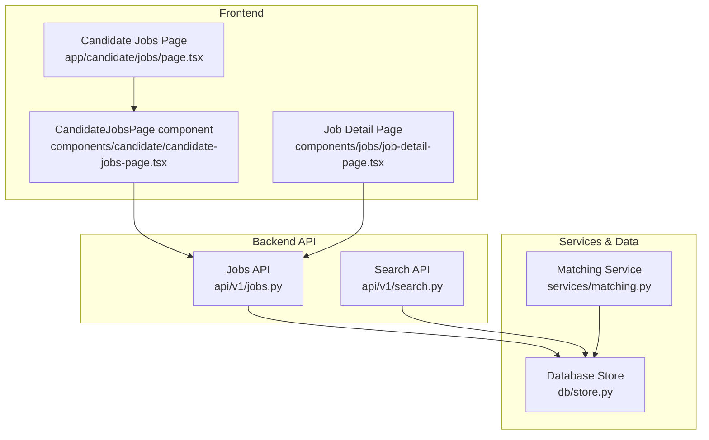
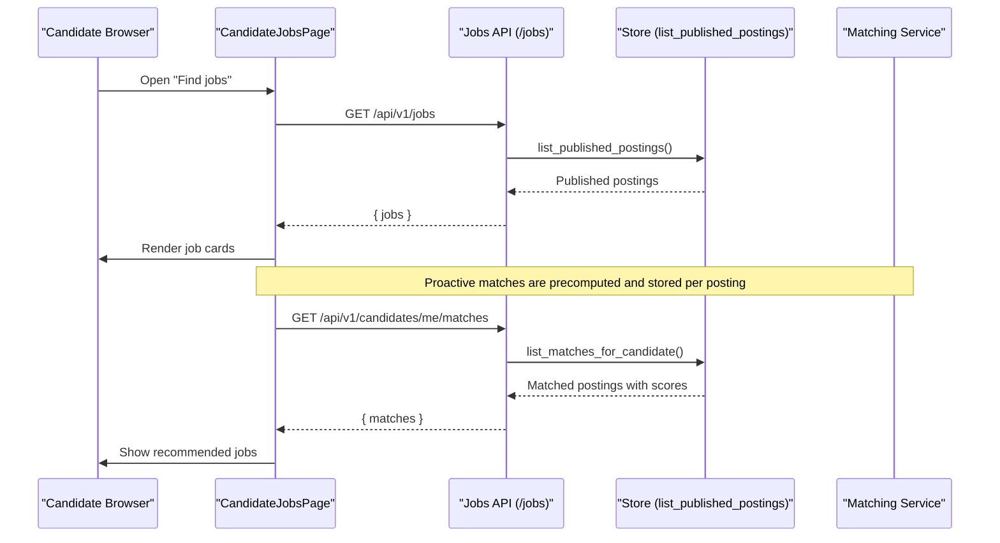
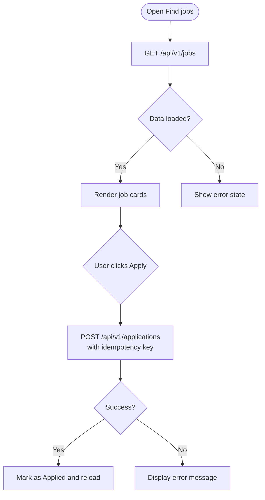
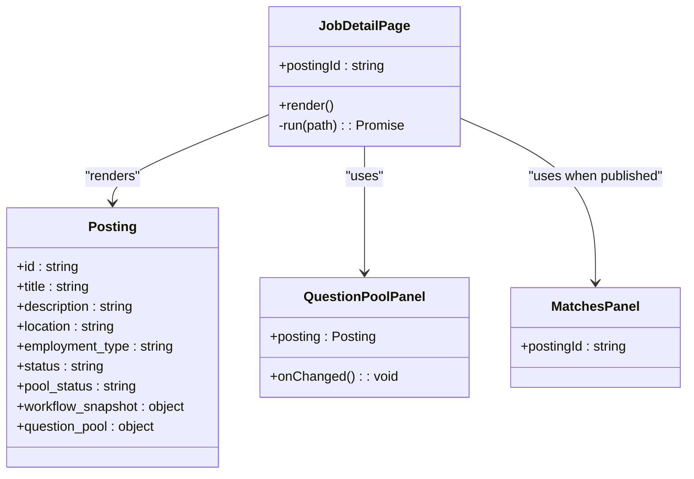
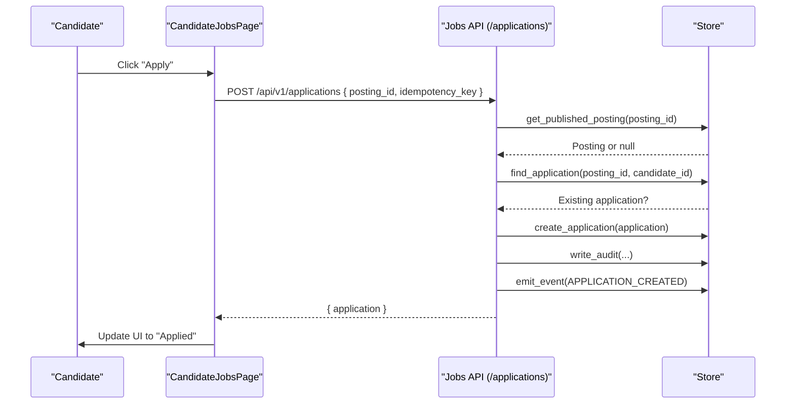
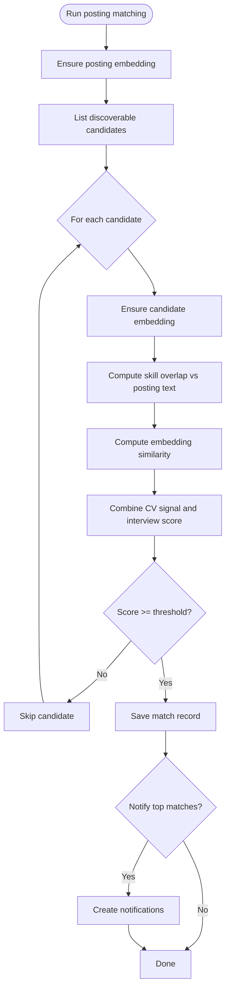
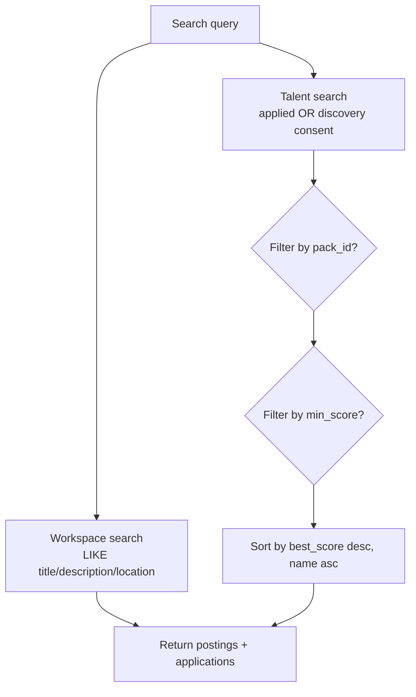
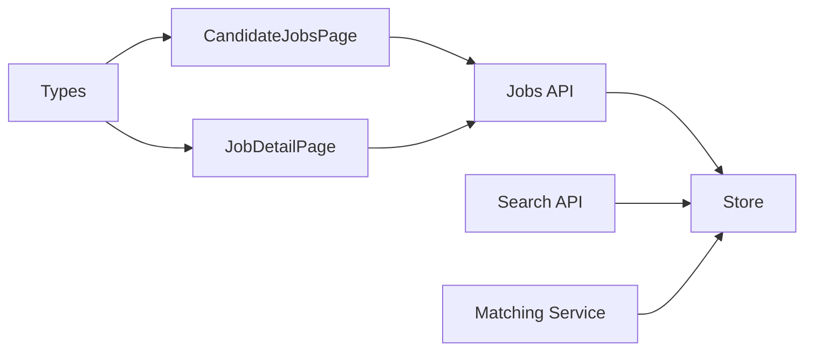

# Job Browsing & Search

<cite>
**Referenced Files in This Document**
- [Backend/app/api/v1/jobs.py](file://Backend/app/api/v1/jobs.py)
- [Backend/app/api/v1/search.py](file://Backend/app/api/v1/search.py)
- [Backend/app/services/matching.py](file://Backend/app/services/matching.py)
- [Backend/app/db/store.py](file://Backend/app/db/store.py)
- [Frontend/app/candidate/jobs/page.tsx](file://Frontend/app/candidate/jobs/page.tsx)
- [Frontend/components/candidate/candidate-jobs-page.tsx](file://Frontend/components/candidate/candidate-jobs-page.tsx)
- [Frontend/components/jobs/job-detail-page.tsx](file://Frontend/components/jobs/job-detail-page.tsx)
- [Frontend/lib/types.ts](file://Frontend/lib/types.ts)
</cite>

## Table of Contents
1. Introduction
2. Project Structure
3. Core Components
4. Architecture Overview
5. Detailed Component Analysis
6. Dependency Analysis
7. Performance Considerations
8. Troubleshooting Guide
9. Conclusion

## Introduction
This document explains how candidates discover, browse, and apply to jobs in the system. It covers:
- How job listings are fetched and presented to candidates
- How search and filtering work for candidate discovery
- How job detail views are rendered and how applications are submitted
- The matching algorithm that scores and ranks jobs against candidate profiles
- Pagination handling and responsive design considerations

## Project Structure
The candidate-facing job browsing feature spans a small set of frontend pages and backend endpoints:
- Frontend pages render the “Find jobs” list and job details
- Backend endpoints expose published postings, application submission, and matches
- Matching service computes compatibility between candidate profiles and posted jobs
- Database store functions provide tenant-scoped queries and cross-tenant read access for published jobs

**Diagram sources**
- [Frontend/app/candidate/jobs/page.tsx:1-14](file://Frontend/app/candidate/jobs/page.tsx#L1-L14)
- [Frontend/components/candidate/candidate-jobs-page.tsx:1-96](file://Frontend/components/candidate/candidate-jobs-page.tsx#L1-L96)
- [Frontend/components/jobs/job-detail-page.tsx:1-310](file://Frontend/components/jobs/job-detail-page.tsx#L1-L310)
- [Backend/app/api/v1/jobs.py:1-452](file://Backend/app/api/v1/jobs.py#L1-L452)
- [Backend/app/api/v1/search.py:1-72](file://Backend/app/api/v1/search.py#L1-L72)
- [Backend/app/services/matching.py:1-345](file://Backend/app/services/matching.py#L1-L345)
- [Backend/app/db/store.py:980-1179](file://Backend/app/db/store.py#L980-L1179)

**Section sources**
- [Frontend/app/candidate/jobs/page.tsx:1-14](file://Frontend/app/candidate/jobs/page.tsx#L1-L14)
- [Frontend/components/candidate/candidate-jobs-page.tsx:1-96](file://Frontend/components/candidate/candidate-jobs-page.tsx#L1-L96)
- [Backend/app/api/v1/jobs.py:1-452](file://Backend/app/api/v1/jobs.py#L1-L452)
- [Backend/app/api/v1/search.py:1-72](file://Backend/app/api/v1/search.py#L1-L72)
- [Backend/app/services/matching.py:1-345](file://Backend/app/services/matching.py#L1-L345)
- [Backend/app/db/store.py:980-1179](file://Backend/app/db/store.py#L980-L1179)

## Core Components
- Candidate Jobs List: Fetches all published jobs and shows organization name, title, location, employment type, whether an applied interview is required, and an “Apply” button if not already applied.
- Job Detail View: Displays full job description, status, and process steps; supports applying and viewing application state.
- Application Submission: Idempotent POST with guardrails to prevent duplicate applications and ensure posting configuration allows applications.
- Matches Endpoint: Returns proactive matches computed by the matching service based on profile embeddings, skills, and interview scores.
- Search Endpoints: Tenant-scoped workspace search and talent discovery search with optional filters.

**Section sources**
- [Frontend/components/candidate/candidate-jobs-page.tsx:1-96](file://Frontend/components/candidate/candidate-jobs-page.tsx#L1-L96)
- [Backend/app/api/v1/jobs.py:49-77](file://Backend/app/api/v1/jobs.py#L49-L77)
- [Backend/app/api/v1/jobs.py:86-179](file://Backend/app/api/v1/jobs.py#L86-L179)
- [Backend/app/api/v1/jobs.py:182-189](file://Backend/app/api/v1/jobs.py#L182-L189)
- [Backend/app/api/v1/search.py:16-51](file://Backend/app/api/v1/search.py#L16-L51)

## Architecture Overview
The candidate journey flows from UI components to backend APIs, which query the database and optionally invoke the matching service.

**Diagram sources**
- [Frontend/components/candidate/candidate-jobs-page.tsx:68-96](file://Frontend/components/candidate/candidate-jobs-page.tsx#L68-L96)
- [Backend/app/api/v1/jobs.py:49-61](file://Backend/app/api/v1/jobs.py#L49-L61)
- [Backend/app/api/v1/jobs.py:182-189](file://Backend/app/api/v1/jobs.py#L182-L189)
- [Backend/app/db/store.py:1613-1617](file://Backend/app/db/store.py#L1613-L1617)
- [Backend/app/db/store.py:1527-1554](file://Backend/app/db/store.py#L1527-L1554)

## Detailed Component Analysis

### Candidate Jobs List
- Fetches published jobs via a single endpoint and renders them as cards with expandable descriptions.
- Shows whether an applied interview is required and prevents reapplication using server-side checks.
- Uses idempotency keys on application submission to avoid duplicates under retries.

**Diagram sources**
- [Frontend/components/candidate/candidate-jobs-page.tsx:11-66](file://Frontend/components/candidate/candidate-jobs-page.tsx#L11-L66)
- [Backend/app/api/v1/jobs.py:86-179](file://Backend/app/api/v1/jobs.py#L86-L179)

**Section sources**
- [Frontend/components/candidate/candidate-jobs-page.tsx:1-96](file://Frontend/components/candidate/candidate-jobs-page.tsx#L1-L96)
- [Backend/app/api/v1/jobs.py:49-77](file://Backend/app/api/v1/jobs.py#L49-L77)
- [Backend/app/api/v1/jobs.py:86-179](file://Backend/app/api/v1/jobs.py#L86-L179)

### Job Detail View
- Displays job metadata, status, and process steps mapped to candidate-friendly labels.
- Supports publishing/closing actions for employers and shows question pool management for hiring teams.
- For candidates, it provides context about the application process and whether an applied interview is required.

**Diagram sources**
- [Frontend/components/jobs/job-detail-page.tsx:199-310](file://Frontend/components/jobs/job-detail-page.tsx#L199-L310)
- [Frontend/lib/types.ts:1-18](file://Frontend/lib/types.ts#L1-L18)

**Section sources**
- [Frontend/components/jobs/job-detail-page.tsx:1-310](file://Frontend/components/jobs/job-detail-page.tsx#L1-L310)
- [Frontend/lib/types.ts:1-18](file://Frontend/lib/types.ts#L1-L18)

### Application Submission Flow
- Validates posting availability and configuration before creating an application.
- Prevents duplicate applications and persists a snapshot of the candidate’s profile at application time.
- Emits events and writes audit records for traceability.

**Diagram sources**
- [Backend/app/api/v1/jobs.py:86-179](file://Backend/app/api/v1/jobs.py#L86-L179)
- [Backend/app/db/store.py:1648-1657](file://Backend/app/db/store.py#L1648-L1657)

**Section sources**
- [Backend/app/api/v1/jobs.py:86-179](file://Backend/app/api/v1/jobs.py#L86-L179)

### Matching Algorithm and Proactive Matches
- Computes a composite score combining skill/keyword overlap and embedding similarity, weighted by domain pack settings and optional interview scores.
- Enforces discovery consent and excludes candidates who already applied.
- Stores top matches per posting and can notify candidates and hiring staff.

**Diagram sources**
- [Backend/app/services/matching.py:190-287](file://Backend/app/services/matching.py#L190-L287)
- [Backend/app/services/matching.py:115-187](file://Backend/app/services/matching.py#L115-L187)

**Section sources**
- [Backend/app/services/matching.py:1-345](file://Backend/app/services/matching.py#L1-L345)
- [Backend/app/db/store.py:1527-1554](file://Backend/app/db/store.py#L1527-L1554)

### Search and Filtering Capabilities
- Workspace search returns postings and applications within a tenant using substring matching across title, description, location, and candidate fields.
- Talent discovery search filters candidates by applied status, discovery consent, optional pack filter, and minimum score, then sorts by best score and display name.

**Diagram sources**
- [Backend/app/api/v1/search.py:16-51](file://Backend/app/api/v1/search.py#L16-L51)
- [Backend/app/db/store.py:989-1027](file://Backend/app/db/store.py#L989-L1027)
- [Backend/app/db/store.py:1030-1135](file://Backend/app/db/store.py#L1030-L1135)

**Section sources**
- [Backend/app/api/v1/search.py:16-51](file://Backend/app/api/v1/search.py#L16-L51)
- [Backend/app/db/store.py:989-1027](file://Backend/app/db/store.py#L989-L1027)
- [Backend/app/db/store.py:1030-1135](file://Backend/app/db/store.py#L1030-L1135)

### Pagination Handling
- Candidate job listing currently loads all published postings without explicit pagination parameters.
- Workspace search uses a limit parameter to cap results.
- Talent discovery search includes a default limit and returns up to the configured maximum.

Recommendation: Introduce cursor-based or offset-based pagination for the candidate jobs list to handle large catalogs efficiently.

**Section sources**
- [Backend/app/api/v1/jobs.py:49-61](file://Backend/app/api/v1/jobs.py#L49-L61)
- [Backend/app/db/store.py:989-1027](file://Backend/app/db/store.py#L989-L1027)
- [Backend/app/db/store.py:1030-1135](file://Backend/app/db/store.py#L1030-L1135)

### Responsive Design Considerations
- The candidate jobs page uses a card layout that adapts to screen size through CSS classes and panels.
- Expandable job descriptions reduce visual clutter on smaller screens.
- Status pills and badges provide compact indicators for job states and requirements.

[No sources needed since this section provides general guidance]

## Dependency Analysis
- Frontend components depend on backend APIs for data fetching and mutations.
- Backend APIs depend on the database store for tenant-scoped and cross-tenant reads.
- Matching service depends on embeddings and profile/interview data to compute scores.
- Types define contracts between frontend and backend payloads.

**Diagram sources**
- [Frontend/components/candidate/candidate-jobs-page.tsx:1-96](file://Frontend/components/candidate/candidate-jobs-page.tsx#L1-L96)
- [Frontend/components/jobs/job-detail-page.tsx:1-310](file://Frontend/components/jobs/job-detail-page.tsx#L1-L310)
- [Backend/app/api/v1/jobs.py:1-452](file://Backend/app/api/v1/jobs.py#L1-L452)
- [Backend/app/api/v1/search.py:1-72](file://Backend/app/api/v1/search.py#L1-L72)
- [Backend/app/services/matching.py:1-345](file://Backend/app/services/matching.py#L1-L345)
- [Backend/app/db/store.py:980-1179](file://Backend/app/db/store.py#L980-L1179)
- [Frontend/lib/types.ts:1-267](file://Frontend/lib/types.ts#L1-L267)

**Section sources**
- [Backend/app/api/v1/jobs.py:1-452](file://Backend/app/api/v1/jobs.py#L1-L452)
- [Backend/app/api/v1/search.py:1-72](file://Backend/app/api/v1/search.py#L1-L72)
- [Backend/app/services/matching.py:1-345](file://Backend/app/services/matching.py#L1-L345)
- [Backend/app/db/store.py:980-1179](file://Backend/app/db/store.py#L980-L1179)
- [Frontend/lib/types.ts:1-267](file://Frontend/lib/types.ts#L1-L267)

## Performance Considerations
- Avoid loading all jobs without pagination; consider adding limit/offset or cursor-based pagination to reduce payload size.
- Leverage existing limits in workspace and talent searches to control result sets.
- Use embeddings sparingly; ensure they are cached and regenerated only when necessary.
- Prefer server-side filtering (e.g., published status, tenant scoping) to minimize client-side processing.

[No sources needed since this section provides general guidance]

## Troubleshooting Guide
- Duplicate Applications: The backend enforces idempotency and rejects duplicate applications with a specific error code. Ensure clients pass unique idempotency keys.
- Not Found Errors: If a job is unpublished or unavailable, the API returns a not found response. Verify posting status and IDs.
- Misconfigured Postings: Applications require a valid workflow stage marked as “new”; otherwise, the API indicates the posting cannot accept applications.
- Search Empty Results: Workspace search requires a minimum query length; talent search filters by consent and applied status.

**Section sources**
- [Backend/app/api/v1/jobs.py:86-179](file://Backend/app/api/v1/jobs.py#L86-L179)
- [Backend/app/api/v1/jobs.py:64-77](file://Backend/app/api/v1/jobs.py#L64-L77)
- [Backend/app/api/v1/search.py:16-26](file://Backend/app/api/v1/search.py#L16-L26)
- [Backend/app/db/store.py:1030-1135](file://Backend/app/db/store.py#L1030-L1135)

## Conclusion
Candidates discover jobs through a simple list of published postings, with proactive matches surfaced based on profile embeddings, skills, and interview performance. Applications are idempotent and guarded against duplicates, while search endpoints provide flexible filtering for both workspace and talent discovery. To scale effectively, introduce pagination for the jobs list and continue optimizing embedding generation and caching strategies.