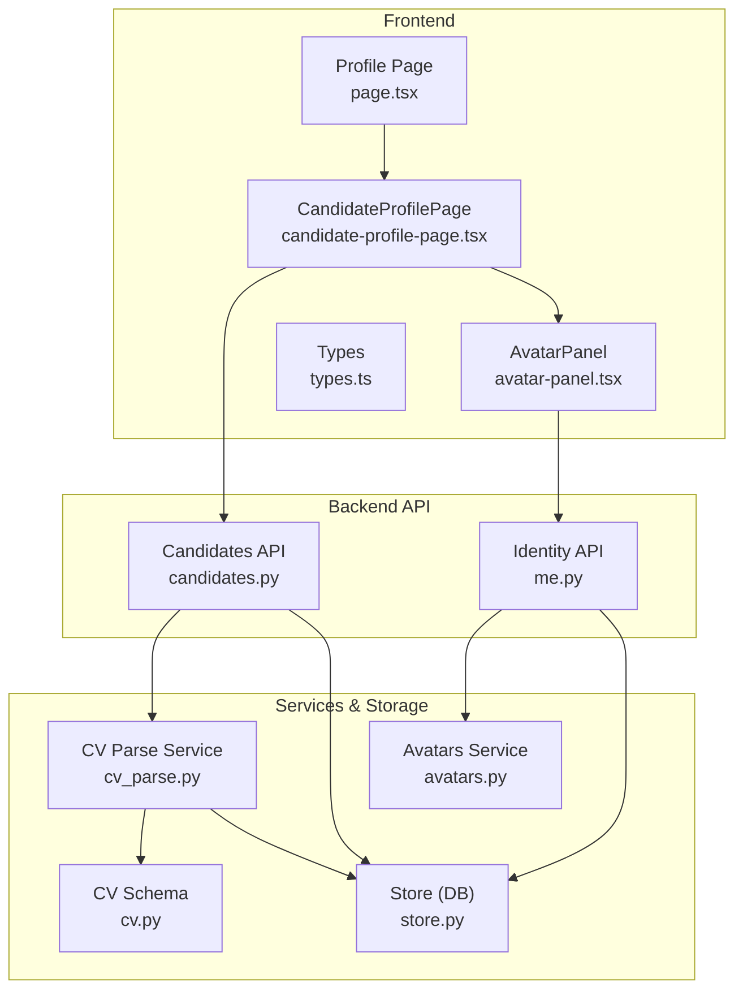
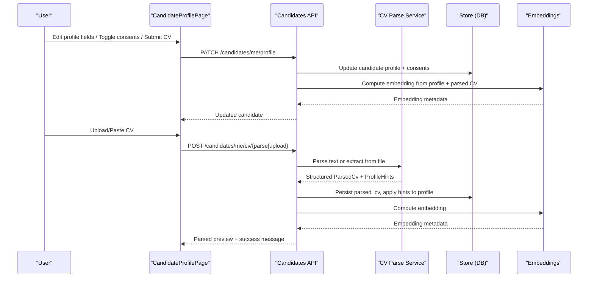
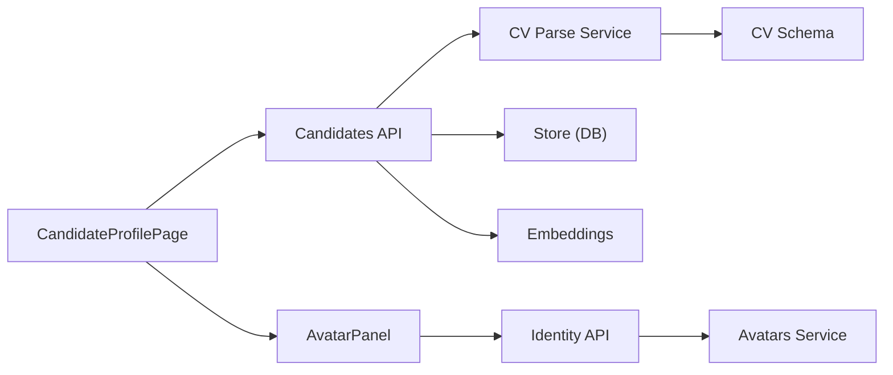

# Profile Management

<cite>
**Referenced Files in This Document**
- [page.tsx](file://Frontend/app/candidate/profile/page.tsx)
- [candidate-profile-page.tsx](file://Frontend/components/candidate/candidate-profile-page.tsx)
- [avatar-panel.tsx](file://Frontend/components/candidate/avatar-panel.tsx)
- [types.ts](file://Frontend/lib/types.ts)
- [candidates.py](file://Backend/app/api/v1/candidates.py)
- [me.py](file://Backend/app/api/v1/me.py)
- [avatars.py](file://Backend/app/services/avatars.py)
- [cv_parse.py](file://Backend/app/services/cv_parse.py)
- [store.py](file://Backend/app/db/store.py)
- [cv.py](file://Backend/app/schemas/cv.py)
</cite>

## Table of Contents
1. Introduction
2. Project Structure
3. Core Components
4. Architecture Overview
5. Detailed Component Analysis
6. Dependency Analysis
7. Performance Considerations
8. Troubleshooting Guide
9. Conclusion

## Introduction
This document explains the candidate profile management system, covering:
- The profile editing interface and how it persists changes to the backend
- Avatar upload, storage, and retrieval for identity verification
- CV parsing workflows that structure resumes and power job matching via embeddings
- Data validation rules, required fields guidance, and profile completeness considerations
- How frontend forms synchronize with backend endpoints and storage services

The goal is to help developers and product teams understand the end-to-end flow from user actions to stored data and matching readiness.

## Project Structure
The profile feature spans both frontend and backend:
- Frontend pages and components render the profile editor, avatar panel, and CV parsing UI
- Backend APIs expose endpoints for profile updates, consent toggles, CV parsing/upload, and avatar operations
- Storage and parsing services handle file persistence and structured extraction
- Database store functions persist candidate profiles, consents, parsed CVs, and embeddings

**Diagram sources**
- [page.tsx:1-14](file://Frontend/app/candidate/profile/page.tsx#L1-L14)
- [candidate-profile-page.tsx:1-295](file://Frontend/components/candidate/candidate-profile-page.tsx#L1-L295)
- [avatar-panel.tsx:1-178](file://Frontend/components/candidate/avatar-panel.tsx#L1-L178)
- [types.ts:194-211](file://Frontend/lib/types.ts#L194-L211)
- [candidates.py:147-241](file://Backend/app/api/v1/candidates.py#L147-L241)
- [me.py:22-109](file://Backend/app/api/v1/me.py#L22-L109)
- [avatars.py:1-89](file://Backend/app/services/avatars.py#L1-L89)
- [cv_parse.py:1-242](file://Backend/app/services/cv_parse.py#L1-L242)
- [store.py:1165-1247](file://Backend/app/db/store.py#L1165-L1247)
- [cv.py:1-35](file://Backend/app/schemas/cv.py#L1-L35)

**Section sources**
- [page.tsx:1-14](file://Frontend/app/candidate/profile/page.tsx#L1-L14)
- [candidate-profile-page.tsx:1-295](file://Frontend/components/candidate/candidate-profile-page.tsx#L1-L295)
- [avatar-panel.tsx:1-178](file://Frontend/components/candidate/avatar-panel.tsx#L1-L178)
- [candidates.py:147-241](file://Backend/app/api/v1/candidates.py#L147-L241)
- [me.py:22-109](file://Backend/app/api/v1/me.py#L22-L109)
- [avatars.py:1-89](file://Backend/app/services/avatars.py#L1-L89)
- [cv_parse.py:1-242](file://Backend/app/services/cv_parse.py#L1-L242)
- [store.py:1165-1247](file://Backend/app/db/store.py#L1165-L1247)
- [cv.py:1-35](file://Backend/app/schemas/cv.py#L1-L35)

## Core Components
- Candidate profile page: loads current profile, edits headline/summary/skills/credentials, toggles privacy consents, parses or uploads CV, and shows structured preview
- Avatar panel: uploads/removes profile photo, fetches protected image via tokenized request, and displays status messages
- Backend candidates API: validates and updates profile, parses CV text or uploaded files, applies hints to profile, computes embeddings, and manages consents
- Avatars service: validates image type and size, stores on disk, resolves paths safely, and supports removal
- CV parse service: heuristic or LLM-based parsing into structured sections; extracts profile hints; builds embedding-ready text
- Store: persists candidate profile, consents, parsed CV, and embeddings; initializes defaults for new candidates

Key data model highlights:
- Candidate profile includes headline, summary, skills, credentials, experiences, availability, consents, target domains, parsed CV, and embedding metadata
- Parsed CV contains sections with titles, descriptions, and content lists, plus parser identity and timestamp
- Avatar state tracks presence and URL path for secure retrieval

**Section sources**
- [candidate-profile-page.tsx:11-112](file://Frontend/components/candidate/candidate-profile-page.tsx#L11-L112)
- [avatar-panel.tsx:13-103](file://Frontend/components/candidate/avatar-panel.tsx#L13-L103)
- [candidates.py:147-241](file://Backend/app/api/v1/candidates.py#L147-L241)
- [me.py:64-109](file://Backend/app/api/v1/me.py#L64-L109)
- [avatars.py:30-89](file://Backend/app/services/avatars.py#L30-L89)
- [cv_parse.py:79-168](file://Backend/app/services/cv_parse.py#L79-L168)
- [store.py:1165-1247](file://Backend/app/db/store.py#L1165-L1247)
- [types.ts:181-211](file://Frontend/lib/types.ts#L181-L211)

## Architecture Overview
End-to-end flows for profile updates, avatar management, and CV parsing:

**Diagram sources**
- [candidate-profile-page.tsx:41-112](file://Frontend/components/candidate/candidate-profile-page.tsx#L41-L112)
- [candidates.py:162-241](file://Backend/app/api/v1/candidates.py#L162-L241)
- [cv_parse.py:171-242](file://Backend/app/services/cv_parse.py#L171-L242)
- [store.py:1211-1247](file://Backend/app/db/store.py#L1211-L1247)

## Detailed Component Analysis

### Profile Editing Interface
- Loads current profile via GET /candidates/me/profile and populates form fields
- On save, sends a PATCH request with trimmed headline/summary and comma-separated skills/credentials
- Updates consents via PUT /candidates/me/consents/{purpose}
- Displays success/error states and reloads profile data after mutations

Validation and UX:
- Frontend trims inputs and splits comma-separated lists
- Backend enforces field lengths and list sizes through Pydantic models
- Consent toggle provides immediate feedback and prevents duplicate requests during processing

**Section sources**
- [candidate-profile-page.tsx:11-70](file://Frontend/components/candidate/candidate-profile-page.tsx#L11-L70)
- [candidates.py:152-189](file://Backend/app/api/v1/candidates.py#L152-L189)
- [candidates.py:244-265](file://Backend/app/api/v1/candidates.py#L244-L265)

### Avatar Upload and Retrieval
- Fetches current avatar state from GET /me and renders an authenticated image using a bearer token
- Uploads images via POST /me/avatar with FormData; enforces max size client-side and server-side
- Removes avatars via DELETE /me/avatar and clears stored path
- Stores images under a configured directory with safe filename resolution and content-type mapping

Security and UX:
- Image fetching uses no-store caching and revokes object URLs to prevent leaks
- Error and success messages guide users about supported formats and size limits
- Removal resets state and input element value

**Section sources**
- [avatar-panel.tsx:13-103](file://Frontend/components/candidate/avatar-panel.tsx#L13-L103)
- [me.py:64-109](file://Backend/app/api/v1/me.py#L64-L109)
- [avatars.py:30-89](file://Backend/app/services/avatars.py#L30-L89)

### CV Parsing and Embedding Workflow
- Supports pasting text or uploading PDF/DOCX/TXT; extracts text when needed
- Parses once into structured sections; optionally applies extracted hints to editable profile fields
- Persists parsed CV and recomputes embedding based on combined profile and parsed content
- Returns source format and parsing metadata for user feedback

Processing logic:
- Heuristic parser segments headings and content; LLM parser used when configured
- Hints are merged with existing profile values, deduplicated, and capped at defined limits
- Embedding computation uses flattened profile and parsed sections for matching

**Section sources**
- [candidate-profile-page.tsx:72-112](file://Frontend/components/candidate/candidate-profile-page.tsx#L72-L112)
- [candidates.py:198-241](file://Backend/app/api/v1/candidates.py#L198-L241)
- [cv_parse.py:79-168](file://Backend/app/services/cv_parse.py#L79-L168)
- [cv_parse.py:171-242](file://Backend/app/services/cv_parse.py#L171-L242)
- [store.py:1211-1247](file://Backend/app/db/store.py#L1211-L1247)

### Profile Data Model and Validation
- Candidate profile fields include headline, summary, skills, credentials, experiences, availability, consents, target domains, parsed CV, and embedding metadata
- Frontend types define expected shapes for profile and parsed CV
- Backend schemas enforce constraints on parsed CV sections and hint fields
- Defaults are set for new candidates, including consents and availability

Validation rules:
- Field length limits enforced by Pydantic models
- List sizes capped to prevent excessive data
- Consent purposes restricted to allowed values

**Section sources**
- [types.ts:181-211](file://Frontend/lib/types.ts#L181-L211)
- [cv.py:8-35](file://Backend/app/schemas/cv.py#L8-L35)
- [store.py:1165-1195](file://Backend/app/db/store.py#L1165-L1195)
- [candidates.py:152-159](file://Backend/app/api/v1/candidates.py#L152-L159)

### Form Handling and File Upload Processes
- Profile form submits JSON payload with normalized arrays for skills and credentials
- CV form supports file selection and text paste; only one active input at a time
- Avatar form uses FormData for binary uploads and handles errors gracefully

UX considerations:
- Busy states disable controls during network operations
- Success and error messages provide clear feedback
- Minimum text length enforced before allowing CV parsing submission

**Section sources**
- [candidate-profile-page.tsx:41-112](file://Frontend/components/candidate/candidate-profile-page.tsx#L41-L112)
- [candidate-profile-page.tsx:230-290](file://Frontend/components/candidate/candidate-profile-page.tsx#L230-L290)
- [avatar-panel.tsx:67-103](file://Frontend/components/candidate/avatar-panel.tsx#L67-L103)

### Image Processing Workflows
- Client-side checks ensure image size and format before upload
- Server validates content type against allowed image types and rejects unsupported or empty payloads
- Stored filenames are sanitized to prevent path traversal; content types mapped from extensions
- Removal deletes only the specific user’s avatar file within the configured directory

**Section sources**
- [avatar-panel.tsx:67-88](file://Frontend/components/candidate/avatar-panel.tsx#L67-L88)
- [avatars.py:30-89](file://Backend/app/services/avatars.py#L30-L89)

## Dependency Analysis
Component relationships and coupling:
- CandidateProfilePage depends on Candidates API for profile and CV operations and on AvatarPanel for identity photo management
- Candidates API depends on CV Parse Service for parsing and Store for persistence; also triggers embedding computation
- Avatar Panel depends on Identity API for avatar CRUD and uses authentication tokens for protected image retrieval
- Avatars Service depends on Settings for storage directory and performs safe file operations
- CV Parse Service depends on Settings to choose between heuristic and LLM parsing and returns structured schemas

Potential circular dependencies:
- None observed; flows are unidirectional from UI to API to services to storage

External integrations:
- Optional LLM integration for advanced parsing when configured
- Vector embedding service for job matching readiness

**Diagram sources**
- [candidate-profile-page.tsx:11-112](file://Frontend/components/candidate/candidate-profile-page.tsx#L11-L112)
- [avatar-panel.tsx:13-103](file://Frontend/components/candidate/avatar-panel.tsx#L13-L103)
- [candidates.py:162-241](file://Backend/app/api/v1/candidates.py#L162-L241)
- [me.py:64-109](file://Backend/app/api/v1/me.py#L64-L109)
- [cv_parse.py:171-242](file://Backend/app/services/cv_parse.py#L171-L242)
- [avatars.py:30-89](file://Backend/app/services/avatars.py#L30-L89)

**Section sources**
- [candidate-profile-page.tsx:11-112](file://Frontend/components/candidate/candidate-profile-page.tsx#L11-L112)
- [avatar-panel.tsx:13-103](file://Frontend/components/candidate/avatar-panel.tsx#L13-L103)
- [candidates.py:162-241](file://Backend/app/api/v1/candidates.py#L162-L241)
- [me.py:64-109](file://Backend/app/api/v1/me.py#L64-L109)
- [cv_parse.py:171-242](file://Backend/app/services/cv_parse.py#L171-L242)
- [avatars.py:30-89](file://Backend/app/services/avatars.py#L30-L89)

## Performance Considerations
- Parse once, embed once: CV parsing and embedding are performed on upload/update to avoid per-job AI passes
- Heuristic fallback: When LLM is unavailable or fails, deterministic parsing ensures reliability
- Client-side validation reduces unnecessary network calls and improves responsiveness
- Protected image fetching avoids caching issues and memory leaks by revoking object URLs
- List caps and field length limits keep payloads manageable and reduce storage overhead

[No sources needed since this section provides general guidance]

## Troubleshooting Guide
Common issues and resolutions:
- Unsupported avatar type: Ensure JPEG, PNG, or WebP; check content type and extension mapping
- Avatar too large: Enforce 5 MB limit on client and server; compress if necessary
- Empty avatar upload: Validate non-empty payloads before sending
- Unknown consent purpose: Use only "discovery" or "application_processing"
- CV parsing failures: Provide sufficient text length; prefer structured formats; rely on heuristic fallback
- Missing embedding: Parse CV or update profile to rebuild matching index

Error handling patterns:
- Frontend catches ApiError instances and displays user-friendly messages
- Backend raises structured errors with codes and messages for consistent handling
- Busy states and disabled controls prevent race conditions during operations

**Section sources**
- [avatar-panel.tsx:67-103](file://Frontend/components/candidate/avatar-panel.tsx#L67-L103)
- [avatars.py:30-59](file://Backend/app/services/avatars.py#L30-L59)
- [candidates.py:244-265](file://Backend/app/api/v1/candidates.py#L244-L265)
- [candidate-profile-page.tsx:41-112](file://Frontend/components/candidate/candidate-profile-page.tsx#L41-L112)

## Conclusion
The candidate profile management system provides a robust, user-friendly interface for editing profiles, managing identity photos, and structuring CVs for job matching. It balances flexibility with strong validation, ensures data consistency through centralized services, and maintains performance by parsing and embedding once. Clear error handling and UX feedback support smooth updates and troubleshooting.

[No sources needed since this section summarizes without analyzing specific files]