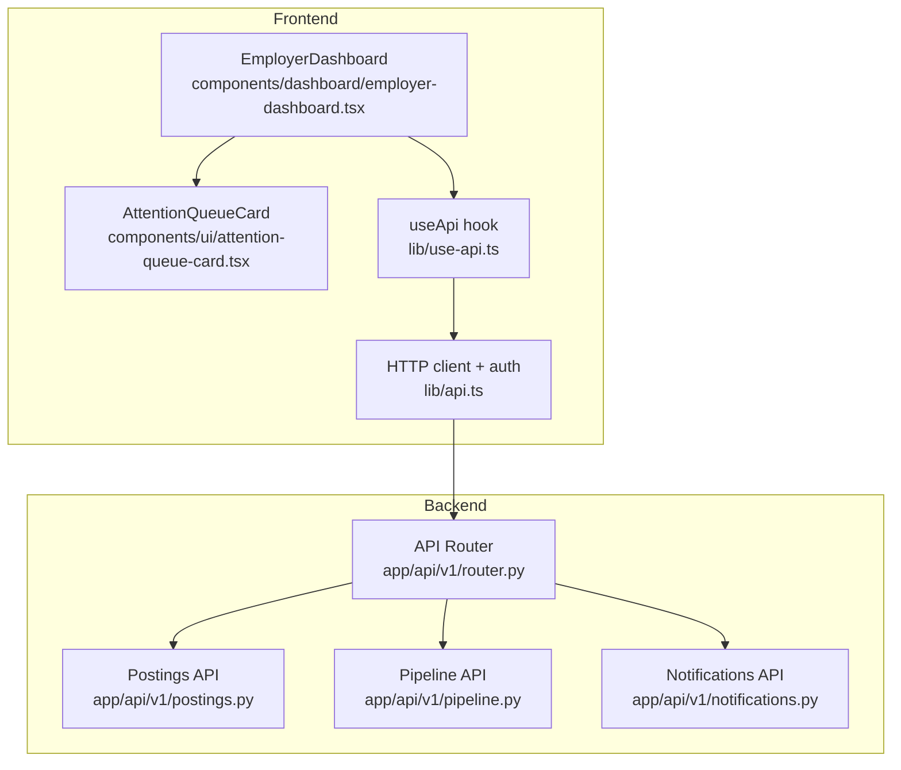
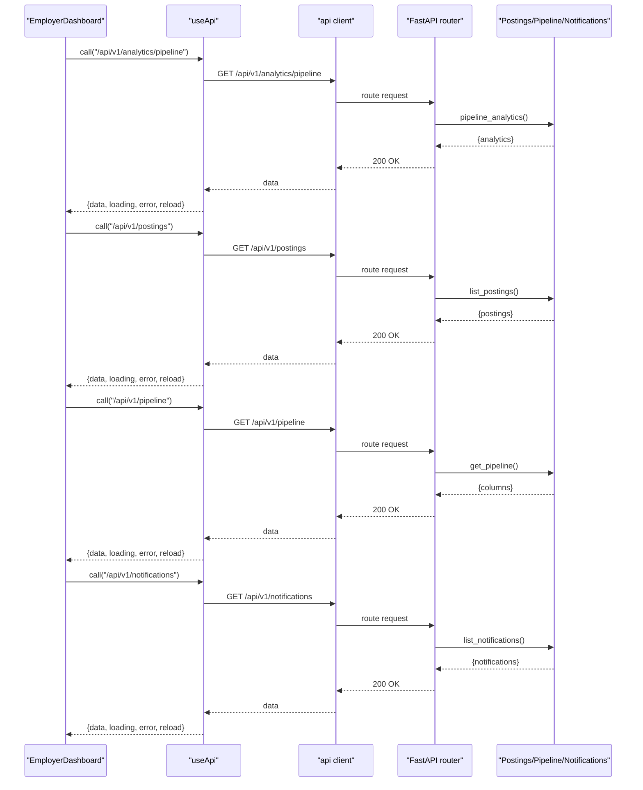
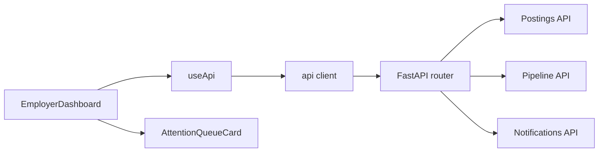

# Dashboard Overview & Analytics

<cite>
**Referenced Files in This Document**
- [employer-dashboard.tsx](file://Frontend/components/dashboard/employer-dashboard.tsx)
- [attention-queue-card.tsx](file://Frontend/components/ui/attention-queue-card.tsx)
- [use-api.ts](file://Frontend/lib/use-api.ts)
- [api.ts](file://Frontend/lib/api.ts)
- [types.ts](file://Frontend/lib/types.ts)
- [router.py](file://Backend/app/api/v1/router.py)
- [postings.py](file://Backend/app/api/v1/postings.py)
- [pipeline.py](file://Backend/app/api/v1/pipeline.py)
- [notifications.py](file://Backend/app/api/v1/notifications.py)
</cite>

## Table of Contents
1. [Introduction](#introduction)
2. [Project Structure](#project-structure)
3. [Core Components](#core-components)
4. [Architecture Overview](#architecture-overview)
5. [Detailed Component Analysis](#detailed-component-analysis)
6. [Dependency Analysis](#dependency-analysis)
7. [Performance Considerations](#performance-considerations)
8. [Troubleshooting Guide](#troubleshooting-guide)
9. [Conclusion](#conclusion)
10. [Appendices](#appendices)

## Introduction
This document explains the employer dashboard overview and analytics components, focusing on:
- Attention queue that highlights priority work items (new applications, interviews to score, candidates in flight).
- Active requisitions table showing job postings with status, candidate counts, and question pool configuration.
- Recent activity feed for real-time notifications and updates.
- Next actions panel providing contextual guidance for immediate tasks.
- Data fetching patterns using the useApi hook, error handling strategies, and loading states.
- Examples for customizing dashboard metrics and adding new analytics widgets.

## Project Structure
The employer dashboard is a client-side React component that composes several UI sections and fetches data from backend APIs via a shared HTTP client and a lightweight data-fetching hook.

**Diagram sources**
- [employer-dashboard.tsx:18-22](file://Frontend/components/dashboard/employer-dashboard.tsx#L18-L22)
- [use-api.ts:6-32](file://Frontend/lib/use-api.ts#L6-L32)
- [api.ts:59-104](file://Frontend/lib/api.ts#L59-L104)
- [router.py:26-40](file://Backend/app/api/v1/router.py#L26-L40)
- [postings.py:48-55](file://Backend/app/api/v1/postings.py#L48-L55)
- [pipeline.py:155-201](file://Backend/app/api/v1/pipeline.py#L155-L201)
- [notifications.py:11-17](file://Backend/app/api/v1/notifications.py#L11-L17)

**Section sources**
- [employer-dashboard.tsx:18-22](file://Frontend/components/dashboard/employer-dashboard.tsx#L18-L22)
- [router.py:26-40](file://Backend/app/api/v1/router.py#L26-L40)

## Core Components
- EmployerDashboard orchestrates four data streams:
  - Pipeline columns to compute attention metrics (new applications, interviews to score).
  - Postings list for active requisitions.
  - Notifications for recent activity.
  - Analytics for hiring overview metrics (in-flight, hired, rejected, total applications).
- AttentionQueueCard renders each priority item with count, title, detail, action label, tone, and link.
- useApi provides data, loading, error, and reload capabilities for any endpoint path.
- api encapsulates authenticated requests, token refresh on 401, and standardized ApiError propagation.

Key responsibilities:
- Compute attention metrics from pipeline columns and analytics.
- Render active requisitions with status pills and question pool state.
- Display recent notifications with optional links.
- Provide next actions based on computed counts.

**Section sources**
- [employer-dashboard.tsx:18-83](file://Frontend/components/dashboard/employer-dashboard.tsx#L18-L83)
- [attention-queue-card.tsx:5-35](file://Frontend/components/ui/attention-queue-card.tsx#L5-L35)
- [use-api.ts:6-32](file://Frontend/lib/use-api.ts#L6-L32)
- [api.ts:12-21](file://Frontend/lib/api.ts#L12-L21)

## Architecture Overview
The dashboard uses a simple client-server architecture:
- The frontend calls three primary endpoints: /api/v1/analytics/pipeline, /api/v1/postings, /api/v1/pipeline, and /api/v1/notifications.
- The backend aggregates tenant-scoped data and returns structured responses consumed by the dashboard.

**Diagram sources**
- [employer-dashboard.tsx:18-22](file://Frontend/components/dashboard/employer-dashboard.tsx#L18-L22)
- [use-api.ts:11-30](file://Frontend/lib/use-api.ts#L11-L30)
- [api.ts:59-104](file://Frontend/lib/api.ts#L59-L104)
- [pipeline.py:676-702](file://Backend/app/api/v1/pipeline.py#L676-L702)
- [postings.py:48-55](file://Backend/app/api/v1/postings.py#L48-L55)
- [notifications.py:11-17](file://Backend/app/api/v1/notifications.py#L11-L17)

## Detailed Component Analysis

### Attention Queue System
Purpose:
- Surface priority work items:
  - New applications to review: derived from pipeline columns categorized as “new”.
  - Interviews to score: derived from cards where applied_interview_status equals “evaluated”.
  - Candidates in flight: derived from analytics.in_flight; also shows hired/rejected totals and total applications.

Implementation details:
- Fetch pipeline columns and analytics concurrently.
- Compute newCount by summing cards in columns with category “new”.
- Compute interviewsToScore by counting cards with evaluated interview status.
- Use stats.in_flight, stats.hired, stats.rejected, stats.total_applications for summary text.

Rendering:
- Each item is an AttentionQueueCard with count, title, detail, action, tone, and href.

Customization examples:
- Add a new attention metric by computing a new count from pipeline columns or analytics and rendering another AttentionQueueCard.
- Change tones to reflect severity (e.g., danger for exceptions).

**Section sources**
- [employer-dashboard.tsx:24-83](file://Frontend/components/dashboard/employer-dashboard.tsx#L24-L83)
- [attention-queue-card.tsx:5-35](file://Frontend/components/ui/attention-queue-card.tsx#L5-L35)
- [pipeline.py:155-201](file://Backend/app/api/v1/pipeline.py#L155-L201)
- [pipeline.py:676-702](file://Backend/app/api/v1/pipeline.py#L676-L702)

### Active Requisitions Table
Purpose:
- Show all employer’s postings with application counts, status, and question pool configuration.

Data source:
- GET /api/v1/postings returns postings enriched with application_count per posting.

Table fields:
- Requisition: title and location.
- Candidates: application_count.
- Status: draft, published, closed mapped to pill tones.
- Question pool: pool_status (not_generated, generated, curated, locked) mapped to pill tone.
- Next action: link to manage or finish setup depending on status.

Question pool lifecycle:
- Generate: create a pool from the pinned domain pack.
- Curate: edit questions while not locked.
- Lock: finalize pool; required before publishing.
- Publish: only allowed when pool is locked.

Customization examples:
- Add a column for workflow snapshot version or pack metadata.
- Integrate a quick action to generate or lock the question pool directly from the row.

**Section sources**
- [employer-dashboard.tsx:86-140](file://Frontend/components/dashboard/employer-dashboard.tsx#L86-L140)
- [postings.py:25-55](file://Backend/app/api/v1/postings.py#L25-L55)
- [postings.py:394-566](file://Backend/app/api/v1/postings.py#L394-L566)
- [types.ts:1-18](file://Frontend/lib/types.ts#L1-L18)

### Recent Activity Feed
Purpose:
- Display recent notifications for the current user.

Data source:
- GET /api/v1/notifications returns notifications and unread_count.

Behavior:
- Shows up to six most recent items with title, body, and optional link.
- Displays empty state when no notifications exist.
- Supports retry on error via reload.

Customization examples:
- Add filtering by read/unread or categories.
- Add inline mark-as-read actions.

**Section sources**
- [employer-dashboard.tsx:142-167](file://Frontend/components/dashboard/employer-dashboard.tsx#L142-L167)
- [notifications.py:11-26](file://Backend/app/api/v1/notifications.py#L11-L26)

### Next Actions Panel
Purpose:
- Provide contextual guidance for immediate tasks based on attention metrics.

Behavior:
- Lists prioritized actions such as reviewing new applications, scoring submitted interviews, and joining live interview rooms.
- Links navigate to relevant pages (e.g., pipeline, interviews).

Customization examples:
- Dynamically add or reorder actions based on role or organization settings.
- Include time-bound hints (e.g., SLA warnings) by integrating additional metrics.

**Section sources**
- [employer-dashboard.tsx:169-188](file://Frontend/components/dashboard/employer-dashboard.tsx#L169-L188)

### Data Fetching Patterns with useApi
- useApi(path):
  - Manages local state: data, error, loading.
  - Calls api.get(path) on mount and exposes reload().
  - Wraps errors into ApiError for consistent handling.
- api client:
  - Adds Authorization header from session.
  - Handles 401 by refreshing access token once and retrying the request.
  - Normalizes non-OK responses into ApiError with code and message.

Usage in dashboard:
- Four parallel calls: analytics, postings, pipeline, notifications.
- Each section renders loading, error, or content based on hook state.

**Section sources**
- [use-api.ts:6-32](file://Frontend/lib/use-api.ts#L6-L32)
- [api.ts:59-104](file://Frontend/lib/api.ts#L59-L104)
- [employer-dashboard.tsx:18-22](file://Frontend/components/dashboard/employer-dashboard.tsx#L18-L22)

### Error Handling Strategies
- Network errors: caught and converted to ApiError with a descriptive message.
- Authentication failures: automatic token refresh; if refresh fails, session cleared and error surfaced.
- Business validation errors: returned as ApiError with codes like invalid_transition, question_pool_locked, posting_not_draft.
- UI-level handling:
  - ErrorState displays message and offers retry via reload.
  - LoadingState shown during initial load.
  - EmptyState for empty datasets.

**Section sources**
- [api.ts:12-21](file://Frontend/lib/api.ts#L12-L21)
- [api.ts:86-101](file://Frontend/lib/api.ts#L86-L101)
- [employer-dashboard.tsx:51-53](file://Frontend/components/dashboard/employer-dashboard.tsx#L51-L53)
- [employer-dashboard.tsx:91-95](file://Frontend/components/dashboard/employer-dashboard.tsx#L91-L95)
- [employer-dashboard.tsx:147-151](file://Frontend/components/dashboard/employer-dashboard.tsx#L147-L151)

### Customizing Dashboard Metrics and Adding Widgets
Examples:
- Add a widget for automation exceptions:
  - Compute from pipeline cards or analytics flags.
  - Render an AttentionQueueCard with tone “danger”.
- Add a widget for average time-to-hire:
  - Extend analytics endpoint to include duration metrics.
  - Display in a new panel with trend indicators.
- Add a widget for question pool coverage:
  - Show percentage of postings with locked pools.
  - Link to postings page filtered by pool_status.

Guidelines:
- Keep each widget self-contained and data-driven.
- Use consistent pill tones for statuses.
- Ensure accessibility with aria labels and semantic headings.

[No sources needed since this section provides general guidance]

## Dependency Analysis
Component and module relationships:

Coupling and cohesion:
- EmployerDashboard depends on three backend modules but remains cohesive by delegating data fetching to useApi.
- api client centralizes authentication and error handling, reducing duplication across hooks.
- Backend routers are loosely coupled; each feature has its own router file included centrally.

Potential circular dependencies:
- None observed between frontend modules; useApi is leaf dependency.

External dependencies:
- FastAPI routes aggregate tenant-scoped data via store functions (not shown here).
- Email and matching services are invoked within pipeline transitions and posting publish flows.

**Diagram sources**
- [employer-dashboard.tsx:18-22](file://Frontend/components/dashboard/employer-dashboard.tsx#L18-L22)
- [use-api.ts:6-32](file://Frontend/lib/use-api.ts#L6-L32)
- [api.ts:59-104](file://Frontend/lib/api.ts#L59-L104)
- [router.py:26-40](file://Backend/app/api/v1/router.py#L26-L40)
- [postings.py:48-55](file://Backend/app/api/v1/postings.py#L48-L55)
- [pipeline.py:155-201](file://Backend/app/api/v1/pipeline.py#L155-L201)
- [notifications.py:11-17](file://Backend/app/api/v1/notifications.py#L11-L17)

**Section sources**
- [router.py:26-40](file://Backend/app/api/v1/router.py#L26-L40)

## Performance Considerations
- Parallel data fetching:
  - The dashboard initiates multiple useApi calls concurrently to minimize perceived latency.
- Minimal re-renders:
  - Each hook manages its own state; avoid unnecessary recomputation by memoizing derived values if needed.
- Backend aggregation:
  - Endpoints return pre-aggregated structures (e.g., columns, analytics) to reduce client-side processing.
- Token refresh coalescing:
  - The api client ensures only one refresh runs at a time to avoid redundant network calls.

[No sources needed since this section provides general guidance]

## Troubleshooting Guide
Common issues and resolutions:
- Endpoint unreachable:
  - Symptom: ApiError with code “network_unreachable”.
  - Action: Ensure backend is running and reachable; verify NEXT_PUBLIC_API_URL.
- Unauthorized or expired token:
  - Symptom: 401 followed by refresh attempt.
  - Action: Confirm refresh token exists; if refresh fails, log back in.
- Invalid transition or stage conflict:
  - Symptom: 409 with “application_stage_conflict”.
  - Action: Refresh the pipeline view and retry the action.
- Question pool not ready:
  - Symptom: 422 with “question_pool_not_locked” or “domain_pack_required”.
  - Action: Generate and curate the question pool, then lock it before publishing.

**Section sources**
- [api.ts:78-101](file://Frontend/lib/api.ts#L78-L101)
- [pipeline.py:306-324](file://Backend/app/api/v1/pipeline.py#L306-L324)
- [postings.py:249-260](file://Backend/app/api/v1/postings.py#L249-L260)
- [postings.py:411-416](file://Backend/app/api/v1/postings.py#L411-L416)

## Conclusion
The employer dashboard provides a focused, actionable overview of hiring operations through:
- An attention queue that surfaces priority work items.
- An active requisitions table with clear status and question pool context.
- A recent activity feed for timely updates.
- A next actions panel guiding immediate tasks.
Robust data fetching via useApi and centralized error handling ensure reliability, while modular components make it straightforward to extend metrics and add new analytics widgets.

[No sources needed since this section summarizes without analyzing specific files]

## Appendices

### API Contracts Referenced by the Dashboard
- GET /api/v1/analytics/pipeline
  - Returns analytics object including total_postings, published_postings, total_applications, applications_by_category, hired, rejected, in_flight.
- GET /api/v1/postings
  - Returns postings array with application_count and pool_status.
- GET /api/v1/pipeline
  - Returns columns array with stage metadata and cards.
- GET /api/v1/notifications
  - Returns notifications array and unread_count.

**Section sources**
- [pipeline.py:676-702](file://Backend/app/api/v1/pipeline.py#L676-L702)
- [postings.py:48-55](file://Backend/app/api/v1/postings.py#L48-L55)
- [pipeline.py:155-201](file://Backend/app/api/v1/pipeline.py#L155-L201)
- [notifications.py:11-17](file://Backend/app/api/v1/notifications.py#L11-L17)