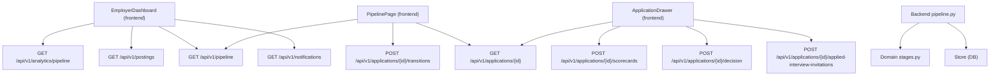
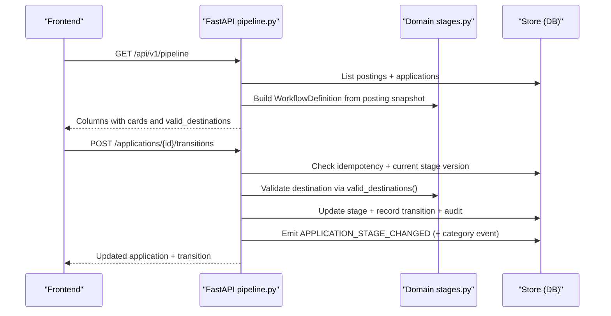
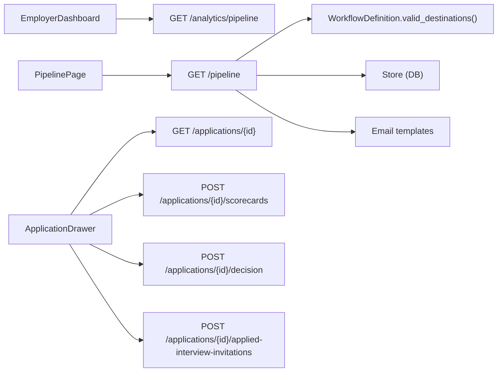

# Employer Dashboard & Pipeline Management

<cite>
**Referenced Files in This Document**
- [pipeline/page.tsx](file://Frontend/app/pipeline/page.tsx)
- [employer-dashboard.tsx](file://Frontend/components/dashboard/employer-dashboard.tsx)
- [dashboard-shell.tsx](file://Frontend/components/dashboard/dashboard-shell.tsx)
- [pipeline-page.tsx](file://Frontend/components/pipeline/pipeline-page.tsx)
- [application-drawer.tsx](file://Frontend/components/pipeline/application-drawer.tsx)
- [types.ts](file://Frontend/lib/types.ts)
- [pipeline.py](file://Backend/app/api/v1/pipeline.py)
- [workflows.py](file://Backend/app/api/v1/workflows.py)
- [stages.py](file://Backend/app/domain/stages.py)
- [notifications.py](file://Backend/app/api/v1/notifications.py)
- [store.py](file://Backend/app/db/store.py)
</cite>

## Table of Contents
1. [Introduction](#introduction)
2. [Project Structure](#project-structure)
3. [Core Components](#core-components)
4. [Architecture Overview](#architecture-overview)
5. [Detailed Component Analysis](#detailed-component-analysis)
6. [Dependency Analysis](#dependency-analysis)
7. [Performance Considerations](#performance-considerations)
8. [Troubleshooting Guide](#troubleshooting-guide)
9. [Conclusion](#conclusion)
10. [Appendices](#appendices)

## Introduction
This document explains the employer-facing dashboard and pipeline management features, including:
- Dashboard layout, key metrics, and quick action panels
- Kanban-style pipeline with candidate progression, status updates, and interview scheduling
- Application drawer for viewing candidate details and managing hiring workflows
- Real-time collaboration and notification systems
- Reporting capabilities available to employers
- Guidance on implementing custom pipeline stages and workflow automation using the provided components

The system is designed around a server-enforced workflow model that guarantees valid transitions, auditability, and consistent candidate-facing statuses.

## Project Structure
The employer workspace is built as a Next.js frontend with a FastAPI backend. The dashboard and pipeline are protected by authentication and tenant scoping.

**Diagram sources**
- [employer-dashboard.tsx:18-23](file://Frontend/components/dashboard/employer-dashboard.tsx#L18-L23)
- [pipeline-page.tsx:105-120](file://Frontend/components/pipeline/pipeline-page.tsx#L105-L120)
- [application-drawer.tsx:155-192](file://Frontend/components/pipeline/application-drawer.tsx#L155-L192)
- [pipeline.py:155-201](file://Backend/app/api/v1/pipeline.py#L155-L201)
- [pipeline.py:277-514](file://Backend/app/api/v1/pipeline.py#L277-L514)
- [pipeline.py:521-614](file://Backend/app/api/v1/pipeline.py#L521-L614)
- [pipeline.py:623-673](file://Backend/app/api/v1/pipeline.py#L623-L673)
- [pipeline.py:713-765](file://Backend/app/api/v1/pipeline.py#L713-L765)

**Section sources**
- [dashboard-shell.tsx:12-18](file://Frontend/components/dashboard/dashboard-shell.tsx#L12-L18)
- [pipeline/page.tsx:9-17](file://Frontend/app/pipeline/page.tsx#L9-L17)

## Core Components
- Employer Dashboard: Displays attention queue cards, active requisitions table, recent activity feed, and next actions panel. It aggregates analytics, postings, pipeline columns, and notifications.
- Pipeline Page: Provides kanban board and list views of candidates across stages, supports filtering by job, moving candidates between stages, and opening the application drawer.
- Application Drawer: Shows detailed candidate profile snapshot, applied interview status and evaluation, reviewer scorecards, stage history, and actions like inviting to interview or sending decisions.

Key data models used by these components include Posting, WorkflowSnapshot, PipelineCard, PipelineColumn, Evaluation, ApplicationDetail, Notification, and Analytics.

**Section sources**
- [employer-dashboard.tsx:18-193](file://Frontend/components/dashboard/employer-dashboard.tsx#L18-L193)
- [pipeline-page.tsx:105-329](file://Frontend/components/pipeline/pipeline-page.tsx#L105-L329)
- [application-drawer.tsx:155-372](file://Frontend/components/pipeline/application-drawer.tsx#L155-L372)
- [types.ts:1-267](file://Frontend/lib/types.ts#L1-L267)

## Architecture Overview
The pipeline enforces a server-defined workflow composed of fixed anchors and optional components. Transitions are validated against the published workflow, recorded with an audit trail, and emit events. Candidate-facing statuses are mapped from stage categories to ensure consistency.

**Diagram sources**
- [pipeline.py:155-201](file://Backend/app/api/v1/pipeline.py#L155-L201)
- [pipeline.py:277-514](file://Backend/app/api/v1/pipeline.py#L277-L514)
- [stages.py:196-242](file://Backend/app/domain/stages.py#L196-L242)

## Detailed Component Analysis

### Employer Dashboard Layout and Metrics
- Attention Queue: Cards surface new applications to review, interviews to score, and candidates in flight. Counts derive from pipeline columns and analytics.
- Active Requisitions: Table lists jobs with application counts, status pills, question pool status, and next actions.
- Recent Activity: Notifications feed shows latest updates with links.
- Next Actions: Prioritized tasks link directly to pipeline and interview rooms.

Data sources:
- Analytics endpoint provides totals and in-flight counts.
- Postings endpoint lists active requisitions.
- Pipeline endpoint supplies column-based counts for attention queue.
- Notifications endpoint lists recent activity.

**Section sources**
- [employer-dashboard.tsx:18-193](file://Frontend/components/dashboard/employer-dashboard.tsx#L18-L193)
- [pipeline.py:676-702](file://Backend/app/api/v1/pipeline.py#L676-L702)
- [notifications.py:11-27](file://Backend/app/api/v1/notifications.py#L11-L27)

### Pipeline Interface: Kanban Board and List View
- Board view: Columns represent non-terminal stages; cards show candidate name, job title, stage position, scores, interview status, and move menu. Drag-and-drop is supported to initiate moves when allowed.
- List view: Same data in tabular form with identical move actions.
- Filtering: Filter by job via query parameter.
- Move flow: Selecting a destination opens a dialog requiring reason when configured; submission calls the transition endpoint with idempotency key and refreshes the board.

Validation and safety:
- Valid destinations are computed server-side per workflow.
- Optimistic concurrency uses stage_version to prevent lost updates.
- Errors include conflict handling and user-friendly messages.

**Section sources**
- [pipeline-page.tsx:105-329](file://Frontend/components/pipeline/pipeline-page.tsx#L105-L329)
- [pipeline.py:277-514](file://Backend/app/api/v1/pipeline.py#L277-L514)
- [stages.py:196-242](file://Backend/app/domain/stages.py#L196-L242)

### Application Drawer: Candidate Details and Hiring Workflow
- Profile Snapshot: Headline, summary, skills, credentials captured at application time.
- Applied Interview: Status, identity verification, AI evaluation with dimension scores and evidence.
- Reviewer Scorecards: Create and view scorecards with recommendation and notes.
- Stage History: Audit trail of moves with actor, timestamps, reasons, and notes.
- Actions: Invite to applied interview, send company decision emails, save scorecards.

Interview invitation requires a locked question pool; decisions trigger templated emails based on acceptance/rejection keywords.

**Section sources**
- [application-drawer.tsx:155-372](file://Frontend/components/pipeline/application-drawer.tsx#L155-L372)
- [pipeline.py:204-266](file://Backend/app/api/v1/pipeline.py#L204-L266)
- [pipeline.py:521-614](file://Backend/app/api/v1/pipeline.py#L521-L614)
- [pipeline.py:623-673](file://Backend/app/api/v1/pipeline.py#L623-L673)
- [pipeline.py:713-765](file://Backend/app/api/v1/pipeline.py#L713-L765)

### Real-Time Collaboration and Notifications
- Notifications: The dashboard fetches recent notifications and unread counts. Notifications are created during stage changes and interview invitations.
- Events: Backend emits outbox events on stage transitions and interview invitations. These can be consumed by real-time clients to update dashboards without polling.
- WebSocket infrastructure exists in the codebase for live features (e.g., voice interviews). While not wired into every UI component here, it provides a foundation for live updates.

Operational note: For fully real-time dashboards, connect frontend listeners to the emitted events and push updates to relevant tenants/users.

**Section sources**
- [pipeline.py:370-390](file://Backend/app/api/v1/pipeline.py#L370-L390)
- [pipeline.py:583-604](file://Backend/app/api/v1/pipeline.py#L583-L604)
- [notifications.py:11-27](file://Backend/app/api/v1/notifications.py#L11-L27)

### Reporting Capabilities
- Pipeline analytics: Aggregates total postings, published postings, total applications, applications by category, hired/rejected counts, and in-flight candidates.
- Dashboard integration: The employer dashboard surfaces in-flight counts and highlights items needing attention.
- Extensibility: Additional reporting endpoints can be added following the same pattern to expose deeper insights.

**Section sources**
- [pipeline.py:676-702](file://Backend/app/api/v1/pipeline.py#L676-L702)
- [employer-dashboard.tsx:18-83](file://Frontend/components/dashboard/employer-dashboard.tsx#L18-L83)

### Implementing Custom Pipeline Stages and Workflow Automation
- Custom stages are not allowed. Workflows must be assembled from fixed anchors plus catalog components. This ensures compliance, auditability, and predictable behavior.
- To configure your pipeline:
  - Retrieve available components and fixed stages via the workflows endpoints.
  - Choose which optional components to enable (e.g., Screening, Shortlisting, AI Interview, Offer).
  - Publish the workflow; each job stores a snapshot of the workflow at publish time.
  - Transitions are enforced by the domain logic; invalid moves are rejected.

Automation opportunities:
- Automatic AI match scoring and interview invitations when entering review stage.
- Backgrounded JD matching updates.
- Email notifications on stage changes and decisions.
- Event emission for downstream integrations.

**Section sources**
- [workflows.py:19-40](file://Backend/app/api/v1/workflows.py#L19-L40)
- [workflows.py:60-122](file://Backend/app/api/v1/workflows.py#L60-L122)
- [stages.py:55-106](file://Backend/app/domain/stages.py#L55-L106)
- [stages.py:138-175](file://Backend/app/domain/stages.py#L138-L175)
- [stages.py:245-286](file://Backend/app/domain/stages.py#L245-L286)
- [pipeline.py:392-463](file://Backend/app/api/v1/pipeline.py#L392-L463)

## Dependency Analysis
The frontend depends on typed models and API hooks to render dashboard and pipeline views. The backend composes domain rules, store operations, and services to enforce policy and persist state.

**Diagram sources**
- [employer-dashboard.tsx:18-23](file://Frontend/components/dashboard/employer-dashboard.tsx#L18-L23)
- [pipeline-page.tsx:105-120](file://Frontend/components/pipeline/pipeline-page.tsx#L105-L120)
- [application-drawer.tsx:155-192](file://Frontend/components/pipeline/application-drawer.tsx#L155-L192)
- [pipeline.py:155-201](file://Backend/app/api/v1/pipeline.py#L155-L201)
- [pipeline.py:277-514](file://Backend/app/api/v1/pipeline.py#L277-L514)
- [pipeline.py:521-614](file://Backend/app/api/v1/pipeline.py#L521-L614)
- [pipeline.py:623-673](file://Backend/app/api/v1/pipeline.py#L623-L673)
- [pipeline.py:713-765](file://Backend/app/api/v1/pipeline.py#L713-L765)
- [stages.py:196-242](file://Backend/app/domain/stages.py#L196-L242)

**Section sources**
- [types.ts:57-144](file://Frontend/lib/types.ts#L57-L144)
- [pipeline.py:155-201](file://Backend/app/api/v1/pipeline.py#L155-L201)

## Performance Considerations
- Use idempotency keys for transitions and invitations to avoid duplicate work and handle retries safely.
- Prefer list views for bulk operations when dealing with large pipelines; board view is optimized for small-to-medium sets.
- Cache or debounce frequent reloads after transitions to reduce load spikes.
- Offload heavy background tasks (e.g., JD matching, email sending) to async workers where possible.
- Ensure database queries are scoped to tenant_id to minimize result sets.

[No sources needed since this section provides general guidance]

## Troubleshooting Guide
Common issues and resolutions:
- Invalid transition: Occurs when destination is not allowed by workflow. Fix by selecting a valid stage or enabling required components in the workflow.
- Reason required: Some stages require a reason code. Provide a reason before moving.
- Stage conflict: Indicates concurrent edits. Refresh the page and retry the move.
- Question pool not locked: Inviting to an applied interview requires a locked question pool. Lock the pool before inviting.
- Duplicate scorecard: Each reviewer can submit one scorecard per application. Edit existing if necessary.
- Avatar not found: Candidate has no profile photo on file.

Relevant error codes and behaviors are enforced in the backend and surfaced to the UI.

**Section sources**
- [pipeline.py:306-333](file://Backend/app/api/v1/pipeline.py#L306-L333)
- [pipeline.py:547-555](file://Backend/app/api/v1/pipeline.py#L547-L555)
- [pipeline.py:636-651](file://Backend/app/api/v1/pipeline.py#L636-L651)
- [pipeline.py:768-792](file://Backend/app/api/v1/pipeline.py#L768-L792)

## Conclusion
The employer dashboard and pipeline provide a robust, auditable hiring workflow with strong validation, clear candidate-facing statuses, and actionable insights. Employers can manage candidate progression through a governed pipeline, schedule interviews, evaluate candidates, and communicate decisions—all while maintaining compliance and traceability. Workflow customization is achieved through approved components rather than ad-hoc stages, ensuring consistency and reliability.

[No sources needed since this section summarizes without analyzing specific files]

## Appendices

### Data Models Summary
- Posting: Job metadata, status, question pool, workflow snapshot.
- WorkflowSnapshot: Stages and candidate status mapping.
- PipelineCard: Candidate card with stage info, scores, and valid destinations.
- ApplicationDetail: Full application context including profile snapshot, interview evaluation, scorecards, and transitions.
- Notification: User-facing updates with read status and links.

**Section sources**
- [types.ts:1-267](file://Frontend/lib/types.ts#L1-L267)