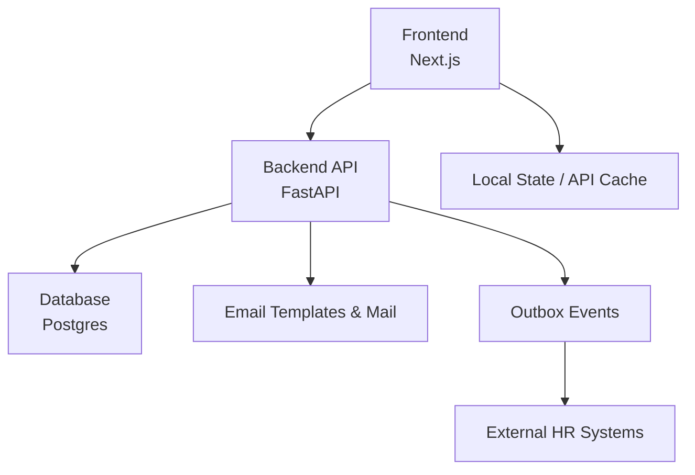
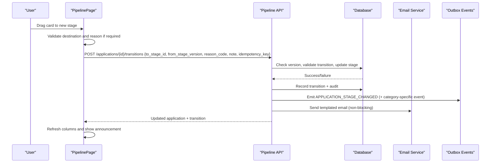
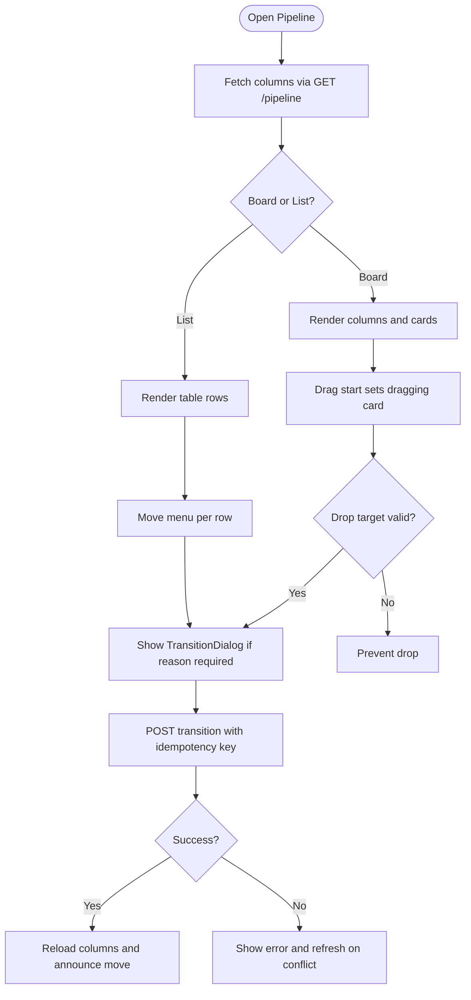
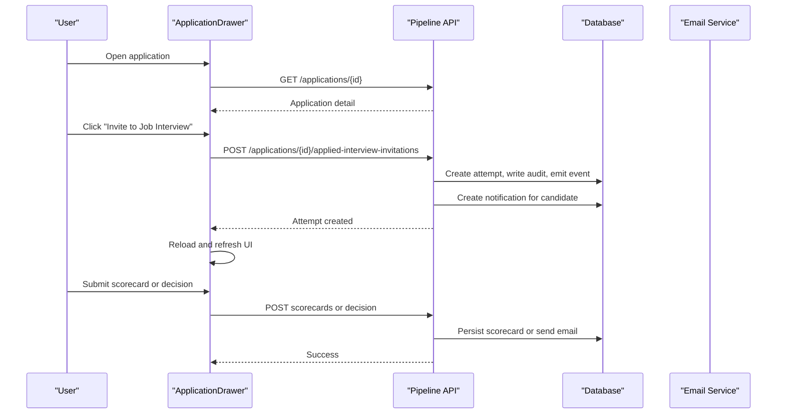
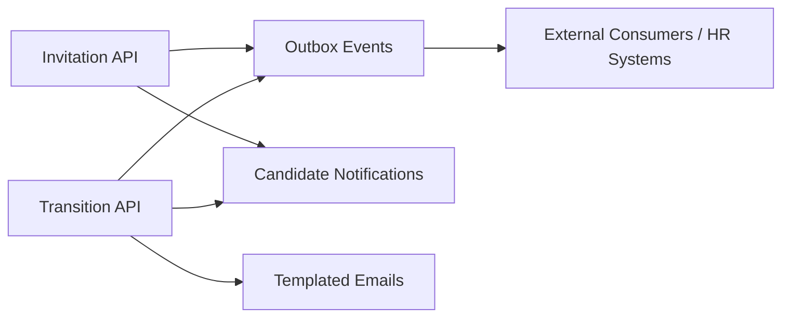
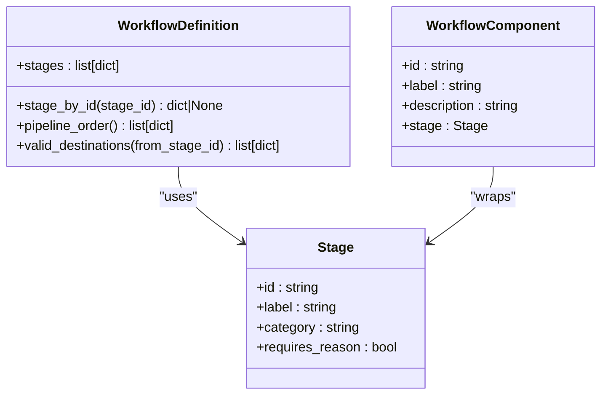
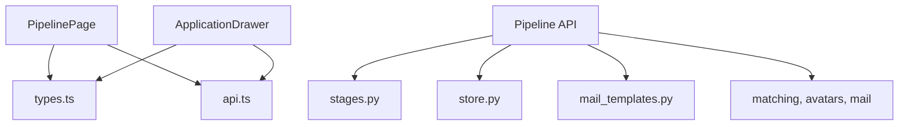

# Pipeline Management Interface

<cite>
**Referenced Files in This Document**
- [pipeline page](file://Frontend/app/pipeline/page.tsx)
- [PipelinePage component](file://Frontend/components/pipeline/pipeline-page.tsx)
- [ApplicationDrawer component](file://Frontend/components/pipeline/application-drawer.tsx)
- [Pipeline API](file://Backend/app/api/v1/pipeline.py)
- [Workflow stages model](file://Backend/app/domain/stages.py)
- [Types and models](file://Frontend/lib/types.ts)
- [API client utilities](file://Frontend/lib/api.ts)
- [Notifications API](file://Backend/app/api/v1/notifications.py)
- [Email templates service](file://Backend/app/services/mail_templates.py)
- [Store helpers (outbox, idempotency)](file://Backend/app/db/store.py)
</cite>

## Table of Contents
1. Introduction
2. Project Structure
3. Core Components
4. Architecture Overview
5. Detailed Component Analysis
6. Dependency Analysis
7. Performance Considerations
8. Troubleshooting Guide
9. Conclusion
10. Appendices

## Introduction
This document explains the pipeline management interface and kanban-style candidate progression system. It covers the main pipeline page layout, column-based organization by hiring stages, drag-and-drop movement between stages, the application drawer for detailed candidate information and actions, real-time collaboration signals via events and notifications, and the backend APIs that enforce workflow rules and persist state changes. It also provides guidance on configuring pipeline stages and integrating with external HR systems through events and email templates.

## Project Structure
The pipeline feature spans a Next.js frontend and a FastAPI backend:
- Frontend:
  - Page entry renders the dashboard shell and loads the PipelinePage.
  - PipelinePage implements the kanban board and list view, handles drag-and-drop, transitions, and opens the ApplicationDrawer.
  - ApplicationDrawer shows candidate details, interview status, scorecards, stage history, and action buttons to invite interviews or send decisions.
- Backend:
  - Pipeline API exposes endpoints to fetch pipeline columns, transition applications, invite applied interviews, create scorecards, and serve candidate avatars.
  - Workflow stages are defined by a domain model that enforces valid transitions, required reasons, and terminal states.
  - Notifications and emails are created and sent as side effects of transitions and invitations.
  - Outbox events are emitted for downstream consumers to react to state changes.

**Diagram sources**
- [Pipeline API:155-201](file://Backend/app/api/v1/pipeline.py#L155-L201)
- [Store helpers:248-276](file://Backend/app/db/store.py#L248-L276)
- [Email templates service:118-137](file://Backend/app/services/mail_templates.py#L118-L137)

**Section sources**
- [pipeline page:1-18](file://Frontend/app/pipeline/page.tsx#L1-L18)
- [PipelinePage component:105-329](file://Frontend/components/pipeline/pipeline-page.tsx#L105-L329)
- [ApplicationDrawer component:155-372](file://Frontend/components/pipeline/application-drawer.tsx#L155-L372)
- [Pipeline API:155-793](file://Backend/app/api/v1/pipeline.py#L155-L793)
- [Workflow stages model:1-300](file://Backend/app/domain/stages.py#L1-L300)

## Core Components
- Pipeline page:
  - Displays a kanban board grouped by workflow stages and a list view.
  - Supports filtering by job posting and switching views.
  - Implements drag-and-drop to move candidates between stages using a transition dialog when required.
- Application drawer:
  - Shows profile snapshot, AI match reasoning, interview status, identity verification, evaluation results, reviewer scorecards, and stage history.
  - Provides actions to invite to an Applied Interview, submit scorecards, and send company decisions.
- Backend pipeline API:
  - GET /api/v1/pipeline returns columns and cards with valid destinations based on workflow rules.
  - POST /api/v1/applications/{id}/transitions performs validated stage transitions with optimistic concurrency, audit logging, outbox events, and optional automated actions.
  - POST /api/v1/applications/{id}/applied-interview-invitations creates an interview attempt from a locked question pool.
  - POST /api/v1/applications/{id}/scorecards records reviewer evaluations.
  - GET /api/v1/applications/{id} returns full application detail including interview and transitions.
  - GET /api/v1/applications/{id}/candidate-avatar serves the candidate’s avatar.

**Section sources**
- [Pipeline API:155-793](file://Backend/app/api/v1/pipeline.py#L155-L793)
- [PipelinePage component:105-329](file://Frontend/components/pipeline/pipeline-page.tsx#L105-L329)
- [ApplicationDrawer component:155-372](file://Frontend/components/pipeline/application-drawer.tsx#L155-L372)

## Architecture Overview
The pipeline uses a server-enforced workflow model to validate moves, record audits, emit events, and notify candidates. The frontend orchestrates user interactions and updates local UI state after successful API calls.

**Diagram sources**
- [Pipeline API:277-514](file://Backend/app/api/v1/pipeline.py#L277-L514)
- [Store helpers:248-276](file://Backend/app/db/store.py#L248-L276)
- [Email templates service:118-137](file://Backend/app/services/mail_templates.py#L118-L137)

## Detailed Component Analysis

### Pipeline Page Layout and Kanban Board
- Columns are derived from the workflow snapshot attached to each posting. Each column represents a non-terminal stage; terminal stages like hired/rejected are excluded from the board.
- Cards display candidate name, job title, current stage position, skill/interview scores, and interview status pills.
- Drag-and-drop:
  - A card is draggable only if it has valid destinations.
  - Drop targets are validated against the card’s valid_destinations before allowing a drop.
  - On drop, a transition dialog appears if the destination requires a reason.
- View toggle:
  - Board view shows columns; List view shows all cards in a table with the same Move menu.
- Filtering:
  - Optional query parameter filters pipeline data by posting_id.

**Diagram sources**
- [PipelinePage component:105-329](file://Frontend/components/pipeline/pipeline-page.tsx#L105-L329)
- [Pipeline API:155-201](file://Backend/app/api/v1/pipeline.py#L155-L201)

**Section sources**
- [PipelinePage component:105-329](file://Frontend/components/pipeline/pipeline-page.tsx#L105-L329)

### Application Drawer
- Loads application detail including profile snapshot, answers, applied interview status, evaluation, identity verification, scorecards, and transitions.
- Actions:
  - Invite to Applied Interview: posts to create an attempt from a locked question pool and creates a notification for the candidate.
  - Save scorecard: validates scores and recommendation, persists reviewer input, and writes audit.
  - Company decision: sends templated acceptance/rejection or generic stage update email.
- Keyboard support: Escape closes the drawer.

**Diagram sources**
- [ApplicationDrawer component:155-372](file://Frontend/components/pipeline/application-drawer.tsx#L155-L372)
- [Pipeline API:204-266](file://Backend/app/api/v1/pipeline.py#L204-L266)
- [Pipeline API:517-614](file://Backend/app/api/v1/pipeline.py#L517-L614)
- [Pipeline API:617-673](file://Backend/app/api/v1/pipeline.py#L617-L673)
- [Pipeline API:713-765](file://Backend/app/api/v1/pipeline.py#L713-L765)

**Section sources**
- [ApplicationDrawer component:155-372](file://Frontend/components/pipeline/application-drawer.tsx#L155-L372)

### Real-Time Collaboration and Status Updates
- Event-driven updates:
  - Transitions emit APPLICATION_STAGE_CHANGED and category-specific events (e.g., CANDIDATE_HIRED, OFFER_CREATED).
  - Invitations emit APPLIED_INTERVIEW_INVITED.
  - These events are persisted in an outbox table for reliable delivery to downstream consumers.
- Notifications:
  - Candidate-facing notifications are created for stage changes and interview invitations.
  - A notifications endpoint lists unread counts and supports marking read.
- Email notifications:
  - Stage progression emails use tenant-customizable templates and are sent asynchronously so they do not block committed transitions.

**Diagram sources**
- [Pipeline API:370-390](file://Backend/app/api/v1/pipeline.py#L370-L390)
- [Pipeline API:583-604](file://Backend/app/api/v1/pipeline.py#L583-L604)
- [Store helpers:248-276](file://Backend/app/db/store.py#L248-L276)
- [Notifications API:11-27](file://Backend/app/api/v1/notifications.py#L11-L27)
- [Email templates service:118-137](file://Backend/app/services/mail_templates.py#L118-L137)

**Section sources**
- [Pipeline API:370-390](file://Backend/app/api/v1/pipeline.py#L370-L390)
- [Pipeline API:583-604](file://Backend/app/api/v1/pipeline.py#L583-L604)
- [Notifications API:11-27](file://Backend/app/api/v1/notifications.py#L11-L27)
- [Email templates service:118-137](file://Backend/app/services/mail_templates.py#L118-L137)

### Implementing Custom Pipeline Stages and Workflows
- Custom stages are not allowed directly; workflows must be assembled from fixed anchors and catalog components.
- Fixed anchors include Received, Hired, Rejected, Withdrawn.
- Optional components include Screening, Shortlisting, AI Interview, Offer.
- Validation ensures:
  - Exactly one entry stage (category new).
  - Presence of terminal stages (hired, rejected).
  - No unknown stage IDs.
- Candidate-facing status mapping is enforced to a limited set of statuses.

**Diagram sources**
- [Workflow stages model:47-106](file://Backend/app/domain/stages.py#L47-L106)
- [Workflow stages model:196-242](file://Backend/app/domain/stages.py#L196-L242)

**Section sources**
- [Workflow stages model:1-300](file://Backend/app/domain/stages.py#L1-L300)

### Integrating with External HR Systems
- Use outbox events to integrate:
  - APPLICATION_STAGE_CHANGED with payload indicating from/to stages.
  - Category-specific events such as CANDIDATE_HIRED or OFFER_CREATED.
  - APPLIED_INTERVIEW_INVITED for interview lifecycle.
- Notifications and emails provide additional channels for candidate communication.
- For bidirectional sync, consume events and reconcile state via your integration layer.

**Section sources**
- [Pipeline API:370-390](file://Backend/app/api/v1/pipeline.py#L370-L390)
- [Pipeline API:583-604](file://Backend/app/api/v1/pipeline.py#L583-L604)
- [Store helpers:248-276](file://Backend/app/db/store.py#L248-L276)

## Dependency Analysis
- Frontend dependencies:
  - PipelinePage depends on types for PipelineCard/PipelineColumn and API client utilities for requests and idempotency keys.
  - ApplicationDrawer depends on types for ApplicationDetail and UI components for rendering.
- Backend dependencies:
  - Pipeline API depends on store for persistence, domain stages for validation, mail templates for emails, and services for matching and avatar resolution.
  - Notifications API depends on store for listing and marking notifications.

**Diagram sources**
- [PipelinePage component:1-14](file://Frontend/components/pipeline/pipeline-page.tsx#L1-L14)
- [ApplicationDrawer component:1-12](file://Frontend/components/pipeline/application-drawer.tsx#L1-L12)
- [Pipeline API:14-38](file://Backend/app/api/v1/pipeline.py#L14-L38)
- [Workflow stages model:1-300](file://Backend/app/domain/stages.py#L1-L300)
- [Store helpers:248-276](file://Backend/app/db/store.py#L248-L276)

**Section sources**
- [PipelinePage component:1-14](file://Frontend/components/pipeline/pipeline-page.tsx#L1-L14)
- [ApplicationDrawer component:1-12](file://Frontend/components/pipeline/application-drawer.tsx#L1-L12)
- [Pipeline API:14-38](file://Backend/app/api/v1/pipeline.py#L14-L38)

## Performance Considerations
- Optimistic concurrency:
  - Transitions require from_stage_version to prevent race conditions. Conflicts return a specific code and prompt refresh.
- Idempotency:
  - All mutating operations accept an idempotency key to safely retry without duplication.
- Asynchronous side effects:
  - Emails are sent after commit and failures do not roll back transitions.
- Efficient queries:
  - Pipeline endpoint aggregates columns and cards per posting and sorts by updated_at for consistent ordering.

**Section sources**
- [Pipeline API:306-315](file://Backend/app/api/v1/pipeline.py#L306-L315)
- [Pipeline API:494-514](file://Backend/app/api/v1/pipeline.py#L494-L514)
- [Pipeline API:517-614](file://Backend/app/api/v1/pipeline.py#L517-L614)

## Troubleshooting Guide
- Common errors:
  - application_stage_conflict: Indicates concurrent modification; refresh the pipeline and retry.
  - invalid_transition: Destination not allowed from current stage; check workflow configuration.
  - reason_required: Moving to certain stages requires a reason code; ensure the dialog captures it.
  - already_invited: Candidate already has an Applied Interview for this job; avoid duplicate invites.
  - question_pool_not_locked: Must lock the question pool before inviting candidates.
  - network_unreachable: Frontend cannot reach the API; verify backend is running.
- Debugging steps:
  - Verify posting has a workflow_snapshot before attempting transitions.
  - Ensure idempotency keys are unique per operation.
  - Check outbox events for downstream processing issues.
  - Inspect notifications and emails for template rendering problems.

**Section sources**
- [Pipeline API:306-333](file://Backend/app/api/v1/pipeline.py#L306-L333)
- [Pipeline API:547-555](file://Backend/app/api/v1/pipeline.py#L547-L555)
- [API client utilities:12-21](file://Frontend/lib/api.ts#L12-L21)

## Conclusion
The pipeline management interface provides a robust, workflow-enforced kanban experience with strong guarantees around state transitions, auditing, and notifications. The backend enforces valid moves, emits events for integrations, and communicates with candidates via emails and in-app notifications. The frontend offers intuitive drag-and-drop and detailed candidate context to streamline hiring workflows.

## Appendices

### API Endpoints Summary
- GET /api/v1/pipeline?posting_id={id}
  - Returns columns and cards with valid destinations for the current workflow.
- GET /api/v1/applications/{application_id}
  - Returns full application detail including interview, scorecards, and transitions.
- POST /api/v1/applications/{application_id}/transitions
  - Moves a candidate to a new stage with optimistic concurrency and audit.
- POST /api/v1/applications/{application_id}/applied-interview-invitations
  - Creates an interview attempt from a locked question pool.
- POST /api/v1/applications/{application_id}/scorecards
  - Records reviewer scorecards with recommendations.
- POST /api/v1/applications/{application_id}/decision
  - Sends templated acceptance/rejection or stage update email.
- GET /api/v1/applications/{application_id}/candidate-avatar
  - Serves the candidate’s profile photo.
- GET /api/v1/notifications
  - Lists notifications and unread count.
- POST /api/v1/notifications/mark-read
  - Marks all notifications as read.

**Section sources**
- [Pipeline API:155-793](file://Backend/app/api/v1/pipeline.py#L155-L793)
- [Notifications API:11-27](file://Backend/app/api/v1/notifications.py#L11-L27)

### Data Models Summary
- PipelineCard and PipelineColumn define board items and columns.
- ApplicationDetail extends PipelineCard with profile snapshot, interview, scorecards, and transitions.
- WorkflowStage and WorkflowSnapshot describe the published workflow configuration.

**Section sources**
- [Types and models:57-144](file://Frontend/lib/types.ts#L57-L144)
- [Types and models:37-48](file://Frontend/lib/types.ts#L37-L48)