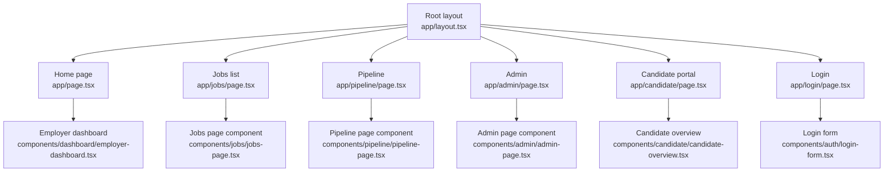
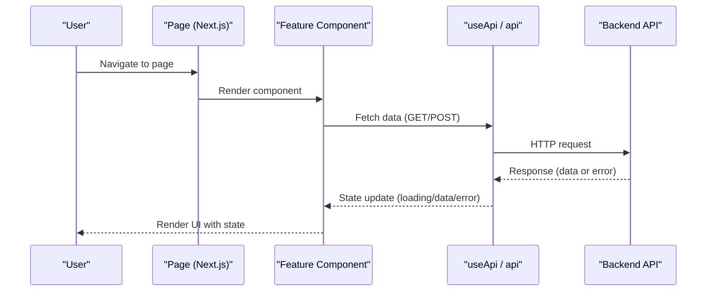
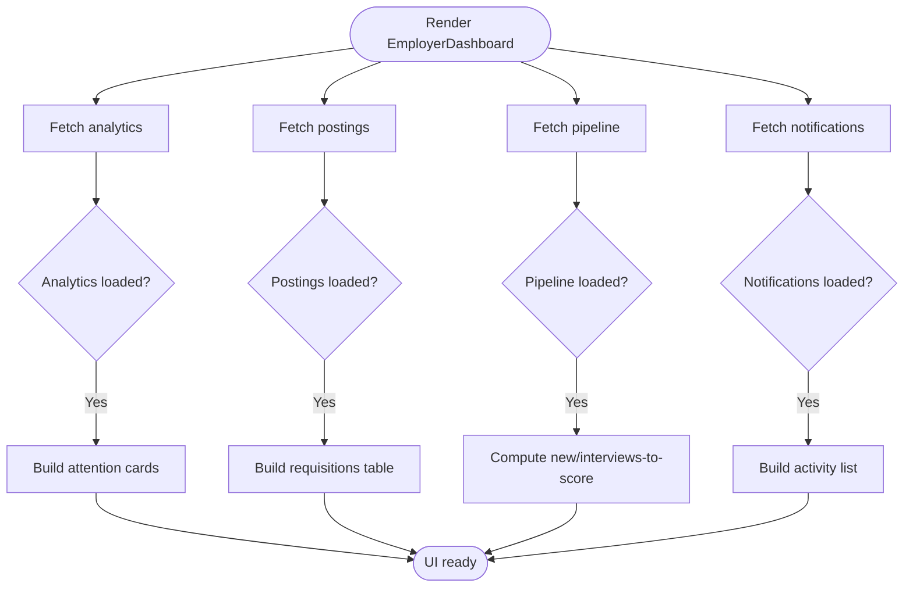
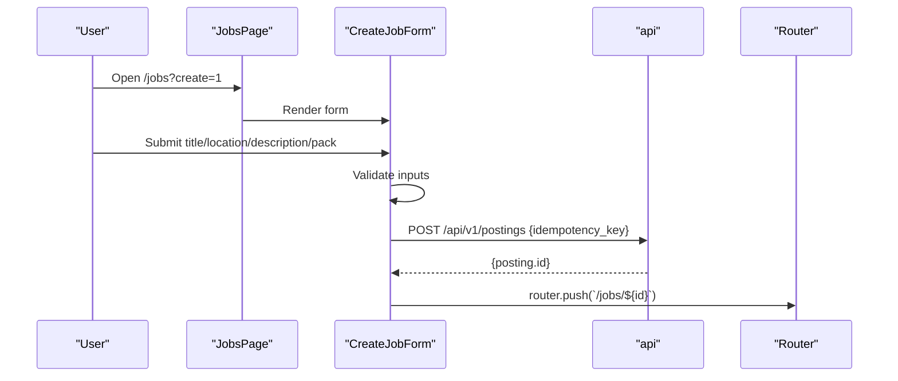
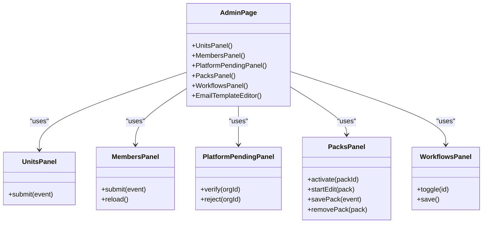
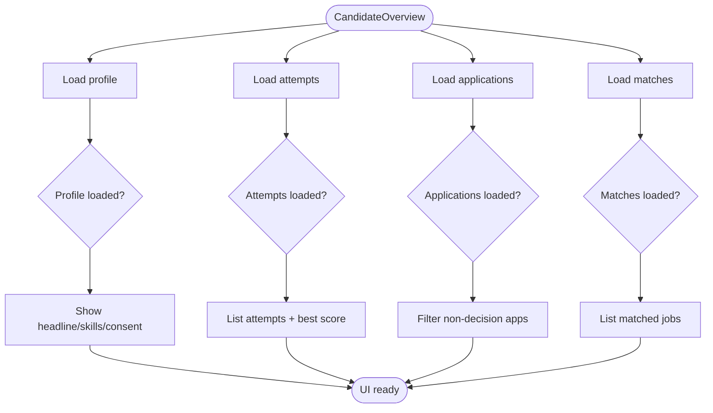
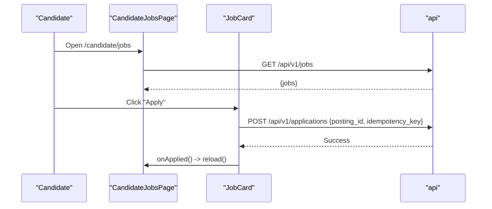
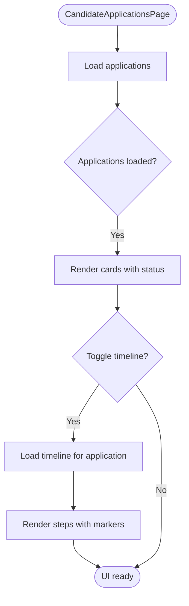
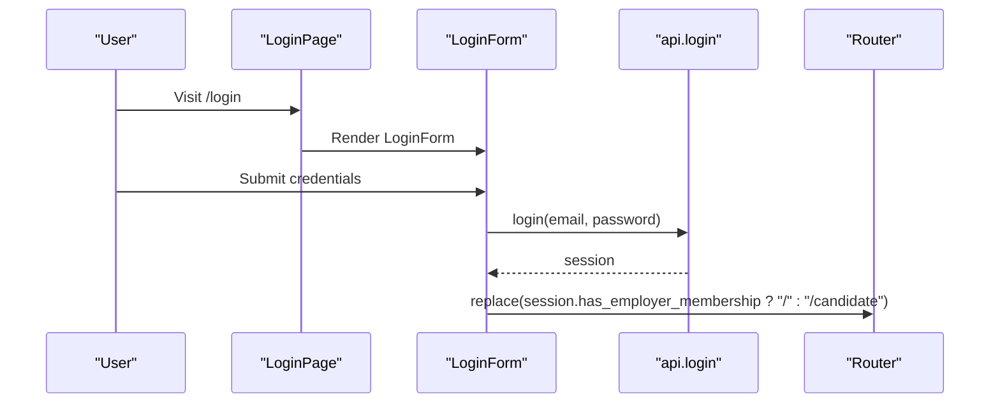
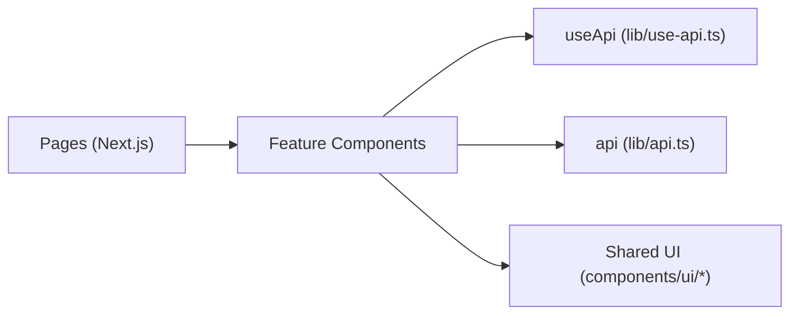

# Feature Pages

<cite>
**Referenced Files in This Document**
- [layout.tsx](file://Frontend/app/layout.tsx)
- [page.tsx](file://Frontend/app/page.tsx)
- [login/page.tsx](file://Frontend/app/login/page.tsx)
- [register/page.tsx](file://Frontend/app/register/page.tsx)
- [jobs/page.tsx](file://Frontend/app/jobs/page.tsx)
- [pipeline/page.tsx](file://Frontend/app/pipeline/page.tsx)
- [admin/page.tsx](file://Frontend/app/admin/page.tsx)
- [candidate/page.tsx](file://Frontend/app/candidate/page.tsx)
- [employer-dashboard.tsx](file://Frontend/components/dashboard/employer-dashboard.tsx)
- [jobs-page.tsx](file://Frontend/components/jobs/jobs-page.tsx)
- [pipeline-page.tsx](file://Frontend/components/pipeline/pipeline-page.tsx)
- [admin-page.tsx](file://Frontend/components/admin/admin-page.tsx)
- [candidate-overview.tsx](file://Frontend/components/candidate/candidate-overview.tsx)
- [candidate-jobs-page.tsx](file://Frontend/components/candidate/candidate-jobs-page.tsx)
- [candidate-applications-page.tsx](file://Frontend/components/candidate/candidate-applications-page.tsx)
- [login-form.tsx](file://Frontend/components/auth/login-form.tsx)
- [use-api.ts](file://Frontend/lib/use-api.ts)
- [api.ts](file://Frontend/lib/api.ts)
</cite>

## Table of Contents
1. Introduction
2. Project Structure
3. Core Components
4. Architecture Overview
5. Detailed Component Analysis
6. Dependency Analysis
7. Performance Considerations
8. Troubleshooting Guide
9. Conclusion
10. Appendices

## Introduction
This document explains the main application pages and their functionality across candidate, employer, and administrative areas. It covers how pages are structured, how data is fetched and cached, how errors are handled, and how to extend the system with new pages, route guards, and page-specific business logic. The focus is on practical guidance grounded in the existing codebase.

## Project Structure
The Next.js App Router organizes pages under Frontend/app with feature-based subfolders (candidate, jobs, pipeline, admin). Each page typically composes a shell component and delegates rendering to a feature component that handles state and API calls. Shared UI primitives live under components/ui, while cross-cutting utilities for API access and types reside under lib.

**Diagram sources**
- [layout.tsx:1-17](file://Frontend/app/layout.tsx#L1-L17)
- [page.tsx:1-7](file://Frontend/app/page.tsx#L1-L7)
- [jobs/page.tsx:1-18](file://Frontend/app/jobs/page.tsx#L1-L18)
- [pipeline/page.tsx:1-18](file://Frontend/app/pipeline/page.tsx#L1-L18)
- [admin/page.tsx:1-14](file://Frontend/app/admin/page.tsx#L1-L14)
- [candidate/page.tsx:1-14](file://Frontend/app/candidate/page.tsx#L1-L14)
- [login/page.tsx:1-9](file://Frontend/app/login/page.tsx#L1-L9)

**Section sources**
- [layout.tsx:1-17](file://Frontend/app/layout.tsx#L1-L17)
- [page.tsx:1-7](file://Frontend/app/page.tsx#L1-L7)
- [jobs/page.tsx:1-18](file://Frontend/app/jobs/page.tsx#L1-L18)
- [pipeline/page.tsx:1-18](file://Frontend/app/pipeline/page.tsx#L1-L18)
- [admin/page.tsx:1-14](file://Frontend/app/admin/page.tsx#L1-L14)
- [candidate/page.tsx:1-14](file://Frontend/app/candidate/page.tsx#L1-L14)
- [login/page.tsx:1-9](file://Frontend/app/login/page.tsx#L1-L9)

## Core Components
- Employer Dashboard: Aggregates analytics, postings, pipeline columns, and notifications to present an attention queue, active requisitions table, recent activity, and next actions. Uses Suspense and shared loading/error states.
- Jobs Page: Lists all job postings and provides a create flow via a query flag. Includes a form to create a draft posting with domain pack selection and idempotent submission.
- Pipeline Page: Hosts the hiring pipeline view (drilled into later).
- Admin Page: Manages organization units, members, platform pending applications, domain packs, workflows, and email templates.
- Candidate Portal: Provides profile screening status, suggested jobs, and active applications with links to complete interviews.
- Login Form: Authenticates users and redirects based on membership type.

Key patterns:
- Data fetching via useApi hook for declarative caching, loading, error, and reload semantics.
- Consistent UI states using LoadingState, ErrorState, EmptyState.
- Idempotency keys for write operations to prevent duplicate submissions.

**Section sources**
- [employer-dashboard.tsx:1-193](file://Frontend/components/dashboard/employer-dashboard.tsx#L1-L193)
- [jobs-page.tsx:1-184](file://Frontend/components/jobs/jobs-page.tsx#L1-L184)
- [pipeline-page.tsx:1-200](file://Frontend/components/pipeline/pipeline-page.tsx#L1-L200)
- [admin-page.tsx:1-800](file://Frontend/components/admin/admin-page.tsx#L1-L800)
- [candidate-overview.tsx:1-179](file://Frontend/components/candidate/candidate-overview.tsx#L1-L179)
- [login-form.tsx:1-75](file://Frontend/components/auth/login-form.tsx#L1-L75)

## Architecture Overview
Pages are thin shells that compose feature components. Feature components manage local state and call APIs through useApi or direct api helpers. Shared UI components render consistent states and interactions.

[No sources needed since this diagram shows conceptual workflow, not actual code structure]

## Detailed Component Analysis

### Employer Dashboard
- Responsibilities: Show attention queue, active requisitions, recent activity, and next actions.
- Data flows:
  - Analytics: /api/v1/analytics/pipeline
  - Postings: /api/v1/postings
  - Pipeline columns: /api/v1/pipeline
  - Notifications: /api/v1/notifications
- UI behavior: Displays loading, empty, and error states per section; navigates to pipeline and jobs.

**Diagram sources**
- [employer-dashboard.tsx:18-193](file://Frontend/components/dashboard/employer-dashboard.tsx#L18-L193)

**Section sources**
- [employer-dashboard.tsx:18-193](file://Frontend/components/dashboard/employer-dashboard.tsx#L18-L193)

### Jobs Page (Employer)
- Responsibilities: List postings, show create form when ?create=1, navigate to posting detail after creation.
- Create flow:
  - Validates title length and domain pack selection.
  - Submits POST /api/v1/postings with idempotency key.
  - Redirects to /jobs/{id} on success.
- UI behavior: Shows loading, empty, and error states; uses Pill for status and pool status.

**Diagram sources**
- [jobs-page.tsx:20-125](file://Frontend/components/jobs/jobs-page.tsx#L20-L125)

**Section sources**
- [jobs-page.tsx:20-184](file://Frontend/components/jobs/jobs-page.tsx#L20-L184)

### Pipeline Page (Employer)
- Purpose: Central place to manage candidates across stages.
- Integration: Accessed from employer dashboard attention queue and next actions.
- Typical features: Stage transitions, filtering, and details drawer (component-level).

[No sources needed since this section doesn't analyze specific files beyond the page wrapper]

### Admin Page
- Organization units: Create hierarchical units; display tree; inline form with validation.
- Members: Invite staff with roles; show invitations; handle errors and success feedback.
- Platform pending: Verify or reject organization applications; guard against 403 by hiding panel.
- Domain packs: Activate default pack; edit custom packs; delete only if unlinked; load manifest prompts.
- Workflows: Toggle optional components; preview pipeline path; save current workflow configuration.
- Email templates: Edit subject/body per template key; persist changes.

**Diagram sources**
- [admin-page.tsx:54-800](file://Frontend/components/admin/admin-page.tsx#L54-L800)

**Section sources**
- [admin-page.tsx:54-800](file://Frontend/components/admin/admin-page.tsx#L54-L800)

### Candidate Portal
- Overview:
  - Profile screening attempts with scores and status pills.
  - Profile summary with edit link.
  - Suggested jobs with match score and reasons.
  - Active applications with interview completion links.
- Data flows:
  - Profile: /api/v1/candidates/me/profile
  - Attempts: /api/v1/candidates/me/profile-interview-attempts
  - Applications: /api/v1/candidates/me/applications
  - Matches: /api/v1/candidates/me/matches

**Diagram sources**
- [candidate-overview.tsx:10-179](file://Frontend/components/candidate/candidate-overview.tsx#L10-L179)

**Section sources**
- [candidate-overview.tsx:10-179](file://Frontend/components/candidate/candidate-overview.tsx#L10-L179)

### Candidate Jobs Page
- Responsibilities: Browse open jobs, apply with idempotency, show process steps, expand descriptions.
- Apply flow:
  - POST /api/v1/applications with posting_id and idempotency_key.
  - On success, reload to reflect applied state.

**Diagram sources**
- [candidate-jobs-page.tsx:11-96](file://Frontend/components/candidate/candidate-jobs-page.tsx#L11-L96)

**Section sources**
- [candidate-jobs-page.tsx:11-96](file://Frontend/components/candidate/candidate-jobs-page.tsx#L11-L96)

### Candidate Applications Page
- Responsibilities: List applications, show status, reveal timeline per application, provide quick action to complete interview.
- Timeline:
  - Fetches per-application timeline and renders step states with timestamps.

**Diagram sources**
- [candidate-applications-page.tsx:10-120](file://Frontend/components/candidate/candidate-applications-page.tsx#L10-L120)

**Section sources**
- [candidate-applications-page.tsx:10-120](file://Frontend/components/candidate/candidate-applications-page.tsx#L10-L120)

### Authentication Pages
- Login:
  - Collects email/password, calls login, and redirects to "/" for employer members or "/candidate" otherwise.
  - Displays errors and busy state during submission.

**Diagram sources**
- [login-form.tsx:8-75](file://Frontend/components/auth/login-form.tsx#L8-L75)
- [login/page.tsx:1-9](file://Frontend/app/login/page.tsx#L1-L9)

**Section sources**
- [login-form.tsx:8-75](file://Frontend/components/auth/login-form.tsx#L8-L75)
- [login/page.tsx:1-9](file://Frontend/app/login/page.tsx#L1-L9)

## Dependency Analysis
- Pages depend on feature components for business logic and rendering.
- Feature components depend on:
  - useApi for declarative data fetching and caching.
  - api for imperative requests (e.g., idempotent writes).
  - Shared UI components for consistent states and controls.
- Routing is file-system based; metadata is declared per page.

**Diagram sources**
- [use-api.ts:1-200](file://Frontend/lib/use-api.ts#L1-L200)
- [api.ts:1-200](file://Frontend/lib/api.ts#L1-L200)

**Section sources**
- [use-api.ts:1-200](file://Frontend/lib/use-api.ts#L1-L200)
- [api.ts:1-200](file://Frontend/lib/api.ts#L1-L200)

## Performance Considerations
- Use Suspense around heavy components to improve perceived performance (see jobs and pipeline pages).
- Prefer useApi for automatic caching and deduplication of identical requests.
- Avoid unnecessary re-renders by keeping local state minimal and leveraging component boundaries.
- Use idempotency keys for mutations to safely retry without duplicates.
- Defer non-critical data fetches until they are visible (e.g., timelines inside collapsible sections).

[No sources needed since this section provides general guidance]

## Troubleshooting Guide
Common issues and remedies:
- Network or server errors:
  - All components surface ErrorState with a message and a reload action. Use reload to retry failed requests.
- Validation errors:
  - Forms set local error messages and disable submit buttons during processing. Ensure required fields meet constraints before submission.
- Duplicate submissions:
  - Always include idempotency_key for POST requests that may be retried.
- Permission errors:
  - Some admin panels hide themselves on 403 responses; verify user permissions before accessing sensitive endpoints.

Patterns to follow:
- Wrap async handlers in try/catch, map ApiError messages to user-friendly text, and reset busy/error states appropriately.
- Provide clear feedback for success and failure paths in forms and actions.

**Section sources**
- [employer-dashboard.tsx:51-151](file://Frontend/components/dashboard/employer-dashboard.tsx#L51-L151)
- [jobs-page.tsx:36-61](file://Frontend/components/jobs/jobs-page.tsx#L36-L61)
- [admin-page.tsx:144-168](file://Frontend/components/admin/admin-page.tsx#L144-L168)
- [admin-page.tsx:230-303](file://Frontend/components/admin/admin-page.tsx#L230-L303)
- [candidate-jobs-page.tsx:16-30](file://Frontend/components/candidate/candidate-jobs-page.tsx#L16-L30)
- [login-form.tsx:15-27](file://Frontend/components/auth/login-form.tsx#L15-L27)

## Conclusion
The application follows a consistent pattern: thin Next.js pages composing feature components that encapsulate business logic, data fetching via useApi, and robust UI states. Employers can manage jobs and pipelines, candidates can browse and apply to jobs and track progress, and administrators can configure domains, workflows, and organization settings. Extending the system involves adding new pages, wiring them to routes, and implementing feature components with the established data and error handling patterns.

[No sources needed since this section summarizes without analyzing specific files]

## Appendices

### Adding a New Page
Steps:
1. Create a new folder under Frontend/app with a page.tsx and define metadata.
2. Compose a shell component (e.g., DashboardShell or CandidateShell) and your feature component.
3. Implement data fetching with useApi for reads and api for writes.
4. Add Suspense fallbacks where appropriate.
5. Handle loading, empty, and error states consistently.

[No sources needed since this section provides general guidance]

### Implementing Route Guards
- For protected routes, check authentication state in the page or layout and redirect to /login if needed.
- For role-based access, inspect membership or role information after login and redirect accordingly (as seen in login redirection).

[No sources needed since this section provides general guidance]

### Managing Page-Specific Business Logic
- Keep business rules inside feature components to maintain separation of concerns.
- Use local state for transient UI interactions and rely on useApi for server state.
- Encapsulate complex flows (e.g., create job, activate domain pack) in small subcomponents or functions within the feature component.

[No sources needed since this section provides general guidance]