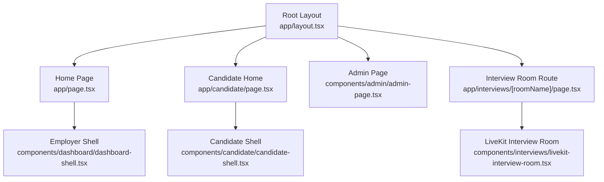
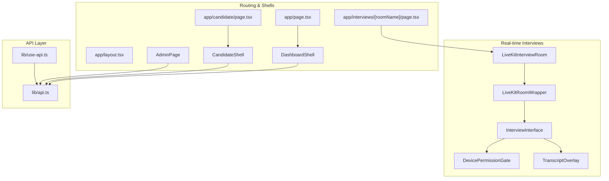
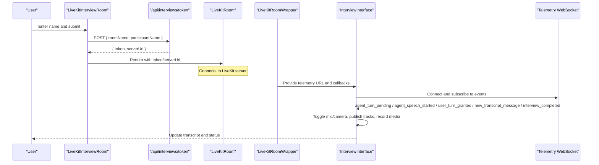
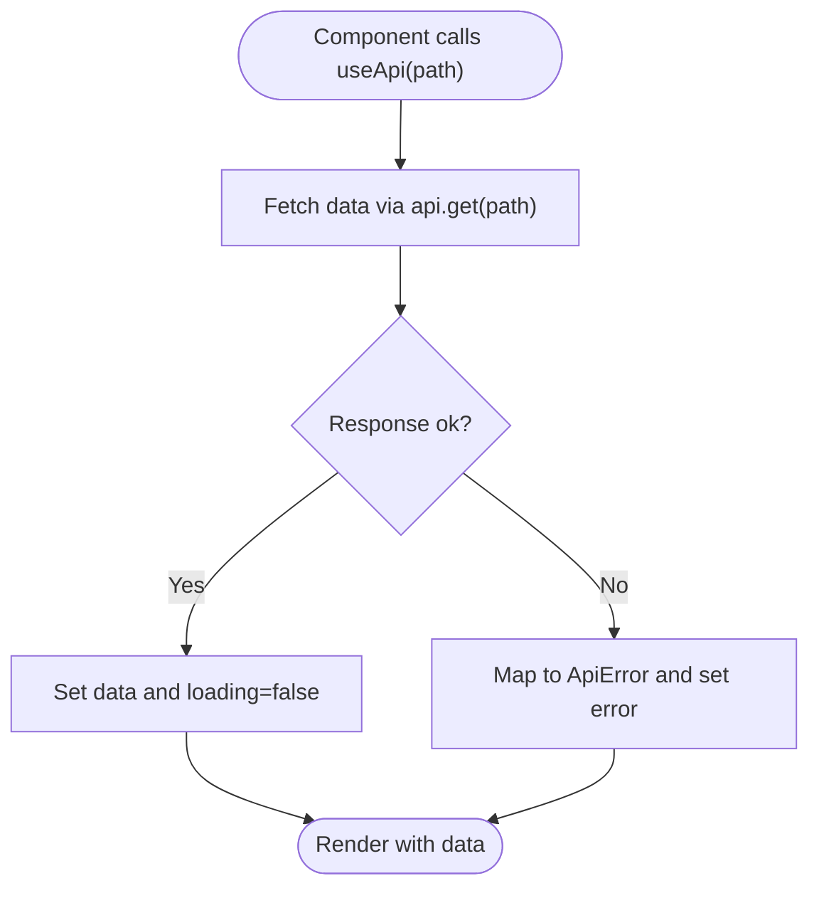
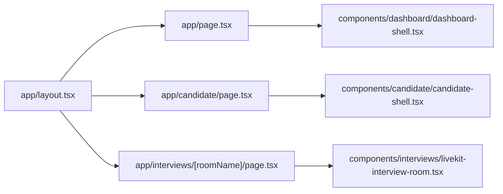
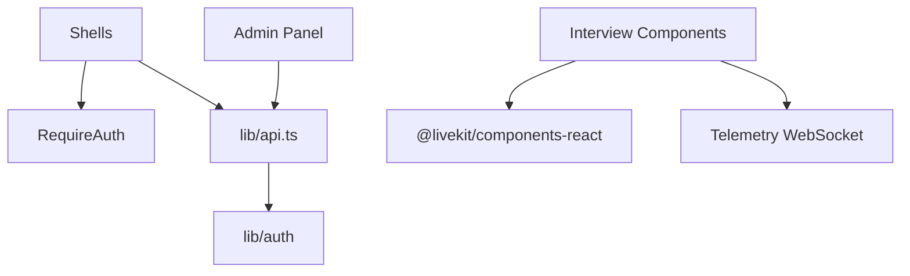

# Frontend Application

<cite>
**Referenced Files in This Document**
- [layout.tsx](file://Frontend/app/layout.tsx)
- [page.tsx](file://Frontend/app/page.tsx)
- [candidate-shell.tsx](file://Frontend/components/candidate/candidate-shell.tsx)
- [dashboard-shell.tsx](file://Frontend/components/dashboard/dashboard-shell.tsx)
- [admin-page.tsx](file://Frontend/components/admin/admin-page.tsx)
- [api.ts](file://Frontend/lib/api.ts)
- [use-api.ts](file://Frontend/lib/use-api.ts)
- [livekit-interview-room.tsx](file://Frontest/components/interviews/livekit-interview-room.tsx)
- [InterviewInterface.tsx](file://Frontend/components/interviews/voice/InterviewInterface.tsx)
- [LiveKitRoomWrapper.tsx](file://Frontend/components/interviews/voice/LiveKitRoomWrapper.tsx)
- [DevicePermissionGate.tsx](file://Frontend/components/interviews/voice/DevicePermissionGate.tsx)
- [TranscriptOverlay.tsx](file://Frontend/components/interviews/voice/TranscriptOverlay.tsx)
- [require-auth.tsx](file://Frontend/components/auth/require-auth.tsx)
- [interview page route](file://Frontend/app/interviews/[roomName]/page.tsx)
- [candidate home page](file://Frontend/app/candidate/page.tsx)
- [candidate interview launcher](file://Frontend/app/candidate/interview/page.tsx)
</cite>

## Table of Contents
1. Introduction
2. Project Structure
3. Core Components
4. Architecture Overview
5. Detailed Component Analysis
6. Dependency Analysis
7. Performance Considerations
8. Troubleshooting Guide
9. Conclusion
10. Appendices

## Introduction
This document describes the Next.js frontend application for a hiring platform with role-based shells (candidate, employer, admin), real-time AI interviews powered by LiveKit, and a robust API integration layer. It explains routing, state management patterns, device permission handling, audio/video controls, transcript display, responsive design, accessibility, cross-browser considerations, styling with Tailwind CSS, performance strategies, and guidance for extending the app.

## Project Structure
The application uses Next.js App Router with:
- Root layout and global metadata
- Role-based shell components that wrap pages with navigation, auth guards, and top-level chrome
- Feature directories under app/ for candidate, employer, and admin routes
- A shared component library for UI primitives and domain-specific features
- An API client with automatic token refresh and typed helpers
- Real-time interview flows using LiveKit and a telemetry WebSocket

**Diagram sources**
- [layout.tsx:1-17](file://Frontend/app/layout.tsx#L1-L17)
- [page.tsx:1-7](file://Frontend/app/page.tsx#L1-L7)
- [dashboard-shell.tsx:1-178](file://Frontend/components/dashboard/dashboard-shell.tsx#L1-L178)
- [candidate-shell.tsx:1-93](file://Frontend/components/candidate/candidate-shell.tsx#L1-L93)
- [admin-page.tsx:1-800](file://Frontend/components/admin/admin-page.tsx#L1-L800)
- [interview page route:1-14](file://Frontend/app/interviews/[roomName]/page.tsx#L1-L14)
- [livekit-interview-room.tsx:1-100](file://Frontend/components/interviews/livekit-interview-room.tsx#L1-L100)

**Section sources**
- [layout.tsx:1-17](file://Frontend/app/layout.tsx#L1-L17)
- [page.tsx:1-7](file://Frontend/app/page.tsx#L1-L7)

## Core Components
- Shell components:
  - Employer shell provides sidebar navigation, workspace header, notifications, pack chip, and sign-out.
  - Candidate shell provides top navigation, pack chip, unread badge, and sign-out.
  - Admin page includes panels for units, members, pending organizations, domain packs, workflows, and email templates.
- Auth guard:
  - RequireAuth enforces authentication and optional employer-only access.
- API layer:
  - Centralized fetch wrapper with automatic token refresh, error mapping, and typed methods.
  - useApi hook for declarative data fetching with loading/error states and reload capability.

Key responsibilities:
- Shells manage navigation context, session info, and environment-aware data like organization name and active domain pack.
- The API layer encapsulates authentication, retry on 401, and consistent error handling.
- useApi simplifies data fetching in components with built-in lifecycle and error handling.

**Section sources**
- [dashboard-shell.tsx:1-178](file://Frontend/components/dashboard/dashboard-shell.tsx#L1-L178)
- [candidate-shell.tsx:1-93](file://Frontend/components/candidate/candidate-shell.tsx#L1-L93)
- [admin-page.tsx:1-800](file://Frontend/components/admin/admin-page.tsx#L1-L800)
- [require-auth.tsx:1-42](file://Frontend/components/auth/require-auth.tsx#L1-L42)
- [api.ts:1-199](file://Frontend/lib/api.ts#L1-L199)
- [use-api.ts:1-34](file://Frontend/lib/use-api.ts#L1-L34)

## Architecture Overview
The frontend architecture separates concerns into:
- Routing and shells for role-based experiences
- Real-time interview orchestration via LiveKit and telemetry WebSocket
- API integration with automatic token refresh and typed hooks
- Shared UI components and utilities

**Diagram sources**
- [layout.tsx:1-17](file://Frontend/app/layout.tsx#L1-L17)
- [page.tsx:1-7](file://Frontend/app/page.tsx#L1-L7)
- [candidate-shell.tsx:1-93](file://Frontend/components/candidate/candidate-shell.tsx#L1-L93)
- [dashboard-shell.tsx:1-178](file://Frontend/components/dashboard/dashboard-shell.tsx#L1-L178)
- [admin-page.tsx:1-800](file://Frontend/components/admin/admin-page.tsx#L1-L800)
- [livekit-interview-room.tsx:1-100](file://Frontend/components/interviews/livekit-interview-room.tsx#L1-L100)
- [LiveKitRoomWrapper.tsx:1-104](file://Frontend/components/interviews/voice/LiveKitRoomWrapper.tsx#L1-L104)
- [InterviewInterface.tsx:1-800](file://Frontend/components/interviews/voice/InterviewInterface.tsx#L1-L800)
- [DevicePermissionGate.tsx:1-359](file://Frontend/components/interviews/voice/DevicePermissionGate.tsx#L1-L359)
- [TranscriptOverlay.tsx:1-94](file://Frontend/components/interviews/voice/TranscriptOverlay.tsx#L1-L94)
- [api.ts:1-199](file://Frontend/lib/api.ts#L1-L199)
- [use-api.ts:1-34](file://Frontend/lib/use-api.ts#L1-L34)

## Detailed Component Analysis

### Shell Components
- Employer shell:
  - Provides primary and secondary navigation, tenant switcher, global search, notification badge, and quick actions.
  - Fetches current organization, active domain pack, and unread notifications on mount.
  - Uses RequireAuth with employerOnly to restrict access.
- Candidate shell:
  - Top navigation with overview, jobs, applications, profile links.
  - Displays pack chip and unread notifications; supports sign-out and redirects to login.
  - Uses RequireAuth without employerOnly.
- Admin page:
  - Panels for organizational structure, member management, pending organization verification, domain packs configuration, workflow editor, and email template editing.
  - Leverages useApi for data fetching and ApiError for user-facing errors.

Accessibility and responsiveness:
- Skip-to-content links and aria attributes for navigation landmarks.
- Mobile menu toggle with aria-expanded and sr-only labels.
- Semantic headings and structured sections for screen readers.

Styling:
- Tailwind utility classes combined with custom CSS variables and theme tokens.
- Consistent spacing, typography, and color usage across shells.

**Section sources**
- [dashboard-shell.tsx:1-178](file://Frontend/components/dashboard/dashboard-shell.tsx#L1-L178)
- [candidate-shell.tsx:1-93](file://Frontend/components/candidate/candidate-shell.tsx#L1-L93)
- [admin-page.tsx:1-800](file://Frontend/components/admin/admin-page.tsx#L1-L800)
- [require-auth.tsx:1-42](file://Frontend/components/auth/require-auth.tsx#L1-L42)

### Real-time Interview Interface (LiveKit + Telemetry)
- LiveKitInterviewRoom:
  - Lobby form collects participant name and requests connection details from a Next.js route handler.
  - On success, renders LiveKitRoom with VideoConference and RoomAudioRenderer.
  - Handles disconnect and room errors gracefully.
- LiveKitRoomWrapper:
  - Obtains LiveKit token and telemetry WebSocket URL via public API.
  - Wraps InterviewInterface inside LiveKitRoom with controlled audio/video toggles.
- InterviewInterface:
  - Orchestrates microphone and camera permissions, publishing tracks, and media recording.
  - Manages telemetry WebSocket events for agent/user turn control, transcript updates, setup status, and completion.
  - Implements answer time cap locking and mic enable/disable logic based on backend signals.
  - Performs identity verification by capturing a single frame once the camera is live.
  - Mixes local mic and remote audio tracks for client-side recording using Web Audio API.
  - Auto-scrolls transcript and maintains scroll position during updates.
- DevicePermissionGate:
  - Requests getUserMedia for audio/video, falls back to audio-only if camera is unavailable.
  - Provides audio level metering and camera preview before joining.
- TranscriptOverlay:
  - Renders live transcript entries with speaker labels and auto-scroll behavior.

**Diagram sources**
- [livekit-interview-room.tsx:1-100](file://Frontend/components/interviews/livekit-interview-room.tsx#L1-L100)
- [LiveKitRoomWrapper.tsx:1-104](file://Frontend/components/interviews/voice/LiveKitRoomWrapper.tsx#L1-L104)
- [InterviewInterface.tsx:1-800](file://Frontend/components/interviews/voice/InterviewInterface.tsx#L1-L800)

**Section sources**
- [livekit-interview-room.tsx:1-100](file://Frontend/components/interviews/livekit-interview-room.tsx#L1-L100)
- [LiveKitRoomWrapper.tsx:1-104](file://Frontend/components/interviews/voice/LiveKitRoomWrapper.tsx#L1-L104)
- [InterviewInterface.tsx:1-800](file://Frontend/components/interviews/voice/InterviewInterface.tsx#L1-L800)
- [DevicePermissionGate.tsx:1-359](file://Frontend/components/interviews/voice/DevicePermissionGate.tsx#L1-L359)
- [TranscriptOverlay.tsx:1-94](file://Frontend/components/interviews/voice/TranscriptOverlay.tsx#L1-L94)

### API Integration Layer
- api.ts:
  - Centralized fetch wrapper with Authorization header injection.
  - Automatic token refresh on 401 with deduplicated refresh promise.
  - Typed HTTP methods (get, post, patch, put, delete) and form upload support.
  - Login/register/logout helpers and idempotency key generation.
- use-api.ts:
  - Declarative data fetching hook returning data, error, loading, and reload.
  - Integrates with api.get for consistent error handling and loading states.

**Diagram sources**
- [use-api.ts:1-34](file://Frontend/lib/use-api.ts#L1-L34)
- [api.ts:1-199](file://Frontend/lib/api.ts#L1-L199)

**Section sources**
- [api.ts:1-199](file://Frontend/lib/api.ts#L1-L199)
- [use-api.ts:1-34](file://Frontend/lib/use-api.ts#L1-L34)

### Routing Structure
- Root layout sets metadata and global styles.
- Home page renders employer dashboard within DashboardShell.
- Candidate portal routes render CandidateShell with feature pages.
- Interview room route validates roomName and renders LiveKitInterviewRoom.

**Diagram sources**
- [layout.tsx:1-17](file://Frontend/app/layout.tsx#L1-L17)
- [page.tsx:1-7](file://Frontend/app/page.tsx#L1-L7)
- [candidate home page:1-14](file://Frontend/app/candidate/page.tsx#L1-L14)
- [interview page route:1-14](file://Frontend/app/interviews/[roomName]/page.tsx#L1-L14)
- [dashboard-shell.tsx:1-178](file://Frontend/components/dashboard/dashboard-shell.tsx#L1-L178)
- [candidate-shell.tsx:1-93](file://Frontend/components/candidate/candidate-shell.tsx#L1-L93)
- [livekit-interview-room.tsx:1-100](file://Frontend/components/interviews/livekit-interview-room.tsx#L1-L100)

**Section sources**
- [layout.tsx:1-17](file://Frontend/app/layout.tsx#L1-L17)
- [page.tsx:1-7](file://Frontend/app/page.tsx#L1-L7)
- [candidate home page:1-14](file://Frontend/app/candidate/page.tsx#L1-L14)
- [interview page route:1-14](file://Frontend/app/interviews/[roomName]/page.tsx#L1-L14)

### State Management Patterns
- Local component state for UI flags (loading, errors, modal visibility).
- Session state via localStorage-backed auth helpers and RequireAuth gating.
- Data fetching state via useApi hook providing data, error, loading, and reload.
- Real-time state managed through LiveKit room context and telemetry WebSocket events.

Best practices:
- Keep ephemeral UI state local; lift only when needed for sharing between siblings.
- Use hooks for side effects and cleanup (e.g., WebSocket close, MediaRecorder stop).
- Centralize API interactions to avoid duplication and ensure consistent error handling.

**Section sources**
- [require-auth.tsx:1-42](file://Frontend/components/auth/require-auth.tsx#L1-L42)
- [use-api.ts:1-34](file://Frontend/lib/use-api.ts#L1-L34)
- [InterviewInterface.tsx:1-800](file://Frontend/components/interviews/voice/InterviewInterface.tsx#L1-L800)

## Dependency Analysis
- Shells depend on RequireAuth and API client for session and tenant data.
- Interview components depend on LiveKit SDK and telemetry WebSocket for real-time communication.
- Admin panel depends on multiple API endpoints for organization, workflow, and domain pack management.
- API client centralizes dependencies on environment variables and auth helpers.

**Diagram sources**
- [dashboard-shell.tsx:1-178](file://Frontend/components/dashboard/dashboard-shell.tsx#L1-L178)
- [candidate-shell.tsx:1-93](file://Frontend/components/candidate/candidate-shell.tsx#L1-L93)
- [admin-page.tsx:1-800](file://Frontend/components/admin/admin-page.tsx#L1-L800)
- [livekit-interview-room.tsx:1-100](file://Frontend/components/interviews/livekit-interview-room.tsx#L1-L100)
- [InterviewInterface.tsx:1-800](file://Frontend/components/interviews/voice/InterviewInterface.tsx#L1-L800)
- [api.ts:1-199](file://Frontend/lib/api.ts#L1-L199)

**Section sources**
- [dashboard-shell.tsx:1-178](file://Frontend/components/dashboard/dashboard-shell.tsx#L1-L178)
- [candidate-shell.tsx:1-93](file://Frontend/components/candidate/candidate-shell.tsx#L1-L93)
- [admin-page.tsx:1-800](file://Frontend/components/admin/admin-page.tsx#L1-L800)
- [livekit-interview-room.tsx:1-100](file://Frontend/components/interviews/livekit-interview-room.tsx#L1-L100)
- [InterviewInterface.tsx:1-800](file://Frontend/components/interviews/voice/InterviewInterface.tsx#L1-L800)
- [api.ts:1-199](file://Frontend/lib/api.ts#L1-L199)

## Performance Considerations
- Minimize re-renders by keeping UI state local and lifting only necessary state.
- Debounce or throttle frequent updates (e.g., audio level metering) to reduce layout thrashing.
- Reuse existing media tracks instead of requesting new permissions where possible.
- Use conditional rendering for heavy components (e.g., video conference) until required.
- Avoid unnecessary network calls; leverage caching headers and idempotency keys for retries.
- Clean up resources promptly (WebSocket, MediaRecorder, AudioContext) to prevent memory leaks.

[No sources needed since this section provides general guidance]

## Troubleshooting Guide
Common issues and resolutions:
- Network unreachable:
  - Ensure backend is running and reachable; the API client throws a descriptive ApiError.
- Token expired or invalid:
  - Automatic refresh attempts are handled; if refresh fails, session is cleared and user redirected to login.
- LiveKit connection failure:
  - Validate token and serverUrl; check browser permissions and firewall settings.
- Microphone/camera denied:
  - Use DevicePermissionGate to guide users; fallback to audio-only if camera is unavailable.
- Telemetry WebSocket closed:
  - Retry with exponential backoff; handle policy violation codes and inform the user.

**Section sources**
- [api.ts:1-199](file://Frontend/lib/api.ts#L1-L199)
- [DevicePermissionGate.tsx:1-359](file://Frontend/components/interviews/voice/DevicePermissionGate.tsx#L1-L359)
- [InterviewInterface.tsx:1-800](file://Frontend/components/interviews/voice/InterviewInterface.tsx#L1-L800)

## Conclusion
The frontend application combines role-based shells, a robust API layer, and real-time interview capabilities to deliver a cohesive hiring experience. By following the documented patterns for routing, state management, and integration with LiveKit, developers can extend the platform with new pages, enhance existing components, and integrate additional backend services while maintaining performance, accessibility, and cross-browser compatibility.

[No sources needed since this section summarizes without analyzing specific files]

## Appendices

### Adding a New Page
Steps:
- Create a new route under app/ with a page file.
- Wrap content with the appropriate shell (CandidateShell or DashboardShell) if it requires authentication and navigation chrome.
- Add metadata for SEO and title.
- Use useApi to fetch data and render loading/error states.

Example references:
- [candidate home page:1-14](file://Frontend/app/candidate/page.tsx#L1-L14)
- [interview page route:1-14](file://Frontend/app/interviews/[roomName]/page.tsx#L1-L14)

**Section sources**
- [candidate home page:1-14](file://Frontend/app/candidate/page.tsx#L1-L14)
- [interview page route:1-14](file://Frontend/app/interviews/[roomName]/page.tsx#L1-L14)

### Extending Existing Components
Guidance:
- Compose smaller UI primitives (Button, Pill, PackChip) to build complex panels.
- Lift state only when necessary; keep local state for UI-only concerns.
- Use RequireAuth to gate protected areas and redirect appropriately.

References:
- [admin-page.tsx:1-800](file://Frontend/components/admin/admin-page.tsx#L1-L800)
- [require-auth.tsx:1-42](file://Frontend/components/auth/require-auth.tsx#L1-L42)

**Section sources**
- [admin-page.tsx:1-800](file://Frontend/components/admin/admin-page.tsx#L1-L800)
- [require-auth.tsx:1-42](file://Frontend/components/auth/require-auth.tsx#L1-L42)

### Integrating with Backend APIs
Guidance:
- Use api.get/post/patch/put/delete for typed requests.
- Handle ApiError consistently in components and surfaces.
- For file uploads, use api.postForm to send FormData without overriding Content-Type.

References:
- [api.ts:1-199](file://Frontend/lib/api.ts#L1-L199)
- [use-api.ts:1-34](file://Frontend/lib/use-api.ts#L1-L34)

**Section sources**
- [api.ts:1-199](file://Frontend/lib/api.ts#L1-L199)
- [use-api.ts:1-34](file://Frontend/lib/use-api.ts#L1-L34)

### Responsive Design and Accessibility
- Use semantic HTML elements and ARIA attributes for navigation and interactive controls.
- Provide skip links and keyboard-accessible menus.
- Ensure focus management and visible focus indicators.
- Test layouts across viewports and devices.

References:
- [dashboard-shell.tsx:1-178](file://Frontend/components/dashboard/dashboard-shell.tsx#L1-L178)
- [candidate-shell.tsx:1-93](file://Frontend/components/candidate/candidate-shell.tsx#L1-L93)

**Section sources**
- [dashboard-shell.tsx:1-178](file://Frontend/components/dashboard/dashboard-shell.tsx#L1-L178)
- [candidate-shell.tsx:1-93](file://Frontend/components/candidate/candidate-shell.tsx#L1-L93)

### Cross-Browser Compatibility
- Verify getUserMedia behavior and permissions prompts across browsers.
- Test LiveKit connectivity and media track publishing on different platforms.
- Handle edge cases for Web Audio API and MediaRecorder availability.

References:
- [DevicePermissionGate.tsx:1-359](file://Frontend/components/interviews/voice/DevicePermissionGate.tsx#L1-L359)
- [InterviewInterface.tsx:1-800](file://Frontend/components/interviews/voice/InterviewInterface.tsx#L1-L800)

**Section sources**
- [DevicePermissionGate.tsx:1-359](file://Frontend/components/interviews/voice/DevicePermissionGate.tsx#L1-L359)
- [InterviewInterface.tsx:1-800](file://Frontend/components/interviews/voice/InterviewInterface.tsx#L1-L800)