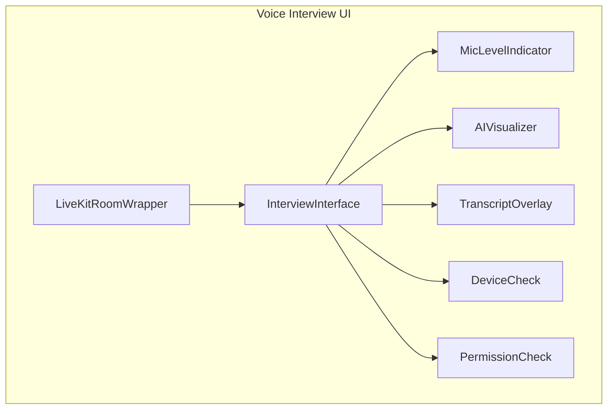
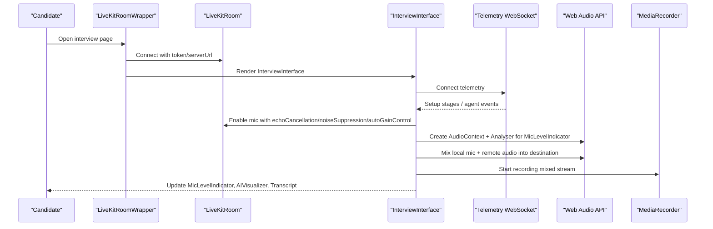
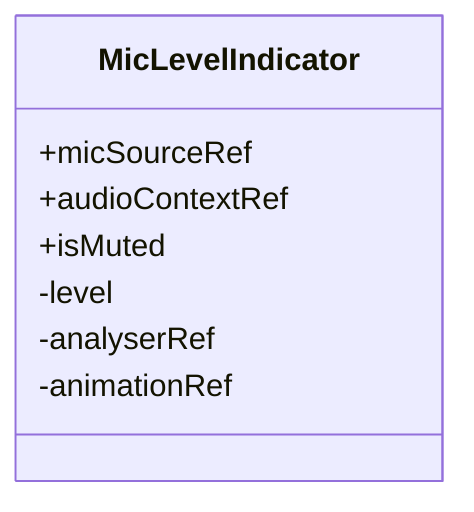
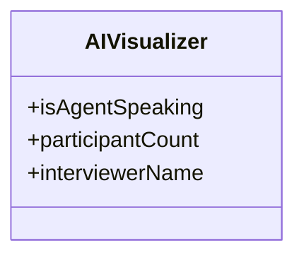
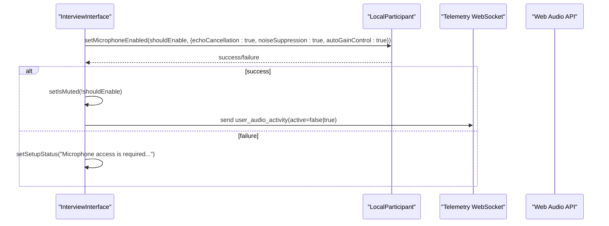
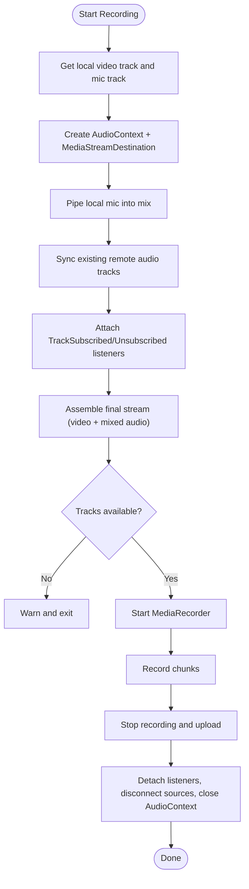
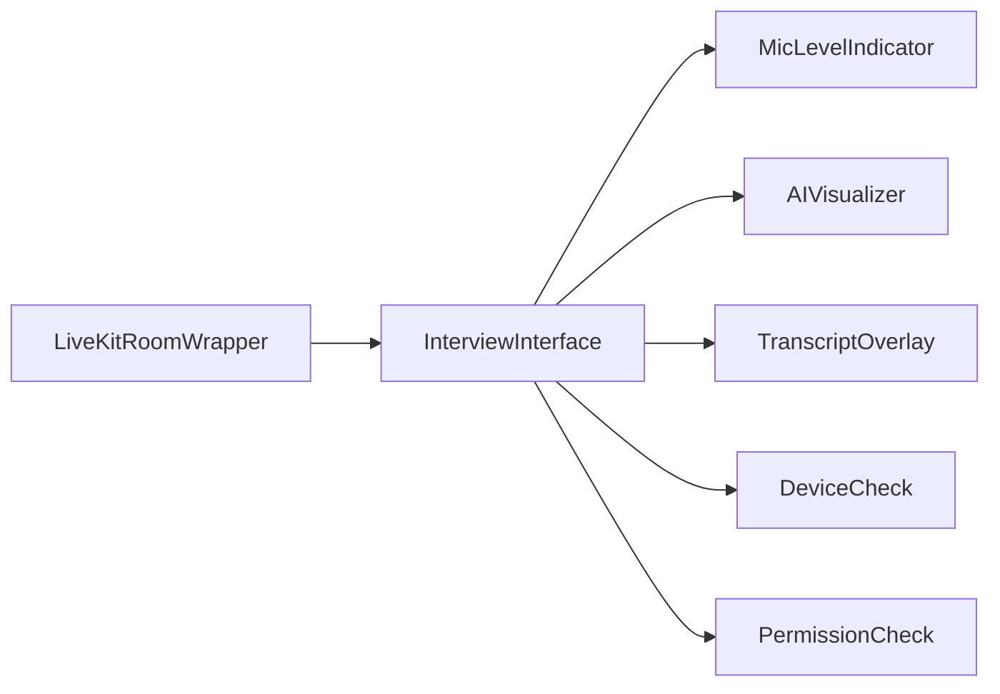

# Audio Controls & Indicators

<cite>
**Referenced Files in This Document**
- [MicLevelIndicator.tsx](file://Frontend/components/interviews/voice/MicLevelIndicator.tsx)
- [AIVisualizer.tsx](file://Frontend/components/interviews/voice/AIVisualizer.tsx)
- [InterviewInterface.tsx](file://Frontend/components/interviews/voice/InterviewInterface.tsx)
- [LiveKitRoomWrapper.tsx](file://Frontend/components/interviews/voice/LiveKitRoomWrapper.tsx)
- [TranscriptOverlay.tsx](file://Frontend/components/interviews/voice/TranscriptOverlay.tsx)
- [DeviceCheck.tsx](file://Frontend/components/interviews/voice/DeviceCheck.tsx)
- [PermissionCheck.tsx](file://Frontend/components/interviews/voice/PermissionCheck.tsx)
</cite>

## Table of Contents
1. [Introduction](#introduction)
2. [Project Structure](#project-structure)
3. [Core Components](#core-components)
4. [Architecture Overview](#architecture-overview)
5. [Detailed Component Analysis](#detailed-component-analysis)
6. [Dependency Analysis](#dependency-analysis)
7. [Performance Considerations](#performance-considerations)
8. [Troubleshooting Guide](#troubleshooting-guide)
9. [Conclusion](#conclusion)
10. [Appendices](#appendices)

## Introduction
This document explains the audio control components that manage microphone input and provide visual feedback during AI-driven interviews. It focuses on:
- MicLevelIndicator for real-time audio levels, speaking state detection, and accessibility cues
- AIVisualizer for showing AI agent speech patterns and conversation flow indicators
- The audio processing pipeline including echo cancellation, noise suppression, and auto gain control
- Integration with LiveKit audio tracks and Web Audio API usage
- Examples for customizing controls, implementing mute/unmute, and handling errors
- Performance optimization techniques for real-time audio processing

## Project Structure
The audio features are implemented within the voice interview module under the Frontend components. Key files include:
- MicLevelIndicator.tsx: Real-time mic level metering and muted state UI
- AIVisualizer.tsx: Visual indicator for AI agent speaking/listening states
- InterviewInterface.tsx: Orchestrates LiveKit room, telemetry, media recording, and audio mixing
- LiveKitRoomWrapper.tsx: Initializes LiveKit connection and renders the interview interface
- TranscriptOverlay.tsx: Displays live transcript entries
- DeviceCheck.tsx: Pre-interview device test with live mic level meter
- PermissionCheck.tsx: Handles browser permission prompts and error states

**Diagram sources**
- [LiveKitRoomWrapper.tsx:73-101](file://Frontend/components/interviews/voice/LiveKitRoomWrapper.tsx#L73-L101)
- [InterviewInterface.tsx:74-132](file://Frontend/components/interviews/voice/InterviewInterface.tsx#L74-L132)
- [MicLevelIndicator.tsx:12-64](file://Frontend/components/interviews/voice/MicLevelIndicator.tsx#L12-L64)
- [AIVisualizer.tsx:9-59](file://Frontend/components/interviews/voice/AIVisualizer.tsx#L9-L59)
- [TranscriptOverlay.tsx:16-93](file://Frontend/components/interviews/voice/TranscriptOverlay.tsx#L16-L93)
- [DeviceCheck.tsx:47-222](file://Frontend/components/interviews/voice/DeviceCheck.tsx#L47-L222)
- [PermissionCheck.tsx:15-83](file://Frontend/components/interviews/voice/PermissionCheck.tsx#L15-L83)

**Section sources**
- [LiveKitRoomWrapper.tsx:73-101](file://Frontend/components/interviews/voice/LiveKitRoomWrapper.tsx#L73-L101)
- [InterviewInterface.tsx:74-132](file://Frontend/components/interviews/voice/InterviewInterface.tsx#L74-L132)

## Core Components
- MicLevelIndicator: Renders a compact bar meter reflecting current microphone amplitude using Web Audio AnalyserNode. It connects to the provided MediaStreamAudioSourceNode and AudioContext, computes average frequency data per frame, and updates a 5-bar visual. It also exposes accessibility via title attributes and clear muted vs active states.
- AIVisualizer: Displays a circular avatar with pulsing rings when the AI agent is speaking, and shows status text indicating whether the interviewer is speaking or listening. It supports participant count context and customizable interviewer name.
- InterviewInterface: Central orchestrator for the interview session. It manages LiveKit room lifecycle, telemetry WebSocket events, local participant audio/video tracks, client-side recording, audio mixing, and UI state (agent/user speaking, mute, camera).
- LiveKitRoomWrapper: Fetches LiveKit token and server URL, then renders LiveKitRoom with RoomAudioRenderer and the InterviewInterface.
- TranscriptOverlay: Shows a scrollable transcript with speaker labels and timestamps.
- DeviceCheck: Pre-interview device check with live preview and a real-time mic level meter using Web Audio analyser.
- PermissionCheck: Detects and communicates permission issues for microphone/camera access.

**Section sources**
- [MicLevelIndicator.tsx:12-64](file://Frontend/components/interviews/voice/MicLevelIndicator.tsx#L12-L64)
- [AIVisualizer.tsx:9-59](file://Frontend/components/interviews/voice/AIVisualizer.tsx#L9-L59)
- [InterviewInterface.tsx:74-132](file://Frontend/components/interviews/voice/InterviewInterface.tsx#L74-L132)
- [LiveKitRoomWrapper.tsx:21-101](file://Frontend/components/interviews/voice/LiveKitRoomWrapper.tsx#L21-L101)
- [TranscriptOverlay.tsx:16-93](file://Frontend/components/interviews/voice/TranscriptOverlay.tsx#L16-L93)
- [DeviceCheck.tsx:161-222](file://Frontend/components/interviews/voice/DeviceCheck.tsx#L161-L222)
- [PermissionCheck.tsx:15-83](file://Frontend/components/interviews/voice/PermissionCheck.tsx#L15-L83)

## Architecture Overview
The system integrates LiveKit for real-time communication and Web Audio API for local audio processing and visualization.

**Diagram sources**
- [LiveKitRoomWrapper.tsx:35-101](file://Frontend/components/interviews/voice/LiveKitRoomWrapper.tsx#L35-L101)
- [InterviewInterface.tsx:211-255](file://Frontend/components/interviews/voice/InterviewInterface.tsx#L211-L255)
- [InterviewInterface.tsx:474-724](file://Frontend/components/interviews/voice/InterviewInterface.tsx#L474-L724)
- [InterviewInterface.tsx:779-855](file://Frontend/components/interviews/voice/InterviewInterface.tsx#L779-L855)
- [MicLevelIndicator.tsx:17-64](file://Frontend/components/interviews/voice/MicLevelIndicator.tsx#L17-L64)

## Detailed Component Analysis

### MicLevelIndicator
Purpose:
- Display real-time microphone amplitude using Web Audio AnalyserNode
- Provide visual feedback for muted vs active states
- Offer basic accessibility through title attributes and clear visual cues

Implementation highlights:
- Creates an AnalyserNode once the mic source and AudioContext are available
- Uses getByteFrequencyData to compute average amplitude across frequency bins
- Updates a 5-bar visual based on thresholds derived from the computed level
- Disposes resources on unmount to prevent leaks

Accessibility:
- Title attribute indicates muted or active state
- Clear color changes for muted vs active states

Customization:
- Adjust fftSize and smoothingTimeConstant for responsiveness
- Modify thresholds for bar activation to suit your UX needs

Error handling:
- Catches and logs failures when connecting analyser to mic source
- Gracefully disconnects analyser on cleanup

**Section sources**
- [MicLevelIndicator.tsx:12-64](file://Frontend/components/interviews/voice/MicLevelIndicator.tsx#L12-L64)
- [MicLevelIndicator.tsx:66-118](file://Frontend/components/interviews/voice/MicLevelIndicator.tsx#L66-L118)

#### Class Diagram

**Diagram sources**
- [MicLevelIndicator.tsx:6-15](file://Frontend/components/interviews/voice/MicLevelIndicator.tsx#L6-L15)

### AIVisualizer
Purpose:
- Show AI agent speaking/listening state with animated visual feedback
- Communicate session connectivity and participant context

Implementation highlights:
- Renders a circular avatar with pulsing rings when agent is speaking
- Displays dynamic status label based on agent speaking state and participant count
- Supports customizable interviewer name for personalized messaging

Integration:
- Consumed by InterviewInterface to reflect agent speech events received via telemetry

**Section sources**
- [AIVisualizer.tsx:9-59](file://Frontend/components/interviews/voice/AIVisualizer.tsx#L9-L59)

#### Class Diagram

**Diagram sources**
- [AIVisualizer.tsx:3-7](file://Frontend/components/interviews/voice/AIVisualizer.tsx#L3-L7)

### InterviewInterface
Purpose:
- Orchestrate the full interview experience: LiveKit connection, telemetry, media recording, audio mixing, and UI state management

Key responsibilities:
- Manage LocalParticipant audio/video tracks with echo cancellation, noise suppression, and auto gain control
- Connect telemetry WebSocket to receive agent events (speech start/end, turn pending/cleared, transcripts)
- Build a Web Audio mixer combining local mic and remote agent audio for client-side recording
- Start/stop MediaRecorder to capture mixed audio and video
- Drive UI states: agent speaking, user speaking, awaiting agent reply, mute/camera toggles

Audio processing pipeline:
- Echo cancellation, noise suppression, and auto gain control are enabled when enabling the local microphone
- Remote audio tracks are connected to a MediaStreamAudioDestinationNode for mixing
- Local mic track is reused from LiveKit to avoid duplicate hardware capture
- Mixed stream is recorded with MediaRecorder and uploaded upon completion

Telemetry event handling:
- Agent speech started/ended updates isAgentSpeaking and unlocks candidate mic appropriately
- Answer time cap locks mic until agent finishes to enforce response limits
- Transcript messages update the live transcript view

Recording and cleanup:
- Starts recording after video track attaches to self-view element
- Stops recording, uploads blob, detaches listeners, disconnects audio sources, and closes AudioContext

Error handling:
- Handles microphone toggle failures and sets setup status messages
- Manages telemetry reconnection with exponential backoff and max retries
- Gracefully handles invalid/expired links and network interruptions

**Section sources**
- [InterviewInterface.tsx:211-255](file://Frontend/components/interviews/voice/InterviewInterface.tsx#L211-L255)
- [InterviewInterface.tsx:265-315](file://Frontend/components/interviews/voice/InterviewInterface.tsx#L265-L315)
- [InterviewInterface.tsx:317-397](file://Frontend/components/interviews/voice/InterviewInterface.tsx#L317-L397)
- [InterviewInterface.tsx:409-456](file://Frontend/components/interviews/voice/InterviewInterface.tsx#L409-L456)
- [InterviewInterface.tsx:474-724](file://Frontend/components/interviews/voice/InterviewInterface.tsx#L474-L724)
- [InterviewInterface.tsx:779-855](file://Frontend/components/interviews/voice/InterviewInterface.tsx#L779-L855)
- [InterviewInterface.tsx:857-895](file://Frontend/components/interviews/voice/InterviewInterface.tsx#L857-L895)

#### Sequence Diagram: Mute/Unmute Flow

**Diagram sources**
- [InterviewInterface.tsx:211-255](file://Frontend/components/interviews/voice/InterviewInterface.tsx#L211-L255)
- [InterviewInterface.tsx:265-315](file://Frontend/components/interviews/voice/InterviewInterface.tsx#L265-L315)

#### Flowchart: Client-Side Recording Pipeline

**Diagram sources**
- [InterviewInterface.tsx:779-855](file://Frontend/components/interviews/voice/InterviewInterface.tsx#L779-L855)
- [InterviewInterface.tsx:857-895](file://Frontend/components/interviews/voice/InterviewInterface.tsx#L857-L895)

### LiveKitRoomWrapper
Purpose:
- Initialize LiveKit connection and render the interview interface

Key behaviors:
- Fetches token and server URL from backend
- Handles connection errors and loading states
- Wraps content with LiveKitRoom and RoomAudioRenderer

**Section sources**
- [LiveKitRoomWrapper.tsx:21-101](file://Frontend/components/interviews/voice/LiveKitRoomWrapper.tsx#L21-L101)

### TranscriptOverlay
Purpose:
- Display live transcript entries with speaker labels and timestamps

Key behaviors:
- Auto-scrolls to latest message
- Differentiates agent vs user messages visually

**Section sources**
- [TranscriptOverlay.tsx:16-93](file://Frontend/components/interviews/voice/TranscriptOverlay.tsx#L16-L93)

### DeviceCheck
Purpose:
- Pre-interview device test with live preview and mic level meter

Key behaviors:
- Requests getUserMedia for audio/video
- Records short clip using MediaRecorder
- Provides live mic level meter using Web Audio analyser
- Allows review and retry before continuing

**Section sources**
- [DeviceCheck.tsx:71-159](file://Frontend/components/interviews/voice/DeviceCheck.tsx#L71-L159)
- [DeviceCheck.tsx:161-222](file://Frontend/components/interviews/voice/DeviceCheck.tsx#L161-L222)
- [DeviceCheck.tsx:230-443](file://Frontend/components/interviews/voice/DeviceCheck.tsx#L230-L443)

### PermissionCheck
Purpose:
- Detect and communicate permission issues for microphone/camera access

Key behaviors:
- Attempts getUserMedia to verify permissions
- Distinguishes between denied and busy camera scenarios
- Guides users to retry with proper permissions

**Section sources**
- [PermissionCheck.tsx:15-83](file://Frontend/components/interviews/voice/PermissionCheck.tsx#L15-L83)
- [PermissionCheck.tsx:85-163](file://Frontend/components/interviews/voice/PermissionCheck.tsx#L85-L163)

## Dependency Analysis
Component relationships and dependencies:
- LiveKitRoomWrapper depends on public API to fetch token and renders InterviewInterface
- InterviewInterface depends on LiveKit components and telemetry WebSocket for real-time events
- MicLevelIndicator depends on Web Audio API (AnalyserNode) and references local mic source and audio context
- AIVisualizer depends on agent speaking state passed from InterviewInterface
- TranscriptOverlay depends on transcript entries managed by InterviewInterface
- DeviceCheck and PermissionCheck are used during setup to validate devices and permissions

**Diagram sources**
- [LiveKitRoomWrapper.tsx:73-101](file://Frontend/components/interviews/voice/LiveKitRoomWrapper.tsx#L73-L101)
- [InterviewInterface.tsx:74-132](file://Frontend/components/interviews/voice/InterviewInterface.tsx#L74-L132)

**Section sources**
- [LiveKitRoomWrapper.tsx:73-101](file://Frontend/components/interviews/voice/LiveKitRoomWrapper.tsx#L73-L101)
- [InterviewInterface.tsx:74-132](file://Frontend/components/interviews/voice/InterviewInterface.tsx#L74-L132)

## Performance Considerations
- Use small FFT sizes for level meters to reduce CPU overhead (e.g., fftSize=128 in MicLevelIndicator)
- Apply smoothing constants to avoid jittery visuals while keeping responsiveness
- Reuse existing tracks from LiveKit instead of requesting new hardware captures to minimize overhead
- Disconnect and clean up Web Audio nodes on unmount to prevent memory leaks
- Limit animation frames to requestAnimationFrame loops and cancel them properly
- Avoid unnecessary React state updates in tight loops; prefer refs for performance-critical values
- Batch telemetry messages where possible to reduce network chatter

[No sources needed since this section provides general guidance]

## Troubleshooting Guide
Common issues and resolutions:
- Microphone access denied: Ensure browser permissions allow microphone and camera; guide users to retry
- Camera busy: Another tab or app may be using the camera; close it and retry
- Telemetry connection lost: Automatic reconnection with exponential backoff; if persistent, refresh the page
- Agent speaking stuck: Safety timeout clears speaking flags; ensure agent speech ended events are handled
- Recording fails: Check that both video and mixed audio tracks are available; verify MediaRecorder support

Error handling locations:
- LiveKit token fetch errors and connection issues
- Microphone toggle failures with user-facing status messages
- Telemetry WebSocket error and close handlers with retry logic
- Recording start/stop and upload errors with graceful degradation

**Section sources**
- [LiveKitRoomWrapper.tsx:35-61](file://Frontend/components/interviews/voice/LiveKitRoomWrapper.tsx#L35-L61)
- [InterviewInterface.tsx:211-255](file://Frontend/components/interviews/voice/InterviewInterface.tsx#L211-L255)
- [InterviewInterface.tsx:474-724](file://Frontend/components/interviews/voice/InterviewInterface.tsx#L474-L724)
- [InterviewInterface.tsx:779-855](file://Frontend/components/interviews/voice/InterviewInterface.tsx#L779-L855)
- [PermissionCheck.tsx:15-83](file://Frontend/components/interviews/voice/PermissionCheck.tsx#L15-L83)

## Conclusion
The audio control system combines LiveKit’s real-time capabilities with Web Audio API for precise control over microphone input and rich visual feedback. MicLevelIndicator provides accessible, real-time level monitoring, while AIVisualizer communicates AI agent activity clearly. InterviewInterface orchestrates the entire pipeline, enabling echo cancellation, noise suppression, and auto gain control, and ensures robust recording and cleanup. With careful attention to performance and error handling, the system delivers a smooth, reliable interview experience.

[No sources needed since this section summarizes without analyzing specific files]

## Appendices

### Customizing Audio Controls
- Adjust MicLevelIndicator thresholds and smoothing for different sensitivity profiles
- Extend AIVisualizer with additional states (e.g., thinking, buffering)
- Customize InterviewInterface UI to show more detailed audio metrics or controls

### Implementing Mute/Unmute Functionality
- Toggle local participant microphone with echo cancellation, noise suppression, and auto gain control enabled
- Update UI state and telemetry signals accordingly
- Handle errors and provide user feedback

### Handling Audio Errors
- Surface permission errors with clear instructions
- Manage telemetry disconnections with retry logic
- Gracefully handle recording failures and ensure cleanup

### Integration with LiveKit and Web Audio API
- Use LiveKitRoom and RoomAudioRenderer for seamless audio/video
- Leverage Web Audio API for analyser-based level meters and audio mixing
- Reuse tracks to avoid redundant hardware access

[No sources needed since this section provides general guidance]