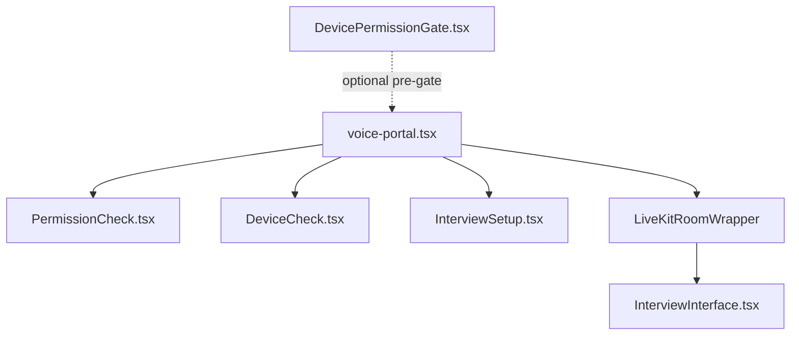
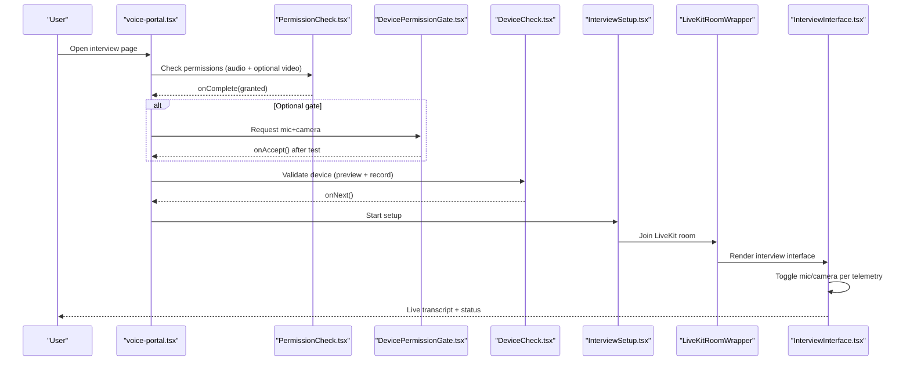
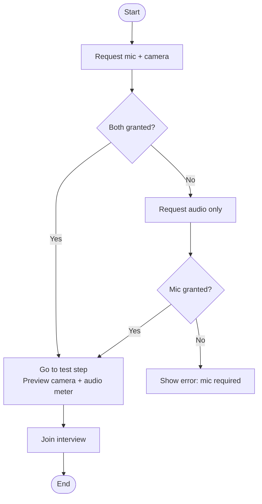
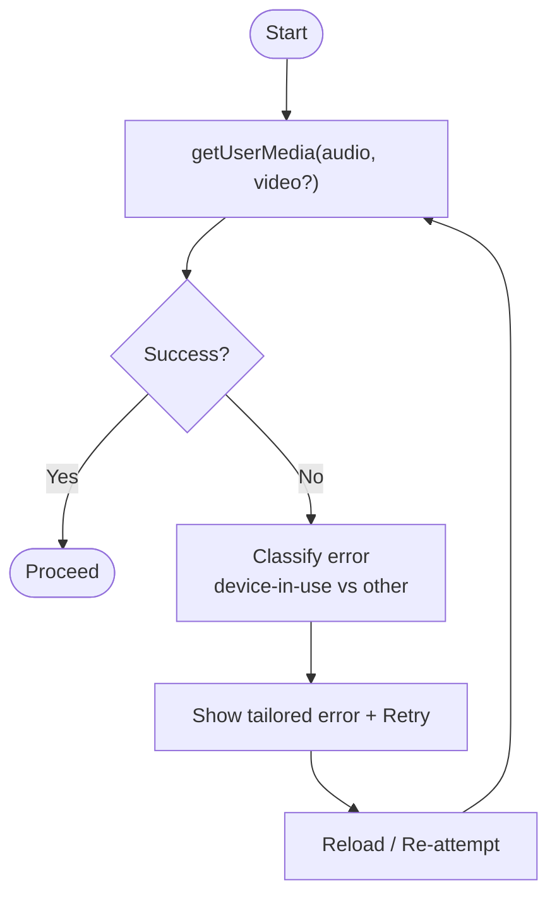
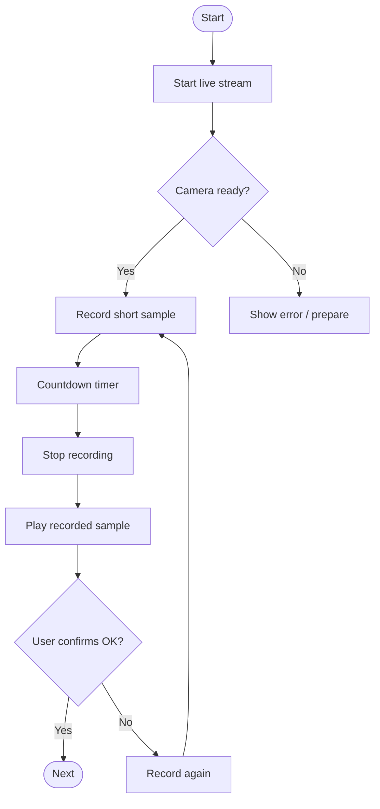
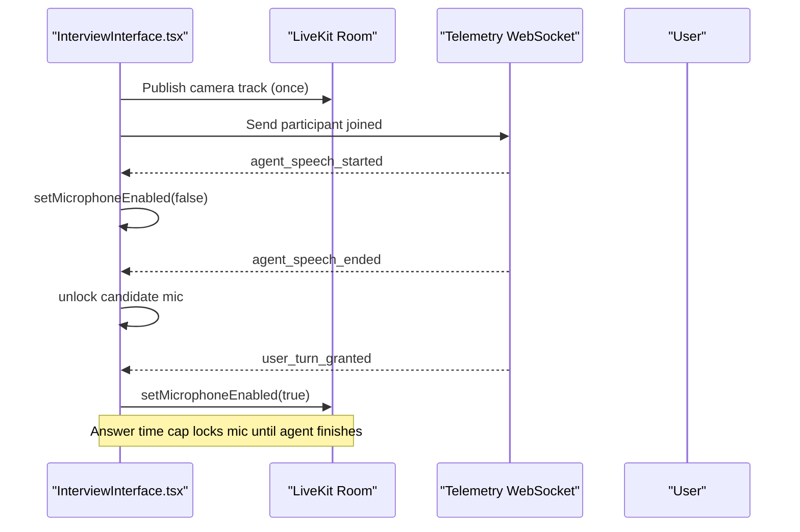
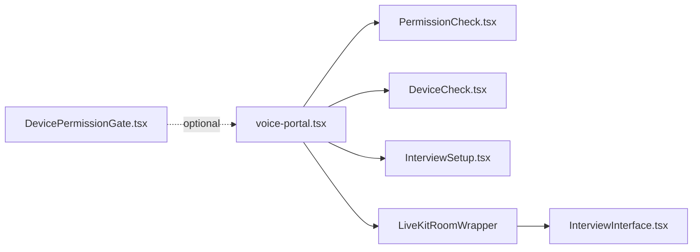

# Device Permission Management

<cite>
**Referenced Files in This Document**
- [DevicePermissionGate.tsx](file://Frontend/components/interviews/voice/DevicePermissionGate.tsx)
- [PermissionCheck.tsx](file://Frontend/components/interviews/voice/PermissionCheck.tsx)
- [DeviceCheck.tsx](file://Frontend/components/interviews/voice/DeviceCheck.tsx)
- [InterviewInterface.tsx](file://Frontend/components/interviews/voice/InterviewInterface.tsx)
- [voice-portal.tsx](file://Frontend/components/interviews/voice/voice-portal.tsx)
</cite>

## Table of Contents
1. [Introduction](#introduction)
2. [Project Structure](#project-structure)
3. [Core Components](#core-components)
4. [Architecture Overview](#architecture-overview)
5. [Detailed Component Analysis](#detailed-component-analysis)
6. [Dependency Analysis](#dependency-analysis)
7. [Performance Considerations](#performance-considerations)
8. [Troubleshooting Guide](#troubleshooting-guide)
9. [Conclusion](#conclusion)

## Introduction
This document explains the device permission management system used during voice and video interviews. It covers how microphone, camera, and audio permissions are requested, validated, and managed across the interview lifecycle. The focus is on:
- DevicePermissionGate: orchestrates permission requests, user denials, and fallback behavior.
- PermissionCheck: detects browser capabilities and existing media access before starting the flow.
- DeviceCheck: validates hardware availability and functionality with live preview and recording.
- InterviewInterface: manages runtime mic/camera toggling, telemetry-driven state, and graceful degradation.
- voice-portal: coordinates the step-by-step flow from permissions to setup to interview.

The system emphasizes user-friendly error messages, retry logic, and graceful degradation when permissions or devices are unavailable.

## Project Structure
The device permission system spans several React components under the voice interview module. The high-level flow is:
- voice-portal controls the step sequence: Permissions → Device check → Setup → Interview.
- PermissionCheck performs an early capability and permission probe.
- DevicePermissionGate (optional pre-check UI) requests both mic and camera, then transitions to a test phase.
- DeviceCheck provides a richer validation experience with live preview, audio level metering, and a short recording sample.
- InterviewInterface integrates with LiveKit and telemetry to manage runtime permissions and degrade gracefully if needed.

**Diagram sources**
- [voice-portal.tsx:155-236](file://Frontend/components/interviews/voice/voice-portal.tsx#L155-L236)
- [PermissionCheck.tsx:15-40](file://Frontend/components/interviews/voice/PermissionCheck.tsx#L15-L40)
- [DeviceCheck.tsx:71-91](file://Frontend/components/interviews/voice/DeviceCheck.tsx#L71-L91)
- [InterviewInterface.tsx:317-332](file://Frontend/components/interviews/voice/InterviewInterface.tsx#L317-L332)

**Section sources**
- [voice-portal.tsx:155-236](file://Frontend/components/interviews/voice/voice-portal.tsx#L155-L236)

## Core Components
- DevicePermissionGate: A guided gate that requests both microphone and camera, falls back to audio-only if camera is denied, previews camera output, and shows a live audio level meter before joining the interview.
- PermissionCheck: A lightweight pre-flight check that attempts to acquire media streams based on requirements and reports success or failure with clear messaging.
- DeviceCheck: A comprehensive device validation component that starts a live stream, records a short sample, displays playback, and requires user confirmation before proceeding.
- InterviewInterface: Runtime manager for mic/camera toggling, telemetry-driven turn-taking, identity frame capture, client-side recording, and graceful degradation when devices are missing or revoked.
- voice-portal: Orchestrates the multi-step interview flow and wires up each stage.

**Section sources**
- [DevicePermissionGate.tsx:33-77](file://Frontend/components/interviews/voice/DevicePermissionGate.tsx#L33-L77)
- [PermissionCheck.tsx:15-40](file://Frontend/components/interviews/voice/PermissionCheck.tsx#L15-L40)
- [DeviceCheck.tsx:71-149](file://Frontend/components/interviews/voice/DeviceCheck.tsx#L71-L149)
- [InterviewInterface.tsx:211-255](file://Frontend/components/interviews/voice/InterviewInterface.tsx#L211-L255)
- [voice-portal.tsx:155-236](file://Frontend/components/interviews/voice/voice-portal.tsx#L155-L236)

## Architecture Overview
The permission architecture follows a staged approach:
- Early capability check via PermissionCheck to fail fast if media APIs are blocked.
- Optional DevicePermissionGate for explicit user consent and immediate feedback.
- DeviceCheck for deeper validation including recording and playback.
- InterviewInterface for runtime control, telemetry-driven state, and robust fallbacks.

**Diagram sources**
- [voice-portal.tsx:155-236](file://Frontend/components/interviews/voice/voice-portal.tsx#L155-L236)
- [PermissionCheck.tsx:15-40](file://Frontend/components/interviews/voice/PermissionCheck.tsx#L15-L40)
- [DevicePermissionGate.tsx:33-77](file://Frontend/components/interviews/voice/DevicePermissionGate.tsx#L33-L77)
- [DeviceCheck.tsx:71-149](file://Frontend/components/interviews/voice/DeviceCheck.tsx#L71-L149)
- [InterviewInterface.tsx:211-255](file://Frontend/components/interviews/voice/InterviewInterface.tsx#L211-L255)

## Detailed Component Analysis

### DevicePermissionGate
Purpose:
- Requests both microphone and camera permissions upfront.
- Provides a two-step UX: request permissions, then test devices with live preview and audio metering.
- Implements fallback to audio-only mode if camera is not available.

Key behaviors:
- Attempts getUserMedia with both audio and video; if video fails, retries audio-only.
- Sets up an AudioContext and AnalyserNode to compute volume levels and display a real-time meter.
- Displays camera preview when available; otherwise indicates audio-only mode.
- Cleans up resources (AudioContext, MediaStream tracks, animation frames) on unmount or join.

Error handling:
- If microphone access is required but denied, shows a clear message instructing the user to allow permissions.

Fallbacks:
- Proceeds in audio-only mode when camera is unavailable, allowing the interview to continue without video.

**Diagram sources**
- [DevicePermissionGate.tsx:33-77](file://Frontend/components/interviews/voice/DevicePermissionGate.tsx#L33-L77)
- [DevicePermissionGate.tsx:79-117](file://Frontend/components/interviews/voice/DevicePermissionGate.tsx#L79-L117)
- [DevicePermissionGate.tsx:119-212](file://Frontend/components/interviews/voice/DevicePermissionGate.tsx#L119-L212)
- [DevicePermissionGate.tsx:214-359](file://Frontend/components/interviews/voice/DevicePermissionGate.tsx#L214-L359)

**Section sources**
- [DevicePermissionGate.tsx:33-77](file://Frontend/components/interviews/voice/DevicePermissionGate.tsx#L33-L77)
- [DevicePermissionGate.tsx:79-117](file://Frontend/components/interviews/voice/DevicePermissionGate.tsx#L79-L117)
- [DevicePermissionGate.tsx:119-212](file://Frontend/components/interviews/voice/DevicePermissionGate.tsx#L119-L212)
- [DevicePermissionGate.tsx:214-359](file://Frontend/components/interviews/voice/DevicePermissionGate.tsx#L214-L359)

### PermissionCheck
Purpose:
- Performs a quick capability and permission probe before entering the main flow.
- Optionally requires camera depending on configuration.

Key behaviors:
- Calls getUserMedia with audio and optional video.
- Immediately stops tracks after probing to avoid holding devices.
- On success, signals completion to proceed to the next step.
- On failure, distinguishes between “device in use” errors and general permission issues, showing tailored messages and a retry action.

Edge cases handled:
- Detects NotReadableError or TrackStartError and common error messages indicating another app or tab is using the camera.
- Presents a friendly error screen explaining required permissions and offering retry.

**Diagram sources**
- [PermissionCheck.tsx:15-40](file://Frontend/components/interviews/voice/PermissionCheck.tsx#L15-L40)
- [PermissionCheck.tsx:85-163](file://Frontend/components/interviews/voice/PermissionCheck.tsx#L85-L163)

**Section sources**
- [PermissionCheck.tsx:15-40](file://Frontend/components/interviews/voice/PermissionCheck.tsx#L15-L40)
- [PermissionCheck.tsx:85-163](file://Frontend/components/interviews/voice/PermissionCheck.tsx#L85-L163)

### DeviceCheck
Purpose:
- Validates hardware availability and functionality through a live preview and a short recorded sample.
- Provides a rich UX with instructions, live audio metering, and playback review.

Key behaviors:
- Starts a MediaStream with audio and video at a specified resolution.
- Uses MediaRecorder to capture a timed sample, stores it as a Blob URL, and allows playback.
- Computes a live microphone level using Web Audio API analyser and smooths values for UI updates.
- Requires user confirmation that devices work correctly before proceeding.

Resource management:
- Stops streams and revokes object URLs on cleanup.
- Clears intervals and cancels animations on unmount.

**Diagram sources**
- [DeviceCheck.tsx:71-91](file://Frontend/components/interviews/voice/DeviceCheck.tsx#L71-L91)
- [DeviceCheck.tsx:99-149](file://Frontend/components/interviews/voice/DeviceCheck.tsx#L99-L149)
- [DeviceCheck.tsx:151-222](file://Frontend/components/interviews/voice/DeviceCheck.tsx#L151-L222)
- [DeviceCheck.tsx:224-228](file://Frontend/components/interviews/voice/DeviceCheck.tsx#L224-L228)

**Section sources**
- [DeviceCheck.tsx:71-91](file://Frontend/components/interviews/voice/DeviceCheck.tsx#L71-L91)
- [DeviceCheck.tsx:99-149](file://Frontend/components/interviews/voice/DeviceCheck.tsx#L99-L149)
- [DeviceCheck.tsx:151-222](file://Frontend/components/interviews/voice/DeviceCheck.tsx#L151-L222)
- [DeviceCheck.tsx:224-228](file://Frontend/components/interviews/voice/DeviceCheck.tsx#L224-L228)

### InterviewInterface
Purpose:
- Manages runtime permission states during the interview, integrating with LiveKit and telemetry.
- Controls microphone enabling/disabling based on agent speaking turns and answer time caps.
- Publishes camera track once the interview starts and handles identity verification by capturing a single frame.
- Implements client-side recording by mixing local mic and remote audio into a final stream.

Key behaviors:
- Toggles microphone with echo cancellation, noise suppression, and auto gain control.
- Listens to telemetry events to update UI states (agent speaking, user turn granted, answer time cap).
- Gracefully degrades when camera is unavailable; continues with audio-only.
- Ensures proper cleanup of audio contexts, MediaRecorder, and LiveKit connections.

**Diagram sources**
- [InterviewInterface.tsx:211-255](file://Frontend/components/interviews/voice/InterviewInterface.tsx#L211-L255)
- [InterviewInterface.tsx:317-332](file://Frontend/components/interviews/voice/InterviewInterface.tsx#L317-L332)
- [InterviewInterface.tsx:522-585](file://Frontend/components/interviews/voice/InterviewInterface.tsx#L522-L585)
- [InterviewInterface.tsx:778-895](file://Frontend/components/interviews/voice/InterviewInterface.tsx#L778-L895)

**Section sources**
- [InterviewInterface.tsx:211-255](file://Frontend/components/interviews/voice/InterviewInterface.tsx#L211-L255)
- [InterviewInterface.tsx:317-332](file://Frontend/components/interviews/voice/InterviewInterface.tsx#L317-L332)
- [InterviewInterface.tsx:522-585](file://Frontend/components/interviews/voice/InterviewInterface.tsx#L522-L585)
- [InterviewInterface.tsx:778-895](file://Frontend/components/interviews/voice/InterviewInterface.tsx#L778-L895)

### voice-portal Orchestration
Purpose:
- Coordinates the step-by-step flow: permissions → device check → setup → interview.
- Wires up callbacks to transition between stages and handle setup failures.

Key behaviors:
- Loads interview data and determines if already completed.
- Renders PermissionCheck first, then DeviceCheck, then InterviewSetup, then LiveKit-based interview.
- Maps setup stages to UI progress and handles errors by returning to setup with a message.

**Section sources**
- [voice-portal.tsx:60-116](file://Frontend/components/interviews/voice/voice-portal.tsx#L60-L116)
- [voice-portal.tsx:155-236](file://Frontend/components/interviews/voice/voice-portal.tsx#L155-L236)

## Dependency Analysis
- voice-portal depends on PermissionCheck, DeviceCheck, InterviewSetup, and LiveKitRoomWrapper to render the full flow.
- DevicePermissionGate is an optional pre-gate that can be used to explicitly request permissions and provide immediate feedback.
- InterviewInterface depends on LiveKit and telemetry to manage runtime permissions and state.
- DeviceCheck and DevicePermissionGate both rely on Web APIs: navigator.mediaDevices.getUserMedia, AudioContext, AnalyserNode, MediaRecorder.

**Diagram sources**
- [voice-portal.tsx:155-236](file://Frontend/components/interviews/voice/voice-portal.tsx#L155-L236)
- [InterviewInterface.tsx:317-332](file://Frontend/components/interviews/voice/InterviewInterface.tsx#L317-L332)

**Section sources**
- [voice-portal.tsx:155-236](file://Frontend/components/interviews/voice/voice-portal.tsx#L155-L236)
- [InterviewInterface.tsx:317-332](file://Frontend/components/interviews/voice/InterviewInterface.tsx#L317-L332)

## Performance Considerations
- Avoid multiple simultaneous getUserMedia calls; reuse existing tracks where possible (e.g., InterviewInterface reuses LiveKit tracks for recording).
- Use requestAnimationFrame for audio level updates to minimize re-renders and maintain smooth UI.
- Close AudioContext and stop MediaStream tracks promptly to free hardware resources.
- Prefer lightweight probes (PermissionCheck) before heavier flows (DeviceCheck) to reduce unnecessary resource usage.
- Implement exponential backoff for telemetry reconnection to avoid overwhelming the server.

[No sources needed since this section provides general guidance]

## Troubleshooting Guide
Common issues and resolutions:
- Camera busy or in use:
  - Detected by PermissionCheck via specific error names/messages; instruct users to close other apps/tabs using the camera and retry.
- Microphone denied:
  - DevicePermissionGate shows a clear message requiring mic access; guide users to browser settings to allow permissions.
- Camera unavailable:
  - DevicePermissionGate proceeds in audio-only mode; DeviceCheck may show preparation state; InterviewInterface continues with audio-only.
- Telemetry connection issues:
  - InterviewInterface reconnects with exponential backoff; on persistent failure, prompts user to refresh.
- Setup failures:
  - voice-portal maps backend errors to user-facing messages and returns to setup stage for correction.

Operational tips:
- Always clean up MediaRecorder chunks and revoke object URLs to prevent memory leaks.
- Ensure AudioContext is resumed on user interaction in some browsers to avoid silent failures.
- Provide retry actions prominently so users can recover from transient issues.

**Section sources**
- [PermissionCheck.tsx:24-40](file://Frontend/components/interviews/voice/PermissionCheck.tsx#L24-L40)
- [PermissionCheck.tsx:85-163](file://Frontend/components/interviews/voice/PermissionCheck.tsx#L85-L163)
- [DevicePermissionGate.tsx:46-57](file://Frontend/components/interviews/voice/DevicePermissionGate.tsx#L46-L57)
- [InterviewInterface.tsx:684-724](file://Frontend/components/interviews/voice/InterviewInterface.tsx#L684-L724)
- [voice-portal.tsx:216-232](file://Frontend/components/interviews/voice/voice-portal.tsx#L216-L232)

## Conclusion
The device permission management system combines proactive checks, guided user flows, and robust runtime controls to ensure a smooth interview experience even when permissions or devices are problematic. By separating concerns across PermissionCheck, DevicePermissionGate, DeviceCheck, and InterviewInterface, the system achieves clarity, resilience, and graceful degradation. The orchestration in voice-portal ensures a predictable, user-friendly journey from initial permission requests through to active interviewing.

[No sources needed since this section summarizes without analyzing specific files]