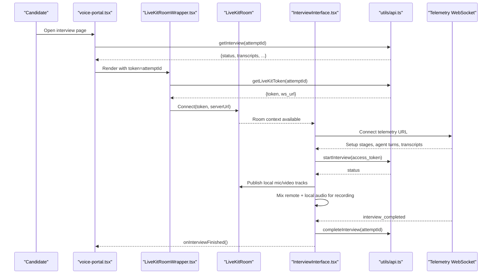
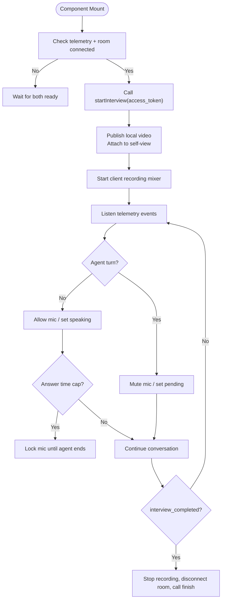
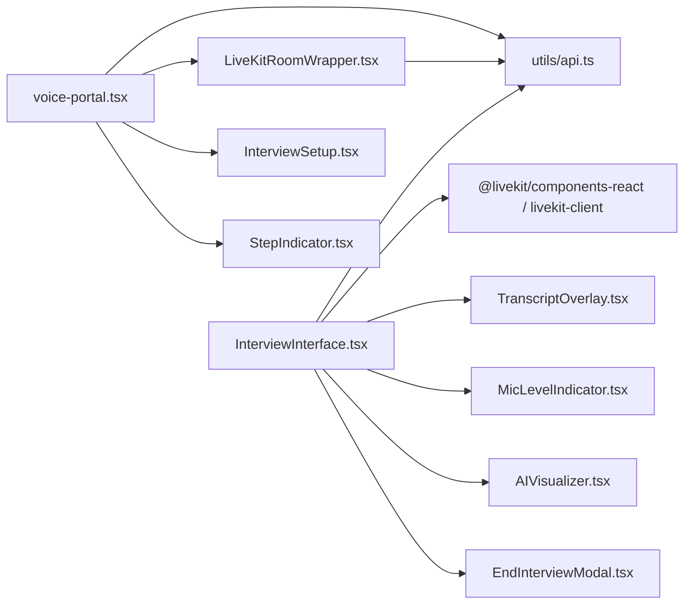

# Interview Interface Components

<cite>
**Referenced Files in This Document**
- [InterviewInterface.tsx](file://Frontend/components/interviews/voice/InterviewInterface.tsx)
- [LiveKitRoomWrapper.tsx](file://Frontend/components/interviews/voice/LiveKitRoomWrapper.tsx)
- [DevicePermissionGate.tsx](file://Frontend/components/interviews/voice/DevicePermissionGate.tsx)
- [MicLevelIndicator.tsx](file://Frontend/components/interviews/voice/MicLevelIndicator.tsx)
- [TranscriptOverlay.tsx](file://Frontend/components/interviews/voice/TranscriptOverlay.tsx)
- [InterviewSetup.tsx](file://Frontend/components/interviews/voice/InterviewSetup.tsx)
- [PermissionCheck.tsx](file://Frontend/components/interviews/voice/PermissionCheck.tsx)
- [AIVisualizer.tsx](file://Frontend/components/interviews/voice/AIVisualizer.tsx)
- [StepIndicator.tsx](file://Frontend/components/interviews/voice/StepIndicator.tsx)
- [EndInterviewModal.tsx](file://Frontend/components/interviews/voice/EndInterviewModal.tsx)
- [voice-portal.tsx](file://Frontend/components/interviews/voice/voice-portal.tsx)
- [livekit-interview-room.tsx](file://Frontend/components/interviews/livekit-interview-room.tsx)
- [api.ts](file://Frontend/utils/api.ts)
</cite>

## Table of Contents
1. Introduction
2. Project Structure
3. Core Components
4. Architecture Overview
5. Detailed Component Analysis
6. Dependency Analysis
7. Performance Considerations
8. Troubleshooting Guide
9. Conclusion
10. Appendices

## Introduction
This document explains the real-time interview interface built with LiveKit. It focuses on the main InterviewInterface component and its child components that handle device permissions, audio/video controls, transcript display, and session lifecycle. It also covers LiveKit room integration, connection management, media stream handling, device permission workflows, microphone level indicators, video preview, error handling, fallback mechanisms, customization options, accessibility, mobile responsiveness, and how to integrate or extend the component library for custom interview flows.

## Project Structure
The voice interview UI is organized under a dedicated feature directory with clear separation of concerns:
- Orchestration and flow control: voice-portal.tsx coordinates steps (permissions, device check, setup, interview).
- LiveKit integration: LiveKitRoomWrapper obtains tokens and renders the LiveKit Room context; livekit-interview-room.tsx provides a simpler demo room entry.
- Main interview UI: InterviewInterface manages telemetry WebSocket events, media tracks, transcription, and session state.
- Device and UX helpers: DevicePermissionGate, PermissionCheck, MicLevelIndicator, AIVisualizer, StepIndicator, EndInterviewModal, TranscriptOverlay, InterviewSetup.

```mermaid
graph TB
subgraph "Orchestration"
VP["voice-portal.tsx"]
SI["StepIndicator.tsx"]
IS["InterviewSetup.tsx"]
end
subgraph "LiveKit Layer"
LKW["LiveKitRoomWrapper.tsx"]
LIR["livekit-interview-room.tsx"]
end
subgraph "Interview UI"
II["InterviewInterface.tsx"]
TO["TranscriptOverlay.tsx"]
ML["MicLevelIndicator.tsx"]
AV["AIVisualizer.tsx"]
EM["EndInterviewModal.tsx"]
end
subgraph "Device & Permissions"
DPG["DevicePermissionGate.tsx"]
PC["PermissionCheck.tsx"]
end
subgraph "API"
API["utils/api.ts"]
end
VP --> LKW
VP --> IS
VP --> SI
LKW --> II
II --> TO
II --> ML
II --> AV
II --> EM
II --> API
LIR --> API
```

**Diagram sources**
- [voice-portal.tsx:60-239](file://Frontend/components/interviews/voice/voice-portal.tsx#L60-L239)
- [LiveKitRoomWrapper.tsx:21-103](file://Frontend/components/interviews/voice/LiveKitRoomWrapper.tsx#L21-L103)
- [InterviewInterface.tsx:74-763](file://Frontend/components/interviews/voice/InterviewInterface.tsx#L74-L763)
- [TranscriptOverlay.tsx:16-93](file://Frontend/components/interviews/voice/TranscriptOverlay.tsx#L16-L93)
- [MicLevelIndicator.tsx:12-118](file://Frontend/components/interviews/voice/MicLevelIndicator.tsx#L12-L118)
- [AIVisualizer.tsx:9-60](file://Frontend/components/interviews/voice/AIVisualizer.tsx#L9-L60)
- [EndInterviewModal.tsx:11-125](file://Frontend/components/interviews/voice/EndInterviewModal.tsx#L11-L125)
- [DevicePermissionGate.tsx:19-359](file://Frontend/components/interviews/voice/DevicePermissionGate.tsx#L19-L359)
- [PermissionCheck.tsx:5-166](file://Frontend/components/interviews/voice/PermissionCheck.tsx#L5-L166)
- [api.ts:54-122](file://Frontend/utils/api.ts#L54-L122)

**Section sources**
- [voice-portal.tsx:60-239](file://Frontend/components/interviews/voice/voice-portal.tsx#L60-L239)
- [LiveKitRoomWrapper.tsx:21-103](file://Frontend/components/interviews/voice/LiveKitRoomWrapper.tsx#L21-L103)
- [InterviewInterface.tsx:74-763](file://Frontend/components/interviews/voice/InterviewInterface.tsx#L74-L763)
- [api.ts:54-122](file://Frontend/utils/api.ts#L54-L122)

## Core Components
- InterviewInterface: Central orchestrator for telemetry events, media publishing, mic/camera toggling, transcript updates, identity verification, and session completion.
- LiveKitRoomWrapper: Fetches LiveKit token and server URL, renders LiveKitRoom with audio renderer, and injects InterviewInterface.
- DevicePermissionGate: Pre-interview permission request with camera preview and microphone level meter.
- MicLevelIndicator: Real-time microphone level visualization using Web Audio analyser.
- TranscriptOverlay: Displays live transcript entries with auto-scroll and speaker labels.
- InterviewSetup: Shows setup stages, progress, instructions, and start button.
- PermissionCheck: Quick permission probe to detect denied or busy devices.
- AIVisualizer: Visual indicator of agent speaking/listening state.
- StepIndicator: Multi-step progress UI used across flows.
- EndInterviewModal: Confirmation modal to end the interview and finalize recording.
- voice-portal.tsx: High-level flow controller coordinating steps and rendering the appropriate screens.

**Section sources**
- [InterviewInterface.tsx:74-763](file://Frontend/components/interviews/voice/InterviewInterface.tsx#L74-L763)
- [LiveKitRoomWrapper.tsx:21-103](file://Frontend/components/interviews/voice/LiveKitRoomWrapper.tsx#L21-L103)
- [DevicePermissionGate.tsx:19-359](file://Frontend/components/interviews/voice/DevicePermissionGate.tsx#L19-L359)
- [MicLevelIndicator.tsx:12-118](file://Frontend/components/interviews/voice/MicLevelIndicator.tsx#L12-L118)
- [TranscriptOverlay.tsx:16-93](file://Frontend/components/interviews/voice/TranscriptOverlay.tsx#L16-L93)
- [InterviewSetup.tsx:28-339](file://Frontend/components/interviews/voice/InterviewSetup.tsx#L28-L339)
- [PermissionCheck.tsx:5-166](file://Frontend/components/interviews/voice/PermissionCheck.tsx#L5-L166)
- [AIVisualizer.tsx:9-60](file://Frontend/components/interviews/voice/AIVisualizer.tsx#L9-L60)
- [StepIndicator.tsx:10-77](file://Frontend/components/interviews/voice/StepIndicator.tsx#L10-L77)
- [EndInterviewModal.tsx:11-125](file://Frontend/components/interviews/voice/EndInterviewModal.tsx#L11-L125)
- [voice-portal.tsx:60-239](file://Frontend/components/interviews/voice/voice-portal.tsx#L60-L239)

## Architecture Overview
The interview flow begins at the portal, which guides users through permissions, device checks, and setup before launching the LiveKit room. The wrapper fetches a token and connects to LiveKit. Inside the room, InterviewInterface establishes a telemetry WebSocket to receive agent turn signals, transcripts, and lifecycle events. Media tracks are published via LiveKit’s local participant APIs. A client-side recording pipeline mixes local mic and remote audio into a single stream for capture.



**Diagram sources**
- [voice-portal.tsx:90-233](file://Frontend/components/interviews/voice/voice-portal.tsx#L90-L233)
- [LiveKitRoomWrapper.tsx:35-103](file://Frontend/components/interviews/voice/LiveKitRoomWrapper.tsx#L35-L103)
- [InterviewInterface.tsx:474-763](file://Frontend/components/interviews/voice/InterviewInterface.tsx#L474-L763)
- [api.ts:54-122](file://Frontend/utils/api.ts#L54-L122)

## Detailed Component Analysis

### InterviewInterface
Responsibilities:
- Telemetry WebSocket management: connect, reconnect with exponential backoff, parse messages, update UI state, and handle errors.
- LiveKit room state synchronization: track connected/disconnected events and only start interview when both telemetry and room are ready.
- Media publishing: publish local video once after interview starts; attach to self-view element; manage mic enable/disable based on agent/user turn signals.
- Client-side recording: build an AudioContext mixer combining local mic and remote audio tracks; record mixed output.
- Identity verification: capture a single frame from the local video track and send it for verification without blocking the interview.
- Transcript handling: map stored and incoming transcript entries, maintain scroll position, compute elapsed time from timestamps.
- Session lifecycle: handle setup stages, completion, failure, timeouts, and finalization including disconnecting room and invoking callbacks.

Key behaviors:
- Microphone gating: automatically enables/disables mic based on agent speaking, pending turns, answer time cap lock, and interview readiness.
- Answer time cap: hard-mutes candidate mic at 2 minutes until agent finishes reply; unlocks on agent speech end or user_turn_granted.
- Fallbacks: UI hints if agent does not speak within a timeout; reconnection logic for telemetry; safe cleanup on unmount.



**Diagram sources**
- [InterviewInterface.tsx:211-332](file://Frontend/components/interviews/voice/InterviewInterface.tsx#L211-L332)
- [InterviewInterface.tsx:458-763](file://Frontend/components/interviews/voice/InterviewInterface.tsx#L458-L763)
- [InterviewInterface.tsx:779-800](file://Frontend/components/interviews/voice/InterviewInterface.tsx#L779-L800)

**Section sources**
- [InterviewInterface.tsx:74-763](file://Frontend/components/interviews/voice/InterviewInterface.tsx#L74-L763)
- [InterviewInterface.tsx:779-800](file://Frontend/components/interviews/voice/InterviewInterface.tsx#L779-L800)

### LiveKitRoomWrapper
Responsibilities:
- Fetch LiveKit token and server URL from backend.
- Render LiveKitRoom with audio renderer disabled by default to allow custom media control.
- Pass telemetry socket URL and callbacks to InterviewInterface.

Error and loading states:
- Displays friendly messages while waiting for token or on connection errors.

**Section sources**
- [LiveKitRoomWrapper.tsx:21-103](file://Frontend/components/interviews/voice/LiveKitRoomWrapper.tsx#L21-L103)

### DevicePermissionGate
Responsibilities:
- Request microphone and camera permissions upfront.
- Provide camera preview and microphone level meter during device check.
- Fallback to audio-only mode if camera is unavailable.

Workflow:
- Attempts getUserMedia with audio+video; falls back to audio-only if needed.
- Uses AnalyserNode to visualize volume and guide user to speak.
- Cleans up streams and contexts on exit.

**Section sources**
- [DevicePermissionGate.tsx:33-117](file://Frontend/components/interviews/voice/DevicePermissionGate.tsx#L33-L117)
- [DevicePermissionGate.tsx:120-359](file://Frontend/components/interviews/voice/DevicePermissionGate.tsx#L120-L359)

### MicLevelIndicator
Responsibilities:
- Visualize current microphone level using an AnalyserNode connected to a provided MediaStreamAudioSourceNode.
- Update bars dynamically and reflect muted state.

Usage:
- Consumed by components that need real-time mic feedback; integrates with shared AudioContext.

**Section sources**
- [MicLevelIndicator.tsx:12-118](file://Frontend/components/interviews/voice/MicLevelIndicator.tsx#L12-L118)

### TranscriptOverlay
Responsibilities:
- Display live transcript entries with speaker labels and auto-scroll.
- Support optional status message while establishing connection.

Accessibility:
- Semantic structure with headings and lists of messages; uses CSS classes for styling.

**Section sources**
- [TranscriptOverlay.tsx:16-93](file://Frontend/components/interviews/voice/TranscriptOverlay.tsx#L16-L93)

### InterviewSetup
Responsibilities:
- Present interview details, instructions, and setup stages.
- Show animated progress and enable/disable start button based on stage.
- Handle fatal errors gracefully.

**Section sources**
- [InterviewSetup.tsx:28-339](file://Frontend/components/interviews/voice/InterviewSetup.tsx#L28-L339)

### PermissionCheck
Responsibilities:
- Probe browser permissions for audio/video.
- Detect “device in use” vs “denied” scenarios and present actionable guidance.

**Section sources**
- [PermissionCheck.tsx:5-166](file://Frontend/components/interviews/voice/PermissionCheck.tsx#L5-L166)

### AIVisualizer
Responsibilities:
- Indicate whether the AI interviewer is speaking or listening.
- Provide visual cues like pulsing rings when speaking.

**Section sources**
- [AIVisualizer.tsx:9-60](file://Frontend/components/interviews/voice/AIVisualizer.tsx#L9-L60)

### StepIndicator
Responsibilities:
- Render multi-step progress with active/completed states.
- Used across permissions, device check, setup, and interview phases.

**Section sources**
- [StepIndicator.tsx:10-77](file://Frontend/components/interviews/voice/StepIndicator.tsx#L10-L77)

### EndInterviewModal
Responsibilities:
- Confirm ending the interview.
- Ensure focus management and keyboard support (Escape to cancel).

**Section sources**
- [EndInterviewModal.tsx:11-125](file://Frontend/components/interviews/voice/EndInterviewModal.tsx#L11-L125)

### voice-portal.tsx
Responsibilities:
- Coordinate step transitions: permissions → device-check → setup → interview.
- Manage interview data fetching, completion state, and error states.
- Render LiveKitRoomWrapper with appropriate uiMode and callbacks.

Integration points:
- Configures voice API endpoints based on kind and attemptId.
- Maps setup stages to UI progress and handles failures.

**Section sources**
- [voice-portal.tsx:60-239](file://Frontend/components/interviews/voice/voice-portal.tsx#L60-L239)
- [voice-portal.tsx:241-289](file://Frontend/components/interviews/voice/voice-portal.tsx#L241-L289)

### livekit-interview-room.tsx
Responsibilities:
- Simple demo room entry that requests a token and joins a LiveKit room with VideoConference.
- Useful reference for basic room joining patterns.

**Section sources**
- [livekit-interview-room.tsx:15-99](file://Frontend/components/interviews/livekit-interview-room.tsx#L15-L99)

## Dependency Analysis
High-level dependencies:
- voice-portal.tsx depends on utils/api.ts for interview data and token retrieval.
- LiveKitRoomWrapper depends on utils/api.ts for token and server URL.
- InterviewInterface depends on LiveKit SDK via @livekit/components-react and livekit-client, plus utils/api.ts for start/complete and identity verification.
- Child components depend on shared styles and icons but have minimal cross-dependencies.



**Diagram sources**
- [voice-portal.tsx:60-239](file://Frontend/components/interviews/voice/voice-portal.tsx#L60-L239)
- [LiveKitRoomWrapper.tsx:21-103](file://Frontend/components/interviews/voice/LiveKitRoomWrapper.tsx#L21-L103)
- [InterviewInterface.tsx:74-763](file://Frontend/components/interviews/voice/InterviewInterface.tsx#L74-L763)
- [api.ts:54-122](file://Frontend/utils/api.ts#L54-L122)

**Section sources**
- [voice-portal.tsx:60-239](file://Frontend/components/interviews/voice/voice-portal.tsx#L60-L239)
- [LiveKitRoomWrapper.tsx:21-103](file://Frontend/components/interviews/voice/LiveKitRoomWrapper.tsx#L21-L103)
- [InterviewInterface.tsx:74-763](file://Frontend/components/interviews/voice/InterviewInterface.tsx#L74-L763)
- [api.ts:54-122](file://Frontend/utils/api.ts#L54-L122)

## Performance Considerations
- Avoid redundant media captures: InterviewInterface reuses existing LocalVideoTrack and mic tracks for recording instead of requesting new getUserMedia calls.
- Efficient audio mixing: Uses Web Audio API to mix remote and local audio into a single destination for recording, minimizing overhead.
- Debounced UI updates: Transcript overlay auto-scrolls only when content changes; mic level updates use requestAnimationFrame for smooth visuals.
- Reconnection strategy: Telemetry WebSocket reconnects with exponential backoff to reduce network churn.
- Cleanup: Properly detach tracks, close AudioContext, and stop media streams on unmount to prevent memory leaks.

[No sources needed since this section provides general guidance]

## Troubleshooting Guide
Common issues and resolutions:
- No microphone access:
  - Ensure browser permissions allow microphone; DevicePermissionGate will prompt and provide guidance.
  - If denied, PermissionCheck detects and instructs retry.
- Camera busy or in use:
  - PermissionCheck identifies NotReadableError or device-in-use conditions and suggests closing other apps/tabs.
- Agent never speaks:
  - InterviewInterface shows a fallback hint after a timeout encouraging the user to say “Hello.”
- Telemetry connection drops:
  - Automatic reconnection with exponential backoff; persistent failures show a user-friendly status.
- Invalid or expired link:
  - Telemetry close code 1008 indicates invalid/expired link; user should refresh or obtain a new link.
- Interview setup failed:
  - InterviewSetup displays error message; user can retry or refresh.

**Section sources**
- [DevicePermissionGate.tsx:33-117](file://Frontend/components/interviews/voice/DevicePermissionGate.tsx#L33-L117)
- [PermissionCheck.tsx:15-166](file://Frontend/components/interviews/voice/PermissionCheck.tsx#L15-L166)
- [InterviewInterface.tsx:677-724](file://Frontend/components/interviews/voice/InterviewInterface.tsx#L677-L724)
- [InterviewInterface.tsx:765-776](file://Frontend/components/interviews/voice/InterviewInterface.tsx#L765-L776)
- [InterviewSetup.tsx:97-122](file://Frontend/components/interviews/voice/InterviewSetup.tsx#L97-L122)

## Conclusion
The interview interface combines a robust orchestration layer with modular components to deliver a seamless real-time experience. InterviewInterface centralizes telemetry, media, and lifecycle management, while supporting flexible device permission flows, live transcription, and client-side recording. The architecture is extensible: you can customize setup stages, add new controls, or integrate alternative media pipelines while preserving the core session flow.

[No sources needed since this section summarizes without analyzing specific files]

## Appendices

### Customization Options
- Styling:
  - Use CSS variables and Tailwind-like utility classes already applied across components (e.g., card, btn, spinner).
  - Override colors and spacing via theme variables referenced in components.
- Accessibility:
  - StepIndicator includes aria-hidden for decorative elements; ensure screen readers can navigate transcript and status messages.
  - EndInterviewModal supports Escape key and focus management.
- Mobile responsiveness:
  - Layouts use flexbox and max-width constraints; DevicePermissionGate and InterviewSetup adapt to smaller screens.
  - Video preview uses aspect-ratio and object-fit for consistent presentation.

[No sources needed since this section provides general guidance]

### Extending the Component Library
- Add new controls:
  - Extend InterviewInterface with additional buttons or toggles; wire them to localParticipant methods for publishing/unpublishing tracks or sending telemetry events.
- Integrate custom interview flows:
  - Modify voice-portal.tsx to insert additional steps between permissions, device-check, setup, and interview.
  - Use InterviewSetup to render custom instructions or quizzes before starting the session.
- Customize telemetry events:
  - Subscribe to or emit additional WebSocket messages in InterviewInterface to drive custom UI states or analytics.

[No sources needed since this section provides general guidance]