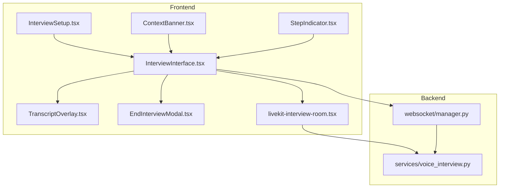
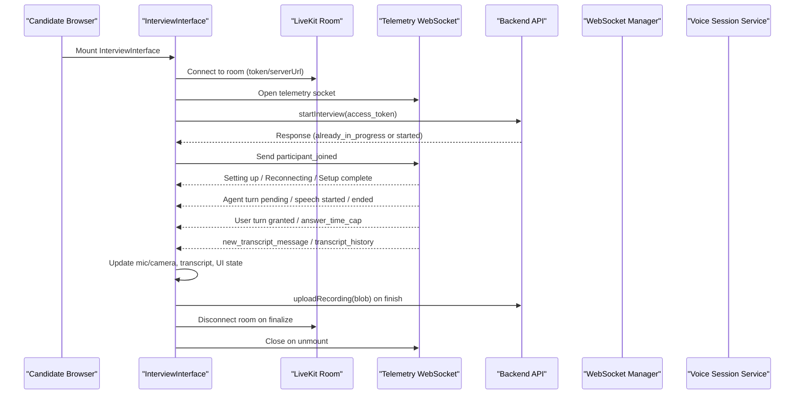
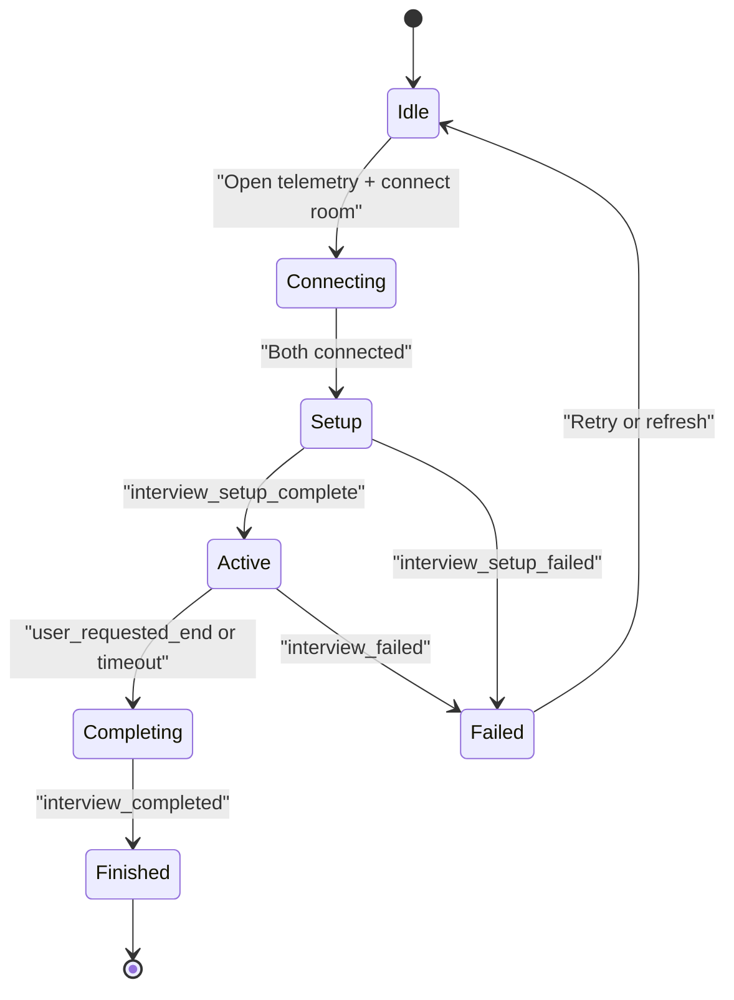
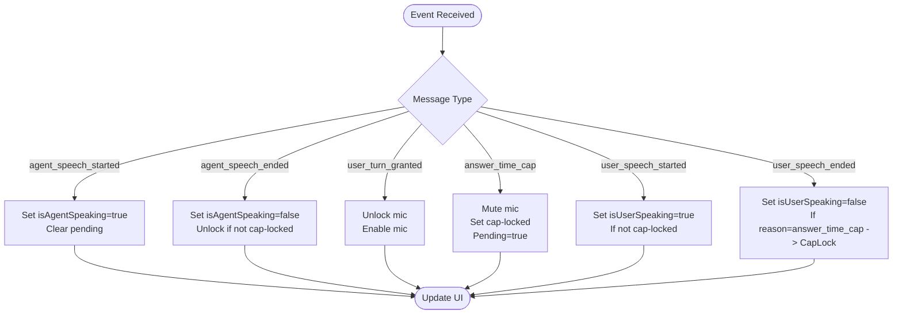
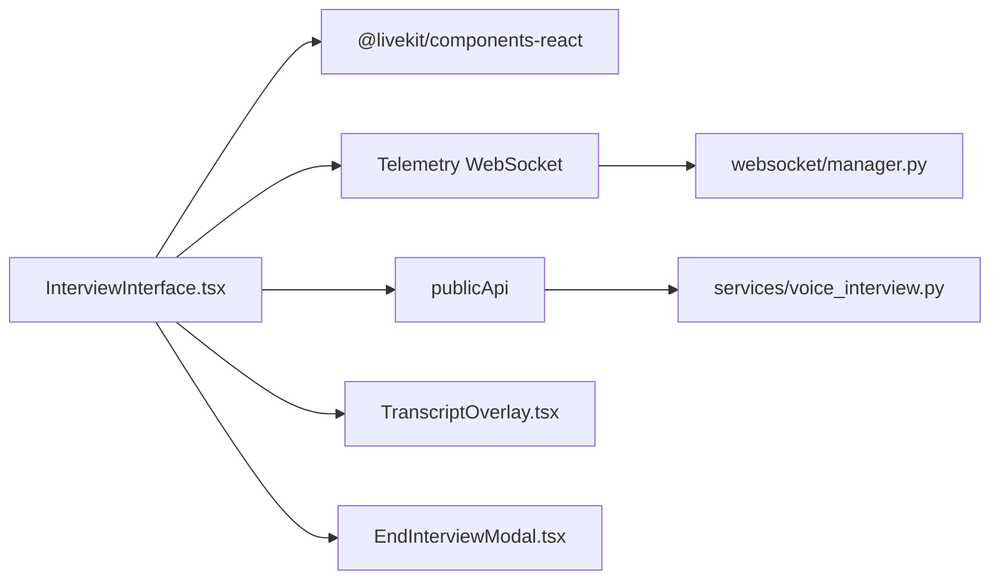

# Interview Workflow & State Management

<cite>
**Referenced Files in This Document**
- [InterviewInterface.tsx](file://Frontend/components/interviews/voice/InterviewInterface.tsx)
- [StepIndicator.tsx](file://Frontend/components/interviews/voice/StepIndicator.tsx)
- [ContextBanner.tsx](file://Frontend/components/interviews/voice/ContextBanner.tsx)
- [TranscriptOverlay.tsx](file://Frontend/components/interviews/voice/TranscriptOverlay.tsx)
- [InterviewSetup.tsx](file://Frontend/components/interviews/voice/InterviewSetup.tsx)
- [EndInterviewModal.tsx](file://Frontend/components/interviews/voice/EndInterviewModal.tsx)
- [livekit-interview-room.tsx](file://Frontend/components/interviews/livekit-interview-room.tsx)
- [tracking.ts](file://Frontend/types/tracking.ts)
- [manager.py](file://Backend/app/websocket/manager.py)
- [voice_interview.py](file://Backend/app/services/voice_interview.py)
</cite>

## Table of Contents
1. Introduction
2. Project Structure
3. Core Components
4. Architecture Overview
5. Detailed Component Analysis
6. Dependency Analysis
7. Performance Considerations
8. Troubleshooting Guide
9. Conclusion

## Introduction
This document explains the end-to-end interview workflow managed by the main InterviewInterface component and its supporting UI components. It covers the lifecycle from setup completion through session termination, state transitions, event handling via telemetry WebSocket, turn-taking logic with backend services, and user interaction flows. It also documents StepIndicator for progress visualization, ContextBanner for status messaging, error handling strategies, recovery mechanisms, and debugging aids.

## Project Structure
The voice interview experience is implemented primarily in the Frontend under components/interviews/voice, with a LiveKit room wrapper and a minimal lobby page. The Backend provides WebSocket management and voice session orchestration that drive real-time events to the client.

**Diagram sources**
- [InterviewInterface.tsx:1-1534](file://Frontend/components/interviews/voice/InterviewInterface.tsx#L1-L1534)
- [StepIndicator.tsx:1-77](file://Frontend/components/interviews/voice/StepIndicator.tsx#L1-L77)
- [ContextBanner.tsx:1-98](file://Frontend/components/interviews/voice/ContextBanner.tsx#L1-L98)
- [TranscriptOverlay.tsx:1-94](file://Frontend/components/interviews/voice/TranscriptOverlay.tsx#L1-L94)
- [InterviewSetup.tsx:1-339](file://Frontend/components/interviews/voice/InterviewSetup.tsx#L1-L339)
- [EndInterviewModal.tsx:1-126](file://Frontend/components/interviews/voice/EndInterviewModal.tsx#L1-L126)
- [livekit-interview-room.tsx:1-100](file://Frontend/components/interviews/livekit-interview-room.tsx#L1-L100)
- [manager.py:1-96](file://Backend/app/websocket/manager.py#L1-L96)
- [voice_interview.py:1-272](file://Backend/app/services/voice_interview.py#L1-L272)

**Section sources**
- [InterviewInterface.tsx:1-1534](file://Frontend/components/interviews/voice/InterviewInterface.tsx#L1-L1534)
- [manager.py:1-96](file://Backend/app/websocket/manager.py#L1-L96)
- [voice_interview.py:1-272](file://Backend/app/services/voice_interview.py#L1-L272)

## Core Components
- InterviewInterface: Orchestrates the interview lifecycle, manages LiveKit room state, telemetry WebSocket connection, turn-taking, transcript updates, media recording, and session finalization.
- StepIndicator: Visualizes multi-step setup progress with active/completed states.
- ContextBanner: Displays interview type, subject name, and elapsed time indicator.
- TranscriptOverlay: Renders live transcript messages with auto-scrolling.
- InterviewSetup: Presents setup stages, instructions, and progress feedback during initialization.
- EndInterviewModal: Confirms user-initiated interview termination and triggers closing flow.
- LiveKitInterviewRoom: Lobby and room join flow using LiveKit token exchange.

Key responsibilities and interactions are detailed in the sections below.

**Section sources**
- [InterviewInterface.tsx:61-1534](file://Frontend/components/interviews/voice/InterviewInterface.tsx#L61-L1534)
- [StepIndicator.tsx:5-77](file://Frontend/components/interviews/voice/StepIndicator.tsx#L5-L77)
- [ContextBanner.tsx:6-98](file://Frontend/components/interviews/voice/ContextBanner.tsx#L6-L98)
- [TranscriptOverlay.tsx:3-94](file://Frontend/components/interviews/voice/TranscriptOverlay.tsx#L3-L94)
- [InterviewSetup.tsx:6-339](file://Frontend/components/interviews/voice/InterviewSetup.tsx#L6-L339)
- [EndInterviewModal.tsx:6-126](file://Frontend/components/interviews/voice/EndInterviewModal.tsx#L6-L126)
- [livekit-interview-room.tsx:15-100](file://Frontend/components/interviews/livekit-interview-room.tsx#L15-L100)

## Architecture Overview
The system coordinates three channels:
- LiveKit Room: Real-time audio/video between candidate and AI agent.
- Telemetry WebSocket: Bi-directional control and status events (turn-taking, transcripts, setup phases).
- HTTP APIs: Start interview, upload recordings, identity verification.

**Diagram sources**
- [InterviewInterface.tsx:474-763](file://Frontend/components/interviews/voice/InterviewInterface.tsx#L474-L763)
- [voice_interview.py:189-227](file://Backend/app/services/voice_interview.py#L189-L227)
- [manager.py:22-88](file://Backend/app/websocket/manager.py#L22-L88)

## Detailed Component Analysis

### InterviewInterface Lifecycle and State Machine
The component drives the interview through these phases:
- Pre-start: Establishes telemetry WebSocket and waits for both telemetry and LiveKit room connectivity before starting the interview.
- Setup: Receives setup stage updates (prompt generation, connecting to room, initializing agents, reconnecting/recovered).
- Active: Manages turn-taking signals (agent_turn_pending, agent_speech_started/ended, user_turn_granted), enforces answer time cap, updates transcript, and controls microphone visibility.
- Completion: Handles interview_completed, stops recording, disconnects room, and navigates to finished screen.

**Diagram sources**
- [InterviewInterface.tsx:474-763](file://Frontend/components/interviews/voice/InterviewInterface.tsx#L474-L763)
- [InterviewInterface.tsx:1501-1534](file://Frontend/components/interviews/voice/InterviewInterface.tsx#L1501-L1534)

#### Turn-Taking Logic
- Agent speaks: agent_speech_started sets isAgentSpeaking; agent_speech_ended clears it and unlocks mic unless answer_time_cap applies.
- User speaks: user_speech_started sets isUserSpeaking; user_speech_ended may enforce answer_time_cap lock.
- Backend grants turn: user_turn_granted explicitly enables mic and clears locks.
- Answer time cap: Hard-mutes after 2 minutes until agent finishes reply; prevents late VAD from reopening mic.

**Diagram sources**
- [InterviewInterface.tsx:505-674](file://Frontend/components/interviews/voice/InterviewInterface.tsx#L505-L674)

#### Media Recording and Identity Check
- Client-side recording mixes local mic and remote agent audio into a WebM stream and uploads upon session end.
- One-shot identity frame capture occurs once camera track is attached; results are recorded but do not block the interview.

**Section sources**
- [InterviewInterface.tsx:317-397](file://Frontend/components/interviews/voice/InterviewInterface.tsx#L317-L397)
- [InterviewInterface.tsx:778-896](file://Frontend/components/interviews/voice/InterviewInterface.tsx#L778-L896)

### StepIndicator Component
Displays a linear step progression with visual cues for completed, active, and pending steps. Used to reflect setup stages driven by telemetry events.

Usage pattern:
- Parent passes current step index and labels array.
- Colors and icons update based on position relative to current step.

**Section sources**
- [StepIndicator.tsx:5-77](file://Frontend/components/interviews/voice/StepIndicator.tsx#L5-L77)

### ContextBanner Component
Shows interview type badge, subject name, and a running timer with a pulsing indicator. Provides persistent context at the top of the interview view.

Props:
- interviewType: Determines label and color mapping.
- subjectName: Displayed prominently.

**Section sources**
- [ContextBanner.tsx:6-98](file://Frontend/components/interviews/voice/ContextBanner.tsx#L6-L98)
- [tracking.ts:3-16](file://Frontend/types/tracking.ts#L3-L16)

### TranscriptOverlay Component
Renders a scrollable transcript with speaker labels and message bubbles. Auto-scrolls to latest entry.

Integration:
- Consumes an array of transcript entries with speaker, text, and optional timestamp.
- Supports custom agent label and styling overrides.

**Section sources**
- [TranscriptOverlay.tsx:3-94](file://Frontend/components/interviews/voice/TranscriptOverlay.tsx#L3-L94)

### InterviewSetup Component
Guides users through setup stages with descriptions, progress bar, and “Anytime now” readiness hint. Integrates with parent callbacks to start the interview and report errors.

Stages:
- Setting Up
- Creating Agent
- Finalizing Setup

Error handling:
- Fatal errors render a dedicated failure view with guidance to retry.

**Section sources**
- [InterviewSetup.tsx:16-339](file://Frontend/components/interviews/voice/InterviewSetup.tsx#L16-L339)

### EndInterviewModal Component
Confirms user intent to end the interview, warns about recording upload and analysis, and supports keyboard accessibility (Escape to cancel).

Behavior:
- Focus management defaults to cancel button.
- Backdrop click cancels; modal content click does not propagate.

**Section sources**
- [EndInterviewModal.tsx:6-126](file://Frontend/components/interviews/voice/EndInterviewModal.tsx#L6-L126)

### LiveKitInterviewRoom Component
Provides a lobby form to collect participant name, fetch a token, and join the LiveKit room with video/audio enabled. Displays errors and resets state on disconnection.

Flow:
- Validate input
- POST /api/interviews/token
- Render LiveKitRoom with token and serverUrl
- Handle onError and onDisconnected

**Section sources**
- [livekit-interview-room.tsx:15-100](file://Frontend/components/interviews/livekit-interview-room.tsx#L15-L100)

## Dependency Analysis
- InterviewInterface depends on:
  - LiveKit React hooks for room/participant state and events.
  - Telemetry WebSocket for control/status messages.
  - Public API for starting interviews and uploading recordings.
  - Child components for UI: TranscriptOverlay, MicLevelIndicator, EndInterviewModal.
- Backend dependencies:
  - WebSocket manager maintains per-session connections and queues pending messages.
  - Voice service orchestrates agent lifecycle and registers sessions.

**Diagram sources**
- [InterviewInterface.tsx:1-1534](file://Frontend/components/interviews/voice/InterviewInterface.tsx#L1-L1534)
- [manager.py:1-96](file://Backend/app/websocket/manager.py#L1-L96)
- [voice_interview.py:1-272](file://Backend/app/services/voice_interview.py#L1-L272)

**Section sources**
- [InterviewInterface.tsx:1-1534](file://Frontend/components/interviews/voice/InterviewInterface.tsx#L1-L1534)
- [manager.py:1-96](file://Backend/app/websocket/manager.py#L1-L96)
- [voice_interview.py:1-272](file://Backend/app/services/voice_interview.py#L1-L272)

## Performance Considerations
- Avoid redundant hardware access: Reuses existing LiveKit tracks for recording to prevent extra getUserMedia calls.
- Efficient audio mixing: Uses Web Audio API to mix local mic and remote agent audio only when needed.
- Transcript rendering: Auto-scroll ensures smooth UX without layout thrashing.
- WebSocket reconnection: Exponential backoff with capped retries reduces network churn.
- Mic enable/disable throttling: Only toggles when necessary based on robust state checks.

[No sources needed since this section provides general guidance]

## Troubleshooting Guide
Common issues and resolutions:
- Telemetry WebSocket closed unexpectedly:
  - Automatic reconnection with exponential backoff; after max retries, prompts user to refresh if interview does not continue.
  - Code 1008 indicates invalid/expired link; instructs user to use a valid link.
- Agent speaking state stuck:
  - Safety timeout clears speaking flags after 45 seconds to prevent UI freeze.
- Microphone access failures:
  - Updates setup status to guide user; resets initialization flags to allow retry.
- Camera not available:
  - Warns and continues without video; self-view remains hidden until track attaches.
- Identity check failures:
  - Non-blocking; logs warnings and proceeds regardless.
- Recording upload failures:
  - Logs warnings; does not block session finalization.

Debugging tools:
- Console logs for telemetry messages and errors.
- Status messages in setup area provide contextual hints.
- Transcript panel shows real-time conversation history for review.

**Section sources**
- [InterviewInterface.tsx:198-209](file://Frontend/components/interviews/voice/InterviewInterface.tsx#L198-L209)
- [InterviewInterface.tsx:228-245](file://Frontend/components/interviews/voice/InterviewInterface.tsx#L228-L245)
- [InterviewInterface.tsx:317-332](file://Frontend/components/interviews/voice/InterviewInterface.tsx#L317-L332)
- [InterviewInterface.tsx:334-378](file://Frontend/components/interviews/voice/InterviewInterface.tsx#L334-L378)
- [InterviewInterface.tsx:677-707](file://Frontend/components/interviews/voice/InterviewInterface.tsx#L677-L707)
- [InterviewInterface.tsx:857-896](file://Frontend/components/interviews/voice/InterviewInterface.tsx#L857-L896)

## Conclusion
The InterviewInterface component centralizes the interview workflow, coordinating LiveKit media, telemetry events, and UI state to deliver a robust, user-friendly interview experience. Supporting components like StepIndicator, ContextBanner, TranscriptOverlay, InterviewSetup, and EndInterviewModal enhance clarity and usability. The backend’s WebSocket manager and voice service ensure reliable event delivery and session orchestration. With built-in error handling, recovery mechanisms, and debugging aids, the system supports resilient operation across varying network conditions and device capabilities.

[No sources needed since this section summarizes without analyzing specific files]