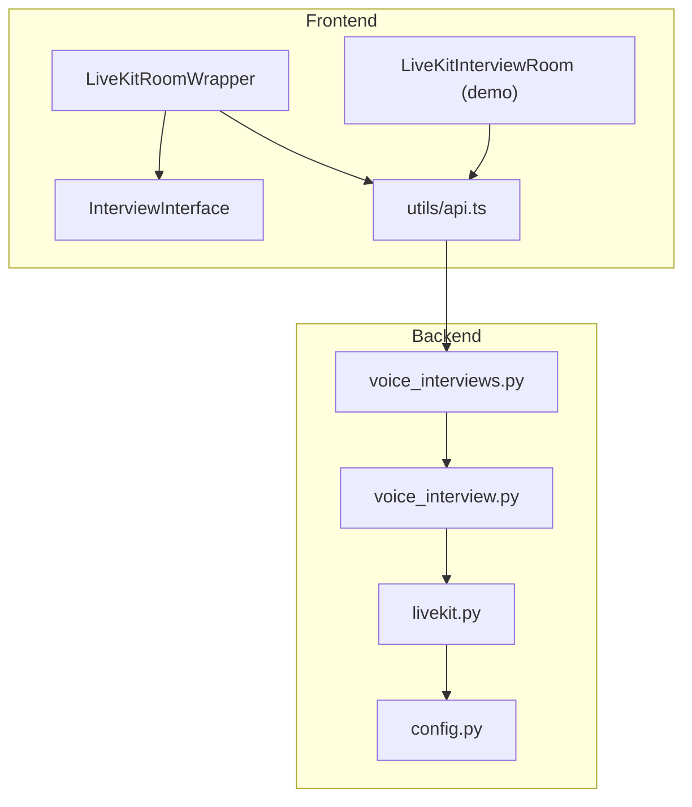
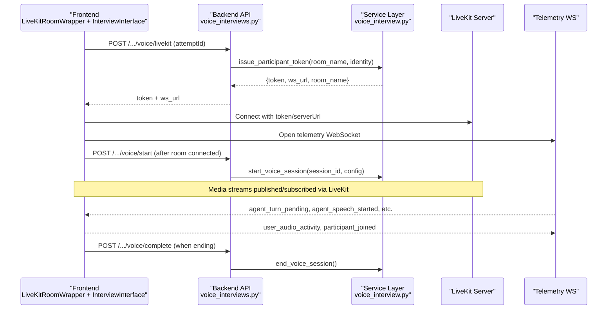
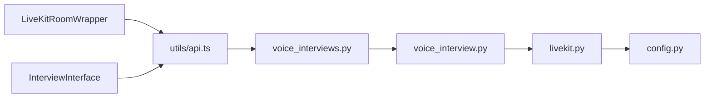

# LiveKit Integration

<cite>
**Referenced Files in This Document**
- [LiveKitRoomWrapper.tsx](file://Frontend/components/interviews/voice/LiveKitRoomWrapper.tsx)
- [InterviewInterface.tsx](file://Frontend/components/interviews/voice/InterviewInterface.tsx)
- [livekit-interview-room.tsx](file://Frontend/components/interviews/livekit-interview-room.tsx)
- [api.ts](file://Frontend/utils/api.ts)
- [voice_interviews.py](file://Backend/app/api/v1/voice_interviews.py)
- [voice_interview.py](file://Backend/app/services/voice_interview.py)
- [livekit.py](file://Backend/app/services/livekit.py)
- [config.py](file://Backend/app/core/config.py)
</cite>

## Table of Contents
1. Introduction
2. Project Structure
3. Core Components
4. Architecture Overview
5. Detailed Component Analysis
6. Dependency Analysis
7. Performance Considerations
8. Troubleshooting Guide
9. Conclusion

## Introduction
This document explains the LiveKit integration layer that powers real-time video/audio communication for interview sessions. It focuses on how the frontend establishes connections, manages room lifecycle and participant events, handles errors and reconnection, and coordinates with backend services to issue tokens and orchestrate AI-driven interviews. It also documents the relationship between LiveKit rooms and interview sessions, including token-based authentication, room isolation, and telemetry-driven control flow.

## Project Structure
The integration spans both frontend and backend:
- Frontend components manage connection setup, media handling, UI state, and telemetry messaging.
- Backend endpoints provide token issuance, session lifecycle management, and telemetry bridging to the agent orchestrator.
- Configuration centralizes LiveKit credentials and behavior.

**Diagram sources**
- [LiveKitRoomWrapper.tsx:1-104](file://Frontend/components/interviews/voice/LiveKitRoomWrapper.tsx#L1-L104)
- [InterviewInterface.tsx:1-1534](file://Frontend/components/interviews/voice/InterviewInterface.tsx#L1-L1534)
- [livekit-interview-room.tsx:1-100](file://Frontend/components/interviews/livekit-interview-room.tsx#L1-L100)
- [api.ts:1-123](file://Frontend/utils/api.ts#L1-L123)
- [voice_interviews.py:1-416](file://Backend/app/api/v1/voice_interviews.py#L1-L416)
- [voice_interview.py:1-272](file://Backend/app/services/voice_interview.py#L1-L272)
- [livekit.py:1-39](file://Backend/app/services/livekit.py#L1-L39)
- [config.py:1-215](file://Backend/app/core/config.py#L1-L215)

**Section sources**
- [LiveKitRoomWrapper.tsx:1-104](file://Frontend/components/interviews/voice/LiveKitRoomWrapper.tsx#L1-L104)
- [InterviewInterface.tsx:1-1534](file://Frontend/components/interviews/voice/InterviewInterface.tsx#L1-L1534)
- [livekit-interview-room.tsx:1-100](file://Frontend/components/interviews/livekit-interview-room.tsx#L1-L100)
- [api.ts:1-123](file://Frontend/utils/api.ts#L1-L123)
- [voice_interviews.py:1-416](file://Backend/app/api/v1/voice_interviews.py#L1-L416)
- [voice_interview.py:1-272](file://Backend/app/services/voice_interview.py#L1-L272)
- [livekit.py:1-39](file://Backend/app/services/livekit.py#L1-L39)
- [config.py:1-215](file://Backend/app/core/config.py#L1-L215)

## Core Components
- LiveKitRoomWrapper: Initializes a LiveKit room using a server-provided token and WebSocket URL, renders audio, and hosts the InterviewInterface.
- InterviewInterface: Manages microphone/video tracks, telemetry WebSocket, transcript display, agent turn control, and recording.
- voice_interviews.py: Exposes endpoints to fetch session data, issue LiveKit tokens, start/complete sessions, and accept telemetry messages.
- voice_interview.py: Builds interview configuration, starts/stops agent sessions, and issues participant tokens via LiveKit SDK.
- livekit.py: Provides a token service wrapper around LiveKit’s AccessToken builder.
- config.py: Centralizes LiveKit settings, TTL validation, and readiness checks.

**Section sources**
- [LiveKitRoomWrapper.tsx:1-104](file://Frontend/components/interviews/voice/LiveKitRoomWrapper.tsx#L1-L104)
- [InterviewInterface.tsx:1-1534](file://Frontend/components/interviews/voice/InterviewInterface.tsx#L1-L1534)
- [voice_interviews.py:1-416](file://Backend/app/api/v1/voice_interviews.py#L1-L416)
- [voice_interview.py:1-272](file://Backend/app/services/voice_interview.py#L1-L272)
- [livekit.py:1-39](file://Backend/app/services/livekit.py#L1-L39)
- [config.py:1-215](file://Backend/app/core/config.py#L1-L215)

## Architecture Overview
The system uses a token-based flow:
- The frontend requests a LiveKit token from the backend using an interview access token.
- The backend validates the attempt, builds or retrieves a room name, and issues a scoped JWT token with room join grants.
- The frontend connects to LiveKit with the token and server URL, then opens a telemetry WebSocket to coordinate agent interactions and UI state.
- The backend bridges telemetry messages to the active conversation agent and updates session state.

**Diagram sources**
- [LiveKitRoomWrapper.tsx:35-101](file://Frontend/components/interviews/voice/LiveKitRoomWrapper.tsx#L35-L101)
- [InterviewInterface.tsx:474-763](file://Frontend/components/interviews/voice/InterviewInterface.tsx#L474-L763)
- [voice_interviews.py:189-236](file://Backend/app/api/v1/voice_interviews.py#L189-L236)
- [voice_interviews.py:306-361](file://Backend/app/api/v1/voice_interviews.py#L306-L361)
- [voice_interviews.py:258-288](file://Backend/app/api/v1/voice_interviews.py#L258-L288)
- [voice_interviews.py:387-416](file://Backend/app/api/v1/voice_interviews.py#L387-L416)
- [voice_interview.py:189-251](file://Backend/app/services/voice_interview.py#L189-L251)
- [api.ts:78-122](file://Frontend/utils/api.ts#L78-L122)

## Detailed Component Analysis

### LiveKitRoomWrapper
Responsibilities:
- Fetches a LiveKit token and WebSocket URL using the interview access token.
- Renders a LiveKitRoom with audio enabled and delegates media control to InterviewInterface.
- Displays loading and error states while preparing the connection.

Key behaviors:
- Token acquisition is performed once per mount; errors are surfaced as user-facing messages.
- Room is created with connect flag and minimal default media toggles; actual mic/camera control happens inside InterviewInterface.

Configuration and usage:
- Props include token, interview metadata, callbacks for completion and finished states, and optional setup mode flags.

**Section sources**
- [LiveKitRoomWrapper.tsx:10-104](file://Frontend/components/interviews/voice/LiveKitRoomWrapper.tsx#L10-L104)

### InterviewInterface
Responsibilities:
- Manages local participant audio/video tracks and publishing.
- Establishes and maintains a telemetry WebSocket to receive agent signals and send user activity.
- Controls microphone enablement based on agent turns and answer time caps.
- Handles transcripts, timers, and client-side recording mix.

Connection state management:
- Tracks LiveKit room connectivity via RoomEvent listeners and only starts the interview when both room and telemetry are connected.
- Uses a retry mechanism with exponential backoff for telemetry reconnection up to a maximum number of retries.

Error handling:
- Gracefully handles telemetry close codes (e.g., policy violation) without auto-retry.
- Updates setup status and UI states on failure events from telemetry.

Media stream handling:
- Creates and publishes a local video track once the interview starts.
- Mixes local mic and remote agent audio into a single stream for recording.
- Attaches/detaches tracks to/from DOM elements and cleans up on unmount.

Participant and room events:
- Subscribes to TrackSubscribed/TrackUnsubscribed to maintain the recording mix.
- Synchronizes local mic state with agent turn signals and user audio activity.

Telemetry message handling:
- Processes agent_turn_pending, agent_speech_started/ended, user_turn_granted, answer_time_cap, new_transcript_message, transcript_history, and completion/failure events.
- Enforces a 2-minute answer cap by muting the candidate until the agent finishes speaking.

Reconnection strategy:
- Telemetry WebSocket reconnects with exponential backoff up to five attempts; after exhaustion, it prompts the user to refresh if needed.

Performance considerations:
- Reuses existing LiveKit tracks for recording to avoid duplicate hardware capture.
- Uses Web Audio API to mix audio efficiently and disconnects all sources on stop.

**Section sources**
- [InterviewInterface.tsx:84-131](file://Frontend/components/interviews/voice/InterviewInterface.tsx#L84-L131)
- [InterviewInterface.tsx:211-255](file://Frontend/components/interviews/voice/InterviewInterface.tsx#L211-L255)
- [InterviewInterface.tsx:317-332](file://Frontend/components/interviews/voice/InterviewInterface.tsx#L317-L332)
- [InterviewInterface.tsx:458-472](file://Frontend/components/interviews/voice/InterviewInterface.tsx#L458-L472)
- [InterviewInterface.tsx:474-724](file://Frontend/components/interviews/voice/InterviewInterface.tsx#L474-L724)
- [InterviewInterface.tsx:726-763](file://Frontend/components/interviews/voice/InterviewInterface.tsx#L726-L763)
- [InterviewInterface.tsx:778-895](file://Frontend/components/interviews/voice/InterviewInterface.tsx#L778-L895)
- [InterviewInterface.tsx:1501-1530](file://Frontend/components/interviews/voice/InterviewInterface.tsx#L1501-L1530)

### Backend Token Issuance and Session Orchestration
Token issuance:
- voice_interviews.py exposes endpoints to issue LiveKit participant tokens for profile and applied interviews.
- voice_interview.py builds the participant token using AccessToken with room join grants and a configurable TTL.
- livekit.py provides a reusable token service class that validates configuration and constructs tokens.

Session lifecycle:
- Start endpoint validates configuration, persists room name and status, and launches an asynchronous task to start the agent session.
- Complete endpoint ends the session, marks status as submitted, and triggers analysis.

Telemetry bridging:
- Telemetry WebSocket endpoints accept client messages and forward relevant signals (e.g., user_requested_end, user_audio_activity) to the active conversation agent.

Room isolation:
- Each interview attempt maps to a unique room name derived from the attempt ID, ensuring isolation between concurrent sessions.

**Section sources**
- [voice_interviews.py:189-236](file://Backend/app/api/v1/voice_interviews.py#L189-L236)
- [voice_interviews.py:306-361](file://Backend/app/api/v1/voice_interviews.py#L306-L361)
- [voice_interviews.py:258-288](file://Backend/app/api/v1/voice_interviews.py#L258-L288)
- [voice_interviews.py:387-416](file://Backend/app/api/v1/voice_interviews.py#L387-L416)
- [voice_interview.py:189-251](file://Backend/app/services/voice_interview.py#L189-L251)
- [livekit.py:10-39](file://Backend/app/services/livekit.py#L10-L39)

### Demo Room Component
A simpler demo component demonstrates joining a room with a form, requesting a token from a Next.js route, and rendering a VideoConference view with basic error handling and disconnect logic.

**Section sources**
- [livekit-interview-room.tsx:15-69](file://Frontend/components/interviews/livekit-interview-room.tsx#L15-L69)

### Frontend API Adapter
Provides a unified interface for voice interview operations:
- getInterview: Retrieves session metadata and transcripts.
- getLiveKitToken: Requests a LiveKit token for the given attempt.
- startInterview: Starts the agent session after room connection.
- completeInterview: Ends the session and triggers analysis.
- verifyIdentity: Sends a one-shot webcam frame for identity verification.
- uploadRecording: Placeholder for recording uploads.
- getTelemetryWsUrl: Derives the WebSocket URL from the HTTP base.

**Section sources**
- [api.ts:1-123](file://Frontend/utils/api.ts#L1-L123)

### Configuration
Centralizes LiveKit settings:
- livekit_url, livekit_api_key, livekit_api_secret define the LiveKit server and credentials.
- livekit_token_ttl_seconds controls token lifetime with validation constraints.
- livekit_ws_url alias supports compatibility with legacy code paths.
- livekit_is_configured and voice_interview_ready properties validate readiness.

**Section sources**
- [config.py:72-76](file://Backend/app/core/config.py#L72-L76)
- [config.py:132-137](file://Backend/app/core/config.py#L132-L137)
- [config.py:161-177](file://Backend/app/core/config.py#L161-L177)

## Dependency Analysis
The following diagram shows key dependencies among components and services:

**Diagram sources**
- [LiveKitRoomWrapper.tsx:35-101](file://Frontend/components/interviews/voice/LiveKitRoomWrapper.tsx#L35-L101)
- [InterviewInterface.tsx:474-763](file://Frontend/components/interviews/voice/InterviewInterface.tsx#L474-L763)
- [api.ts:78-122](file://Frontend/utils/api.ts#L78-L122)
- [voice_interviews.py:189-236](file://Backend/app/api/v1/voice_interviews.py#L189-L236)
- [voice_interview.py:189-251](file://Backend/app/services/voice_interview.py#L189-L251)
- [livekit.py:10-39](file://Backend/app/services/livekit.py#L10-L39)
- [config.py:72-76](file://Backend/app/core/config.py#L72-L76)

**Section sources**
- [LiveKitRoomWrapper.tsx:35-101](file://Frontend/components/interviews/voice/LiveKitRoomWrapper.tsx#L35-L101)
- [InterviewInterface.tsx:474-763](file://Frontend/components/interviews/voice/InterviewInterface.tsx#L474-L763)
- [api.ts:78-122](file://Frontend/utils/api.ts#L78-L122)
- [voice_interviews.py:189-236](file://Backend/app/api/v1/voice_interviews.py#L189-L236)
- [voice_interview.py:189-251](file://Backend/app/services/voice_interview.py#L189-L251)
- [livekit.py:10-39](file://Backend/app/services/livekit.py#L10-L39)
- [config.py:72-76](file://Backend/app/core/config.py#L72-L76)

## Performance Considerations
- Media reuse: Recording mixes reuse existing LiveKit tracks to avoid additional hardware capture overhead.
- Audio mixing: Web Audio API efficiently combines local and remote audio for recording.
- Mic gating: Microphone enablement is controlled by agent turn signals and answer time caps to reduce unnecessary bandwidth and processing.
- Reconnection: Telemetry reconnection uses exponential backoff to minimize network churn during transient failures.
- Device optimization: Microphone settings include auto gain control, echo cancellation, and noise suppression for better audio quality across devices.

[No sources needed since this section provides general guidance]

## Troubleshooting Guide
Common issues and resolutions:
- Token fetch failure: Ensure backend LiveKit configuration is set and accessible; check error messages rendered by LiveKitRoomWrapper.
- Room connection errors: Verify token validity and server URL; inspect LiveKitRoom onError handlers in demo component.
- Telemetry disconnections: Automatic reconnection occurs up to a limit; persistent failures may require refreshing the page.
- Policy violations: Close code 1008 indicates invalid/expired links; do not auto-retry and prompt users to refresh.
- Agent speech stuck: A timeout clears agent speaking state if it remains indefinitely; ensures UI responsiveness.
- Answer time cap: Candidate mic is locked at 2 minutes until agent finishes; ensure agent speech ended event is received.

**Section sources**
- [LiveKitRoomWrapper.tsx:44-70](file://Frontend/components/interviews/voice/LiveKitRoomWrapper.tsx#L44-L70)
- [livekit-interview-room.tsx:53-68](file://Frontend/components/interviews/livekit-interview-room.tsx#L53-L68)
- [InterviewInterface.tsx:677-707](file://Frontend/components/interviews/voice/InterviewInterface.tsx#L677-L707)
- [InterviewInterface.tsx:198-209](file://Frontend/components/interviews/voice/InterviewInterface.tsx#L198-L209)
- [InterviewInterface.tsx:557-585](file://Frontend/components/interviews/voice/InterviewInterface.tsx#L557-L585)

## Conclusion
The LiveKit integration layer provides a robust foundation for real-time interview sessions. The LiveKitRoomWrapper initializes secure connections using server-issued tokens, while InterviewInterface manages media, telemetry, and agent coordination. The backend enforces room isolation through unique room names, issues scoped tokens, and bridges telemetry to the agent orchestrator. Together, these components deliver a resilient, performant, and user-friendly voice/video interview experience with clear error handling and reconnection strategies.

[No sources needed since this section summarizes without analyzing specific files]