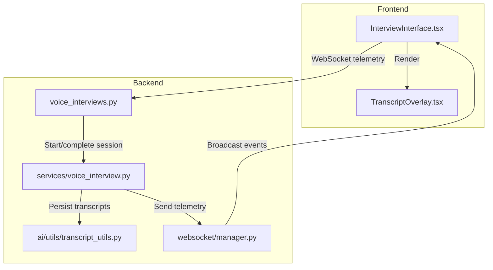
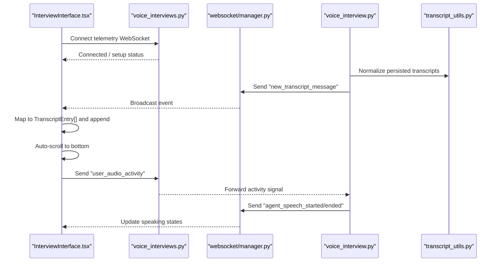
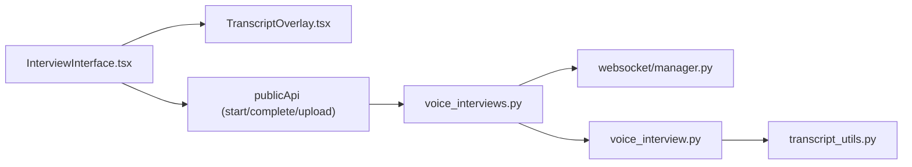

# Transcript Display & Management

<cite>
**Referenced Files in This Document**
- [TranscriptOverlay.tsx](file://Frontend/components/interviews/voice/TranscriptOverlay.tsx)
- [InterviewInterface.tsx](file://Frontend/components/interviews/voice/InterviewInterface.tsx)
- [transcript_utils.py](file://Backend/app/ai/utils/transcript_utils.py)
- [voice_interview.py](file://Backend/app/services/voice_interview.py)
- [manager.py](file://Backend/app/websocket/manager.py)
- [voice_interviews.py](file://Backend/app/api/v1/voice_interviews.py)
</cite>

## Table of Contents
1. Introduction
2. Project Structure
3. Core Components
4. Architecture Overview
5. Detailed Component Analysis
6. Dependency Analysis
7. Performance Considerations
8. Troubleshooting Guide
9. Conclusion

## Introduction
This document explains the transcript display system used to show real-time conversation text during voice interviews. It covers how transcript entries are structured, how the frontend renders and scrolls through messages, how live updates arrive via WebSocket, how persistence works, and how recordings are exported. It also provides guidance for customization, accessibility, and handling large histories.

## Project Structure
The transcript system spans both frontend and backend:
- Frontend components render the live transcript and manage scroll behavior.
- The interview interface component orchestrates WebSocket telemetry, message mapping, and state synchronization.
- Backend services build interview configuration, start/stop sessions, and persist transcripts.
- A WebSocket manager routes telemetry events to connected clients and buffers messages when needed.

**Diagram sources**
- [InterviewInterface.tsx:474-724](file://Frontend/components/interviews/voice/InterviewInterface.tsx#L474-L724)
- [voice_interviews.py:258-288](file://Backend/app/api/v1/voice_interviews.py#L258-L288)
- [manager.py:14-96](file://Backend/app/websocket/manager.py#L14-L96)
- [voice_interview.py:189-227](file://Backend/app/services/voice_interview.py#L189-L227)
- [transcript_utils.py:8-62](file://Backend/app/ai/utils/transcript_utils.py#L8-L62)

**Section sources**
- [InterviewInterface.tsx:1-150](file://Frontend/components/interviews/voice/InterviewInterface.tsx#L1-L150)
- [voice_interviews.py:1-60](file://Backend/app/api/v1/voice_interviews.py#L1-L60)

## Core Components
- TranscriptEntry data structure defines speaker identity, message text, and optional timestamp.
- TranscriptOverlay renders a scrollable list with auto-scrolling on new messages and visual distinction between agent and user messages.
- InterviewInterface manages WebSocket telemetry, maps incoming messages into TranscriptEntry[], handles history loading, and drives UI state (speaking indicators, readiness).
- Backend transcript normalization ensures consistent roles and content across persisted records.
- Voice interview service starts/stops sessions and persists transcripts.
- WebSocket manager connects/disconnects clients and forwards or buffers telemetry events.

**Section sources**
- [TranscriptOverlay.tsx:3-14](file://Frontend/components/interviews/voice/TranscriptOverlay.tsx#L3-L14)
- [InterviewInterface.tsx:13-39](file://Frontend/components/interviews/voice/InterviewInterface.tsx#L13-L39)
- [transcript_utils.py:8-62](file://Backend/app/ai/utils/transcript_utils.py#L8-L62)
- [voice_interview.py:189-227](file://Backend/app/services/voice_interview.py#L189-L227)
- [manager.py:14-96](file://Backend/app/websocket/manager.py#L14-L96)

## Architecture Overview
Real-time transcript flow:
- The frontend establishes a WebSocket connection to the telemetry endpoint.
- On message arrival, it parses event types such as new_transcript_message and transcript_history.
- New messages are appended to local state; history replaces current state and computes elapsed time from timestamps.
- The transcript overlay automatically scrolls to the latest message.
- Backend normalizes stored transcripts and broadcasts events via the WebSocket manager.

**Diagram sources**
- [InterviewInterface.tsx:474-724](file://Frontend/components/interviews/voice/InterviewInterface.tsx#L474-L724)
- [voice_interviews.py:258-288](file://Backend/app/api/v1/voice_interviews.py#L258-L288)
- [manager.py:48-89](file://Backend/app/websocket/manager.py#L48-L89)
- [voice_interview.py:189-227](file://Backend/app/services/voice_interview.py#L189-L227)
- [transcript_utils.py:8-62](file://Backend/app/ai/utils/transcript_utils.py#L8-L62)

## Detailed Component Analysis

### TranscriptOverlay Component
Responsibilities:
- Renders a list of TranscriptEntry items with speaker labels and styled bubbles.
- Auto-scrolls to the latest message whenever the transcript array changes.
- Shows a loading indicator while no messages are present.

Key behaviors:
- Speaker identification: “agent” vs “user” determines alignment and bubble styling.
- Scroll behavior: uses a ref to set scrollTop to scrollHeight after each update.
- Customization: accepts style overrides and an agent label prop to customize the displayed name.

Accessibility considerations:
- The component itself does not include explicit aria attributes; consumers should ensure surrounding context provides appropriate roles and labels if needed.

**Section sources**
- [TranscriptOverlay.tsx:3-14](file://Frontend/components/interviews/voice/TranscriptOverlay.tsx#L3-L14)
- [TranscriptOverlay.tsx:16-94](file://Frontend/components/interviews/voice/TranscriptOverlay.tsx#L16-L94)

### InterviewInterface Component
Responsibilities:
- Manages WebSocket telemetry lifecycle, including reconnection and error handling.
- Parses telemetry events and updates UI state (speaking, turn pending, ready).
- Maps incoming transcript payloads into TranscriptEntry[] using robust field mapping.
- Handles transcript history and computes elapsed time from timestamps.
- Integrates LiveKit audio/video tracks and client-side recording upload.

Real-time updates:
- Listens for events like new_transcript_message, transcript_history, agent_speech_started/ended, user_turn_granted, answer_time_cap, and completion signals.
- Updates local transcript state and scrolls to the latest message.

Message filtering and search:
- No built-in filter/search is implemented in this component. Filtering/search can be added by deriving a filtered view from the transcript array before rendering.

Large conversation histories:
- Current implementation appends messages and keeps all in memory. For very long sessions, consider virtualized lists or pagination strategies at the UI layer.

Export capabilities:
- Client-side recording is captured and uploaded to the backend for later retrieval. Transcript export can be implemented by serializing the transcript array to JSON or CSV and triggering a download.

**Section sources**
- [InterviewInterface.tsx:13-39](file://Frontend/components/interviews/voice/InterviewInterface.tsx#L13-L39)
- [InterviewInterface.tsx:474-724](file://Frontend/components/interviews/voice/InterviewInterface.tsx#L474-L724)
- [InterviewInterface.tsx:857-899](file://Frontend/components/interviews/voice/InterviewInterface.tsx#L857-L899)
- [InterviewInterface.tsx:1331-1495](file://Frontend/components/interviews/voice/InterviewInterface.tsx#L1331-L1495)

### Data Structures and Normalization
TranscriptEntry:
- Fields: speaker (“agent” | “user”), text (string), timestamp (optional string).

Normalization:
- Backend utility normalizes various stored formats to a consistent role/content/timestamp shape, collapsing multi-part content and filtering empty entries.

Speaker identification:
- Frontend mapping treats multiple role variants (e.g., “candidate”, “participant”) as “user”; others become “agent”.

Timestamp handling:
- Timestamps are preserved as strings and used to compute elapsed time from the earliest message.

**Section sources**
- [InterviewInterface.tsx:13-39](file://Frontend/components/interviews/voice/InterviewInterface.tsx#L13-L39)
- [transcript_utils.py:8-62](file://Backend/app/ai/utils/transcript_utils.py#L8-L62)

### WebSocket Integration and Telemetry
Endpoints:
- Telemetry WebSocket endpoints accept connections per attempt/session and forward specific client signals to the active agent.

Event flow:
- Backend sends telemetry events (e.g., new_transcript_message, speech started/ended) via the WebSocket manager.
- Frontend listens and updates UI accordingly.

Reconnection:
- Frontend implements exponential backoff retries and clears timers on unmount.

**Section sources**
- [voice_interviews.py:258-288](file://Backend/app/api/v1/voice_interviews.py#L258-L288)
- [voice_interviews.py:387-416](file://Backend/app/api/v1/voice_interviews.py#L387-L416)
- [manager.py:14-96](file://Backend/app/websocket/manager.py#L14-L96)
- [InterviewInterface.tsx:474-724](file://Frontend/components/interviews/voice/InterviewInterface.tsx#L474-L724)

### Persistence and Export
Persistence:
- Transcripts are normalized and persisted as part of the interview session. History is sent to the client via transcript_history events.

Recording export:
- Client-side MediaRecorder captures video/audio and uploads to the backend upon completion. The backend stores the file and serves it for playback.

Transcript export:
- Not implemented in the referenced files. You can add a feature to serialize the transcript array to JSON/CSV and trigger a browser download.

**Section sources**
- [voice_interview.py:189-227](file://Backend/app/services/voice_interview.py#L189-L227)
- [InterviewInterface.tsx:857-899](file://Frontend/components/interviews/voice/InterviewInterface.tsx#L857-L899)

## Dependency Analysis
- InterviewInterface depends on TranscriptOverlay for rendering and on LiveKit hooks for media.
- InterviewInterface consumes public API methods for starting/completing interviews and uploading recordings.
- Backend voice_interviews routes depend on voice_interview service and websocket manager.
- transcript_utils is used to normalize stored transcripts before broadcasting or returning session payloads.

**Diagram sources**
- [InterviewInterface.tsx:474-724](file://Frontend/components/interviews/voice/InterviewInterface.tsx#L474-L724)
- [voice_interviews.py:258-288](file://Backend/app/api/v1/voice_interviews.py#L258-L288)
- [voice_interview.py:189-227](file://Backend/app/services/voice_interview.py#L189-L227)
- [transcript_utils.py:8-62](file://Backend/app/ai/utils/transcript_utils.py#L8-L62)

**Section sources**
- [InterviewInterface.tsx:1-150](file://Frontend/components/interviews/voice/InterviewInterface.tsx#L1-L150)
- [voice_interviews.py:1-60](file://Backend/app/api/v1/voice_interviews.py#L1-L60)

## Performance Considerations
- Rendering: Keeping all messages in memory may impact performance for very long sessions. Consider virtualization or windowed rendering if needed.
- Scrolling: Auto-scroll on every update is efficient for typical lengths; for extremely large histories, debounce or use intersection observers to avoid layout thrashing.
- WebSocket: Reconnection logic includes exponential backoff; ensure message deduplication if necessary.
- Recording: MediaRecorder chunks are accumulated; ensure cleanup of audio nodes and streams to prevent memory leaks.

[No sources needed since this section provides general guidance]

## Troubleshooting Guide
Common issues and resolutions:
- No transcript appears: Check that telemetry WebSocket connects and receives transcript_history or new_transcript_message events. Verify backend normalization returns non-empty content.
- Agent speaking state stuck: Ensure agent_speech_ended events clear flags; timeouts exist to reset stale states.
- Mic remains muted: Confirm user_turn_granted or answer_time_cap handling; verify microphone permission and LiveKit track publishing.
- Recording not uploaded: Validate MediaRecorder stream availability and backend upload endpoint response.

**Section sources**
- [InterviewInterface.tsx:474-724](file://Frontend/components/interviews/voice/InterviewInterface.tsx#L474-L724)
- [InterviewInterface.tsx:857-899](file://Frontend/components/interviews/voice/InterviewInterface.tsx#L857-L899)
- [manager.py:48-89](file://Backend/app/websocket/manager.py#L48-L89)

## Conclusion
The transcript system combines a lightweight React overlay with a robust telemetry pipeline. It supports real-time updates, persistent history, and recording export. While search/filter and explicit accessibility attributes are not included in the referenced components, they can be added around the existing data structures and rendering logic. For large conversations, consider virtualization and debounced scrolling to maintain responsiveness.

[No sources needed since this section summarizes without analyzing specific files]