# UI Component Library

<cite>
**Referenced Files in This Document**
- [button.tsx](file://Frontend/components/ui/button.tsx)
- [pill.tsx](file://Frontend/components/ui/pill.tsx)
- [table.tsx](file://Frontend/components/ui/table.tsx)
- [score-badge.tsx](file://Frontend/components/ui/score-badge.tsx)
- [state.tsx](file://Frontend/components/ui/state.tsx)
- [attention-queue-card.tsx](file://Frontend/components/ui/attention-queue-card.tsx)
- [authed-image.tsx](file://Frontend/components/ui/authed-image.tsx)
- [pack-chip.tsx](file://Frontend/components/ui/pack-chip.tsx)
- [cn.ts](file://Frontend/lib/cn.ts)
- [globals.css](file://Frontend/app/globals.css)
- [package.json](file://Frontend/package.json)
- [vitest.config.ts](file://Frontend/vitest.config.ts)
- [components.test.tsx](file://Frontend/tests/components.test.tsx)
- [next.config.ts](file://Frontend/next.config.ts)
</cite>

## Table of Contents
1. Introduction
2. Project Structure
3. Core Components
4. Architecture Overview
5. Detailed Component Analysis
6. Dependency Analysis
7. Performance Considerations
8. Troubleshooting Guide
9. Conclusion
10. Appendices

## Introduction
This document describes the reusable UI component library built with React and Tailwind CSS within the Frontend application. It covers each component’s props, styling options, usage patterns, design system principles (color scheme, typography, spacing), accessibility features (ARIA attributes and keyboard support), responsive behavior, cross-browser considerations, composition strategies, customization via props, theme overrides, testing approaches, and guidelines for creating new components that follow established patterns.

## Project Structure
The component library lives under Frontend/components/ui and is styled using global CSS tokens defined in app/globals.css. A small utility cn helper composes class names safely. Tests are written with Vitest and Testing Library.

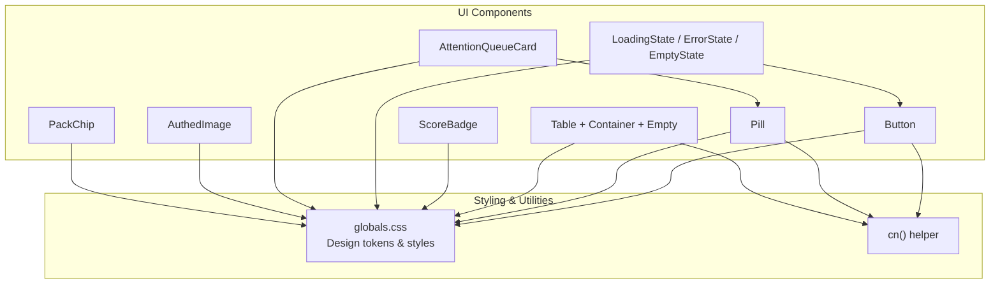

**Diagram sources**
- [button.tsx:1-26](file://Frontend/components/ui/button.tsx#L1-L26)
- [pill.tsx:1-24](file://Frontend/components/ui/pill.tsx#L1-L24)
- [table.tsx:1-19](file://Frontend/components/ui/table.tsx#L1-L19)
- [score-badge.tsx:1-13](file://Frontend/components/ui/score-badge.tsx#L1-L13)
- [state.tsx:1-46](file://Frontend/components/ui/state.tsx#L1-L46)
- [attention-queue-card.tsx:1-38](file://Frontend/components/ui/attention-queue-card.tsx#L1-L38)
- [authed-image.tsx:1-60](file://Frontend/components/ui/authed-image.tsx#L1-L60)
- [pack-chip.tsx:1-9](file://Frontend/components/ui/pack-chip.tsx#L1-L9)
- [cn.ts:1-6](file://Frontend/lib/cn.ts#L1-L6)
- [globals.css:1-418](file://Frontend/app/globals.css#L1-L418)

**Section sources**
- [globals.css:1-418](file://Frontend/app/globals.css#L1-L418)
- [cn.ts:1-6](file://Frontend/lib/cn.ts#L1-L6)
- [package.json:1-36](file://Frontend/package.json#L1-L36)

## Core Components
- Button: A semantic button with variant and size modifiers. Uses a class-name combiner to merge classes.
- Pill: A status chip with multiple tones for conveying state or category.
- Table: A set of table primitives (container, table, empty row) for consistent data presentation.
- ScoreBadge: Displays a score band with color and label semantics.
- State: Reusable states for loading, error, and empty content with accessible roles and live regions.
- AttentionQueueCard: A composite card combining icon, pill count, title, detail, and action link.
- AuthedImage: Secure image loader for protected endpoints with tokenized requests.
- PackChip: An informational chip indicating the active domain pack with an accessible label.

Key styling approach:
- All components rely on CSS custom properties (design tokens) for colors, surfaces, borders, focus, and shadows.
- Class naming follows a BEM-like convention (e.g., .button--primary, .pill--brand).
- The cn utility merges conditional classes cleanly.

Accessibility highlights:
- LoadingState uses role="status" and aria-live="polite".
- ErrorState uses role="alert" for immediate feedback.
- PackChip exposes an aria-label describing the active pack.
- Buttons inherit native semantics; disabled state is preserved.

Responsive behavior:
- Global media queries adjust layout density, navigation visibility, and grid columns across breakpoints.
- Tables provide horizontal scrolling when needed while keeping the first column sticky.

Cross-browser considerations:
- Focus-visible outlines ensure keyboard users see focus.
- Reduced motion preferences are respected globally.

**Section sources**
- [button.tsx:1-26](file://Frontend/components/ui/button.tsx#L1-L26)
- [pill.tsx:1-24](file://Frontend/components/ui/pill.tsx#L1-L24)
- [table.tsx:1-19](file://Frontend/components/ui/table.tsx#L1-L19)
- [score-badge.tsx:1-13](file://Frontend/components/ui/score-badge.tsx#L1-L13)
- [state.tsx:1-46](file://Frontend/components/ui/state.tsx#L1-L46)
- [attention-queue-card.tsx:1-38](file://Frontend/components/ui/attention-queue-card.tsx#L1-L38)
- [authed-image.tsx:1-60](file://Frontend/components/ui/authed-image.tsx#L1-L60)
- [pack-chip.tsx:1-9](file://Frontend/components/ui/pack-chip.tsx#L1-L9)
- [globals.css:102-189](file://Frontend/app/globals.css#L102-L189)
- [globals.css:161-175](file://Frontend/app/globals.css#L161-L175)
- [globals.css:417-418](file://Frontend/app/globals.css#L417-L418)

## Architecture Overview
The library is a flat collection of small, focused components that compose into larger screens. Styling is centralized in globals.css through CSS variables and component-specific classes. There is no runtime theme engine; customization happens by overriding CSS variables or passing className props where supported.

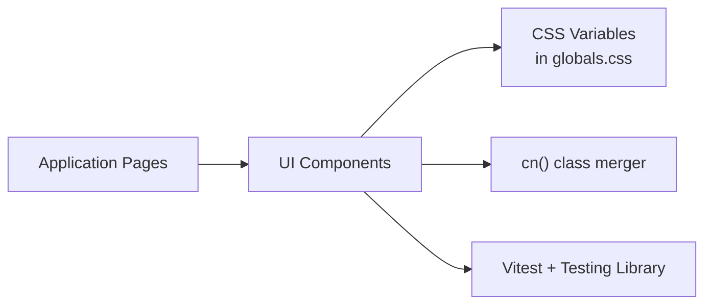

**Diagram sources**
- [globals.css:3-36](file://Frontend/app/globals.css#L3-L36)
- [cn.ts:1-6](file://Frontend/lib/cn.ts#L1-L6)
- [vitest.config.ts:1-17](file://Frontend/vitest.config.ts#L1-L17)
- [components.test.tsx:1-22](file://Frontend/tests/components.test.tsx#L1-L22)

## Detailed Component Analysis

### Button
- Purpose: Primary interactive element with variants and sizes.
- Props:
  - variant: "primary" | "secondary" | "ghost" | "danger"
  - size: "small" | "default"
  - Standard HTML button attributes via spread
- Styling:
  - Base class .button plus modifier classes for variant and size.
  - Hover and disabled states defined in global styles.
- Accessibility:
  - Native button semantics; disabled state preserved.
  - Focus-visible outline provided globally.
- Usage pattern:
  - Compose with icons or text; use variant to indicate emphasis and size for dense layouts.

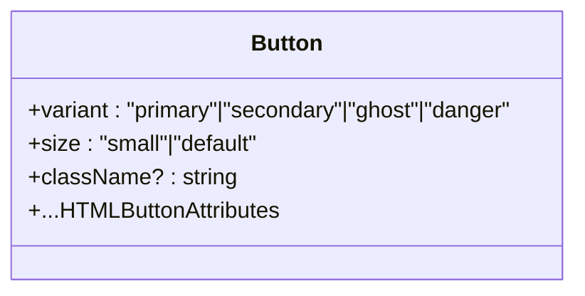

**Diagram sources**
- [button.tsx:1-26](file://Frontend/components/ui/button.tsx#L1-L26)
- [globals.css:102-107](file://Frontend/app/globals.css#L102-L107)

**Section sources**
- [button.tsx:1-26](file://Frontend/components/ui/button.tsx#L1-L26)
- [globals.css:102-107](file://Frontend/app/globals.css#L102-L107)

### Pill
- Purpose: Status or category chip with tone-based coloring.
- Props:
  - children: ReactNode
  - tone: "neutral" | "brand" | "verified" | "attention" | "danger" | "success" | "approval"
  - className?: string
- Styling:
  - Base .pill plus .pill--{tone} modifiers.
  - Dot indicator via pseudo-element.
- Accessibility:
  - Always pairs color with visible text content.
- Usage pattern:
  - Use for tags, statuses, badges; avoid relying solely on color.

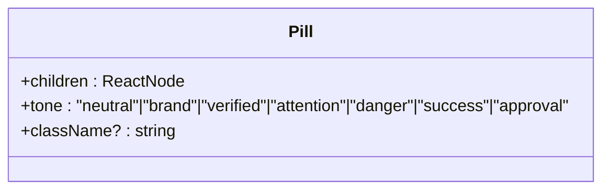

**Diagram sources**
- [pill.tsx:1-24](file://Frontend/components/ui/pill.tsx#L1-L24)
- [globals.css:126-128](file://Frontend/app/globals.css#L126-L128)

**Section sources**
- [pill.tsx:1-24](file://Frontend/components/ui/pill.tsx#L1-L24)
- [globals.css:126-128](file://Frontend/app/globals.css#L126-L128)

### Table Primitives
- Purpose: Consistent data tables with container and empty state.
- Exports:
  - TableContainer: wrapper div with scroll-friendly container class.
  - Table: base table element with consistent styling.
  - TableEmpty: full-width empty row with colSpan.
- Styling:
  - .table-container, .table, .table__empty.
  - Sticky first column and hover rows.
- Accessibility:
  - Semantic table structure; pair with proper headers and scope attributes in usage.
- Usage pattern:
  - Wrap data tables in TableContainer; use TableEmpty when there are no rows.

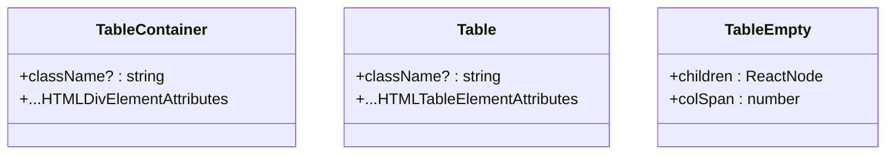

**Diagram sources**
- [table.tsx:1-19](file://Frontend/components/ui/table.tsx#L1-L19)
- [globals.css:133-142](file://Frontend/app/globals.css#L133-L142)

**Section sources**
- [table.tsx:1-19](file://Frontend/components/ui/table.tsx#L1-L19)
- [globals.css:133-142](file://Frontend/app/globals.css#L133-L142)

### ScoreBadge
- Purpose: Visual score band with numeric value and label.
- Props:
  - score: number | null
  - label?: string
- Logic:
  - Bands: strong (>=70), moderate (>=45), weak (<45), none (null/undefined).
  - Default labels per band if not provided.
- Styling:
  - .score-badge--strong|moderate|weak|none.
- Accessibility:
  - Color paired with explicit numeric value and label.

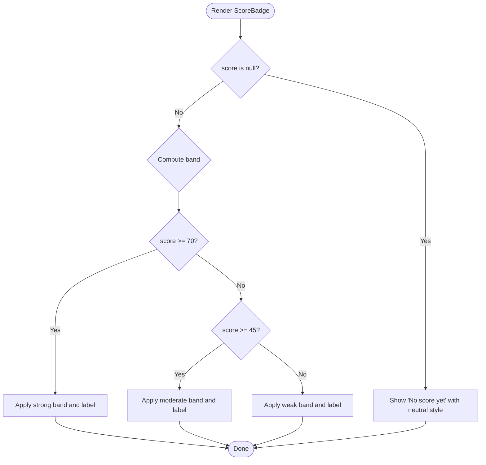

**Diagram sources**
- [score-badge.tsx:1-13](file://Frontend/components/ui/score-badge.tsx#L1-L13)
- [globals.css:184-189](file://Frontend/app/globals.css#L184-L189)

**Section sources**
- [score-badge.tsx:1-13](file://Frontend/components/ui/score-badge.tsx#L1-L13)
- [globals.css:184-189](file://Frontend/app/globals.css#L184-L189)

### State Components (Loading, Error, Empty)
- Purpose: Provide consistent user feedback for async operations and empty/error states.
- Exports:
  - LoadingState: spinner with polite live region.
  - ErrorState: message with optional retry button.
  - EmptyState: title and optional action slot.
- Accessibility:
  - LoadingState uses role="status" and aria-live="polite".
  - ErrorState uses role="alert".
- Composition:
  - ErrorState composes Button for retry actions.

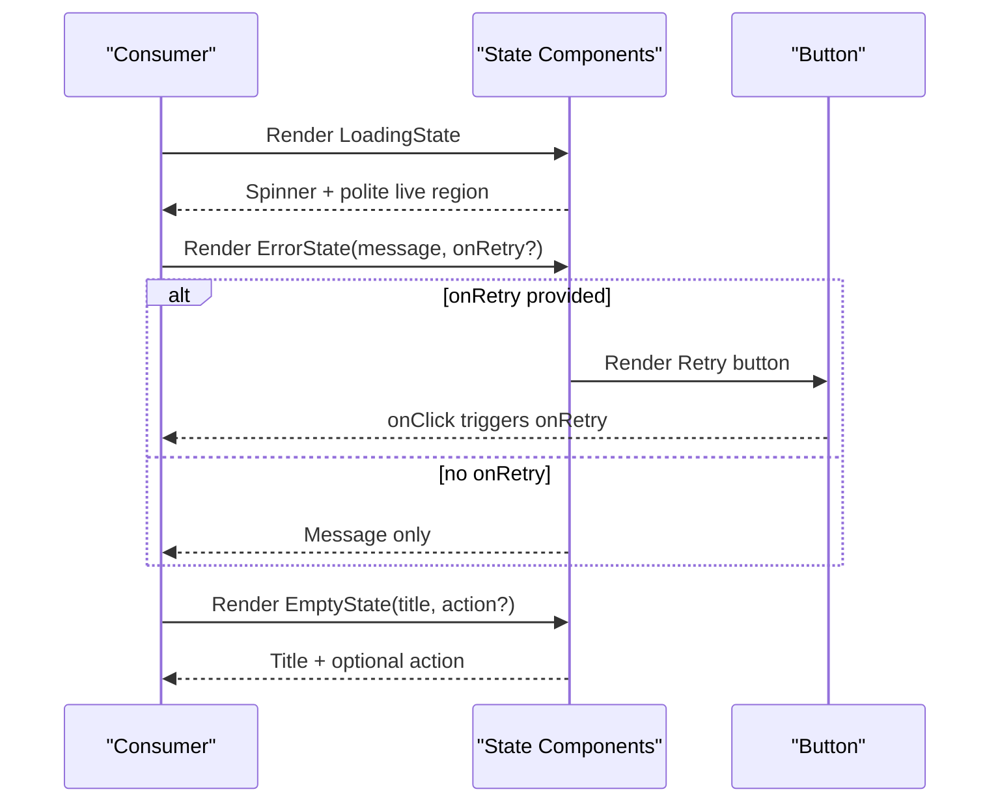

**Diagram sources**
- [state.tsx:1-46](file://Frontend/components/ui/state.tsx#L1-L46)
- [button.tsx:1-26](file://Frontend/components/ui/button.tsx#L1-L26)
- [globals.css:177-182](file://Frontend/app/globals.css#L177-L182)

**Section sources**
- [state.tsx:1-46](file://Frontend/components/ui/state.tsx#L1-L46)
- [globals.css:177-182](file://Frontend/app/globals.css#L177-L182)

### AttentionQueueCard
- Purpose: Composite card showing a metric count, title, detail, and call-to-action.
- Props:
  - icon: ReactNode
  - count: number
  - title: string
  - detail: string
  - action: string
  - tone: PillTone
  - href?: string
- Composition:
  - Uses Pill for the open count badge.
  - Wraps content in a Next.js Link for navigation.
- Accessibility:
  - Icon marked aria-hidden; text remains descriptive.

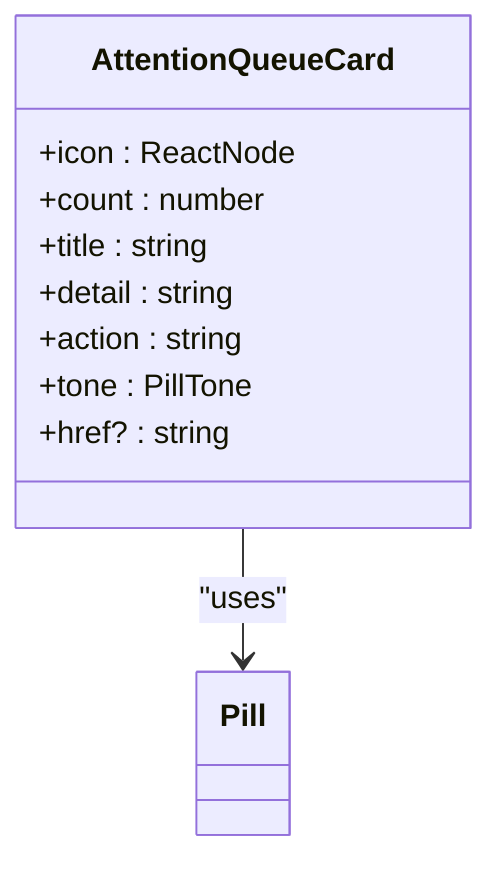

**Diagram sources**
- [attention-queue-card.tsx:1-38](file://Frontend/components/ui/attention-queue-card.tsx#L1-L38)
- [pill.tsx:1-24](file://Frontend/components/ui/pill.tsx#L1-L24)

**Section sources**
- [attention-queue-card.tsx:1-38](file://Frontend/components/ui/attention-queue-card.tsx#L1-L38)
- [pill.tsx:1-24](file://Frontend/components/ui/pill.tsx#L1-L24)

### AuthedImage
- Purpose: Load images from protected endpoints with Authorization header.
- Props:
  - path: string | null | undefined
  - alt: string
  - size?: number
  - className?: string
- Behavior:
  - Fetches blob with token if available; creates object URL; revokes on cleanup.
  - Renders circular avatar-style image with fixed dimensions.
- Accessibility:
  - Requires meaningful alt text from caller.

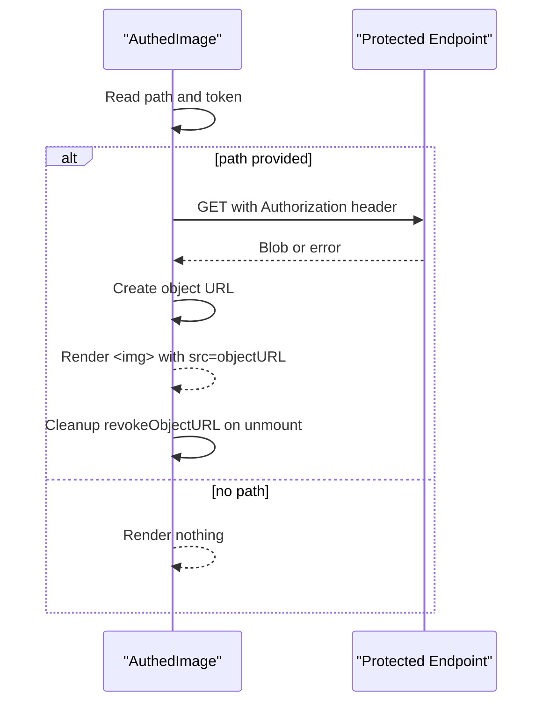

**Diagram sources**
- [authed-image.tsx:1-60](file://Frontend/components/ui/authed-image.tsx#L1-L60)

**Section sources**
- [authed-image.tsx:1-60](file://Frontend/components/ui/authed-image.tsx#L1-L60)

### PackChip
- Purpose: Display the active domain pack name with an accessible label.
- Props:
  - name: string
- Accessibility:
  - aria-label conveys context to assistive technologies.

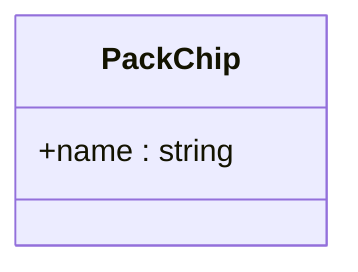

**Diagram sources**
- [pack-chip.tsx:1-9](file://Frontend/components/ui/pack-chip.tsx#L1-L9)

**Section sources**
- [pack-chip.tsx:1-9](file://Frontend/components/ui/pack-chip.tsx#L1-L9)

## Dependency Analysis
- Internal dependencies:
  - Button depends on cn for class merging.
  - AttentionQueueCard depends on Pill.
  - State components may compose Button for actions.
- Styling dependency:
  - All components depend on CSS variables and classes defined in globals.css.
- Testing dependency:
  - Tests run under jsdom with Vitest and assert DOM roles and classes.

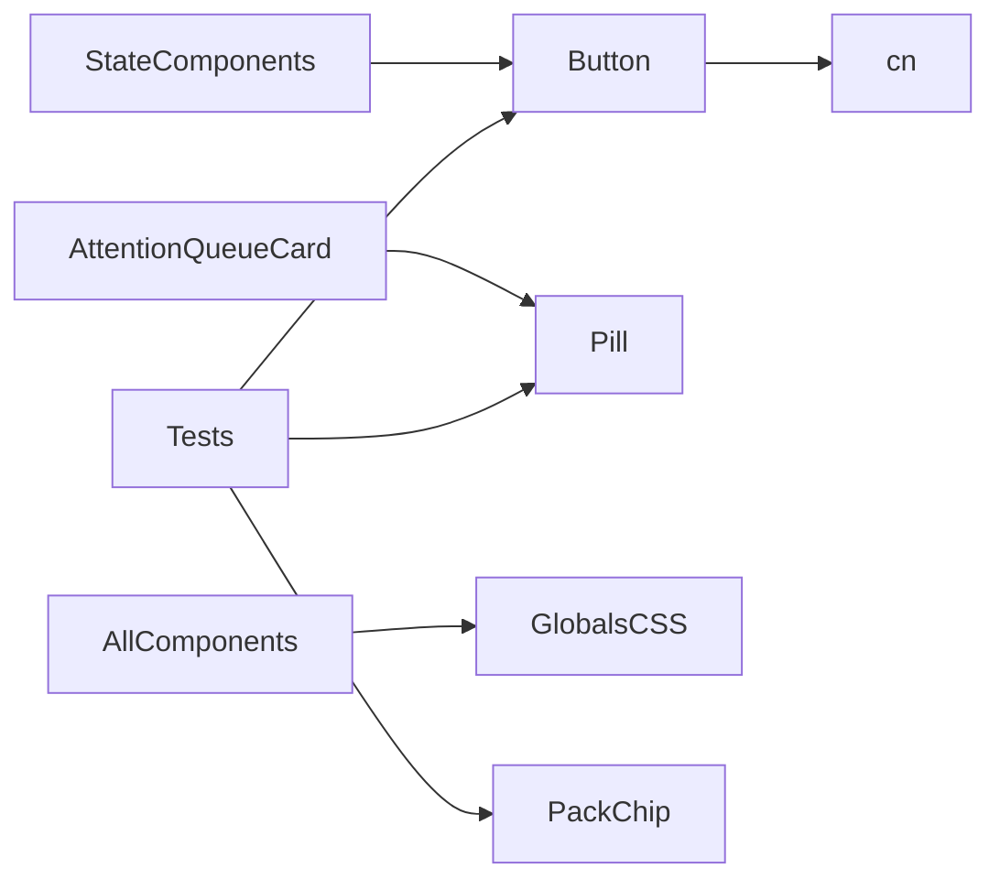

**Diagram sources**
- [button.tsx:1-26](file://Frontend/components/ui/button.tsx#L1-L26)
- [attention-queue-card.tsx:1-38](file://Frontend/components/ui/attention-queue-card.tsx#L1-L38)
- [state.tsx:1-46](file://Frontend/components/ui/state.tsx#L1-L46)
- [globals.css:1-418](file://Frontend/app/globals.css#L1-L418)
- [components.test.tsx:1-22](file://Frontend/tests/components.test.tsx#L1-L22)

**Section sources**
- [components.test.tsx:1-22](file://Frontend/tests/components.test.tsx#L1-L22)
- [vitest.config.ts:1-17](file://Frontend/vitest.config.ts#L1-L17)

## Performance Considerations
- Avoid unnecessary re-renders by memoizing expensive computations around computed bands or derived values.
- For AuthedImage, consider debouncing rapid path changes and caching blobs if the same endpoint is requested frequently.
- Keep class lists minimal; leverage the cn helper to avoid redundant class strings.
- Prefer semantic elements and native behaviors to reduce overhead.

[No sources needed since this section provides general guidance]

## Troubleshooting Guide
Common issues and resolutions:
- Missing focus indicators: Ensure focus-visible styles are not overridden; rely on global focus rules.
- Inaccessible status chips: Always include visible text alongside color; verify Pill tone usage.
- Broken secure images: Confirm Authorization header presence and correct endpoint path; check network errors and revoke object URLs on cleanup.
- Empty tables: Use TableEmpty with appropriate colSpan to maintain layout consistency.
- Live region noise: Use LoadingState with aria-live="polite" for non-blocking updates; avoid interrupting screen readers.

**Section sources**
- [state.tsx:1-46](file://Frontend/components/ui/state.tsx#L1-L46)
- [pill.tsx:1-24](file://Frontend/components/ui/pill.tsx#L1-L24)
- [authed-image.tsx:1-60](file://Frontend/components/ui/authed-image.tsx#L1-L60)
- [table.tsx:1-19](file://Frontend/components/ui/table.tsx#L1-L19)
- [globals.css:44-49](file://Frontend/app/globals.css#L44-L49)

## Conclusion
The UI component library provides a cohesive set of accessible, responsive, and themeable building blocks grounded in a clear design system. By leveraging CSS variables, consistent class naming, and semantic React components, teams can compose rich interfaces quickly while maintaining accessibility and performance. Follow the patterns outlined here to extend the library with new components that integrate seamlessly.

[No sources needed since this section summarizes without analyzing specific files]

## Appendices

### Design System Principles
- Colors: Defined as CSS variables for surfaces, ink, brand, and semantic hues.
- Typography: Base font stack and heading scales; Poppins used for headings and wordmarks.
- Spacing: Consistent padding/margins via component classes; tables and panels define internal spacing.
- Focus: Visible focus rings for keyboard navigation.
- Motion: Respects reduced motion preference.

**Section sources**
- [globals.css:3-36](file://Frontend/app/globals.css#L3-L36)
- [globals.css:40-49](file://Frontend/app/globals.css#L40-L49)
- [globals.css:110-112](file://Frontend/app/globals.css#L110-L112)
- [globals.css:417-418](file://Frontend/app/globals.css#L417-L418)

### Responsive Behavior
- Breakpoints adjust grids, sidebar visibility, search panel positioning, and table interactions.
- Mobile-first adjustments hide non-essential actions and simplify layouts.

**Section sources**
- [globals.css:161-175](file://Frontend/app/globals.css#L161-L175)

### Cross-Browser Compatibility
- Uses standard CSS variables and modern layout techniques.
- Focus-visible ensures consistent focus behavior across browsers.
- Reduced motion media query improves UX for sensitive users.

**Section sources**
- [globals.css:44-49](file://Frontend/app/globals.css#L44-L49)
- [globals.css:417-418](file://Frontend/app/globals.css#L417-L418)

### Theme Overrides
- Override CSS variables in a root stylesheet to customize colors, surfaces, and focus.
- Extend component styles by adding new modifier classes and wiring them via className props where applicable.

**Section sources**
- [globals.css:3-36](file://Frontend/app/globals.css#L3-L36)

### Testing Strategies
- Unit tests validate rendered roles, attributes, and classes for core components.
- Environment: jsdom with Vitest; setup file included.
- Assertions cover disabled buttons, accessible labels, and status classes.

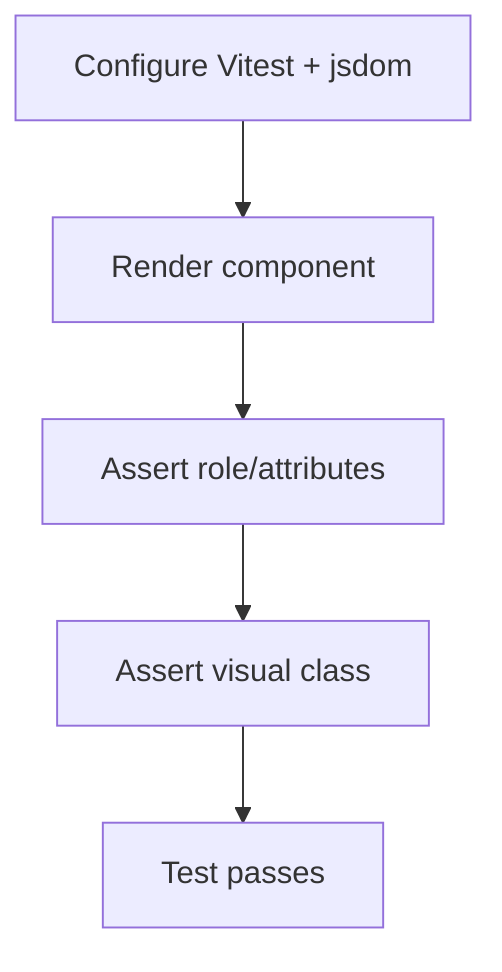

**Diagram sources**
- [vitest.config.ts:1-17](file://Frontend/vitest.config.ts#L1-L17)
- [components.test.tsx:1-22](file://Frontend/tests/components.test.tsx#L1-L22)

**Section sources**
- [vitest.config.ts:1-17](file://Frontend/vitest.config.ts#L1-L17)
- [components.test.tsx:1-22](file://Frontend/tests/components.test.tsx#L1-L22)

### Guidelines for Creating New Components
- Keep components small and single-purpose; prefer composition over complexity.
- Use cn to merge classes and accept className prop for overrides.
- Define explicit TypeScript props with sensible defaults.
- Ensure accessibility: semantic elements, ARIA attributes, keyboard support, and visible focus.
- Style with existing tokens and classes; add new tokens in globals.css if necessary.
- Add tests covering roles, attributes, and key rendering paths.

**Section sources**
- [cn.ts:1-6](file://Frontend/lib/cn.ts#L1-L6)
- [button.tsx:1-26](file://Frontend/components/ui/button.tsx#L1-L26)
- [globals.css:1-418](file://Frontend/app/globals.css#L1-L418)
- [components.test.tsx:1-22](file://Frontend/tests/components.test.tsx#L1-L22)