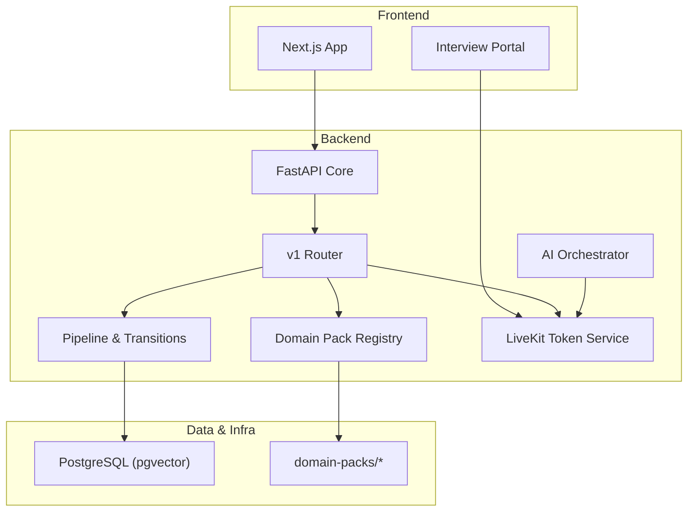
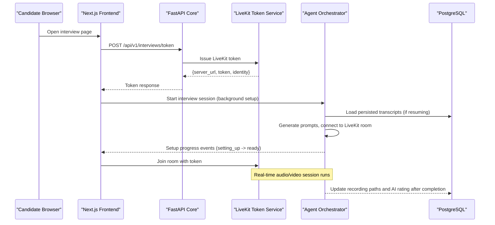
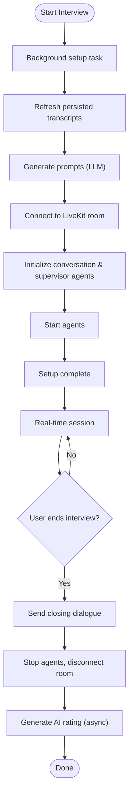
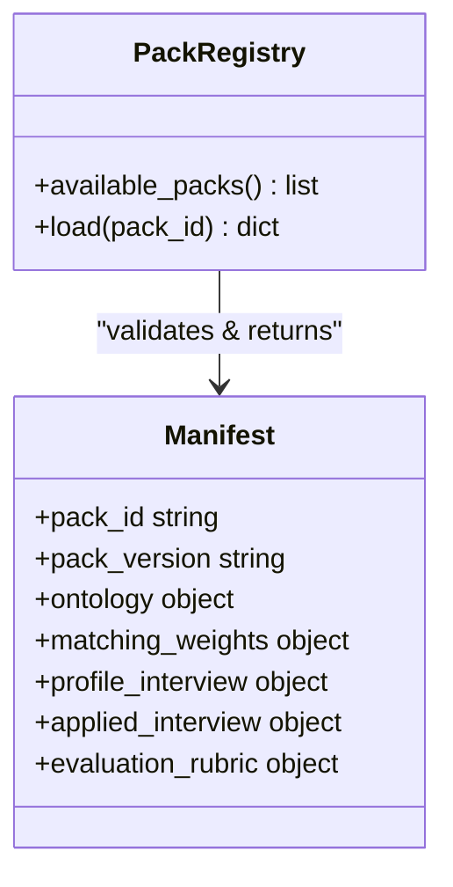
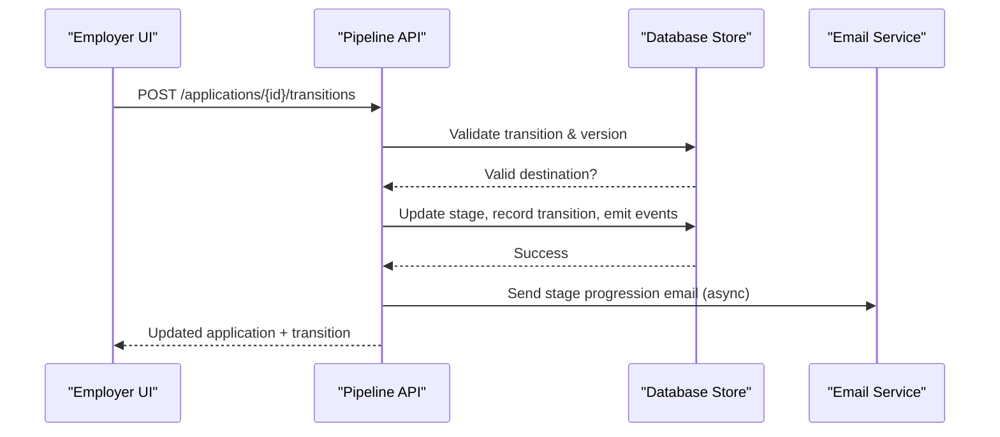
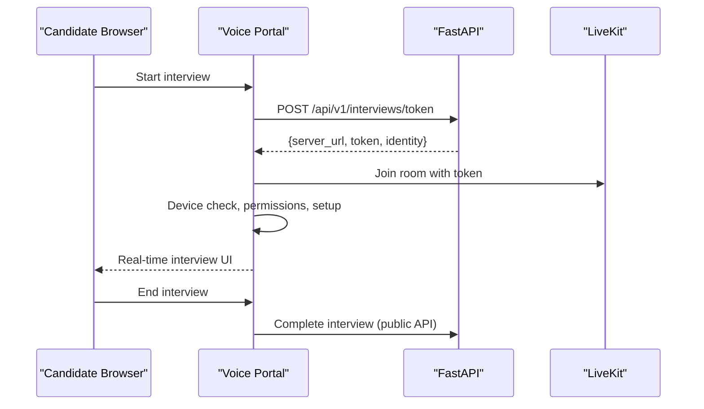
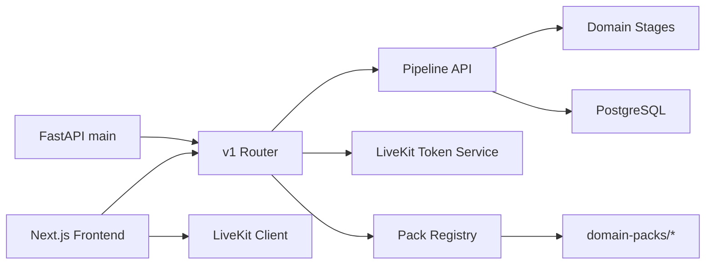

# Project Overview

<cite>
**Referenced Files in This Document**
- [architecture.md](file://architecture.md)
- [prd.md](file://prd.md)
- [Backend/app/main.py](file://Backend/app/main.py)
- [Backend/app/api/v1/router.py](file://Backend/app/api/v1/router.py)
- [Backend/app/ai/services/agent_orchestrator.py](file://Backend/app/ai/services/agent_orchestrator.py)
- [Backend/app/services/livekit.py](file://Backend/app/services/livekit.py)
- [Backend/app/domain/stages.py](file://Backend/app/domain/stages.py)
- [Backend/app/api/v1/pipeline.py](file://Backend/app/api/v1/pipeline.py)
- [Backend/app/services/packs.py](file://Backend/app/services/packs.py)
- [domain-packs/software-engineering/manifest.json](file://domain-packs/software-engineering/manifest.json)
- [Frontend/package.json](file://Frontend/package.json)
- [Frontend/app/candidate/interview/page.tsx](file://Frontend/app/candidate/interview/page.tsx)
- [Frontend/components/interviews/voice/voice-portal.tsx](file://Frontend/components/interviews/voice/voice-portal.tsx)
- [infrastructure/local/docker-compose.yml](file://infrastructure/local/docker-compose.yml)
</cite>

## Table of Contents
1. Introduction
2. Project Structure
3. Core Components
4. Architecture Overview
5. Detailed Component Analysis
6. Dependency Analysis
7. Performance Considerations
8. Troubleshooting Guide
9. Conclusion

## Introduction
This ATS is an AI-native hiring platform designed to streamline recruitment through a two-stage interview model, multi-tenant architecture, and real-time video interviews. It separates domain knowledge from the core engine using a Domain Packs system, enabling the same hiring operating system to serve multiple industries without code changes. The platform serves two primary audiences:
- Candidates: A guided, resumable interview experience with clear status updates and portable skill proof.
- Employers: An intelligent pipeline that automates screening, generates job-specific assessments, and keeps humans in control of every consequential decision.

The system’s value proposition centers on intelligent automation plus human-in-the-loop evaluation: AI accelerates matching, question generation, and scoring; employers review evidence and make final decisions.

**Section sources**
- [prd.md:16-27](file://prd.md#L16-L27)
- [architecture.md:8-15](file://architecture.md#L8-L15)

## Project Structure
At a high level, the repository contains:
- Backend (FastAPI): Core API, AI orchestration, domain pack registry, pipeline management, and LiveKit integration.
- Frontend (Next.js + React): Candidate and employer interfaces, including the voice/video interview portal.
- Domain Packs: JSON manifests defining ontology, questions, rubrics, and weights for specific domains.
- Infrastructure: Local Docker Compose for PostgreSQL (pgvector-enabled).

**Diagram sources**
- [Backend/app/main.py:15-58](file://Backend/app/main.py#L15-L58)
- [Backend/app/api/v1/router.py:26-70](file://Backend/app/api/v1/router.py#L26-L70)
- [Backend/app/api/v1/pipeline.py:277-514](file://Backend/app/api/v1/pipeline.py#L277-L514)
- [Backend/app/services/packs.py:64-97](file://Backend/app/services/packs.py#L64-L97)
- [Backend/app/ai/services/agent_orchestrator.py:29-182](file://Backend/app/ai/services/agent_orchestrator.py#L29-L182)
- [Backend/app/services/livekit.py:10-39](file://Backend/app/services/livekit.py#L10-L39)
- [infrastructure/local/docker-compose.yml:3-21](file://infrastructure/local/docker-compose.yml#L3-L21)

**Section sources**
- [Backend/app/main.py:15-58](file://Backend/app/main.py#L15-L58)
- [Frontend/package.json:13-21](file://Frontend/package.json#L13-L21)
- [infrastructure/local/docker-compose.yml:3-21](file://infrastructure/local/docker-compose.yml#L3-L21)

## Core Components
- Multi-tenant FastAPI backend with CORS and request context middleware.
- Domain Pack Registry that validates and loads industry-specific manifests.
- Two-stage interview model:
  - Profile Interview: candidate-owned, retakeable, produces a Skill Score.
  - Applied Interview: employer-owned, generated from a posting, curated, locked, one attempt per candidate.
- Real-time video/audio via LiveKit with token issuance and agent orchestration.
- ATS pipeline with canonical stages, transitions, audit trails, and notifications.
- Next.js frontend with candidate and employer routes, including an interview portal.

Key capabilities:
- AI agent orchestration for interview setup, prompt generation, and post-interview rating.
- Domain packs system for zero-code industry expansion.
- Candidate pipeline management with Kanban-style views and transition commands.

**Section sources**
- [Backend/app/main.py:15-58](file://Backend/app/main.py#L15-L58)
- [Backend/app/services/packs.py:64-97](file://Backend/app/services/packs.py#L64-L97)
- [Backend/app/ai/services/agent_orchestrator.py:29-182](file://Backend/app/ai/services/agent_orchestrator.py#L29-L182)
- [Backend/app/domain/stages.py:10-44](file://Backend/app/domain/stages.py#L10-L44)
- [Backend/app/api/v1/pipeline.py:277-514](file://Backend/app/api/v1/pipeline.py#L277-L514)
- [Frontend/app/candidate/interview/page.tsx:7-11](file://Frontend/app/candidate/interview/page.tsx#L7-L11)
- [Frontend/components/interviews/voice/voice-portal.tsx:60-239](file://Frontend/components/interviews/voice/voice-portal.tsx#L60-L239)

## Architecture Overview
The system follows a layered architecture:
- Web Application (Next.js) provides candidate and employer experiences.
- Core API (FastAPI) handles authentication, tenancy, ATS workflow, and integrations.
- AI/Interview Worker orchestrates agents, connects to LiveKit rooms, and coordinates media sessions.
- Domain Pack Registry supplies ontology, questions, and rubrics without branching engine logic.
- PostgreSQL stores tenant-scoped data and supports vector similarity search.

**Diagram sources**
- [Backend/app/api/v1/router.py:43-70](file://Backend/app/api/v1/router.py#L43-L70)
- [Backend/app/services/livekit.py:10-39](file://Backend/app/services/livekit.py#L10-L39)
- [Backend/app/ai/services/agent_orchestrator.py:42-182](file://Backend/app/ai/services/agent_orchestrator.py#L42-L182)
- [Backend/app/ai/services/agent_orchestrator.py:282-327](file://Backend/app/ai/services/agent_orchestrator.py#L282-L327)

**Section sources**
- [architecture.md:19-43](file://architecture.md#L19-L43)
- [architecture.md:277-285](file://architecture.md#L277-L285)

## Detailed Component Analysis

### AI Agent Orchestration
The orchestrator manages the lifecycle of AI agents within a LiveKit room:
- Starts background setup tasks and signals progress to the frontend.
- Generates persona and supervisor prompts, connects to LiveKit, initializes agents, and starts them.
- Handles user-requested wrap-up and cleanup, then triggers AI rating generation.

**Diagram sources**
- [Backend/app/ai/services/agent_orchestrator.py:42-182](file://Backend/app/ai/services/agent_orchestrator.py#L42-L182)
- [Backend/app/ai/services/agent_orchestrator.py:203-243](file://Backend/app/ai/services/agent_orchestrator.py#L203-L243)
- [Backend/app/ai/services/agent_orchestrator.py:244-327](file://Backend/app/ai/services/agent_orchestrator.py#L244-L327)

**Section sources**
- [Backend/app/ai/services/agent_orchestrator.py:29-182](file://Backend/app/ai/services/agent_orchestrator.py#L29-L182)
- [Backend/app/ai/services/agent_orchestrator.py:203-327](file://Backend/app/ai/services/agent_orchestrator.py#L203-L327)

### Domain Packs System
The Domain Pack Registry loads and validates manifests from the domain-packs directory. Each manifest defines ontology, matching weights, profile/applied interview questions, and evaluation rubrics. Adding a new industry requires only authoring and registering a new pack—no engine code changes.

**Diagram sources**
- [Backend/app/services/packs.py:64-97](file://Backend/app/services/packs.py#L64-L97)
- [domain-packs/software-engineering/manifest.json:1-140](file://domain-packs/software-engineering/manifest.json#L1-L140)

**Section sources**
- [Backend/app/services/packs.py:15-62](file://Backend/app/services/packs.py#L15-L62)
- [domain-packs/software-engineering/manifest.json:1-140](file://domain-packs/software-engineering/manifest.json#L1-L140)
- [architecture.md:113-137](file://architecture.md#L113-L137)

### Candidate Pipeline Management
The ATS enforces canonical stages and valid transitions:
- Fixed anchors (Received, Hired, Rejected, Withdrawn) plus optional components (Screening, Shortlisting, AI Interview, Offer).
- Transition command ensures optimistic concurrency, reason requirements for consequential moves, audit logging, and event emission.
- Automatic actions include AI matching and sending interview links when thresholds are met.

**Diagram sources**
- [Backend/app/domain/stages.py:55-109](file://Backend/app/domain/stages.py#L55-L109)
- [Backend/app/api/v1/pipeline.py:277-514](file://Backend/app/api/v1/pipeline.py#L277-L514)

**Section sources**
- [Backend/app/domain/stages.py:10-44](file://Backend/app/domain/stages.py#L10-L44)
- [Backend/app/api/v1/pipeline.py:277-514](file://Backend/app/api/v1/pipeline.py#L277-L514)

### Real-Time Video Interviews (LiveKit Integration)
The backend issues short-lived tokens for candidates to join LiveKit rooms. The frontend orchestrates device checks, permissions, setup, and the live session, mapping backend setup stages to UI progress indicators.

**Diagram sources**
- [Backend/app/api/v1/router.py:43-56](file://Backend/app/api/v1/router.py#L43-L56)
- [Backend/app/services/livekit.py:10-39](file://Backend/app/services/livekit.py#L10-L39)
- [Frontend/components/interviews/voice/voice-portal.tsx:60-239](file://Frontend/components/interviews/voice/voice-portal.tsx#L60-L239)

**Section sources**
- [Backend/app/services/livekit.py:10-39](file://Backend/app/services/livekit.py#L10-L39)
- [Frontend/components/interviews/voice/voice-portal.tsx:60-239](file://Frontend/components/interviews/voice/voice-portal.tsx#L60-L239)

### Technology Stack Summary
- Backend: Python/FastAPI with async middleware, CORS, request context, and structured error handling.
- Frontend: Next.js with React, TypeScript, and Vitest for testing; LiveKit components for real-time media.
- AI Services: Agent orchestration with prompt generation and post-interview rating workflows.
- Real-Time Communication: LiveKit for secure, scalable audio/video sessions.
- Database: PostgreSQL with pgvector for embedding-based similarity search.

**Section sources**
- [Backend/app/main.py:15-58](file://Backend/app/main.py#L15-L58)
- [Frontend/package.json:13-21](file://Frontend/package.json#L13-L21)
- [infrastructure/local/docker-compose.yml:3-21](file://infrastructure/local/docker-compose.yml#L3-L21)

## Dependency Analysis
Core dependencies and relationships:
- FastAPI app wires routers, middleware, and exception handlers.
- v1 router aggregates feature routers and exposes interview token and AI question endpoints.
- Pipeline module depends on domain stages for validation and emits events upon transitions.
- Domain Pack Registry reads manifests from disk and validates structure before use.
- Frontend depends on LiveKit SDK and custom components to render the interview flow.

**Diagram sources**
- [Backend/app/main.py:15-58](file://Backend/app/main.py#L15-L58)
- [Backend/app/api/v1/router.py:26-70](file://Backend/app/api/v1/router.py#L26-L70)
- [Backend/app/api/v1/pipeline.py:277-514](file://Backend/app/api/v1/pipeline.py#L277-L514)
- [Backend/app/domain/stages.py:55-109](file://Backend/app/domain/stages.py#L55-L109)
- [Backend/app/services/packs.py:64-97](file://Backend/app/services/packs.py#L64-L97)
- [Frontend/package.json:13-21](file://Frontend/package.json#L13-L21)

**Section sources**
- [Backend/app/main.py:15-58](file://Backend/app/main.py#L15-L58)
- [Backend/app/api/v1/router.py:26-70](file://Backend/app/api/v1/router.py#L26-L70)
- [Backend/app/api/v1/pipeline.py:277-514](file://Backend/app/api/v1/pipeline.py#L277-L514)
- [Backend/app/domain/stages.py:55-109](file://Backend/app/domain/stages.py#L55-L109)
- [Backend/app/services/packs.py:64-97](file://Backend/app/services/packs.py#L64-L97)
- [Frontend/package.json:13-21](file://Frontend/package.json#L13-L21)

## Performance Considerations
- Keep board/Kanban views responsive by virtualizing columns and cards where needed.
- Offload expensive operations (sandbox execution, AI grading) to background workers; rate-limit retries and track compute cost.
- Use asynchronous indexing for search and matching to avoid blocking write paths.
- Throttle notification bursts at the worker layer to prevent client-side overload.

[No sources needed since this section provides general guidance]

## Troubleshooting Guide
Common issues and recovery strategies:
- LiveKit configuration errors: Missing URL, API key, or secret will raise an integration configuration error during token issuance.
- Stage conflicts: Optimistic concurrency checks return conflict responses if the application stage changed while editing; refresh and retry.
- Invalid transitions: Ensure destination stages are allowed by the workflow definition; missing reasons for consequential moves will be rejected.
- Email delivery failures: Non-critical; emails are sent asynchronously and must not block committed transitions.

**Section sources**
- [Backend/app/services/livekit.py:14-21](file://Backend/app/services/livekit.py#L14-L21)
- [Backend/app/api/v1/pipeline.py:306-333](file://Backend/app/api/v1/pipeline.py#L306-L333)
- [Backend/app/api/v1/pipeline.py:502-514](file://Backend/app/api/v1/pipeline.py#L502-L514)

## Conclusion
This ATS combines a robust, multi-tenant backend with a modern frontend to deliver an AI-native hiring experience. Through a two-stage interview model, domain packs, and real-time video integration, it streamlines the process for both candidates and employers while keeping humans in control of critical decisions. The modular architecture enables scaling and extension across industries without altering core services.

[No sources needed since this section summarizes without analyzing specific files]