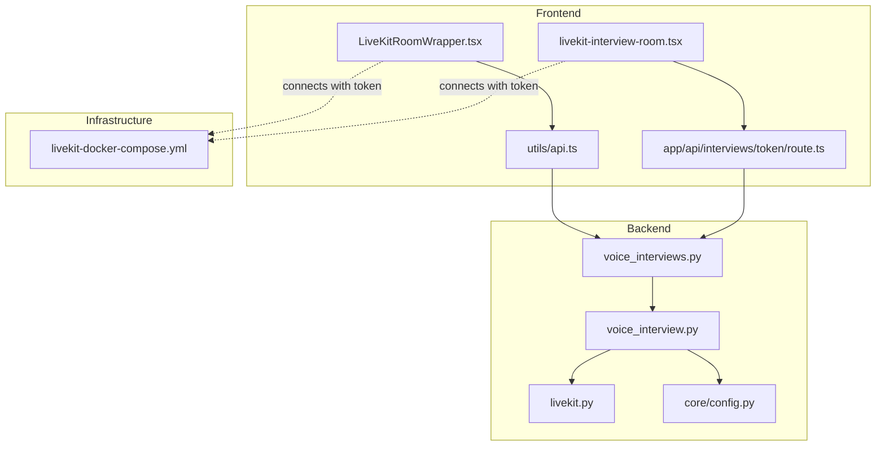
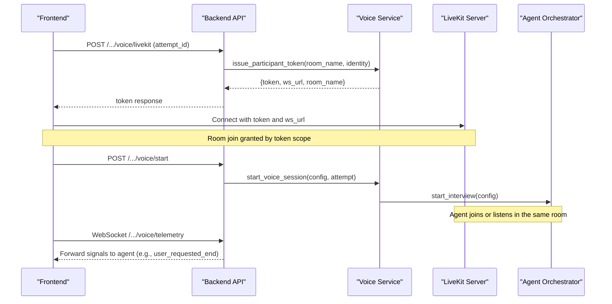
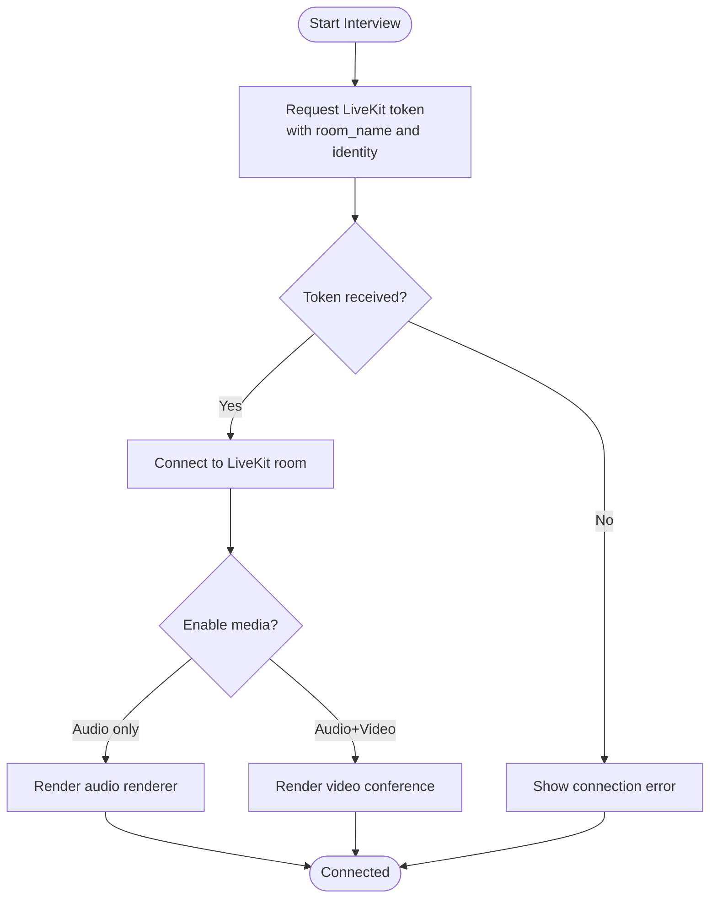
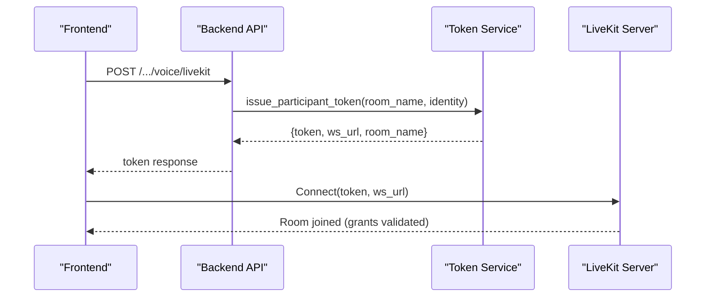
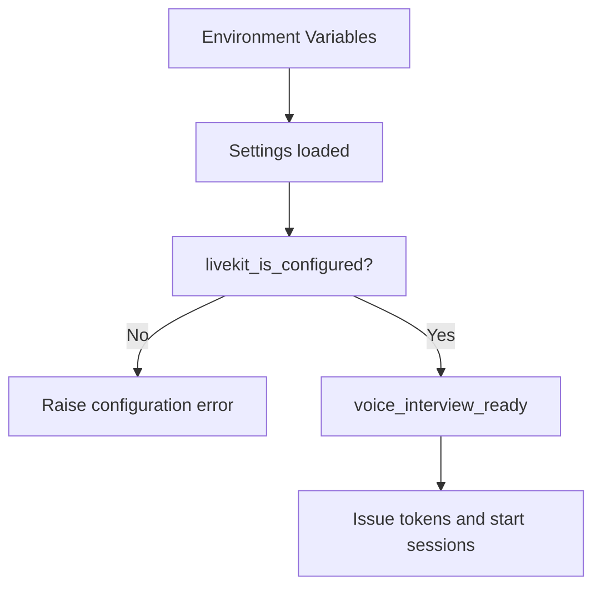
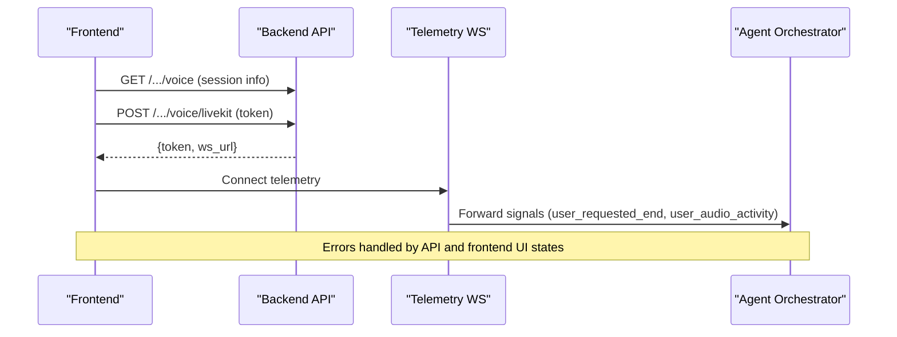
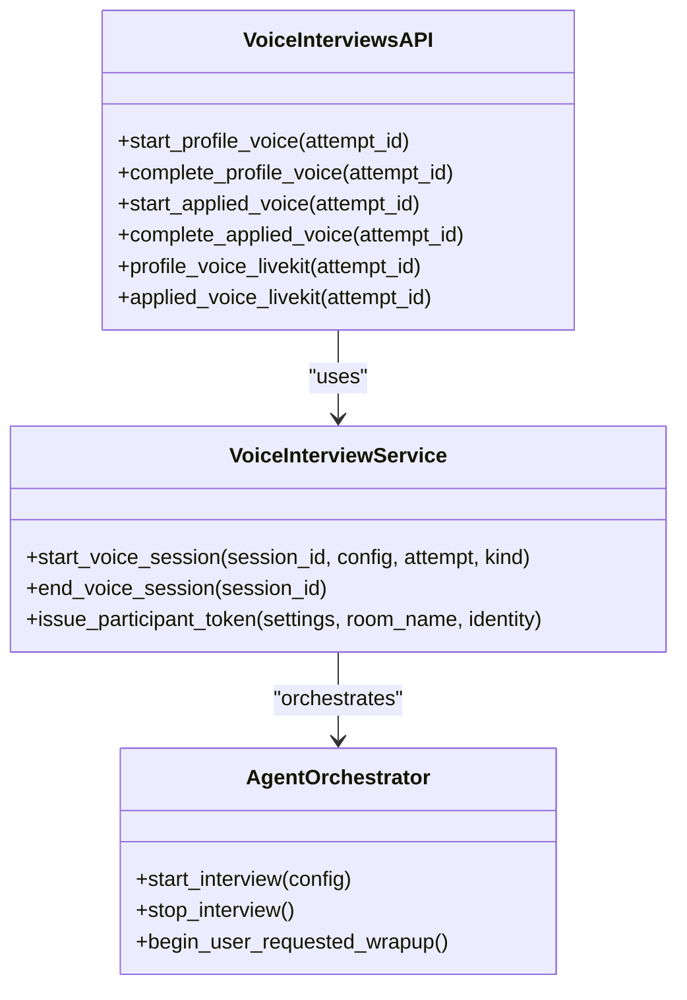
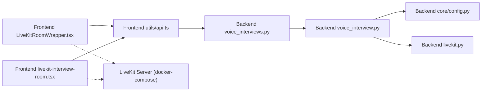

# LiveKit Integration

<cite>
**Referenced Files in This Document**
- [livekit.py](file://Backend/app/services/livekit.py)
- [voice_interview.py](file://Backend/app/services/voice_interview.py)
- [config.py](file://Backend/app/core/config.py)
- [interview.py](file://Backend/app/schemas/interview.py)
- [voice_interviews.py](file://Backend/app/api/v1/voice_interviews.py)
- [LiveKitRoomWrapper.tsx](file://Frontend/components/interviews/voice/LiveKitRoomWrapper.tsx)
- [livekit-interview-room.tsx](file://Frontend/components/interviews/livekit-interview-room.tsx)
- [api.ts](file://Frontend/utils/api.ts)
- [route.ts](file://Frontend/app/api/interviews/token/route.ts)
- [livekit-docker-compose.yml](file://livekit-docker-compose.yml)
</cite>

## Table of Contents
1. [Introduction](#introduction)
2. [Project Structure](#project-structure)
3. [Core Components](#core-components)
4. [Architecture Overview](#architecture-overview)
5. [Detailed Component Analysis](#detailed-component-analysis)
6. [Dependency Analysis](#dependency-analysis)
7. [Performance Considerations](#performance-considerations)
8. [Troubleshooting Guide](#troubleshooting-guide)
9. [Conclusion](#conclusion)
10. [Appendices](#appendices)

## Introduction
This document explains how the real-time interview system integrates with LiveKit to provide secure, token-based audio/video rooms for interviews. It covers room management (creation via naming conventions, participant joining), media stream handling on the frontend, and the full token lifecycle from generation to validation by LiveKit. It also documents configuration options for the LiveKit server, environment variables, error handling patterns, and integration points with the application’s session management layer.

## Project Structure
The LiveKit integration spans backend services, API endpoints, frontend components, and infrastructure:
- Backend services generate scoped JWT tokens for LiveKit rooms and orchestrate voice sessions.
- Frontend components request tokens, connect to LiveKit rooms, and manage media streams and telemetry.
- Configuration centralizes LiveKit connection parameters and token TTL.
- Docker Compose provides a local LiveKit + Redis stack for development.

**Diagram sources**
- [LiveKitRoomWrapper.tsx:1-104](file://Frontend/components/interviews/voice/LiveKitRoomWrapper.tsx#L1-L104)
- [livekit-interview-room.tsx:1-100](file://Frontend/components/interviews/livekit-interview-room.tsx#L1-L100)
- [api.ts:1-123](file://Frontend/utils/api.ts#L1-L123)
- [route.ts:1-76](file://Frontend/app/api/interviews/token/route.ts#L1-L76)
- [voice_interviews.py:1-416](file://Backend/app/api/v1/voice_interviews.py#L1-L416)
- [voice_interview.py:1-272](file://Backend/app/services/voice_interview.py#L1-L272)
- [livekit.py:1-39](file://Backend/app/services/livekit.py#L1-L39)
- [config.py:1-215](file://Backend/app/core/config.py#L1-L215)
- [livekit-docker-compose.yml:1-27](file://livekit-docker-compose.yml#L1-L27)

**Section sources**
- [voice_interviews.py:1-416](file://Backend/app/api/v1/voice_interviews.py#L1-L416)
- [voice_interview.py:1-272](file://Backend/app/services/voice_interview.py#L1-L272)
- [livekit.py:1-39](file://Backend/app/services/livekit.py#L1-L39)
- [config.py:1-215](file://Backend/app/core/config.py#L1-L215)
- [LiveKitRoomWrapper.tsx:1-104](file://Frontend/components/interviews/voice/LiveKitRoomWrapper.tsx#L1-L104)
- [livekit-interview-room.tsx:1-100](file://Frontend/components/interviews/livekit-interview-room.tsx#L1-L100)
- [api.ts:1-123](file://Frontend/utils/api.ts#L1-L123)
- [route.ts:1-76](file://Frontend/app/api/interviews/token/route.ts#L1-L76)
- [livekit-docker-compose.yml:1-27](file://livekit-docker-compose.yml#L1-L27)

## Core Components
- Token issuance service: Builds scoped JWT tokens with identity, name, TTL, and room grants.
- Voice interview service: Validates configuration, issues participant tokens, starts/stops AI-driven sessions, and persists room metadata.
- API endpoints: Expose endpoints to start sessions, get tokens, complete sessions, and stream telemetry.
- Frontend wrappers: Request tokens, connect to LiveKit rooms, render audio, and handle errors.
- Configuration: Centralized settings for LiveKit URL, keys, token TTL, and readiness checks.

**Section sources**
- [livekit.py:10-39](file://Backend/app/services/livekit.py#L10-L39)
- [voice_interview.py:154-252](file://Backend/app/services/voice_interview.py#L154-L252)
- [voice_interviews.py:177-416](file://Backend/app/api/v1/voice_interviews.py#L177-L416)
- [config.py:72-76](file://Backend/app/core/config.py#L72-L76)
- [config.py:162-177](file://Backend/app/core/config.py#L162-L177)
- [LiveKitRoomWrapper.tsx:21-104](file://Frontend/components/interviews/voice/LiveKitRoomWrapper.tsx#L21-L104)
- [livekit-interview-room.tsx:15-100](file://Frontend/components/interviews/livekit-interview-room.tsx#L15-L100)

## Architecture Overview
The flow begins when the frontend requests a LiveKit token for a specific room. The backend validates configuration, generates a scoped JWT token, and returns it along with the WebSocket URL. The frontend connects to LiveKit using the token, enabling audio/video as needed. For AI-driven interviews, the backend orchestrates agent sessions tied to the same room name and manages lifecycle events through telemetry WebSockets.

**Diagram sources**
- [voice_interviews.py:189-236](file://Backend/app/api/v1/voice_interviews.py#L189-L236)
- [voice_interviews.py:306-361](file://Backend/app/api/v1/voice_interviews.py#L306-L361)
- [voice_interview.py:189-228](file://Backend/app/services/voice_interview.py#L189-L228)
- [voice_interview.py:230-252](file://Backend/app/services/voice_interview.py#L230-L252)
- [LiveKitRoomWrapper.tsx:35-104](file://Frontend/components/interviews/voice/LiveKitRoomWrapper.tsx#L35-L104)
- [api.ts:78-84](file://Frontend/utils/api.ts#L78-L84)

## Detailed Component Analysis

### Room Management Architecture
- Room creation: Rooms are identified by deterministic names derived from attempt IDs (e.g., profile-screening-{id}, job-interview-{id}). The backend ensures these names are used consistently across token issuance and session start.
- Participant joining: The frontend obtains a token scoped to the exact room and connects via LiveKitRoom. Media is enabled/disabled per component needs.
- Media stream handling: The wrapper renders audio via RoomAudioRenderer and delegates UI to InterviewInterface. A separate demo component enables both audio and video for general interviews.

**Diagram sources**
- [voice_interviews.py:189-202](file://Backend/app/api/v1/voice_interviews.py#L189-L202)
- [voice_interviews.py:306-319](file://Backend/app/api/v1/voice_interviews.py#L306-L319)
- [voice_interview.py:230-252](file://Backend/app/services/voice_interview.py#L230-L252)
- [LiveKitRoomWrapper.tsx:73-104](file://Frontend/components/interviews/voice/LiveKitRoomWrapper.tsx#L73-L104)
- [livekit-interview-room.tsx:50-70](file://Frontend/components/interviews/livekit-interview-room.tsx#L50-L70)

**Section sources**
- [voice_interviews.py:177-236](file://Backend/app/api/v1/voice_interviews.py#L177-L236)
- [voice_interviews.py:290-361](file://Backend/app/api/v1/voice_interviews.py#L290-L361)
- [voice_interview.py:53-151](file://Backend/app/services/voice_interview.py#L53-L151)
- [LiveKitRoomWrapper.tsx:21-104](file://Frontend/components/interviews/voice/LiveKitRoomWrapper.tsx#L21-L104)
- [livekit-interview-room.tsx:15-100](file://Frontend/components/interviews/livekit-interview-room.tsx#L15-L100)

### Token-Based Authentication Flow
- Generation: Tokens are created with identity, name, TTL, and grants limited to a specific room. Both the generic token service and voice service implement this pattern.
- Validation: LiveKit validates the JWT on connect; if valid and scoped correctly, the participant joins the room.
- Lifecycle: Tokens expire after the configured TTL. The frontend should refresh tokens if necessary based on app logic.

**Diagram sources**
- [voice_interviews.py:189-202](file://Backend/app/api/v1/voice_interviews.py#L189-L202)
- [voice_interviews.py:306-319](file://Backend/app/api/v1/voice_interviews.py#L306-L319)
- [voice_interview.py:230-252](file://Backend/app/services/voice_interview.py#L230-L252)
- [livekit.py:14-39](file://Backend/app/services/livekit.py#L14-L39)

**Section sources**
- [voice_interview.py:230-252](file://Backend/app/services/voice_interview.py#L230-L252)
- [livekit.py:14-39](file://Backend/app/services/livekit.py#L14-L39)
- [interview.py:4-13](file://Backend/app/schemas/interview.py#L4-L13)

### Configuration Options for LiveKit Server Setup
- Environment variables:
  - THOS_LIVEKIT_URL: Base URL of the LiveKit server (used as ws_url).
  - THOS_LIVEKIT_API_KEY: API key for token signing.
  - THOS_LIVEKIT_API_SECRET: Secret for token signing.
  - THOS_LIVEKIT_TOKEN_TTL_SECONDS: Token lifetime in seconds (validated between 60 and 3600).
- Readiness checks:
  - livekit_is_configured ensures all required fields are present.
  - voice_interview_ready requires LiveKit and AI provider configuration.
- Local development:
  - docker-compose defines a LiveKit server with Redis and exposes ports for signaling and media.

**Diagram sources**
- [config.py:72-76](file://Backend/app/core/config.py#L72-L76)
- [config.py:162-177](file://Backend/app/core/config.py#L162-L177)
- [config.py:132-137](file://Backend/app/core/config.py#L132-L137)
- [livekit-docker-compose.yml:1-27](file://livekit-docker-compose.yml#L1-L27)

**Section sources**
- [config.py:72-76](file://Backend/app/core/config.py#L72-L76)
- [config.py:162-177](file://Backend/app/core/config.py#L162-L177)
- [config.py:132-137](file://Backend/app/core/config.py#L132-L137)
- [livekit-docker-compose.yml:1-27](file://livekit-docker-compose.yml#L1-L27)

### Room Initialization, Participant Management, and Error Handling
- Initialization:
  - Frontend calls publicApi.getLiveKitToken to fetch token and ws_url.
  - Wrapper renders LiveKitRoom with token and serverUrl, enabling audio rendering.
- Participant management:
  - Identity is set to candidate-{id} for consistent identification.
  - Room names are deterministic per attempt to ensure participants join the correct session.
- Error handling:
  - Frontend shows connection issues and loading states while waiting for token.
  - Backend validates inputs and raises structured errors when LiveKit or AI is not configured.
  - Telemetry WebSocket forwards user actions to the agent orchestrator.

**Diagram sources**
- [api.ts:54-84](file://Frontend/utils/api.ts#L54-L84)
- [voice_interviews.py:258-288](file://Backend/app/api/v1/voice_interviews.py#L258-L288)
- [voice_interviews.py:387-416](file://Backend/app/api/v1/voice_interviews.py#L387-L416)
- [LiveKitRoomWrapper.tsx:35-71](file://Frontend/components/interviews/voice/LiveKitRoomWrapper.tsx#L35-L71)

**Section sources**
- [LiveKitRoomWrapper.tsx:35-71](file://Frontend/components/interviews/voice/LiveKitRoomWrapper.tsx#L35-L71)
- [voice_interviews.py:258-288](file://Backend/app/api/v1/voice_interviews.py#L258-L288)
- [voice_interviews.py:387-416](file://Backend/app/api/v1/voice_interviews.py#L387-L416)
- [voice_interview.py:154-167](file://Backend/app/services/voice_interview.py#L154-L167)

### Integration Patterns Between LiveKit Rooms and Session Management
- Deterministic room naming ties LiveKit rooms to interview attempts, enabling stateful session tracking.
- Starting a voice session registers an interview record and launches an orchestrator task that coordinates agent behavior within the room context.
- Completing a session ends the orchestrator task and updates status, optionally triggering analysis.
- Telemetry WebSocket bridges client signals to the active conversation agent, ensuring responsive interactions.

**Diagram sources**
- [voice_interviews.py:204-256](file://Backend/app/api/v1/voice_interviews.py#L204-L256)
- [voice_interviews.py:321-385](file://Backend/app/api/v1/voice_interviews.py#L321-L385)
- [voice_interview.py:189-228](file://Backend/app/services/voice_interview.py#L189-L228)

**Section sources**
- [voice_interviews.py:204-256](file://Backend/app/api/v1/voice_interviews.py#L204-L256)
- [voice_interviews.py:321-385](file://Backend/app/api/v1/voice_interviews.py#L321-L385)
- [voice_interview.py:189-228](file://Backend/app/services/voice_interview.py#L189-L228)

## Dependency Analysis
- Frontend dependencies:
  - utils/api.ts routes calls to backend voice endpoints and constructs telemetry URLs.
  - LiveKitRoomWrapper uses @livekit/components-react to render rooms and audio.
  - livekit-interview-room.tsx demonstrates a simpler room with video/audio enabled.
- Backend dependencies:
  - voice_interviews.py depends on voice_interview service for token issuance and session orchestration.
  - voice_interview.py depends on core config for validation and readiness checks.
  - livekit.py provides a reusable token issuance service.
- Infrastructure dependencies:
  - livekit-docker-compose.yml sets up LiveKit and Redis for local development.

**Diagram sources**
- [api.ts:1-123](file://Frontend/utils/api.ts#L1-L123)
- [voice_interviews.py:1-416](file://Backend/app/api/v1/voice_interviews.py#L1-L416)
- [voice_interview.py:1-272](file://Backend/app/services/voice_interview.py#L1-L272)
- [config.py:1-215](file://Backend/app/core/config.py#L1-L215)
- [livekit.py:1-39](file://Backend/app/services/livekit.py#L1-L39)
- [livekit-docker-compose.yml:1-27](file://livekit-docker-compose.yml#L1-L27)

**Section sources**
- [api.ts:1-123](file://Frontend/utils/api.ts#L1-L123)
- [voice_interviews.py:1-416](file://Backend/app/api/v1/voice_interviews.py#L1-L416)
- [voice_interview.py:1-272](file://Backend/app/services/voice_interview.py#L1-L272)
- [config.py:1-215](file://Backend/app/core/config.py#L1-L215)
- [livekit.py:1-39](file://Backend/app/services/livekit.py#L1-L39)
- [livekit-docker-compose.yml:1-27](file://livekit-docker-compose.yml#L1-L27)

## Performance Considerations
- Token TTL: Keep token lifetimes short (default validated range) to minimize exposure risk while supporting typical interview durations.
- Media toggling: Disable unnecessary media tracks at the component level to reduce bandwidth and CPU usage.
- Task concurrency: Voice session start uses locks to prevent duplicate tasks and ensure safe orchestration.
- Telemetry: Lightweight WebSocket messages forward minimal signals to avoid overhead.

[No sources needed since this section provides general guidance]

## Troubleshooting Guide
- LiveKit not configured:
  - Symptom: Backend returns a 503 with code indicating LiveKit is not configured.
  - Action: Ensure THOS_LIVEKIT_URL, THOS_LIVEKIT_API_KEY, and THOS_LIVEKIT_API_SECRET are set.
- AI not configured:
  - Symptom: Backend returns a 503 with code indicating AI is not configured.
  - Action: Set THOS_AI_API_KEY for voice interviews.
- Frontend connection issues:
  - Symptom: Wrapper displays “Connection issue” or “Preparing interview”.
  - Action: Verify network connectivity, token validity, and ws_url correctness.
- Invalid room name or participant name:
  - Symptom: Frontend route returns 400 errors for invalid inputs.
  - Action: Validate room name pattern and participant name length before submission.
- Telemetry disconnects:
  - Symptom: WebSocket disconnects during interview.
  - Action: Reconnect telemetry and ensure signals are forwarded to the orchestrator.

**Section sources**
- [voice_interview.py:154-167](file://Backend/app/services/voice_interview.py#L154-L167)
- [route.ts:23-30](file://Frontend/app/api/interviews/token/route.ts#L23-L30)
- [route.ts:60-74](file://Frontend/app/api/interviews/token/route.ts#L60-L74)
- [LiveKitRoomWrapper.tsx:55-71](file://Frontend/components/interviews/voice/LiveKitRoomWrapper.tsx#L55-L71)
- [voice_interviews.py:258-288](file://Backend/app/api/v1/voice_interviews.py#L258-L288)
- [voice_interviews.py:387-416](file://Backend/app/api/v1/voice_interviews.py#L387-L416)

## Conclusion
The LiveKit integration provides a robust, secure foundation for real-time interviews. Token scoping ensures participants can only access their intended rooms, while deterministic room naming aligns LiveKit sessions with application state. The architecture cleanly separates concerns: frontend handles UI and media, backend manages tokens and orchestration, and infrastructure supports local development. Proper configuration and error handling enable reliable operation across environments.

[No sources needed since this section summarizes without analyzing specific files]

## Appendices

### Environment Variables Reference
- THOS_LIVEKIT_URL: LiveKit server base URL (ws_url).
- THOS_LIVEKIT_API_KEY: API key for token signing.
- THOS_LIVEKIT_API_SECRET: Secret for token signing.
- THOS_LIVEKIT_TOKEN_TTL_SECONDS: Token lifetime in seconds (validated between 60 and 3600).
- THOS_AI_API_KEY: Required for AI-driven voice interviews.

**Section sources**
- [config.py:72-76](file://Backend/app/core/config.py#L72-L76)
- [config.py:132-137](file://Backend/app/core/config.py#L132-L137)

### Example Usage Paths
- Frontend token request: [api.ts:78-84](file://Frontend/utils/api.ts#L78-L84)
- Backend token issuance: [voice_interview.py:230-252](file://Backend/app/services/voice_interview.py#L230-L252)
- Room connection: [LiveKitRoomWrapper.tsx:73-104](file://Frontend/components/interviews/voice/LiveKitRoomWrapper.tsx#L73-L104)
- Session start: [voice_interviews.py:204-236](file://Backend/app/api/v1/voice_interviews.py#L204-L236)
- Session complete: [voice_interviews.py:239-256](file://Backend/app/api/v1/voice_interviews.py#L239-L256)

[No additional sources needed beyond those already cited above]