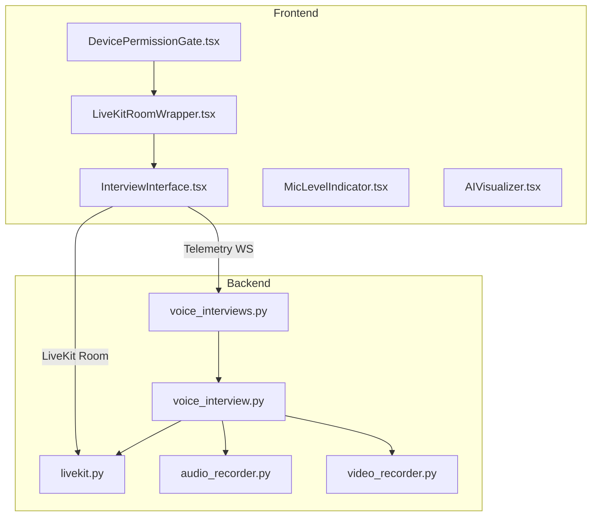
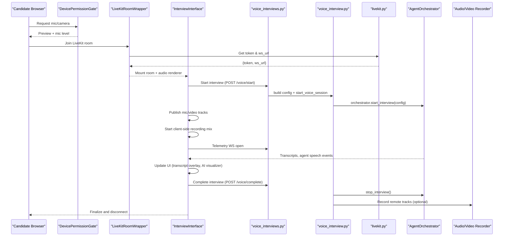
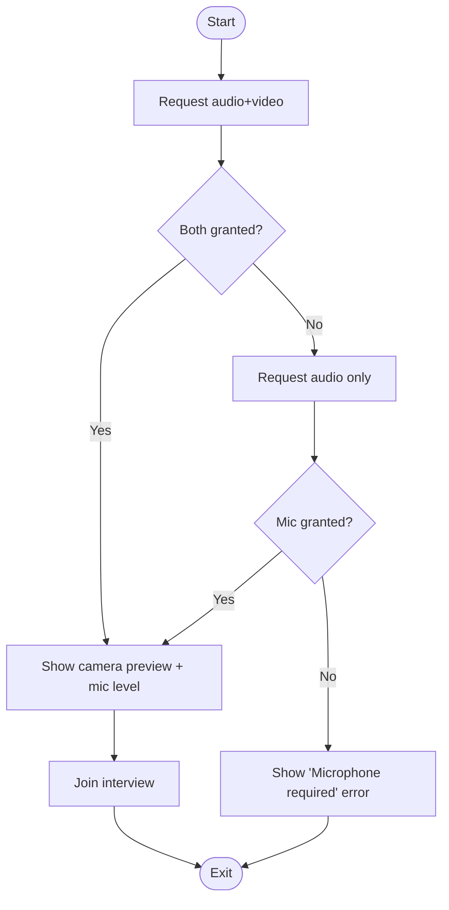
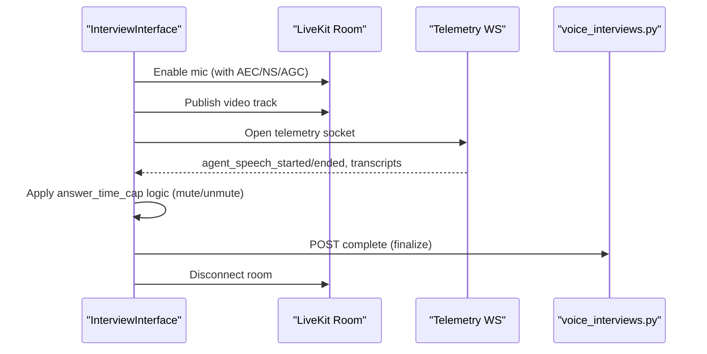
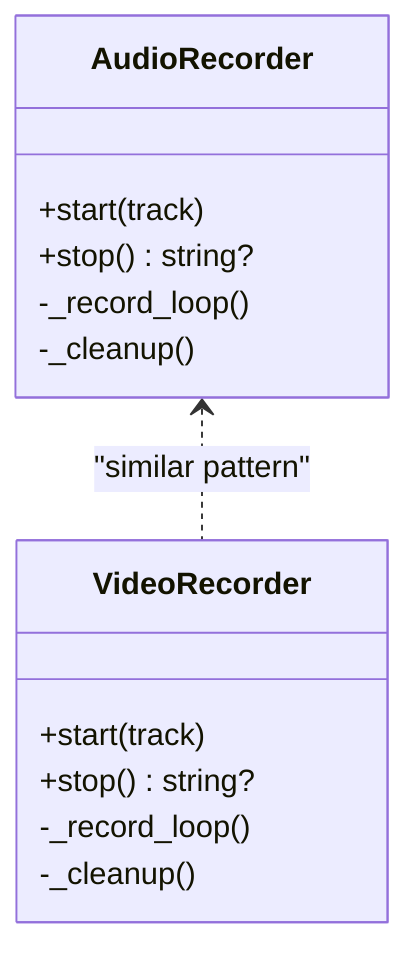
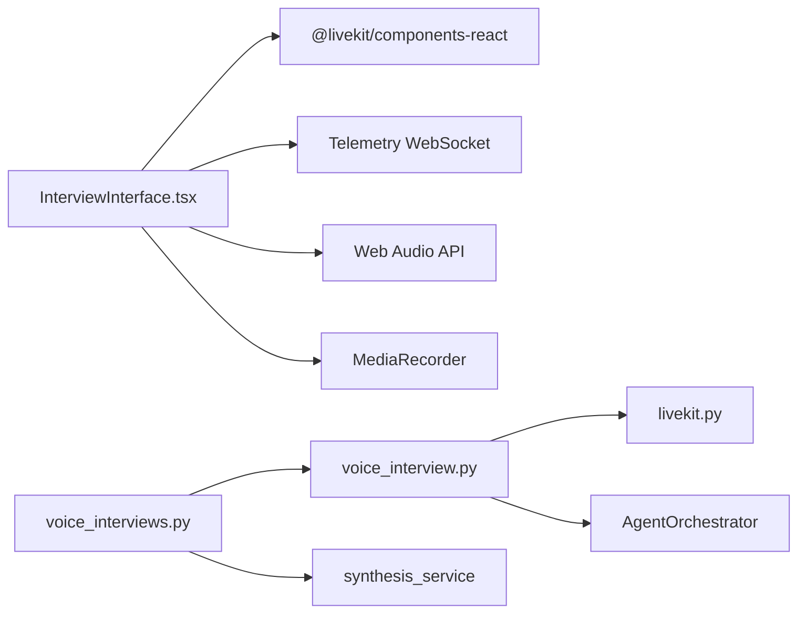

# Media Processing Pipeline

<cite>
**Referenced Files in This Document**
- [audio_recorder.py](file://Backend/app/ai/utils/audio_recorder.py)
- [video_recorder.py](file://Backend/app/ai/utils/video_recorder.py)
- [LiveKitRoomWrapper.tsx](file://Frontend/components/interviews\voice/LiveKitRoomWrapper.tsx)
- [InterviewInterface.tsx](file://Frontend/components/interviews\voice/InterviewInterface.tsx)
- [MicLevelIndicator.tsx](file://Frontend/components/interviews\voice/MicLevelIndicator.tsx)
- [AIVisualizer.tsx](file://Frontend/components/interviews\voice/AIVisualizer.tsx)
- [DevicePermissionGate.tsx](file://Frontend/components/interviews\voice/DevicePermissionGate.tsx)
- [livekit.py](file://Backend/app/services/livekit.py)
- [voice_interview.py](file://Backend/app/services/voice_interview.py)
- [voice_interviews.py](file://Backend/app/api/v1/voice_interviews.py)
</cite>

## Table of Contents
1. Introduction
2. Project Structure
3. Core Components
4. Architecture Overview
5. Detailed Component Analysis
6. Dependency Analysis
7. Performance Considerations
8. Troubleshooting Guide
9. Conclusion

## Introduction
This document explains the media processing pipeline that powers audio and video capture, transcription integration, real-time audio handling, format conversions, quality optimization, storage strategies, and UI feedback for interview sessions. It covers both frontend components (browser-side capture, mixing, visualization, and telemetry) and backend services (LiveKit token issuance, session orchestration, recording utilities, and identity verification).

## Project Structure
The media pipeline spans two layers:
- Frontend: Browser-based capture via LiveKit, Web Audio mixing, MediaRecorder-based client recording, device permission gating, microphone level indicators, AI interaction visualizer, and telemetry WebSocket communication.
- Backend: LiveKit token service, voice interview session lifecycle management, agent orchestration, transcription updates via telemetry, identity verification endpoints, and server-side recording utilities for remote tracks.

**Diagram sources**
- [DevicePermissionGate.tsx:33-77](file://Frontend/components/interviews\voice/DevicePermissionGate.tsx#L33-L77)
- [LiveKitRoomWrapper.tsx:35-76](file://Frontend/components/interviews\voice/LiveKitRoomWrapper.tsx#L35-L76)
- [InterviewInterface.tsx:474-724](file://Frontend/components/interviews\voice/InterviewInterface.tsx#L474-L724)
- [voice_interviews.py:258-287](file://Backend/app/api/v1/voice_interviews.py#L258-L287)
- [voice_interview.py:189-227](file://Backend/app/services/voice_interview.py#L189-L227)
- [livekit.py:10-38](file://Backend/app/services/livekit.py#L10-L38)
- [audio_recorder.py:16-84](file://Backend/app/ai/utils/audio_recorder.py#L16-L84)
- [video_recorder.py:16-104](file://Backend/app/ai/utils/video_recorder.py#L16-L104)

**Section sources**
- [DevicePermissionGate.tsx:33-77](file://Frontend/components/interviews\voice/DevicePermissionGate.tsx#L33-L77)
- [LiveKitRoomWrapper.tsx:35-76](file://Frontend/components/interviews\voice/LiveKitRoomWrapper.tsx#L35-L76)
- [InterviewInterface.tsx:474-724](file://Frontend/components/interviews\voice/InterviewInterface.tsx#L474-L724)
- [voice_interviews.py:258-287](file://Backend/app/api/v1/voice_interviews.py#L258-L287)
- [voice_interview.py:189-227](file://Backend/app/services/voice_interview.py#L189-L227)
- [livekit.py:10-38](file://Backend/app/services/livekit.py#L10-L38)
- [audio_recorder.py:16-84](file://Backend/app/ai/utils/audio_recorder.py#L16-L84)
- [video_recorder.py:16-104](file://Backend/app/ai/utils/video_recorder.py#L16-L104)

## Core Components
- Device Permission Gate: Requests mic/camera permissions, previews camera, and shows a live microphone level meter before joining the interview.
- LiveKit Room Wrapper: Fetches a LiveKit token and server URL, then mounts the LiveKit room with audio rendering.
- Interview Interface: Orchestrates mic/camera publishing, client-side recording mix, telemetry WebSocket, agent turn control, transcript streaming, and completion flow.
- Mic Level Indicator: Real-time frequency analysis to show microphone activity.
- AI Visualizer: Displays interviewer speaking/listening state and connection status.
- Backend Voice Interviews API: Provides endpoints to start/complete interviews, issue LiveKit tokens, handle telemetry, and run identity checks.
- Voice Session Service: Builds interview configuration, starts/stops agent sessions, and manages task lifecycle.
- LiveKit Token Service: Issues short-lived JWT tokens with room grants.
- Server-side Recorders: Capture remote audio/video tracks into WAV/WebM files on disk.

**Section sources**
- [DevicePermissionGate.tsx:33-77](file://Frontend/components/interviews\voice/DevicePermissionGate.tsx#L33-L77)
- [LiveKitRoomWrapper.tsx:35-76](file://Frontend/components/interviews\voice/LiveKitRoomWrapper.tsx#L35-L76)
- [InterviewInterface.tsx:778-800](file://Frontend/components/interviews\voice/InterviewInterface.tsx#L778-L800)
- [MicLevelIndicator.tsx:17-64](file://Frontend/components/interviews\voice/MicLevelIndicator.tsx#L17-L64)
- [AIVisualizer.tsx:9-59](file://Frontend/components/interviews\voice/AIVisualizer.tsx#L9-L59)
- [voice_interviews.py:189-236](file://Backend/app/api/v1/voice_interviews.py#L189-L236)
- [voice_interview.py:189-227](file://Backend/app/services/voice_interview.py#L189-L227)
- [livekit.py:10-38](file://Backend/app/services/livekit.py#L10-L38)
- [audio_recorder.py:16-84](file://Backend/app/ai/utils/audio_recorder.py#L16-L84)
- [video_recorder.py:16-104](file://Backend/app/ai/utils/video_recorder.py#L16-L104)

## Architecture Overview
End-to-end flow from browser capture to backend processing and storage:

**Diagram sources**
- [DevicePermissionGate.tsx:33-77](file://Frontend/components/interviews\voice/DevicePermissionGate.tsx#L33-L77)
- [LiveKitRoomWrapper.tsx:35-76](file://Frontend/components/interviews\voice/LiveKitRoomWrapper.tsx#L35-L76)
- [InterviewInterface.tsx:474-724](file://Frontend/components/interviews\voice/InterviewInterface.tsx#L474-L724)
- [voice_interviews.py:204-236](file://Backend/app/api/v1/voice_interviews.py#L204-L236)
- [voice_interview.py:189-227](file://Backend/app/services/voice_interview.py#L189-L227)
- [livekit.py:10-38](file://Backend/app/services/livekit.py#L10-L38)
- [audio_recorder.py:16-84](file://Backend/app/ai/utils/audio_recorder.py#L16-L84)
- [video_recorder.py:16-104](file://Backend/app/ai/utils/video_recorder.py#L16-L104)

## Detailed Component Analysis

### Frontend: Device Permission Gate
- Behavior: Attempts to acquire both audio and video; falls back to audio-only if camera is unavailable. Creates an AudioContext and AnalyserNode to compute volume and display a live bar. Shows a camera preview when available.
- Error Handling: If microphone access is denied, displays a clear error message instructing the user to allow permissions.
- Output: On success, transitions to a test step where users can verify devices before joining.

**Diagram sources**
- [DevicePermissionGate.tsx:33-77](file://Frontend/components/interviews\voice/DevicePermissionGate.tsx#L33-L77)
- [DevicePermissionGate.tsx:87-105](file://Frontend/components/interviews\voice/DevicePermissionGate.tsx#L87-L105)

**Section sources**
- [DevicePermissionGate.tsx:33-77](file://Frontend/components/interviews\voice/DevicePermissionGate.tsx#L33-L77)
- [DevicePermissionGate.tsx:87-105](file://Frontend/components/interviews\voice/DevicePermissionGate.tsx#L87-L105)

### Frontend: LiveKit Room Wrapper
- Responsibilities: Fetches a LiveKit token and server URL, handles errors, and renders the LiveKit room with audio rendering enabled.
- Error Handling: Displays a connection issue message if token retrieval fails; shows a loading state while preparing the interview.

**Section sources**
- [LiveKitRoomWrapper.tsx:35-76](file://Frontend/components/interviews\voice/LiveKitRoomWrapper.tsx#L35-L76)

### Frontend: Interview Interface
- Media Capture and Publishing:
  - Enables microphone with echo cancellation, noise suppression, and auto gain control based on agent state and answer time caps.
  - Publishes a local video track once the interview starts and attaches it to a self-view element.
- Client-Side Recording Mix:
  - Creates an AudioContext and a MediaStreamDestination to mix local mic and remote audio tracks for client-side recording.
  - Reuses existing LiveKit tracks to avoid duplicate hardware captures.
- Telemetry and Agent Control:
  - Opens a WebSocket to receive agent events (speech started/ended, turn pending/cleared, transcripts, setup status).
  - Enforces answer time caps by muting the candidate’s mic until the agent finishes its reply.
  - Handles reconnection with exponential backoff and limits retries.
- Completion Flow:
  - Stops client recording, stops local video track, disconnects the room, and navigates to the completion screen.

**Diagram sources**
- [InterviewInterface.tsx:211-255](file://Frontend/components/interviews\voice/InterviewInterface.tsx#L211-L255)
- [InterviewInterface.tsx:317-332](file://Frontend/components/interviews\voice/InterviewInterface.tsx#L317-L332)
- [InterviewInterface.tsx:474-724](file://Frontend/components/interviews\voice/InterviewInterface.tsx#L474-L724)
- [InterviewInterface.tsx:778-800](file://Frontend/components/interviews\voice/InterviewInterface.tsx#L778-L800)
- [voice_interviews.py:239-255](file://Backend/app/api/v1/voice_interviews.py#L239-L255)

**Section sources**
- [InterviewInterface.tsx:211-255](file://Frontend/components/interviews\voice/InterviewInterface.tsx#L211-L255)
- [InterviewInterface.tsx:317-332](file://Frontend/components/interviews\voice/InterviewInterface.tsx#L317-L332)
- [InterviewInterface.tsx:474-724](file://Frontend/components/interviews\voice/InterviewInterface.tsx#L474-L724)
- [InterviewInterface.tsx:778-800](file://Frontend/components/interviews\voice/InterviewInterface.tsx#L778-L800)

### Frontend: Mic Level Indicator
- Uses an AnalyserNode connected to the mic source to compute average frequency data and render a 5-bar indicator.
- Disables bars when muted; uses requestAnimationFrame for smooth updates.

**Section sources**
- [MicLevelIndicator.tsx:17-64](file://Frontend/components/interviews\voice/MicLevelIndicator.tsx#L17-L64)
- [MicLevelIndicator.tsx:66-118](file://Frontend/components/interviews\voice/MicLevelIndicator.tsx#L66-L118)

### Frontend: AI Visualizer
- Displays a pulsing circle when the interviewer is speaking and a static icon when listening.
- Shows connection labels indicating session status or ongoing connection attempts.

**Section sources**
- [AIVisualizer.tsx:9-59](file://Frontend/components/interviews\voice/AIVisualizer.tsx#L9-L59)

### Backend: Voice Interviews API
- Endpoints:
  - Start interview: Validates readiness, builds configuration, persists session state, and starts the voice session.
  - Complete interview: Ends the session, marks status submitted, triggers synthesis/analysis, and returns updated session payload.
  - Telemetry WebSocket: Accepts messages like user audio activity and forwards them to the active conversation agent.
  - Identity check: Accepts a base64 image, validates content type and size, compares against profile photo, and persists verdict.

**Section sources**
- [voice_interviews.py:204-236](file://Backend/app/api/v1/voice_interviews.py#L204-L236)
- [voice_interviews.py:239-255](file://Backend/app/api/v1/voice_interviews.py#L239-L255)
- [voice_interviews.py:258-287](file://Backend/app/api/v1/voice_interviews.py#L258-L287)
- [voice_interviews.py:140-173](file://Backend/app/api/v1/voice_interviews.py#L140-L173)

### Backend: Voice Session Service
- Builds interview configurations for profile screening and job interviews using strategies and candidate/posting data.
- Ensures required integrations (LiveKit, AI) are configured before starting.
- Registers live sessions, starts agent tasks with concurrency guards, and supports graceful wrap-up and stop.

**Section sources**
- [voice_interview.py:53-151](file://Backend/app/services/voice_interview.py#L53-L151)
- [voice_interview.py:154-186](file://Backend/app/services/voice_interview.py#L154-L186)
- [voice_interview.py:189-227](file://Backend/app/services/voice_interview.py#L189-L227)

### Backend: LiveKit Token Service
- Issues short-lived JWT tokens with video grants for joining specific rooms.
- Validates configuration presence and raises a configuration error if missing.

**Section sources**
- [livekit.py:10-38](file://Backend/app/services/livekit.py#L10-L38)

### Backend: Server-Side Recorders
- AudioRecorder:
  - Records remote audio tracks to WAV files at 48kHz, mono, 16-bit.
  - Streams frames from LiveKit’s AudioStream and writes to disk asynchronously.
  - Cleans up resources on stop or error.
- VideoRecorder:
  - Captures remote video tracks as raw VP8 frames into a minimal WebM container header for playback compatibility.
  - Writes frame bytes to disk and cleans up on stop or error.

**Diagram sources**
- [audio_recorder.py:16-84](file://Backend/app/ai/utils/audio_recorder.py#L16-L84)
- [video_recorder.py:16-104](file://Backend/app/ai/utils/video_recorder.py#L16-L104)

**Section sources**
- [audio_recorder.py:16-84](file://Backend/app/ai/utils/audio_recorder.py#L16-L84)
- [video_recorder.py:16-104](file://Backend/app/ai/utils/video_recorder.py#L16-L104)

## Dependency Analysis
- Frontend dependencies:
  - LiveKit SDK for real-time audio/video and room management.
  - Web Audio API for mixing and level analysis.
  - MediaRecorder for client-side recording (mixing mic and remote audio).
  - Telemetry WebSocket for bidirectional signaling with the backend.
- Backend dependencies:
  - LiveKit API for token issuance.
  - Agent orchestrator for conversation flow and transcription.
  - Storage layer for persisting session state and identity verification results.
  - Synthesis service triggered upon interview completion for analysis.

**Diagram sources**
- [InterviewInterface.tsx:474-724](file://Frontend/components/interviews\voice/InterviewInterface.tsx#L474-L724)
- [voice_interviews.py:204-236](file://Backend/app/api/v1/voice_interviews.py#L204-L236)
- [voice_interview.py:189-227](file://Backend/app/services/voice_interview.py#L189-L227)
- [livekit.py:10-38](file://Backend/app/services/livekit.py#L10-L38)

**Section sources**
- [InterviewInterface.tsx:474-724](file://Frontend/components/interviews\voice/InterviewInterface.tsx#L474-L724)
- [voice_interviews.py:204-236](file://Backend/app/api/v1/voice_interviews.py#L204-L236)
- [voice_interview.py:189-227](file://Backend/app/services/voice_interview.py#L189-L227)
- [livekit.py:10-38](file://Backend/app/services/livekit.py#L10-L38)

## Performance Considerations
- Efficient Media Capture:
  - Reuse existing LiveKit tracks for client-side recording to avoid multiple getUserMedia calls.
  - Use small FFT sizes for level meters to reduce CPU usage.
- Adaptive Mic Control:
  - Dynamically enable/disable mic based on agent states and answer time caps to minimize unnecessary processing.
- Robust Telemetry:
  - Implement retry with exponential backoff for telemetry WebSocket connections to handle transient network issues.
- Concurrency Guards:
  - Prevent overlapping start tasks for voice sessions to avoid race conditions.
- Resource Cleanup:
  - Ensure proper closing of files, streams, and contexts on stop or unmount to prevent leaks.

[No sources needed since this section provides general guidance]

## Troubleshooting Guide
- Microphone/Camera Permissions:
  - If mic access is denied, the device gate shows a clear error prompting the user to allow permissions.
  - Camera fallback allows proceeding in audio-only mode.
- LiveKit Connection Issues:
  - The room wrapper displays a connection issue message if token retrieval fails.
  - Telemetry reconnection logic attempts multiple retries before giving up.
- Agent State Stalls:
  - Safety timeouts clear stale “agent speaking” flags to prevent UI lockups.
- Identity Check Failures:
  - Invalid image formats or empty payloads return validation errors; missing profile photos result in a no-reference verdict.
- Network Interruptions:
  - Telemetry close handlers detect policy violation codes and avoid auto-retry for invalid/expired links.

**Section sources**
- [DevicePermissionGate.tsx:33-77](file://Frontend/components/interviews\voice/DevicePermissionGate.tsx#L33-L77)
- [LiveKitRoomWrapper.tsx:44-61](file://Frontend/components/interviews\voice/LiveKitRoomWrapper.tsx#L44-L61)
- [InterviewInterface.tsx:198-209](file://Frontend/components/interviews\voice/InterviewInterface.tsx#L198-L209)
- [InterviewInterface.tsx:684-707](file://Frontend/components/interviews\voice/InterviewInterface.tsx#L684-L707)
- [voice_interviews.py:60-92](file://Backend/app/api/v1/voice_interviews.py#L60-L92)

## Conclusion
The media processing pipeline integrates robust frontend capture and visualization with reliable backend orchestration and storage. It balances real-time responsiveness with resilience through adaptive controls, telemetry-driven coordination, and careful resource management. The design supports concurrent sessions, graceful error recovery, and clear user feedback throughout the interview lifecycle.

[No sources needed since this section summarizes without analyzing specific files]