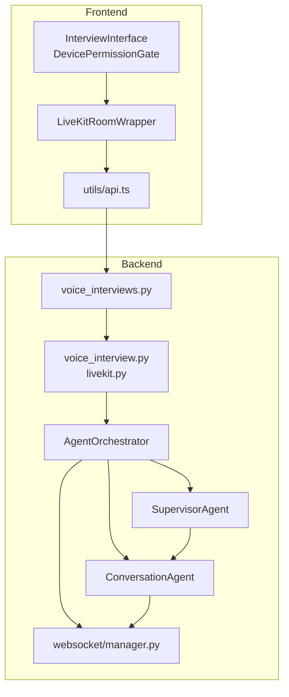
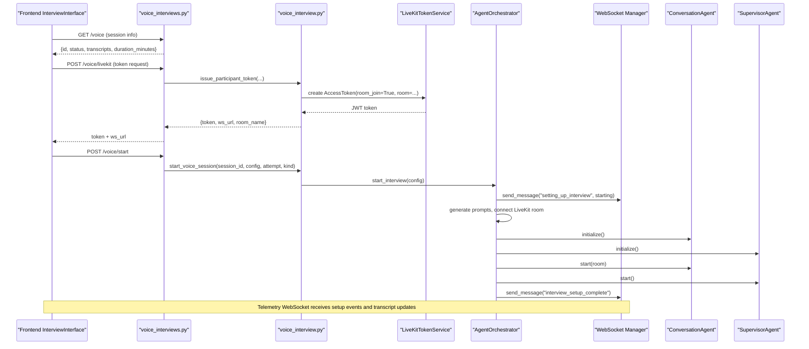
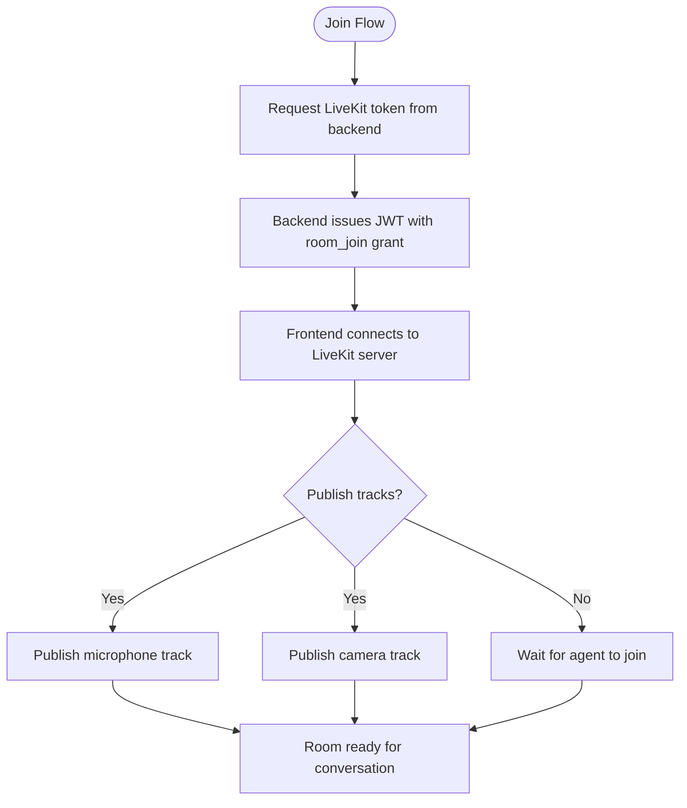
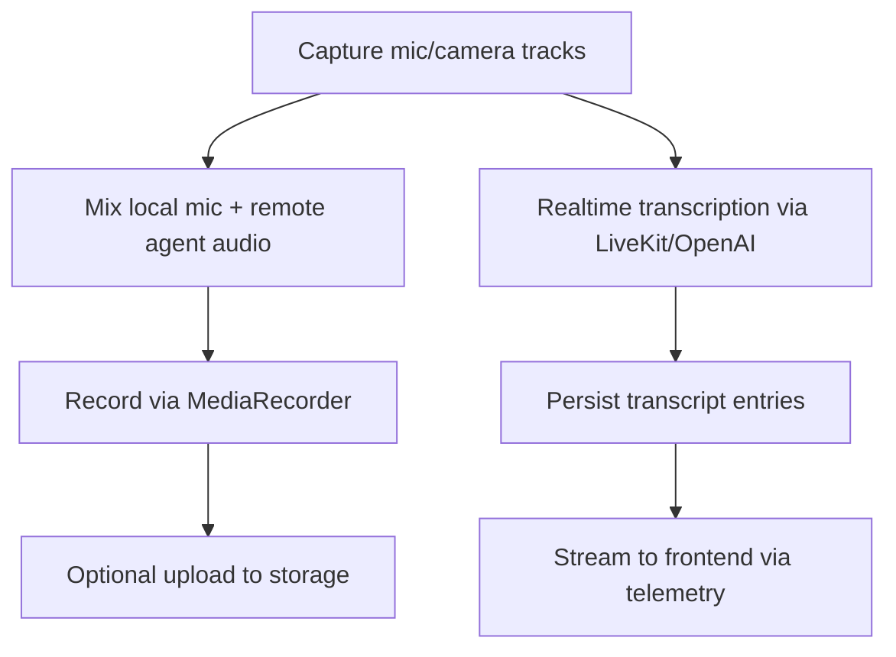
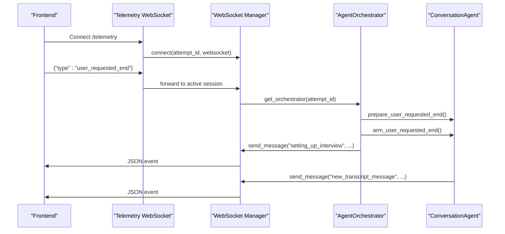
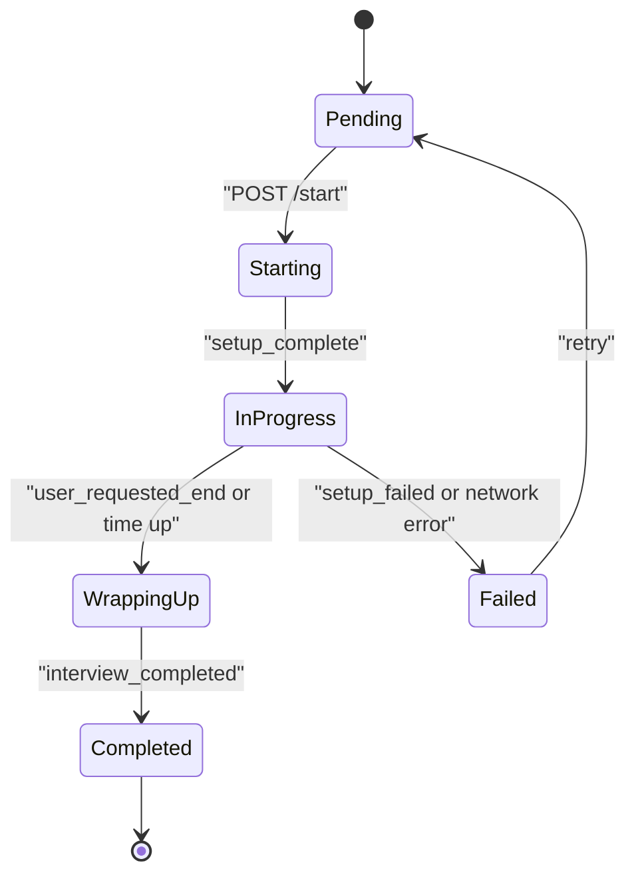
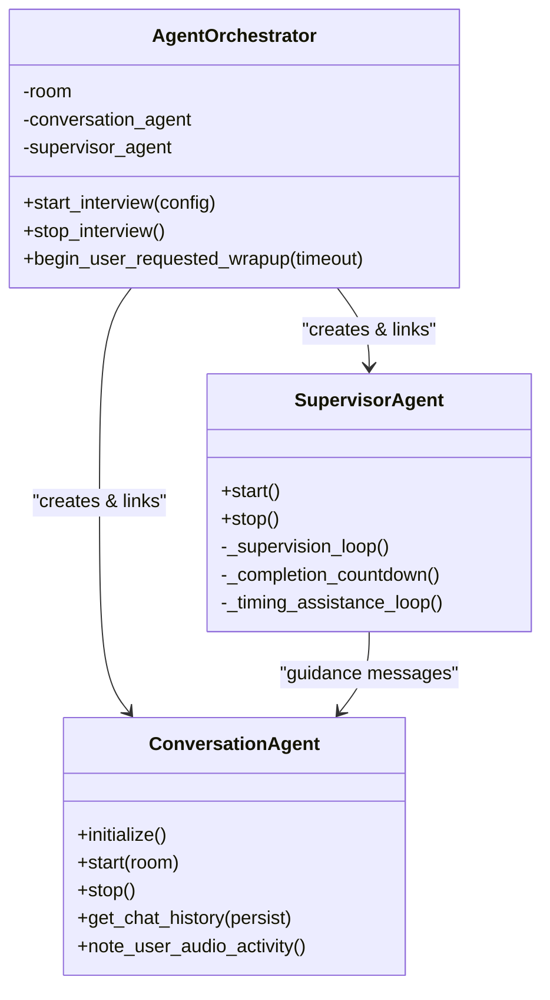
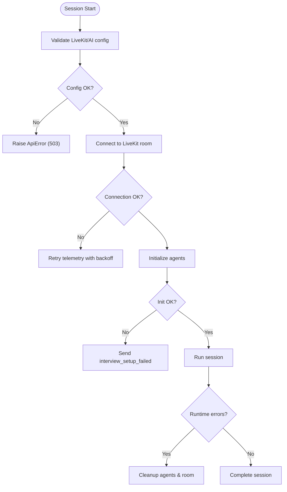
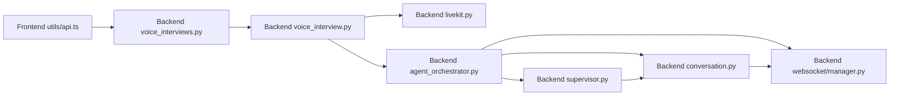

# Real-time Interview System

<cite>
**Referenced Files in This Document**
- [voice_interviews.py](file://Backend/app/api/v1/voice_interviews.py)
- [voice_interview.py](file://Backend/app/services/voice_interview.py)
- [livekit.py](file://Backend/app/services/livekit.py)
- [agent_orchestrator.py](file://Backend/app/ai/services/agent_orchestrator.py)
- [conversation.py](file://Backend/app/ai/agents/conversation.py)
- [supervisor.py](file://Backend/app/ai/agents/supervisor.py)
- [manager.py](file://Backend/app/websocket/manager.py)
- [config.py](file://Backend/app/core/config.py)
- [api.ts](file://Frontend/utils/api.ts)
- [LiveKitRoomWrapper.tsx](file://Frontend/components/interviews/voice/LiveKitRoomWrapper.tsx)
- [InterviewInterface.tsx](file://Frontend/components/interviews/voice/InterviewInterface.tsx)
- [TranscriptOverlay.tsx](file://Frontend/components/interviews/voice/TranscriptOverlay.tsx)
- [DevicePermissionGate.tsx](file://Frontend/components/interviews/voice/DevicePermissionGate.tsx)
</cite>

## Table of Contents
1. [Introduction](#introduction)
2. [Project Structure](#project-structure)
3. [Core Components](#core-components)
4. [Architecture Overview](#architecture-overview)
5. [Detailed Component Analysis](#detailed-component-analysis)
6. [Dependency Analysis](#dependency-analysis)
7. [Performance Considerations](#performance-considerations)
8. [Troubleshooting Guide](#troubleshooting-guide)
9. [Conclusion](#conclusion)
10. [Appendices](#appendices)

## Introduction
This document explains the real-time interview system that combines LiveKit for audio/video streaming with an AI agent orchestration layer to conduct voice interviews. It covers room management, participant handling, media processing, WebSocket telemetry, session lifecycle (including device permissions, recording, and transcription), integration between LiveKit rooms and AI agents, error handling strategies, debugging tools, monitoring approaches, and troubleshooting guidance for production sessions.

## Project Structure
The system is split into a backend API service and a Next.js frontend:
- Backend
  - FastAPI routes expose endpoints to start, complete, and manage voice interviews.
  - Services generate LiveKit tokens, build interview configurations, and coordinate AI agent orchestration.
  - AI agents implement conversation flow, supervision, and realtime signaling via LiveKit and OpenAI Realtime.
  - A WebSocket manager provides per-session telemetry channels for status updates and control messages.
- Frontend
  - React components connect to LiveKit rooms, manage device permissions, render live transcripts, and communicate with the backend via REST and WebSockets.
  - The interview UI orchestrates setup stages, handles user interactions, and coordinates completion flows.

**Diagram sources**
- [voice_interviews.py:177-416](file://Backend/app/api/v1/voice_interviews.py#L177-L416)
- [voice_interview.py:189-251](file://Backend/app/services/voice_interview.py#L189-L251)
- [agent_orchestrator.py:42-192](file://Backend/app/ai/services/agent_orchestrator.py#L42-L192)
- [conversation.py:184-800](file://Backend/app/ai/agents/conversation.py#L184-L800)
- [supervisor.py:20-150](file://Backend/app/ai/agents/supervisor.py#L20-L150)
- [manager.py:14-96](file://Backend/app/websocket/manager.py#L14-L96)
- [api.ts:54-123](file://Frontend/utils/api.ts#L54-L123)
- [LiveKitRoomWrapper.tsx:21-104](file://Frontend/components/interviews/voice/LiveKitRoomWrapper.tsx#L21-L104)
- [InterviewInterface.tsx:74-763](file://Frontend/components/interviews/voice/InterviewInterface.tsx#L74-L763)

**Section sources**
- [voice_interviews.py:177-416](file://Backend/app/api/v1/voice_interviews.py#L177-L416)
- [voice_interview.py:189-251](file://Backend/app/services/voice_interview.py#L189-L251)
- [agent_orchestrator.py:42-192](file://Backend/app/ai/services/agent_orchestrator.py#L42-L192)
- [manager.py:14-96](file://Backend/app/websocket/manager.py#L14-L96)
- [api.ts:54-123](file://Frontend/utils/api.ts#L54-L123)
- [LiveKitRoomWrapper.tsx:21-104](file://Frontend/components/interviews/voice/LiveKitRoomWrapper.tsx#L21-L104)
- [InterviewInterface.tsx:74-763](file://Frontend/components/interviews/voice/InterviewInterface.tsx#L74-L763)

## Core Components
- Voice Interview Endpoints: Provide session retrieval, LiveKit token issuance, start/complete flows, identity checks, and telemetry WebSocket endpoints for both profile screening and applied job interviews.
- LiveKit Token Service: Generates secure access tokens with appropriate grants and TTL for participants and agents.
- Agent Orchestrator: Manages background setup, connects to LiveKit rooms, initializes Conversation and Supervisor agents, and signals frontend progress via telemetry.
- Conversation Agent: Handles realtime speech-to-text, turn-taking, transcript persistence, and emits events to the frontend.
- Supervisor Agent: Periodically analyzes conversation context and provides guidance to steer KPI coverage and timing.
- WebSocket Manager: Tracks active connections per session, sends messages, and buffers pending messages when no clients are connected.
- Frontend Interview UI: Connects to LiveKit, manages device permissions, renders live transcripts, and coordinates start/complete flows.

**Section sources**
- [voice_interviews.py:177-416](file://Backend/app/api/v1/voice_interviews.py#L177-L416)
- [livekit.py:10-39](file://Backend/app/services/livekit.py#L10-L39)
- [agent_orchestrator.py:29-192](file://Backend/app/ai/services/agent_orchestrator.py#L29-L192)
- [conversation.py:184-800](file://Backend/app/ai/agents/conversation.py#L184-L800)
- [supervisor.py:20-150](file://Backend/app/ai/agents/supervisor.py#L20-L150)
- [manager.py:14-96](file://Backend/app/websocket/manager.py#L14-L96)
- [InterviewInterface.tsx:74-763](file://Frontend/components/interviews/voice/InterviewInterface.tsx#L74-L763)

## Architecture Overview
The system uses LiveKit for real-time media and an AI-driven agent layer for conversation orchestration. The frontend establishes a LiveKit room connection and a separate telemetry WebSocket to receive status updates and control messages. The backend coordinates token issuance, agent initialization, and session lifecycle.

**Diagram sources**
- [voice_interviews.py:177-236](file://Backend/app/api/v1/voice_interviews.py#L177-L236)
- [voice_interviews.py:321-361](file://Backend/app/api/v1/voice_interviews.py#L321-L361)
- [voice_interview.py:189-216](file://Backend/app/services/voice_interview.py#L189-L216)
- [livekit.py:14-39](file://Backend/app/services/livekit.py#L14-L39)
- [agent_orchestrator.py:42-192](file://Backend/app/ai/services/agent_orchestrator.py#L42-L192)
- [manager.py:48-79](file://Backend/app/websocket/manager.py#L48-L79)

## Detailed Component Analysis

### Room Management and Participant Handling
- Room creation and joining:
  - Frontend requests a LiveKit token from the backend using the interview’s access token.
  - Backend issues a token scoped to a specific room name with join grants and a configurable TTL.
  - Frontend connects to the LiveKit server URL and joins the room; audio/video tracks are published by participants or agents.
- Participant identities:
  - Candidate identity is derived from candidate ID (e.g., “candidate-{id}”).
  - Agent identity is generated with agent grants to participate in the room.

**Diagram sources**
- [voice_interviews.py:189-201](file://Backend/app/api/v1/voice_interviews.py#L189-L201)
- [voice_interviews.py:306-318](file://Backend/app/api/v1/voice_interviews.py#L306-L318)
- [voice_interview.py:230-251](file://Backend/app/services/voice_interview.py#L230-L251)
- [agent_orchestrator.py:349-361](file://Backend/app/ai/services/agent_orchestrator.py#L349-L361)
- [InterviewInterface.tsx:317-332](file://Frontend/components/interviews/voice/InterviewInterface.tsx#L317-L332)

**Section sources**
- [voice_interviews.py:189-201](file://Backend/app/api/v1/voice_interviews.py#L189-L201)
- [voice_interviews.py:306-318](file://Backend/app/api/v1/voice_interviews.py#L306-L318)
- [voice_interview.py:230-251](file://Backend/app/services/voice_interview.py#L230-L251)
- [agent_orchestrator.py:349-361](file://Backend/app/ai/services/agent_orchestrator.py#L349-L361)
- [InterviewInterface.tsx:317-332](file://Frontend/components/interviews/voice/InterviewInterface.tsx#L317-L332)

### Media Processing and Recording
- Audio/video capture:
  - Frontend captures microphone and camera tracks using LiveKit client APIs.
  - Device permission gate ensures required permissions before joining.
- Client-side recording:
  - The interview interface mixes local mic and remote agent audio via Web Audio API and records using MediaRecorder.
  - Recording upload endpoint exists but is optional in this pilot implementation.
- Transcription:
  - Real-time transcription is handled by LiveKit/OpenAI Realtime pipeline; transcripts are persisted incrementally and surfaced to the frontend via telemetry.

**Diagram sources**
- [DevicePermissionGate.tsx:33-77](file://Frontend/components/interviews/voice/DevicePermissionGate.tsx#L33-L77)
- [InterviewInterface.tsx:779-800](file://Frontend/components/interviews/voice/InterviewInterface.tsx#L779-L800)
- [api.ts:110-113](file://Frontend/utils/api.ts#L110-L113)
- [conversation.py:204-238](file://Backend/app/ai/agents/conversation.py#L204-L238)
- [conversation.py:607-635](file://Backend/app/ai/agents/conversation.py#L607-L635)

**Section sources**
- [DevicePermissionGate.tsx:33-77](file://Frontend/components/interviews/voice/DevicePermissionGate.tsx#L33-L77)
- [InterviewInterface.tsx:779-800](file://Frontend/components/interviews/voice/InterviewInterface.tsx#L779-L800)
- [api.ts:110-113](file://Frontend/utils/api.ts#L110-L113)
- [conversation.py:204-238](file://Backend/app/ai/agents/conversation.py#L204-L238)
- [conversation.py:607-635](file://Backend/app/ai/agents/conversation.py#L607-L635)

### WebSocket Communication Protocol
- Telemetry endpoints:
  - Per-attempt telemetry WebSocket accepts JSON messages and forwards control signals to the active conversation agent.
  - Supported client signals include user-requested end and user audio activity notifications.
- Server-to-client messages:
  - Setup progress events (“setting_up_interview” with statuses like “starting”, “generating_persona”, “connecting_to_room”, “initializing_agents”).
  - Turn control events (“agent_turn_pending”, “user_turn_granted”, “answer_time_cap”).
  - Speech events (“agent_speech_started”, “agent_speech_ended”, “user_speech_started”, “user_speech_ended”).
  - Transcript events (“new_transcript_message”, “transcript_history”).
  - Completion events (“interview_completed”, “interview_failed”, “interview_setup_failed”).

**Diagram sources**
- [voice_interviews.py:258-288](file://Backend/app/api/v1/voice_interviews.py#L258-L288)
- [voice_interviews.py:387-416](file://Backend/app/api/v1/voice_interviews.py#L387-L416)
- [manager.py:22-79](file://Backend/app/websocket/manager.py#L22-L79)
- [agent_orchestrator.py:61-66](file://Backend/app/ai/services/agent_orchestrator.py#L61-L66)
- [conversation.py:759-800](file://Backend/app/ai/agents/conversation.py#L759-L800)

**Section sources**
- [voice_interviews.py:258-288](file://Backend/app/api/v1/voice_interviews.py#L258-L288)
- [voice_interviews.py:387-416](file://Backend/app/api/v1/voice_interviews.py#L387-L416)
- [manager.py:22-79](file://Backend/app/websocket/manager.py#L22-L79)
- [agent_orchestrator.py:61-66](file://Backend/app/ai/services/agent_orchestrator.py#L61-L66)
- [conversation.py:759-800](file://Backend/app/ai/agents/conversation.py#L759-L800)

### Interview Session Lifecycle
- Initialization:
  - Frontend retrieves session metadata and requests a LiveKit token.
  - Backend validates configuration (LiveKit and AI services) and builds interview configuration based on attempt and candidate/posting data.
  - Orchestrator starts background setup, generates prompts, connects to LiveKit, initializes agents, and signals readiness.
- Device permissions:
  - DevicePermissionGate requests microphone and camera access; audio-only fallback is supported.
- Active session:
  - Telemetry WebSocket streams setup progress, turn control, and transcript updates.
  - Conversation agent manages turn-taking, time caps, and closing flows.
- Completion:
  - Frontend triggers completion; backend ends the session, persists state, and schedules analysis.
  - Agent orchestrator performs cleanup and posts AI rating asynchronously.

**Diagram sources**
- [voice_interviews.py:204-256](file://Backend/app/api/v1/voice_interviews.py#L204-L256)
- [voice_interviews.py:321-385](file://Backend/app/api/v1/voice_interviews.py#L321-L385)
- [agent_orchestrator.py:42-192](file://Backend/app/ai/services/agent_orchestrator.py#L42-L192)
- [InterviewInterface.tsx:726-763](file://Frontend/components/interviews/voice/InterviewInterface.tsx#L726-L763)

**Section sources**
- [voice_interviews.py:204-256](file://Backend/app/api/v1/voice_interviews.py#L204-L256)
- [voice_interviews.py:321-385](file://Backend/app/api/v1/voice_interviews.py#L321-L385)
- [agent_orchestrator.py:42-192](file://Backend/app/ai/services/agent_orchestrator.py#L42-L192)
- [InterviewInterface.tsx:726-763](file://Frontend/components/interviews/voice/InterviewInterface.tsx#L726-L763)

### Integration Between LiveKit Rooms and AI Agents
- Orchestration:
  - Orchestrator connects to the LiveKit room using an agent token and initializes Conversation and Supervisor agents.
  - Agents share an HTTP session for plugin stability and link each other for inter-agent communication.
- Realtime conversation:
  - Conversation agent subscribes to realtime events, transcribes speech, and emits transcript and turn-control events via telemetry.
  - Supervisor agent periodically reviews transcript snippets and provides guidance to maintain KPI coverage and timing.

**Diagram sources**
- [agent_orchestrator.py:29-192](file://Backend/app/ai/services/agent_orchestrator.py#L29-L192)
- [conversation.py:184-800](file://Backend/app/ai/agents/conversation.py#L184-L800)
- [supervisor.py:20-150](file://Backend/app/ai/agents/supervisor.py#L20-L150)

**Section sources**
- [agent_orchestrator.py:29-192](file://Backend/app/ai/services/agent_orchestrator.py#L29-L192)
- [conversation.py:184-800](file://Backend/app/ai/agents/conversation.py#L184-L800)
- [supervisor.py:20-150](file://Backend/app/ai/agents/supervisor.py#L20-L150)

### Error Handling Strategies
- Configuration errors:
  - Backend validates LiveKit and AI configuration before starting voice sessions; raises structured errors if missing.
- Network interruptions:
  - Frontend implements telemetry WebSocket reconnection with exponential backoff and max retries.
  - WebSocket manager buffers pending messages and flushes them when connections reconnect.
- Device failures:
  - DevicePermissionGate handles permission denials and falls back to audio-only mode.
  - Microphone toggling includes error handling and user feedback.
- Service unavailability:
  - Orchestrator catches setup exceptions and sends failure events to the frontend; cleanup tasks ensure resources are released.

**Diagram sources**
- [voice_interview.py:154-166](file://Backend/app/services/voice_interview.py#L154-L166)
- [InterviewInterface.tsx:474-724](file://Frontend/components/interviews/voice/InterviewInterface.tsx#L474-L724)
- [manager.py:48-88](file://Backend/app/websocket/manager.py#L48-L88)
- [DevicePermissionGate.tsx:33-77](file://Frontend/components/interviews/voice/DevicePermissionGate.tsx#L33-L77)
- [agent_orchestrator.py:184-192](file://Backend/app/ai/services/agent_orchestrator.py#L184-L192)

**Section sources**
- [voice_interview.py:154-166](file://Backend/app/services/voice_interview.py#L154-L166)
- [InterviewInterface.tsx:474-724](file://Frontend/components/interviews/voice/InterviewInterface.tsx#L474-L724)
- [manager.py:48-88](file://Backend/app/websocket/manager.py#L48-L88)
- [DevicePermissionGate.tsx:33-77](file://Frontend/components/interviews/voice/DevicePermissionGate.tsx#L33-L77)
- [agent_orchestrator.py:184-192](file://Backend/app/ai/services/agent_orchestrator.py#L184-L192)

### Debugging Tools and Monitoring Approaches
- Telemetry events:
  - Use the telemetry WebSocket to observe setup stages, turn control, and transcript updates in real time.
- Logging:
  - Backend logs agent activities, setup steps, and errors; supervisor logs guidance decisions and timing assistance.
- Frontend diagnostics:
  - Console logs capture telemetry message parsing and connection states; setup status messages guide users through issues.
- Production monitoring:
  - Track WebSocket connection counts and pending message queues in the manager to detect bottlenecks.
  - Monitor agent task lifecycles and cleanup to prevent resource leaks.

**Section sources**
- [manager.py:14-96](file://Backend/app/websocket/manager.py#L14-L96)
- [agent_orchestrator.py:55-71](file://Backend/app/ai/services/agent_orchestrator.py#L55-L71)
- [supervisor.py:137-150](file://Backend/app/ai/agents/supervisor.py#L137-L150)
- [InterviewInterface.tsx:505-674](file://Frontend/components/interviews/voice/InterviewInterface.tsx#L505-L674)

## Dependency Analysis
Key dependencies and relationships:
- Frontend depends on LiveKit components and the backend API for tokens and session management.
- Backend routes depend on services for token issuance and session orchestration.
- Orchestrator depends on LiveKit SDK and OpenAI Realtime plugins for conversation and supervision.
- WebSocket manager is shared across orchestrator and conversation agent for telemetry.

**Diagram sources**
- [api.ts:54-123](file://Frontend/utils/api.ts#L54-L123)
- [voice_interviews.py:177-416](file://Backend/app/api/v1/voice_interviews.py#L177-L416)
- [voice_interview.py:189-251](file://Backend/app/services/voice_interview.py#L189-L251)
- [livekit.py:10-39](file://Backend/app/services/livekit.py#L10-L39)
- [agent_orchestrator.py:29-192](file://Backend/app/ai/services/agent_orchestrator.py#L29-L192)
- [conversation.py:184-800](file://Backend/app/ai/agents/conversation.py#L184-L800)
- [supervisor.py:20-150](file://Backend/app/ai/agents/supervisor.py#L20-L150)
- [manager.py:14-96](file://Backend/app/websocket/manager.py#L14-L96)

**Section sources**
- [api.ts:54-123](file://Frontend/utils/api.ts#L54-L123)
- [voice_interviews.py:177-416](file://Backend/app/api/v1/voice_interviews.py#L177-L416)
- [voice_interview.py:189-251](file://Backend/app/services/voice_interview.py#L189-L251)
- [livekit.py:10-39](file://Backend/app/services/livekit.py#L10-L39)
- [agent_orchestrator.py:29-192](file://Backend/app/ai/services/agent_orchestrator.py#L29-L192)
- [conversation.py:184-800](file://Backend/app/ai/agents/conversation.py#L184-L800)
- [supervisor.py:20-150](file://Backend/app/ai/agents/supervisor.py#L20-L150)
- [manager.py:14-96](file://Backend/app/websocket/manager.py#L14-L96)

## Performance Considerations
- Token TTL and connection reuse:
  - Configure LiveKit token TTL to balance security and reconnection overhead.
- WebSocket buffering:
  - The manager limits pending messages to avoid memory growth during disconnections.
- Agent tasks:
  - Supervisor timing assistance and completion countdown run as background tasks; ensure they are canceled on session end.
- Media mixing:
  - Client-side audio mixing uses Web Audio nodes; detach sources on cleanup to prevent leaks.
- Transcription batching:
  - Conversation agent merges close-in-time user transcripts to reduce noise and improve efficiency.

[No sources needed since this section provides general guidance]

## Troubleshooting Guide
Common issues and resolutions:
- No microphone or camera access:
  - Ensure browser permissions are granted; use DevicePermissionGate to test devices before joining.
- Telemetry WebSocket disconnects:
  - Frontend automatically reconnects with exponential backoff; check for invalid/expired links (code 1008).
- Agent setup fails:
  - Verify LiveKit and AI configuration; review setup_failed messages and backend logs.
- Mic stays muted:
  - Check turn control events; ensure user_turn_granted is received and answer_time_cap is cleared after agent speech ends.
- Transcript not updating:
  - Confirm new_transcript_message events are being sent and parsed; verify WebSocket connection state.

**Section sources**
- [DevicePermissionGate.tsx:33-77](file://Frontend/components/interviews/voice/DevicePermissionGate.tsx#L33-L77)
- [InterviewInterface.tsx:474-724](file://Frontend/components/interviews/voice/InterviewInterface.tsx#L474-L724)
- [agent_orchestrator.py:184-192](file://Backend/app/ai/services/agent_orchestrator.py#L184-L192)
- [conversation.py:759-800](file://Backend/app/ai/agents/conversation.py#L759-L800)

## Conclusion
The real-time interview system integrates LiveKit media streaming with an AI-driven conversation layer to deliver interactive, supervised interviews. Robust telemetry, device permission handling, and resilient error recovery ensure a smooth candidate experience. The modular architecture allows scaling and customization of agent behaviors, while monitoring and debugging tools support production reliability.

[No sources needed since this section summarizes without analyzing specific files]

## Appendices
- Configuration keys:
  - LiveKit settings: URL, API key, secret, token TTL.
  - AI settings: provider, model, timeouts, VAD parameters, language defaults.
- Endpoint summary:
  - Session retrieval, token issuance, start/complete, identity checks, telemetry WebSocket.

**Section sources**
- [config.py:72-120](file://Backend/app/core/config.py#L72-L120)
- [voice_interviews.py:177-416](file://Backend/app/api/v1/voice_interviews.py#L177-L416)