# Session Lifecycle Management

<cite>
**Referenced Files in This Document**
- [interview_state.py](file://Backend/app/ai/utils/interview_state.py)
- [conversation.py](file://Backend/app/ai/agents/conversation.py)
- [supervisor.py](file://Backend/app/ai/agents/supervisor.py)
- [agent_orchestrator.py](file://Backend/app/ai/services/agent_orchestrator.py)
- [voice_interviews.py](file://Backend/app/api/v1/voice_interviews.py)
- [voice_interview.py](file://Backend/app/services/voice_interview.py)
- [database.py](file://Backend/app/api/models/database.py)
- [interview.py](file://Backend/app/api/models/interview.py)
- [manager.py](file://Backend/app/websocket/manager.py)
- [InterviewInterface.tsx](file://Frontend/components/interviews/voice/InterviewInterface.tsx)
- [InterviewSetup.tsx](file://Frontend/components/interviews/voice/InterviewSetup.tsx)
- [LiveKitRoomWrapper.tsx](file://Frontend/components/interviews/voice/LiveKitRoomWrapper.tsx)
</cite>

## Table of Contents
1. Introduction
2. Project Structure
3. Core Components
4. Architecture Overview
5. Detailed Component Analysis
6. Dependency Analysis
7. Performance Considerations
8. Troubleshooting Guide
9. Conclusion

## Introduction
This document explains the end-to-end lifecycle management of voice interview sessions from initialization through completion. It covers the state machine used to track conversation phases, session persistence and recovery after interruptions, cleanup procedures, frontend-backend coordination, event handling, timeout management, graceful degradation, AI agent orchestration, and data export/reporting integration points.

## Project Structure
The system is split into a backend (FastAPI + LiveKit agents) and a frontend (Next.js with LiveKit components). The key layers are:
- Frontend UI and telemetry: manages room connection, telemetry WebSocket, setup progress, and user interactions.
- Backend API: exposes endpoints to start, complete, and monitor interviews; issues LiveKit tokens; persists session metadata.
- Agent orchestration: initializes and coordinates ConversationAgent and SupervisorAgent for real-time conversation flow.
- State and persistence: maintains in-memory state with database-backed transcripts and status for resilience.

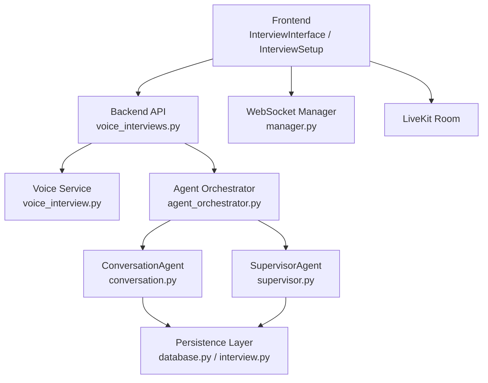

**Diagram sources**
- [voice_interviews.py:177-256](file://Backend/app/api/v1/voice_interviews.py#L177-L256)
- [voice_interview.py:189-227](file://Backend/app/services/voice_interview.py#L189-L227)
- [agent_orchestrator.py:42-180](file://Backend/app/ai/services/agent_orchestrator.py#L42-L180)
- [conversation.py:184-310](file://Backend/app/ai/agents/conversation.py#L184-L310)
- [supervisor.py:61-117](file://Backend/app/ai/agents/supervisor.py#L61-L117)
- [database.py:72-98](file://Backend/app/api/models/database.py#L72-L98)
- [InterviewInterface.tsx:474-724](file://Frontend/components/interviews/voice/InterviewInterface.tsx#L474-L724)

**Section sources**
- [voice_interviews.py:177-256](file://Backend/app/api/v1/voice_interviews.py#L177-L256)
- [voice_interview.py:189-227](file://Backend/app/services/voice_interview.py#L189-L227)
- [agent_orchestrator.py:42-180](file://Backend/app/ai/services/agent_orchestrator.py#L42-L180)
- [InterviewInterface.tsx:474-724](file://Frontend/components/interviews/voice/InterviewInterface.tsx#L474-L724)

## Core Components
- InterviewState: defines the conversation phase state machine and time-based controls for timeouts, grace periods, and wrap-up behavior.
- ConversationAgent: handles real-time speech events, turn-taking, transcript persistence, and end-interview confirmation flows.
- SupervisorAgent: monitors progress, timing, KPI coverage, and triggers questioning-end and closing sequences.
- AgentOrchestrator: coordinates setup, agent lifecycle, LiveKit room, and teardown; emits setup and completion events via WebSocket.
- Voice API: provides endpoints to start, complete, and manage voice interviews; integrates with LiveKit token issuance and synthesis service.
- Frontend: manages UI states, telemetry events, media permissions, recording, and calls to backend APIs.

**Section sources**
- [interview_state.py:22-101](file://Backend/app/ai/utils/interview_state.py#L22-L101)
- [conversation.py:184-310](file://Backend/app/ai/agents/conversation.py#L184-L310)
- [supervisor.py:61-117](file://Backend/app/ai/agents/supervisor.py#L61-L117)
- [agent_orchestrator.py:42-180](file://Backend/app/ai/services/agent_orchestrator.py#L42-L180)
- [voice_interviews.py:177-256](file://Backend/app/api/v1/voice_interviews.py#L177-L256)
- [InterviewInterface.tsx:726-763](file://Frontend/components/interviews/voice/InterviewInterface.tsx#L726-L763)

## Architecture Overview
The session lifecycle follows these stages:
- Setup: Frontend connects to LiveKit and telemetry WebSocket; backend generates prompts, joins room, initializes agents, and signals readiness.
- Active conversation: Real-time speech events drive turn-taking; supervisor guides content and timing; transcripts persist incrementally.
- Wrap-up: Time-based or user-requested ending triggers no-new-questions phase, grace period, closing statement, and completion event.
- Completion: Frontend finalizes recording, disconnects room, and backend marks session submitted and triggers analysis.

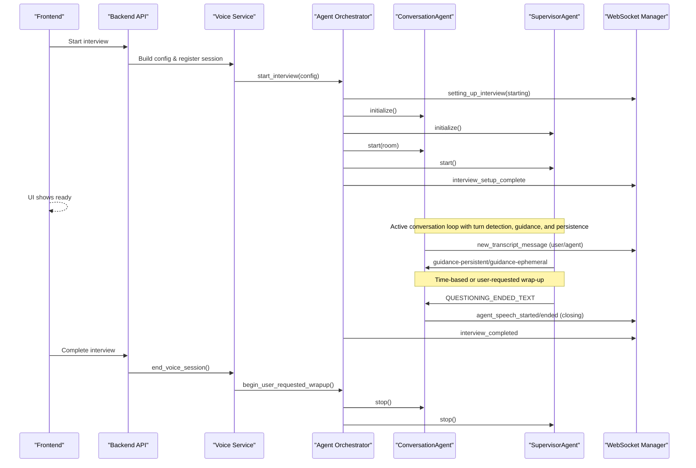

**Diagram sources**
- [voice_interviews.py:204-256](file://Backend/app/api/v1/voice_interviews.py#L204-L256)
- [voice_interview.py:189-227](file://Backend/app/services/voice_interview.py#L189-L227)
- [agent_orchestrator.py:42-180](file://Backend/app/ai/services/agent_orchestrator.py#L42-L180)
- [conversation.py:204-310](file://Backend/app/ai/agents/conversation.py#L204-L310)
- [supervisor.py:496-551](file://Backend/app/ai/agents/supervisor.py#L496-L551)

## Detailed Component Analysis

### State Machine for Conversation Phases
The state machine tracks who holds the floor and enforces safe transitions:
- IDLE: No active speaking.
- AI_SPEAKING: Agent is responding; suppresses user input until cleared.
- WAITING_FOR_USER: Expects candidate response; silence monitoring applies.
- USER_SPEAKING: Candidate speaking; debounces long answers and answer caps.
- PROCESSING_RESPONSE: Transition while scheduling agent reply.

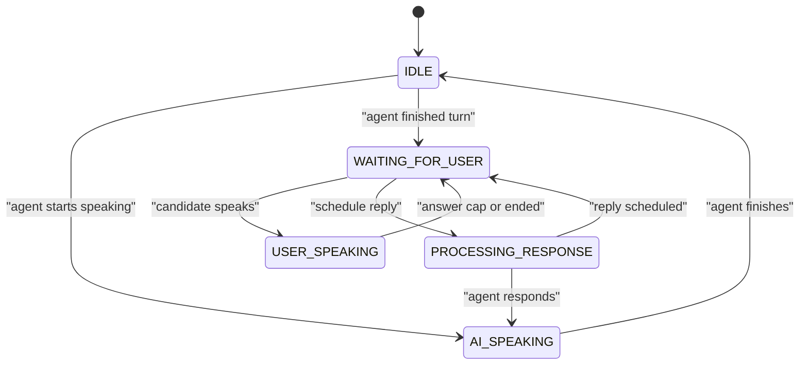

**Diagram sources**
- [interview_state.py:22-79](file://Backend/app/ai/utils/interview_state.py#L22-L79)
- [conversation.py:70-78](file://Backend/app/ai/agents/conversation.py#L70-L78)

**Section sources**
- [interview_state.py:22-101](file://Backend/app/ai/utils/interview_state.py#L22-L101)
- [conversation.py:70-78](file://Backend/app/ai/agents/conversation.py#L70-L78)

### Session Initialization and Setup Flow
- Frontend establishes LiveKit room and telemetry WebSocket.
- Backend builds configuration, registers session, generates prompts, connects to LiveKit, initializes agents, and signals readiness.
- Setup stages are communicated to the frontend for UX feedback.

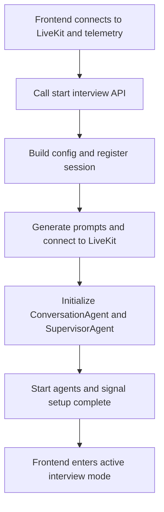

**Diagram sources**
- [InterviewInterface.tsx:474-724](file://Frontend/components/interviews/voice/InterviewInterface.tsx#L474-L724)
- [voice_interviews.py:204-256](file://Backend/app/api/v1/voice_interviews.py#L204-L256)
- [agent_orchestrator.py:77-180](file://Backend/app/ai/services/agent_orchestrator.py#L77-L180)

**Section sources**
- [InterviewInterface.tsx:474-724](file://Frontend/components/interviews/voice/InterviewInterface.tsx#L474-L724)
- [voice_interviews.py:204-256](file://Backend/app/api/v1/voice_interviews.py#L204-L256)
- [agent_orchestrator.py:77-180](file://Backend/app/ai/services/agent_orchestrator.py#L77-L180)

### Active Conversation and Turn Management
- Speech events trigger turn transitions and transcript persistence.
- Answer caps prevent excessively long responses; mic control is enforced by frontend based on backend signals.
- Supervisor provides periodic guidance and timing assistance without interrupting active turns.

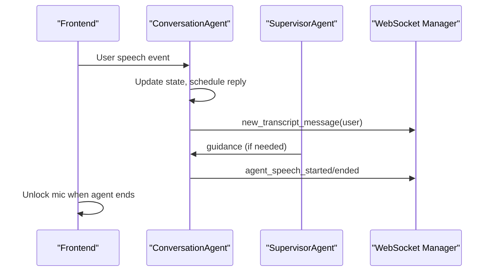

**Diagram sources**
- [conversation.py:312-571](file://Backend/app/ai/agents/conversation.py#L312-L571)
- [supervisor.py:137-268](file://Backend/app/ai/agents/supervisor.py#L137-L268)
- [InterviewInterface.tsx:265-315](file://Frontend/components/interviews/voice/InterviewInterface.tsx#L265-L315)

**Section sources**
- [conversation.py:312-571](file://Backend/app/ai/agents/conversation.py#L312-L571)
- [supervisor.py:137-268](file://Backend/app/ai/agents/supervisor.py#L137-L268)
- [InterviewInterface.tsx:265-315](file://Frontend/components/interviews/voice/InterviewInterface.tsx#L265-L315)

### Wrap-Up and Completion
- Time-based ending: Supervisor triggers no-new-questions phase and closing sequence at duration limit.
- User-requested ending: Frontend sends telemetry signal; backend orchestrates closing dialogue and completion.
- Grace period allows candidate to finish answering before hard stop.

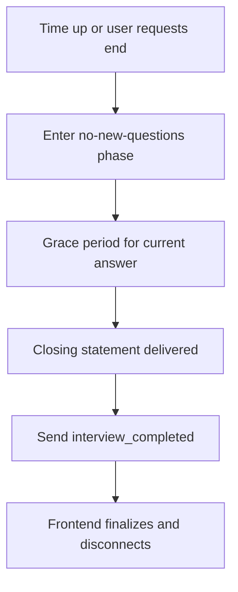

**Diagram sources**
- [supervisor.py:496-551](file://Backend/app/ai/agents/supervisor.py#L496-L551)
- [interview_state.py:171-230](file://Backend/app/ai/utils/interview_state.py#L171-L230)
- [voice_interviews.py:239-256](file://Backend/app/api/v1/voice_interviews.py#L239-L256)
- [InterviewInterface.tsx:636-646](file://Frontend/components/interviews/voice/InterviewInterface.tsx#L636-L646)

**Section sources**
- [supervisor.py:496-551](file://Backend/app/ai/agents/supervisor.py#L496-L551)
- [interview_state.py:171-230](file://Backend/app/ai/utils/interview_state.py#L171-L230)
- [voice_interviews.py:239-256](file://Backend/app/api/v1/voice_interviews.py#L239-L256)
- [InterviewInterface.tsx:636-646](file://Frontend/components/interviews/voice/InterviewInterface.tsx#L636-L646)

### Session Persistence and Recovery
- Transcripts are persisted incrementally during conversation; restored on resume to recover timer and context.
- Database layer caches live objects and flushes changes on commit; supports rejoining active sessions.
- Frontend computes elapsed time from stored transcripts to align timers.

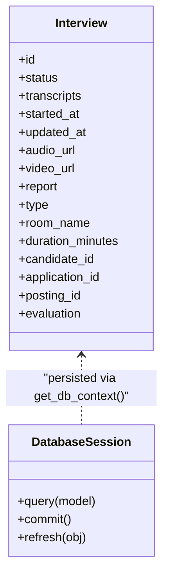

**Diagram sources**
- [interview.py:30-75](file://Backend/app/api/models/interview.py#L30-L75)
- [database.py:72-98](file://Backend/app/api/models/database.py#L72-L98)

**Section sources**
- [interview.py:30-75](file://Backend/app/api/models/interview.py#L30-L75)
- [database.py:72-98](file://Backend/app/api/models/database.py#L72-L98)
- [InterviewInterface.tsx:133-143](file://Frontend/components/interviews/voice/InterviewInterface.tsx#L133-L143)

### Frontend-Backend Coordination
- Telemetry WebSocket relays setup stages, turn events, and completion signals.
- Frontend manages microphone enable/disable based on backend signals and answer caps.
- Identity verification runs silently once camera is available; results are recorded but do not block the interview.

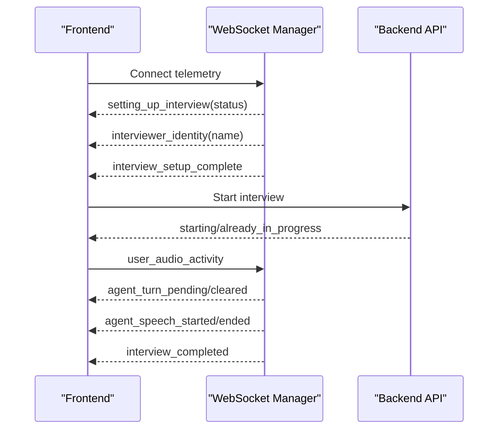

**Diagram sources**
- [InterviewInterface.tsx:474-724](file://Frontend/components/interviews/voice/InterviewInterface.tsx#L474-L724)
- [voice_interviews.py:258-288](file://Backend/app/api/v1/voice_interviews.py#L258-L288)
- [manager.py:22-54](file://Backend/app/websocket/manager.py#L22-L54)

**Section sources**
- [InterviewInterface.tsx:474-724](file://Frontend/components/interviews/voice/InterviewInterface.tsx#L474-L724)
- [voice_interviews.py:258-288](file://Backend/app/api/v1/voice_interviews.py#L258-L288)
- [manager.py:22-54](file://Backend/app/websocket/manager.py#L22-L54)

### Event Handling, Timeout Management, and Graceful Degradation
- Answer cap: Frontend mics lock for 2 minutes; backend enforces via signals; unlocks on agent end.
- Time warnings and grace periods: Backend tracks remaining time and transitions to no-new-questions; grace allows finishing current answer.
- Robustness: Telemetry reconnects with exponential backoff; setup failures surface errors; agent speaking state has safety timeouts.

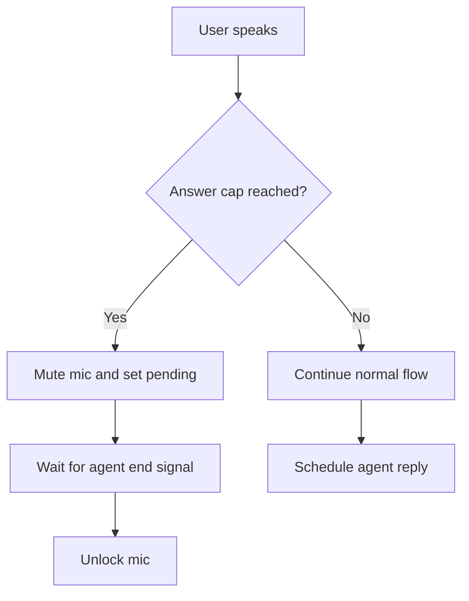

**Diagram sources**
- [InterviewInterface.tsx:557-585](file://Frontend/components/interviews/voice/InterviewInterface.tsx#L557-L585)
- [interview_state.py:134-169](file://Backend/app/ai/utils/interview_state.py#L134-L169)
- [supervisor.py:496-551](file://Backend/app/ai/agents/supervisor.py#L496-L551)

**Section sources**
- [InterviewInterface.tsx:557-585](file://Frontend/components/interviews/voice/InterviewInterface.tsx#L557-L585)
- [interview_state.py:134-169](file://Backend/app/ai/utils/interview_state.py#L134-L169)
- [supervisor.py:496-551](file://Backend/app/ai/agents/supervisor.py#L496-L551)

### Integration with AI Agent Orchestration
- Prompt generation creates persona and role instructions; name extracted for display.
- Agents share HTTP session for plugin stability; conversation agent links to supervisor for guidance.
- Cleanup tasks include stopping agents, disconnecting rooms, and generating ratings asynchronously.

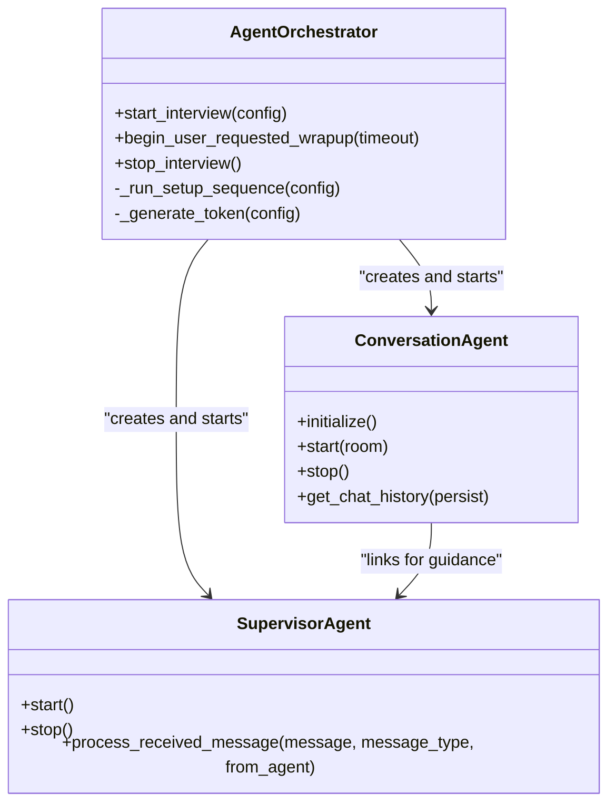

**Diagram sources**
- [agent_orchestrator.py:29-180](file://Backend/app/ai/services/agent_orchestrator.py#L29-L180)
- [conversation.py:184-310](file://Backend/app/ai/agents/conversation.py#L184-L310)
- [supervisor.py:20-117](file://Backend/app/ai/agents/supervisor.py#L20-L117)

**Section sources**
- [agent_orchestrator.py:29-180](file://Backend/app/ai/services/agent_orchestrator.py#L29-L180)
- [conversation.py:184-310](file://Backend/app/ai/agents/conversation.py#L184-L310)
- [supervisor.py:20-117](file://Backend/app/ai/agents/supervisor.py#L20-L117)

### Session Data Export and Reporting
- After completion, synthesis service analyzes the interview to produce evaluation and report data.
- Audio/video paths can be updated post-session; reports are persisted alongside transcripts.
- Frontend receives completed payload including evaluation and question summaries.

**Section sources**
- [voice_interviews.py:239-256](file://Backend/app/api/v1/voice_interviews.py#L239-L256)
- [voice_interviews.py:364-384](file://Backend/app/api/v1/voice_interviews.py#L364-L384)
- [agent_orchestrator.py:244-327](file://Backend/app/ai/services/agent_orchestrator.py#L244-L327)
- [interview.py:30-75](file://Backend/app/api/models/interview.py#L30-L75)

## Dependency Analysis
Key dependencies and coupling:
- Frontend depends on LiveKit SDK and telemetry WebSocket for real-time updates.
- Backend API depends on voice service for session orchestration and LiveKit token issuance.
- Agent orchestrator depends on conversation and supervisor agents; shares HTTP session for stability.
- Persistence layer decouples in-memory state from database-backed transcripts and status.

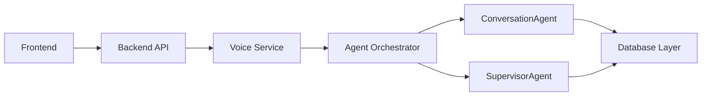

**Diagram sources**
- [voice_interviews.py:177-256](file://Backend/app/api/v1/voice_interviews.py#L177-L256)
- [voice_interview.py:189-227](file://Backend/app/services/voice_interview.py#L189-L227)
- [agent_orchestrator.py:42-180](file://Backend/app/ai/services/agent_orchestrator.py#L42-L180)
- [database.py:72-98](file://Backend/app/api/models/database.py#L72-L98)

**Section sources**
- [voice_interviews.py:177-256](file://Backend/app/api/v1/voice_interviews.py#L177-L256)
- [voice_interview.py:189-227](file://Backend/app/services/voice_interview.py#L189-L227)
- [agent_orchestrator.py:42-180](file://Backend/app/ai/services/agent_orchestrator.py#L42-L180)
- [database.py:72-98](file://Backend/app/api/models/database.py#L72-L98)

## Performance Considerations
- Transcript persistence is incremental to avoid blocking real-time flow.
- Supervisor checks run between turns to minimize interruption.
- Frontend uses Web Audio mixer to record mixed audio without additional hardware capture.
- Telemetry reconnection uses exponential backoff to handle transient network issues.

[No sources needed since this section provides general guidance]

## Troubleshooting Guide
Common issues and resolutions:
- Setup failure: Frontend surfaces error messages; check LiveKit configuration and AI service availability.
- Mic stuck muted: Ensure agent_speech_ended clears answer cap lock; verify user_audio_activity signals are sent.
- Reconnect drops: Telemetry auto-retries; if code 1008 occurs, link may be invalid or expired.
- Time-based ending not triggering: Verify supervisor completion countdown and no-new-questions phase activation.

**Section sources**
- [InterviewInterface.tsx:647-670](file://Frontend/components/interviews/voice/InterviewInterface.tsx#L647-L670)
- [InterviewInterface.tsx:684-707](file://Frontend/components/interviews/voice/InterviewInterface.tsx#L684-L707)
- [supervisor.py:496-551](file://Backend/app/ai/agents/supervisor.py#L496-L551)
- [voice_interview.py:154-166](file://Backend/app/services/voice_interview.py#L154-L166)

## Conclusion
The interview session lifecycle is robustly managed through a clear state machine, resilient persistence, and coordinated frontend-backend communication. AI agents orchestrate conversation flow with timely guidance and controlled wrap-up, ensuring consistent user experience even under interruptions or network issues. Data export and reporting integrate seamlessly post-completion, enabling actionable insights from each session.

[No sources needed since this section summarizes without analyzing specific files]