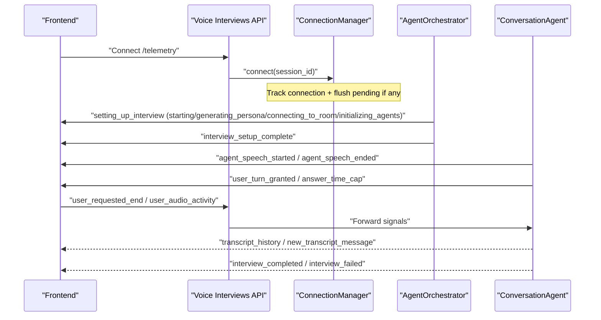
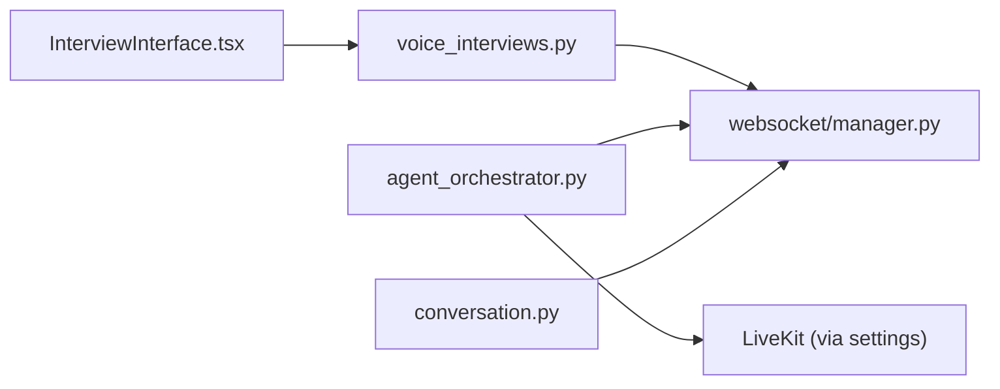

# WebSocket Communication

<cite>
**Referenced Files in This Document**
- [Backend/app/websocket/manager.py](file://Backend/app/websocket/manager.py)
- [Backend/app/api/v1/voice_interviews.py](file://Backend/app/api/v1/voice_interviews.py)
- [Backend/app/services/voice_interview.py](file://Backend/app/services/voice_interview.py)
- [Backend/app/ai/services/agent_orchestrator.py](file://Backend/app/ai/services/agent_orchestrator.py)
- [Backend/app/ai/agents/conversation.py](file://Backend/app/ai/agents/conversation.py)
- [Frontend/components/interviews/voice/InterviewInterface.tsx](file://Frontend/components/interviews/voice/InterviewInterface.tsx)
</cite>

## Table of Contents
1. [Introduction](#introduction)
2. [Project Structure](#project-structure)
3. [Core Components](#core-components)
4. [Architecture Overview](#architecture-overview)
5. [Detailed Component Analysis](#detailed-component-analysis)
6. [Dependency Analysis](#dependency-analysis)
7. [Performance Considerations](#performance-considerations)
8. [Troubleshooting Guide](#troubleshooting-guide)
9. [Conclusion](#conclusion)

## Introduction
This document describes the WebSocket communication protocol used for real-time voice interviews. It covers connection establishment, message formats, event types for telemetry and control, client-server bidirectional patterns, error handling, reconnection strategies, interview state synchronization, participant events, system notifications, and production debugging and monitoring techniques.

## Project Structure
The WebSocket subsystem spans backend endpoints, a connection manager, agent orchestration, and frontend event handling:
- Backend WebSocket endpoint exposes per-interview telemetry channels.
- ConnectionManager tracks active connections per session and buffers messages when no clients are connected.
- AgentOrchestrator and ConversationAgent emit status and lifecycle events over WebSockets.
- Frontend connects to the telemetry channel, handles setup progress, turn-taking, transcripts, and completion events, and implements reconnection with exponential backoff.

```mermaid
graph TB
FE["Frontend InterviewInterface.tsx"] --> WS["WebSocket Endpoint<br/>voice_interviews.py"]
WS --> CM["ConnectionManager<br/>websocket/manager.py"]
CM --> AO["AgentOrchestrator<br/>ai/services/agent_orchestrator.py"]
AO --> CA["ConversationAgent<br/>ai/agents/conversation.py"]
AO --> VOICE["Voice Session Service<br/>services/voice_interview.py"]
FE <- --> |Telemetry Events| WS
```

**Diagram sources**
- [Backend/app/api/v1/voice_interviews.py:258-288](file://Backend/app/api/v1/voice_interviews.py#L258-L288)
- [Backend/app/websocket/manager.py:14-95](file://Backend/app/websocket/manager.py#L14-L95)
- [Backend/app/ai/services/agent_orchestrator.py:42-192](file://Backend/app/ai/services/agent_orchestrator.py#L42-L192)
- [Backend/app/ai/agents/conversation.py:759-781](file://Backend/app/ai/agents/conversation.py#L759-L781)
- [Backend/app/services/voice_interview.py:189-227](file://Backend/app/services/voice_interview.py#L189-L227)
- [Frontend/components/interviews/voice/InterviewInterface.tsx:474-724](file://Frontend/components/interviews/voice/InterviewInterface.tsx#L474-L724)

**Section sources**
- [Backend/app/api/v1/voice_interviews.py:258-288](file://Backend/app/api/v1/voice_interviews.py#L258-L288)
- [Backend/app/websocket/manager.py:14-95](file://Backend/app/websocket/manager.py#L14-L95)
- [Backend/app/ai/services/agent_orchestrator.py:42-192](file://Backend/app/ai/services/agent_orchestrator.py#L42-L192)
- [Backend/app/ai/agents/conversation.py:759-781](file://Backend/app/ai/agents/conversation.py#L759-L781)
- [Backend/app/services/voice_interview.py:189-227](file://Backend/app/services/voice_interview.py#L189-L227)
- [Frontend/components/interviews/voice/InterviewInterface.tsx:474-724](file://Frontend/components/interviews/voice/InterviewInterface.tsx#L474-L724)

## Core Components
- WebSocket Endpoint (FastAPI): Accepts per-attempt telemetry connections, forwards client signals to agents, and cleans up on disconnect.
- ConnectionManager: Thread-safe per-session connection registry with pending message buffering and trimming.
- AgentOrchestrator: Drives interview setup, emits setup progress, and coordinates agent lifecycle; sends telemetry events via ConnectionManager.
- ConversationAgent: Emits speech and turn events, end-of-interview controls, and transcript updates.
- Frontend InterviewInterface: Connects to telemetry, handles setup stages, turn-taking, transcripts, errors, and implements robust reconnection.

**Section sources**
- [Backend/app/api/v1/voice_interviews.py:258-288](file://Backend/app/api/v1/voice_interviews.py#L258-L288)
- [Backend/app/websocket/manager.py:14-95](file://Backend/app/websocket/manager.py#L14-L95)
- [Backend/app/ai/services/agent_orchestrator.py:42-192](file://Backend/app/ai/services/agent_orchestrator.py#L42-L192)
- [Backend/app/ai/agents/conversation.py:759-781](file://Backend/app/ai/agents/conversation.py#L759-L781)
- [Frontend/components/interviews/voice/InterviewInterface.tsx:474-724](file://Frontend/components/interviews/voice/InterviewInterface.tsx#L474-L724)

## Architecture Overview
The telemetry channel is per interview attempt. The frontend opens a WebSocket to the telemetry endpoint, receives setup and runtime events, and sends control signals. The backend routes client signals to the active conversation agent and broadcasts server-side events to all connected clients for that session.



**Diagram sources**
- [Backend/app/api/v1/voice_interviews.py:258-288](file://Backend/app/api/v1/voice_interviews.py#L258-L288)
- [Backend/app/ai/services/agent_orchestrator.py:60-192](file://Backend/app/ai/services/agent_orchestrator.py#L60-L192)
- [Backend/app/ai/agents/conversation.py:759-781](file://Backend/app/ai/agents/conversation.py#L759-L781)
- [Frontend/components/interviews/voice/InterviewInterface.tsx:505-669](file://Frontend/components/interviews/voice/InterviewInterface.tsx#L505-L669)

## Detailed Component Analysis

### WebSocket Endpoint: Telemetry Channel
- Exposes per-attempt telemetry endpoints for profile and applied interviews.
- Accepts WebSocket, registers connection with ConnectionManager, reads JSON messages, and forwards specific client signals to the active orchestrator/agent.
- On disconnect, removes the connection from tracking.

Key behaviors:
- Accepts text frames, ignores non-JSON.
- Handles "user_requested_end" by arming closing logic in the conversation agent.
- Handles "user_audio_activity" to update VAD/audio activity in the agent.

**Section sources**
- [Backend/app/api/v1/voice_interviews.py:258-288](file://Backend/app/api/v1/voice_interviews.py#L258-L288)
- [Backend/app/api/v1/voice_interviews.py:387-416](file://Backend/app/api/v1/voice_interviews.py#L387-L416)

### ConnectionManager: Per-Session Broadcast and Buffering
- Maintains active_connections per session_id and pending_messages buffer.
- connect(): registers connection, flushes pending messages, logs active count.
- send_message(): broadcasts to all active connections; if none, stores message; trims pending to a fixed size.
- disconnect(): removes connection and cleans empty sessions.

Error handling:
- Catches send exceptions, removes failed connections, and retries delivery by storing pending messages.

Complexity:
- O(N) broadcast per message where N is number of active connections for the session.
- Pending queue bounded by trim threshold.

**Section sources**
- [Backend/app/websocket/manager.py:14-95](file://Backend/app/websocket/manager.py#L14-L95)

### AgentOrchestrator: Setup Flow and Status Events
- start_interview(): schedules background setup, emits setup progress events.
- _run_setup_sequence(): generates prompts, connects to LiveKit room, initializes agents, emits setup complete or failure events.
- begin_user_requested_wrapup(): triggers closing dialogue and ensures completion event is sent.
- stop_interview(): stops agents, disconnects room, cleans resources.

Events emitted:
- setting_up_interview with statuses: starting, generating_persona, connecting_to_room, initializing_agents, realtime_recovered.
- interviewer_identity with name.
- interview_setup_complete.
- interview_setup_failed with error details.

**Section sources**
- [Backend/app/ai/services/agent_orchestrator.py:42-192](file://Backend/app/ai/services/agent_orchestrator.py#L42-L192)
- [Backend/app/ai/services/agent_orchestrator.py:203-243](file://Backend/app/ai/services/agent_orchestrator.py#L203-L243)
- [Backend/app/ai/services/agent_orchestrator.py:244-281](file://Backend/app/ai/services/agent_orchestrator.py#L244-L281)

### ConversationAgent: Turn-Taking, Speech, and Transcript Events
- Emits agent_speech_started and agent_speech_ended when the agent speaks.
- Emits interview_end_requested and interview_end_confirmed during controlled wrap-up flows.
- Integrates with Voice Session service to start/end sessions and persist state.

**Section sources**
- [Backend/app/ai/agents/conversation.py:759-781](file://Backend/app/ai/agents/conversation.py#L759-L781)
- [Backend/app/ai/agents/conversation.py:965-1092](file://Backend/app/ai/agents/conversation.py#L965-L1092)
- [Backend/app/services/voice_interview.py:189-227](file://Backend/app/services/voice_interview.py#L189-L227)

### Frontend Event Handling and Reconnection
- Establishes WebSocket to telemetry URL.
- Parses messages and updates UI state:
  - Setup progress: setting_up_interview states map to UI stages.
  - Turn-taking: agent_turn_pending/cleared, agent_speech_started/ended, user_turn_granted, answer_time_cap.
  - Transcripts: transcript_history and new_transcript_message.
  - Completion/failure: interview_completed, interview_failed, interview_setup_failed.
- Implements reconnection with exponential backoff and max retries; handles policy violation code 1008 without retry.

Client-to-server messages:
- Sends participant_joined after successful start.
- Sends user_requested_end and user_audio_activity signals.

**Section sources**
- [Frontend/components/interviews/voice/InterviewInterface.tsx:474-724](file://Frontend/components/interviews/voice/InterviewInterface.tsx#L474-L724)
- [Frontend/components/interviews/voice/InterviewInterface.tsx:505-669](file://Frontend/components/interviews/voice/InterviewInterface.tsx#L505-L669)
- [Frontend/components/interviews/voice/InterviewInterface.tsx:726-763](file://Frontend/components/interviews/voice/InterviewInterface.tsx#L726-L763)

## Dependency Analysis
- voice_interviews.py depends on websocket.manager for connection management and on ai services for orchestrator access.
- agent_orchestrator.py depends on websocket.manager to broadcast events and on livekit integration for room connectivity.
- conversation.py uses websocket_manager to emit speech and lifecycle events.
- Frontend depends on telemetry endpoint and interprets event payloads to drive UI and media controls.



**Diagram sources**
- [Backend/app/api/v1/voice_interviews.py:258-288](file://Backend/app/api/v1/voice_interviews.py#L258-L288)
- [Backend/app/websocket/manager.py:14-95](file://Backend/app/websocket/manager.py#L14-L95)
- [Backend/app/ai/services/agent_orchestrator.py:42-192](file://Backend/app/ai/services/agent_orchestrator.py#L42-L192)
- [Backend/app/ai/agents/conversation.py:759-781](file://Backend/app/ai/agents/conversation.py#L759-L781)
- [Frontend/components/interviews/voice/InterviewInterface.tsx:474-724](file://Frontend/components/interviews/voice/InterviewInterface.tsx#L474-L724)

**Section sources**
- [Backend/app/api/v1/voice_interviews.py:258-288](file://Backend/app/api/v1/voice_interviews.py#L258-L288)
- [Backend/app/websocket/manager.py:14-95](file://Backend/app/websocket/manager.py#L14-L95)
- [Backend/app/ai/services/agent_orchestrator.py:42-192](file://Backend/app/ai/services/agent_orchestrator.py#L42-L192)
- [Backend/app/ai/agents/conversation.py:759-781](file://Backend/app/ai/agents/conversation.py#L759-L781)
- [Frontend/components/interviews/voice/InterviewInterface.tsx:474-724](file://Frontend/components/interviews/voice/InterviewInterface.tsx#L474-L724)

## Performance Considerations
- Broadcasting cost scales with active connections per session; ensure minimal fan-out by scoping sessions tightly.
- Pending message buffer is capped to prevent unbounded memory growth; tune trim thresholds if needed.
- Avoid heavy work in WebSocket handlers; offload to background tasks (as done by AgentOrchestrator).
- Use efficient JSON serialization; avoid large payloads in frequent events.

[No sources needed since this section provides general guidance]

## Troubleshooting Guide
Common issues and diagnostics:
- No events received: verify connection accepted and registered in ConnectionManager; check for pending messages flushed on reconnect.
- Client cannot reconnect: inspect close codes; code 1008 indicates policy violation/expired link and should not auto-retry.
- Agent not speaking: confirm agent_speech_started/ended events; check setup flow completed successfully.
- Transcript gaps: ensure transcript_history was sent on resume and new_transcript_message events are flowing.
- Errors during setup: review interview_setup_failed payload for error details and session_id.

Monitoring recommendations:
- Log connection counts and pending queue sizes per session.
- Emit metrics for send failures and retries.
- Correlate frontend setup stages with backend setting_up_interview events.
- Track agent recovery attempts and success rates for realtime transport errors.

**Section sources**
- [Backend/app/websocket/manager.py:14-95](file://Backend/app/websocket/manager.py#L14-L95)
- [Backend/app/ai/services/agent_orchestrator.py:174-192](file://Backend/app/ai/services/agent_orchestrator.py#L174-L192)
- [Frontend/components/interviews/voice/InterviewInterface.tsx:677-707](file://Frontend/components/interviews/voice/InterviewInterface.tsx#L677-L707)

## Conclusion
The WebSocket protocol provides a robust, per-session telemetry channel for real-time interviews. It supports bidirectional messaging for control and telemetry, resilient reconnection, and comprehensive event coverage for setup, turn-taking, transcripts, and completion. The ConnectionManager ensures reliable delivery even across transient disconnections, while the AgentOrchestrator and ConversationAgent coordinate AI-driven interview flows and surface meaningful state changes to the frontend.

[No sources needed since this section summarizes without analyzing specific files]