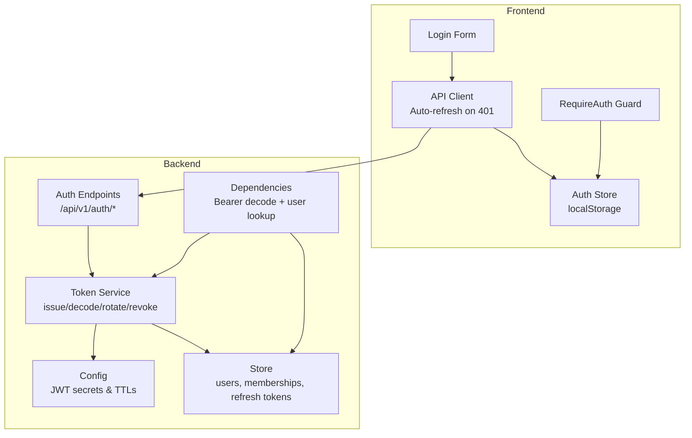
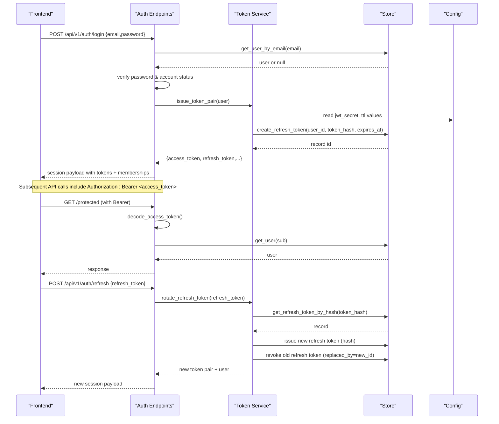
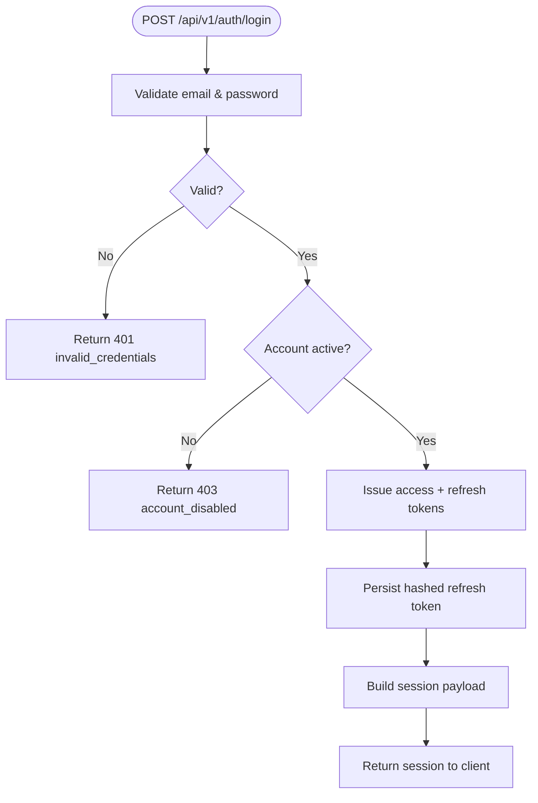
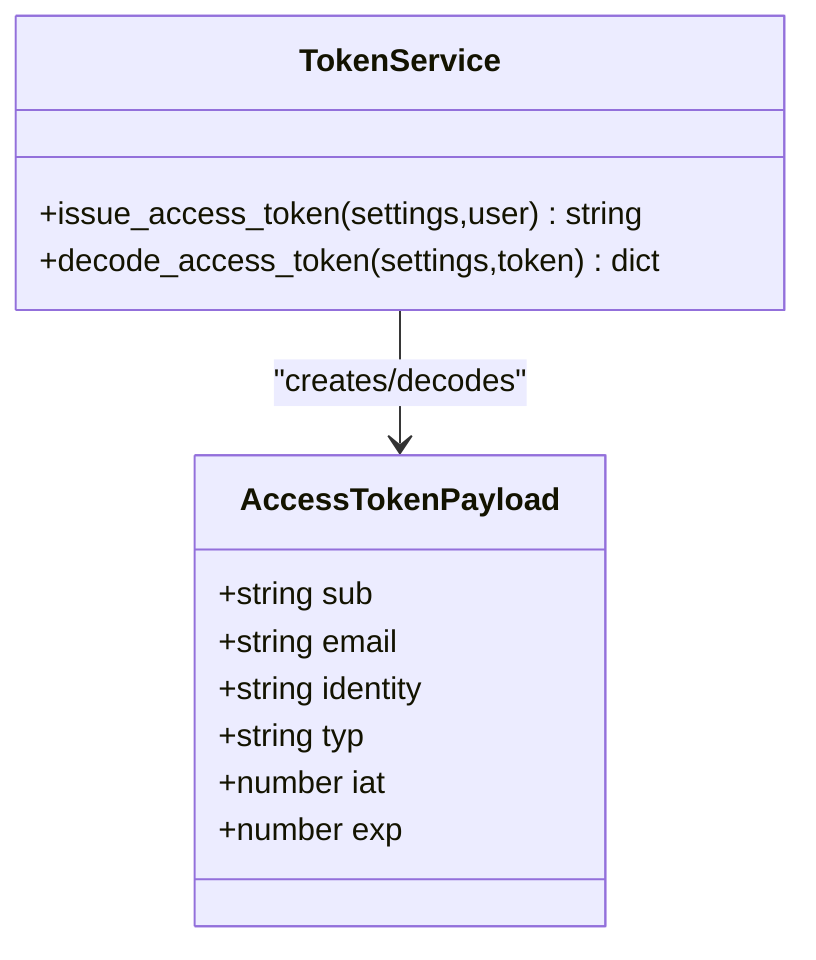
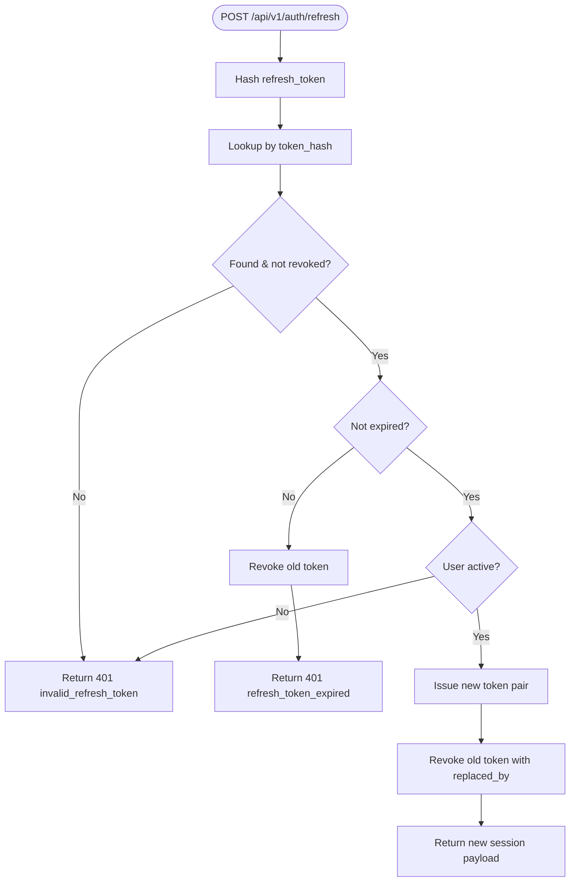
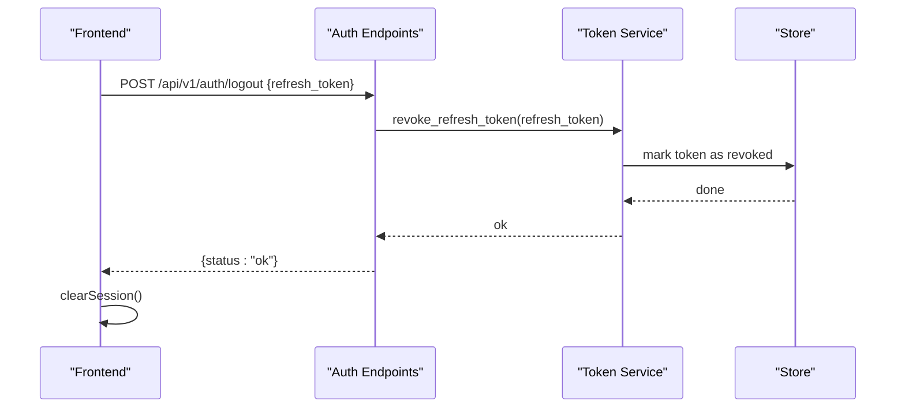
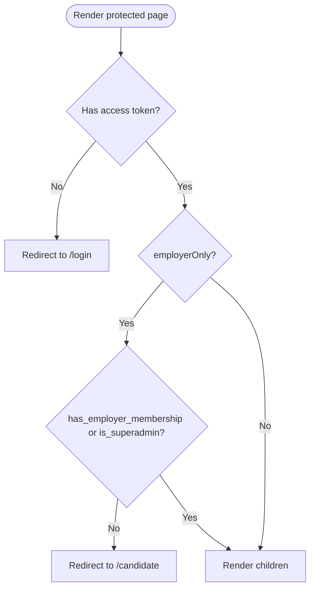
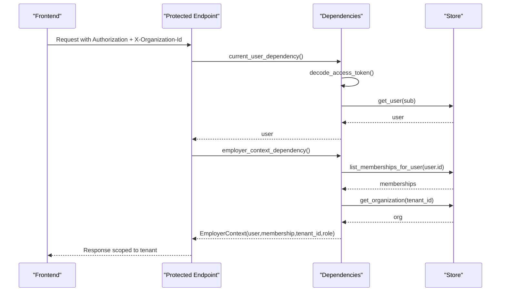
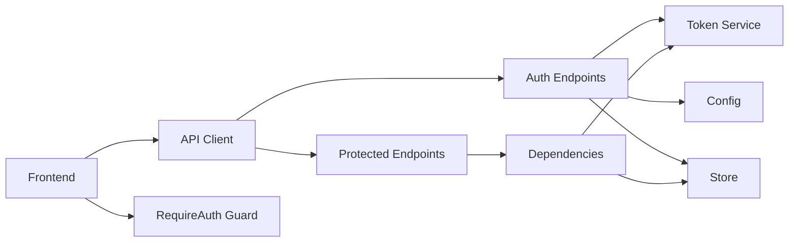

# Authentication Flow

<cite>
**Referenced Files in This Document**
- [auth.py](file://Backend/app/api/v1/auth.py)
- [auth_tokens.py](file://Backend/app/services/auth_tokens.py)
- [config.py](file://Backend/app/core/config.py)
- [dependencies.py](file://Backend/app/api/dependencies.py)
- [store.py](file://Backend/app/db/store.py)
- [api.ts](file://Frontend/lib/api.ts)
- [auth.ts](file://Frontend/lib/auth.ts)
- [require-auth.tsx](file://Frontend/components/auth/require-auth.tsx)
- [login-form.tsx](file://Frontend/components/auth/login-form.tsx)
</cite>

## Table of Contents
1. Introduction
2. Project Structure
3. Core Components
4. Architecture Overview
5. Detailed Component Analysis
6. Dependency Analysis
7. Performance Considerations
8. Troubleshooting Guide
9. Conclusion

## Introduction
This document explains the JWT-based authentication flow in the ATS system. It covers login, token issuance, refresh rotation, logout, access token structure, frontend guards and client-side token management, security considerations for storage and transmission, and multi-tenant organization-scoped access patterns.

## Project Structure
The authentication system spans backend API endpoints, token services, configuration, and dependencies that enforce identity and tenant context, as well as a Next.js frontend that stores tokens, performs auto-refresh on 401, and guards routes based on session state.

**Diagram sources**
- [auth.py:104-148](file://Backend/app/api/v1/auth.py#L104-L148)
- [auth_tokens.py:22-127](file://Backend/app/services/auth_tokens.py#L22-L127)
- [config.py:64-66](file://Backend/app/core/config.py#L64-L66)
- [dependencies.py:49-114](file://Backend/app/api/dependencies.py#L49-L114)
- [store.py:157-210](file://Backend/app/db/store.py#L157-L210)
- [api.ts:25-104](file://Frontend/lib/api.ts#L25-L104)
- [auth.ts:26-69](file://Frontend/lib/auth.ts#L26-L69)
- [require-auth.tsx:17-31](file://Frontend/components/auth/require-auth.tsx#L17-L31)

**Section sources**
- [auth.py:104-148](file://Backend/app/api/v1/auth.py#L104-L148)
- [auth_tokens.py:22-127](file://Backend/app/services/auth_tokens.py#L22-L127)
- [config.py:64-66](file://Backend/app/core/config.py#L64-L66)
- [dependencies.py:49-114](file://Backend/app/api/dependencies.py#L49-L114)
- [store.py:157-210](file://Backend/app/db/store.py#L157-L210)
- [api.ts:25-104](file://Frontend/lib/api.ts#L25-L104)
- [auth.ts:26-69](file://Frontend/lib/auth.ts#L26-L69)
- [require-auth.tsx:17-31](file://Frontend/components/auth/require-auth.tsx#L17-L31)

## Core Components
- Backend auth endpoints: register, login, refresh, logout, me.
- Token service: issues short-lived access tokens (JWT HS256), creates opaque refresh tokens stored hashed in DB, rotates refresh tokens securely, and revokes them on logout or expiration.
- Config: holds JWT secret and TTLs with validation constraints.
- Dependencies: extract Bearer token from Authorization header, decode and validate access tokens, resolve current user, and build employer/candidate contexts scoped to organizations.
- Frontend: stores tokens in localStorage, attaches Bearer tokens to requests, auto-refreshes on 401, and guards protected routes.

Key responsibilities:
- Login verifies credentials and returns an access token plus a refresh token along with session metadata including memberships and candidate info.
- Refresh validates the stored refresh token hash, ensures it is not expired or revoked, issues a new pair, and marks the old refresh token as replaced.
- Logout revokes the refresh token server-side and clears local session.
- Protected endpoints rely on dependency injection to decode the access token and enforce active user status; employer-only endpoints further require verified organization membership and role checks.

**Section sources**
- [auth.py:19-148](file://Backend/app/api/v1/auth.py#L19-L148)
- [auth_tokens.py:22-127](file://Backend/app/services/auth_tokens.py#L22-L127)
- [config.py:64-66](file://Backend/app/core/config.py#L64-L66)
- [dependencies.py:49-114](file://Backend/app/api/dependencies.py#L49-L114)
- [store.py:157-210](file://Backend/app/db/store.py#L157-L210)
- [api.ts:25-104](file://Frontend/lib/api.ts#L25-L104)
- [auth.ts:26-69](file://Frontend/lib/auth.ts#L26-L69)
- [require-auth.tsx:17-31](file://Frontend/components/auth/require-auth.tsx#L17-L31)

## Architecture Overview
The authentication lifecycle flows through these stages:
- Registration/Login: Credentials are validated; if valid, a JWT access token and an opaque refresh token are issued. The refresh token is hashed and persisted with expiry.
- Accessing resources: Clients send Bearer tokens; backend decodes and validates them, then resolves the user and optional organization context.
- Refresh: When access token expires, client calls refresh endpoint with the stored refresh token; backend validates, issues a new pair, and revokes the previous refresh token.
- Logout: Client sends refresh token to revoke it server-side and clears local storage.

**Diagram sources**
- [auth.py:104-148](file://Backend/app/api/v1/auth.py#L104-L148)
- [auth_tokens.py:67-127](file://Backend/app/services/auth_tokens.py#L67-L127)
- [config.py:64-66](file://Backend/app/core/config.py#L64-L66)
- [store.py:157-210](file://Backend/app/db/store.py#L157-L210)

## Detailed Component Analysis

### Login and Session Establishment
- Validates email format and password; rejects disabled accounts.
- Issues a token pair and returns a session object containing user info, memberships, candidate ID, and flags indicating superadmin status and employer membership.
- Frontend saves the session to localStorage and navigates to appropriate dashboards based on membership.

**Diagram sources**
- [auth.py:104-127](file://Backend/app/api/v1/auth.py#L104-L127)
- [auth_tokens.py:67-86](file://Backend/app/services/auth_tokens.py#L67-L86)
- [store.py:157-187](file://Backend/app/db/store.py#L157-L187)

**Section sources**
- [auth.py:104-127](file://Backend/app/api/v1/auth.py#L104-L127)
- [auth_tokens.py:67-86](file://Backend/app/services/auth_tokens.py#L67-L86)
- [store.py:157-187](file://Backend/app/db/store.py#L157-L187)
- [login-form.tsx:15-27](file://Frontend/components/auth/login-form.tsx#L15-L27)
- [api.ts:157-161](file://Frontend/lib/api.ts#L157-L161)
- [auth.ts:51-69](file://Frontend/lib/auth.ts#L51-L69)

### Access Token Structure and Validation
- Access tokens are JWTs signed with HS256 using a configured secret.
- Payload includes user identity fields (sub, email, identity), type marker typ set to access, and timestamps iat/exp.
- Decoding enforces algorithm, signature, expiration, and type checks; invalid or expired tokens raise standardized errors.

**Diagram sources**
- [auth_tokens.py:22-64](file://Backend/app/services/auth_tokens.py#L22-L64)
- [config.py:64-66](file://Backend/app/core/config.py#L64-L66)

**Section sources**
- [auth_tokens.py:22-64](file://Backend/app/services/auth_tokens.py#L22-L64)
- [config.py:64-66](file://Backend/app/core/config.py#L64-L66)

### Refresh Token Rotation and Revocation
- Refresh tokens are opaque strings; only their SHA-256 hashes are stored in the database along with expiry and replacement links.
- Rotation validates the token hash exists, is not revoked, and is not expired; then issues a new pair and marks the old refresh token as revoked with replaced_by pointing to the new one.
- Logout explicitly revokes the provided refresh token.

**Diagram sources**
- [auth_tokens.py:89-127](file://Backend/app/services/auth_tokens.py#L89-L127)
- [store.py:190-210](file://Backend/app/db/store.py#L190-L210)

**Section sources**
- [auth_tokens.py:89-127](file://Backend/app/services/auth_tokens.py#L89-L127)
- [store.py:190-210](file://Backend/app/db/store.py#L190-L210)
- [auth.py:130-148](file://Backend/app/api/v1/auth.py#L130-L148)

### Logout Process
- Client calls logout with the refresh token; backend revokes it server-side to prevent reuse.
- Frontend clears local storage regardless of server outcome to ensure consistent state.

**Diagram sources**
- [auth.py:144-148](file://Backend/app/api/v1/auth.py#L144-L148)
- [auth_tokens.py:123-127](file://Backend/app/services/auth_tokens.py#L123-L127)
- [store.py:197-210](file://Backend/app/db/store.py#L197-L210)
- [api.ts:178-188](file://Frontend/lib/api.ts#L178-L188)

**Section sources**
- [auth.py:144-148](file://Backend/app/api/v1/auth.py#L144-L148)
- [auth_tokens.py:123-127](file://Backend/app/services/auth_tokens.py#L123-L127)
- [store.py:197-210](file://Backend/app/db/store.py#L197-L210)
- [api.ts:178-188](file://Frontend/lib/api.ts#L178-L188)

### Frontend Authentication Guards and Client-Side Token Management
- Tokens are stored in localStorage under dedicated keys; a full session object is also cached for UI state.
- The RequireAuth guard checks for an access token and optionally enforces employer-only access by inspecting session flags.
- The API client automatically attaches Bearer tokens to requests and handles 401 responses by refreshing once and retrying.

**Diagram sources**
- [require-auth.tsx:17-31](file://Frontend/components/auth/require-auth.tsx#L17-L31)
- [auth.ts:30-69](file://Frontend/lib/auth.ts#L30-L69)

**Section sources**
- [require-auth.tsx:17-31](file://Frontend/components/auth/require-auth.tsx#L17-L31)
- [auth.ts:30-69](file://Frontend/lib/auth.ts#L30-L69)
- [api.ts:25-104](file://Frontend/lib/api.ts#L25-L104)

### Multi-Tenant Authentication Context and Organization-Scoped Access
- After login, the session includes memberships listing organizations the user belongs to, roles, and verification status.
- Employer-only endpoints use a dependency to resolve an organization context:
  - Accepts X-Organization-Id header to scope the request; otherwise defaults to the first membership.
  - Ensures the organization is verified and the user has an allowed role.
- Candidate endpoints prevent employer accounts from applying as candidates.

**Diagram sources**
- [dependencies.py:125-162](file://Backend/app/api/dependencies.py#L125-L162)
- [store.py:474-485](file://Backend/app/db/store.py#L474-L485)

**Section sources**
- [dependencies.py:125-162](file://Backend/app/api/dependencies.py#L125-L162)
- [store.py:474-485](file://Backend/app/db/store.py#L474-L485)
- [auth.py:48-71](file://Backend/app/api/v1/auth.py#L48-L71)

## Dependency Analysis
- Backend auth endpoints depend on:
  - Token service for issuing, decoding, rotating, and revoking tokens.
  - Configuration for JWT secret and TTLs.
  - Store for users, memberships, and refresh tokens.
  - Dependencies module for extracting Bearer tokens and enforcing user/organization context.
- Frontend depends on:
  - Auth store for reading/writing tokens and session.
  - API client for HTTP transport, error handling, and automatic refresh.
  - RequireAuth guard for route protection.

**Diagram sources**
- [auth.py:104-148](file://Backend/app/api/v1/auth.py#L104-L148)
- [auth_tokens.py:22-127](file://Backend/app/services/auth_tokens.py#L22-L127)
- [config.py:64-66](file://Backend/app/core/config.py#L64-L66)
- [dependencies.py:49-162](file://Backend/app/api/dependencies.py#L49-L162)
- [store.py:157-210](file://Backend/app/db/store.py#L157-L210)
- [api.ts:25-104](file://Frontend/lib/api.ts#L25-L104)
- [require-auth.tsx:17-31](file://Frontend/components/auth/require-auth.tsx#L17-L31)

**Section sources**
- [auth.py:104-148](file://Backend/app/api/v1/auth.py#L104-L148)
- [auth_tokens.py:22-127](file://Backend/app/services/auth_tokens.py#L22-L127)
- [config.py:64-66](file://Backend/app/core/config.py#L64-L66)
- [dependencies.py:49-162](file://Backend/app/api/dependencies.py#L49-L162)
- [store.py:157-210](file://Backend/app/db/store.py#L157-L210)
- [api.ts:25-104](file://Frontend/lib/api.ts#L25-L104)
- [require-auth.tsx:17-31](file://Frontend/components/auth/require-auth.tsx#L17-L31)

## Performance Considerations
- Access tokens are short-lived (default 900 seconds) to limit exposure window; refresh tokens have longer TTL (default 1,209,600 seconds).
- Refresh rotation is O(1) per operation with indexed lookups by token hash; revocation uses simple updates.
- Frontend batches refresh attempts to avoid thundering herds during concurrent 401 events.
- Consider enabling HTTPS everywhere to protect tokens in transit and storing tokens in memory where feasible to reduce persistence risks.

[No sources needed since this section provides general guidance]

## Troubleshooting Guide
Common errors and resolutions:
- Invalid credentials: Ensure correct email/password; check account status is active.
- Account disabled: Contact admin to reactivate.
- Token expired: Use refresh endpoint; if refresh fails, sign in again.
- Invalid refresh token: Token may be revoked or expired; re-login required.
- Forbidden: Missing or invalid organization context; ensure X-Organization-Id header matches a verified membership with allowed role.
- Network unreachable: Verify backend is running and reachable from the frontend environment.

**Section sources**
- [auth.py:112-123](file://Backend/app/api/v1/auth.py#L112-L123)
- [auth_tokens.py:46-64](file://Backend/app/services/auth_tokens.py#L46-L64)
- [auth_tokens.py:92-112](file://Backend/app/services/auth_tokens.py#L92-L112)
- [dependencies.py:125-162](file://Backend/app/api/dependencies.py#L125-L162)
- [api.ts:79-104](file://Frontend/lib/api.ts#L79-L104)

## Conclusion
The ATS authentication system uses short-lived JWT access tokens and secure, rotated refresh tokens to provide robust, scalable, and multi-tenant capable authentication. The frontend integrates seamlessly with the backend by managing sessions locally, protecting routes, and transparently refreshing tokens. Security is enforced via strict token validation, organization scoping, and role-based access controls.

[No sources needed since this section summarizes without analyzing specific files]