# Authorization & Access Control

<cite>
**Referenced Files in This Document**
- [auth.py](file://Backend/app/api/v1/auth.py)
- [dependencies.py](file://Backend/app/api/dependencies.py)
- [permissions.py](file://Backend/app/domain/permissions.py)
- [auth_tokens.py](file://Backend/app/services/auth_tokens.py)
- [postings.py](file://Backend/app/api/v1/postings.py)
- [candidates.py](file://Backend/app/api/v1/candidates.py)
- [organizations.py](file://Backend/app/api/v1/organizations.py)
- [jobs.py](file://Backend/app/api/v1/jobs.py)
- [require-auth.tsx](file://Frontend/components/auth/require-auth.tsx)
- [auth.ts](file://Frontend/lib/auth.ts)
- [test_tenancy.py](file://Backend/tests/test_tenancy.py)
</cite>

## Table of Contents
1. [Introduction](#introduction)
2. [Project Structure](#project-structure)
3. [Core Components](#core-components)
4. [Architecture Overview](#architecture-overview)
5. [Detailed Component Analysis](#detailed-component-analysis)
6. [Dependency Analysis](#dependency-analysis)
7. [Performance Considerations](#performance-considerations)
8. [Troubleshooting Guide](#troubleshooting-guide)
9. [Conclusion](#conclusion)

## Introduction
This document explains how the ATS enforces role-based access control (RBAC), multi-tenant organization isolation, and resource-level authorization across backend APIs and the frontend. It covers:
- Permission models for organizations and roles
- Resource ownership and tenant-scoped data access
- Middleware-style dependency injection for authorization checks
- Frontend route protection and session handling
- Common scenarios such as job posting visibility, candidate data access, and administrative privileges

## Project Structure
The authorization system is implemented primarily in the backend FastAPI application with supporting frontend guards in Next.js:
- Backend authentication and token management live under API v1 endpoints and services
- Role-to-capability mapping and context resolution are centralized in dependencies and domain modules
- Frontend protects routes using a client-side guard that reads session state from local storage

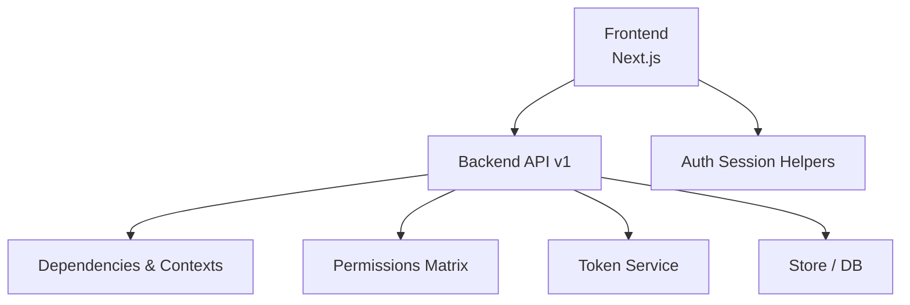

**Diagram sources**
- [auth.py:104-127](file://Backend/app/api/v1/auth.py#L104-L127)
- [dependencies.py:93-162](file://Backend/app/api/dependencies.py#L93-L162)
- [permissions.py:27-50](file://Backend/app/domain/permissions.py#L27-L50)
- [auth_tokens.py:22-64](file://Backend/app/services/auth_tokens.py#L22-L64)
- [require-auth.tsx:17-30](file://Frontend/components/auth/require-auth.tsx#L17-L30)
- [auth.ts:40-65](file://Frontend/lib/auth.ts#L40-L65)

**Section sources**
- [auth.py:1-185](file://Backend/app/api/v1/auth.py#L1-L185)
- [dependencies.py:1-246](file://Backend/app/api/dependencies.py#L1-L246)
- [permissions.py:1-64](file://Backend/app/domain/permissions.py#L1-L64)
- [auth_tokens.py:1-127](file://Backend/app/services/auth_tokens.py#L1-L127)
- [require-auth.tsx:1-42](file://Frontend/components/auth/require-auth.tsx#L1-L42)
- [auth.ts:1-70](file://Frontend/lib/auth.ts#L1-L70)

## Core Components
- Authentication endpoints: register, login, refresh, logout, and current user info
- Token service: issues and validates JWT access tokens; manages opaque refresh tokens
- Dependency layer: resolves identity, current user, employer context (tenant + role), and candidate context
- Permissions matrix: maps roles to capabilities and provides capability checks
- Tenant scoping: all employer operations are scoped by an organization header or default membership
- Frontend guards: protect routes based on authentication and employer membership status

Key responsibilities:
- Enforce that every employer request includes a valid bearer token and an organization context
- Validate that the user has the required role or capability for each action
- Ensure cross-tenant isolation so users cannot access another organization’s resources
- Protect candidate-only flows from being used by employer accounts

**Section sources**
- [auth.py:19-36](file://Backend/app/api/v1/auth.py#L19-L36)
- [auth_tokens.py:22-64](file://Backend/app/services/auth_tokens.py#L22-L64)
- [dependencies.py:49-114](file://Backend/app/api/dependencies.py#L49-L114)
- [permissions.py:7-50](file://Backend/app/domain/permissions.py#L7-L50)
- [require-auth.tsx:17-30](file://Frontend/components/auth/require-auth.tsx#L17-L30)

## Architecture Overview
The authorization flow combines authentication, context resolution, and capability checks:

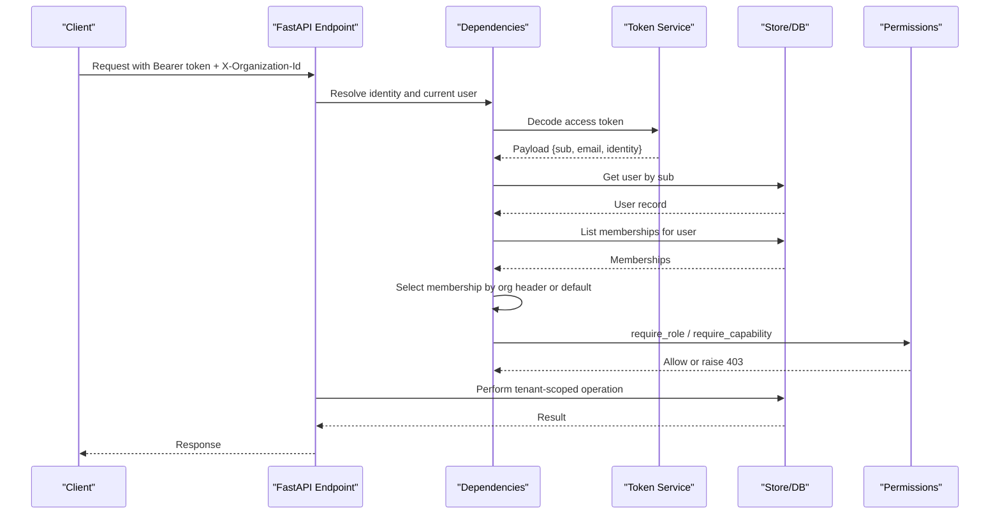

**Diagram sources**
- [auth.py:104-127](file://Backend/app/api/v1/auth.py#L104-L127)
- [dependencies.py:49-162](file://Backend/app/api/dependencies.py#L49-L162)
- [auth_tokens.py:22-64](file://Backend/app/services/auth_tokens.py#L22-L64)
- [permissions.py:53-63](file://Backend/app/domain/permissions.py#L53-L63)

## Detailed Component Analysis

### Authentication and Session Management
- Login registers or authenticates users, issues access and refresh tokens, and returns session metadata including memberships and candidate linkage
- Refresh rotates refresh tokens securely and returns new tokens plus updated session
- Logout revokes refresh tokens
- Current user endpoint exposes public user info, memberships, applications, and flags indicating superadmin and employer membership

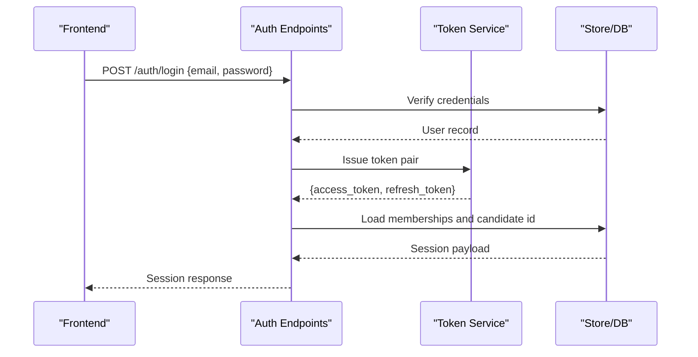

**Diagram sources**
- [auth.py:104-127](file://Backend/app/api/v1/auth.py#L104-L127)
- [auth.py:130-148](file://Backend/app/api/v1/auth.py#L130-L148)
- [auth.py:151-185](file://Backend/app/api/v1/auth.py#L151-L185)
- [auth_tokens.py:67-127](file://Backend/app/services/auth_tokens.py#L67-L127)

**Section sources**
- [auth.py:19-36](file://Backend/app/api/v1/auth.py#L19-L36)
- [auth.py:74-101](file://Backend/app/api/v1/auth.py#L74-L101)
- [auth.py:104-127](file://Backend/app/api/v1/auth.py#L104-L127)
- [auth.py:130-148](file://Backend/app/api/v1/auth.py#L130-L148)
- [auth.py:151-185](file://Backend/app/api/v1/auth.py#L151-L185)
- [auth_tokens.py:22-64](file://Backend/app/services/auth_tokens.py#L22-L64)
- [auth_tokens.py:67-127](file://Backend/app/services/auth_tokens.py#L67-L127)

### Identity Resolution and Context Dependencies
- Identity dependency extracts bearer token or development identity and validates it
- Current user dependency decodes token, fetches user, and ensures account is active
- Employer context dependency resolves the organization membership and verifies verification status and role eligibility
- Candidate context dependency prevents employer accounts from acting as candidates and creates/loads candidate records

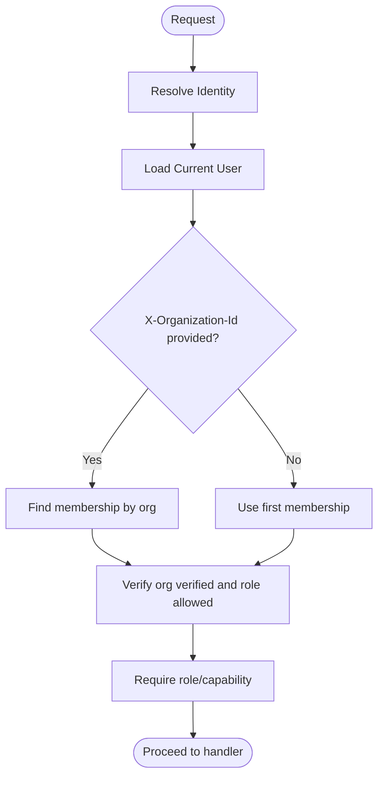

**Diagram sources**
- [dependencies.py:49-114](file://Backend/app/api/dependencies.py#L49-L114)
- [dependencies.py:125-162](file://Backend/app/api/dependencies.py#L125-L162)
- [dependencies.py:184-199](file://Backend/app/api/dependencies.py#L184-L199)

**Section sources**
- [dependencies.py:49-114](file://Backend/app/api/dependencies.py#L49-L114)
- [dependencies.py:125-162](file://Backend/app/api/dependencies.py#L125-L162)
- [dependencies.py:184-199](file://Backend/app/api/dependencies.py#L184-L199)

### Role-Based Permissions Model
- Roles include administrator, hiring manager, recruiter, and reviewer
- Capabilities include managing organizations, packs, jobs, pipeline actions, interview invitations, scorecards, and audit viewing
- Capability checks enforce fine-grained permissions per role

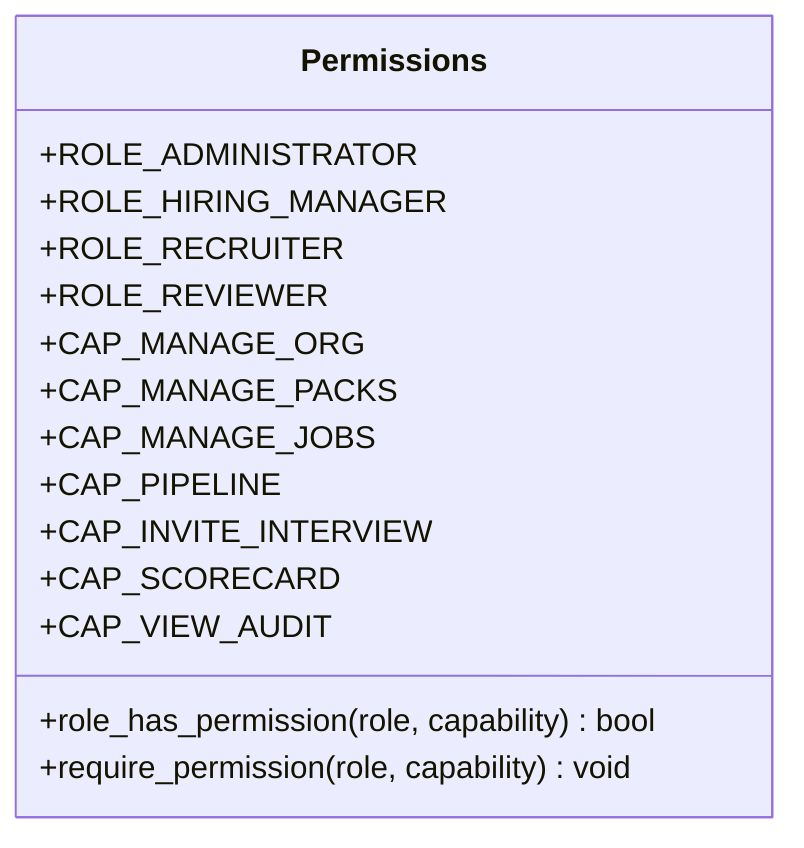

**Diagram sources**
- [permissions.py:7-50](file://Backend/app/domain/permissions.py#L7-L50)
- [permissions.py:53-63](file://Backend/app/domain/permissions.py#L53-L63)

**Section sources**
- [permissions.py:7-50](file://Backend/app/domain/permissions.py#L7-L50)
- [permissions.py:53-63](file://Backend/app/domain/permissions.py#L53-L63)

### Organization-Scoped Data Access and Tenancy
- All employer endpoints use EmployerContextDependency to scope operations by tenant_id
- Postings list and detail endpoints filter by tenant_id and count applications within the same organization
- Cross-tenant denial is enforced; tests verify that requests from one tenant cannot read another tenant’s postings or pipeline data
- Nonexistent org IDs return the same nondisclosing 403 shape as real but unauthorized org IDs

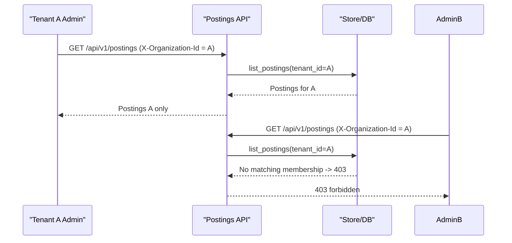

**Diagram sources**
- [postings.py:48-68](file://Backend/app/api/v1/postings.py#L48-L68)
- [test_tenancy.py:27-48](file://Backend/tests/test_tenancy.py#L27-L48)

**Section sources**
- [postings.py:48-68](file://Backend/app/api/v1/postings.py#L48-L68)
- [test_tenancy.py:1-71](file://Backend/tests/test_tenancy.py#L1-L71)

### Job Posting Visibility and Lifecycle
- Creating, updating, publishing, and closing postings require pipeline roles
- Publishing requires a locked question pool and workflow snapshot
- Question pool generation and curation are restricted to pipeline roles and enforce pack requirements
- Matches listing is tenant-scoped

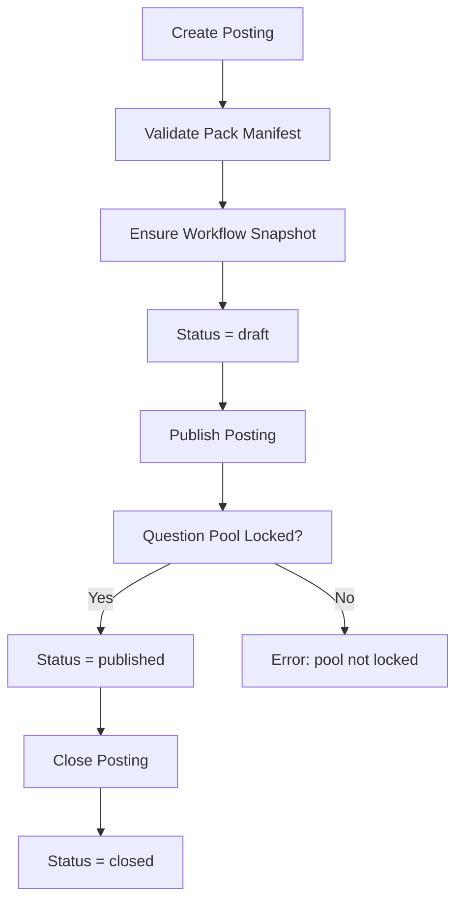

**Diagram sources**
- [postings.py:81-180](file://Backend/app/api/v1/postings.py#L81-L180)
- [postings.py:231-328](file://Backend/app/api/v1/postings.py#L231-L328)
- [postings.py:394-566](file://Backend/app/api/v1/postings.py#L394-L566)

**Section sources**
- [postings.py:81-180](file://Backend/app/api/v1/postings.py#L81-L180)
- [postings.py:231-328](file://Backend/app/api/v1/postings.py#L231-L328)
- [postings.py:394-566](file://Backend/app/api/v1/postings.py#L394-L566)

### Candidate Data Access and Protection
- Candidate endpoints are protected by CandidateContextDependency
- Employer accounts cannot act as candidates; attempts to do so receive a specific 403 error
- Candidates can manage their profile, parse/upload CVs, set consents, and manage profile interview attempts
- Attempt submission evaluates responses and persists results with idempotency

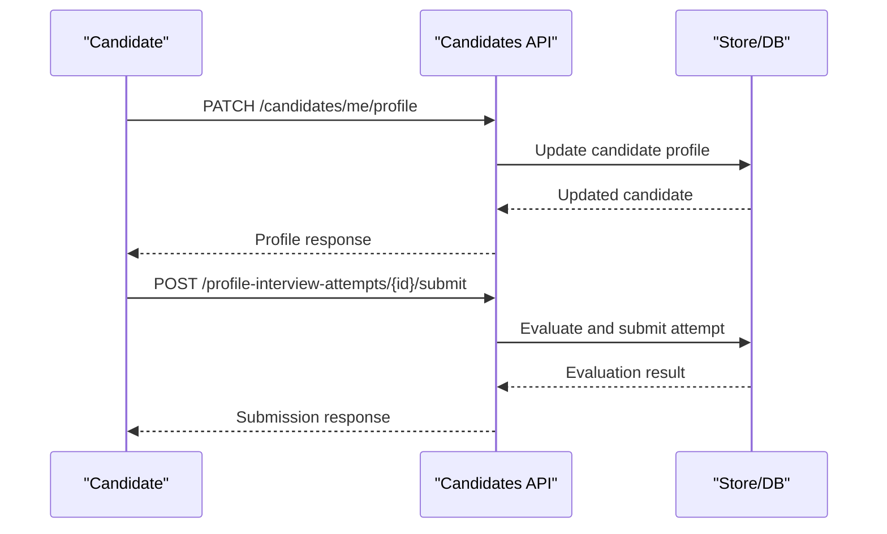

**Diagram sources**
- [candidates.py:147-189](file://Backend/app/api/v1/candidates.py#L147-L189)
- [candidates.py:268-362](file://Backend/app/api/v1/candidates.py#L268-L362)
- [candidates.py:429-482](file://Backend/app/api/v1/candidates.py#L429-L482)

**Section sources**
- [candidates.py:147-189](file://Backend/app/api/v1/candidates.py#L147-L189)
- [candidates.py:268-362](file://Backend/app/api/v1/candidates.py#L268-L362)
- [candidates.py:429-482](file://Backend/app/api/v1/candidates.py#L429-L482)

### Administrative Privileges and Organization Management
- Superadmin-only endpoints manage pending organizations and verification/rejection workflows
- Organization creation and application flows create tenants and optionally auto-verify in development
- Staff member creation enforces domain constraints and sends credentials via email
- Audit logs capture organizational changes and template updates

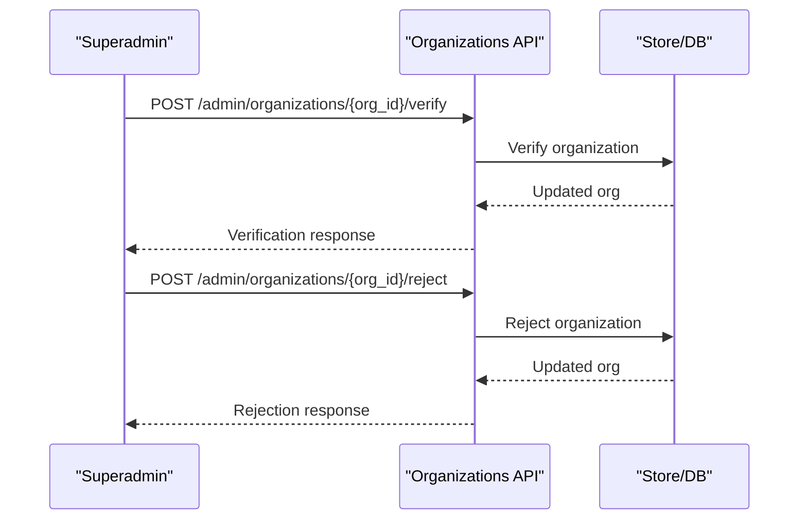

**Diagram sources**
- [organizations.py:228-320](file://Backend/app/api/v1/organizations.py#L228-L320)
- [organizations.py:386-481](file://Backend/app/api/v1/organizations.py#L386-L481)
- [organizations.py:513-623](file://Backend/app/api/v1/organizations.py#L513-L623)

**Section sources**
- [organizations.py:77-127](file://Backend/app/api/v1/organizations.py#L77-L127)
- [organizations.py:130-218](file://Backend/app/api/v1/organizations.py#L130-L218)
- [organizations.py:228-320](file://Backend/app/api/v1/organizations.py#L228-L320)
- [organizations.py:386-481](file://Backend/app/api/v1/organizations.py#L386-L481)
- [organizations.py:513-623](file://Backend/app/api/v1/organizations.py#L513-L623)

### Frontend Route Protection and Session Handling
- RequireAuth component checks authentication and optionally restricts to employer-only routes
- Session helpers store and retrieve tokens and session metadata from local storage
- Requests attach Authorization headers automatically when tokens exist

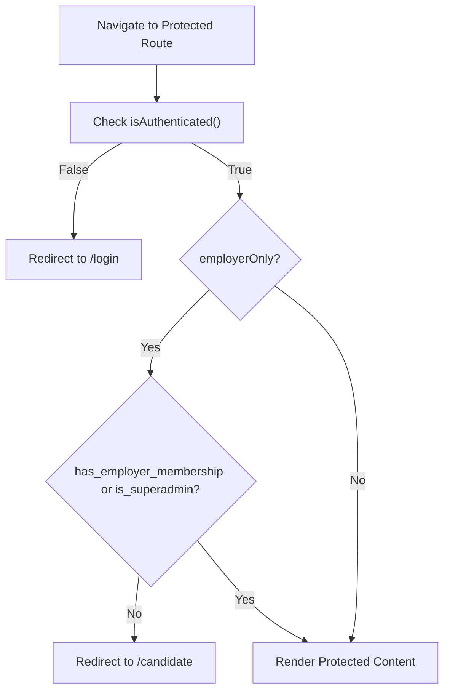

**Diagram sources**
- [require-auth.tsx:17-30](file://Frontend/components/auth/require-auth.tsx#L17-L30)
- [auth.ts:40-65](file://Frontend/lib/auth.ts#L40-L65)

**Section sources**
- [require-auth.tsx:17-30](file://Frontend/components/auth/require-auth.tsx#L17-L30)
- [auth.ts:40-65](file://Frontend/lib/auth.ts#L40-L65)

## Dependency Analysis
Authorization depends on several layers working together:
- Token service validates JWTs and manages refresh tokens
- Dependencies resolve identity, current user, and contexts (employer/candidate)
- Permissions module defines role-capability mappings and enforcement functions
- API handlers apply role and capability checks before performing tenant-scoped operations
- Tests validate cross-tenant isolation and role restrictions

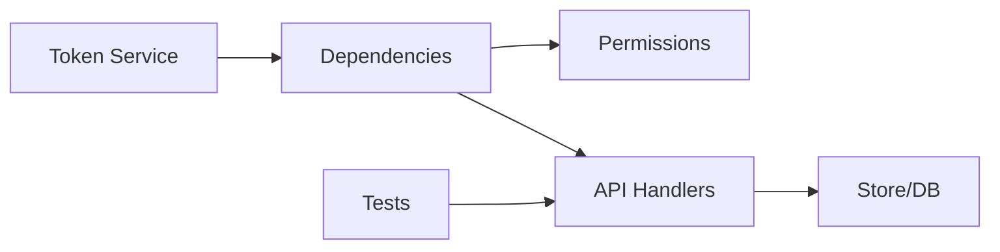

**Diagram sources**
- [auth_tokens.py:22-64](file://Backend/app/services/auth_tokens.py#L22-L64)
- [dependencies.py:49-162](file://Backend/app/api/dependencies.py#L49-L162)
- [permissions.py:53-63](file://Backend/app/domain/permissions.py#L53-L63)
- [postings.py:81-180](file://Backend/app/api/v1/postings.py#L81-L180)
- [test_tenancy.py:1-71](file://Backend/tests/test_tenancy.py#L1-L71)

**Section sources**
- [auth_tokens.py:22-64](file://Backend/app/services/auth_tokens.py#L22-L64)
- [dependencies.py:49-162](file://Backend/app/api/dependencies.py#L49-L162)
- [permissions.py:53-63](file://Backend/app/domain/permissions.py#L53-L63)
- [postings.py:81-180](file://Backend/app/api/v1/postings.py#L81-L180)
- [test_tenancy.py:1-71](file://Backend/tests/test_tenancy.py#L1-L71)

## Performance Considerations
- Token decoding and user lookup occur per request; ensure database indexes support fast lookups by user id and email
- Membership resolution is O(n) over memberships; keep membership counts reasonable per user
- Tenant-scoped queries should leverage indexed tenant_id columns to avoid cross-tenant scans
- Idempotency keys prevent duplicate writes and reduce load on downstream processes like matching and notifications

[No sources needed since this section provides general guidance]

## Troubleshooting Guide
Common authorization issues and resolutions:
- Invalid or expired token: decode errors indicate missing or invalid JWT; refresh tokens may be needed
- Account disabled: inactive users are rejected at identity resolution
- Missing organization context: if no X-Organization-Id is provided, the first membership is used; ensure the user belongs to the intended organization
- Forbidden due to role: require_role or require_capability checks will block actions outside permitted roles
- Employer account attempting candidate actions: candidate context rejects employer-linked accounts
- Cross-tenant access: requests targeting another tenant’s resources return nondisclosing 403

**Section sources**
- [auth_tokens.py:39-64](file://Backend/app/services/auth_tokens.py#L39-L64)
- [dependencies.py:49-114](file://Backend/app/api/dependencies.py#L49-L114)
- [dependencies.py:125-162](file://Backend/app/api/dependencies.py#L125-L162)
- [dependencies.py:184-199](file://Backend/app/api/dependencies.py#L184-L199)
- [test_tenancy.py:19-48](file://Backend/tests/test_tenancy.py#L19-L48)

## Conclusion
The ATS implements a robust authorization model combining JWT-based authentication, dependency-injected contexts, and explicit role-capability checks. Multi-tenant isolation is enforced at every boundary, ensuring that employer and candidate data remain strictly scoped. Frontend guards complement backend protections by restricting access to protected routes based on session state. Together, these patterns provide secure, scalable access control for job postings, candidate data, and administrative operations.

[No sources needed since this section summarizes without analyzing specific files]