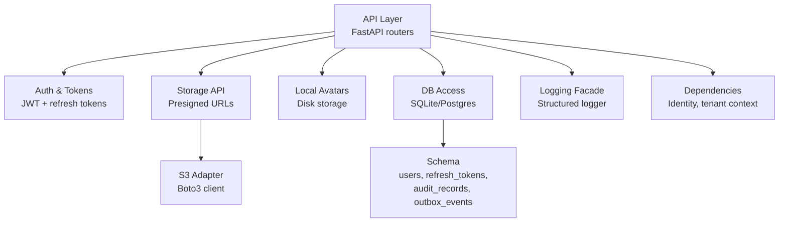
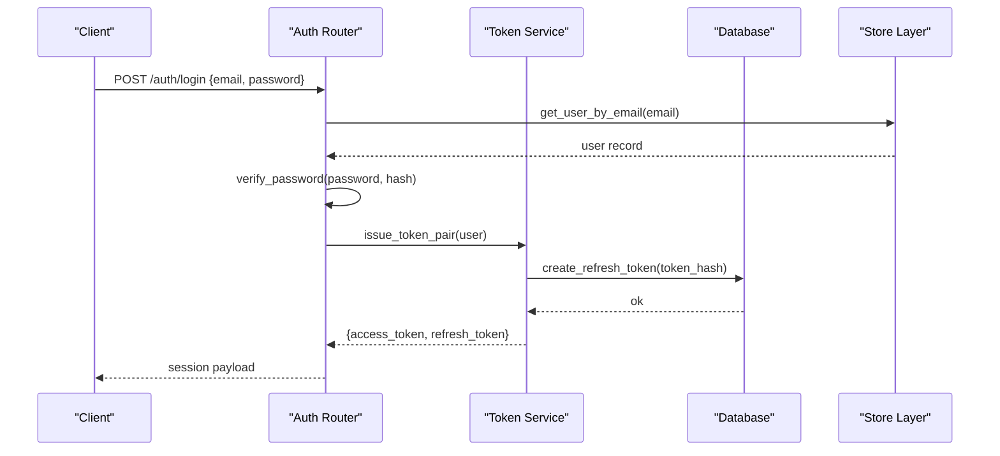
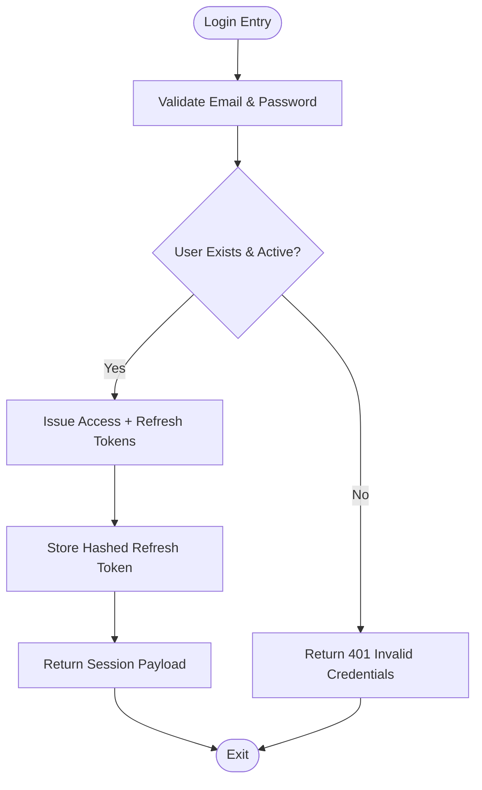
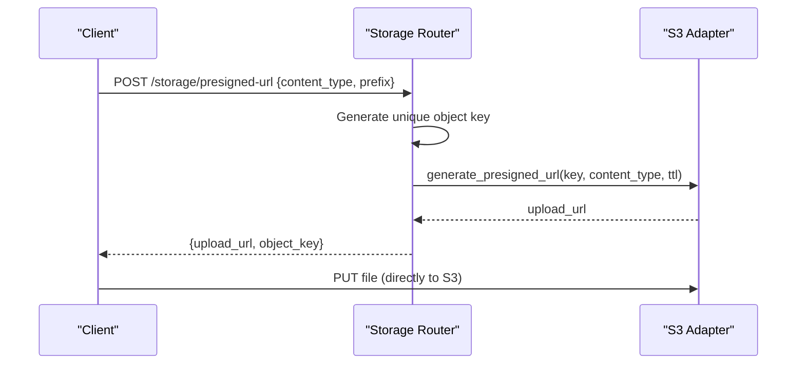
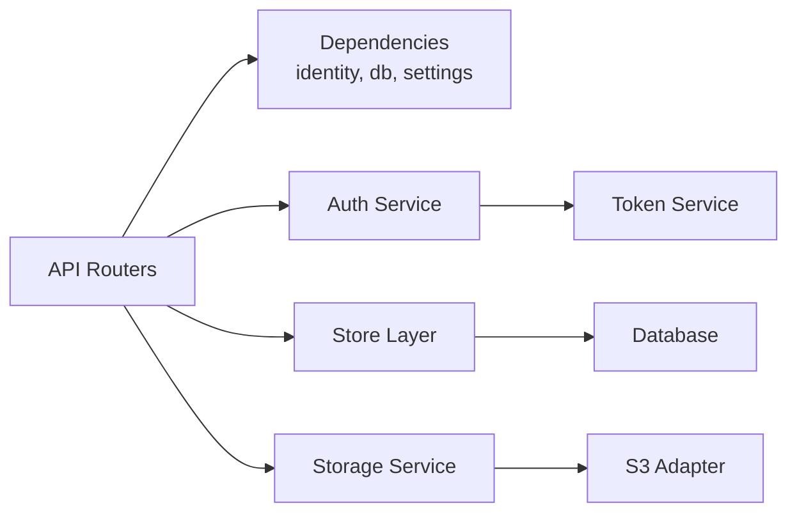

# Data Protection & Encryption

<cite>
**Referenced Files in This Document**
- [config.py](file://Backend/app/core/config.py)
- [auth.py](file://Backend/app/api/v1/auth.py)
- [auth_tokens.py](file://Backend/app/services/auth_tokens.py)
- [storage.py](file://Backend/app/services/storage.py)
- [storage_api.py](file://Backend/app/api/v1/storage.py)
- [avatars.py](file://Backend/app/services/avatars.py)
- [database.py](file://Backend/app/db/database.py)
- [store.py](file://Backend/app/db/store.py)
- [logging.py](file://Backend/app/logging.py)
- [dependencies.py](file://Backend/app/api/dependencies.py)
- [rules.md](file://rules.md)
</cite>

## Table of Contents
1. [Introduction](#introduction)
2. [Project Structure](#project-structure)
3. [Core Components](#core-components)
4. [Architecture Overview](#architecture-overview)
5. [Detailed Component Analysis](#detailed-component-analysis)
6. [Dependency Analysis](#dependency-analysis)
7. [Performance Considerations](#performance-considerations)
8. [Troubleshooting Guide](#troubleshooting-guide)
9. [Conclusion](#conclusion)

## Introduction
This document explains how the system protects data at rest and in transit, manages secrets and configuration, sanitizes inputs, handles PII and privacy controls, secures file uploads and storage, and implements secure logging and audit trails. It maps these practices to concrete implementation points in the codebase.

## Project Structure
Security-relevant areas are organized into:
- Configuration and secrets management
- Authentication and session handling
- Storage (local avatars and S3-backed uploads)
- Database schema for sensitive fields and audit records
- Logging facade and request identity/authorization dependencies
- Policy rules that govern data protection and privacy

**Diagram sources**
- [auth.py:74-148](file://Backend/app/api/v1/auth.py#L74-L148)
- [auth_tokens.py:22-127](file://Backend/app/services/auth_tokens.py#L22-L127)
- [storage_api.py:18-39](file://Backend/app/api/v1/storage.py#L18-L39)
- [storage.py:10-61](file://Backend/app/services/storage.py#L10-L61)
- [avatars.py:30-88](file://Backend/app/services/avatars.py#L30-L88)
- [database.py:19-331](file://Backend/app/db/database.py#L19-L331)
- [logging.py:9-36](file://Backend/app/logging.py#L9-L36)
- [dependencies.py:49-114](file://Backend/app/api/dependencies.py#L49-L114)

**Section sources**
- [config.py:16-121](file://Backend/app/core/config.py#L16-L121)
- [database.py:19-331](file://Backend/app/db/database.py#L19-L331)
- [rules.md:26-68](file://rules.md#L26-L68)

## Core Components
- Secrets and configuration via environment variables with typed validation and secret masking.
- Password hashing and verification using bcrypt.
- JWT access tokens and hashed, revocable refresh tokens stored in the database.
- Secure file upload via short-lived presigned URLs to object storage; local avatar storage with strict content-type and size checks.
- Database schema includes sensitive fields (password hashes, token hashes) and append-only audit records.
- Centralized logging facade and dependency injection for identity and tenant scoping.

**Section sources**
- [config.py:16-121](file://Backend/app/core/config.py#L16-L121)
- [auth.py:74-148](file://Backend/app/api/v1/auth.py#L74-L148)
- [auth_tokens.py:22-127](file://Backend/app/services/auth_tokens.py#L22-L127)
- [storage_api.py:18-39](file://Backend/app/api/v1/storage.py#L18-L39)
- [storage.py:10-61](file://Backend/app/services/storage.py#L10-L61)
- [avatars.py:30-88](file://Backend/app/services/avatars.py#L30-L88)
- [database.py:19-331](file://Backend/app/db/database.py#L19-L331)
- [store.py:216-276](file://Backend/app/db/store.py#L216-L276)
- [logging.py:9-36](file://Backend/app/logging.py#L9-L36)
- [dependencies.py:49-114](file://Backend/app/api/dependencies.py#L49-L114)

## Architecture Overview
The authentication flow issues signed JWTs and stores hashed refresh tokens. File uploads use presigned URLs to bypass server-side payload exposure. All sensitive writes go through a tenant-scoped store layer with audit records.

**Diagram sources**
- [auth.py:104-127](file://Backend/app/api/v1/auth.py#L104-L127)
- [auth_tokens.py:67-86](file://Backend/app/services/auth_tokens.py#L67-L86)
- [store.py:157-187](file://Backend/app/db/store.py#L157-L187)

## Detailed Component Analysis

### Secrets and Configuration Management
- Environment-driven settings with typed fields and validators.
- Sensitive values wrapped as secrets to avoid accidental logging or serialization.
- Validation enforces safe defaults and rejects insecure configurations (e.g., wildcard CORS outside development).

Key behaviors:
- Settings loaded from environment with a prefix and optional .env file.
- Secret fields include JWT secrets, SMTP credentials, S3 keys, LiveKit secrets, AI provider keys.
- Validators enforce TTL ranges and disallow wildcard CORS in non-development environments.

**Section sources**
- [config.py:16-121](file://Backend/app/core/config.py#L16-L121)
- [config.py:122-205](file://Backend/app/core/config.py#L122-L205)

### Encryption at Rest
- Passwords are hashed with bcrypt before storage; never stored in plaintext.
- Refresh tokens are hashed before persistence; only hashes are stored in the database.
- Database schema stores sensitive fields such as password hashes and token hashes.

Operational notes:
- Hashing occurs during registration and login verification.
- Token rotation replaces old refresh tokens with new ones and marks previous tokens as revoked.

**Section sources**
- [auth.py:74-101](file://Backend/app/api/v1/auth.py#L74-L101)
- [auth.py:104-127](file://Backend/app/api/v1/auth.py#L104-L127)
- [auth_tokens.py:18-20](file://Backend/app/services/auth_tokens.py#L18-L20)
- [auth_tokens.py:67-127](file://Backend/app/services/auth_tokens.py#L67-L127)
- [database.py:19-40](file://Backend/app/db/database.py#L19-L40)

### Encryption in Transit
- The application uses HTTPS between clients and the API (deployment responsibility).
- Object storage uploads use short-lived presigned URLs, limiting exposure window and scope.

**Section sources**
- [storage_api.py:18-39](file://Backend/app/api/v1/storage.py#L18-L39)
- [storage.py:23-45](file://Backend/app/services/storage.py#L23-L45)

### Request/Response Sanitization and Input Validation
- Pydantic models validate email format, length constraints, and required fields on auth endpoints.
- Identity header is validated against a strict pattern in development mode.
- Content-type enforcement for avatar uploads restricts allowed image types.

Mitigations:
- Strict input validation reduces injection and malformed payloads.
- Content-type allowlist prevents arbitrary file execution risks.

**Section sources**
- [auth.py:19-36](file://Backend/app/api/v1/auth.py#L19-L36)
- [dependencies.py:49-87](file://Backend/app/api/dependencies.py#L49-L87)
- [avatars.py:30-59](file://Backend/app/services/avatars.py#L30-L59)

### Output Encoding and XSS Prevention
- Responses return structured JSON payloads without embedding raw HTML.
- Frontend rendering should encode outputs when displaying user-generated content (application-level concern).

Note: No direct output encoding logic was found in the referenced backend files; ensure frontend encodes dynamic content.

[No sources needed since this section provides general guidance]

### PII Protection and Privacy Controls
- Tenant isolation is enforced by design: every query takes an explicit tenant context.
- Audit records capture actor, action, resource type, and state changes for mutations.
- Outbox events and idempotency records support reliable processing and traceability.
- Policy rules require consent propagation and prevent personal data from appearing in logs or analytics.

Compliance considerations:
- Append-only audit trail supports GDPR accountability.
- Consent and visibility rules limit cross-organization exposure.

**Section sources**
- [store.py:216-276](file://Backend/app/db/store.py#L216-L276)
- [rules.md:26-68](file://rules.md#L26-L68)

### File Upload Security and Storage
- Presigned URL generation scopes uploads to a unique key per request and limits expiration.
- Local avatar storage validates content type and size, removes prior uploads for the same user, and resolves paths safely to prevent traversal.

Secure deletion:
- Avatar removal deletes only the resolved file within the configured directory.

**Section sources**
- [storage_api.py:18-39](file://Backend/app/api/v1/storage.py#L18-L39)
- [storage.py:23-61](file://Backend/app/services/storage.py#L23-L61)
- [avatars.py:30-88](file://Backend/app/services/avatars.py#L30-L88)

### Logging Security and Audit Trails
- Centralized logging facade provides consistent log formatting and levels.
- Audit records are written for sensitive mutations with actor, reason, and timestamps.
- Policy mandates no personal data in logs or analytics; use stable event names.

Best practices:
- Avoid logging raw payloads or secrets.
- Use correlation/request IDs to trace requests across services.

**Section sources**
- [logging.py:9-36](file://Backend/app/logging.py#L9-L36)
- [store.py:216-276](file://Backend/app/db/store.py#L216-L276)
- [rules.md:26-68](file://rules.md#L26-L68)

### Authentication Flow Details
- Login verifies credentials and issues a short-lived access token plus a long-lived refresh token.
- Refresh token rotation invalidates the previous token and links it to the replacement.
- Logout revokes the provided refresh token.

**Diagram sources**
- [auth.py:104-127](file://Backend/app/api/v1/auth.py#L104-L127)
- [auth_tokens.py:67-127](file://Backend/app/services/auth_tokens.py#L67-L127)

**Section sources**
- [auth.py:104-148](file://Backend/app/api/v1/auth.py#L104-L148)
- [auth_tokens.py:67-127](file://Backend/app/services/auth_tokens.py#L67-L127)

### Storage Upload Flow

**Diagram sources**
- [storage_api.py:18-39](file://Backend/app/api/v1/storage.py#L18-L39)
- [storage.py:23-45](file://Backend/app/services/storage.py#L23-L45)

**Section sources**
- [storage_api.py:18-39](file://Backend/app/api/v1/storage.py#L18-L39)
- [storage.py:23-61](file://Backend/app/services/storage.py#L23-L61)

## Dependency Analysis
Security-critical dependencies:
- FastAPI routers depend on dependency injectors for identity, tenant context, and database connections.
- Auth router depends on password hashing and token services.
- Storage router depends on S3 adapter for presigned URLs.
- Store layer depends on database connection abstraction supporting SQLite/Postgres.

**Diagram sources**
- [dependencies.py:22-114](file://Backend/app/api/dependencies.py#L22-L114)
- [auth.py:74-148](file://Backend/app/api/v1/auth.py#L74-L148)
- [auth_tokens.py:22-127](file://Backend/app/services/auth_tokens.py#L22-L127)
- [store.py:1-13](file://Backend/app/db/store.py#L1-L13)
- [storage_api.py:18-39](file://Backend/app/api/v1/storage.py#L18-L39)
- [storage.py:10-61](file://Backend/app/services/storage.py#L10-L61)

**Section sources**
- [dependencies.py:22-114](file://Backend/app/api/dependencies.py#L22-L114)
- [store.py:1-13](file://Backend/app/db/store.py#L1-L13)

## Performance Considerations
- Short-lived presigned URLs reduce exposure and network overhead by allowing direct client-to-storage uploads.
- Token TTLs are bounded by validators to balance security and usability.
- Database adapters translate placeholders to maintain compatibility without performance penalties.

[No sources needed since this section provides general guidance]

## Troubleshooting Guide
Common issues and mitigations:
- Invalid or expired tokens: handled with specific error codes and messages.
- Missing or misconfigured S3: presigned URL generation returns errors and logs details.
- Unauthorized access: dependency layer enforces role and organization verification.

Actions:
- Verify environment variables for secrets and endpoints.
- Check audit records for mutation history and reasons.
- Ensure CORS settings are appropriate for the environment.

**Section sources**
- [auth_tokens.py:39-64](file://Backend/app/services/auth_tokens.py#L39-L64)
- [storage.py:23-45](file://Backend/app/services/storage.py#L23-L45)
- [dependencies.py:125-162](file://Backend/app/api/dependencies.py#L125-L162)

## Conclusion
The system implements strong data protection through:
- Secret-managed configuration with validation
- Password hashing and token hashing at rest
- Signed, short-lived upload URLs for secure transfers
- Strict input validation and content-type enforcement
- Tenant-scoped operations with append-only audit trails
- Centralized logging and policy-driven privacy controls

These measures collectively support confidentiality, integrity, and compliance requirements while maintaining operational clarity and traceability.