# Password Security

<cite>
**Referenced Files in This Document**
- [Backend/app/services/passwords.py](file://Backend/app/services/passwords.py)
- [Backend/app/api/v1/auth.py](file://Backend/app/api/v1/auth.py)
- [Backend/app/services/auth_tokens.py](file://Backend/app/services/auth_tokens.py)
- [Backend/app/core/config.py](file://Backend/app/core/config.py)
- [Backend/app/db/store.py](file://Backend/app/db/store.py)
- [Backend/app/db/database.py](file://Backend/app/db/database.py)
- [Backend/app/services/mail.py](file://Backend/app/services/mail.py)
- [pts/backend/app/utils/security.py](file://pts/backend/app/utils/security.py)
- [pts/backend/app/api/endpoints/auth.py](file://pts/backend/app/api/endpoints/auth.py)
- [pts/frontend/src/contexts/AuthContext.tsx](file://pts/frontend/src/contexts/AuthContext.tsx)
- [pts/frontend/src/app/(pages)/(public)/setup-password/page.tsx](file://pts/frontend/src/app/(pages)/(public)/setup-password/page.tsx)
- [Frontend/components/admin/admin-page.tsx](file://Frontend/components/admin/admin-page.tsx)
- [rules.md](file://rules.md)
</cite>

## Table of Contents
1. Introduction
2. Project Structure
3. Core Components
4. Architecture Overview
5. Detailed Component Analysis
6. Dependency Analysis
7. Performance Considerations
8. Troubleshooting Guide
9. Conclusion
10. Appendices

## Introduction
This document explains the password security implementation across the codebase, covering hashing algorithms, validation rules, secure password reset workflows, brute force protection, account lockout policies, token generation and expiration, secure email delivery, session invalidation on password changes, audit logging, compliance considerations, and guidance for integrating with external identity providers. It synthesizes behavior from both the Backend (FastAPI) and PTS backend implementations, as well as frontend flows that enforce and react to password policies.

## Project Structure
Password-related functionality is implemented in several layers:
- Services: bcrypt-based hashing and verification utilities.
- API endpoints: registration, login, refresh, logout, and forced password change.
- Token service: JWT access tokens and opaque refresh tokens with rotation and revocation.
- Configuration: JWT secrets and TTLs, SMTP settings for secure email delivery.
- Persistence: user storage, refresh token storage, and audit records.
- Frontend: client-side validation and forced password setup flow.

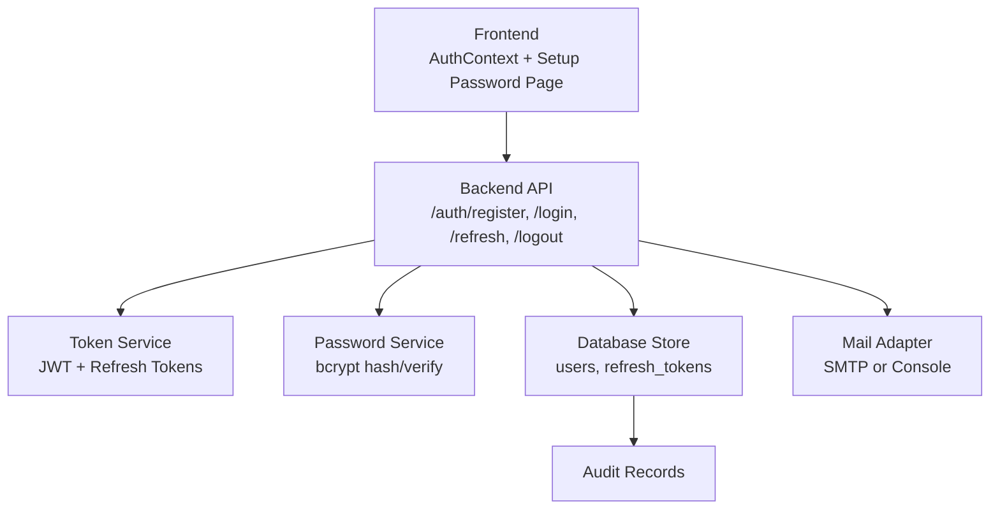

**Diagram sources**
- [Backend/app/api/v1/auth.py:74-148](file://Backend/app/api/v1/auth.py#L74-L148)
- [Backend/app/services/auth_tokens.py:22-126](file://Backend/app/services/auth_tokens.py#L22-L126)
- [Backend/app/services/passwords.py:6-16](file://Backend/app/services/passwords.py#L6-L16)
- [Backend/app/db/store.py:64-133](file://Backend/app/db/store.py#L64-L133)
- [Backend/app/services/mail.py:84-115](file://Backend/app/services/mail.py#L84-L115)
- [Backend/app/db/database.py:254-266](file://Backend/app/db/database.py#L254-L266)

**Section sources**
- [Backend/app/api/v1/auth.py:74-148](file://Backend/app/api/v1/auth.py#L74-L148)
- [Backend/app/services/auth_tokens.py:22-126](file://Backend/app/services/auth_tokens.py#L22-L126)
- [Backend/app/services/passwords.py:6-16](file://Backend/app/services/passwords.py#L6-L16)
- [Backend/app/db/store.py:64-133](file://Backend/app/db/store.py#L64-L133)
- [Backend/app/services/mail.py:84-115](file://Backend/app/services/mail.py#L84-L115)
- [Backend/app/db/database.py:254-266](file://Backend/app/db/database.py#L254-L266)

## Core Components
- Password hashing and verification:
  - Backend uses bcrypt for hashing and verifying passwords.
  - PTS backend provides equivalent bcrypt helpers.
- Authentication endpoints:
  - Register creates a user with a hashed password and issues tokens.
  - Login verifies credentials and issues tokens; checks account status.
  - Refresh rotates refresh tokens and returns new pairs.
  - Logout revokes refresh tokens.
- Forced password change:
  - PTS endpoint enforces current password verification, minimum length, and clears a forced-change flag after update.
- Token management:
  - Access tokens are short-lived JWTs signed with HS256 using a configured secret.
  - Refresh tokens are opaque, stored hashed, rotated on use, and can be revoked.
- Email delivery:
  - SMTP adapter sends emails securely; console adapter used in development/testing.
  - Staff credential emails include temporary password and instructions to change it on first login.
- Audit logging:
  - Audit records table captures actor, action, resource type, and timestamps for governance.

**Section sources**
- [Backend/app/services/passwords.py:6-16](file://Backend/app/services/passwords.py#L6-L16)
- [pts/backend/app/utils/security.py:8-15](file://pts/backend/app/utils/security.py#L8-L15)
- [Backend/app/api/v1/auth.py:74-148](file://Backend/app/api/v1/auth.py#L74-L148)
- [pts/backend/app/api/endpoints/auth.py:170-210](file://pts/backend/app/api/endpoints/auth.py#L170-L210)
- [Backend/app/services/auth_tokens.py:22-126](file://Backend/app/services/auth_tokens.py#L22-L126)
- [Backend/app/services/mail.py:84-115](file://Backend/app/services/mail.py#L84-L115)
- [Backend/app/db/database.py:254-266](file://Backend/app/db/database.py#L254-L266)

## Architecture Overview
The authentication and password security architecture centers around FastAPI endpoints that coordinate hashing, token issuance, and persistence. The PTS variant adds a forced password change workflow and cookie-based refresh handling.

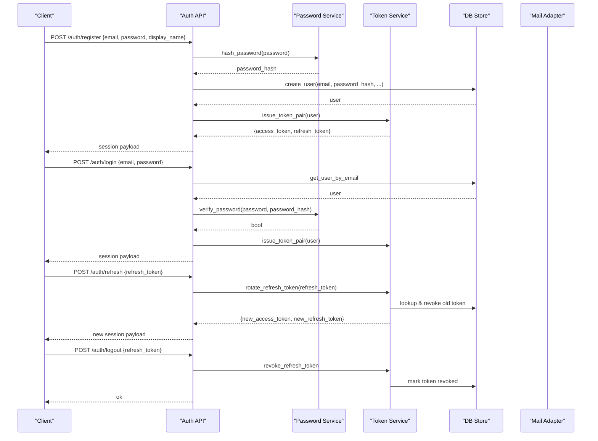

**Diagram sources**
- [Backend/app/api/v1/auth.py:74-148](file://Backend/app/api/v1/auth.py#L74-L148)
- [Backend/app/services/auth_tokens.py:22-126](file://Backend/app/services/auth_tokens.py#L22-L126)
- [Backend/app/services/passwords.py:6-16](file://Backend/app/services/passwords.py#L6-L16)
- [Backend/app/db/store.py:64-133](file://Backend/app/db/store.py#L64-L133)

## Detailed Component Analysis

### Password Hashing and Verification
- Algorithm: bcrypt with random salt per hash.
- Functions:
  - hash_password: generates a secure bcrypt hash.
  - verify_password: safely compares plaintext against stored hash, handling edge cases.
- PTS backend mirrors this with equivalent bcrypt helpers.

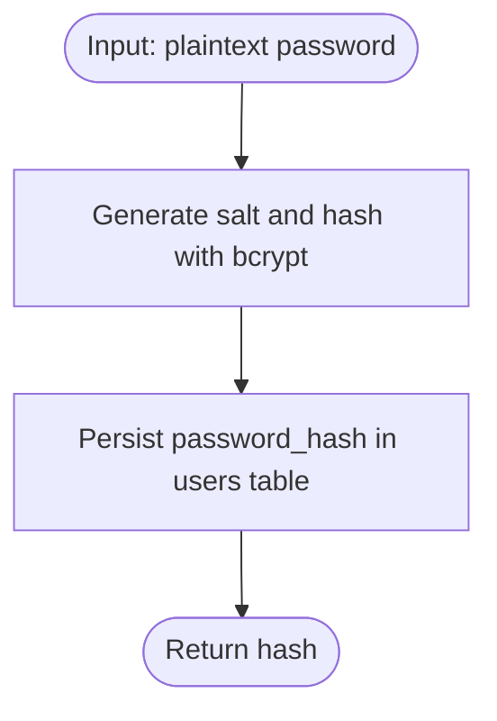

**Diagram sources**
- [Backend/app/services/passwords.py:6-16](file://Backend/app/services/passwords.py#L6-L16)
- [pts/backend/app/utils/security.py:8-15](file://pts/backend/app/utils/security.py#L8-L15)

**Section sources**
- [Backend/app/services/passwords.py:6-16](file://Backend/app/services/passwords.py#L6-L16)
- [pts/backend/app/utils/security.py:8-15](file://pts/backend/app/utils/security.py#L8-L15)

### Registration and Login Flows
- Registration:
  - Validates email format and password length via Pydantic models.
  - Creates user with hashed password and issues token pair.
- Login:
  - Normalizes email, retrieves user, verifies password, checks account status, then issues tokens.

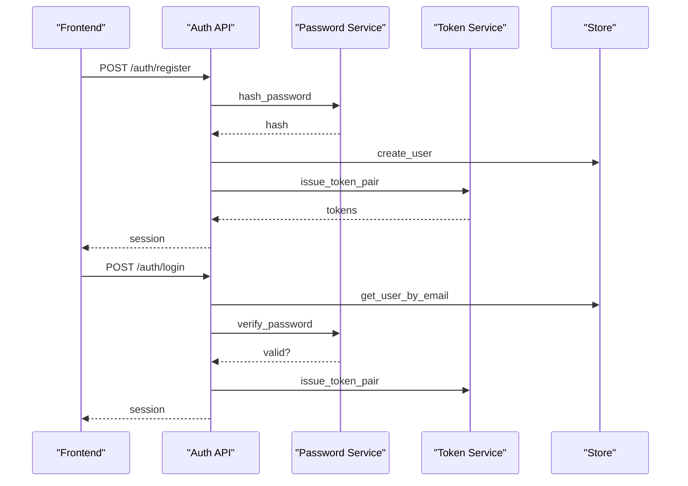

**Diagram sources**
- [Backend/app/api/v1/auth.py:74-148](file://Backend/app/api/v1/auth.py#L74-L148)
- [Backend/app/services/passwords.py:6-16](file://Backend/app/services/passwords.py#L6-L16)
- [Backend/app/services/auth_tokens.py:22-86](file://Backend/app/services/auth_tokens.py#L22-L86)

**Section sources**
- [Backend/app/api/v1/auth.py:74-148](file://Backend/app/api/v1/auth.py#L74-L148)

### Forced Password Change Flow (PTS)
- Enforces current password verification, minimum length, and matching confirm password.
- Updates password hash and clears forced-change flag.
- Logs completion event.

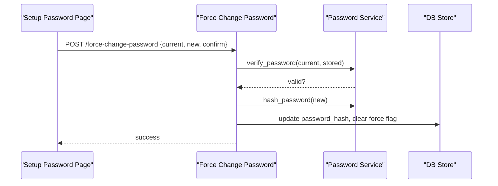

**Diagram sources**
- [pts/backend/app/api/endpoints/auth.py:170-210](file://pts/backend/app/api/endpoints/auth.py#L170-L210)
- [pts/backend/app/utils/security.py:8-15](file://pts/backend/app/utils/security.py#L8-L15)

**Section sources**
- [pts/backend/app/api/endpoints/auth.py:170-210](file://pts/backend/app/api/endpoints/auth.py#L170-L210)

### Token Management and Session Handling
- Access tokens:
  - Short-lived JWTs signed with HS256 using a configured secret.
  - Decoding validates signature, expiry, and token type.
- Refresh tokens:
  - Opaque tokens hashed before storage; rotation on each use; revocation on logout or reuse.
- Frontend:
  - Proactively refreshes access tokens before expiry.
  - On 401, attempts refresh; if failed, clears auth state.
  - Redirects to setup-password when force_password_change is set.

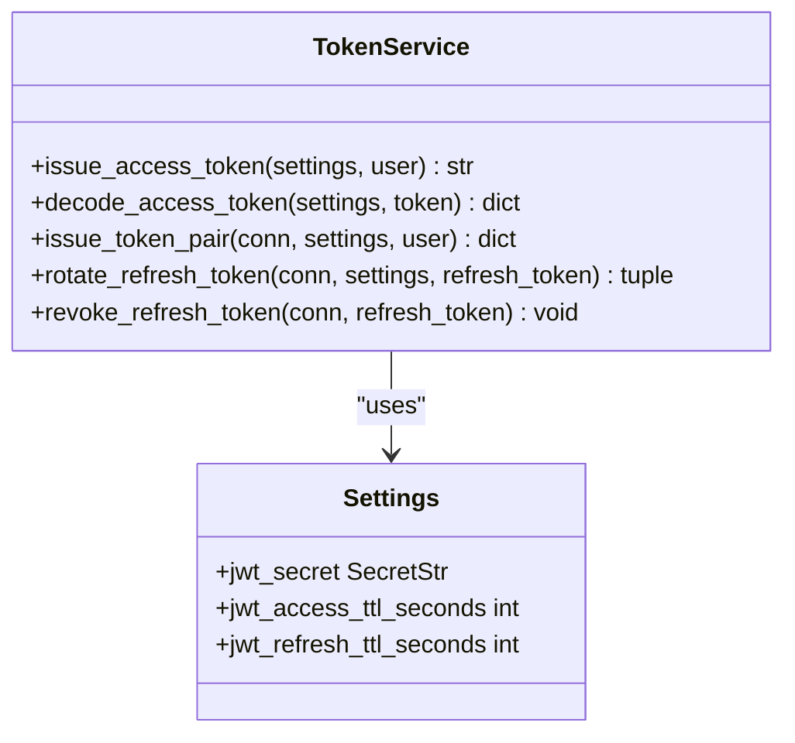

**Diagram sources**
- [Backend/app/services/auth_tokens.py:22-126](file://Backend/app/services/auth_tokens.py#L22-L126)
- [Backend/app/core/config.py:64-66](file://Backend/app/core/config.py#L64-L66)

**Section sources**
- [Backend/app/services/auth_tokens.py:22-126](file://Backend/app/services/auth_tokens.py#L22-L126)
- [Backend/app/core/config.py:64-66](file://Backend/app/core/config.py#L64-L66)
- [pts/frontend/src/contexts/AuthContext.tsx:115-158](file://pts/frontend/src/contexts/AuthContext.tsx#L115-L158)

### Secure Email Delivery for Temporary Credentials
- SMTP adapter sends emails over TLS when port 587 is used.
- Development uses a console adapter that logs messages instead of sending.
- Staff credential emails include temporary password and instructions to change it on first login.

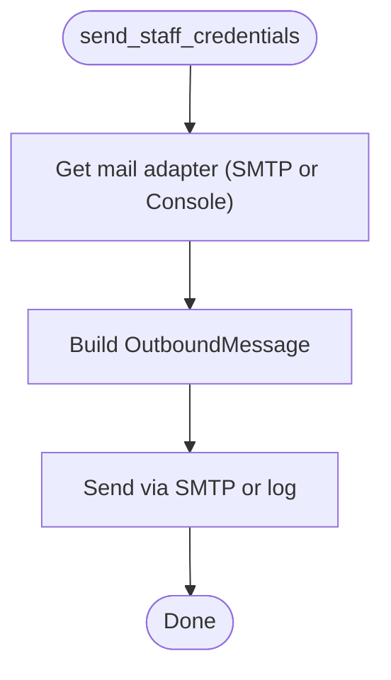

**Diagram sources**
- [Backend/app/services/mail.py:48-88](file://Backend/app/services/mail.py#L48-L88)
- [Backend/app/services/mail.py:91-115](file://Backend/app/services/mail.py#L91-L115)

**Section sources**
- [Backend/app/services/mail.py:48-115](file://Backend/app/services/mail.py#L48-L115)

### Audit Logging for Security Events
- Audit records capture actor, action, resource type, and timestamps.
- Admin UI exposes an audit panel to review recent events.

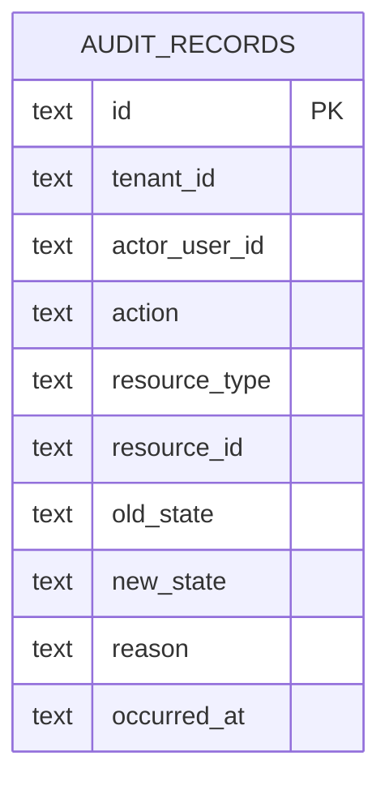

**Diagram sources**
- [Backend/app/db/database.py:254-266](file://Backend/app/db/database.py#L254-L266)

**Section sources**
- [Backend/app/db/database.py:254-266](file://Backend/app/db/database.py#L254-L266)
- [Frontend/components/admin/admin-page.tsx:928-952](file://Frontend/components/admin/admin-page.tsx#L928-L952)

### Password Reset Workflow
- Current implementation does not expose a public “forgot password” endpoint.
- Staff accounts receive temporary credentials via email and must change password on first login.
- Forced password change ensures users set a strong password when required by policy.

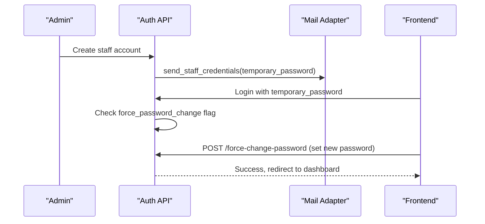

**Diagram sources**
- [Backend/app/services/mail.py:91-115](file://Backend/app/services/mail.py#L91-L115)
- [pts/backend/app/api/endpoints/auth.py:170-210](file://pts/backend/app/api/endpoints/auth.py#L170-L210)
- [pts/frontend/src/app/(pages)/(public)/setup-password/page.tsx:19-44](file://pts/frontend/src/app/(pages)/(public)/setup-password/page.tsx#L19-L44)

**Section sources**
- [Backend/app/services/mail.py:91-115](file://Backend/app/services/mail.py#L91-L115)
- [pts/backend/app/api/endpoints/auth.py:170-210](file://pts/backend/app/api/endpoints/auth.py#L170-L210)
- [pts/frontend/src/app/(pages)/(public)/setup-password/page.tsx:19-44](file://pts/frontend/src/app/(pages)/(public)/setup-password/page.tsx#L19-L44)

### Password Strength Requirements
- Backend registration enforces minimum password length via model constraints.
- PTS forced password change enforces minimum length and requires matching confirmation.
- Frontend displays strength indicators and enforces match and difference from current password.

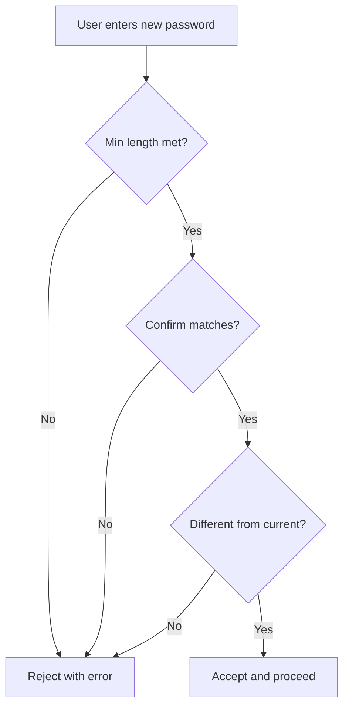

**Diagram sources**
- [Backend/app/api/v1/auth.py:19-27](file://Backend/app/api/v1/auth.py#L19-L27)
- [pts/backend/app/api/endpoints/auth.py:192-202](file://pts/backend/app/api/endpoints/auth.py#L192-L202)
- [pts/frontend/src/app/(pages)/(public)/setup-password/page.tsx:23-31](file://pts/frontend/src/app/(pages)/(public)/setup-password/page.tsx#L23-L31)

**Section sources**
- [Backend/app/api/v1/auth.py:19-27](file://Backend/app/api/v1/auth.py#L19-L27)
- [pts/backend/app/api/endpoints/auth.py:192-202](file://pts/backend/app/api/endpoints/auth.py#L192-L202)
- [pts/frontend/src/app/(pages)/(public)/setup-password/page.tsx:23-31](file://pts/frontend/src/app/(pages)/(public)/setup-password/page.tsx#L23-L31)

### Brute Force Protection and Account Lockout Policies
- No explicit rate limiting or account lockout logic is present in the analyzed files.
- Best practice recommendation: add request throttling and progressive delays or temporary lockouts after repeated failures at the API gateway or middleware layer.

[No sources needed since this section provides general guidance]

### Session Invalidation on Password Changes
- Refresh token rotation and revocation ensure that previously issued refresh tokens cannot be reused after logout or rotation.
- Forced password change updates the password hash; clients should re-authenticate or refresh tokens accordingly.

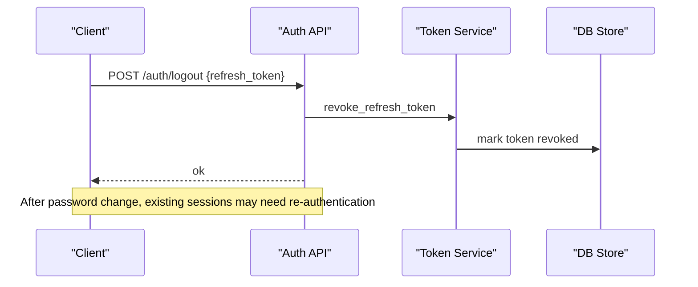

**Diagram sources**
- [Backend/app/api/v1/auth.py:144-148](file://Backend/app/api/v1/auth.py#L144-L148)
- [Backend/app/services/auth_tokens.py:123-126](file://Backend/app/services/auth_tokens.py#L123-L126)

**Section sources**
- [Backend/app/api/v1/auth.py:144-148](file://Backend/app/api/v1/auth.py#L144-L148)
- [Backend/app/services/auth_tokens.py:123-126](file://Backend/app/services/auth_tokens.py#L123-L126)

### Compliance Requirements for Password Policies
- Centralized authentication and session handling are mandated by project rules.
- Secrets must never be committed or embedded in client-side code.
- All mutating endpoints must re-validate authorization server-side.

**Section sources**
- [rules.md:50-68](file://rules.md#L50-L68)

### Integrating with External Identity Providers
- The codebase supports a development header path that auto-creates synthetic users without passwords.
- For production integration with external providers (e.g., OAuth/OIDC), implement:
  - Provider-specific login endpoints that exchange provider tokens for internal sessions.
  - Mapping of provider identities to internal user records.
  - Enforcement of password policies where applicable (e.g., forcing password setup for local accounts).
  - Consistent token issuance and refresh rotation aligned with current token service.

[No sources needed since this section provides general guidance]

## Dependency Analysis
Key dependencies among components:
- Auth endpoints depend on password services for hashing/verification.
- Token service depends on configuration for secrets and TTLs.
- Mail service depends on SMTP settings or falls back to console adapter.
- Audit records are persisted alongside mutations for governance.

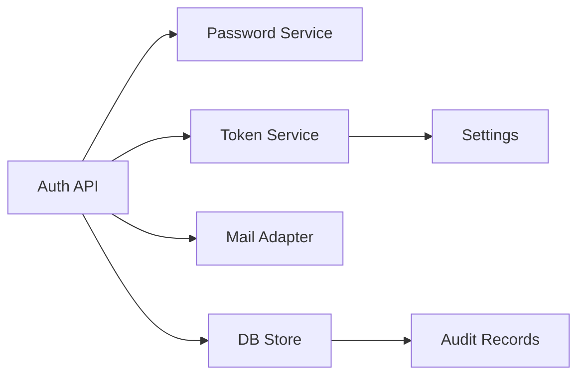

**Diagram sources**
- [Backend/app/api/v1/auth.py:74-148](file://Backend/app/api/v1/auth.py#L74-L148)
- [Backend/app/services/auth_tokens.py:22-126](file://Backend/app/services/auth_tokens.py#L22-L126)
- [Backend/app/core/config.py:64-66](file://Backend/app/core/config.py#L64-L66)
- [Backend/app/services/mail.py:84-115](file://Backend/app/services/mail.py#L84-L115)
- [Backend/app/db/store.py:64-133](file://Backend/app/db/store.py#L64-L133)
- [Backend/app/db/database.py:254-266](file://Backend/app/db/database.py#L254-L266)

**Section sources**
- [Backend/app/api/v1/auth.py:74-148](file://Backend/app/api/v1/auth.py#L74-L148)
- [Backend/app/services/auth_tokens.py:22-126](file://Backend/app/services/auth_tokens.py#L22-L126)
- [Backend/app/core/config.py:64-66](file://Backend/app/core/config.py#L64-L66)
- [Backend/app/services/mail.py:84-115](file://Backend/app/services/mail.py#L84-L115)
- [Backend/app/db/store.py:64-133](file://Backend/app/db/store.py#L64-L133)
- [Backend/app/db/database.py:254-266](file://Backend/app/db/database.py#L254-L266)

## Performance Considerations
- bcrypt hashing is intentionally slow to resist brute force attacks; tune cost factor if supported by your bcrypt library version.
- Short-lived access tokens reduce exposure window; refresh tokens provide sliding expiry with rotation.
- SMTP sending is asynchronous; ensure retries and dead-letter handling for reliability.

[No sources needed since this section provides general guidance]

## Troubleshooting Guide
- Invalid credentials:
  - Ensure email normalization and correct password hashing/verification paths.
- Token expired or invalid:
  - Verify JWT secret and TTL configuration; check token decoding and type enforcement.
- Refresh token replay:
  - Confirm rotation and revocation logic prevents reuse.
- Email delivery failures:
  - Check SMTP settings and TLS configuration; review console logs in development.

**Section sources**
- [Backend/app/api/v1/auth.py:104-127](file://Backend/app/api/v1/auth.py#L104-L127)
- [Backend/app/services/auth_tokens.py:39-64](file://Backend/app/services/auth_tokens.py#L39-L64)
- [Backend/app/services/auth_tokens.py:89-126](file://Backend/app/services/auth_tokens.py#L89-L126)
- [Backend/app/services/mail.py:48-88](file://Backend/app/services/mail.py#L48-L88)

## Conclusion
The system implements robust password security using bcrypt hashing, validated registration and login flows, secure token management with rotation and revocation, and controlled email delivery for temporary credentials. A forced password change workflow ensures policy compliance. Audit logging supports governance. While brute force protection and account lockout are not explicitly implemented in the analyzed files, they can be added at the API gateway or middleware layer. Integration with external identity providers should follow centralized authentication principles and maintain consistent token handling.

[No sources needed since this section summarizes without analyzing specific files]

## Appendices
- Configuration highlights:
  - JWT secret and TTLs define token lifetimes and signing.
  - SMTP settings control secure email delivery.
- Data models:
  - Users store hashed passwords and status.
  - Refresh tokens are stored hashed with expiration and revocation fields.
  - Audit records capture security-relevant actions.

**Section sources**
- [Backend/app/core/config.py:64-66](file://Backend/app/core/config.py#L64-L66)
- [Backend/app/core/config.py:42-50](file://Backend/app/core/config.py#L42-L50)
- [Backend/app/db/store.py:64-133](file://Backend/app/db/store.py#L64-L133)
- [Backend/app/db/store.py:157-200](file://Backend/app/db/store.py#L157-L200)
- [Backend/app/db/database.py:254-266](file://Backend/app/db/database.py#L254-L266)