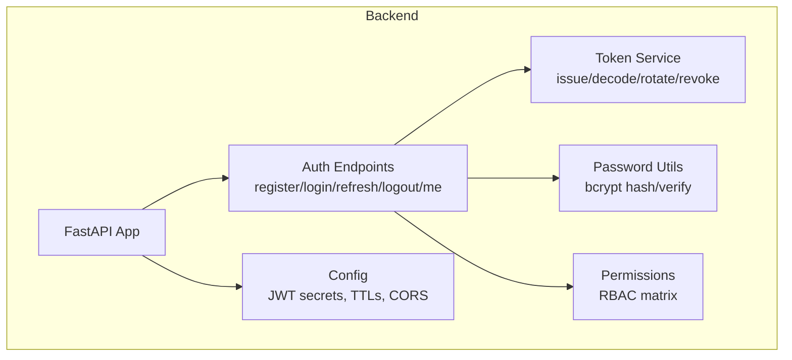
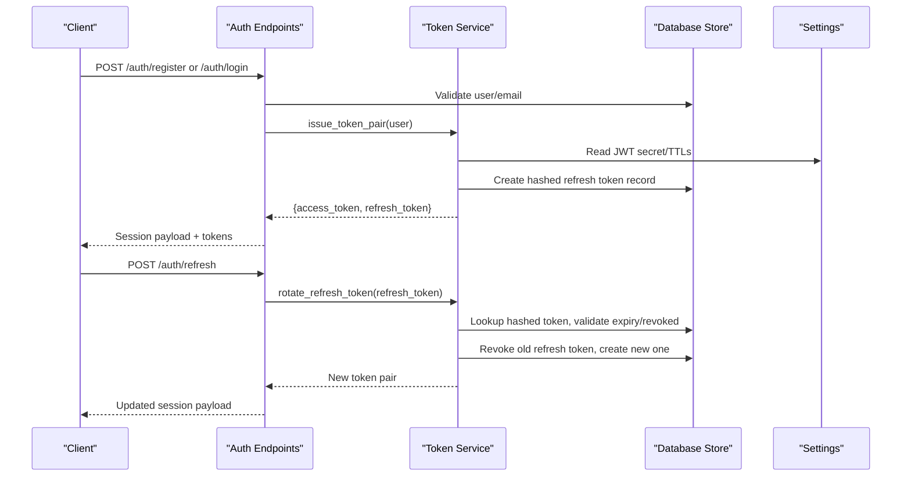
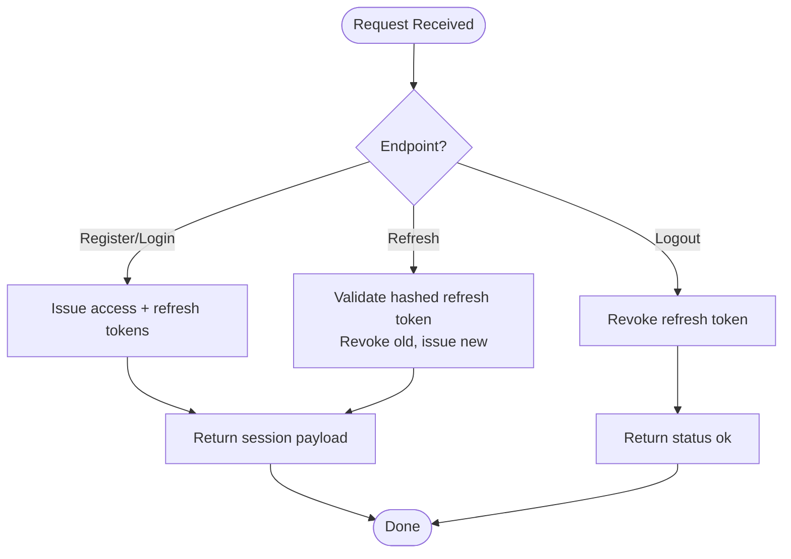
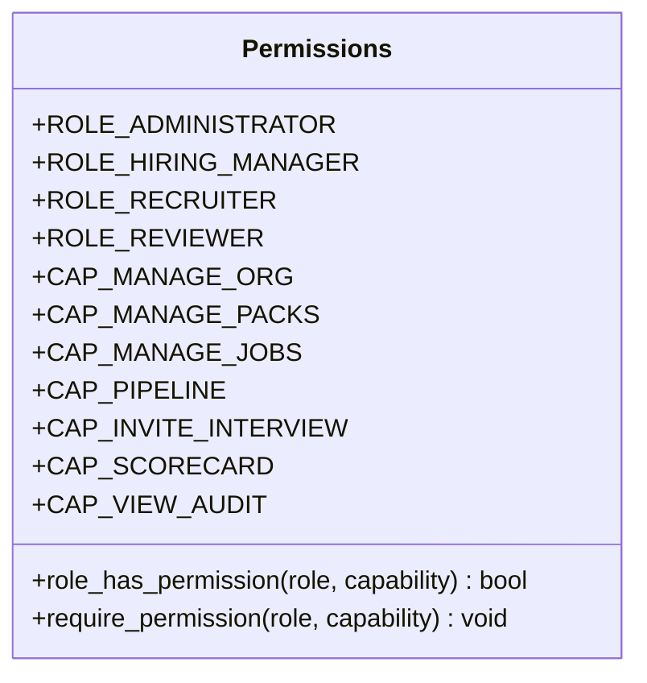
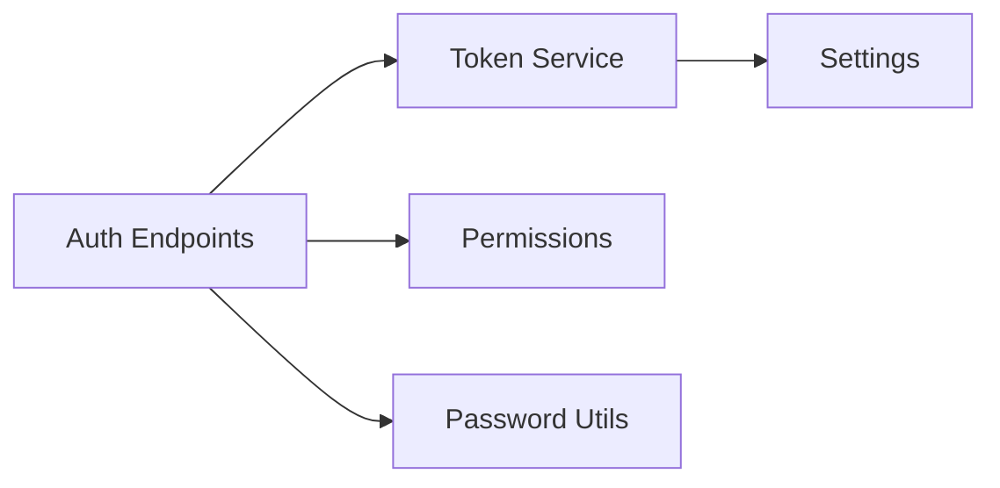

# Security & Authentication

<cite>
**Referenced Files in This Document**
- [Backend/app/api/v1/auth.py](file://Backend/app/api/v1/auth.py)
- [Backend/app/services/auth_tokens.py](file://Backend/app/services/auth_tokens.py)
- [Backend/app/services/passwords.py](file://Backend/app/services/passwords.py)
- [Backend/app/domain/permissions.py](file://Backend/app/domain/permissions.py)
- [Backend/app/core/config.py](file://Backend/app/core/config.py)
- [Backend/app/api/dependencies.py](file://Backend/app/api/dependencies.py)
- [pts/backend/app/utils/jwt.py](file://pts/backend/app/utils/jwt.py)
- [pts/backend/app/utils/security.py](file://pts/backend/app/utils/security.py)
</cite>

## Table of Contents
1. Introduction
2. Project Structure
3. Core Components
4. Architecture Overview
5. Detailed Component Analysis
6. Dependency Analysis
7. Performance Considerations
8. Troubleshooting Guide
9. Conclusion
10. Appendices

## Introduction
This document provides comprehensive security documentation for the ATS system, focusing on authentication, authorization, and data protection. It covers:
- JWT-based authentication flow with token issuance, refresh rotation, and secure storage practices
- Role-based access control (RBAC) patterns for multi-tenant organization isolation and resource permissions
- Input validation, SQL injection prevention, and XSS protection measures
- Secure password handling using bcrypt and password reset workflows
- CORS configuration, CSRF protection, and secure cookie policies
- Security audit procedures, vulnerability scanning, and penetration testing guidelines
- Data encryption strategies for sensitive information at rest and in transit, including PII protection and GDPR considerations

## Project Structure
The ATS backend implements a FastAPI application with modular components for API endpoints, services, domain logic, and configuration. Key security-related areas include:
- Authentication endpoints for register, login, refresh, logout, and current user info
- Token service for issuing short-lived access tokens and managing long-lived refresh tokens
- RBAC definitions and permission checks
- Password hashing utilities
- Configuration for JWT secrets, TTLs, and CORS origins

**Diagram sources**
- [Backend/app/api/v1/auth.py:1-185](file://Backend/app/api/v1/auth.py#L1-L185)
- [Backend/app/services/auth_tokens.py:1-127](file://Backend/app/services/auth_tokens.py#L1-L127)
- [Backend/app/domain/permissions.py:1-64](file://Backend/app/domain/permissions.py#L1-L64)
- [Backend/app/services/passwords.py:1-17](file://Backend/app/services/passwords.py#L1-L17)
- [Backend/app/core/config.py:1-215](file://Backend/app/core/config.py#L1-L215)

**Section sources**
- [Backend/app/api/v1/auth.py:1-185](file://Backend/app/api/v1/auth.py#L1-L185)
- [Backend/app/services/auth_tokens.py:1-127](file://Backend/app/services/auth_tokens.py#L1-L127)
- [Backend/app/domain/permissions.py:1-64](file://Backend/app/domain/permissions.py#L1-L64)
- [Backend/app/services/passwords.py:1-17](file://Backend/app/services/passwords.py#L1-L17)
- [Backend/app/core/config.py:1-215](file://Backend/app/core/config.py#L1-L215)

## Core Components
- Authentication endpoints: Provide register, login, refresh, logout, and current user retrieval with session payloads that include memberships and candidate context.
- Token service: Issues HS256-signed access tokens and opaque refresh tokens; stores hashed refresh tokens; supports rotation and revocation.
- Permissions module: Defines roles and capabilities for employer actions and enforces capability checks.
- Password utilities: Uses bcrypt for secure hashing and verification.
- Configuration: Centralizes JWT secret, TTLs, CORS origins, and environment-specific settings.

**Section sources**
- [Backend/app/api/v1/auth.py:1-185](file://Backend/app/api/v1/auth.py#L1-L185)
- [Backend/app/services/auth_tokens.py:1-127](file://Backend/app/services/auth_tokens.py#L1-L127)
- [Backend/app/domain/permissions.py:1-64](file://Backend/app/domain/permissions.py#L1-L64)
- [Backend/app/services/passwords.py:1-17](file://Backend/app/services/passwords.py#L1-L17)
- [Backend/app/core/config.py:1-215](file://Backend/app/core/config.py#L1-L215)

## Architecture Overview
The authentication architecture uses a hybrid approach:
- Access tokens are JSON Web Tokens (JWT) signed with HS256 and returned in the response body for client use.
- Refresh tokens are opaque, URL-safe strings stored server-side as hashed values to prevent misuse if leaked.
- RBAC is enforced via role-to-capability mapping for multi-tenant organizations.
- Passwords are hashed with bcrypt before storage.
- CORS is configurable per environment with validation to prevent wildcard origins outside development.

**Diagram sources**
- [Backend/app/api/v1/auth.py:74-148](file://Backend/app/api/v1/auth.py#L74-L148)
- [Backend/app/services/auth_tokens.py:67-127](file://Backend/app/services/auth_tokens.py#L67-L127)
- [Backend/app/core/config.py:64-66](file://Backend/app/core/config.py#L64-L66)

## Detailed Component Analysis

### JWT-Based Authentication Flow
- Registration and login create a session payload including user info, memberships, and candidate context.
- Access tokens are short-lived JWTs with HS256 signatures; refresh tokens are opaque and stored hashed.
- Refresh endpoint rotates tokens: validates existing refresh token, issues new pair, revokes old token, and records replacement.
- Logout revokes the provided refresh token.

**Diagram sources**
- [Backend/app/api/v1/auth.py:74-148](file://Backend/app/api/v1/auth.py#L74-L148)
- [Backend/app/services/auth_tokens.py:67-127](file://Backend/app/services/auth_tokens.py#L67-L127)

**Section sources**
- [Backend/app/api/v1/auth.py:74-148](file://Backend/app/api/v1/auth.py#L74-L148)
- [Backend/app/services/auth_tokens.py:67-127](file://Backend/app/services/auth_tokens.py#L67-L127)

### Secure Storage Practices for Tokens
- Access tokens are returned in JSON responses and should be handled by clients securely (e.g., memory-only storage).
- Refresh tokens are stored server-side as SHA-256 hashes; raw values are never persisted.
- Rotation ensures each refresh can be used only once and ties replacements to revoke old tokens.

**Section sources**
- [Backend/app/services/auth_tokens.py:18-86](file://Backend/app/services/auth_tokens.py#L18-L86)
- [Backend/app/services/auth_tokens.py:89-127](file://Backend/app/services/auth_tokens.py#L89-L127)

### Role-Based Access Control (RBAC) for Multi-Tenant Organizations
- Roles: administrator, hiring_manager, recruiter, reviewer.
- Capabilities: manage_org, manage_packs, manage_jobs, pipeline, invite_interview, scorecard, view_audit.
- Permission checks enforce capability requirements based on the user’s role within an organization membership.

**Diagram sources**
- [Backend/app/domain/permissions.py:7-64](file://Backend/app/domain/permissions.py#L7-L64)

**Section sources**
- [Backend/app/domain/permissions.py:7-64](file://Backend/app/domain/permissions.py#L7-L64)

### Input Validation and Sanitization
- Pydantic models enforce email format, length constraints, and pattern matching for registration and login inputs.
- Email normalization (lowercase, trimmed) reduces case-sensitivity issues and improves lookup consistency.
- These validations help mitigate injection risks at the boundary layer.

**Section sources**
- [Backend/app/api/v1/auth.py:19-36](file://Backend/app/api/v1/auth.py#L19-L36)
- [Backend/app/api/v1/auth.py:74-127](file://Backend/app/api/v1/auth.py#L74-L127)

### SQL Injection Prevention
- The codebase uses database abstractions and store functions for queries; ensure parameterized queries are used throughout.
- Avoid string concatenation for SQL; rely on ORM/store methods to construct safe queries.
- Validate and sanitize all inputs prior to passing to database operations.

[No sources needed since this section provides general guidance]

### XSS Protection Measures
- Prefer returning minimal, structured JSON responses without HTML content.
- On the frontend, avoid rendering untrusted data directly into HTML; use safe DOM APIs and templating frameworks.
- Apply Content Security Policy (CSP) headers where applicable to restrict script execution.

[No sources needed since this section provides general guidance]

### Secure Password Handling
- Passwords are hashed using bcrypt with generated salts before storage.
- Verification uses constant-time comparison to prevent timing attacks.
- Ensure passwords meet minimum complexity requirements at the client and server boundaries.

**Section sources**
- [Backend/app/services/passwords.py:6-17](file://Backend/app/services/passwords.py#L6-L17)
- [pts/backend/app/utils/security.py:8-16](file://pts/backend/app/utils/security.py#L8-L16)

### Password Reset Workflow
- Implement a secure workflow that generates time-limited, single-use tokens sent via email.
- Validate token integrity and expiration server-side before allowing password changes.
- Enforce strong password policies and clear any previous sessions upon reset.

[No sources needed since this section provides general guidance]

### CORS Configuration
- CORS origins are configured via settings and validated to disallow wildcard origins outside development.
- Use explicit allowlists for production environments to restrict cross-origin requests.

**Section sources**
- [Backend/app/core/config.py:29-30](file://Backend/app/core/config.py#L29-L30)
- [Backend/app/core/config.py:147-149](file://Backend/app/core/config.py#L147-L149)
- [Backend/app/core/config.py:201-205](file://Backend/app/core/config.py#L201-L205)

### CSRF Protection and Secure Cookie Policies
- If cookies are used for tokens, ensure they are HttpOnly, Secure, and SameSite=Strict/Lax.
- For stateless JWTs in Authorization headers, CSRF is less relevant; however, protect against token theft via XSS.
- Consider implementing CSRF tokens for state-changing endpoints when using session cookies.

[No sources needed since this section provides general guidance]

### Security Audit Procedures
- Regularly review RBAC mappings and ensure least privilege principles are applied.
- Audit token lifecycle: verify rotation, revocation, and expiration enforcement.
- Monitor logs for failed authentication attempts and suspicious activity.

[No sources needed since this section provides general guidance]

### Vulnerability Scanning and Penetration Testing
- Integrate SAST/DAST tools into CI/CD pipelines to detect vulnerabilities early.
- Perform periodic penetration tests focusing on authentication flows, token handling, and input validation.
- Validate CORS, CSP, and cookie configurations across environments.

[No sources needed since this section provides general guidance]

### Data Encryption Strategies
- At rest: Encrypt sensitive fields (e.g., PII) using strong algorithms (AES-GCM) with key management best practices.
- In transit: Enforce TLS for all endpoints and external integrations.
- PII protection: Minimize data collection, apply masking in logs, and ensure retention policies comply with GDPR.

[No sources needed since this section provides general guidance]

## Dependency Analysis
Key dependencies and relationships:
- Auth endpoints depend on token service for issuance and rotation.
- Token service depends on configuration for JWT secrets and TTLs.
- Permissions module defines role-capability mappings used by authorization logic.
- Password utilities provide secure hashing and verification used by auth endpoints.

**Diagram sources**
- [Backend/app/api/v1/auth.py:1-185](file://Backend/app/api/v1/auth.py#L1-L185)
- [Backend/app/services/auth_tokens.py:1-127](file://Backend/app/services/auth_tokens.py#L1-L127)
- [Backend/app/domain/permissions.py:1-64](file://Backend/app/domain/permissions.py#L1-L64)
- [Backend/app/services/passwords.py:1-17](file://Backend/app/services/passwords.py#L1-L17)
- [Backend/app/core/config.py:1-215](file://Backend/app/core/config.py#L1-L215)

**Section sources**
- [Backend/app/api/v1/auth.py:1-185](file://Backend/app/api/v1/auth.py#L1-L185)
- [Backend/app/services/auth_tokens.py:1-127](file://Backend/app/services/auth_tokens.py#L1-L127)
- [Backend/app/domain/permissions.py:1-64](file://Backend/app/domain/permissions.py#L1-L64)
- [Backend/app/services/passwords.py:1-17](file://Backend/app/services/passwords.py#L1-L17)
- [Backend/app/core/config.py:1-215](file://Backend/app/core/config.py#L1-L215)

## Performance Considerations
- Keep access tokens short-lived to reduce exposure window.
- Use efficient hashing parameters for bcrypt balancing security and performance.
- Cache frequently accessed role-permission checks where appropriate.
- Optimize database queries for membership lookups during session creation.

[No sources needed since this section provides general guidance]

## Troubleshooting Guide
Common issues and resolutions:
- Invalid or expired access token: Ensure client sends valid bearer token; handle refresh flow when expired.
- Invalid refresh token: Verify token exists, not revoked, and not expired; rotate on successful refresh.
- Account disabled: Check user status before issuing tokens; inform client to contact support.
- CORS errors: Confirm allowed origins match client domains; avoid wildcards in production.

**Section sources**
- [Backend/app/services/auth_tokens.py:39-64](file://Backend/app/services/auth_tokens.py#L39-L64)
- [Backend/app/services/auth_tokens.py:89-127](file://Backend/app/services/auth_tokens.py#L89-L127)
- [Backend/app/api/v1/auth.py:104-148](file://Backend/app/api/v1/auth.py#L104-L148)
- [Backend/app/core/config.py:201-205](file://Backend/app/core/config.py#L201-L205)

## Conclusion
The ATS system employs a robust security model combining JWT-based authentication, secure refresh token rotation, RBAC for multi-tenant isolation, and strong password hashing. Input validation and configurable CORS enhance boundary security. To maintain resilience, implement continuous auditing, scanning, and testing, along with encryption for sensitive data and compliance with privacy regulations.

## Appendices

### Appendix A: PTS Backend JWT Utilities Reference
The PTS backend includes additional JWT utilities demonstrating alternative implementations for token creation, decoding, and dependency injection.

**Section sources**
- [pts/backend/app/utils/jwt.py:1-119](file://pts/backend/app/utils/jwt.py#L1-L119)
- [pts/backend/app/utils/security.py:1-16](file://pts/backend/app/utils/security.py#L1-L16)