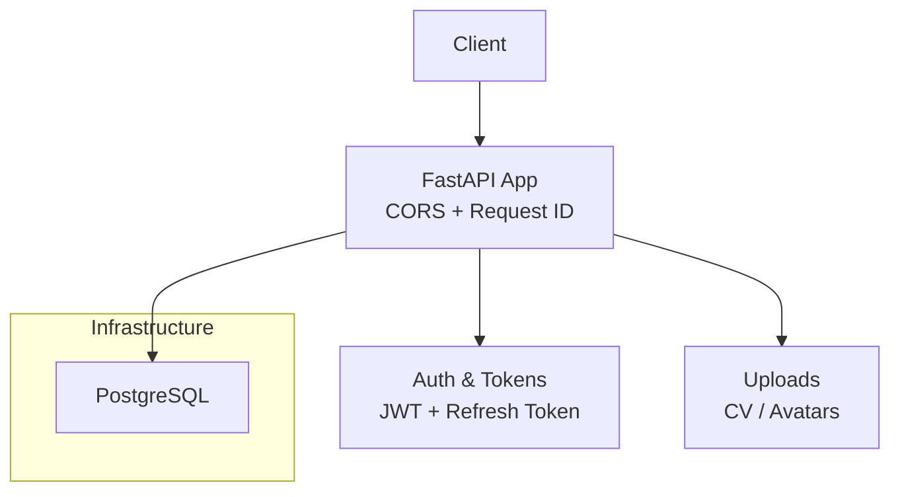
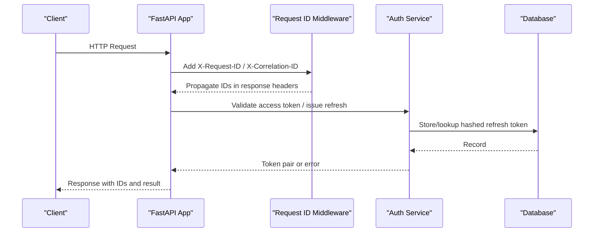
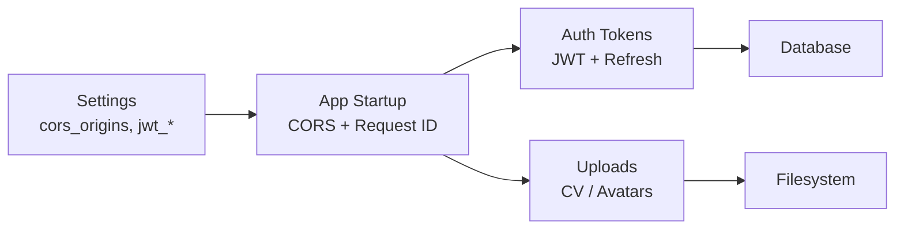

# Security Best Practices

<cite>
**Referenced Files in This Document**
- [Backend/app/main.py](file://Backend/app/main.py)
- [Backend/app/core/config.py](file://Backend/app/core/config.py)
- [Backend/app/middleware/request_id.py](file://Backend/app/middleware/request_id.py)
- [Backend/app/services/auth_tokens.py](file://Backend/app/services/auth_tokens.py)
- [Backend/app/services/passwords.py](file://Backend/app/services/passwords.py)
- [Backend/app/services/avatars.py](file://Backend/app/services/avatars.py)
- [Backend/app/services/cv_extract.py](file://Backend/app/services/cv_extract.py)
- [Backend/tests/test_request_id.py](file://Backend/tests/test_request_id.py)
- [pts/backend/app/api/middleware/cors.py](file://pts/backend/app/api/middleware/cors.py)
- [pts/backend/app/utils/jwt.py](file://pts/backend/app/utils/jwt.py)
- [pts/backend/app/api/middleware/error_handling.py](file://pts/backend/app/api/middleware/error_handling.py)
- [infrastructure/local/docker-compose.yml](file://infrastructure/local/docker-compose.yml)
- [architecture.md](file://architecture.md)
- [rules.md](file://rules.md)
- [Backend/README.md](file://Backend/README.md)
</cite>

## Table of Contents
1. Introduction
2. Project Structure
3. Core Components
4. Architecture Overview
5. Detailed Component Analysis
6. Dependency Analysis
7. Performance Considerations
8. Troubleshooting Guide
9. Conclusion
10. Appendices

## Introduction
This document provides a comprehensive security best practices guide tailored to the repository’s backend and supporting components. It covers secure coding practices, dependency vulnerability scanning, and security testing procedures. It also explains CORS configuration, CSRF protection considerations, secure cookie policies, security headers, rate limiting and DDoS protections, incident response procedures, security audit guidelines, penetration testing recommendations, container and infrastructure hardening, and a practical security checklist across development, deployment, and maintenance phases.

## Project Structure
The project includes:
- Backend (FastAPI): API server with middleware for CORS, request IDs, error handling, JWT-based auth, and secure file uploads.
- PTS backend (reference implementation): additional middleware and utilities for CORS, JWT, and error handling.
- Infrastructure: Docker Compose for local PostgreSQL.
- Documentation: architecture and rules that define security constraints and tenancy enforcement.

**Diagram sources**
- [Backend/app/main.py:38-58](file://Backend/app/main.py#L38-L58)
- [Backend/app/middleware/request_id.py:38-54](file://Backend/app/middleware/request_id.py#L38-L54)
- [Backend/app/services/auth_tokens.py:22-86](file://Backend/app/services/auth_tokens.py#L22-L86)
- [Backend/app/services/cv_extract.py:70-151](file://Backend/app/services/cv_extract.py#L70-L151)
- [Backend/app/services/avatars.py:30-88](file://Backend/app/services/avatars.py#L30-L88)
- [infrastructure/local/docker-compose.yml:4-20](file://infrastructure/local/docker-compose.yml#L4-L20)

**Section sources**
- [Backend/app/main.py:38-58](file://Backend/app/main.py#L38-L58)
- [Backend/app/core/config.py:16-70](file://Backend/app/core/config.py#L16-L70)
- [Backend/app/middleware/request_id.py:38-54](file://Backend/app/middleware/request_id.py#L38-L54)
- [infrastructure/local/docker-compose.yml:4-20](file://infrastructure/local/docker-compose.yml#L4-L20)

## Core Components
- Authentication and session management:
  - Access tokens are short-lived signed JWTs; refresh tokens are opaque and hashed at rest. Rotation is enforced on refresh.
  - Passwords are hashed with bcrypt.
- CORS and request context:
  - CORS is configured via settings; request and correlation IDs are propagated and sanitized.
- Secure uploads:
  - CV and avatar uploads enforce size limits, allowed types, and path traversal protection.
- Configuration validation:
  - Settings validate TTLs and reject insecure defaults or wildcard CORS outside development.

**Section sources**
- [Backend/app/services/auth_tokens.py:22-117](file://Backend/app/services/auth_tokens.py#L22-L117)
- [Backend/app/services/passwords.py:1-17](file://Backend/app/services/passwords.py#L1-L17)
- [Backend/app/core/config.py:16-70](file://Backend/app/core/config.py#L16-L70)
- [Backend/app/core/config.py:187-205](file://Backend/app/core/config.py#L187-L205)
- [Backend/app/services/cv_extract.py:70-151](file://Backend/app/services/cv_extract.py#L70-L151)
- [Backend/app/services/avatars.py:30-88](file://Backend/app/services/avatars.py#L30-L88)

## Architecture Overview
The FastAPI application registers CORS middleware and a request context middleware that injects and propagates request and correlation IDs. Authentication uses JWT access tokens plus hashed refresh tokens stored in the database. File uploads are validated and persisted securely. Local infrastructure runs Postgres via Docker Compose.

**Diagram sources**
- [Backend/app/main.py:38-58](file://Backend/app/main.py#L38-L58)
- [Backend/app/middleware/request_id.py:38-54](file://Backend/app/middleware/request_id.py#L38-L54)
- [Backend/app/services/auth_tokens.py:67-117](file://Backend/app/services/auth_tokens.py#L67-L117)

## Detailed Component Analysis

### CORS Configuration
- The Backend configures CORS with an allowlist from settings and restricts methods and headers explicitly. Wildcard origins are rejected outside development by configuration validation.
- The PTS reference backend also sets up CORS using settings-driven origins.

Recommendations:
- Keep CORS origin lists explicit per environment.
- Avoid wildcard origins in production.
- Limit allowed headers to only what is required.

**Section sources**
- [Backend/app/main.py:38-48](file://Backend/app/main.py#L38-L48)
- [Backend/app/core/config.py:16-31](file://Backend/app/core/config.py#L16-L31)
- [Backend/app/core/config.py:201-205](file://Backend/app/core/config.py#L201-L205)
- [pts/backend/app/api/middleware/cors.py:11-19](file://pts/backend/app/api/middleware/cors.py#L11-L19)

### CSRF Protection
- The Backend returns JSON responses and uses Bearer tokens for authorization. CSRF typically applies to state-changing requests when cookies are used for authentication.
- If you introduce cookie-based sessions, add CSRF protection for state-changing endpoints. For current Bearer-token flows, ensure no cross-site credential leakage and rely on same-origin policy.

Guidance:
- Prefer Bearer tokens over cookies for APIs consumed by SPAs.
- If cookies are used, implement CSRF tokens for mutating endpoints.

[No sources needed since this section provides general guidance based on observed patterns]

### Secure Cookie Policies
- The PTS reference backend sets HttpOnly, Secure (except dev), SameSite=Lax in dev and None in prod, and appropriate max age and path for refresh tokens.
- Ensure cookies are not accessible to client scripts (HttpOnly), sent only over HTTPS in production (Secure), and scoped appropriately (SameSite).

**Section sources**
- [pts/backend/app/api/endpoints/auth.py:32-62](file://pts/backend/app/api/endpoints/auth.py#L32-L62)

### Security Headers and Request Correlation
- Request and correlation IDs are injected into responses and sanitized to UUIDs to avoid leaking sensitive data.
- Tests verify propagation and replacement behavior.

Best practices:
- Always propagate request IDs for tracing.
- Sanitize incoming identifiers to prevent injection of sensitive data into logs.

**Section sources**
- [Backend/app/middleware/request_id.py:38-54](file://Backend/app/middleware/request_id.py#L38-L54)
- [Backend/tests/test_request_id.py:6-24](file://Backend/tests/test_request_id.py#L6-L24)

### Rate Limiting and DDoS Protection
- Not implemented in the codebase. Apply rate limiting at the API gateway or reverse proxy layer (e.g., Nginx, Cloudflare, API gateway).
- Use connection limits, timeouts, and WAF rules to mitigate DDoS and abuse.

[No sources needed since this section provides general guidance]

### Input Validation and Secure Uploads
- CV extraction enforces size limits, allowed extensions/content types, rejects legacy formats, and normalizes text.
- Avatar storage validates content type, size, prevents path traversal, and cleans up old files.

Recommendations:
- Continue enforcing strict allowlists for file types and sizes.
- Scan uploaded content for malware before storing or processing.
- Serve static assets through a CDN or web server with strict caching and security headers.

**Section sources**
- [Backend/app/services/cv_extract.py:70-151](file://Backend/app/services/cv_extract.py#L70-L151)
- [Backend/app/services/avatars.py:30-88](file://Backend/app/services/avatars.py#L30-L88)

### Authentication and Session Management
- Access tokens are short-lived signed JWTs; refresh tokens are opaque and hashed at rest. Rotation occurs on refresh, and expired or revoked tokens are rejected.
- Passwords are hashed with bcrypt.

Recommendations:
- Enforce minimum secret key length and rotate secrets regularly.
- Revoke refresh tokens on logout and suspicious activity.
- Monitor token issuance and failures.

**Section sources**
- [Backend/app/services/auth_tokens.py:22-117](file://Backend/app/services/auth_tokens.py#L22-L117)
- [Backend/app/services/passwords.py:1-17](file://Backend/app/services/passwords.py#L1-L17)
- [pts/backend/app/utils/jwt.py:20-29](file://pts/backend/app/utils/jwt.py#L20-L29)

### Error Handling and Logging
- Global exception handler returns generic 500 JSON and logs unhandled exceptions.
- Errors include structured codes and messages; request IDs help correlate logs.

Recommendations:
- Avoid leaking stack traces or internal details to clients.
- Centralize logging with structured fields (request_id, correlation_id).
- Implement alerting on repeated errors.

**Section sources**
- [pts/backend/app/api/middleware/error_handling.py:11-19](file://pts/backend/app/api/middleware/error_handling.py#L11-L19)

### Tenancy, RBAC, and Audit
- Tenant context is mandatory and enforced at multiple boundaries. Role-based access control is applied server-side.
- Append-only audit records capture permissions, configuration changes, decisions, and exports.

Recommendations:
- Enforce tenant isolation in all queries and external calls.
- Review audit logs regularly and integrate with SIEM.

**Section sources**
- [architecture.md:253-261](file://architecture.md#L253-L261)

### Secrets and Configuration Hardening
- Settings validate TTLs and reject insecure defaults or wildcard CORS outside development.
- Environment variables and .env files must not be committed; use secret managers in production.

Recommendations:
- Use strong, unique secrets per environment.
- Rotate secrets periodically and limit access.

**Section sources**
- [Backend/app/core/config.py:187-205](file://Backend/app/core/config.py#L187-L205)
- [Backend/README.md:42-54](file://Backend/README.md#L42-L54)

### Container and Infrastructure Hardening
- Local Postgres is defined with minimal privileges and health checks.
- In production, run containers as non-root, read-only filesystems where possible, and prune unused images.

Recommendations:
- Use image scanning and SBOM generation.
- Restrict network egress and apply least privilege to service accounts.

**Section sources**
- [infrastructure/local/docker-compose.yml:4-20](file://infrastructure/local/docker-compose.yml#L4-L20)

## Dependency Analysis

**Diagram sources**
- [Backend/app/core/config.py:16-70](file://Backend/app/core/config.py#L16-L70)
- [Backend/app/main.py:38-58](file://Backend/app/main.py#L38-L58)
- [Backend/app/services/auth_tokens.py:22-117](file://Backend/app/services/auth_tokens.py#L22-L117)
- [Backend/app/services/cv_extract.py:70-151](file://Backend/app/services/cv_extract.py#L70-L151)
- [Backend/app/services/avatars.py:30-88](file://Backend/app/services/avatars.py#L30-L88)

**Section sources**
- [Backend/app/core/config.py:16-70](file://Backend/app/core/config.py#L16-L70)
- [Backend/app/main.py:38-58](file://Backend/app/main.py#L38-L58)

## Performance Considerations
- Keep JWT access TTLs short to reduce exposure window.
- Limit upload sizes and process asynchronously where possible.
- Use connection pooling and query optimization for database operations.
- Cache frequently accessed, non-sensitive data with appropriate invalidation.

[No sources needed since this section provides general guidance]

## Troubleshooting Guide
- If CORS blocks requests, verify origin lists and credentials settings.
- If token refresh fails, check expiration, revocation status, and hashing consistency.
- If uploads fail, confirm allowed types, sizes, and path traversal protections.
- Use request and correlation IDs to trace issues across services.

**Section sources**
- [Backend/app/core/config.py:201-205](file://Backend/app/core/config.py#L201-L205)
- [Backend/app/services/auth_tokens.py:67-117](file://Backend/app/services/auth_tokens.py#L67-L117)
- [Backend/app/services/cv_extract.py:70-151](file://Backend/app/services/cv_extract.py#L70-L151)
- [Backend/app/middleware/request_id.py:38-54](file://Backend/app/middleware/request_id.py#L38-L54)

## Conclusion
The codebase implements solid foundational security measures: explicit CORS, secure cookie handling in the reference backend, robust input validation for uploads, JWT-based authentication with hashed refresh tokens, and request correlation for observability. Strengthen further by adding rate limiting, CSRF protection where applicable, centralized security headers, and hardened container and infrastructure practices. Integrate automated dependency scanning, security testing, and continuous auditing to maintain a strong security posture.

[No sources needed since this section summarizes without analyzing specific files]

## Appendices

### Security Checklist

Development
- [ ] Enforce explicit CORS origin lists per environment; reject wildcards outside development.
- [ ] Use strong, unique secrets; never commit .env files.
- [ ] Validate all inputs; enforce allowlists for file types and sizes.
- [ ] Hash passwords with bcrypt; store refresh tokens hashed.
- [ ] Propagate request and correlation IDs; sanitize inputs to UUIDs.
- [ ] Run unit tests and linting; include security-focused tests.

Deployment
- [ ] Configure HTTPS and secure cookies (HttpOnly, Secure, SameSite).
- [ ] Set security headers (HSTS, CSP, X-Frame-Options, Referrer-Policy).
- [ ] Enable rate limiting and DDoS protection at the gateway/WAF.
- [ ] Harden containers: non-root users, read-only filesystems, minimal base images.
- [ ] Scan dependencies and container images; generate SBOM.
- [ ] Centralize logging with structured fields and alerting.

Maintenance
- [ ] Rotate secrets and tokens regularly; revoke compromised refresh tokens.
- [ ] Review audit logs and access patterns; investigate anomalies.
- [ ] Patch dependencies and update base images promptly.
- [ ] Conduct periodic penetration tests and red team exercises.
- [ ] Update CORS and security policies as applications evolve.

[No sources needed since this section provides general guidance]