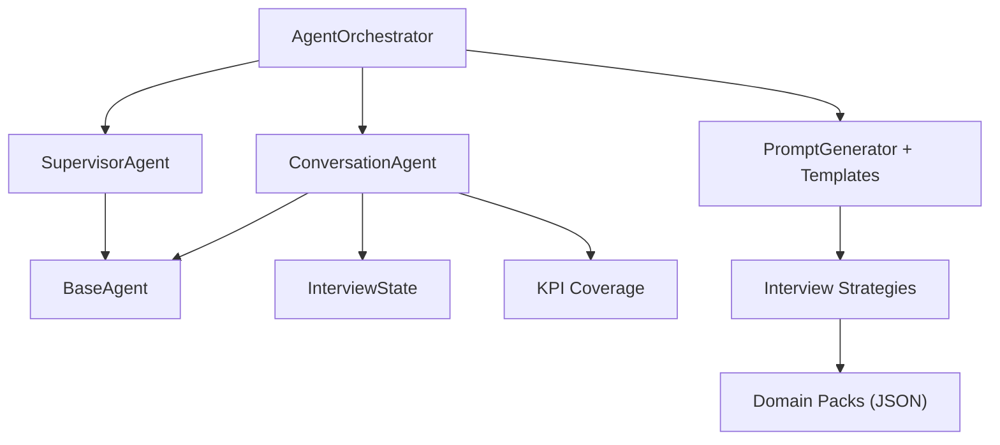
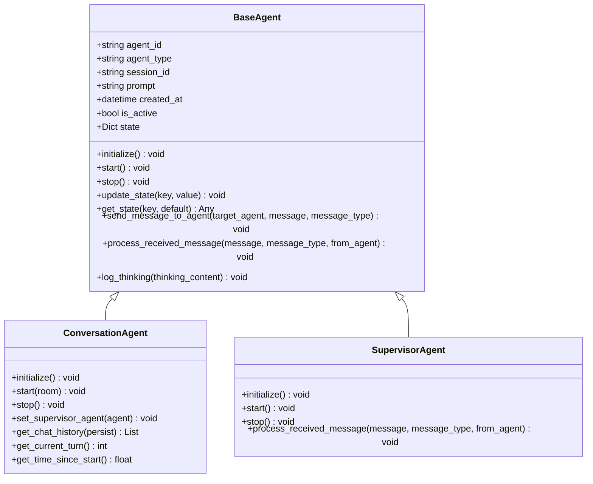
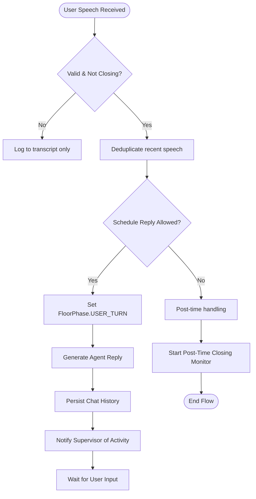
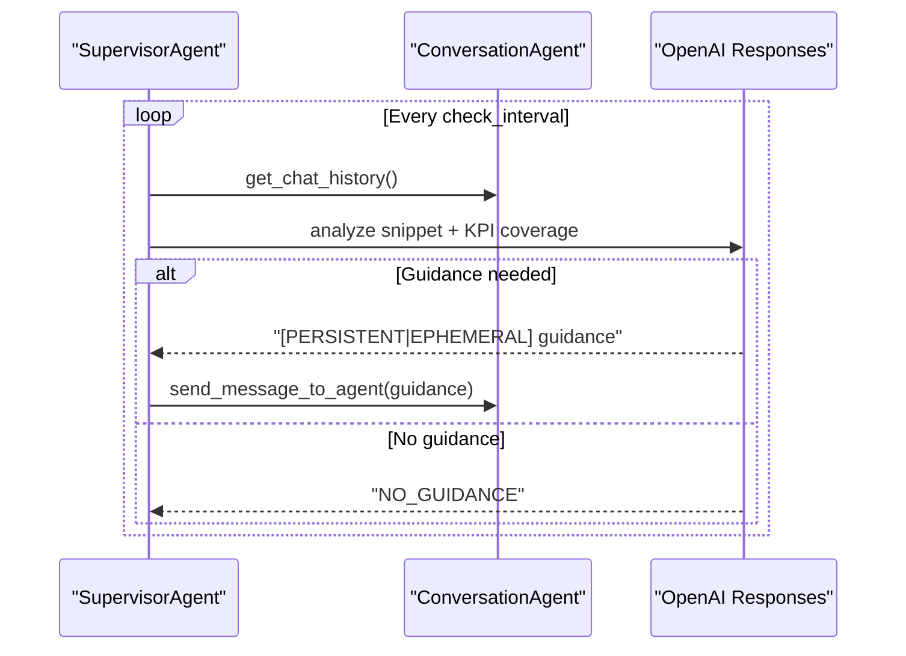
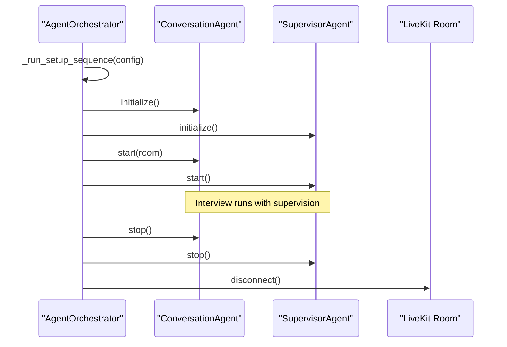
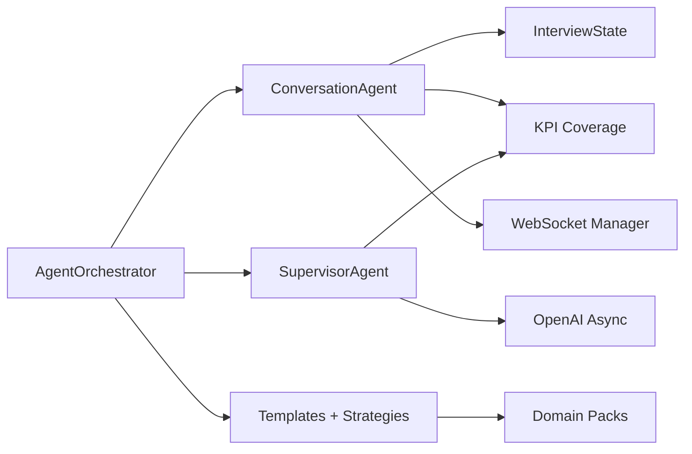

# AI Agent Orchestration Architecture

<cite>
**Referenced Files in This Document**
- [base.py](file://Backend/app/ai/agents/base.py)
- [conversation.py](file://Backend/app/ai/agents/conversation.py)
- [supervisor.py](file://Backend/app/ai/agents/supervisor.py)
- [agent_orchestrator.py](file://Backend/app/ai/services/agent_orchestrator.py)
- [templates.py](file://Backend/app/ai/prompts/templates.py)
- [interview_strategies.py](file://Backend/app/ai/prompts/interview_strategies.py)
- [manifest.json](file://domain-packs/software-engineering/manifest.json)
- [interview_state.py](file://Backend/app/ai/utils/interview_state.py)
- [kpi_coverage.py](file://Backend/app/ai/utils/kpi_coverage.py)
</cite>

## Table of Contents
1. [Introduction](#introduction)
2. [Project Structure](#project-structure)
3. [Core Components](#core-components)
4. [Architecture Overview](#architecture-overview)
5. [Detailed Component Analysis](#detailed-component-analysis)
6. [Dependency Analysis](#dependency-analysis)
7. [Performance Considerations](#performance-considerations)
8. [Troubleshooting Guide](#troubleshooting-guide)
9. [Conclusion](#conclusion)

## Introduction
This document explains the AI agent orchestration architecture used to run real-time, voice-enabled interviews. It covers:
- The base agent class and inheritance hierarchy
- Conversation management for maintaining interview context
- Supervisor coordination that guides multiple agents during interviews
- Full agent lifecycle from initialization through execution to cleanup
- Prompt engineering patterns and how domain packs provide contextual intelligence
- Error handling strategies, state management, and performance optimization techniques

## Project Structure
The AI subsystem is organized into focused modules:
- Agents: BaseAgent (abstract), ConversationAgent (interviewer), SupervisorAgent (orchestrator/guide)
- Services: AgentOrchestrator (session lifecycle, LiveKit room, WebSocket events)
- Prompts: Templates and strategy generators for persona and supervisor behavior
- Utils: InterviewState (time and phase tracking), KPI coverage utilities
- Domain Packs: JSON manifests defining skills, questions, and evaluation rubrics per domain



**Diagram sources**
- [agent_orchestrator.py:29-182](file://Backend/app/ai/services/agent_orchestrator.py#L29-L182)
- [conversation.py:1264-1475](file://Backend/app/ai/agents/conversation.py#L1264-L1475)
- [supervisor.py:20-75](file://Backend/app/ai/agents/supervisor.py#L20-L75)
- [base.py:14-85](file://Backend/app/ai/agents/base.py#L14-L85)
- [interview_state.py:22-101](file://Backend/app/ai/utils/interview_state.py#L22-L101)
- [kpi_coverage.py:9-68](file://Backend/app/ai/utils/kpi_coverage.py#L9-L68)
- [templates.py:7-252](file://Backend/app/ai/prompts/templates.py#L7-L252)
- [interview_strategies.py:18-118](file://Backend/app/ai/prompts/interview_strategies.py#L18-L118)
- [manifest.json:1-140](file://domain-packs/software-engineering/manifest.json#L1-L140)

**Section sources**
- [agent_orchestrator.py:29-182](file://Backend/app/ai/services/agent_orchestrator.py#L29-L182)
- [conversation.py:1264-1475](file://Backend/app/ai/agents/conversation.py#L1264-L1475)
- [supervisor.py:20-75](file://Backend/app/ai/agents/supervisor.py#L20-L75)
- [base.py:14-85](file://Backend/app/ai/agents/base.py#L14-L85)
- [interview_state.py:22-101](file://Backend/app/ai/utils/interview_state.py#L22-L101)
- [kpi_coverage.py:9-68](file://Backend/app/ai/utils/kpi_coverage.py#L9-L68)
- [templates.py:7-252](file://Backend/app/ai/prompts/templates.py#L7-L252)
- [interview_strategies.py:18-118](file://Backend/app/ai/prompts/interview_strategies.py#L18-L118)
- [manifest.json:1-140](file://domain-packs/software-engineering/manifest.json#L1-L140)

## Core Components
- BaseAgent: Abstract foundation with lifecycle hooks (initialize/start/stop), messaging, and shared state helpers.
- ConversationAgent: Real-time interviewer using LiveKit and OpenAI Realtime; manages floor control, transcript capture, turn scheduling, end-interview flow, and integration with WebSocket UI.
- SupervisorAgent: LLM-driven guide that periodically analyzes conversation snippets and sends targeted guidance to keep the interview on track, cover KPIs, and manage timing.
- AgentOrchestrator: Session manager that generates prompts, connects to LiveKit, instantiates agents, wires them together, and handles setup/teardown and post-interview tasks.
- InterviewState: Centralized time and phase tracker (turns, grace periods, wrap-up, timers).
- KPI Coverage: Extracts KPI names and tracks coverage to enforce balanced questioning.
- Prompt Templates and Strategies: System prompts for both agents plus strategy templates that tailor behavior by interview type and domain packs.

**Section sources**
- [base.py:14-85](file://Backend/app/ai/agents/base.py#L14-L85)
- [conversation.py:1264-1475](file://Backend/app/ai/agents/conversation.py#L1264-L1475)
- [supervisor.py:20-75](file://Backend/app/ai/agents/supervisor.py#L20-L75)
- [agent_orchestrator.py:29-182](file://Backend/app/ai/services/agent_orchestrator.py#L29-L182)
- [interview_state.py:22-101](file://Backend/app/ai/utils/interview_state.py#L22-L101)
- [kpi_coverage.py:9-68](file://Backend/app/ai/utils/kpi_coverage.py#L9-L68)
- [templates.py:7-252](file://Backend/app/ai/prompts/templates.py#L7-L252)
- [interview_strategies.py:18-118](file://Backend/app/ai/prompts/interview_strategies.py#L18-L118)

## Architecture Overview
At runtime, the orchestrator creates a LiveKit room, builds prompts from templates and domain packs, and starts two agents:
- ConversationAgent conducts the interview via OpenAI Realtime and LiveKit, capturing transcripts and driving TTS.
- SupervisorAgent runs background loops to analyze recent transcript snippets and send guidance messages to steer the ConversationAgent.

```mermaid
sequenceDiagram
participant Client as "Client"
participant Orchestrator as "AgentOrchestrator"
participant Room as "LiveKit Room"
participant Conv as "ConversationAgent"
participant Supv as "SupervisorAgent"
participant LLM as "OpenAI Realtime"
Client->>Orchestrator : start_interview(config)
Orchestrator->>Orchestrator : generate prompts (templates + strategies + packs)
Orchestrator->>Room : connect and join
Orchestrator->>Conv : initialize()
Orchestrator->>Supv : initialize()
Orchestrator->>Conv : start(room)
Orchestrator->>Supv : start()
Note over Conv,LLM : Realtime session begins; transcripts captured
loop Supervision
Supv->>Conv : get_chat_history()
Supv->>LLM : analyze snippet + KPI coverage
LLM-->>Supv : guidance or NO_GUIDANCE
Supv->>Conv : send_message_to_agent(guidance)
end
Client-->>Orchestrator : stop_interview()
Orchestrator->>Conv : stop()
Orchestrator->>Supv : stop()
Orchestrator->>Room : disconnect
```

**Diagram sources**
- [agent_orchestrator.py:42-182](file://Backend/app/ai/services/agent_orchestrator.py#L42-L182)
- [conversation.py:1264-1475](file://Backend/app/ai/agents/conversation.py#L1264-L1475)
- [supervisor.py:61-149](file://Backend/app/ai/agents/supervisor.py#L61-L149)
- [supervisor.py:151-268](file://Backend/app/ai/agents/supervisor.py#L151-L268)

## Detailed Component Analysis

### Base Agent Class and Inheritance Hierarchy
- BaseAgent defines abstract lifecycle methods (initialize, start, stop), message passing, and simple state storage.
- Both ConversationAgent and SupervisorAgent inherit from BaseAgent and implement lifecycle and messaging.



**Diagram sources**
- [base.py:14-85](file://Backend/app/ai/agents/base.py#L14-L85)
- [conversation.py:1264-1475](file://Backend/app/ai/agents/conversation.py#L1264-L1475)
- [supervisor.py:20-75](file://Backend/app/ai/agents/supervisor.py#L20-L75)

**Section sources**
- [base.py:14-85](file://Backend/app/ai/agents/base.py#L14-L85)
- [conversation.py:1264-1475](file://Backend/app/ai/agents/conversation.py#L1264-L1475)
- [supervisor.py:20-75](file://Backend/app/ai/agents/supervisor.py#L20-L75)

### Conversation Management Patterns
- Transcript capture: InterviewAssistant callbacks append user and assistant turns to chat history and persist incrementally.
- Floor control: A single owner model prevents competing schedulers; phases include LISTENING, USER_TURN, AGENT_TURN, SCRIPTED, CLOSING, DONE.
- Turn scheduling: User speech triggers debounced reply scheduling; agent responses update state and notify supervisor.
- End-interview flow: Tools request confirmation when candidate asks to end; time-based endings bypass confirmation and trigger closing.



**Diagram sources**
- [conversation.py:312-574](file://Backend/app/ai/agents/conversation.py#L312-L574)
- [conversation.py:891-1200](file://Backend/app/ai/agents/conversation.py#L891-L1200)
- [conversation.py:1757-1841](file://Backend/app/ai/agents/conversation.py#L1757-L1841)

**Section sources**
- [conversation.py:312-574](file://Backend/app/ai/agents/conversation.py#L312-L574)
- [conversation.py:891-1200](file://Backend/app/ai/agents/conversation.py#L891-L1200)
- [conversation.py:1757-1841](file://Backend/app/ai/agents/conversation.py#L1757-L1841)

### Supervisor Coordination Mechanism
- Periodic supervision loop reads recent transcript entries and calls an LLM to produce guidance.
- Guidance can be persistent or ephemeral and is sent to the ConversationAgent via BaseAgent messaging.
- Timing assistance ensures questioning ends at scheduled time and transitions to graceful closing.



**Diagram sources**
- [supervisor.py:137-268](file://Backend/app/ai/agents/supervisor.py#L137-L268)
- [supervisor.py:270-331](file://Backend/app/ai/agents/supervisor.py#L270-L331)
- [supervisor.py:439-456](file://Backend/app/ai/agents/supervisor.py#L439-L456)

**Section sources**
- [supervisor.py:137-268](file://Backend/app/ai/agents/supervisor.py#L137-L268)
- [supervisor.py:270-331](file://Backend/app/ai/agents/supervisor.py#L270-L331)
- [supervisor.py:439-456](file://Backend/app/ai/agents/supervisor.py#L439-L456)

### Agent Lifecycle: Initialization Through Cleanup
- Initialization:
  - AgentOrchestrator generates prompts, connects to LiveKit, creates ConversationAgent and SupervisorAgent, links them, initializes, and starts them.
- Execution:
  - ConversationAgent runs Realtime sessions, captures transcripts, schedules replies, and manages floor.
  - SupervisorAgent runs periodic checks and timing assistance.
- Cleanup:
  - Stop agents, cancel tasks, close HTTP clients, disconnect room, and trigger post-interview rating generation.



**Diagram sources**
- [agent_orchestrator.py:77-182](file://Backend/app/ai/services/agent_orchestrator.py#L77-L182)
- [agent_orchestrator.py:244-280](file://Backend/app/ai/services/agent_orchestrator.py#L244-L280)
- [supervisor.py:61-119](file://Backend/app/ai/agents/supervisor.py#L61-L119)

**Section sources**
- [agent_orchestrator.py:77-182](file://Backend/app/ai/services/agent_orchestrator.py#L77-L182)
- [agent_orchestrator.py:244-280](file://Backend/app/ai/services/agent_orchestrator.py#L244-L280)
- [supervisor.py:61-119](file://Backend/app/ai/agents/supervisor.py#L61-L119)

### Prompt Engineering Patterns and Domain Packs
- Templates:
  - ConversationAgent template enforces role, scope, language, difficulty, dual-axis coverage (evaluation themes and KPIs), and strict constraints.
  - SupervisorAgent template defines responsibilities for flow, timing, quality assurance, and configuration adherence.
- Strategies:
  - Strategy functions return tailored instructions for Profile Screening vs Job Interviews, including evidence sources and dynamic question plans.
- Domain Packs:
  - JSON manifests define skills, concepts, question pools, and evaluation rubrics per domain (e.g., software engineering), which inform prompt generation and KPI coverage.

Concrete examples from code:
- Templates inject evaluation focus, KPI lists, CV sections, and language locks into system prompts.
- Strategies select Persona style and interview focus based on interview type.
- Domain pack manifest provides structured competencies and scenario questions that feed into planning and coverage.

**Section sources**
- [templates.py:7-252](file://Backend/app/ai/prompts/templates.py#L7-L252)
- [templates.py:254-381](file://Backend/app/ai/prompts/templates.py#L254-L381)
- [interview_strategies.py:18-118](file://Backend/app/ai/prompts/interview_strategies.py#L18-L118)
- [manifest.json:1-140](file://domain-packs/software-engineering/manifest.json#L1-L140)

### Error Handling Strategies
- Robust try/except blocks around LLM calls, WebSocket messaging, and task cancellation ensure failures are logged and do not crash sessions.
- Supervisor gracefully skips guidance during active speech or wrap-up phases and includes fallback logic to force wrap-up if time is up without a clean closing flow.
- ConversationAgent guards against duplicate transcripts, echo artifacts, and ghost speaking states; it also handles realtime transport errors and recovery attempts.

**Section sources**
- [supervisor.py:151-268](file://Backend/app/ai/agents/supervisor.py#L151-L268)
- [conversation.py:312-574](file://Backend/app/ai/agents/conversation.py#L312-L574)
- [conversation.py:1607-1644](file://Backend/app/ai/agents/conversation.py#L1607-L1644)

### State Management
- InterviewState centralizes phase transitions, timer control, grace periods, and end-interview confirmation flows.
- KPI coverage utilities extract KPI names and compute covered/uncovered sets to drive anti-repeat and coverage guards injected into agent prompts.

**Section sources**
- [interview_state.py:22-101](file://Backend/app/ai/utils/interview_state.py#L22-L101)
- [interview_state.py:108-186](file://Backend/app/ai/utils/interview_state.py#L108-L186)
- [interview_state.py:188-272](file://Backend/app/ai/utils/interview_state.py#L188-L272)
- [kpi_coverage.py:9-68](file://Backend/app/ai/utils/kpi_coverage.py#L9-L68)
- [kpi_coverage.py:101-169](file://Backend/app/ai/utils/kpi_coverage.py#L101-L169)

## Dependency Analysis
Key dependencies and relationships:
- AgentOrchestrator depends on PromptGenerator, ConversationAgent, SupervisorAgent, LiveKit Room, and WebSocket manager.
- ConversationAgent depends on LiveKit AgentSession, OpenAI Realtime, InterviewState, KPI coverage, and WebSocket manager.
- SupervisorAgent depends on OpenAI Async client and uses KPI coverage to build guidance prompts.
- Templates and strategies depend on domain packs to shape persona and question plans.



**Diagram sources**
- [agent_orchestrator.py:29-182](file://Backend/app/ai/services/agent_orchestrator.py#L29-L182)
- [conversation.py:1264-1475](file://Backend/app/ai/agents/conversation.py#L1264-L1475)
- [supervisor.py:20-75](file://Backend/app/ai/agents/supervisor.py#L20-L75)
- [kpi_coverage.py:9-68](file://Backend/app/ai/utils/kpi_coverage.py#L9-L68)
- [templates.py:7-252](file://Backend/app/ai/prompts/templates.py#L7-L252)
- [interview_strategies.py:18-118](file://Backend/app/ai/prompts/interview_strategies.py#L18-L118)
- [manifest.json:1-140](file://domain-packs/software-engineering/manifest.json#L1-L140)

**Section sources**
- [agent_orchestrator.py:29-182](file://Backend/app/ai/services/agent_orchestrator.py#L29-L182)
- [conversation.py:1264-1475](file://Backend/app/ai/agents/conversation.py#L1264-L1475)
- [supervisor.py:20-75](file://Backend/app/ai/agents/supervisor.py#L20-L75)
- [kpi_coverage.py:9-68](file://Backend/app/ai/utils/kpi_coverage.py#L9-L68)
- [templates.py:7-252](file://Backend/app/ai/prompts/templates.py#L7-L252)
- [interview_strategies.py:18-118](file://Backend/app/ai/prompts/interview_strategies.py#L18-L118)
- [manifest.json:1-140](file://domain-packs/software-engineering/manifest.json#L1-L140)

## Performance Considerations
- Debouncing and floor control prevent redundant agent replies and reduce LLM calls.
- Supervisor guidance is throttled by check intervals and skipped during active speech or wrap-up to minimize overhead.
- Transcript persistence is incremental and non-blocking to avoid slowing real-time interactions.
- Answer caps and grace periods limit excessive user turns and ensure timely closing without blocking final answers.
- Echo suppression and audio input toggling reduce false user transcripts during agent speech.

[No sources needed since this section provides general guidance]

## Troubleshooting Guide
Common issues and resolutions:
- Duplicate transcripts or phantom echoes: Ensure echo guard windows and floor phases are respected; verify agent_speech_ended events clear state.
- Stuck in waiting_for_user_input: Check that opening greeting completed and user turn scheduling is armed; confirm no cap interrupt sequence is active.
- Supervisor not providing guidance: Verify supervisor is active, transcript exists, and not skipping due to busy flags or wrap-up phases.
- Time-based ending not triggering: Confirm timer started and state.is_time_up() evaluates true; check completion countdown and grace period logic.
- WebSocket events failing: Inspect session_id availability and websocket manager connectivity; handle warnings and continue gracefully.

**Section sources**
- [conversation.py:312-574](file://Backend/app/ai/agents/conversation.py#L312-L574)
- [conversation.py:1607-1644](file://Backend/app/ai/agents/conversation.py#L1607-L1644)
- [supervisor.py:151-268](file://Backend/app/ai/agents/supervisor.py#L151-L268)
- [agent_orchestrator.py:244-280](file://Backend/app/ai/services/agent_orchestrator.py#L244-L280)

## Conclusion
The orchestration architecture combines a robust base agent abstraction, a real-time conversation engine, and an LLM-guided supervisor to deliver consistent, domain-aware interviews. Strong state management, KPI coverage enforcement, and careful error handling ensure reliable operation under real-world conditions. Prompt templates and domain packs enable flexible personalization while maintaining strict boundaries and evaluation goals.

[No sources needed since this section summarizes without analyzing specific files]