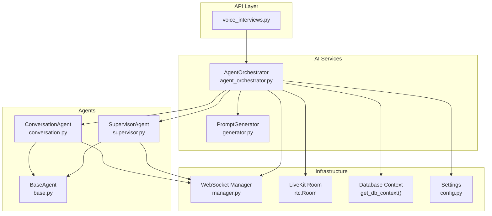
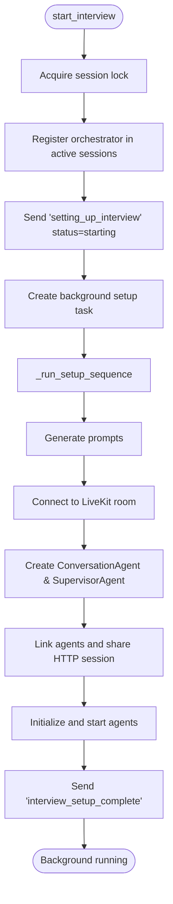
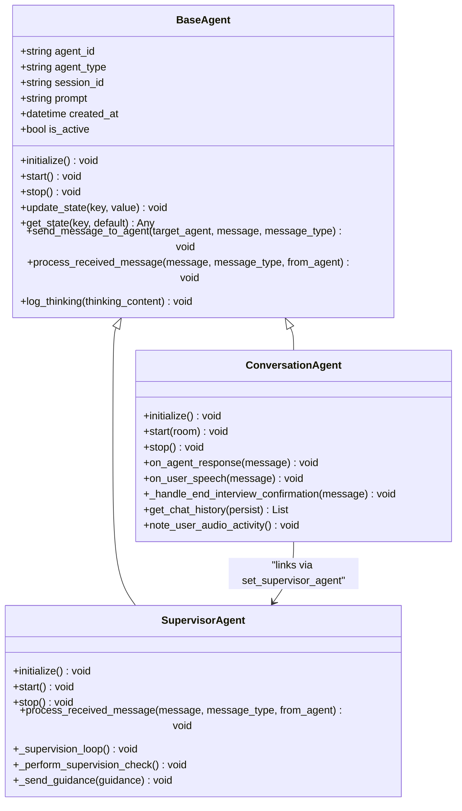
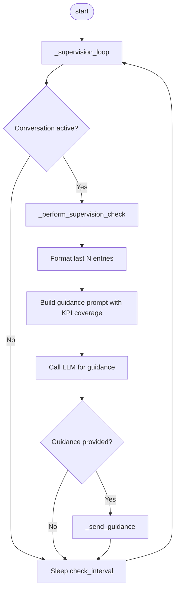
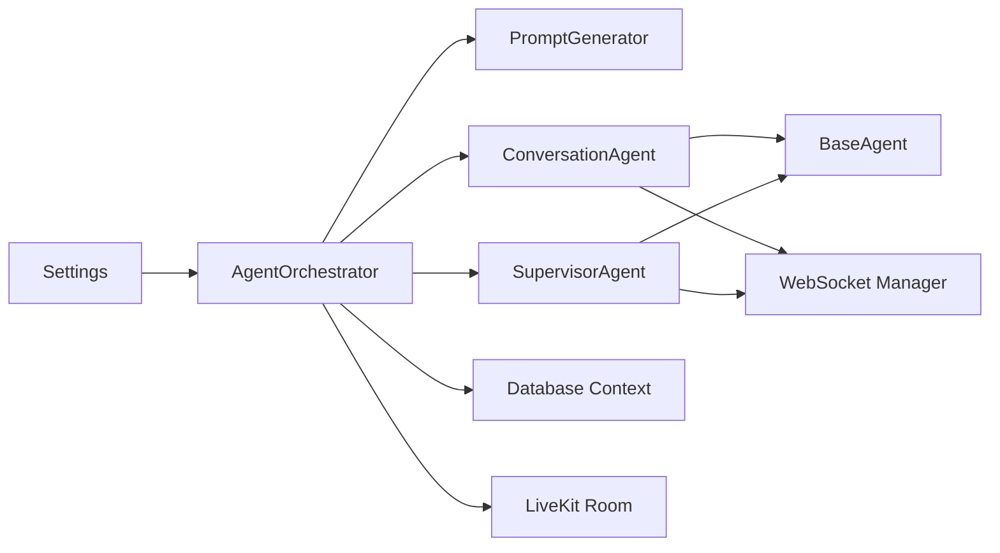

# Agent Orchestrator Service

<cite>
**Referenced Files in This Document**
- [agent_orchestrator.py](file://Backend/app/ai/services/agent_orchestrator.py)
- [base.py](file://Backend/app/ai/agents/base.py)
- [conversation.py](file://Backend/app/ai/agents/conversation.py)
- [supervisor.py](file://Backend/app/ai/agents/supervisor.py)
- [generator.py](file://Backend/app/ai/prompts/generator.py)
- [voice_interviews.py](file://Backend/app/api/v1/voice_interviews.py)
- [config.py](file://Backend/app/core/config.py)
- [manager.py](file://Backend/app/websocket/manager.py)
- [interview_state.py](file://Backend/app/ai/utils/interview_state.py)
- [main.py](file://Backend/app/main.py)
</cite>

## Table of Contents
1. [Introduction](#introduction)
2. [Project Structure](#project-structure)
3. [Core Components](#core-components)
4. [Architecture Overview](#architecture-overview)
5. [Detailed Component Analysis](#detailed-component-analysis)
6. [Dependency Analysis](#dependency-analysis)
7. [Performance Considerations](#performance-considerations)
8. [Troubleshooting Guide](#troubleshooting-guide)
9. [Conclusion](#conclusion)
10. [Appendices](#appendices)

## Introduction
The AgentOrchestrator service provides high-level orchestration for AI-driven voice interviews. It manages agent pools, coordinates concurrent interview sessions, and exposes unified interfaces to start, run, and end interviews with robust error handling, resource cleanup, and scalability considerations. The orchestrator integrates with LiveKit rooms, WebSocket telemetry, prompt generation, and database persistence to deliver a complete interview lifecycle.

## Project Structure
The orchestration layer is implemented under the AI subsystem and exposed via API endpoints:
- Orchestration entry points are in the AI services module.
- Agents (conversation and supervisor) implement shared base behavior.
- Prompt generation creates persona-based instructions for agents.
- Voice interview endpoints initialize sessions and manage lifecycle events.
- Configuration centralizes runtime settings for AI providers, LiveKit, and timing behaviors.
- WebSocket manager handles real-time telemetry between frontend and backend.
- Interview state tracks conversation phases, timers, and grace periods.



**Diagram sources**
- [agent_orchestrator.py:29-182](file://Backend/app/ai/services/agent_orchestrator.py#L29-L182)
- [voice_interviews.py:204-236](file://Backend/app/api/v1/voice_interviews.py#L204-L236)
- [generator.py:25-59](file://Backend/app/ai/prompts/generator.py#L25-L59)
- [conversation.py:184-311](file://Backend/app/ai/agents/conversation.py#L184-L311)
- [supervisor.py:20-119](file://Backend/app/ai/agents/supervisor.py#L20-L119)
- [manager.py:14-96](file://Backend/app/websocket/manager.py#L14-L96)
- [config.py:16-177](file://Backend/app/core/config.py#L16-L177)

**Section sources**
- [main.py:15-58](file://Backend/app/main.py#L15-L58)
- [voice_interviews.py:204-236](file://Backend/app/api/v1/voice_interviews.py#L204-L236)
- [agent_orchestrator.py:29-182](file://Backend/app/ai/services/agent_orchestrator.py#L29-L182)

## Core Components
- AgentOrchestrator: Manages session lifecycle, background setup, agent initialization, room connection, and cleanup.
- ConversationAgent: Handles real-time conversation flow, transcript capture, turn management, and user interactions.
- SupervisorAgent: Periodically analyzes conversation context and provides guidance to steer the interview toward KPI coverage and time management.
- PromptGenerator: Generates persona and instruction prompts using LLM calls, templated per interview configuration.
- WebSocket Manager: Provides reliable message delivery and pending message buffering for telemetry.
- InterviewState: Encapsulates phase transitions, timer control, grace periods, and end-interview confirmation flows.
- Settings: Centralized configuration for AI models, LiveKit, timing thresholds, and feature flags.

**Section sources**
- [agent_orchestrator.py:29-182](file://Backend/app/ai/services/agent_orchestrator.py#L29-L182)
- [conversation.py:184-311](file://Backend/app/ai/agents/conversation.py#L184-L311)
- [supervisor.py:20-119](file://Backend/app/ai/agents/supervisor.py#L20-L119)
- [generator.py:25-59](file://Backend/app/ai/prompts/generator.py#L25-L59)
- [manager.py:14-96](file://Backend/app/websocket/manager.py#L14-L96)
- [interview_state.py:29-101](file://Backend/app/ai/utils/interview_state.py#L29-L101)
- [config.py:16-177](file://Backend/app/core/config.py#L16-L177)

## Architecture Overview
The orchestrator initializes an interview session by generating prompts, connecting to a LiveKit room, creating and linking agents, and starting their background tasks. Telemetry is streamed via WebSocket to the frontend. The supervisor periodically inspects transcripts and sends guidance to maintain KPI coverage and enforce timing constraints. On completion, resources are cleaned up and post-interview analysis is triggered.

```mermaid
sequenceDiagram
participant FE as "Frontend"
participant API as "VoiceInterviews API"
participant ORCH as "AgentOrchestrator"
participant PKG as "PromptGenerator"
participant RT as "LiveKit Room"
participant WS as "WebSocket Manager"
participant CA as "ConversationAgent"
participant SA as "SupervisorAgent"
FE->>API : POST /voice/start
API->>ORCH : start_interview(config)
ORCH->>WS : send_message("setting_up_interview")
ORCH->>PKG : generate_both_prompts(config)
PKG-->>ORCH : {conversation_agent, supervisor_agent}
ORCH->>RT : connect(settings.livekit_ws_url, token)
ORCH->>CA : initialize(), start(room)
ORCH->>SA : initialize(), start()
ORCH->>WS : send_message("interview_setup_complete")
Note over CA,SA : Agents run concurrently; supervisor guides conversation
FE-->>WS : telemetry messages (audio activity, end request)
WS-->>CA : forward signals when needed
CA-->>FE : transcript updates, agent speech events
SA-->>CA : guidance messages (ephemeral/persistent)
FE->>API : POST /voice/complete
API->>ORCH : stop_interview()
ORCH->>CA : stop()
ORCH->>SA : stop()
ORCH->>RT : disconnect()
ORCH-->>FE : cleanup complete
```

**Diagram sources**
- [voice_interviews.py:204-236](file://Backend/app/api/v1/voice_interviews.py#L204-L236)
- [agent_orchestrator.py:42-182](file://Backend/app/ai/services/agent_orchestrator.py#L42-L182)
- [generator.py:33-59](file://Backend/app/ai/prompts/generator.py#L33-L59)
- [manager.py:48-79](file://Backend/app/websocket/manager.py#L48-L79)
- [conversation.py:204-311](file://Backend/app/ai/agents/conversation.py#L204-L311)
- [supervisor.py:61-119](file://Backend/app/ai/agents/supervisor.py#L61-L119)

## Detailed Component Analysis

### AgentOrchestrator
Responsibilities:
- Session registration and concurrency control via a per-session lock.
- Background setup sequence that generates prompts, connects to LiveKit, initializes agents, and signals readiness.
- User-requested wrap-up handling with timeouts and fallback completion events.
- Resource cleanup including agent stops, room disconnection, HTTP session closure, and async rating generation.
- Transcript refresh from persisted data to support resume scenarios.

Key behaviors:
- start_interview: Registers session, emits setup progress, schedules background setup task.
- _run_setup_sequence: Sequential steps for prompt generation, room connection, agent creation/linking, initialization, and completion signaling.
- begin_user_requested_wrapup: Enforces timeout and ensures completion event if wrap-up fails.
- stop_interview: Cancels pending tasks, stops agents, disconnects room, closes HTTP session, triggers rating, removes active session.
- Token generation: Creates LiveKit tokens with appropriate grants for agent identity.

Error handling:
- Logs errors during setup and cleanup.
- Emits failure events via WebSocket on setup exceptions.
- Ensures completion events are sent even if wrap-up times out or errors occur.

Scalability:
- Uses asyncio.Lock to serialize setup per session.
- Background tasks allow non-blocking initiation.
- Reuses aiohttp.ClientSession across agents for plugin stability.



**Diagram sources**
- [agent_orchestrator.py:42-182](file://Backend/app/ai/services/agent_orchestrator.py#L42-L182)

**Section sources**
- [agent_orchestrator.py:29-182](file://Backend/app/ai/services/agent_orchestrator.py#L29-L182)
- [agent_orchestrator.py:203-281](file://Backend/app/ai/services/agent_orchestrator.py#L203-L281)
- [agent_orchestrator.py:329-361](file://Backend/app/ai/services/agent_orchestrator.py#L329-L361)

### ConversationAgent
Responsibilities:
- Real-time conversation handling via LiveKit’s Agent framework.
- Transcript capture for both user and agent speech, deduplication, merging, and persistence.
- Turn management and floor control to prevent overlapping speech.
- Handling explicit end-interview requests and confirmation flows.
- Emitting telemetry events (transcripts, agent speech started).

Key behaviors:
- on_agent_response: Captures agent speech, persists transcript, updates state, notifies supervisor.
- on_user_speech: Validates input, merges short bursts, schedules agent reply, handles end-interview detection.
- _handle_end_interview_confirmation: Parses user responses to confirm or cancel ending.
- Timestamped chat history: Tracks messages with timestamps for accurate timing and resumption.

Error handling:
- Robust exception logging around transcript persistence and WebSocket messaging.
- Graceful suppression of late user speech after closing has started.

Extensibility:
- Integrates KPI coverage guards and anti-repeat logic to guide question selection.
- Supports multiple realtime providers through conditional imports.



**Diagram sources**
- [base.py:14-85](file://Backend/app/ai/agents/base.py#L14-L85)
- [conversation.py:184-311](file://Backend/app/ai/agents/conversation.py#L184-L311)
- [supervisor.py:20-119](file://Backend/app/ai/agents/supervisor.py#L20-L119)

**Section sources**
- [conversation.py:204-574](file://Backend/app/ai/agents/conversation.py#L204-L574)
- [conversation.py:576-757](file://Backend/app/ai/agents/conversation.py#L576-L757)

### SupervisorAgent
Responsibilities:
- Periodic supervision loop that reads recent transcript snippets and uses an LLM to provide guidance.
- Timing assistance and completion countdown to ensure interviews conclude within configured duration.
- KPI coverage tracking to prioritize uncovered competencies.
- Graceful cancellation and resource cleanup on stop.

Key behaviors:
- _supervision_loop: Sleeps at configured intervals, checks conversation state, performs guidance if needed.
- _perform_supervision_check: Formats transcript snippet, builds guidance prompt, calls LLM, forwards guidance.
- _completion_countdown: Triggers questioning ended phase and fallback wrap-up if necessary.
- _timing_assistance_loop: Generates timing assistance based on elapsed time and current phase.

Error handling:
- Logs errors in guidance generation and timing assistance.
- Cancels tasks cleanly and closes OpenAI client connections.



**Diagram sources**
- [supervisor.py:61-119](file://Backend/app/ai/agents/supervisor.py#L61-L119)
- [supervisor.py:137-268](file://Backend/app/ai/agents/supervisor.py#L137-L268)
- [supervisor.py:289-331](file://Backend/app/ai/agents/supervisor.py#L289-L331)

**Section sources**
- [supervisor.py:20-119](file://Backend/app/ai/agents/supervisor.py#L20-L119)
- [supervisor.py:137-268](file://Backend/app/ai/agents/supervisor.py#L137-L268)
- [supervisor.py:496-561](file://Backend/app/ai/agents/supervisor.py#L496-L561)

### PromptGenerator
Responsibilities:
- Generate persona JSON via LLM and fill templates for conversation and supervisor agents.
- Ensure consistent interviewer identity and structured output.
- Close LLM clients to avoid resource leaks.

Key behaviors:
- generate_both_prompts: Orchestrates persona generation and template filling.
- _generate_persona: Calls LLM with meta-prompt, enforces JSON response, sets fixed name.
- _fill_conversation_template: Injects persona and interview config into conversation instructions.
- _fill_supervisor_template: Injects interview context and KPI list into supervisor instructions.

Error handling:
- Timeout handling for persona generation.
- Validation for empty content.

**Section sources**
- [generator.py:25-59](file://Backend/app/ai/prompts/generator.py#L25-L59)
- [generator.py:61-107](file://Backend/app/ai/prompts/generator.py#L61-L107)
- [generator.py:143-217](file://Backend/app/ai/prompts/generator.py#L143-L217)

### WebSocket Manager
Responsibilities:
- Manage active connections per session.
- Deliver messages reliably, buffer pending messages until connections arrive.
- Trim pending queues to bounded size.

Key behaviors:
- connect: Adds websocket to session, flushes pending messages.
- send_message: Sends to all active connections, stores pending if none available.
- disconnect: Removes websocket and cleans up empty session lists.

**Section sources**
- [manager.py:14-96](file://Backend/app/websocket/manager.py#L14-L96)

### InterviewState
Responsibilities:
- Track conversation phases, timer start, remaining time, grace periods, and end-interview confirmation.
- Provide utilities for time calculations and phase transitions.

Key behaviors:
- start_timer_now: Initializes timer on first interactive turn.
- restore_timer_from_transcripts: Resumes timer from earliest transcript timestamp.
- enter_no_new_questions_phase: Prevents new questions near end.
- start_post_time_grace: Allows candidate to finish speaking after time expires.

**Section sources**
- [interview_state.py:29-101](file://Backend/app/ai/utils/interview_state.py#L29-L101)
- [interview_state.py:124-186](file://Backend/app/ai/utils/interview_state.py#L124-L186)
- [interview_state.py:231-272](file://Backend/app/ai/utils/interview_state.py#L231-L272)

### API Integration
Responsibilities:
- Expose endpoints to start, complete, and obtain telemetry for voice interviews.
- Issue LiveKit participant tokens and persist session state.
- Forward user signals (end request, audio activity) to orchestrator and agents.

Key behaviors:
- start_profile_voice / start_applied_voice: Validate attempt, build config, update DB, start voice session.
- telemetry websockets: Accept client messages and route to orchestrator methods.
- complete endpoints: End session, mark submitted, trigger synthesis analysis.

**Section sources**
- [voice_interviews.py:204-236](file://Backend/app/api/v1/voice_interviews.py#L204-L236)
- [voice_interviews.py:258-288](file://Backend/app/api/v1/voice_interviews.py#L258-L288)
- [voice_interviews.py:321-361](file://Backend/app/api/v1/voice_interviews.py#L321-L361)
- [voice_interviews.py:387-416](file://Backend/app/api/v1/voice_interviews.py#L387-L416)

## Dependency Analysis
- AgentOrchestrator depends on:
  - PromptGenerator for dynamic instruction creation.
  - ConversationAgent and SupervisorAgent for execution.
  - WebSocket Manager for telemetry.
  - LiveKit rtc.Room for media connectivity.
  - Database context for transcript refresh and post-interview updates.
  - Settings for provider URLs, keys, and timing parameters.
- ConversationAgent depends on:
  - BaseAgent for common lifecycle and messaging.
  - SupervisorAgent for guidance integration.
  - InterviewState for phase and timer management.
  - WebSocket Manager for telemetry.
  - KPI coverage utilities for question strategy.
- SupervisorAgent depends on:
  - BaseAgent for lifecycle and messaging.
  - OpenAI Async client for guidance.
  - Settings for model and interval configuration.
  - InterviewState indirectly via ConversationAgent.



**Diagram sources**
- [agent_orchestrator.py:29-182](file://Backend/app/ai/services/agent_orchestrator.py#L29-L182)
- [conversation.py:184-311](file://Backend/app/ai/agents/conversation.py#L184-L311)
- [supervisor.py:20-119](file://Backend/app/ai/agents/supervisor.py#L20-L119)
- [manager.py:14-96](file://Backend/app/websocket/manager.py#L14-L96)
- [config.py:16-177](file://Backend/app/core/config.py#L16-L177)

**Section sources**
- [agent_orchestrator.py:29-182](file://Backend/app/ai/services/agent_orchestrator.py#L29-L182)
- [conversation.py:184-311](file://Backend/app/ai/agents/conversation.py#L184-L311)
- [supervisor.py:20-119](file://Backend/app/ai/agents/supervisor.py#L20-L119)
- [manager.py:14-96](file://Backend/app/websocket/manager.py#L14-L96)
- [config.py:16-177](file://Backend/app/core/config.py#L16-L177)

## Performance Considerations
- Concurrency:
  - Per-session locks prevent race conditions during setup.
  - Background tasks enable non-blocking initialization and supervision loops.
- Resource Management:
  - Shared HTTP sessions reduce overhead for plugins.
  - Explicit task cancellation and client close on stop prevent leaks.
- I/O Efficiency:
  - WebSocket manager buffers pending messages and trims queues.
  - Transcript persistence occurs asynchronously to avoid blocking conversation flow.
- AI Latency:
  - Prompt generation uses configurable timeouts.
  - Supervisor guidance runs at intervals to balance responsiveness and cost.

[No sources needed since this section provides general guidance]

## Troubleshooting Guide
Common issues and strategies:
- Setup failures:
  - Errors during prompt generation or room connection emit failure events via WebSocket and trigger cleanup.
  - Check logs for LLM timeouts or LiveKit connection errors.
- Wrap-up timeouts:
  - If user-requested wrap-up times out, fallback completion events are sent to ensure frontend consistency.
- Transcript persistence errors:
  - Failures are logged but do not block conversation; retry or investigate DB connectivity.
- Supervisor guidance errors:
  - LLM call failures are logged; guidance may be skipped temporarily without halting the interview.
- WebSocket delivery:
  - Pending messages are stored and flushed when connections arrive; monitor queue sizes to detect backpressure.

**Section sources**
- [agent_orchestrator.py:184-192](file://Backend/app/ai/services/agent_orchestrator.py#L184-L192)
- [agent_orchestrator.py:203-242](file://Backend/app/ai/services/agent_orchestrator.py#L203-L242)
- [conversation.py:231-237](file://Backend/app/ai/agents/conversation.py#L231-L237)
- [supervisor.py:251-268](file://Backend/app/ai/agents/supervisor.py#L251-L268)
- [manager.py:48-89](file://Backend/app/websocket/manager.py#L48-L89)

## Conclusion
The AgentOrchestrator service delivers a robust, scalable orchestration layer for AI-driven voice interviews. It coordinates agent lifecycles, manages concurrent sessions, and integrates seamlessly with LiveKit, WebSocket telemetry, and database persistence. Through careful error handling, resource cleanup, and configurable timing controls, it supports reliable interview experiences while providing extensibility points for custom orchestration logic.

[No sources needed since this section summarizes without analyzing specific files]

## Appendices

### Configuration Options
Key settings influencing orchestration behavior:
- AI providers and models: openai_voice, conversation_model, supervisor_model, prompt_generation_model.
- Timing thresholds: supervisor_check_interval, timing_assistance_interval_seconds, max_user_speech_seconds, silence_threshold.
- LiveKit integration: livekit_url, livekit_api_key, livekit_api_secret, livekit_token_ttl_seconds.
- Feature flags: voice_interview_enabled, recordings_dir, videos_dir.

**Section sources**
- [config.py:72-120](file://Backend/app/core/config.py#L72-L120)
- [config.py:154-177](file://Backend/app/core/config.py#L154-L177)

### Monitoring Hooks
- WebSocket telemetry events include:
  - setting_up_interview with status progression.
  - interviewer_identity with extracted name.
  - interview_setup_complete upon readiness.
  - new_transcript_message for user and agent speech.
  - agent_speech_started for visualizer synchronization.
- Supervisor logs guidance counts and timing assistance outputs.

**Section sources**
- [agent_orchestrator.py:61-180](file://Backend/app/ai/services/agent_orchestrator.py#L61-L180)
- [conversation.py:204-311](file://Backend/app/ai/agents/conversation.py#L204-L311)
- [supervisor.py:233-268](file://Backend/app/ai/agents/supervisor.py#L233-L268)

### Extensibility Points
- Custom orchestration logic can be added by extending AgentOrchestrator’s setup sequence or supervision hooks.
- New agent types can inherit from BaseAgent and integrate via the orchestrator’s agent creation workflow.
- Prompt templates can be customized to alter persona generation and supervisor guidance strategies.

**Section sources**
- [base.py:14-85](file://Backend/app/ai/agents/base.py#L14-L85)
- [generator.py:143-217](file://Backend/app/ai/prompts/generator.py#L143-L217)
- [agent_orchestrator.py:133-172](file://Backend/app/ai/services/agent_orchestrator.py#L133-L172)