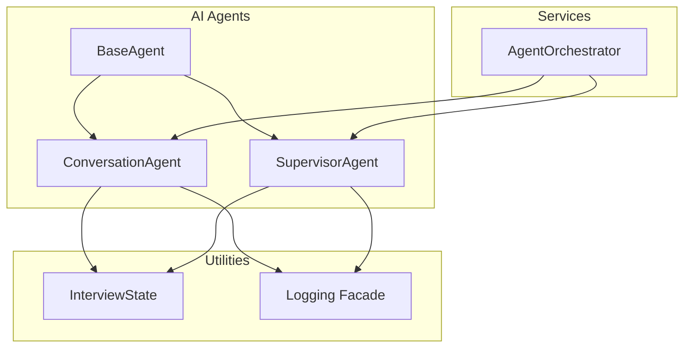
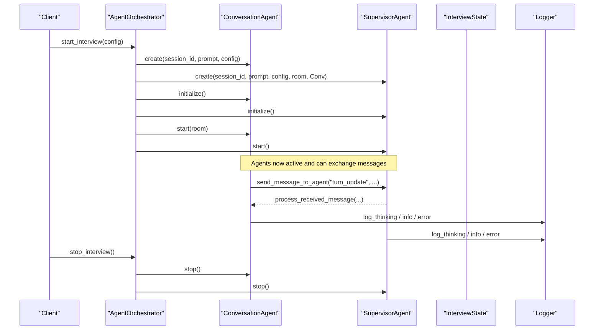
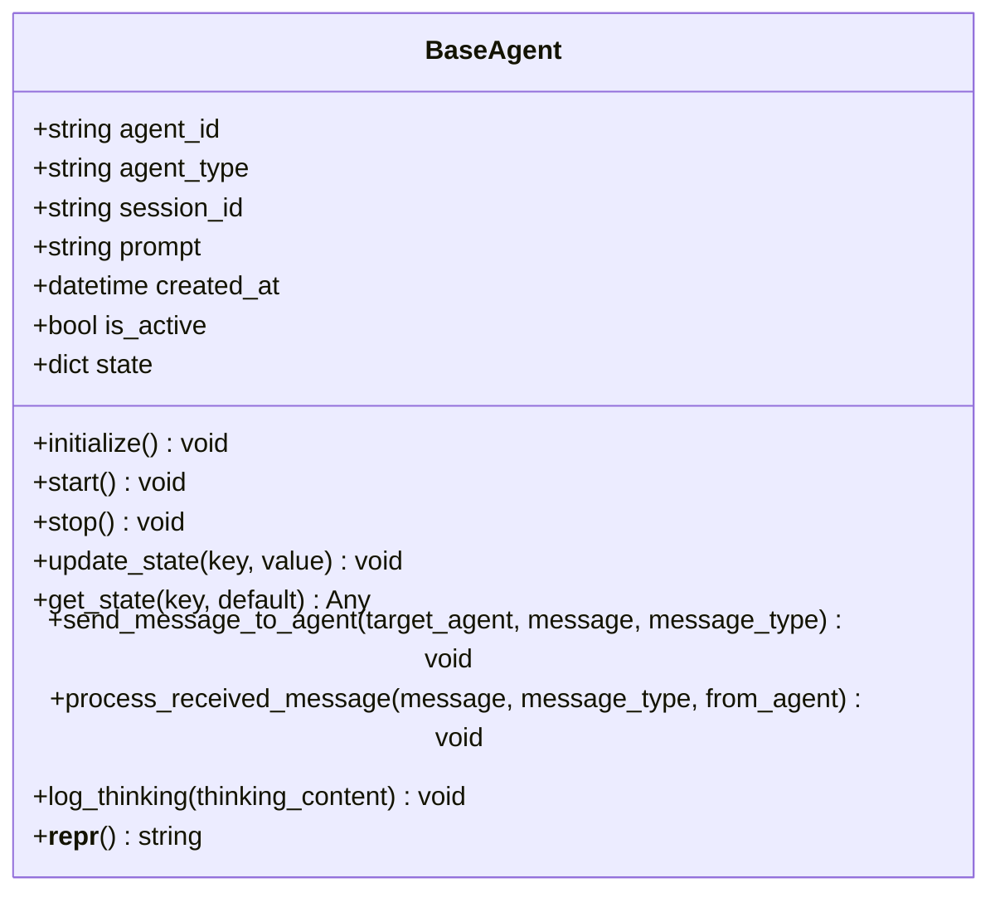
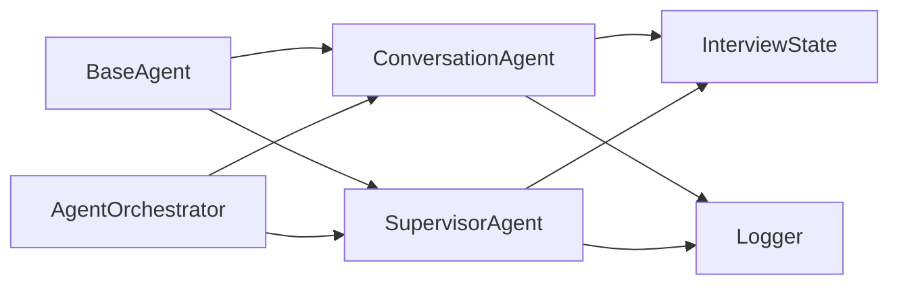

# Base Agent Framework

<cite>
**Referenced Files in This Document**
- [base.py](file://Backend/app/ai/agents/base.py)
- [conversation.py](file://Backend/app/ai/agents/conversation.py)
- [supervisor.py](file://Backend/app/ai/agents/supervisor.py)
- [agent_orchestrator.py](file://Backend/app/ai/services/agent_orchestrator.py)
- [interview_state.py](file://Backend/app/ai/utils/interview_state.py)
- [logging.py](file://Backend/app/logging.py)
</cite>

## Table of Contents
1. [Introduction](#introduction)
2. [Project Structure](#project-structure)
3. [Core Components](#core-components)
4. [Architecture Overview](#architecture-overview)
5. [Detailed Component Analysis](#detailed-component-analysis)
6. [Dependency Analysis](#dependency-analysis)
7. [Performance Considerations](#performance-considerations)
8. [Troubleshooting Guide](#troubleshooting-guide)
9. [Conclusion](#conclusion)
10. [Appendices](#appendices)

## Introduction
This document explains the BaseAgent framework that underpins all interview agents in the system. It covers the abstract base class design, agent lifecycle (initialize, start, stop), state management for tracking context and activity, inter-agent messaging, and how to extend BaseAgent to build custom interview agents. It also addresses agent identification, session management, thread safety considerations, error handling patterns, and logging strategies used across the framework.

## Project Structure
The BaseAgent framework lives under the AI subsystem and is composed of:
- An abstract base class defining the common contract for all agents
- Concrete agents implementing interview conversation and supervision
- An orchestrator that manages agent lifecycles per interview session
- Shared utilities for interview state and logging

**Diagram sources**
- [base.py:14-85](file://Backend/app/ai/agents/base.py#L14-L85)
- [conversation.py:1264-1500](file://Backend/app/ai/agents/conversation.py#L1264-L1500)
- [supervisor.py:20-120](file://Backend/app/ai/agents/supervisor.py#L20-L120)
- [agent_orchestrator.py:29-183](file://Backend/app/ai/services/agent_orchestrator.py#L29-L183)
- [interview_state.py:29-102](file://Backend/app/ai/utils/interview_state.py#L29-L102)
- [logging.py:9-36](file://Backend/app/logging.py#L9-L36)

**Section sources**
- [base.py:14-85](file://Backend/app/ai/agents/base.py#L14-L85)
- [agent_orchestrator.py:29-183](file://Backend/app/ai/services/agent_orchestrator.py#L29-L183)

## Core Components
- BaseAgent: Abstract base class providing lifecycle methods, state helpers, messaging primitives, and logging utilities.
- ConversationAgent: Implements the live interview conversation using LiveKit and OpenAI Realtime API; extends BaseAgent.
- SupervisorAgent: Monitors and guides the conversation via periodic LLM-based checks; extends BaseAgent.
- AgentOrchestrator: Creates, initializes, starts, and stops agents per session; coordinates room and resources.
- InterviewState: Centralized state object for timing, phases, and control flags shared by agents.
- Logging: A simple facade over stdlib logging used throughout the agents.

Key responsibilities:
- Lifecycle: initialize/start/stop are defined as abstract in BaseAgent and implemented by concrete agents.
- State: update_state/get_state provide a simple key-value store with last_activity timestamps; InterviewState provides richer phase and timer semantics.
- Messaging: send_message_to_agent and process_received_message define a typed message protocol between agents.
- Identification: Each agent has a unique agent_id and an agent_type for routing and logging.
- Session: Orchestrator binds agents to a session_id and manages their lifetime.

**Section sources**
- [base.py:14-85](file://Backend/app/ai/agents/base.py#L14-L85)
- [conversation.py:1264-1500](file://Backend/app/ai/agents/conversation.py#L1264-L1500)
- [supervisor.py:20-120](file://Backend/app/ai/agents/supervisor.py#L20-L120)
- [agent_orchestrator.py:29-183](file://Backend/app/ai/services/agent_orchestrator.py#L29-L183)
- [interview_state.py:29-102](file://Backend/app/ai/utils/interview_state.py#L29-L102)
- [logging.py:9-36](file://Backend/app/logging.py#L9-L36)

## Architecture Overview
The framework uses an abstract base class to enforce a consistent lifecycle and messaging interface across agents. The orchestrator instantiates and wires agents, then starts them asynchronously. Agents communicate through a typed message protocol and share a centralized InterviewState for time and phase coordination.

**Diagram sources**
- [agent_orchestrator.py:42-183](file://Backend/app/ai/services/agent_orchestrator.py#L42-L183)
- [conversation.py:1264-1500](file://Backend/app/ai/agents/conversation.py#L1264-L1500)
- [supervisor.py:61-120](file://Backend/app/ai/agents/supervisor.py#L61-L120)
- [base.py:59-77](file://Backend/app/ai/agents/base.py#L59-L77)

## Detailed Component Analysis

### BaseAgent: Abstract Contract and Utilities
- Identity and initialization:
  - Generates a unique agent_id and records agent_type, session_id, prompt, and creation timestamp.
  - Initializes a simple state dictionary with created_at and last_activity.
- Lifecycle:
  - Declares abstract initialize(), start(), stop() to be implemented by subclasses.
- State management:
  - update_state(key, value) updates state and refreshes last_activity.
  - get_state(key, default=None) retrieves values safely.
- Inter-agent communication:
  - send_message_to_agent(target_agent, message, message_type="instruction") calls target_agent.process_received_message(message, message_type, self).
  - Logs success or failure and catches exceptions to avoid cascading errors.
- Logging:
  - log_thinking(thinking_content) logs truncated debug output for reasoning traces.
- Representation:
  - __repr__ returns a concise identifier for debugging.

**Diagram sources**
- [base.py:14-85](file://Backend/app/ai/agents/base.py#L14-L85)

**Section sources**
- [base.py:14-85](file://Backend/app/ai/agents/base.py#L14-L85)

### ConversationAgent: Interview Conversation Implementation
- Extends BaseAgent and integrates with LiveKit and OpenAI Realtime API.
- Manages chat history, transcript persistence, WebSocket events, and turn flow.
- Uses InterviewState for phase transitions, timers, and grace periods.
- Implements process_received_message to handle guidance and supervisor signals.
- Coordinates with SupervisorAgent via BaseAgent messaging.

Key behaviors:
- Maintains floor control to prevent overlapping speech.
- Tracks user and agent speaking states to avoid echo and duplicate processing.
- Persists transcripts incrementally and emits real-time updates to clients.
- Enforces answer length caps and post-time grace windows.

**Section sources**
- [conversation.py:1264-1500](file://Backend/app/ai/agents/conversation.py#L1264-L1500)

### SupervisorAgent: Monitoring and Guidance
- Extends BaseAgent and runs background tasks:
  - Supervision loop periodically analyzes recent transcript and provides guidance.
  - Completion countdown enforces interview duration and triggers wrap-up.
  - Timing assistance loop sends ephemeral instructions based on elapsed time.
- Sends guidance to ConversationAgent via BaseAgent messaging with types like guidance-persistent and guidance-ephemeral.
- Handles turn updates from ConversationAgent to adjust behavior.

Lifecycle highlights:
- initialize(): prepares client and internal structures.
- start(): activates supervision and timing loops.
- stop(): cancels tasks, closes HTTP client, and cleans up.

**Section sources**
- [supervisor.py:20-120](file://Backend/app/ai/agents/supervisor.py#L20-L120)
- [supervisor.py:137-269](file://Backend/app/ai/agents/supervisor.py#L137-L269)
- [supervisor.py:270-339](file://Backend/app/ai/agents/supervisor.py#L270-L339)
- [supervisor.py:439-456](file://Backend/app/ai/agents/supervisor.py#L439-L456)
- [supervisor.py:496-561](file://Backend/app/ai/agents/supervisor.py#L496-L561)
- [supervisor.py:603-671](file://Backend/app/ai/agents/supervisor.py#L603-L671)
- [supervisor.py:676-716](file://Backend/app/ai/agents/supervisor.py#L676-L716)

### AgentOrchestrator: Session Management and Coordination
- Binds agents to a session_id and maintains references to ConversationAgent and SupervisorAgent.
- start_interview(config):
  - Registers the orchestrator in a global registry keyed by session_id.
  - Emits setup progress events to the frontend.
  - Runs a background setup sequence: generate prompts, connect to LiveKit room, instantiate agents, link them, initialize, and start.
- stop_interview():
  - Stops both agents, disconnects the room, closes HTTP session, and removes from registry.
  - Triggers post-interview tasks such as AI rating generation.

Thread safety and concurrency:
- Uses asyncio.Lock to serialize setup operations per session.
- Cancels pending tasks when re-initializing or stopping.

**Section sources**
- [agent_orchestrator.py:29-183](file://Backend/app/ai/services/agent_orchestrator.py#L29-L183)
- [agent_orchestrator.py:203-281](file://Backend/app/ai/services/agent_orchestrator.py#L203-L281)
- [agent_orchestrator.py:329-370](file://Backend/app/ai/services/agent_orchestrator.py#L329-L370)

### InterviewState: Shared Context and Timer Control
- Provides a rich state model for conversation phases, turns, and timing.
- Methods for starting timers, checking time-up, entering no-new-questions phase, and managing grace periods.
- Used by ConversationAgent and SupervisorAgent to coordinate behavior during interviews.

**Section sources**
- [interview_state.py:29-102](file://Backend/app/ai/utils/interview_state.py#L29-L102)
- [interview_state.py:108-187](file://Backend/app/ai/utils/interview_state.py#L108-L187)
- [interview_state.py:188-272](file://Backend/app/ai/utils/interview_state.py#L188-L272)

### Logging Strategy
- A unified logger facade wraps stdlib logging under a dedicated logger name.
- Provides debug, info, warning, error, and exception methods used consistently across agents.
- Ensures handlers are configured once and formatted uniformly.

**Section sources**
- [logging.py:9-36](file://Backend/app/logging.py#L9-L36)

## Dependency Analysis
- BaseAgent is the root dependency for all agents.
- ConversationAgent depends on BaseAgent, InterviewState, LiveKit components, and OpenAI Realtime integration.
- SupervisorAgent depends on BaseAgent, InterviewState, and OpenAI client for guidance.
- AgentOrchestrator depends on both concrete agents and utilities for orchestration.

**Diagram sources**
- [base.py:14-85](file://Backend/app/ai/agents/base.py#L14-L85)
- [conversation.py:1264-1500](file://Backend/app/ai/agents/conversation.py#L1264-L1500)
- [supervisor.py:20-120](file://Backend/app/ai/agents/supervisor.py#L20-L120)
- [agent_orchestrator.py:29-183](file://Backend/app/ai/services/agent_orchestrator.py#L29-L183)
- [interview_state.py:29-102](file://Backend/app/ai/utils/interview_state.py#L29-L102)
- [logging.py:9-36](file://Backend/app/logging.py#L9-L36)

**Section sources**
- [base.py:14-85](file://Backend/app/ai/agents/base.py#L14-L85)
- [conversation.py:1264-1500](file://Backend/app/ai/agents/conversation.py#L1264-L1500)
- [supervisor.py:20-120](file://Backend/app/ai/agents/supervisor.py#L20-L120)
- [agent_orchestrator.py:29-183](file://Backend/app/ai/services/agent_orchestrator.py#L29-L183)

## Performance Considerations
- Avoid blocking operations in agent callbacks; use async tasks where appropriate.
- Use InterviewState to minimize redundant computations and coordinate phases efficiently.
- Limit LLM calls in SupervisorAgent to necessary intervals and only when idle.
- Persist transcripts incrementally to reduce memory pressure and ensure resilience.
- Reuse HTTP sessions at the orchestrator level to reduce connection overhead.

[No sources needed since this section provides general guidance]

## Troubleshooting Guide
Common issues and remedies:
- Message delivery failures:
  - send_message_to_agent catches exceptions and logs errors; verify target_agent exists and process_received_message is implemented correctly.
- Supervisor not guiding:
  - Ensure SupervisorAgent.start() is called and tasks are running; check is_active flags and that ConversationAgent is active.
- Time-based ending not triggering:
  - Confirm InterviewState timer started and is_time_up logic is reachable; review grace period and no-new-questions phase transitions.
- Duplicate transcripts or echoes:
  - Check floor control and echo guard mechanisms in ConversationAgent; ensure agent_speaking flags are set appropriately.
- Resource leaks:
  - Always call stop_interview to cancel tasks, close HTTP sessions, and disconnect rooms.

**Section sources**
- [base.py:59-77](file://Backend/app/ai/agents/base.py#L59-L77)
- [supervisor.py:77-120](file://Backend/app/ai/agents/supervisor.py#L77-L120)
- [agent_orchestrator.py:244-281](file://Backend/app/ai/services/agent_orchestrator.py#L244-L281)
- [conversation.py:1264-1500](file://Backend/app/ai/agents/conversation.py#L1264-L1500)

## Conclusion
The BaseAgent framework provides a robust foundation for building interview agents with a clear lifecycle, shared state management, and a typed messaging protocol. By extending BaseAgent and leveraging InterviewState and the orchestrator, developers can implement custom agents that integrate seamlessly into the interview workflow while maintaining thread safety, performance, and observability.

[No sources needed since this section summarizes without analyzing specific files]

## Appendices

### How to Extend BaseAgent for a Custom Interview Agent
Steps:
- Create a new class inheriting from BaseAgent.
- Implement initialize(), start(), stop() to manage your agent’s resources and background tasks.
- Implement process_received_message() to handle incoming messages from other agents.
- Use update_state/get_state to track context and last_activity.
- Use send_message_to_agent to communicate with peers.
- Use log_thinking for debug-level reasoning traces.

Example pattern reference paths:
- BaseAgent contract: [base.py:14-85](file://Backend/app/ai/agents/base.py#L14-L85)
- SupervisorAgent implementation example: [supervisor.py:20-120](file://Backend/app/ai/agents/supervisor.py#L20-L120)
- ConversationAgent usage of state and messaging: [conversation.py:1264-1500](file://Backend/app/ai/agents/conversation.py#L1264-L1500)

**Section sources**
- [base.py:14-85](file://Backend/app/ai/agents/base.py#L14-L85)
- [supervisor.py:20-120](file://Backend/app/ai/agents/supervisor.py#L20-L120)
- [conversation.py:1264-1500](file://Backend/app/ai/agents/conversation.py#L1264-L1500)

### Error Handling Patterns
- Wrap external calls (LLM, network) in try/except blocks and log errors with exc_info for stack traces.
- Use graceful degradation: if one path fails, continue with fallback behavior (e.g., skip guidance if LLM call fails).
- Ensure cleanup in stop() methods to release resources and cancel tasks.

**Section sources**
- [supervisor.py:77-120](file://Backend/app/ai/agents/supervisor.py#L77-L120)
- [supervisor.py:251-269](file://Backend/app/ai/agents/supervisor.py#L251-L269)
- [agent_orchestrator.py:244-281](file://Backend/app/ai/services/agent_orchestrator.py#L244-L281)

### Logging Strategies
- Use the unified logger facade for consistent formatting and levels.
- Prefer info for operational events, debug for detailed traces, and error/exception for failures.
- Include contextual identifiers like session_id and agent_id in logs for traceability.

**Section sources**
- [logging.py:9-36](file://Backend/app/logging.py#L9-L36)
- [base.py:79-81](file://Backend/app/ai/agents/base.py#L79-L81)

### Agent Identification and Session Management
- Each agent has a unique agent_id and agent_type for identification and logging.
- Session management is handled by AgentOrchestrator, which binds agents to session_id and tracks active sessions.
- Use get_orchestrator(session_id) to retrieve the active orchestrator instance for a session.

**Section sources**
- [base.py:17-33](file://Backend/app/ai/agents/base.py#L17-L33)
- [agent_orchestrator.py:27-41](file://Backend/app/ai/services/agent_orchestrator.py#L27-L41)
- [agent_orchestrator.py:363-370](file://Backend/app/ai/services/agent_orchestrator.py#L363-L370)

### Thread Safety Considerations
- Use asyncio locks to serialize critical sections (e.g., setup sequences).
- Avoid sharing mutable state across tasks without synchronization; prefer passing explicit parameters or using shared state objects with well-defined accessors.
- Cancel and await tasks properly in stop() to prevent dangling coroutines.

**Section sources**
- [agent_orchestrator.py:42-76](file://Backend/app/ai/services/agent_orchestrator.py#L42-L76)
- [supervisor.py:77-120](file://Backend/app/ai/agents/supervisor.py#L77-L120)