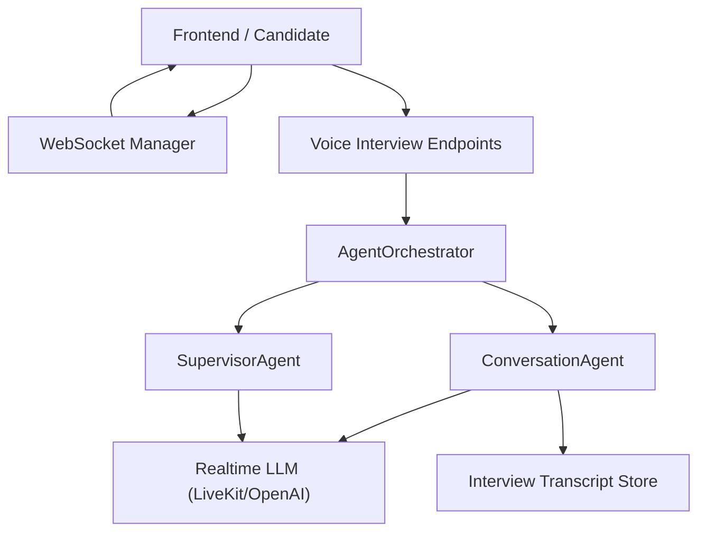
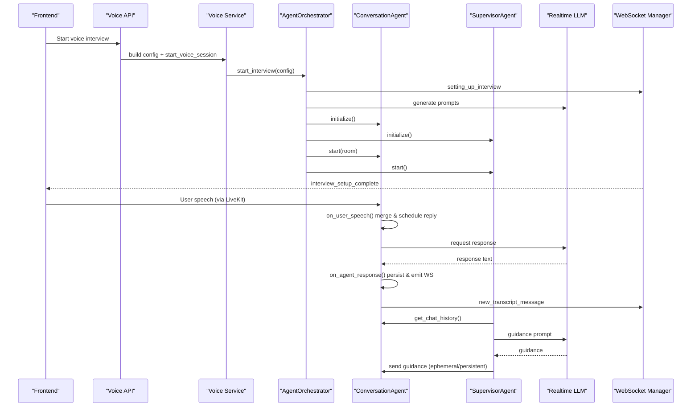
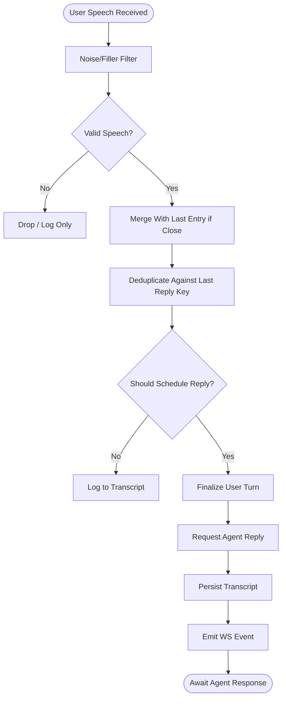
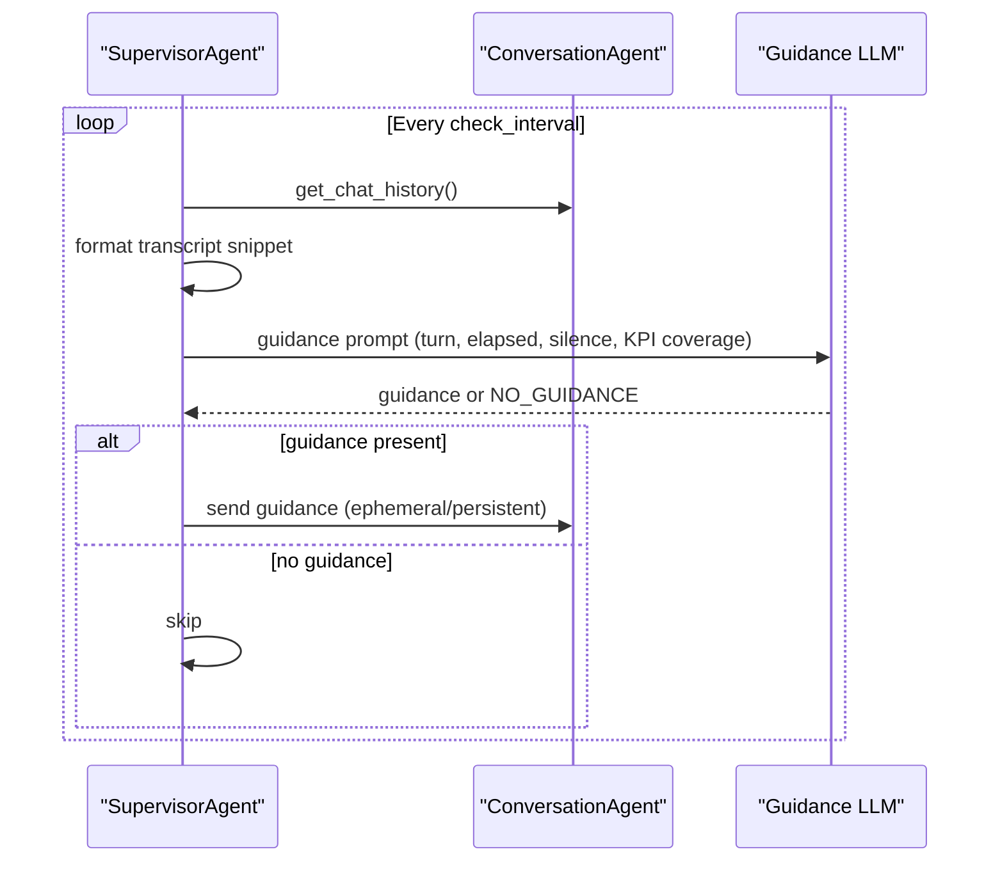
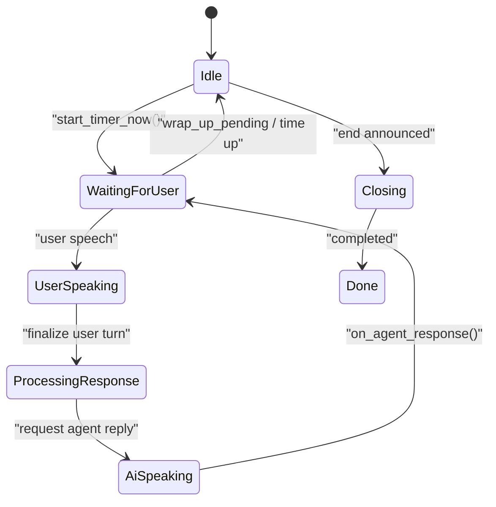
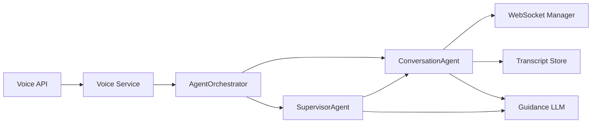

# Conversation Management

<cite>
**Referenced Files in This Document**
- [conversation.py](file://Backend/app/ai/agents/conversation.py)
- [base.py](file://Backend/app/ai/agents/base.py)
- [supervisor.py](file://Backend/app/ai/agents/supervisor.py)
- [interview_state.py](file://Backend/app/ai/utils/interview_state.py)
- [agent_orchestrator.py](file://Backend/app/ai/services/agent_orchestrator.py)
- [voice_interviews.py](file://Backend/app/api/v1/voice_interviews.py)
- [voice_interview.py](file://Backend/app/services/voice_interview.py)
- [manager.py](file://Backend/app/websocket/manager.py)
- [transcript_utils.py](file://Backend/app/ai/utils/transcript_utils.py)
- [interview_strategies.py](file://Backend/app/ai/prompts/interview_strategies.py)
</cite>

## Table of Contents
1. Introduction
2. Project Structure
3. Core Components
4. Architecture Overview
5. Detailed Component Analysis
6. Dependency Analysis
7. Performance Considerations
8. Troubleshooting Guide
9. Conclusion

## Introduction
This document explains the conversation management system that drives AI-led interview sessions. It covers how conversations are structured, maintained, and processed end-to-end: from initialization through message handling, context windowing, domain-specific prompt integration, state persistence and restoration, timeouts, error recovery, and performance optimization for long-running interviews.

The system is built around a real-time voice interview flow using LiveKit and an LLM-backed interviewer agent, supervised by a separate supervisor agent that guides question coverage, timing, and wrap-up behavior. A shared InterviewState tracks phases, timers, grace periods, and end-of-interview flows. Transcripts are persisted incrementally and can be restored to resume interrupted sessions.

## Project Structure
At a high level, the conversation system spans several layers:
- API layer exposes endpoints to start, complete, and monitor voice interviews.
- Service layer builds interview configurations and orchestrates session lifecycle.
- Agent layer contains the ConversationAgent (interviewer), SupervisorAgent (guidance), and BaseAgent utilities.
- State and utilities manage conversation phases, timers, transcript normalization, and KPI coverage.
- WebSocket manager relays telemetry and transcript events to clients.

**Diagram sources**
- [voice_interviews.py:177-236](file://Backend/app/api/v1/voice_interviews.py#L177-L236)
- [voice_interview.py:189-227](file://Backend/app/services/voice_interview.py#L189-L227)
- [agent_orchestrator.py:42-180](file://Backend/app/ai/services/agent_orchestrator.py#L42-L180)
- [conversation.py:184-230](file://Backend/app/ai/agents/conversation.py#L184-L230)
- [supervisor.py:20-75](file://Backend/app/ai/agents/supervisor.py#L20-L75)
- [manager.py:14-96](file://Backend/app/websocket/manager.py#L14-L96)

**Section sources**
- [voice_interviews.py:177-236](file://Backend/app/api/v1/voice_interviews.py#L177-L236)
- [voice_interview.py:189-227](file://Backend/app/services/voice_interview.py#L189-L227)
- [agent_orchestrator.py:42-180](file://Backend/app/ai/services/agent_orchestrator.py#L42-L180)
- [conversation.py:184-230](file://Backend/app/ai/agents/conversation.py#L184-L230)
- [supervisor.py:20-75](file://Backend/app/ai/agents/supervisor.py#L20-L75)
- [manager.py:14-96](file://Backend/app/websocket/manager.py#L14-L96)

## Core Components
- ConversationAgent: Real-time interviewer agent that manages turn-taking, speech detection, transcript merging, response scheduling, and end-of-interview flows.
- SupervisorAgent: Periodic guidance agent that analyzes recent transcript snippets, enforces KPI coverage, timing, and wrap-up policies, and sends ephemeral or persistent guidance to the ConversationAgent.
- InterviewState: Shared state object tracking phase, turns, timers, grace periods, and end-of-interview flags; supports restoring timer from persisted transcripts.
- AgentOrchestrator: Session lifecycle manager that initializes agents, connects to LiveKit, starts background setup tasks, and coordinates cleanup and post-interview analysis.
- Voice Interview Services and APIs: Build interview configs, issue tokens, start/stop sessions, and expose telemetry websockets for client signals.
- WebSocket Manager: Publishes transcript and status events to connected clients and buffers messages when no connections exist.

**Section sources**
- [conversation.py:184-230](file://Backend/app/ai/agents/conversation.py#L184-L230)
- [supervisor.py:20-75](file://Backend/app/ai/agents/supervisor.py#L20-L75)
- [interview_state.py:22-101](file://Backend/app/ai/utils/interview_state.py#L22-L101)
- [agent_orchestrator.py:29-180](file://Backend/app/ai/services/agent_orchestrator.py#L29-L180)
- [voice_interviews.py:177-236](file://Backend/app/api/v1/voice_interviews.py#L177-L236)
- [voice_interview.py:189-227](file://Backend/app/services/voice_interview.py#L189-L227)
- [manager.py:14-96](file://Backend/app/websocket/manager.py#L14-L96)

## Architecture Overview
The conversation architecture separates concerns into agents with distinct responsibilities:
- The ConversationAgent owns the live interview dialogue, handles user and agent speech, merges transcripts, schedules replies, and triggers end-of-interview logic.
- The SupervisorAgent runs periodic checks to ensure KPI coverage, enforce time limits, and guide the ConversationAgent via ephemeral or persistent instructions.
- The AgentOrchestrator wires these components together, manages LiveKit room connectivity, and ensures graceful teardown.

**Diagram sources**
- [voice_interviews.py:204-236](file://Backend/app/api/v1/voice_interviews.py#L204-L236)
- [voice_interview.py:189-227](file://Backend/app/services/voice_interview.py#L189-L227)
- [agent_orchestrator.py:42-180](file://Backend/app/ai/services/agent_orchestrator.py#L42-L180)
- [conversation.py:312-571](file://Backend/app/ai/agents/conversation.py#L312-L571)
- [supervisor.py:137-268](file://Backend/app/ai/agents/supervisor.py#L137-L268)
- [manager.py:48-89](file://Backend/app/websocket/manager.py#L48-L89)

## Detailed Component Analysis

### ConversationAgent: Dialogue Flow and Context Window
Responsibilities:
- Manages floor control via FloorPhase states (listening, user turn, agent turn, scripted, closing, done).
- Processes user speech with noise filtering, deduplication, merging short utterances, and debouncing.
- Schedules agent responses only when appropriate (not during long user answers or after questioning ended).
- Persists transcripts incrementally and emits websocket events for frontend updates.
- Handles explicit end-interview requests and confirmation flows.

Key behaviors:
- Noise detection and filler word filtering prevent accidental replies to background sounds.
- Short user utterances within a time window are merged into the last transcript entry to reduce fragmentation.
- After time-based ending, user speech is logged but does not trigger new questions.
- Grace period allows candidate to finish answering even after time expires.

Context window handling:
- The ConversationAgent maintains a chat history used by both itself and the SupervisorAgent.
- SupervisorAgent reads recent transcript entries to form prompts, ensuring timely guidance without overwhelming the model.

**Diagram sources**
- [conversation.py:118-166](file://Backend/app/ai/agents/conversation.py#L118-L166)
- [conversation.py:312-571](file://Backend/app/ai/agents/conversation.py#L312-L571)

**Section sources**
- [conversation.py:70-79](file://Backend/app/ai/agents/conversation.py#L70-L79)
- [conversation.py:118-166](file://Backend/app/ai/agents/conversation.py#L118-L166)
- [conversation.py:312-571](file://Backend/app/ai/agents/conversation.py#L312-L571)

### SupervisorAgent: Guidance, Timing, and Wrap-Up
Responsibilities:
- Runs periodic supervision checks between turns to avoid interrupting active speech.
- Builds guidance prompts using recent transcript snippets, current turn count, elapsed time, silence duration, and KPI coverage.
- Sends guidance tagged as EPHEMERAL or PERSISTENT to influence next-turn behavior or longer-term strategy.
- Enforces completion countdown and timing assistance, transitioning to “no new questions” and wrap-up phases.

Timing and wrap-up:
- Completion countdown triggers “questioning ended” guidance at scheduled time.
- If wrap-up has not started cleanly, a fallback triggers start_wrapup to ensure session closure.
- Grace period prevents immediate hard stops; allows finishing current answer before final closing.

**Diagram sources**
- [supervisor.py:137-268](file://Backend/app/ai/agents/supervisor.py#L137-L268)
- [supervisor.py:270-331](file://Backend/app/ai/agents/supervisor.py#L270-L331)
- [supervisor.py:439-456](file://Backend/app/ai/agents/supervisor.py#L439-L456)

**Section sources**
- [supervisor.py:137-268](file://Backend/app/ai/agents/supervisor.py#L137-L268)
- [supervisor.py:270-331](file://Backend/app/ai/agents/supervisor.py#L270-L331)
- [supervisor.py:439-456](file://Backend/app/ai/agents/supervisor.py#L439-L456)

### InterviewState: Phase Machine and Timer Control
Responsibilities:
- Tracks conversation phases (idle, ai speaking, waiting for user, user speaking, processing response).
- Manages timer start/reset, remaining time calculations, and time-based ending.
- Controls grace periods and “no new questions” phases to ensure smooth transitions.
- Supports resuming timer from persisted transcripts to restore context across interruptions.

State machine highlights:
- Phase setters update internal phase consistently.
- Time-based methods compute elapsed/remaining seconds and minutes.
- Grace period flags allow finishing current answer while blocking new questions.

**Diagram sources**
- [interview_state.py:22-101](file://Backend/app/ai/utils/interview_state.py#L22-L101)
- [interview_state.py:124-187](file://Backend/app/ai/utils/interview_state.py#L124-L187)

**Section sources**
- [interview_state.py:22-101](file://Backend/app/ai/utils/interview_state.py#L22-L101)
- [interview_state.py:124-187](file://Backend/app/ai/utils/interview_state.py#L124-L187)
- [interview_state.py:231-272](file://Backend/app/ai/utils/interview_state.py#L231-L272)

### AgentOrchestrator: Session Lifecycle and Persistence
Responsibilities:
- Initializes prompts, connects to LiveKit, creates and links agents, and starts them in background tasks.
- Refreshes persisted transcripts before setup to support resume scenarios.
- Coordinates user-requested wrap-up and full stop, including fallback completion events.
- Triggers post-interview analysis asynchronously.

Persistence and resume:
- Loads normalized transcripts from the database and injects them into the configuration.
- Uses transcript timestamps to restore timer start time and phase flags.

**Section sources**
- [agent_orchestrator.py:42-180](file://Backend/app/ai/services/agent_orchestrator.py#L42-L180)
- [agent_orchestrator.py:203-243](file://Backend/app/ai/services/agent_orchestrator.py#L203-L243)
- [agent_orchestrator.py:329-347](file://Backend/app/ai/services/agent_orchestrator.py#L329-L347)

### Voice Interview APIs and Services: Initialization and Telemetry
Responsibilities:
- Provide endpoints to retrieve session info, obtain LiveKit tokens, start interviews, and complete sessions.
- Expose telemetry websockets to forward client signals (e.g., user requested end, audio activity) to the active conversation agent.
- Build interview configurations based on candidate profile and job posting, integrating domain strategies.

Initialization example flow:
- Frontend calls start endpoint.
- Backend validates readiness, builds config, registers session, and starts orchestrator task.
- Orchestrator sets up agents and notifies frontend when ready.

Telemetry example flow:
- Frontend opens telemetry websocket.
- On user click “End Interview”, frontend sends user_requested_end signal.
- Backend forwards to conversation agent to prepare and arm end sequence.

**Section sources**
- [voice_interviews.py:177-236](file://Backend/app/api/v1/voice_interviews.py#L177-L236)
- [voice_interviews.py:258-288](file://Backend/app/api/v1/voice_interviews.py#L258-L288)
- [voice_interviews.py:321-361](file://Backend/app/api/v1/voice_interviews.py#L321-L361)
- [voice_interviews.py:387-416](file://Backend/app/api/v1/voice_interviews.py#L387-L416)
- [voice_interview.py:189-227](file://Backend/app/services/voice_interview.py#L189-L227)

### Domain-Specific Prompts Integration
Responsibilities:
- Strategies define persona style, focus areas, and role instructions tailored to Profile Screening vs Job Interview.
- Config builders embed candidate profile, CV sections, evaluation titles, and KPI plans into the prompt payload.
- SupervisorAgent uses KPI coverage to direct the interviewer toward uncovered themes.

Integration points:
- PromptGenerator produces conversation and supervisor prompts from strategy and config.
- SupervisorAgent’s guidance prompt includes KPI coverage summary and thresholds for progression.

**Section sources**
- [interview_strategies.py:18-118](file://Backend/app/ai/prompts/interview_strategies.py#L18-L118)
- [voice_interview.py:53-151](file://Backend/app/services/voice_interview.py#L53-L151)
- [supervisor.py:414-437](file://Backend/app/ai/agents/supervisor.py#L414-L437)

### Message History Management and Context Window
- Transcript entries are normalized to consistent roles and content fields, enabling reliable consumption by both agents.
- Recent transcript snippets are used to construct concise prompts for guidance, balancing context richness with latency.
- Incremental persistence ensures resilience against interruptions and enables resume flows.

Normalization details:
- Roles are mapped to canonical values (assistant/user/system).
- Content may be list or string; normalized to single string for consistency.
- Timestamps are preserved for timer restoration and ordering.

**Section sources**
- [transcript_utils.py:8-62](file://Backend/app/ai/utils/transcript_utils.py#L8-L62)
- [supervisor.py:333-360](file://Backend/app/ai/agents/supervisor.py#L333-L360)

### Conversation Timeouts, Error Recovery, and Performance Optimization
Timeouts:
- Completion countdown enforces scheduled interview length; transitions to “no new questions” and then wrap-up.
- Grace period allows finishing current answer; post-expiry silence does not prematurely end the session.
- Fallback mechanisms ensure wrap-up proceeds even if normal flow stalls.

Error recovery:
- SupervisorAgent cancels tasks and closes HTTP clients on stop.
- Orchestrator catches setup errors, sends failure events, and cleans up resources.
- WebSocket manager buffers messages when no connections exist and trims pending queues.

Performance considerations:
- Merging short user utterances reduces transcript fragmentation.
- Debounce and deduplication prevent duplicate replies.
- Supervisor guidance runs between turns and avoids interrupting active speech.
- Background tasks handle heavy setup and post-interview analysis.

**Section sources**
- [supervisor.py:496-561](file://Backend/app/ai/agents/supervisor.py#L496-L561)
- [supervisor.py:653-716](file://Backend/app/ai/agents/supervisor.py#L653-L716)
- [agent_orchestrator.py:244-281](file://Backend/app/ai/services/agent_orchestrator.py#L244-L281)
- [manager.py:48-89](file://Backend/app/websocket/manager.py#L48-L89)
- [conversation.py:421-449](file://Backend/app/ai/agents/conversation.py#L421-L449)

## Dependency Analysis
The conversation system exhibits clear separation of concerns with low coupling:
- ConversationAgent depends on InterviewState and WebSocketManager for I/O and state.
- SupervisorAgent depends on ConversationAgent for transcript access and on LLM for guidance.
- AgentOrchestrator composes agents and manages their lifecycles.
- APIs depend on services to build configs and start sessions.

Potential circular dependencies:
- SupervisorAgent references ConversationAgent; ensure imports remain one-directional where possible.
- Orchestrator holds references to both agents; keep orchestration logic centralized.

External integrations:
- LiveKit for real-time audio/video rooms.
- OpenAI Realtime API for LLM interactions.
- Database for transcript persistence and interview metadata.

**Diagram sources**
- [voice_interviews.py:177-236](file://Backend/app/api/v1/voice_interviews.py#L177-L236)
- [voice_interview.py:189-227](file://Backend/app/services/voice_interview.py#L189-L227)
- [agent_orchestrator.py:42-180](file://Backend/app/ai/services/agent_orchestrator.py#L42-L180)
- [conversation.py:184-230](file://Backend/app/ai/agents/conversation.py#L184-L230)
- [supervisor.py:137-268](file://Backend/app/ai/agents/supervisor.py#L137-L268)
- [manager.py:48-89](file://Backend/app/websocket/manager.py#L48-L89)

**Section sources**
- [agent_orchestrator.py:29-180](file://Backend/app/ai/services/agent_orchestrator.py#L29-L180)
- [conversation.py:184-230](file://Backend/app/ai/agents/conversation.py#L184-L230)
- [supervisor.py:137-268](file://Backend/app/ai/agents/supervisor.py#L137-L268)

## Performance Considerations
- Transcript merging reduces overhead and improves coherence of user inputs.
- Supervisor guidance is throttled to run between turns and avoids active speech to minimize latency spikes.
- Background tasks isolate heavy operations (prompt generation, setup, post-interview analysis) from the main flow.
- WebSocket message buffering prevents loss during transient disconnects and caps pending queue size.

[No sources needed since this section provides general guidance]

## Troubleshooting Guide
Common issues and remedies:
- No guidance received: Check supervisor loop intervals and ensure conversation is idle between turns; verify KPI coverage context is populated.
- Premature ending: Verify grace period flags and completion countdown; ensure fallback start_wrapup triggers when necessary.
- Duplicate transcripts: Confirm deduplication keys and merging windows; inspect last replied user speech key.
- WebSocket events not delivered: Inspect ConnectionManager pending queue and active connections; ensure telemetry websocket is connected.

Operational tips:
- Monitor logs for supervisor guidance and agent responses to diagnose flow issues.
- Use telemetry websockets to confirm client signals reach the conversation agent.
- Validate transcript normalization to ensure consistent roles and timestamps.

**Section sources**
- [supervisor.py:137-268](file://Backend/app/ai/agents/supervisor.py#L137-L268)
- [conversation.py:421-449](file://Backend/app/ai/agents/conversation.py#L421-L449)
- [manager.py:48-89](file://Backend/app/websocket/manager.py#L48-L89)
- [transcript_utils.py:8-62](file://Backend/app/ai/utils/transcript_utils.py#L8-L62)

## Conclusion
The conversation management system provides a robust, real-time interview experience with strong controls over flow, context, timing, and persistence. The separation between ConversationAgent and SupervisorAgent enables focused responsibilities: one manages live dialogue and the other ensures strategic guidance and compliance with interview policies. InterviewState centralizes phase and timer management, supporting graceful transitions and recovery. APIs and services integrate seamlessly with LiveKit and LLM providers, while WebSocket messaging keeps clients informed throughout the session. Together, these components deliver scalable, resilient conversation handling suitable for long-running interviews.