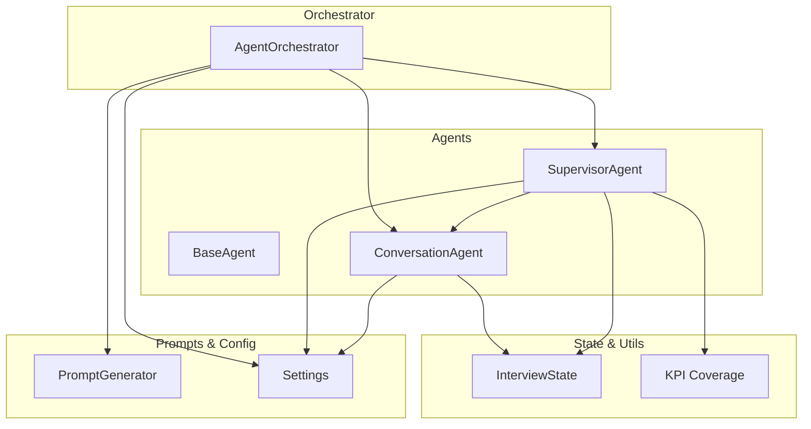
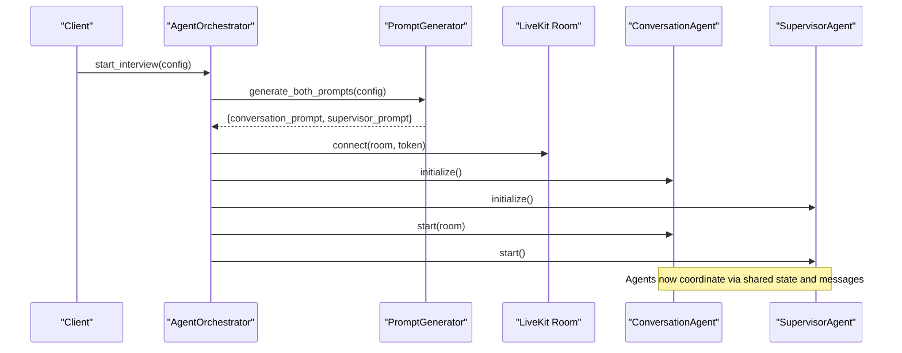
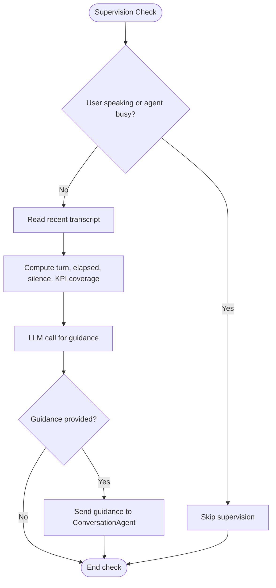
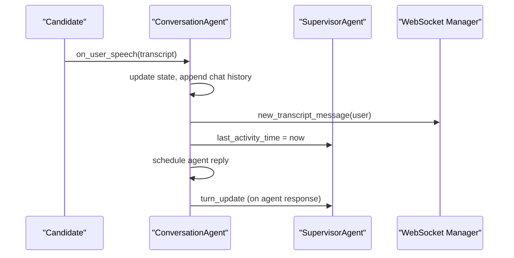
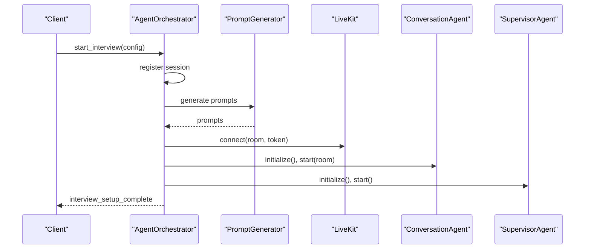
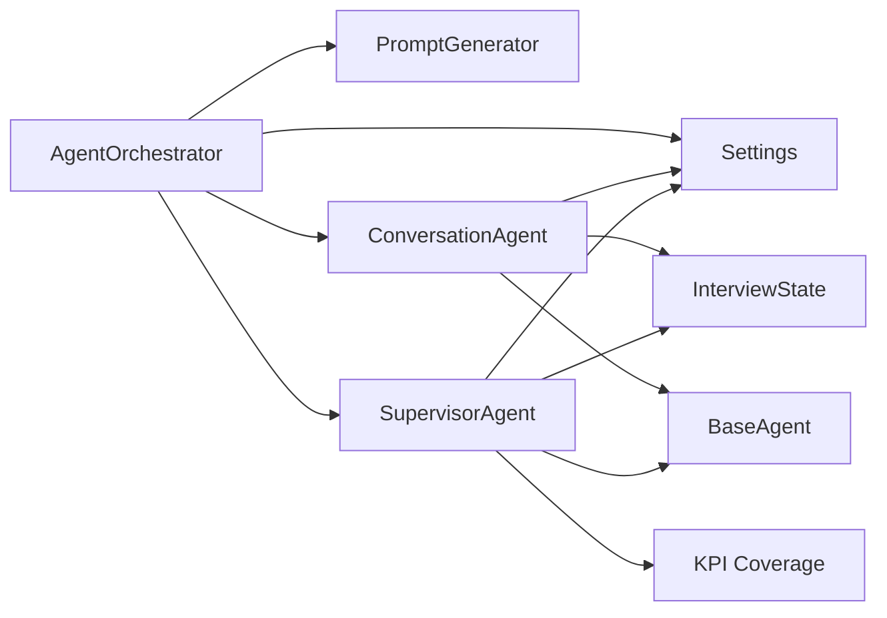

# Supervisor Coordination

<cite>
**Referenced Files in This Document**
- [supervisor.py](file://Backend/app/ai/agents/supervisor.py)
- [base.py](file://Backend/app/ai/agents/base.py)
- [conversation.py](file://Backend/app/ai/agents/conversation.py)
- [agent_orchestrator.py](file://Backend/app/ai/services/agent_orchestrator.py)
- [interview_state.py](file://Backend/app/ai/utils/interview_state.py)
- [kpi_coverage.py](file://Backend/app/ai/utils/kpi_coverage.py)
- [generator.py](file://Backend/app/ai/prompts/generator.py)
- [config.py](file://Backend/app/core/config.py)
</cite>

## Table of Contents
1. [Introduction](#introduction)
2. [Project Structure](#project-structure)
3. [Core Components](#core-components)
4. [Architecture Overview](#architecture-overview)
5. [Detailed Component Analysis](#detailed-component-analysis)
6. [Dependency Analysis](#dependency-analysis)
7. [Performance Considerations](#performance-considerations)
8. [Troubleshooting Guide](#troubleshooting-guide)
9. [Conclusion](#conclusion)

## Introduction
This document explains the supervisor agent coordination system that orchestrates multiple specialized agents during interviews. It focuses on how the supervisor monitors conversation flow, provides guidance to the interviewer agent, enforces time and KPI coverage policies, and coordinates lifecycle management through an orchestrator. It also covers initialization, agent registration, dynamic assignment, global state consistency, monitoring, debugging, and performance tuning for multi-agent scenarios.

## Project Structure
The supervisor coordination system is implemented in the backend AI module with clear separation of concerns:
- Agents: base abstraction, conversation agent (interviewer), and supervisor agent (monitor and guide).
- Orchestrator: manages session lifecycle, connects to LiveKit, initializes and starts agents, and handles cleanup.
- State utilities: shared interview state model used by both agents to maintain consistent behavior.
- Prompt generation: builds tailored prompts for both agents based on interview configuration.
- Configuration: central settings controlling supervision intervals, timing assistance, and LLM parameters.

**Diagram sources**
- [agent_orchestrator.py:29-182](file://Backend/app/ai/services/agent_orchestrator.py#L29-L182)
- [supervisor.py:20-76](file://Backend/app/ai/agents/supervisor.py#L20-L76)
- [conversation.py:184-308](file://Backend/app/ai/agents/conversation.py#L184-L308)
- [interview_state.py:22-101](file://Backend/app/ai/utils/interview_state.py#L22-L101)
- [kpi_coverage.py:54-68](file://Backend/app/ai/utils/kpi_coverage.py#L54-L68)
- [generator.py:25-59](file://Backend/app/ai/prompts/generator.py#L25-L59)
- [config.py:105-118](file://Backend/app/core/config.py#L105-L118)

**Section sources**
- [agent_orchestrator.py:29-182](file://Backend/app/ai/services/agent_orchestrator.py#L29-L182)
- [supervisor.py:20-76](file://Backend/app/ai/agents/supervisor.py#L20-L76)
- [conversation.py:184-308](file://Backend/app/ai/agents/conversation.py#L184-L308)
- [interview_state.py:22-101](file://Backend/app/ai/utils/interview_state.py#L22-L101)
- [kpi_coverage.py:54-68](file://Backend/app/ai/utils/kpi_coverage.py#L54-L68)
- [generator.py:25-59](file://Backend/app/ai/prompts/generator.py#L25-L59)
- [config.py:105-118](file://Backend/app/core/config.py#L105-L118)

## Core Components
- BaseAgent: abstract foundation providing lifecycle hooks, messaging, and minimal state tracking.
- ConversationAgent: conducts the interview via LiveKit Realtime, captures transcripts, updates shared state, and notifies the supervisor.
- SupervisorAgent: periodically inspects conversation context, computes KPI coverage, and sends targeted guidance to the conversation agent.
- AgentOrchestrator: owns session lifecycle, generates prompts, connects to LiveKit, instantiates and links agents, and ensures graceful shutdown.
- InterviewState: centralized dataclass representing phase, timers, grace periods, and flags to keep agents synchronized.
- KPI Coverage: utilities to extract KPI names, compute covered/uncovered sets, and build guardrails against repetition.
- PromptGenerator: creates persona-driven prompts for both agents from interview configuration.
- Settings: centralizes supervision intervals, timing assistance cadence, and model parameters.

Key responsibilities:
- Lifecycle: start_interview -> initialize agents -> start agents -> stop_interview -> cleanup.
- Communication: supervisor-to-conversation messages tagged as ephemeral or persistent; turn updates propagate progress.
- Global state: shared InterviewState fields ensure consistent decisions across agents regarding time, phases, and wrap-up.

**Section sources**
- [base.py:14-85](file://Backend/app/ai/agents/base.py#L14-L85)
- [conversation.py:184-308](file://Backend/app/ai/agents/conversation.py#L184-L308)
- [supervisor.py:20-76](file://Backend/app/ai/agents/supervisor.py#L20-L76)
- [agent_orchestrator.py:29-182](file://Backend/app/ai/services/agent_orchestrator.py#L29-L182)
- [interview_state.py:22-101](file://Backend/app/ai/utils/interview_state.py#L22-L101)
- [kpi_coverage.py:54-68](file://Backend/app/ai/utils/kpi_coverage.py#L54-L68)
- [generator.py:25-59](file://Backend/app/ai/prompts/generator.py#L25-L59)
- [config.py:105-118](file://Backend/app/core/config.py#L105-L118)

## Architecture Overview
The system uses a supervisor-in-the-loop pattern:
- The orchestrator bootstraps the session, generates prompts, connects to LiveKit, and starts both agents.
- The conversation agent runs the real-time interview and emits transcript events.
- The supervisor agent periodically reviews recent transcript, KPI coverage, and timing to send guidance to the conversation agent.
- Shared InterviewState keeps both agents aligned on time, phases, and wrap-up status.

**Diagram sources**
- [agent_orchestrator.py:42-182](file://Backend/app/ai/services/agent_orchestrator.py#L42-L182)
- [generator.py:33-59](file://Backend/app/ai/prompts/generator.py#L33-L59)
- [conversation.py:184-308](file://Backend/app/ai/agents/conversation.py#L184-L308)
- [supervisor.py:61-76](file://Backend/app/ai/agents/supervisor.py#L61-L76)

## Detailed Component Analysis

### SupervisorAgent
Responsibilities:
- Periodic supervision loop that reads recent transcript, computes elapsed time and silence duration, and queries an LLM for guidance.
- KPI-aware prompting to push the conversation toward uncovered KPIs and avoid repetition.
- Timing assistance and completion countdown to enforce interview length and transition to closing.
- Graceful handling of user speech and agent busy states to avoid interrupting active turns.

Key behaviors:
- Skips supervision when user is speaking or agent is busy to prevent overlapping speech.
- Uses tags to distinguish persistent vs ephemeral guidance.
- Triggers questioning ended phase and fallback wrap-up if needed.

**Diagram sources**
- [supervisor.py:137-269](file://Backend/app/ai/agents/supervisor.py#L137-L269)
- [supervisor.py:270-331](file://Backend/app/ai/agents/supervisor.py#L270-L331)
- [supervisor.py:362-456](file://Backend/app/ai/agents/supervisor.py#L362-L456)

**Section sources**
- [supervisor.py:137-269](file://Backend/app/ai/agents/supervisor.py#L137-L269)
- [supervisor.py:270-331](file://Backend/app/ai/agents/supervisor.py#L270-L331)
- [supervisor.py:362-456](file://Backend/app/ai/agents/supervisor.py#L362-L456)
- [supervisor.py:496-561](file://Backend/app/ai/agents/supervisor.py#L496-L561)
- [supervisor.py:566-671](file://Backend/app/ai/agents/supervisor.py#L566-L671)

### ConversationAgent
Responsibilities:
- Manages real-time audio transcription and TTS via LiveKit.
- Captures user and agent speech into a chat history and persists it incrementally.
- Updates shared InterviewState to reflect phases, timers, and activity.
- Notifies the supervisor on turn completion and resets supervisor activity timestamps.

Key interactions:
- Emits websocket events for live transcript updates.
- Handles end-interview confirmation flows and late user speech after time up.
- Coordinates with supervisor via message passing and shared state.

**Diagram sources**
- [conversation.py:312-571](file://Backend/app/ai/agents/conversation.py#L312-L571)
- [conversation.py:204-308](file://Backend/app/ai/agents/conversation.py#L204-L308)

**Section sources**
- [conversation.py:204-308](file://Backend/app/ai/agents/conversation.py#L204-L308)
- [conversation.py:312-571](file://Backend/app/ai/agents/conversation.py#L312-L571)

### AgentOrchestrator
Responsibilities:
- Owns the interview session lifecycle: setup, agent creation, room connection, startup, and teardown.
- Generates prompts and shares HTTP sessions for plugin stability.
- Persists audio/video paths and triggers post-interview rating generation.
- Provides resume support by refreshing persisted transcripts before setup.

Key flows:
- start_interview schedules background setup and signals frontend progress.
- _run_setup_sequence performs prompt generation, LiveKit connection, agent instantiation, and startup.
- stop_interview cancels tasks, stops agents, disconnects room, and cleans resources.

**Diagram sources**
- [agent_orchestrator.py:42-182](file://Backend/app/ai/services/agent_orchestrator.py#L42-L182)
- [agent_orchestrator.py:244-281](file://Backend/app/ai/services/agent_orchestrator.py#L244-L281)
- [agent_orchestrator.py:329-361](file://Backend/app/ai/services/agent_orchestrator.py#L329-L361)

**Section sources**
- [agent_orchestrator.py:42-182](file://Backend/app/ai/services/agent_orchestrator.py#L42-L182)
- [agent_orchestrator.py:244-281](file://Backend/app/ai/services/agent_orchestrator.py#L244-L281)
- [agent_orchestrator.py:329-361](file://Backend/app/ai/services/agent_orchestrator.py#L329-L361)

### InterviewState
Responsibilities:
- Centralized representation of conversation phase, timer, grace periods, and wrap-up flags.
- Methods to compute elapsed/remaining time, detect time warnings, and manage no-new-questions phase.
- Support for resuming timers from persisted transcripts.

Consistency guarantees:
- Both agents read/write shared fields to ensure synchronized behavior around time and phases.
- Grace period and post-time behaviors are enforced to allow candidate finishing answers without starting new questions.

**Section sources**
- [interview_state.py:22-101](file://Backend/app/ai/utils/interview_state.py#L22-L101)
- [interview_state.py:124-186](file://Backend/app/ai/utils/interview_state.py#L124-L186)
- [interview_state.py:208-272](file://Backend/app/ai/utils/interview_state.py#L208-L272)

### KPI Coverage
Responsibilities:
- Extract KPI names from config and plan.
- Compute covered vs uncovered KPIs from agent text.
- Build anti-repeat guards and domain boundary instructions to keep the conversation focused.

Integration points:
- Supervisor uses coverage to prioritize next KPI and avoid repetitive questioning.
- Conversation agent injects coverage guards into per-turn logic.

**Section sources**
- [kpi_coverage.py:9-31](file://Backend/app/ai/utils/kpi_coverage.py#L9-L31)
- [kpi_coverage.py:54-68](file://Backend/app/ai/utils/kpi_coverage.py#L54-L68)
- [kpi_coverage.py:101-169](file://Backend/app/ai/utils/kpi_coverage.py#L101-L169)
- [kpi_coverage.py:172-235](file://Backend/app/ai/utils/kpi_coverage.py#L172-L235)

### PromptGenerator
Responsibilities:
- Generate persona and fill templates for both conversation and supervisor agents.
- Ensure consistent interviewer identity and include interview-specific details.

Usage:
- Called by orchestrator during setup to produce prompts passed into agent constructors.

**Section sources**
- [generator.py:25-59](file://Backend/app/ai/prompts/generator.py#L25-L59)
- [generator.py:61-107](file://Backend/app/ai/prompts/generator.py#L61-L107)
- [generator.py:143-217](file://Backend/app/ai/prompts/generator.py#L143-L217)

### BaseAgent
Responsibilities:
- Provide common lifecycle methods (initialize, start, stop) and messaging primitives.
- Maintain minimal state and logging helpers.

Role in coordination:
- Supervisor and conversation agents inherit this base to standardize lifecycle and inter-agent messaging.

**Section sources**
- [base.py:14-85](file://Backend/app/ai/agents/base.py#L14-L85)

## Dependency Analysis
The following diagram shows key dependencies between components:

**Diagram sources**
- [agent_orchestrator.py:29-182](file://Backend/app/ai/services/agent_orchestrator.py#L29-L182)
- [conversation.py:184-308](file://Backend/app/ai/agents/conversation.py#L184-L308)
- [supervisor.py:20-76](file://Backend/app/ai/agents/supervisor.py#L20-L76)
- [interview_state.py:22-101](file://Backend/app/ai/utils/interview_state.py#L22-L101)
- [kpi_coverage.py:54-68](file://Backend/app/ai/utils/kpi_coverage.py#L54-L68)
- [config.py:105-118](file://Backend/app/core/config.py#L105-L118)

**Section sources**
- [agent_orchestrator.py:29-182](file://Backend/app/ai/services/agent_orchestrator.py#L29-L182)
- [conversation.py:184-308](file://Backend/app/ai/agents/conversation.py#L184-L308)
- [supervisor.py:20-76](file://Backend/app/ai/agents/supervisor.py#L20-L76)
- [interview_state.py:22-101](file://Backend/app/ai/utils/interview_state.py#L22-L101)
- [kpi_coverage.py:54-68](file://Backend/app/ai/utils/kpi_coverage.py#L54-L68)
- [config.py:105-118](file://Backend/app/core/config.py#L105-L118)

## Performance Considerations
- Supervision interval: Adjust supervisor_check_interval to balance responsiveness and API cost. Larger intervals reduce LLM calls but may delay guidance.
- Timing assistance cadence: timing_assistance_interval_seconds controls how often timing-related guidance is generated; tune based on desired verbosity.
- Model parameters: supervisor_model_temperature and supervisor_model_max_tokens influence guidance quality and token usage.
- Transcript size: Supervisor reads recent transcript entries; limiting lookback reduces payload size and latency.
- Concurrency: Supervisor and conversation run concurrently; ensure timeouts and cancellation paths are robust to avoid resource leaks.
- WebSocket throughput: Frequent transcript updates can be heavy; consider batching or throttling if needed.

[No sources needed since this section provides general guidance]

## Troubleshooting Guide
Common issues and diagnostics:
- Supervisor not sending guidance:
  - Check if user is speaking or agent is busy; supervision skips during active turns.
  - Verify supervisor_check_interval and that the supervision loop is running.
  - Inspect LLM errors and model configuration.
- Time-based ending not triggered:
  - Confirm InterviewState.start_time is set and timer_started is true.
  - Validate remaining time calculations and grace period flags.
- Duplicate or stale guidance:
  - Ensure ephemeral guidance is sanitized and does not contain stale timing lines.
  - Review conversation agent’s deduplication logic for repeated user transcripts.
- Session cleanup failures:
  - Ensure stop_interview cancels all tasks and closes HTTP/LiveKit resources.
  - Check for exceptions during agent.stop and room.disconnect.

Monitoring tips:
- Use logs for supervision checks, guidance messages, and timing assistance.
- Track websocket events for transcript updates and agent speech events.
- Persist transcripts incrementally to recover state on resume.

**Section sources**
- [supervisor.py:137-269](file://Backend/app/ai/agents/supervisor.py#L137-L269)
- [supervisor.py:496-561](file://Backend/app/ai/agents/supervisor.py#L496-L561)
- [conversation.py:312-571](file://Backend/app/ai/agents/conversation.py#L312-L571)
- [agent_orchestrator.py:244-281](file://Backend/app/ai/services/agent_orchestrator.py#L244-L281)

## Conclusion
The supervisor coordination system provides robust oversight of multi-agent interviews by combining periodic LLM-based guidance, strict time enforcement, and KPI coverage strategies. The orchestrator ensures reliable lifecycle management, while shared state maintains consistency across agents. With configurable intervals and model parameters, teams can tune performance and behavior to meet operational needs. Proper monitoring and troubleshooting practices help maintain stable, high-quality interview experiences.

[No sources needed since this section summarizes without analyzing specific files]