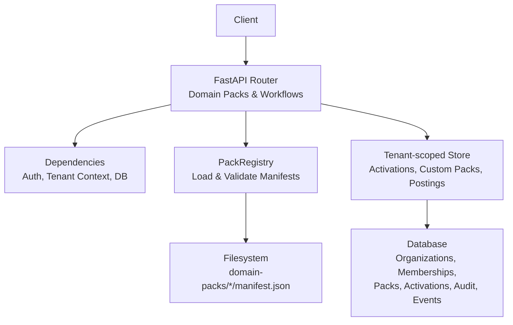
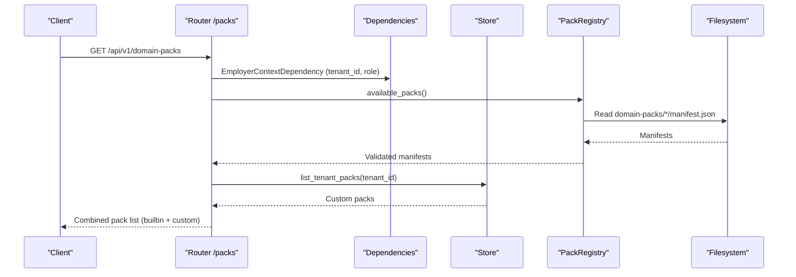
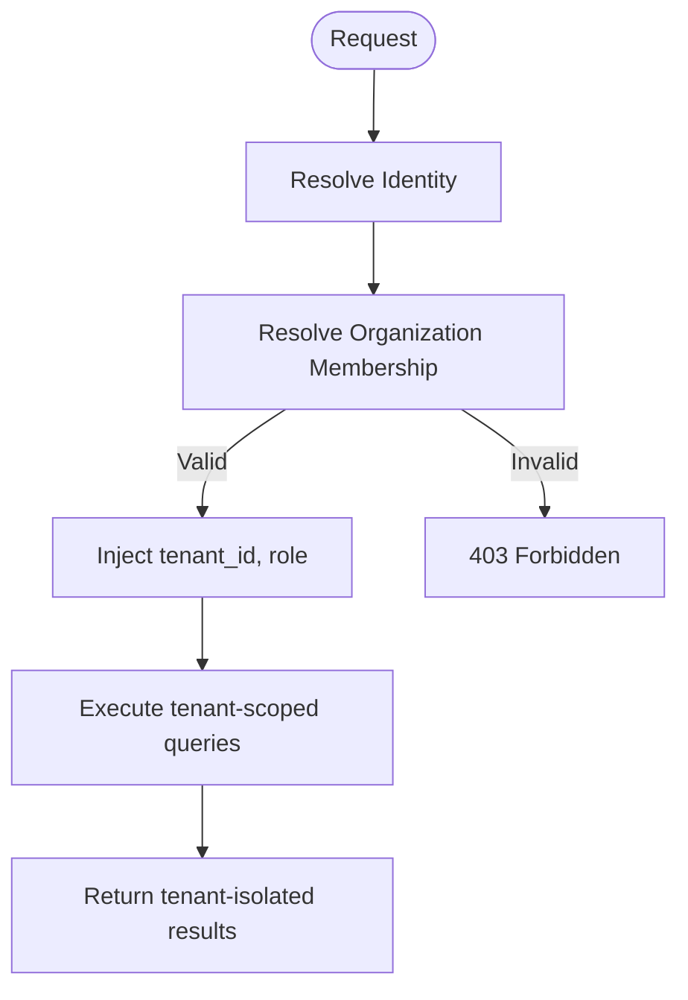
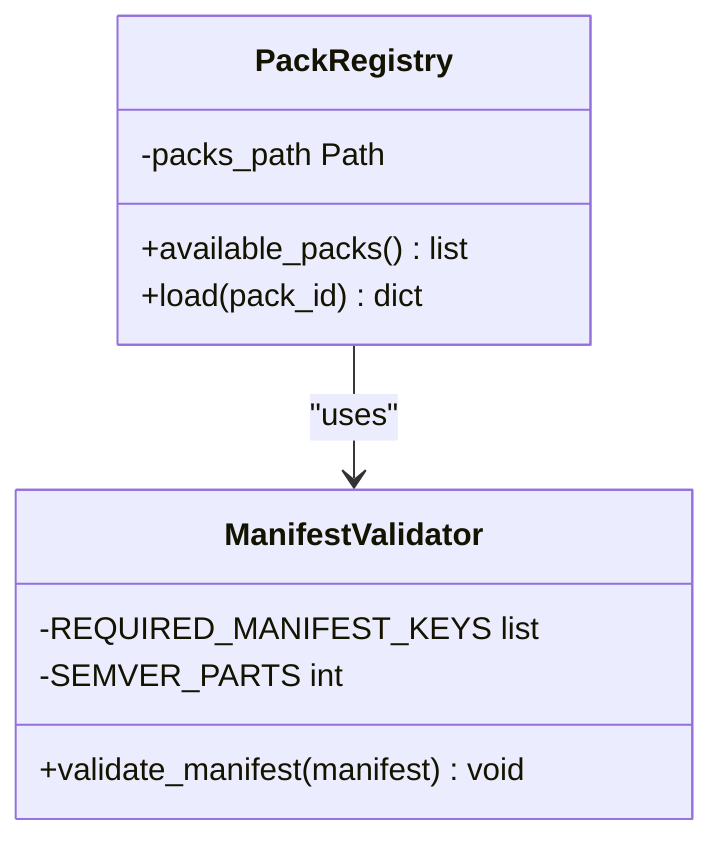
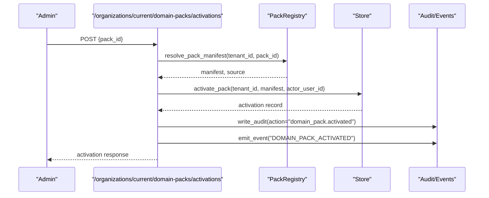
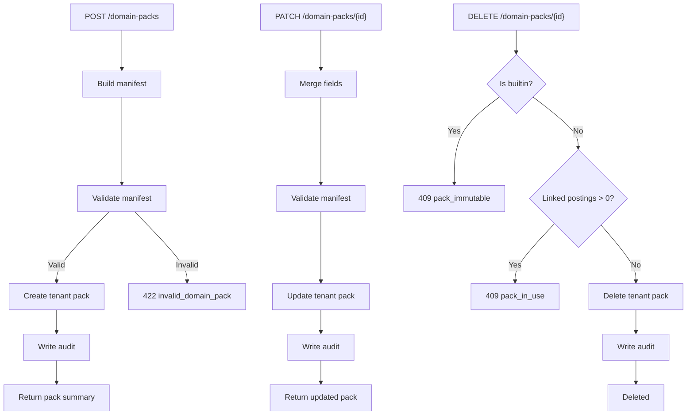
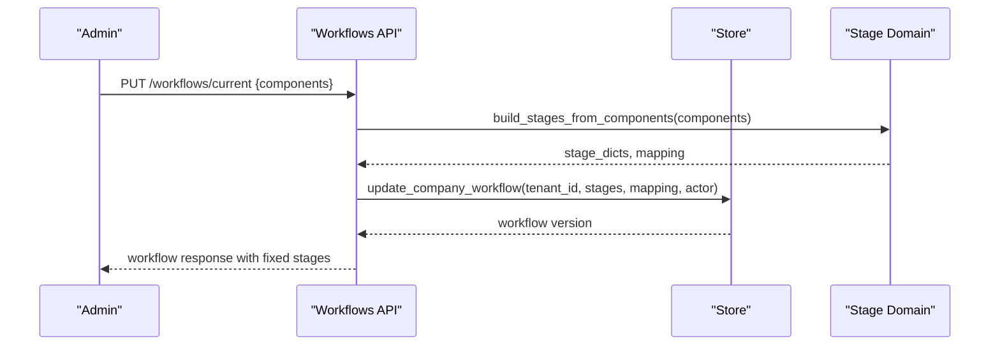
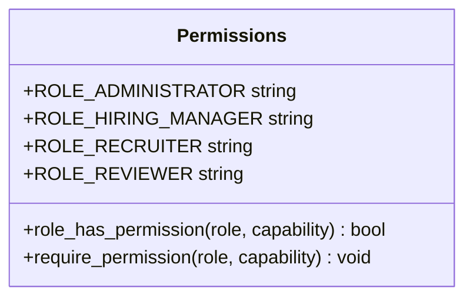
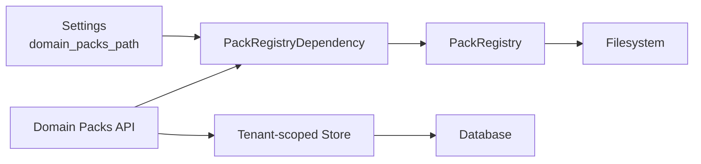

# Multi-tenancy & Domain Packs Design

<cite>
**Referenced Files in This Document**
- [Backend/app/api/v1/packs.py](file://Backend/app/api/v1/packs.py)
- [Backend/app/services/packs.py](file://Backend/app/services/packs.py)
- [Backend/app/db/store.py](file://Backend/app/db/store.py)
- [Backend/app/api/dependencies.py](file://Backend/app/api/dependencies.py)
- [Backend/app/domain/permissions.py](file://Backend/app/domain/permissions.py)
- [Backend/app/core/config.py](file://Backend/app/core/config.py)
- [domain-packs/education/manifest.json](file://domain-packs/education/manifest.json)
- [domain-packs/software-engineering/manifest.json](file://domain-packs/software-engineering/manifest.json)
- [Backend/tests/test_tenancy.py](file://Backend/tests/test_tenancy.py)
- [Backend/tests/test_workflows_and_packs.py](file://Backend/tests/test_workflows_and_packs.py)
</cite>

## Table of Contents
1. Introduction
2. Project Structure
3. Core Components
4. Architecture Overview
5. Detailed Component Analysis
6. Dependency Analysis
7. Performance Considerations
8. Troubleshooting Guide
9. Conclusion

## Introduction
This document explains the multi-tenancy and domain packs design implemented in the ATS backend. It focuses on:
- Organization isolation pattern that ensures data security and tenant separation across organizations
- Domain pack system architecture, including manifest structure, pack loading, validation, and runtime configuration management
- Pack registry, activation, and extension points for custom domain packs
- Data segregation strategies, permission models, and resource allocation patterns for multi-tenant environments
- Concrete examples from the codebase showing how domain packs provide industry-specific question generation, evaluation criteria, and workflow customization

## Project Structure
The relevant parts of the project are organized as follows:
- API layer exposes endpoints for listing, creating, updating, deleting, and activating domain packs; also manages workflows per organization
- Services layer provides the domain pack registry and manifest validation
- Database layer (store) implements tenant-scoped persistence helpers for organizations, memberships, domain pack activations, custom tenant packs, and related resources
- Configuration defines settings such as the domain packs path and environment-specific behavior
- Domain packs are defined as JSON manifests under a dedicated directory and validated against a strict schema
- Tests validate cross-tenant isolation and domain pack behaviors

**Diagram sources**
- [Backend/app/api/v1/packs.py:63-104](file://Backend/app/api/v1/packs.py#L63-L104)
- [Backend/app/services/packs.py:64-96](file://Backend/app/services/packs.py#L64-L96)
- [Backend/app/db/store.py:649-790](file://Backend/app/db/store.py#L649-L790)
- [Backend/app/core/config.py:35-41](file://Backend/app/core/config.py#L35-L41)

**Section sources**
- [Backend/app/api/v1/packs.py:63-104](file://Backend/app/api/v1/packs.py#L63-L104)
- [Backend/app/services/packs.py:1-96](file://Backend/app/services/packs.py#L1-L96)
- [Backend/app/db/store.py:649-790](file://Backend/app/db/store.py#L649-L790)
- [Backend/app/core/config.py:35-41](file://Backend/app/core/config.py#L35-L41)

## Core Components
- Domain Pack Registry: Loads built-in pack manifests from the configured directory, validates them, and serves content to engine services without direct imports
- Pack Activation: Per-organization activation of a specific pack version with audit and event emission
- Custom Tenant Packs: Organizations can create, update, and delete their own packs, guarded by role checks and uniqueness constraints
- Workflow Management: Per-organization hiring workflows composed from components, with fixed stages and versioning
- Multi-tenancy Enforcement: Every request is scoped to an organization via context dependency; all queries include tenant predicates; tests verify no cross-tenant leakage

Key responsibilities:
- Validation: Strict manifest schema enforcement with semantic versioning and required sections
- Isolation: All reads/writes use tenant_id; forbidden access returns nondisclosing errors
- Extensibility: Built-in packs are immutable; custom packs allow tenant-specific customization

**Section sources**
- [Backend/app/services/packs.py:15-62](file://Backend/app/services/packs.py#L15-L62)
- [Backend/app/api/v1/packs.py:222-414](file://Backend/app/api/v1/packs.py#L222-L414)
- [Backend/app/db/store.py:649-790](file://Backend/app/db/store.py#L649-L790)
- [Backend/app/api/dependencies.py:125-162](file://Backend/app/api/dependencies.py#L125-L162)
- [Backend/tests/test_tenancy.py:19-71](file://Backend/tests/test_tenancy.py#L19-L71)

## Architecture Overview
The system enforces multi-tenancy at every layer:
- Request authentication resolves user identity and organization membership
- Employer context dependency injects tenant_id and role into handlers
- Handlers call store functions that always scope queries by tenant_id
- Pack registry loads built-in packs from filesystem; custom packs are stored per tenant
- Activations pin a pack version per tenant; postings link to pack_id and snapshot workflow versions

**Diagram sources**
- [Backend/app/api/v1/packs.py:63-83](file://Backend/app/api/v1/packs.py#L63-L83)
- [Backend/app/services/packs.py:68-79](file://Backend/app/services/packs.py#L68-L79)
- [Backend/app/db/store.py:727-739](file://Backend/app/db/store.py#L727-L739)
- [Backend/app/api/dependencies.py:125-162](file://Backend/app/api/dependencies.py#L125-L162)

## Detailed Component Analysis

### Multi-tenancy and Organization Isolation
- Identity resolution: Access tokens or development headers resolve to a user; users must have an active membership in a verified organization to proceed
- Employer context: Resolves tenant_id and role; denies access if membership is missing or organization is not verified
- Tenant scoping: All store operations require tenant_id; queries filter by tenant_id; tests assert cross-tenant denial and nondisclosing responses

**Diagram sources**
- [Backend/app/api/dependencies.py:49-114](file://Backend/app/api/dependencies.py#L49-L114)
- [Backend/app/api/dependencies.py:125-162](file://Backend/app/api/dependencies.py#L125-L162)
- [Backend/tests/test_tenancy.py:19-71](file://Backend/tests/test_tenancy.py#L19-L71)

**Section sources**
- [Backend/app/api/dependencies.py:49-114](file://Backend/app/api/dependencies.py#L49-L114)
- [Backend/app/api/dependencies.py:125-162](file://Backend/app/api/dependencies.py#L125-L162)
- [Backend/tests/test_tenancy.py:19-71](file://Backend/tests/test_tenancy.py#L19-L71)

### Domain Pack Registry and Manifest Validation
- Registry scans the configured directory for pack manifests, validates each, and lists available packs
- Loading a specific pack validates JSON and schema, returning a manifest or raising appropriate errors
- Validation enforces required keys, semantic versioning, non-empty questions, and allowed task styles

**Diagram sources**
- [Backend/app/services/packs.py:15-62](file://Backend/app/services/packs.py#L15-L62)
- [Backend/app/services/packs.py:64-96](file://Backend/app/services/packs.py#L64-L96)

**Section sources**
- [Backend/app/services/packs.py:15-62](file://Backend/app/services/packs.py#L15-L62)
- [Backend/app/services/packs.py:64-96](file://Backend/app/services/packs.py#L64-L96)

### Pack Activation and Runtime Configuration
- Activation pins a pack (builtin or custom) per tenant with version and manifest snapshot
- Activation emits an outbox event and writes audit records for traceability
- Active pack retrieval returns the latest activation per tenant

**Diagram sources**
- [Backend/app/api/v1/packs.py:421-472](file://Backend/app/api/v1/packs.py#L421-L472)
- [Backend/app/db/store.py:649-687](file://Backend/app/db/store.py#L649-L687)
- [Backend/app/db/store.py:216-276](file://Backend/app/db/store.py#L216-L276)

**Section sources**
- [Backend/app/api/v1/packs.py:421-472](file://Backend/app/api/v1/packs.py#L421-L472)
- [Backend/app/db/store.py:649-687](file://Backend/app/db/store.py#L649-L687)
- [Backend/app/db/store.py:216-276](file://Backend/app/db/store.py#L216-L276)

### Custom Domain Packs CRUD and Guardrails
- Create: Builds manifest from request, validates, stores per tenant, audits creation
- Update: Merges fields, bumps patch version when unspecified, validates, updates, audits
- Delete: Prevents deletion of built-in packs; prevents deletion if linked to any postings; audits deletion
- Role gating: Only administrators can manage packs

**Diagram sources**
- [Backend/app/api/v1/packs.py:222-414](file://Backend/app/api/v1/packs.py#L222-L414)
- [Backend/app/db/store.py:690-790](file://Backend/app/db/store.py#L690-L790)

**Section sources**
- [Backend/app/api/v1/packs.py:222-414](file://Backend/app/api/v1/packs.py#L222-L414)
- [Backend/app/db/store.py:690-790](file://Backend/app/db/store.py#L690-L790)

### Industry-Specific Question Generation and Evaluation Criteria
- Education pack includes domain skills, certifications, concepts, resume extraction signals, matching weights, profile and applied interview questions, and rubric dimensions
- Software engineering pack similarly defines domain ontology, interview questions, and evaluation rubrics
- These manifests drive AI-assisted question generation and scoring aligned to industry practices

Concrete examples:
- Education pack demonstrates scenario-based questions for curriculum design, assessment, academic integrity, and inclusive teaching
- Software engineering pack covers incident response, API design, system design, observability, and delivery judgment

**Section sources**
- [domain-packs/education/manifest.json:1-143](file://domain-packs/education/manifest.json#L1-L143)
- [domain-packs/software-engineering/manifest.json:1-140](file://domain-packs/software-engineering/manifest.json#L1-L140)

### Workflow Customization and Integration with Packs
- Workflows are per-organization and composed from catalog components; fixed stages ensure consistent lifecycle states
- When posting is created with a pack_id, the system captures pack metadata and snapshots the current workflow version
- Tests demonstrate component selection, default workflow creation, and integration with pack activation

**Diagram sources**
- [Backend/app/api/v1/workflows.py:25-40](file://Backend/app/api/v1/workflows.py#L25-L40)
- [Backend/app/api/v1/workflows.py:91-122](file://Backend/app/api/v1/workflows.py#L91-L122)

**Section sources**
- [Backend/app/api/v1/workflows.py:60-156](file://Backend/app/api/v1/workflows.py#L60-L156)
- [Backend/tests/test_workflows_and_packs.py:14-65](file://Backend/tests/test_workflows_and_packs.py#L14-L65)

### Permission Model and Role-Based Access Control
- Roles: administrator, hiring_manager, recruiter, reviewer
- Capabilities: manage_org, manage_packs, manage_jobs, pipeline, invite_interview, scorecard, view_audit
- Require role checks on pack management endpoints; only administrators can create/update/delete/activate packs

**Diagram sources**
- [Backend/app/domain/permissions.py:7-64](file://Backend/app/domain/permissions.py#L7-L64)

**Section sources**
- [Backend/app/domain/permissions.py:7-64](file://Backend/app/domain/permissions.py#L7-L64)
- [Backend/app/api/v1/packs.py:222-414](file://Backend/app/api/v1/packs.py#L222-L414)

### Data Segregation Strategies
- Tenant-scoped tables: organizations, memberships, units, tenant_domain_packs, domain_pack_activations, audit_records, outbox_events
- Queries always include tenant_id filters; indexes optimize tenant-scoped lookups
- Cross-tenant access denied with nondisclosing error codes/messages; tests assert identical responses for existing vs nonexistent org IDs

**Section sources**
- [Backend/app/db/store.py:328-435](file://Backend/app/db/store.py#L328-L435)
- [Backend/app/db/store.py:649-790](file://Backend/app/db/store.py#L649-L790)
- [Backend/tests/test_tenancy.py:27-71](file://Backend/tests/test_tenancy.py#L27-L71)

### Resource Allocation Patterns
- Pack activation pins a version per tenant, enabling stable behavior for postings and evaluations
- Matching weights in manifests influence scoring between CV match and interview scores
- Resume extraction rules and ontology guide candidate profiling and search relevance

**Section sources**
- [domain-packs/education/manifest.json:43-49](file://domain-packs/education/manifest.json#L43-L49)
- [domain-packs/software-engineering/manifest.json:40-46](file://domain-packs/software-engineering/manifest.json#L40-L46)
- [Backend/app/api/v1/packs.py:421-472](file://Backend/app/api/v1/packs.py#L421-L472)

## Dependency Analysis
- API depends on dependencies for auth, tenant context, and pack registry injection
- Pack endpoints depend on store for tenant-scoped pack and activation operations
- Registry depends on filesystem for built-in manifests and validation logic
- Configuration supplies domain_packs_path and environment settings

**Diagram sources**
- [Backend/app/core/config.py:35-41](file://Backend/app/core/config.py#L35-L41)
- [Backend/app/api/dependencies.py:204-208](file://Backend/app/api/dependencies.py#L204-L208)
- [Backend/app/api/v1/packs.py:6-16](file://Backend/app/api/v1/packs.py#L6-L16)
- [Backend/app/services/packs.py:64-96](file://Backend/app/services/packs.py#L64-L96)
- [Backend/app/db/store.py:649-790](file://Backend/app/db/store.py#L649-L790)

**Section sources**
- [Backend/app/core/config.py:35-41](file://Backend/app/core/config.py#L35-L41)
- [Backend/app/api/dependencies.py:204-208](file://Backend/app/api/dependencies.py#L204-L208)
- [Backend/app/api/v1/packs.py:6-16](file://Backend/app/api/v1/packs.py#L6-L16)
- [Backend/app/services/packs.py:64-96](file://Backend/app/services/packs.py#L64-L96)
- [Backend/app/db/store.py:649-790](file://Backend/app/db/store.py#L649-L790)

## Performance Considerations
- Manifest scanning: The registry globs the domain-packs directory; keep the number of packs reasonable to avoid excessive I/O
- Validation overhead: Each manifest is parsed and validated; caching validated manifests could reduce repeated parsing in high-throughput scenarios
- Tenant-scoped queries: Ensure proper indexing on tenant_id columns for fast filtering; store functions already use indexed queries where applicable
- Event emission: Outbox events are written within transactions; ensure background processors handle events efficiently to avoid blocking requests

[No sources needed since this section provides general guidance]

## Troubleshooting Guide
Common issues and resolutions:
- Invalid domain pack manifest: Ensure required keys exist, pack_version is semver, questions are non-empty lists, and task_style is allowed
- Pack ID reserved: Cannot create custom pack with same id as builtin; choose a unique pack_id
- Pack already exists: Custom pack with same id exists for tenant; update instead of create
- Pack immutable: Built-in packs cannot be edited or deleted; create a custom override if needed
- Pack in use: Cannot delete a pack linked to postings; unlink or modify postings first
- Forbidden access: Verify role has manage_packs capability; only administrators can manage packs
- Cross-tenant access denied: Ensure X-Organization-Id header matches a verified organization where the user has an active membership

**Section sources**
- [Backend/app/services/packs.py:29-62](file://Backend/app/services/packs.py#L29-L62)
- [Backend/app/api/v1/packs.py:222-414](file://Backend/app/api/v1/packs.py#L222-L414)
- [Backend/app/domain/permissions.py:27-64](file://Backend/app/domain/permissions.py#L27-L64)
- [Backend/tests/test_tenancy.py:19-71](file://Backend/tests/test_tenancy.py#L19-L71)

## Conclusion
The ATS backend implements a robust multi-tenancy model with strict organization isolation and a flexible domain pack system. Built-in packs provide industry-specific question sets and evaluation rubrics, while custom packs enable tenant-specific customization. Pack activation pins versions per organization, ensuring stable behavior for postings and evaluations. Role-based permissions and tenant-scoped storage enforce security and data segregation. The design supports extensibility through clear extension points for creating custom domain packs and integrating with workflows and AI-driven processes.