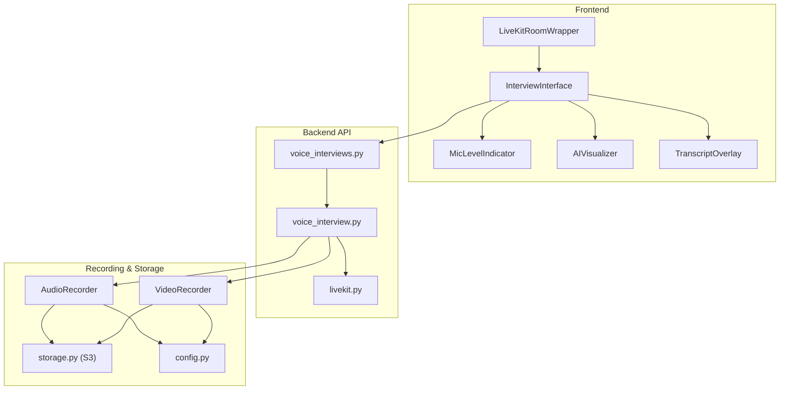
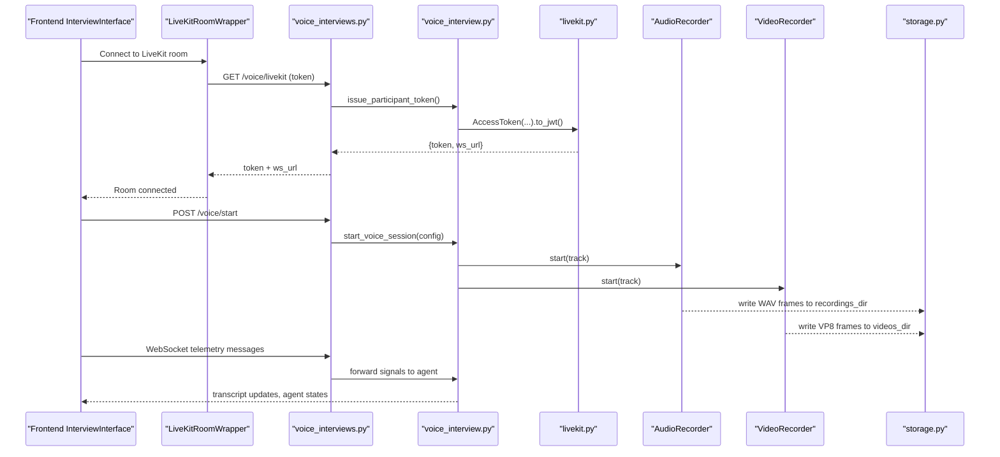
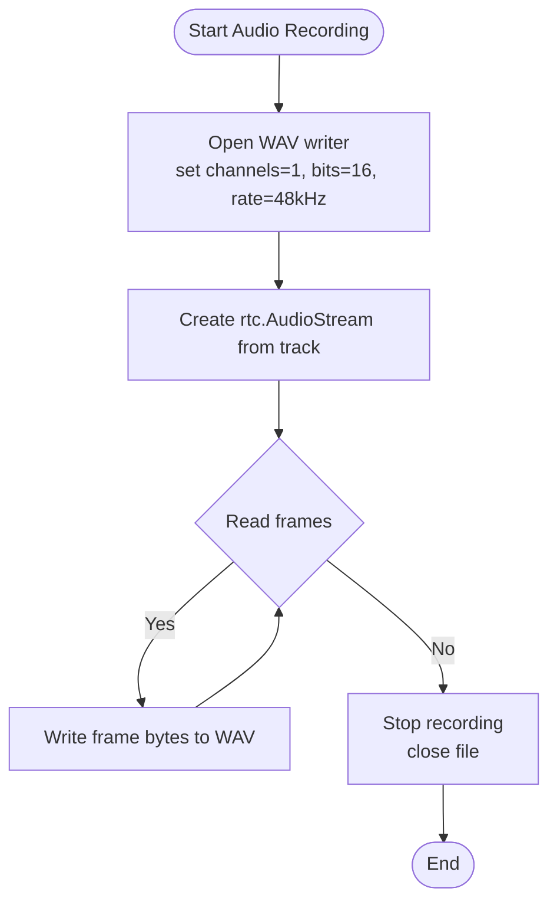
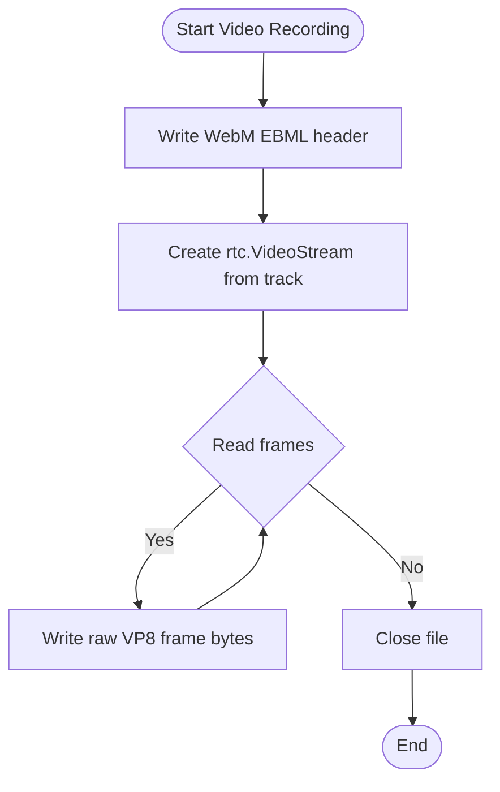
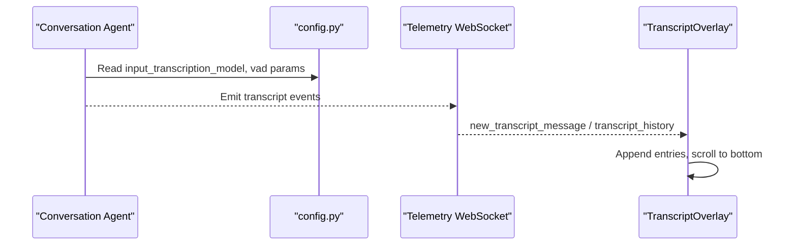
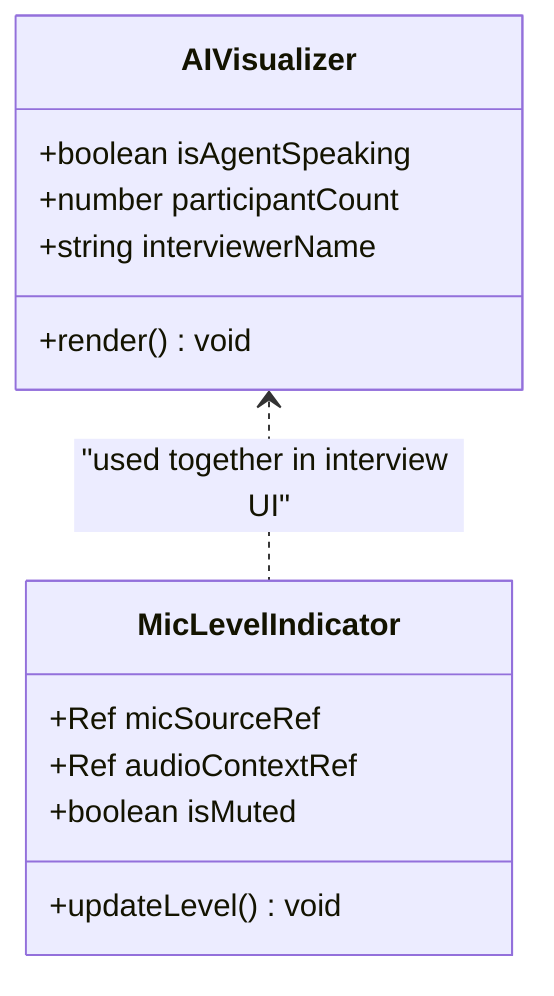
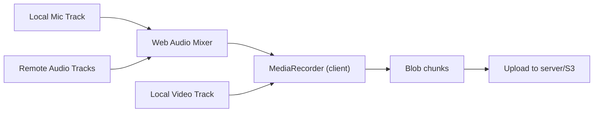
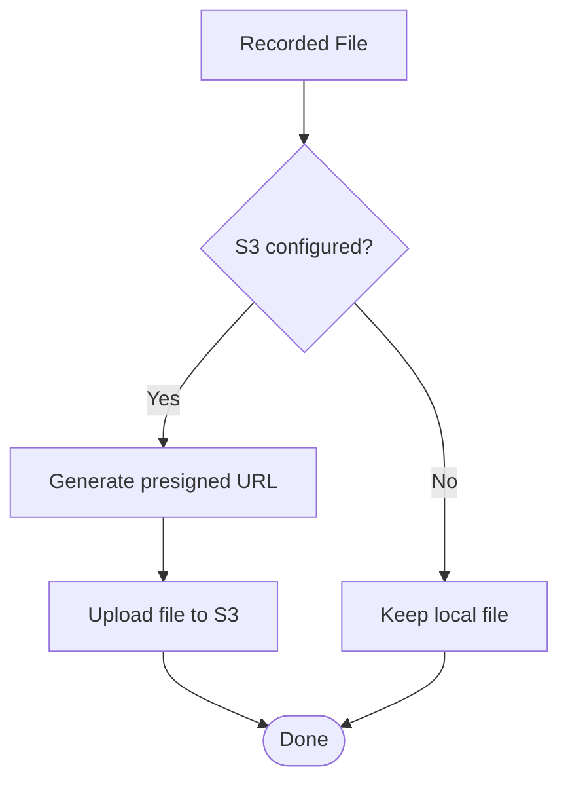
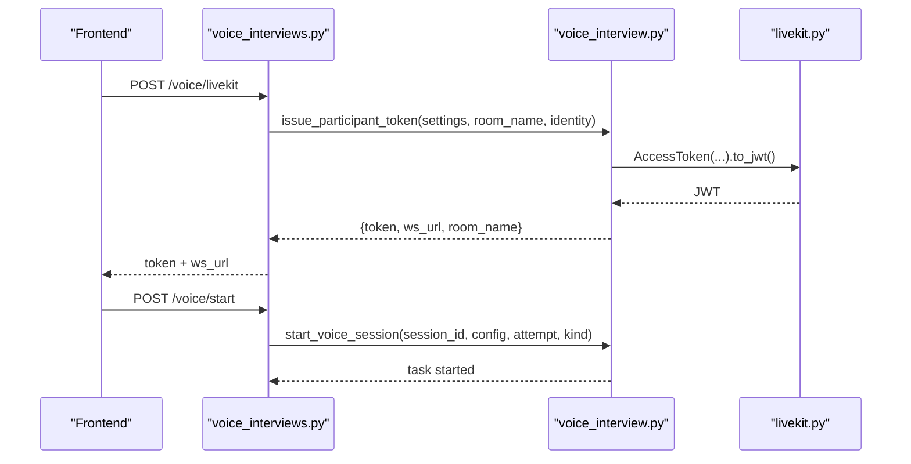
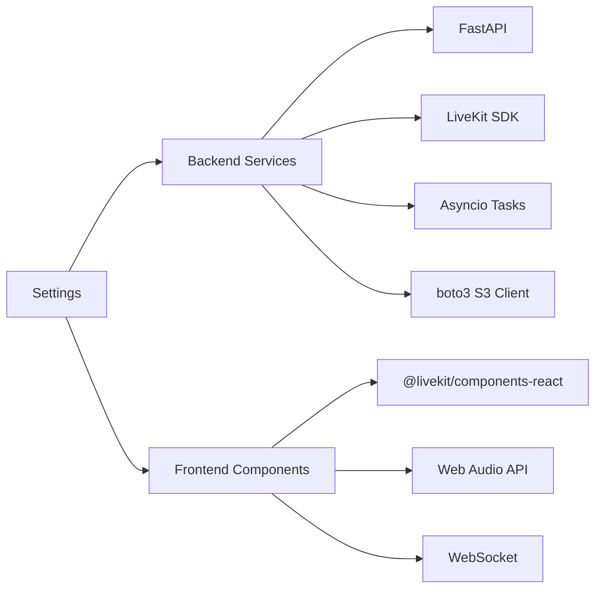

# Audio/Video Media Processing

<cite>
**Referenced Files in This Document**
- [audio_recorder.py](file://Backend/app/ai/utils/audio_recorder.py)
- [video_recorder.py](file://Backend/app/ai/utils/video_recorder.py)
- [voice_interview.py](file://Backend/app/services/voice_interview.py)
- [livekit.py](file://Backend/app/services/livekit.py)
- [storage.py](file://Backend/app/services/storage.py)
- [config.py](file://Backend/app/core/config.py)
- [voice_interviews.py](file://Backend/app/api/v1/voice_interviews.py)
- [InterviewInterface.tsx](file://Frontend/components/interviews/voice/InterviewInterface.tsx)
- [AIVisualizer.tsx](file://Frontend/components/interviews/voice/AIVisualizer.tsx)
- [MicLevelIndicator.tsx](file://Frontend/components/interviews/voice/MicLevelIndicator.tsx)
- [LiveKitRoomWrapper.tsx](file://Frontend/components/interviews/voice/LiveKitRoomWrapper.tsx)
- [TranscriptOverlay.tsx](file://Frontend/components/interviews/voice/TranscriptOverlay.tsx)
</cite>

## Table of Contents
1. Introduction
2. Project Structure
3. Core Components
4. Architecture Overview
5. Detailed Component Analysis
6. Dependency Analysis
7. Performance Considerations
8. Troubleshooting Guide
9. Conclusion

## Introduction
This document explains the audio and video media processing capabilities used by the interview system. It covers how microphone input is captured, how audio and video tracks are recorded and stored, how transcription is integrated via real-time services, and how the AI visualizer provides real-time feedback during interviews. It also details media stream pipelines, format handling, storage management, and performance techniques for live sessions with large media files.

## Project Structure
The media pipeline spans frontend components that capture and visualize media, a backend service layer that orchestrates LiveKit rooms and agents, and utilities that record streams to disk or cloud storage.

**Diagram sources**
- [LiveKitRoomWrapper.tsx:1-104](file://Frontend/components/interviews/voice/LiveKitRoomWrapper.tsx#L1-L104)
- [InterviewInterface.tsx:1-800](file://Frontend/components/interviews/voice/InterviewInterface.tsx#L1-L800)
- [voice_interviews.py:1-416](file://Backend/app/api/v1/voice_interviews.py#L1-L416)
- [voice_interview.py:1-272](file://Backend/app/services/voice_interview.py#L1-L272)
- [livekit.py:1-39](file://Backend/app/services/livekit.py#L1-L39)
- [audio_recorder.py:1-98](file://Backend/app/ai/utils/audio_recorder.py#L1-L98)
- [video_recorder.py:1-116](file://Backend/app/ai/utils/video_recorder.py#L1-L116)
- [storage.py:1-61](file://Backend/app/services/storage.py#L1-L61)
- [config.py:1-215](file://Backend/app/core/config.py#L1-L215)

**Section sources**
- [LiveKitRoomWrapper.tsx:1-104](file://Frontend/components/interviews/voice/LiveKitRoomWrapper.tsx#L1-L104)
- [InterviewInterface.tsx:1-800](file://Frontend/components/interviews/voice/InterviewInterface.tsx#L1-L800)
- [voice_interviews.py:1-416](file://Backend/app/api/v1/voice_interviews.py#L1-L416)
- [voice_interview.py:1-272](file://Backend/app/services/voice_interview.py#L1-L272)
- [livekit.py:1-39](file://Backend/app/services/livekit.py#L1-L39)
- [audio_recorder.py:1-98](file://Backend/app/ai/utils/audio_recorder.py#L1-L98)
- [video_recorder.py:1-116](file://Backend/app/ai/utils/video_recorder.py#L1-L116)
- [storage.py:1-61](file://Backend/app/services/storage.py#L1-L61)
- [config.py:1-215](file://Backend/app/core/config.py#L1-L215)

## Core Components
- Frontend capture and visualization:
  - LiveKit room connection and media publishing
  - Microphone level metering and agent state visualization
  - Client-side recording mix of local mic and remote audio
- Backend orchestration:
  - Voice session lifecycle and token issuance
  - Recording utilities for audio and video tracks
  - S3 storage adapter for uploads and presigned URLs
- Configuration:
  - Directories for recordings/videos
  - LiveKit and AI provider settings
  - Transcription model selection and voice detection parameters

**Section sources**
- [InterviewInterface.tsx:1-800](file://Frontend/components/interviews/voice/InterviewInterface.tsx#L1-L800)
- [MicLevelIndicator.tsx:1-119](file://Frontend/components/interviews/voice/MicLevelIndicator.tsx#L1-L119)
- [AIVisualizer.tsx:1-61](file://Frontend/components/interviews/voice/AIVisualizer.tsx#L1-L61)
- [voice_interview.py:1-272](file://Backend/app/services/voice_interview.py#L1-L272)
- [audio_recorder.py:1-98](file://Backend/app/ai/utils/audio_recorder.py#L1-L98)
- [video_recorder.py:1-116](file://Backend/app/ai/utils/video_recorder.py#L1-L116)
- [storage.py:1-61](file://Backend/app/services/storage.py#L1-L61)
- [config.py:1-215](file://Backend/app/core/config.py#L1-L215)

## Architecture Overview
The interview flow uses LiveKit for real-time audio/video, a telemetry WebSocket for signaling, and backend services to start/stop sessions and record media.

**Diagram sources**
- [LiveKitRoomWrapper.tsx:35-104](file://Frontend/components/interviews/voice/LiveKitRoomWrapper.tsx#L35-L104)
- [InterviewInterface.tsx:726-763](file://Frontend/components/interviews/voice/InterviewInterface.tsx#L726-L763)
- [voice_interviews.py:189-236](file://Backend/app/api/v1/voice_interviews.py#L189-L236)
- [voice_interview.py:189-227](file://Backend/app/services/voice_interview.py#L189-L227)
- [livekit.py:14-38](file://Backend/app/services/livekit.py#L14-L38)
- [audio_recorder.py:29-69](file://Backend/app/ai/utils/audio_recorder.py#L29-L69)
- [video_recorder.py:52-89](file://Backend/app/ai/utils/video_recorder.py#L52-L89)
- [storage.py:23-60](file://Backend/app/services/storage.py#L23-L60)

## Detailed Component Analysis

### Audio Recording Workflow
- Microphone capture and mixing:
  - The frontend reuses the LiveKit-published local mic track and mixes it with remote audio using Web Audio nodes to produce a single mixed stream for client-side recording.
- Backend recording:
  - AudioRecorder wraps a LiveKit RemoteAudioTrack into an AudioStream and writes PCM frames to a WAV file in the configured recordings directory.
- Format and configuration:
  - WAV output uses mono, 16-bit samples, and a 48 kHz sample rate aligned with typical LiveKit audio.
  - Directory paths and behavior are controlled by configuration settings.

**Diagram sources**
- [audio_recorder.py:29-69](file://Backend/app/ai/utils/audio_recorder.py#L29-L69)
- [config.py:118-119](file://Backend/app/core/config.py#L118-L119)

**Section sources**
- [InterviewInterface.tsx:778-800](file://Frontend/components/interviews/voice/InterviewInterface.tsx#L778-L800)
- [audio_recorder.py:1-98](file://Backend/app/ai/utils/audio_recorder.py#L1-L98)
- [config.py:118-119](file://Backend/app/core/config.py#L118-L119)

### Video Recording and Screen Capture
- Video track recording:
  - VideoRecorder opens a file, writes a minimal WebM header, then streams raw VP8 frames from a LiveKit RemoteVideoTrack to disk.
- Screen capture:
  - The current implementation focuses on camera video tracks; screen capture would require additional browser APIs not shown here.
- Output:
  - Files are written to the configured videos directory and can be uploaded to S3 via the storage adapter.

**Diagram sources**
- [video_recorder.py:52-89](file://Backend/app/ai/utils/video_recorder.py#L52-L89)
- [config.py:118-119](file://Backend/app/core/config.py#L118-L119)

**Section sources**
- [video_recorder.py:1-116](file://Backend/app/ai/utils/video_recorder.py#L1-L116)
- [config.py:118-119](file://Backend/app/core/config.py#L118-L119)

### Transcription Service Integration
- Real-time transcription:
  - The conversation agent resolves a transcription model from configuration and applies voice activity detection (VAD) parameters for turn detection.
- Language handling:
  - Spoken language is mapped to a transcription language code; unsupported or legacy models fall back to a recommended realtime transcription model.
- Telemetry-driven transcripts:
  - The frontend receives transcript events over a telemetry WebSocket and renders them in the overlay.

**Diagram sources**
- [config.py:83-117](file://Backend/app/core/config.py#L83-L117)
- [voice_interviews.py:258-287](file://Backend/app/api/v1/voice_interviews.py#L258-L287)
- [TranscriptOverlay.tsx:1-94](file://Frontend/components/interviews/voice/TranscriptOverlay.tsx#L1-L94)

**Section sources**
- [config.py:83-117](file://Backend/app/core/config.py#L83-L117)
- [voice_interviews.py:258-287](file://Backend/app/api/v1/voice_interviews.py#L258-L287)
- [TranscriptOverlay.tsx:1-94](file://Frontend/components/interviews/voice/TranscriptOverlay.tsx#L1-L94)

### AI Visualizer and Audio Level Monitoring
- AI visualizer:
  - Displays a pulsing indicator when the agent is speaking and a listening state otherwise, with labels derived from the interviewer name and participant count.
- Mic level indicator:
  - Uses an AnalyserNode to compute frequency data and render a simple bar meter reflecting microphone activity.
- State synchronization:
  - The frontend toggles microphone enablement based on agent states and answer time caps, ensuring smooth turn-taking.

**Diagram sources**
- [AIVisualizer.tsx:1-61](file://Frontend/components/interviews/voice/AIVisualizer.tsx#L1-L61)
- [MicLevelIndicator.tsx:1-119](file://Frontend/components/interviews/voice/MicLevelIndicator.tsx#L1-L119)

**Section sources**
- [AIVisualizer.tsx:1-61](file://Frontend/components/interviews/voice/AIVisualizer.tsx#L1-L61)
- [MicLevelIndicator.tsx:1-119](file://Frontend/components/interviews/voice/MicLevelIndicator.tsx#L1-L119)
- [InterviewInterface.tsx:211-255](file://Frontend/components/interviews/voice/InterviewInterface.tsx#L211-L255)

### Media Stream Processing Pipelines
- Frontend pipeline:
  - Reuse LiveKit’s published local mic and video tracks to avoid duplicate hardware access.
  - Mix local mic with remote audio using Web Audio Destination to create a single stream for client-side recording.
  - Attach local video to a hidden video element to trigger MediaRecorder once the track is ready.
- Backend pipeline:
  - On session start, spawn background tasks to record audio and video tracks independently.
  - Write frames directly to disk in efficient formats (WAV for audio, VP8-in-WebM container for video).

**Diagram sources**
- [InterviewInterface.tsx:778-800](file://Frontend/components/interviews/voice/InterviewInterface.tsx#L778-L800)
- [storage.py:23-60](file://Backend/app/services/storage.py#L23-L60)

**Section sources**
- [InterviewInterface.tsx:778-800](file://Frontend/components/interviews/voice/InterviewInterface.tsx#L778-L800)
- [storage.py:23-60](file://Backend/app/services/storage.py#L23-L60)

### Storage Management
- Local directories:
  - Recordings and videos are saved under configured directories for easy access during development and testing.
- Cloud storage:
  - S3 adapter supports generating presigned upload URLs and uploading files to buckets, with error logging for failures.

**Diagram sources**
- [storage.py:10-60](file://Backend/app/services/storage.py#L10-L60)
- [config.py:54-59](file://Backend/app/core/config.py#L54-L59)

**Section sources**
- [storage.py:1-61](file://Backend/app/services/storage.py#L1-L61)
- [config.py:54-59](file://Backend/app/core/config.py#L54-L59)

### Session Orchestration and Token Issuance
- Token issuance:
  - Backend issues short-lived JWT tokens scoped to a specific room and identity for secure LiveKit access.
- Session lifecycle:
  - Start endpoints validate readiness, build interview configuration, register the session, and launch the agent orchestrator.
  - Complete endpoints stop the session, update status, and trigger post-interview analysis.

**Diagram sources**
- [voice_interviews.py:189-236](file://Backend/app/api/v1/voice_interviews.py#L189-L236)
- [voice_interview.py:189-227](file://Backend/app/services/voice_interview.py#L189-L227)
- [livekit.py:14-38](file://Backend/app/services/livekit.py#L14-L38)

**Section sources**
- [voice_interviews.py:189-236](file://Backend/app/api/v1/voice_interviews.py#L189-L236)
- [voice_interview.py:189-227](file://Backend/app/services/voice_interview.py#L189-L227)
- [livekit.py:14-38](file://Backend/app/services/livekit.py#L14-L38)

## Dependency Analysis
- Frontend dependencies:
  - LiveKit React components for room and audio rendering
  - Web Audio API for analyser and mixer
  - WebSocket for telemetry events
- Backend dependencies:
  - FastAPI routes for voice interview endpoints
  - LiveKit SDK for token generation
  - Asyncio tasks for recording loops
  - S3 client for cloud storage operations
- Configuration:
  - Centralized settings control providers, directories, timeouts, and feature flags

**Diagram sources**
- [InterviewInterface.tsx:1-800](file://Frontend/components/interviews/voice/InterviewInterface.tsx#L1-L800)
- [voice_interviews.py:1-416](file://Backend/app/api/v1/voice_interviews.py#L1-L416)
- [voice_interview.py:1-272](file://Backend/app/services/voice_interview.py#L1-L272)
- [livekit.py:1-39](file://Backend/app/services/livekit.py#L1-L39)
- [storage.py:1-61](file://Backend/app/services/storage.py#L1-L61)
- [config.py:1-215](file://Backend/app/core/config.py#L1-L215)

**Section sources**
- [InterviewInterface.tsx:1-800](file://Frontend/components/interviews/voice/InterviewInterface.tsx#L1-L800)
- [voice_interviews.py:1-416](file://Backend/app/api/v1/voice_interviews.py#L1-L416)
- [voice_interview.py:1-272](file://Backend/app/services/voice_interview.py#L1-L272)
- [livekit.py:1-39](file://Backend/app/services/livekit.py#L1-L39)
- [storage.py:1-61](file://Backend/app/services/storage.py#L1-L61)
- [config.py:1-215](file://Backend/app/core/config.py#L1-L215)

## Performance Considerations
- Efficient media reuse:
  - Reuse existing LiveKit tracks instead of requesting new hardware access to reduce latency and overhead.
- Streaming writes:
  - Record frames incrementally to disk rather than buffering entire sessions in memory to handle long interviews.
- Minimal containers:
  - Use lightweight containers (WAV for audio, VP8-in-WebM for video) to minimize processing while maintaining compatibility.
- Configurable timeouts and buffers:
  - Tune VAD thresholds, silence durations, and transcription model timeouts to balance responsiveness and accuracy.
- Storage strategy:
  - Offload large files to S3 using presigned URLs to avoid blocking the main thread and to leverage scalable storage.

[No sources needed since this section provides general guidance]

## Troubleshooting Guide
- LiveKit not configured:
  - Ensure LiveKit URL, API key, and secret are set; endpoints will raise a configuration error if missing.
- AI not configured:
  - Set the AI API key; voice interviews require AI integration for transcription and agent responses.
- Token errors:
  - Verify room names and identities match; invalid or expired links result in connection failures.
- Recording failures:
  - Check permissions for recordings/videos directories and ensure sufficient disk space.
- S3 upload issues:
  - Validate endpoint, credentials, bucket name, and region; inspect logs for client errors.

**Section sources**
- [voice_interview.py:154-166](file://Backend/app/services/voice_interview.py#L154-L166)
- [livekit.py:14-20](file://Backend/app/services/livekit.py#L14-L20)
- [storage.py:23-60](file://Backend/app/services/storage.py#L23-L60)
- [config.py:72-75](file://Backend/app/core/config.py#L72-L75)

## Conclusion
The interview system integrates real-time media capture, robust recording utilities, and flexible storage options to support live audio and video interviews. The frontend provides intuitive visualization and monitoring, while the backend orchestrates sessions, manages tokens, and records media efficiently. With configurable transcription and VAD parameters, the system balances performance and quality for large-scale live interviews.

[No sources needed since this section summarizes without analyzing specific files]