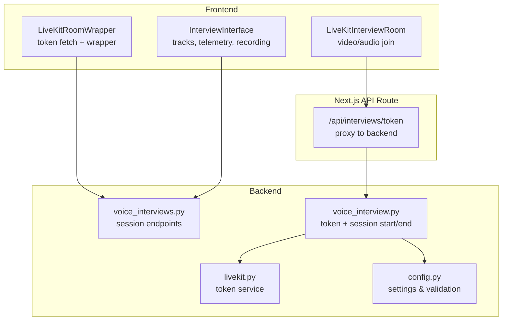
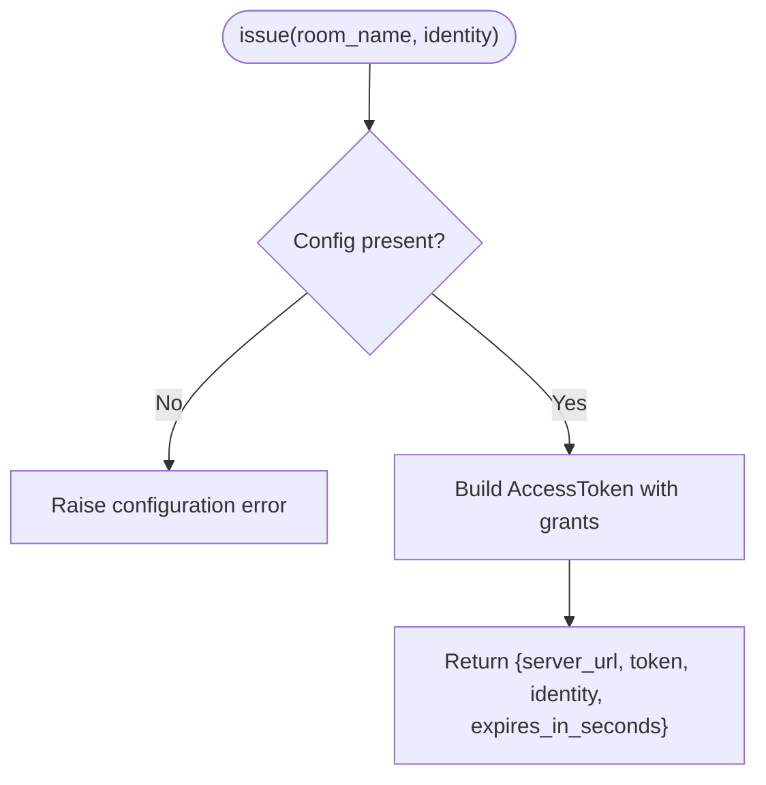
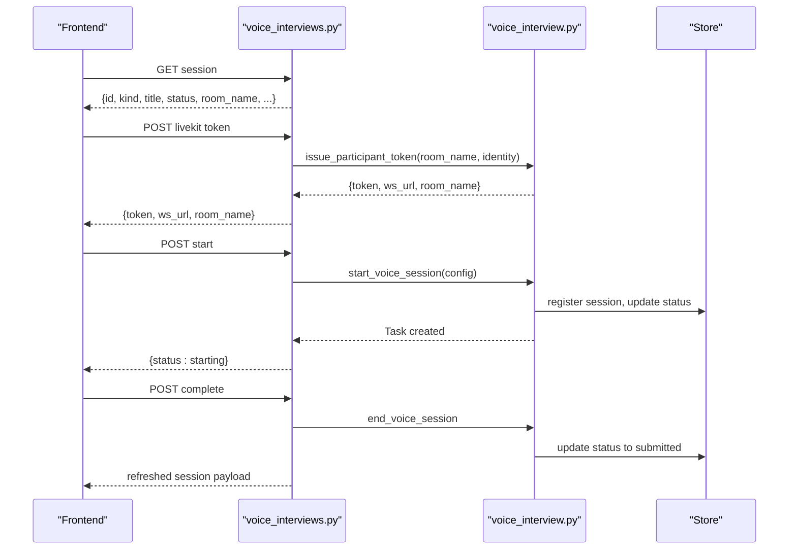
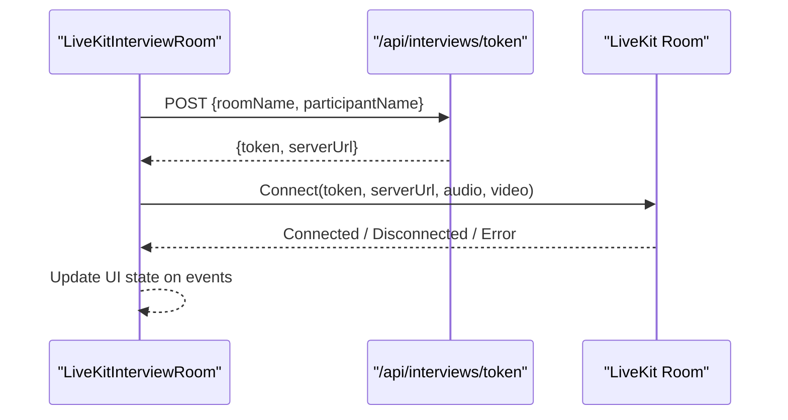
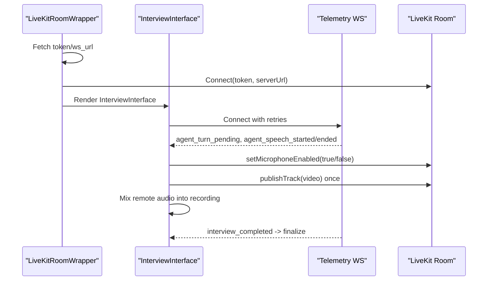
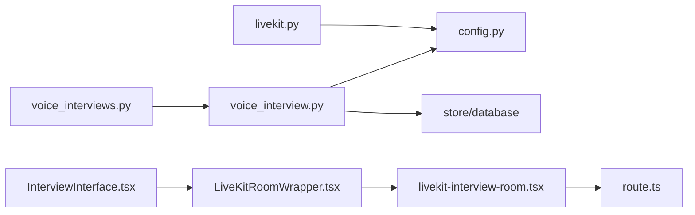

# LiveKit Integration

<cite>
**Referenced Files in This Document**
- [livekit.py](file://Backend/app/services/livekit.py)
- [voice_interview.py](file://Backend/app/services/voice_interview.py)
- [config.py](file://Backend/app/core/config.py)
- [voice_interviews.py](file://Backend/app/api/v1/voice_interviews.py)
- [route.ts](file://Frontend/app/api/interviews/token/route.ts)
- [livekit-interview-room.tsx](file://Frontend/components/interviews/livekit-interview-room.tsx)
- [LiveKitRoomWrapper.tsx](file://Frontend/components/interviews/voice/LiveKitRoomWrapper.tsx)
- [InterviewInterface.tsx](file://Frontend/components/interviews/voice/InterviewInterface.tsx)
</cite>

## Table of Contents
1. Introduction
2. Project Structure
3. Core Components
4. Architecture Overview
5. Detailed Component Analysis
6. Dependency Analysis
7. Performance Considerations
8. Troubleshooting Guide
9. Conclusion

## Introduction
This document explains how the real-time interview system integrates with LiveKit to create and manage secure video/audio rooms for interviews. It covers server-side token issuance, room lifecycle management, participant handling, media stream processing, frontend connection flow, error handling, recovery strategies, and scalability considerations for multiple concurrent sessions.

## Project Structure
The integration spans backend services that issue LiveKit tokens and orchestrate voice interviews, and frontend components that connect to LiveKit rooms, manage media tracks, and coordinate with a telemetry WebSocket for agent-driven interview control.



**Diagram sources**
- [livekit-interview-room.tsx:21-68](file://Frontend/components/interviews/livekit-interview-room.tsx#L21-L68)
- [LiveKitRoomWrapper.tsx:35-101](file://Frontend/components/interviews/voice/LiveKitRoomWrapper.tsx#L35-L101)
- [InterviewInterface.tsx:474-724](file://Frontend/components/interviews/voice/InterviewInterface.tsx#L474-L724)
- [route.ts:5-75](file://Frontend/app/api/interviews/token/route.ts#L5-L75)
- [voice_interviews.py:189-236](file://Backend/app/api/v1/voice_interviews.py#L189-L236)
- [voice_interview.py:230-251](file://Backend/app/services/voice_interview.py#L230-L251)
- [livekit.py:14-38](file://Backend/app/services/livekit.py#L14-L38)
- [config.py:72-76](file://Backend/app/core/config.py#L72-L76)

**Section sources**
- [livekit-interview-room.tsx:21-68](file://Frontend/components/interviews/livekit-interview-room.tsx#L21-L68)
- [LiveKitRoomWrapper.tsx:35-101](file://Frontend/components/interviews/voice/LiveKitRoomWrapper.tsx#L35-L101)
- [InterviewInterface.tsx:474-724](file://Frontend/components/interviews/voice/InterviewInterface.tsx#L474-L724)
- [route.ts:5-75](file://Frontend/app/api/interviews/token/route.ts#L5-L75)
- [voice_interviews.py:189-236](file://Backend/app/api/v1/voice_interviews.py#L189-L236)
- [voice_interview.py:230-251](file://Backend/app/services/voice_interview.py#L230-L251)
- [livekit.py:14-38](file://Backend/app/services/livekit.py#L14-L38)
- [config.py:72-76](file://Backend/app/core/config.py#L72-L76)

## Core Components
- Server-side token issuance:
  - A dedicated service builds a signed JWT with identity, name, TTL, and grants scoped to a specific room.
  - Voice interview endpoints compute or reuse room names per attempt and issue participant tokens via the service layer.
- Frontend connection:
  - A simple video/audio room component requests a token from a Next.js route and connects using LiveKit React components.
  - A wrapper component fetches a token and WebSocket URL, then renders a LiveKit room with audio rendering and an interview interface.
- Interview orchestration:
  - The frontend establishes a telemetry WebSocket to receive agent state events (turn-taking, transcript updates, completion).
  - Media tracks are managed locally (mic enabled/disabled based on agent signals), camera track published once, and client-side recording mixed with remote audio.

**Section sources**
- [livekit.py:14-38](file://Backend/app/services/livekit.py#L14-L38)
- [voice_interview.py:230-251](file://Backend/app/services/voice_interview.py#L230-L251)
- [voice_interviews.py:189-236](file://Backend/app/api/v1/voice_interviews.py#L189-L236)
- [livekit-interview-room.tsx:21-68](file://Frontend/components/interviews/livekit-interview-room.tsx#L21-L68)
- [LiveKitRoomWrapper.tsx:35-101](file://Frontend/components/interviews/voice/LiveKitRoomWrapper.tsx#L35-L101)
- [InterviewInterface.tsx:211-332](file://Frontend/components/interviews/voice/InterviewInterface.tsx#L211-L332)

## Architecture Overview
The system uses a two-tier approach:
- Backend issues short-lived, room-scoped JWTs and manages interview session lifecycle through voice interview services.
- Frontend connects to LiveKit using those tokens, subscribes to telemetry events, and controls media tracks accordingly.

```mermaid
sequenceDiagram
participant FE as "Frontend"
participant NR as "Next.js /api/interviews/token"
participant BE as "Backend voice_interviews"
participant VI as "voice_interview service"
participant LK as "LiveKit Server"
FE->>NR : POST {roomName, participantName}
NR->>BE : POST /interviews/token (with auth headers)
BE-->>NR : {token, server_url}
NR-->>FE : {token, serverUrl}
FE->>LK : Connect with token
Note over FE,LK : Room connected; audio/video tracks available
FE->>BE : Start voice session (optional, agent-driven)
BE->>VI : start_voice_session(config)
VI-->>BE : Session started
FE-->>FE : Telemetry WS receives agent events
```

**Diagram sources**
- [route.ts:5-75](file://Frontend/app/api/interviews/token/route.ts#L5-L75)
- [voice_interviews.py:189-236](file://Backend/app/api/v1/voice_interviews.py#L189-L236)
- [voice_interview.py:189-227](file://Backend/app/services/voice_interview.py#L189-L227)
- [livekit-interview-room.tsx:21-68](file://Frontend/components/interviews/livekit-interview-room.tsx#L21-L68)

## Detailed Component Analysis

### Server-Side Token Service
- Purpose: Generate secure, room-scoped JWTs for LiveKit participants.
- Behavior:
  - Validates configuration presence (URL, API key, secret).
  - Builds AccessToken with identity, display name, TTL, and VideoGrants allowing join to a specific room.
  - Returns structured response including server URL and token expiry.



**Diagram sources**
- [livekit.py:14-38](file://Backend/app/services/livekit.py#L14-L38)
- [config.py:72-76](file://Backend/app/core/config.py#L72-L76)

**Section sources**
- [livekit.py:14-38](file://Backend/app/services/livekit.py#L14-L38)
- [config.py:72-76](file://Backend/app/core/config.py#L72-L76)

### Voice Interview Endpoints and Session Lifecycle
- Endpoints:
  - Retrieve session metadata and status.
  - Issue LiveKit participant tokens for profile and applied interviews.
  - Start and complete voice sessions, persisting room names and statuses.
- Room naming:
  - Uses attempt-specific room names or defaults like “profile-screening-{id}” and “job-interview-{id}”.
- Identity checks:
  - Optional live image capture endpoints validate candidate identity against stored avatar.



**Diagram sources**
- [voice_interviews.py:177-256](file://Backend/app/api/v1/voice_interviews.py#L177-L256)
- [voice_interviews.py:290-384](file://Backend/app/api/v1/voice_interviews.py#L290-L384)
- [voice_interview.py:189-251](file://Backend/app/services/voice_interview.py#L189-L251)

**Section sources**
- [voice_interviews.py:177-256](file://Backend/app/api/v1/voice_interviews.py#L177-L256)
- [voice_interviews.py:290-384](file://Backend/app/api/v1/voice_interviews.py#L290-L384)
- [voice_interview.py:189-251](file://Backend/app/services/voice_interview.py#L189-L251)

### Frontend: Simple Video/Audio Room Join
- Flow:
  - User enters name and submits to obtain a token from Next.js route.
  - On success, renders LiveKitRoom with token and server URL, enabling audio/video and rendering audio.
  - Handles disconnect and error states by resetting UI.



**Diagram sources**
- [livekit-interview-room.tsx:21-68](file://Frontend/components/interviews/livekit-interview-room.tsx#L21-L68)
- [route.ts:5-75](file://Frontend/app/api/interviews/token/route.ts#L5-L75)

**Section sources**
- [livekit-interview-room.tsx:21-68](file://Frontend/components/interviews/livekit-interview-room.tsx#L21-L68)
- [route.ts:5-75](file://Frontend/app/api/interviews/token/route.ts#L5-L75)

### Frontend: Voice Interview Wrapper and Interface
- Wrapper:
  - Fetches LiveKit token and WebSocket URL from backend.
  - Renders LiveKitRoom with audio renderer and passes control to InterviewInterface.
- Interface:
  - Establishes telemetry WebSocket with retry logic and exponential backoff.
  - Manages microphone enable/disable based on agent turn signals and answer time caps.
  - Publishes local video track once after room connection.
  - Mixes remote audio into a client-side recording destination.
  - Captures a single identity frame when camera is ready.
  - Listens for agent events to update transcript, readiness, and completion.



**Diagram sources**
- [LiveKitRoomWrapper.tsx:35-101](file://Frontend/components/interviews/voice/LiveKitRoomWrapper.tsx#L35-L101)
- [InterviewInterface.tsx:211-332](file://Frontend/components/interviews/voice/InterviewInterface.tsx#L211-L332)
- [InterviewInterface.tsx:474-724](file://Frontend/components/interviews/voice/InterviewInterface.tsx#L474-L724)

**Section sources**
- [LiveKitRoomWrapper.tsx:35-101](file://Frontend/components/interviews/voice/LiveKitRoomWrapper.tsx#L35-L101)
- [InterviewInterface.tsx:211-332](file://Frontend/components/interviews/voice/InterviewInterface.tsx#L211-L332)
- [InterviewInterface.tsx:474-724](file://Frontend/components/interviews/voice/InterviewInterface.tsx#L474-L724)

### Configuration and Validation
- Settings:
  - LiveKit URL, API key, and secret are required for token issuance and voice interviews.
  - Token TTL is validated within a safe range.
  - Convenience properties expose WebSocket URL and configuration readiness.
- Validation:
  - Ensures environment variables are present before issuing tokens or starting voice sessions.

**Section sources**
- [config.py:72-76](file://Backend/app/core/config.py#L72-L76)
- [config.py:122-177](file://Backend/app/core/config.py#L122-L177)
- [voice_interview.py:154-166](file://Backend/app/services/voice_interview.py#L154-L166)

## Dependency Analysis
- Backend dependencies:
  - voice_interviews depends on voice_interview service for token issuance and session management.
  - voice_interview depends on config for settings and validation, and on database store for persistence.
  - livekit service depends on core config and errors for configuration checks.
- Frontend dependencies:
  - livekit-interview-room depends on Next.js route for token retrieval and LiveKit React components for room rendering.
  - LiveKitRoomWrapper depends on public API utilities to fetch token and WebSocket URL.
  - InterviewInterface depends on LiveKit client SDK for track management and telemetry WebSocket for agent coordination.



**Diagram sources**
- [voice_interviews.py:189-236](file://Backend/app/api/v1/voice_interviews.py#L189-L236)
- [voice_interview.py:230-251](file://Backend/app/services/voice_interview.py#L230-L251)
- [config.py:72-76](file://Backend/app/core/config.py#L72-L76)
- [livekit-interview-room.tsx:21-68](file://Frontend/components/interviews/livekit-interview-room.tsx#L21-L68)
- [LiveKitRoomWrapper.tsx:35-101](file://Frontend/components/interviews/voice/LiveKitRoomWrapper.tsx#L35-L101)
- [InterviewInterface.tsx:474-724](file://Frontend/components/interviews/voice/InterviewInterface.tsx#L474-L724)

**Section sources**
- [voice_interviews.py:189-236](file://Backend/app/api/v1/voice_interviews.py#L189-L236)
- [voice_interview.py:230-251](file://Backend/app/services/voice_interview.py#L230-L251)
- [config.py:72-76](file://Backend/app/core/config.py#L72-L76)
- [livekit-interview-room.tsx:21-68](file://Frontend/components/interviews/livekit-interview-room.tsx#L21-L68)
- [LiveKitRoomWrapper.tsx:35-101](file://Frontend/components/interviews/voice/LiveKitRoomWrapper.tsx#L35-L101)
- [InterviewInterface.tsx:474-724](file://Frontend/components/interviews/voice/InterviewInterface.tsx#L474-L724)

## Performance Considerations
- Token TTL:
  - Short-lived tokens reduce risk and align with typical interview durations; ensure TTL fits expected session length.
- Media tracks:
  - Publish camera track once to avoid redundant captures; reuse existing tracks for client-side recording.
  - Enable microphone only when agent signals allow speaking to minimize CPU usage and background noise.
- Telemetry reconnection:
  - Exponential backoff prevents thundering herd during transient network issues.
- Concurrency:
  - Each interview runs in its own asyncio task; guard against duplicate starts per session ID.
- Scalability:
  - Offload heavy work (agent orchestration) to background tasks; keep endpoints responsive.
  - Use room-scoped grants to limit token scope and improve security at scale.

[No sources needed since this section provides general guidance]

## Troubleshooting Guide
- Missing configuration:
  - If LiveKit credentials are not set, token issuance will fail; verify environment variables and settings validation.
- Invalid room name or participant name:
  - Frontend route validates inputs; ensure room names match allowed patterns and participant names are within limits.
- Connection failures:
  - Frontend handles disconnect and error callbacks; reset UI state and prompt user to retry.
- Telemetry WebSocket closed:
  - Retry with exponential backoff; handle policy violation codes by stopping auto-reconnect and informing the user.
- Agent speech stuck:
  - Client includes timeouts to clear agent speaking flags if no end event arrives; unlock mic accordingly.
- Identity check failure:
  - Non-blocking; captured frames are sent asynchronously and logged on failure without interrupting the interview.

**Section sources**
- [config.py:122-177](file://Backend/app/core/config.py#L122-L177)
- [route.ts:23-30](file://Frontend/app/api/interviews/token/route.ts#L23-L30)
- [livekit-interview-room.tsx:50-68](file://Frontend/components/interviews/livekit-interview-room.tsx#L50-L68)
- [InterviewInterface.tsx:677-724](file://Frontend/components/interviews/voice/InterviewInterface.tsx#L677-L724)
- [InterviewInterface.tsx:198-209](file://Frontend/components/interviews/voice/InterviewInterface.tsx#L198-L209)
- [InterviewInterface.tsx:334-378](file://Frontend/components/interviews/voice/InterviewInterface.tsx#L334-L378)

## Conclusion
The integration leverages LiveKit’s secure, room-scoped tokens and a robust frontend architecture to deliver reliable real-time interviews. The backend enforces configuration and session lifecycle, while the frontend manages media tracks and telemetry-driven agent interactions. With careful error handling, reconnection strategies, and scalable design patterns, the system supports multiple concurrent interview sessions effectively.

[No sources needed since this section summarizes without analyzing specific files]