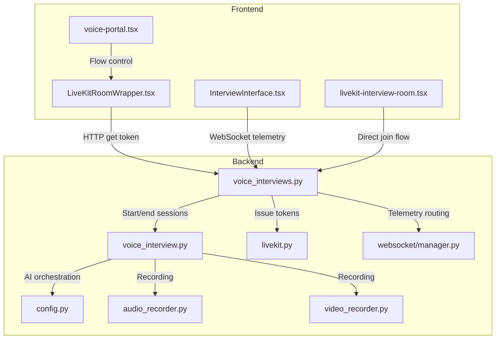
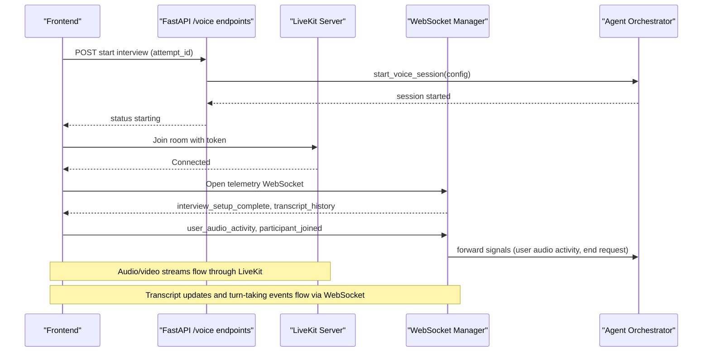
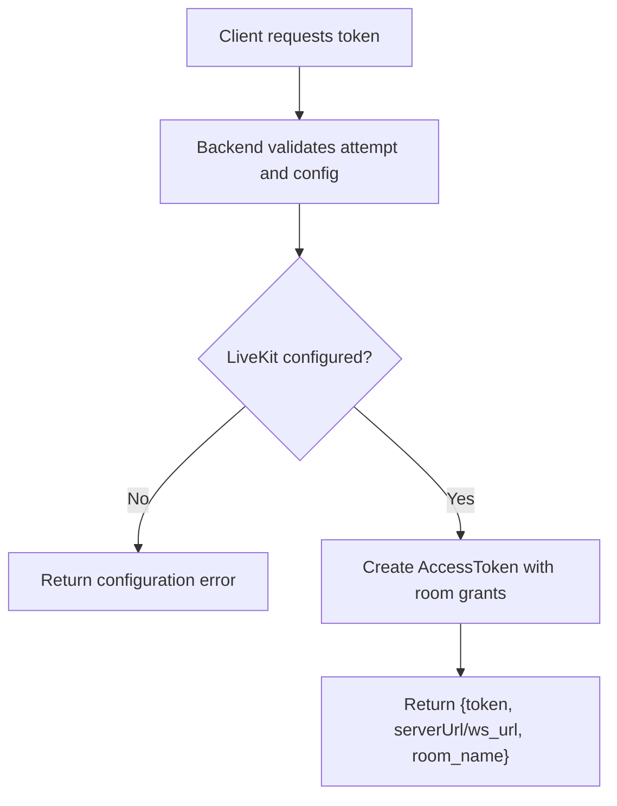
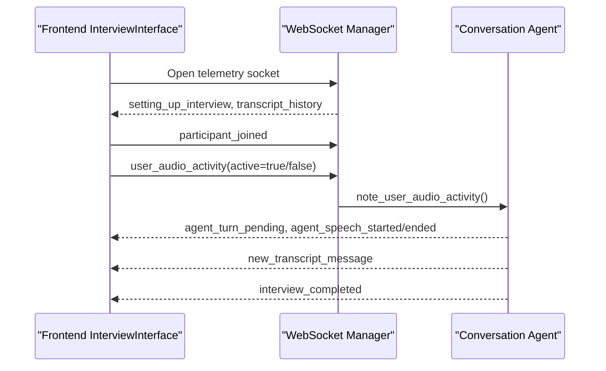
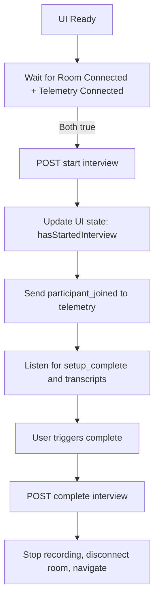
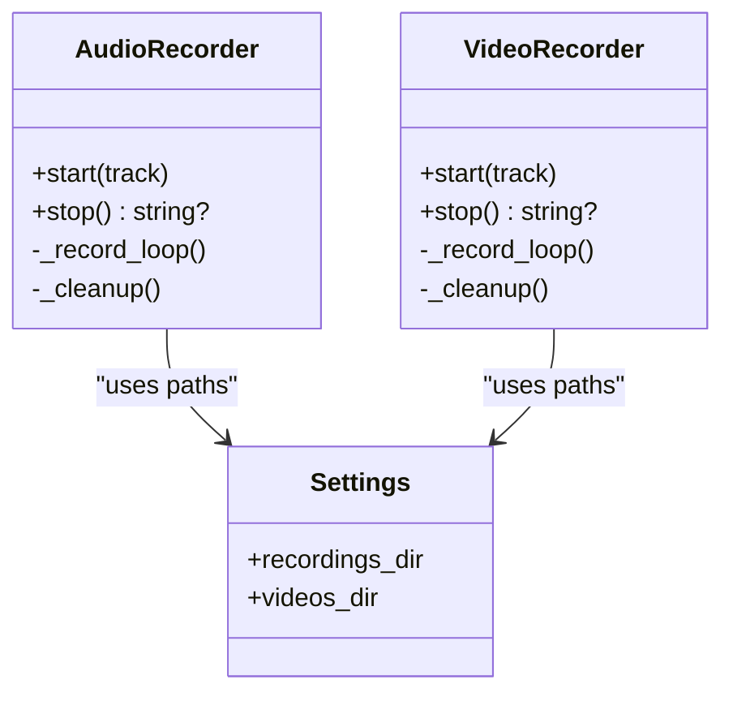
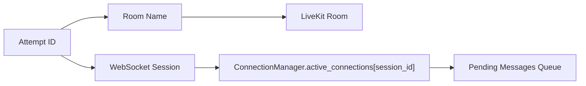
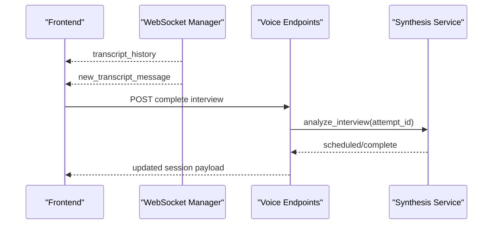
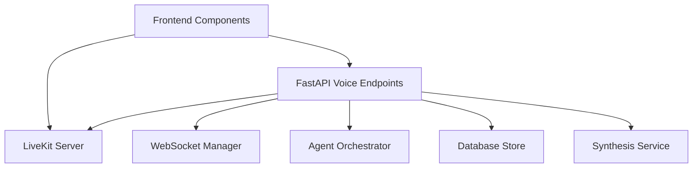

# Real-time Communication Architecture

<cite>
**Referenced Files in This Document**
- [livekit.py](file://Backend/app/services/livekit.py)
- [voice_interviews.py](file://Backend/app/api/v1/voice_interviews.py)
- [voice_interview.py](file://Backend/app/services/voice_interview.py)
- [manager.py](file://Backend/app/websocket/manager.py)
- [config.py](file://Backend/app/core/config.py)
- [audio_recorder.py](file://Backend/app/ai/utils/audio_recorder.py)
- [video_recorder.py](file://Backend/app/ai/utils/video_recorder.py)
- [livekit-interview-room.tsx](file://Frontend/components/interviews/livekit-interview-room.tsx)
- [LiveKitRoomWrapper.tsx](file://Frontend/components/interviews/voice/LiveKitRoomWrapper.tsx)
- [InterviewInterface.tsx](file://Frontend/components/interviews/voice/InterviewInterface.tsx)
- [voice-portal.tsx](file://Frontend/components/interviews/voice/voice-portal.tsx)
</cite>

## Table of Contents
1. [Introduction](#introduction)
2. [Project Structure](#project-structure)
3. [Core Components](#core-components)
4. [Architecture Overview](#architecture-overview)
5. [Detailed Component Analysis](#detailed-component-analysis)
6. [Dependency Analysis](#dependency-analysis)
7. [Performance Considerations](#performance-considerations)
8. [Troubleshooting Guide](#troubleshooting-guide)
9. [Conclusion](#conclusion)

## Introduction
This document explains the real-time communication architecture that powers live video/audio interviews using LiveKit and WebSocket telemetry. It covers:
- Video/audio streaming via LiveKit rooms
- WebSocket message protocols for real-time interview interactions
- Client-server synchronization patterns between the frontend and backend
- Room management for multiple concurrent sessions
- Media stream processing and transcription integration
- Connection management, error recovery, and scalability considerations

## Project Structure
The system is split into a FastAPI backend and a Next.js frontend:
- Backend
  - LiveKit token issuance and voice session orchestration
  - WebSocket manager for telemetry events
  - Recording utilities for audio/video tracks
  - Configuration for LiveKit and AI services
- Frontend
  - LiveKit room wrapper and interview UI
  - Telemetry WebSocket client with reconnection logic
  - Interview lifecycle management (start, complete, finalize)

**Diagram sources**
- [voice_interviews.py:177-384](file://Backend/app/api/v1/voice_interviews.py#L177-L384)
- [voice_interview.py:189-251](file://Backend/app/services/voice_interview.py#L189-L251)
- [livekit.py:10-38](file://Backend/app/services/livekit.py#L10-L38)
- [manager.py:14-95](file://Backend/app/websocket/manager.py#L14-L95)
- [config.py:72-177](file://Backend/app/core/config.py#L72-L177)
- [audio_recorder.py:16-98](file://Backend/app/ai/utils/audio_recorder.py#L16-L98)
- [video_recorder.py:16-116](file://Backend/app/ai/utils/video_recorder.py#L16-L116)
- [livekit-interview-room.tsx:21-68](file://Frontend/components/interviews/livekit-interview-room.tsx#L21-L68)
- [LiveKitRoomWrapper.tsx:21-103](file://Frontend/components/interviews/voice/LiveKitRoomWrapper.tsx#L21-L103)
- [InterviewInterface.tsx:474-724](file://Frontend/components/interviews/voice/InterviewInterface.tsx#L474-L724)
- [voice-portal.tsx:60-239](file://Frontend/components/interviews/voice/voice-portal.tsx#L60-L239)

**Section sources**
- [voice_interviews.py:177-384](file://Backend/app/api/v1/voice_interviews.py#L177-L384)
- [voice_interview.py:189-251](file://Backend/app/services/voice_interview.py#L189-L251)
- [livekit.py:10-38](file://Backend/app/services/livekit.py#L10-L38)
- [manager.py:14-95](file://Backend/app/websocket/manager.py#L14-L95)
- [config.py:72-177](file://Backend/app/core/config.py#L72-L177)
- [audio_recorder.py:16-98](file://Backend/app/ai/utils/audio_recorder.py#L16-L98)
- [video_recorder.py:16-116](file://Backend/app/ai/utils/video_recorder.py#L16-L116)
- [livekit-interview-room.tsx:21-68](file://Frontend/components/interviews/livekit-interview-room.tsx#L21-L68)
- [LiveKitRoomWrapper.tsx:21-103](file://Frontend/components/interviews/voice/LiveKitRoomWrapper.tsx#L21-L103)
- [InterviewInterface.tsx:474-724](file://Frontend/components/interviews/voice/InterviewInterface.tsx#L474-L724)
- [voice-portal.tsx:60-239](file://Frontend/components/interviews/voice/voice-portal.tsx#L60-L239)

## Core Components
- LiveKit Token Service: Issues short-lived JWT tokens scoped to a specific room and identity.
- Voice Interview Endpoints: Start, complete, and manage voice interview sessions; issue participant tokens; handle telemetry WebSockets.
- WebSocket Manager: Tracks active connections per session, sends messages, stores pending messages when no clients are connected, and trims history.
- Frontend LiveKit Integration: Joins rooms, manages media tracks, handles telemetry events, and orchestrates interview lifecycle.
- Recording Utilities: Capture remote audio/video tracks from LiveKit to local files for later processing or storage.
- Configuration: Centralized settings for LiveKit URLs, keys, TTLs, and AI service parameters.

**Section sources**
- [livekit.py:10-38](file://Backend/app/services/livekit.py#L10-L38)
- [voice_interviews.py:177-384](file://Backend/app/api/v1/voice_interviews.py#L177-L384)
- [manager.py:14-95](file://Backend/app/websocket/manager.py#L14-L95)
- [LiveKitRoomWrapper.tsx:21-103](file://Frontend/components/interviews/voice/LiveKitRoomWrapper.tsx#L21-L103)
- [InterviewInterface.tsx:474-724](file://Frontend/components/interviews/voice/InterviewInterface.tsx#L474-L724)
- [audio_recorder.py:16-98](file://Backend/app/ai/utils/audio_recorder.py#L16-L98)
- [video_recorder.py:16-116](file://Backend/app/ai/utils/video_recorder.py#L16-L116)
- [config.py:72-177](file://Backend/app/core/config.py#L72-L177)

## Architecture Overview
The interview flow spans three layers:
- Frontend: Establishes LiveKit room connection, opens telemetry WebSocket, and drives interview state transitions.
- Backend API: Validates attempts, issues LiveKit tokens, starts/stops agent-driven interviews, and routes telemetry events.
- Services: Orchestrates AI agents, records media, and persists transcripts and evaluation results.

**Diagram sources**
- [voice_interviews.py:204-236](file://Backend/app/api/v1/voice_interviews.py#L204-L236)
- [voice_interviews.py:321-361](file://Backend/app/api/v1/voice_interviews.py#L321-L361)
- [voice_interview.py:189-217](file://Backend/app/services/voice_interview.py#L189-L217)
- [InterviewInterface.tsx:726-763](file://Frontend/components/interviews/voice/InterviewInterface.tsx#L726-L763)
- [InterviewInterface.tsx:474-724](file://Frontend/components/interviews/voice/InterviewInterface.tsx#L474-L724)

## Detailed Component Analysis

### LiveKit Token Issuance and Room Management
- The backend issues JWT tokens scoped to a room name and identity with a configurable TTL.
- Two flows exist:
  - Direct room join via a simple page that requests a token and renders LiveKit components.
  - Voice interview portal that fetches a token per attempt and embeds it in the LiveKit room wrapper.

**Diagram sources**
- [livekit.py:14-38](file://Backend/app/services/livekit.py#L14-L38)
- [voice_interview.py:230-251](file://Backend/app/services/voice_interview.py#L230-L251)
- [config.py:72-76](file://Backend/app/core/config.py#L72-L76)

**Section sources**
- [livekit.py:14-38](file://Backend/app/services/livekit.py#L14-L38)
- [voice_interview.py:230-251](file://Backend/app/services/voice_interview.py#L230-L251)
- [config.py:72-76](file://Backend/app/core/config.py#L72-L76)
- [livekit-interview-room.tsx:21-68](file://Frontend/components/interviews/livekit-interview-room.tsx#L21-L68)
- [LiveKitRoomWrapper.tsx:35-53](file://Frontend/components/interviews/voice/LiveKitRoomWrapper.tsx#L35-L53)

### WebSocket Telemetry Protocol and Event Handling
- The frontend opens a telemetry WebSocket per interview and listens for structured events:
  - Setup and readiness: setting_up_interview, interview_setup_complete
  - Turn-taking: agent_turn_pending, agent_speech_started/ended, user_turn_granted
  - Transcripts: new_transcript_message, transcript_history
  - Lifecycle: interview_completed, interview_failed
- The backend accepts telemetry messages and forwards relevant signals to the active conversation agent.

**Diagram sources**
- [InterviewInterface.tsx:474-724](file://Frontend/components/interviews/voice/InterviewInterface.tsx#L474-L724)
- [voice_interviews.py:258-288](file://Backend/app/api/v1/voice_interviews.py#L258-L288)
- [voice_interviews.py:387-415](file://Backend/app/api/v1/voice_interviews.py#L387-L415)

**Section sources**
- [InterviewInterface.tsx:474-724](file://Frontend/components/interviews/voice/InterviewInterface.tsx#L474-L724)
- [voice_interviews.py:258-288](file://Backend/app/api/v1/voice_interviews.py#L258-L288)
- [voice_interviews.py:387-415](file://Backend/app/api/v1/voice_interviews.py#L387-L415)
- [manager.py:22-89](file://Backend/app/websocket/manager.py#L22-L89)

### Client-Server Synchronization Patterns
- The frontend waits for both LiveKit room connectivity and telemetry readiness before starting the interview.
- On completion, the frontend calls the backend to finalize the session, stops recording, disconnects the room, and navigates to the completed state.
- The backend ensures idempotent start behavior and cleans up active tasks on completion.

**Diagram sources**
- [InterviewInterface.tsx:726-763](file://Frontend/components/interviews/voice/InterviewInterface.tsx#L726-L763)
- [InterviewInterface.tsx:181-192](file://Frontend/components/interviews/voice/InterviewInterface.tsx#L181-L192)
- [voice_interviews.py:239-255](file://Backend/app/api/v1/voice_interviews.py#L239-L255)
- [voice_interviews.py:364-384](file://Backend/app/api/v1/voice_interviews.py#L364-L384)

**Section sources**
- [InterviewInterface.tsx:726-763](file://Frontend/components/interviews/voice/InterviewInterface.tsx#L726-L763)
- [InterviewInterface.tsx:181-192](file://Frontend/components/interviews/voice/InterviewInterface.tsx#L181-L192)
- [voice_interviews.py:239-255](file://Backend/app/api/v1/voice_interviews.py#L239-L255)
- [voice_interviews.py:364-384](file://Backend/app/api/v1/voice_interviews.py#L364-L384)

### Media Stream Processing and Recording Workflows
- Audio recording: Captures remote audio tracks from LiveKit and writes WAV frames to disk.
- Video recording: Captures remote video tracks and writes VP8 frames into a minimal WebM container.
- Frontend also performs client-side recording by mixing local mic and remote audio via Web Audio API.

**Diagram sources**
- [audio_recorder.py:16-98](file://Backend/app/ai/utils/audio_recorder.py#L16-L98)
- [video_recorder.py:16-116](file://Backend/app/ai/utils/video_recorder.py#L16-L116)
- [config.py:118-119](file://Backend/app/core/config.py#L118-L119)

**Section sources**
- [audio_recorder.py:16-98](file://Backend/app/ai/utils/audio_recorder.py#L16-L98)
- [video_recorder.py:16-116](file://Backend/app/ai/utils/video_recorder.py#L16-L116)
- [InterviewInterface.tsx:778-800](file://Frontend/components/interviews/voice/InterviewInterface.tsx#L778-L800)

### Room Management for Multiple Concurrent Sessions
- Each interview maps to a unique room name derived from the attempt ID.
- The backend maintains per-session WebSocket connections and queues messages until clients connect.
- The frontend isolates telemetry sockets per attempt and handles reconnection with exponential backoff.

**Diagram sources**
- [voice_interviews.py:189-201](file://Backend/app/api/v1/voice_interviews.py#L189-L201)
- [voice_interviews.py:306-318](file://Backend/app/api/v1/voice_interviews.py#L306-L318)
- [manager.py:14-89](file://Backend/app/websocket/manager.py#L14-L89)
- [InterviewInterface.tsx:474-724](file://Frontend/components/interviews/voice/InterviewInterface.tsx#L474-L724)

**Section sources**
- [voice_interviews.py:189-201](file://Backend/app/api/v1/voice_interviews.py#L189-L201)
- [voice_interviews.py:306-318](file://Backend/app/api/v1/voice_interviews.py#L306-L318)
- [manager.py:14-89](file://Backend/app/websocket/manager.py#L14-L89)
- [InterviewInterface.tsx:474-724](file://Frontend/components/interviews/voice/InterviewInterface.tsx#L474-L724)

### Transcription Services Integration
- Transcripts are streamed via telemetry events and persisted in the attempt record.
- The frontend merges initial transcript history and appends new messages in real time.
- Completion triggers analysis scheduling to process transcripts and generate evaluations.

**Diagram sources**
- [InterviewInterface.tsx:586-608](file://Frontend/components/interviews/voice/InterviewInterface.tsx#L586-L608)
- [voice_interviews.py:239-255](file://Backend/app/api/v1/voice_interviews.py#L239-L255)
- [voice_interviews.py:364-384](file://Backend/app/api/v1/voice_interviews.py#L364-L384)

**Section sources**
- [InterviewInterface.tsx:586-608](file://Frontend/components/interviews/voice/InterviewInterface.tsx#L586-L608)
- [voice_interviews.py:239-255](file://Backend/app/api/v1/voice_interviews.py#L239-L255)
- [voice_interviews.py:364-384](file://Backend/app/api/v1/voice_interviews.py#L364-L384)

## Dependency Analysis
- Frontend depends on:
  - LiveKit React components for room and audio rendering
  - Telemetry WebSocket URL derived from the attempt token
  - Public API methods to start, complete, and verify identity
- Backend depends on:
  - LiveKit SDK for token generation
  - WebSocket manager for telemetry routing
  - AI orchestrator for conversation agents
  - Storage and synthesis services for persistence and analysis

**Diagram sources**
- [voice_interviews.py:177-384](file://Backend/app/api/v1/voice_interviews.py#L177-L384)
- [voice_interview.py:189-251](file://Backend/app/services/voice_interview.py#L189-L251)
- [InterviewInterface.tsx:474-724](file://Frontend/components/interviews/voice/InterviewInterface.tsx#L474-L724)

**Section sources**
- [voice_interviews.py:177-384](file://Backend/app/api/v1/voice_interviews.py#L177-L384)
- [voice_interview.py:189-251](file://Backend/app/services/voice_interview.py#L189-L251)
- [InterviewInterface.tsx:474-724](file://Frontend/components/interviews/voice/InterviewInterface.tsx#L474-L724)

## Performance Considerations
- Token TTL: Keep LiveKit token TTL within safe bounds to balance security and UX.
- WebSocket buffering: Limit pending messages to avoid memory growth under high churn.
- Media recording: Use efficient codecs and consider post-processing for combined audio+video.
- Reconnection strategy: Exponential backoff reduces load during transient network issues.
- Concurrency: Ensure agent orchestrators are isolated per session and tasks are tracked to prevent duplicates.

[No sources needed since this section provides general guidance]

## Troubleshooting Guide
- LiveKit not configured: Ensure environment variables for URL, API key, and secret are set.
- AI not configured: Set the required AI provider key for voice interviews.
- WebSocket errors: Check telemetry URL and handle close codes; do not auto-retry on policy violations.
- Identity check failures: Validate image format and size; ensure profile photo exists for comparison.
- Stuck states: Add timeouts to clear speaking flags and unlock candidate mic if agent speech never ends.

**Section sources**
- [config.py:154-177](file://Backend/app/core/config.py#L154-L177)
- [voice_interviews.py:60-92](file://Backend/app/api/v1/voice_interviews.py#L60-L92)
- [InterviewInterface.tsx:198-209](file://Frontend/components/interviews/voice/InterviewInterface.tsx#L198-L209)
- [InterviewInterface.tsx:677-707](file://Frontend/components/interviews/voice/InterviewInterface.tsx#L677-L707)

## Conclusion
The system combines LiveKit’s real-time media capabilities with a robust WebSocket telemetry layer to deliver interactive, AI-driven interviews. The frontend coordinates room connectivity and telemetry readiness, while the backend manages session lifecycle, token issuance, and agent orchestration. Recording utilities capture media for later review, and transcription events keep the UI synchronized. With careful connection management, error handling, and scalable session isolation, the architecture supports multiple concurrent interview sessions reliably.

[No sources needed since this section summarizes without analyzing specific files]