# Real-time State Synchronization

<cite>
**Referenced Files in This Document**
- [Backend/app/websocket/manager.py](file://Backend/app/websocket/manager.py)
- [Backend/app/api/v1/voice_interviews.py](file://Backend/app/api/v1/voice_interviews.py)
- [Backend/app/services/voice_interview.py](file://Backend/app/services/voice_interview.py)
- [Backend/app/ai/utils/interview_state.py](file://Backend/app/ai/utils/interview_state.py)
- [Backend/app/ai/services/agent_orchestrator.py](file://Backend/app/ai/services/agent_orchestrator.py)
- [Frontend/components/interviews/voice/InterviewInterface.tsx](file://Frontend/components/interviews/voice/InterviewInterface.tsx)
- [Frontend/utils/api.ts](file://Frontend/utils/api.ts)
- [Frontend/components/candidate/interview-session.tsx](file://Frontend/components/candidate/interview-session.tsx)
</cite>

## Table of Contents
1. Introduction
2. Project Structure
3. Core Components
4. Architecture Overview
5. Detailed Component Analysis
6. Dependency Analysis
7. Performance Considerations
8. Troubleshooting Guide
9. Conclusion

## Introduction
This document explains how interview state is synchronized in real time between the frontend and backend during voice interviews. It covers how question progression, timing synchronization, and response collection are coordinated across multiple clients; how client reconnections are handled; and how data consistency is maintained through optimistic UI updates, conflict resolution strategies, and state reconciliation when connections are restored.

## Project Structure
The real-time interview system spans:
- Backend FastAPI endpoints for session lifecycle, telemetry WebSocket, and LiveKit token issuance
- A WebSocket connection manager that fans out messages per session and buffers pending messages
- An agent orchestrator that runs AI agents, manages room lifecycle, and emits setup/turn/transcript events
- Interview state utilities that track conversation phases, timers, grace periods, and end-of-interview behavior
- Frontend components that connect to LiveKit, maintain a telemetry WebSocket, and render transcript and turn states

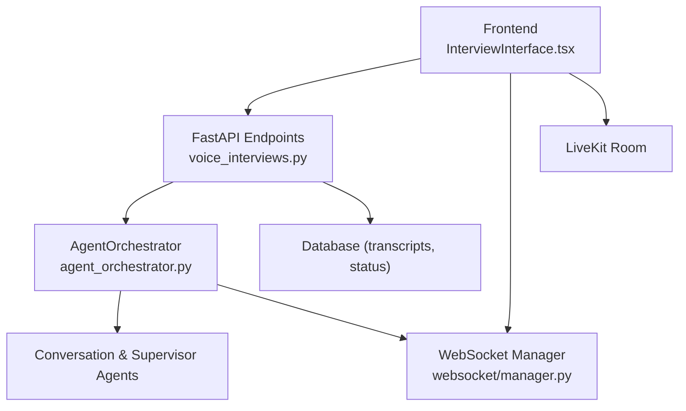

**Diagram sources**
- [Backend/app/api/v1/voice_interviews.py:177-416](file://Backend/app/api/v1/voice_interviews.py#L177-L416)
- [Backend/app/websocket/manager.py:14-96](file://Backend/app/websocket/manager.py#L14-L96)
- [Backend/app/ai/services/agent_orchestrator.py:42-192](file://Backend/app/ai/services/agent_orchestrator.py#L42-L192)
- [Frontend/components/interviews/voice/InterviewInterface.tsx:474-763](file://Frontend/components/interviews/voice/InterviewInterface.tsx#L474-L763)

**Section sources**
- [Backend/app/api/v1/voice_interviews.py:177-416](file://Backend/app/api/v1/voice_interviews.py#L177-L416)
- [Backend/app/websocket/manager.py:14-96](file://Backend/app/websocket/manager.py#L14-L96)
- [Backend/app/ai/services/agent_orchestrator.py:42-192](file://Backend/app/ai/services/agent_orchestrator.py#L42-L192)
- [Frontend/components/interviews/voice/InterviewInterface.tsx:474-763](file://Frontend/components/interviews/voice/InterviewInterface.tsx#L474-L763)

## Core Components
- Telemetry WebSocket endpoint: Accepts per-attempt telemetry connections, forwards client signals (e.g., user audio activity, end request), and disconnects cleanly on close.
- WebSocket ConnectionManager: Tracks active connections per session, sends messages to all participants, and stores pending messages if no connections exist.
- AgentOrchestrator: Runs background setup, connects to LiveKit, initializes agents, and emits structured events (setup stages, turns, transcripts, completion).
- InterviewState: Encapsulates phase transitions, timer management, grace periods, and end-of-interview controls used by agents to coordinate flow.
- Frontend InterviewInterface: Manages LiveKit room, telemetry WebSocket, local mic control, transcript rendering, and handles reconnection with exponential backoff.

**Section sources**
- [Backend/app/api/v1/voice_interviews.py:258-288](file://Backend/app/api/v1/voice_interviews.py#L258-L288)
- [Backend/app/websocket/manager.py:14-96](file://Backend/app/websocket/manager.py#L14-L96)
- [Backend/app/ai/services/agent_orchestrator.py:42-192](file://Backend/app/ai/services/agent_orchestrator.py#L42-L192)
- [Backend/app/ai/utils/interview_state.py:22-100](file://Backend/app/ai/utils/interview_state.py#L22-L100)
- [Frontend/components/interviews/voice/InterviewInterface.tsx:474-763](file://Frontend/components/interviews/voice/InterviewInterface.tsx#L474-L763)

## Architecture Overview
Real-time synchronization flows from the frontend’s telemetry WebSocket and LiveKit room into the backend orchestrator, which coordinates agents and broadcasts state changes back to the frontend. The database persists transcripts and session status for resilience and replay.

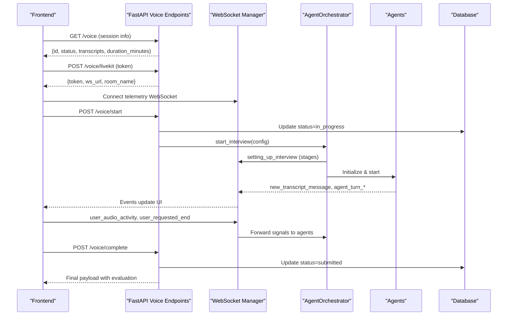

**Diagram sources**
- [Backend/app/api/v1/voice_interviews.py:177-256](file://Backend/app/api/v1/voice_interviews.py#L177-L256)
- [Backend/app/api/v1/voice_interviews.py:258-288](file://Backend/app/api/v1/voice_interviews.py#L258-L288)
- [Backend/app/ai/services/agent_orchestrator.py:42-192](file://Backend/app/ai/services/agent_orchestrator.py#L42-L192)
- [Frontend/components/interviews/voice/InterviewInterface.tsx:474-763](file://Frontend/components/interviews/voice/InterviewInterface.tsx#L474-L763)

## Detailed Component Analysis

### Telemetry WebSocket and Client Signals
- The telemetry endpoints accept a WebSocket per attempt, register it with the ConnectionManager, and loop to receive JSON messages.
- Client signals forwarded to agents include:
  - user_requested_end: triggers agent preparation and arming for end-of-interview flow
  - user_audio_activity: informs agents about speaking activity to avoid misinterpreting long answers as silence
- On disconnect, the connection is removed from the active set.

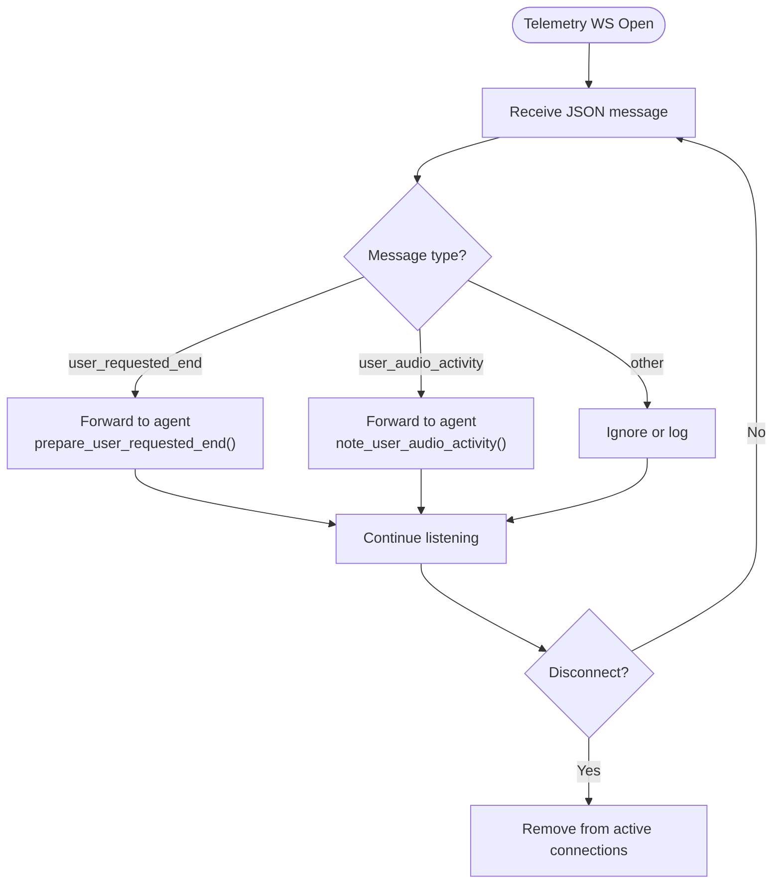

**Diagram sources**
- [Backend/app/api/v1/voice_interviews.py:258-288](file://Backend/app/api/v1/voice_interviews.py#L258-L288)
- [Backend/app/websocket/manager.py:22-46](file://Backend/app/websocket/manager.py#L22-L46)

**Section sources**
- [Backend/app/api/v1/voice_interviews.py:258-288](file://Backend/app/api/v1/voice_interviews.py#L258-L288)
- [Backend/app/websocket/manager.py:22-46](file://Backend/app/websocket/manager.py#L22-L46)

### WebSocket ConnectionManager: Fan-out and Pending Messages
- Maintains per-session lists of active WebSocket connections.
- send_message fans out to all active connections; if none exist, stores the message in pending_messages and trims to a maximum size.
- On connect, flushes any pending messages for that session.

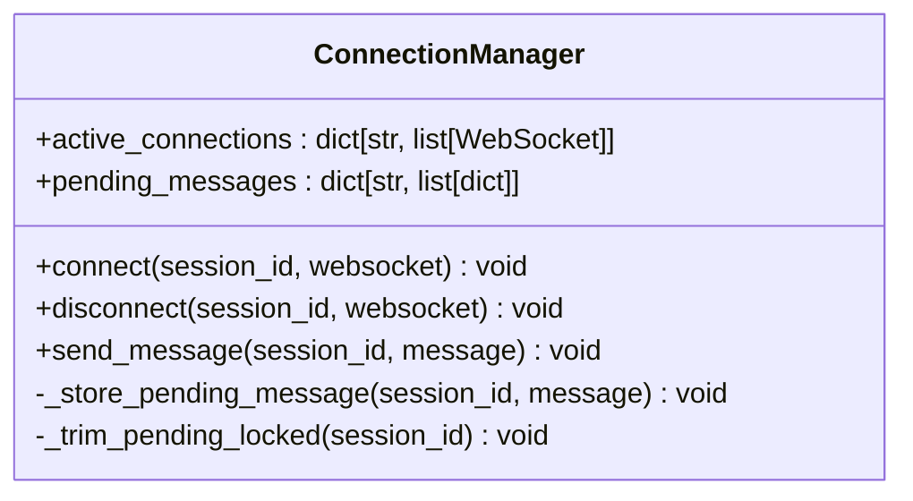

**Diagram sources**
- [Backend/app/websocket/manager.py:14-96](file://Backend/app/websocket/manager.py#L14-L96)

**Section sources**
- [Backend/app/websocket/manager.py:14-96](file://Backend/app/websocket/manager.py#L14-L96)

### AgentOrchestrator: Setup Sequence and Event Emission
- Registers itself in a global registry and starts a background setup task.
- Emits setting_up_interview events with stage names (starting, generating_persona, connecting_to_room, initializing_agents).
- After agents initialize and start, emits interview_setup_complete.
- Handles errors by emitting interview_setup_failed and cleaning up resources.

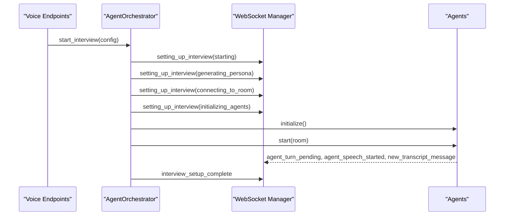

**Diagram sources**
- [Backend/app/ai/services/agent_orchestrator.py:42-192](file://Backend/app/ai/services/agent_orchestrator.py#L42-L192)

**Section sources**
- [Backend/app/ai/services/agent_orchestrator.py:42-192](file://Backend/app/ai/services/agent_orchestrator.py#L42-L192)

### InterviewState: Phases, Timing, and Grace Periods
- ConversationPhase enum models IDLE, AI_SPEAKING, WAITING_FOR_USER, USER_SPEAKING, PROCESSING_RESPONSE.
- Timer methods compute elapsed and remaining time; supports starting timer at first interactive turn and restoring from persisted transcripts.
- Grace period logic prevents abrupt cutoffs after time expires, allowing current speech to finish while blocking new questions.
- End-of-interview flags manage confirmation flows and hard stops after announcements.

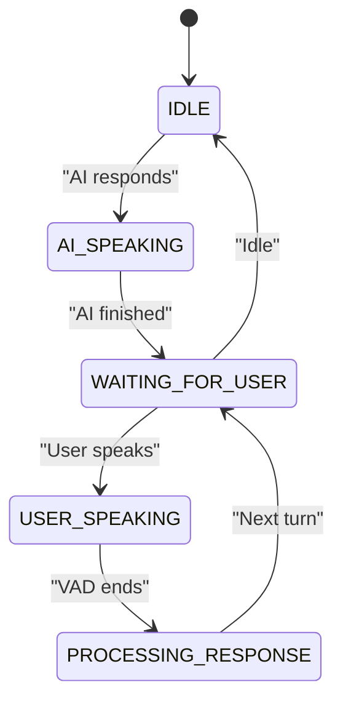

**Diagram sources**
- [Backend/app/ai/utils/interview_state.py:22-79](file://Backend/app/ai/utils/interview_state.py#L22-L79)

**Section sources**
- [Backend/app/ai/utils/interview_state.py:22-100](file://Backend/app/ai/utils/interview_state.py#L22-L100)
- [Backend/app/ai/utils/interview_state.py:124-170](file://Backend/app/ai/utils/interview_state.py#L124-L170)
- [Backend/app/ai/utils/interview_state.py:171-235](file://Backend/app/ai/utils/interview_state.py#L171-L235)
- [Backend/app/ai/utils/interview_state.py:236-272](file://Backend/app/ai/utils/interview_state.py#L236-L272)

### Frontend Telemetry Handling and Reconnection
- Establishes a telemetry WebSocket and listens for event types:
  - interviewer_identity, agent_turn_pending, agent_turn_cleared
  - agent_speech_started, agent_speech_ended
  - user_turn_granted, answer_time_cap
  - user_speech_started, user_speech_ended
  - new_transcript_message, transcript_history
  - setting_up_interview, interview_setup_complete, interview_completed, interview_failed, interview_setup_failed
- Implements exponential backoff reconnection with max retries and clears stale states on close.
- Controls microphone enable/disable based on authoritative backend signals and local state.

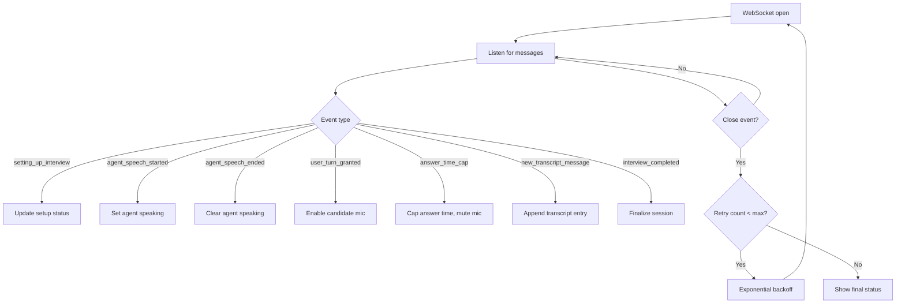

**Diagram sources**
- [Frontend/components/interviews/voice/InterviewInterface.tsx:474-763](file://Frontend/components/interviews/voice/InterviewInterface.tsx#L474-L763)

**Section sources**
- [Frontend/components/interviews/voice/InterviewInterface.tsx:474-763](file://Frontend/components/interviews/voice/InterviewInterface.tsx#L474-L763)

### Question Progression and Response Collection
- For non-voice scenario interviews, responses are autosaved with debounced writes and submitted once.
- For voice interviews, question progression is driven by agent turns and transcript entries; the frontend renders transcript history and incremental messages.

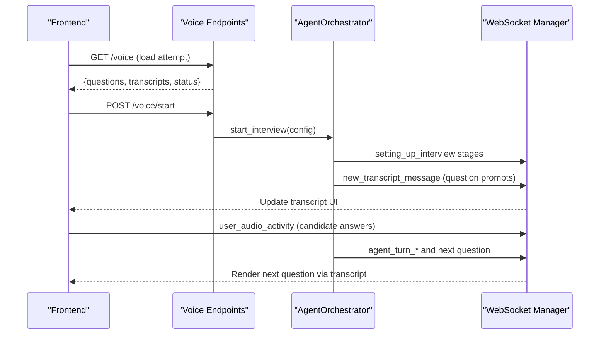

**Diagram sources**
- [Backend/app/api/v1/voice_interviews.py:177-256](file://Backend/app/api/v1/voice_interviews.py#L177-L256)
- [Backend/app/ai/services/agent_orchestrator.py:42-192](file://Backend/app/ai/services/agent_orchestrator.py#L42-L192)
- [Frontend/components/interviews/voice/InterviewInterface.tsx:586-608](file://Frontend/components/interviews/voice/InterviewInterface.tsx#L586-L608)

**Section sources**
- [Frontend/components/candidate/interview-session.tsx:42-78](file://Frontend/components/candidate/interview-session.tsx#L42-L78)
- [Backend/app/api/v1/voice_interviews.py:177-256](file://Backend/app/api/v1/voice_interviews.py#L177-L256)

### Timing Synchronization
- Backend maintains duration_minutes and computes elapsed/remaining time using UTC timestamps; can restore timer from earliest transcript timestamp.
- Frontend computes elapsed seconds from stored transcripts to resume accurate timing after reconnects.
- Answer time cap enforces a hard mute until agent finishes responding, preventing overlapping speech.

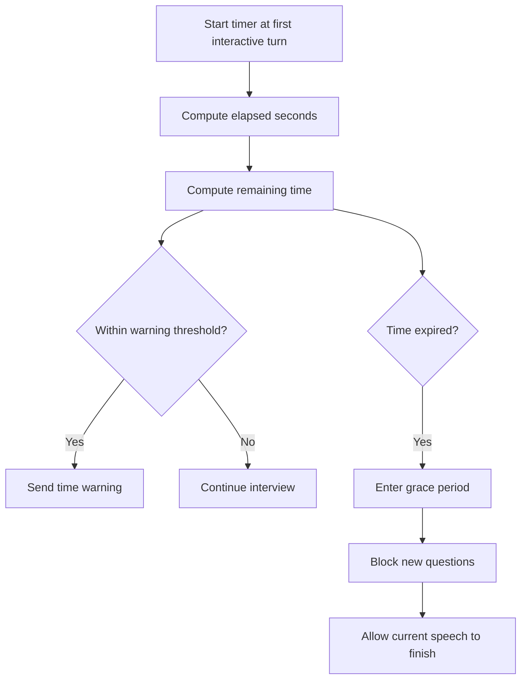

**Diagram sources**
- [Backend/app/ai/utils/interview_state.py:124-170](file://Backend/app/ai/utils/interview_state.py#L124-L170)
- [Backend/app/ai/utils/interview_state.py:171-206](file://Backend/app/ai/utils/interview_state.py#L171-L206)
- [Frontend/components/interviews/voice/InterviewInterface.tsx:41-59](file://Frontend/components/interviews/voice/InterviewInterface.tsx#L41-L59)

**Section sources**
- [Backend/app/ai/utils/interview_state.py:124-170](file://Backend/app/ai/utils/interview_state.py#L124-L170)
- [Backend/app/ai/utils/interview_state.py:171-206](file://Backend/app/ai/utils/interview_state.py#L171-L206)
- [Frontend/components/interviews/voice/InterviewInterface.tsx:41-59](file://Frontend/components/interviews/voice/InterviewInterface.tsx#L41-L59)

### Conflict Resolution and Data Consistency
- Idempotent submission: Frontend uses idempotency keys when submitting attempts to prevent duplicate processing.
- Database persistence: Session status and transcripts are updated atomically; orchestrator refreshes transcripts before resuming setup.
- Optimistic UI: Frontend shows saving states and keeps local responses even if autosave fails; submission is final and locks editing.

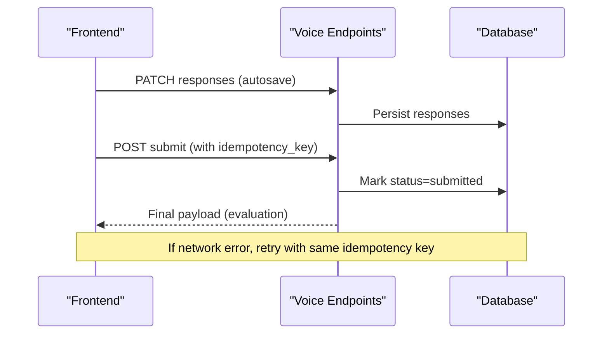

**Diagram sources**
- [Frontend/components/candidate/interview-session.tsx:62-78](file://Frontend/components/candidate/interview-session.tsx#L62-L78)
- [Backend/app/api/v1/voice_interviews.py:239-256](file://Backend/app/api/v1/voice_interviews.py#L239-L256)
- [Backend/app/ai/services/agent_orchestrator.py:329-347](file://Backend/app/ai/services/agent_orchestrator.py#L329-L347)

**Section sources**
- [Frontend/components/candidate/interview-session.tsx:62-78](file://Frontend/components/candidate/interview-session.tsx#L62-L78)
- [Backend/app/api/v1/voice_interviews.py:239-256](file://Backend/app/api/v1/voice_interviews.py#L239-L256)
- [Backend/app/ai/services/agent_orchestrator.py:329-347](file://Backend/app/ai/services/agent_orchestrator.py#L329-L347)

### Network Resilience and Offline Handling
- Telemetry WebSocket reconnection: Exponential backoff with max retries; clears stale states on close; avoids auto-retry on policy violations.
- Pending messages: If no active connections, messages are buffered and flushed upon reconnect.
- Resume from transcripts: Frontend computes elapsed time from stored transcripts; backend restores timer from earliest transcript timestamp.

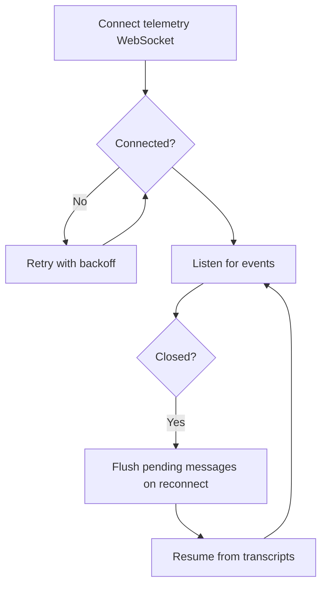

**Diagram sources**
- [Backend/app/websocket/manager.py:48-89](file://Backend/app/websocket/manager.py#L48-L89)
- [Frontend/components/interviews/voice/InterviewInterface.tsx:684-724](file://Frontend/components/interviews/voice/InterviewInterface.tsx#L684-L724)
- [Frontend/components/interviews/voice/InterviewInterface.tsx:41-59](file://Frontend/components/interviews/voice/InterviewInterface.tsx#L41-L59)

**Section sources**
- [Backend/app/websocket/manager.py:48-89](file://Backend/app/websocket/manager.py#L48-L89)
- [Frontend/components/interviews/voice/InterviewInterface.tsx:684-724](file://Frontend/components/interviews/voice/InterviewInterface.tsx#L684-L724)
- [Frontend/components/interviews/voice/InterviewInterface.tsx:41-59](file://Frontend/components/interviews/voice/InterviewInterface.tsx#L41-L59)

## Dependency Analysis
- Frontend depends on:
  - publicApi for fetching session info, LiveKit tokens, starting/completing interviews, and identity verification
  - getTelemetryWsUrl to construct the telemetry WebSocket URL
- Backend depends on:
  - WebSocket manager for fan-out messaging
  - AgentOrchestrator for orchestration and event emission
  - InterviewState for phase and timer logic
  - Database store for persisting transcripts and status

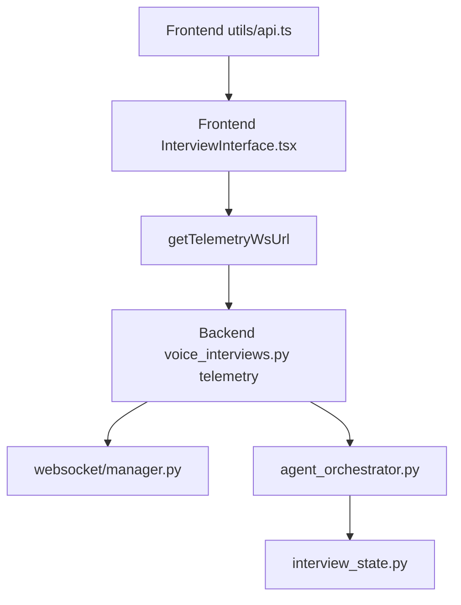

**Diagram sources**
- [Frontend/utils/api.ts:54-123](file://Frontend/utils/api.ts#L54-L123)
- [Backend/app/api/v1/voice_interviews.py:258-288](file://Backend/app/api/v1/voice_interviews.py#L258-L288)
- [Backend/app/websocket/manager.py:14-96](file://Backend/app/websocket/manager.py#L14-L96)
- [Backend/app/ai/services/agent_orchestrator.py:42-192](file://Backend/app/ai/services/agent_orchestrator.py#L42-L192)
- [Backend/app/ai/utils/interview_state.py:22-100](file://Backend/app/ai/utils/interview_state.py#L22-L100)

**Section sources**
- [Frontend/utils/api.ts:54-123](file://Frontend/utils/api.ts#L54-L123)
- [Backend/app/api/v1/voice_interviews.py:258-288](file://Backend/app/api/v1/voice_interviews.py#L258-L288)
- [Backend/app/websocket/manager.py:14-96](file://Backend/app/websocket/manager.py#L14-L96)
- [Backend/app/ai/services/agent_orchestrator.py:42-192](file://Backend/app/ai/services/agent_orchestrator.py#L42-L192)
- [Backend/app/ai/utils/interview_state.py:22-100](file://Backend/app/ai/utils/interview_state.py#L22-L100)

## Performance Considerations
- Debounced autosave reduces write frequency during typing.
- WebSocket message buffering prevents loss during transient disconnections; trimming limits memory growth.
- Background setup tasks avoid blocking HTTP requests; events keep UI responsive.
- Answer time caps reduce overlapping audio and improve transcription quality.

## Troubleshooting Guide
- Telemetry WebSocket closed with code 1008: Indicates invalid or expired link; do not auto-retry.
- Agent speaking timeout: Frontend clears speaking flags after a safety timeout to prevent stuck UI.
- Identity check failures: Non-blocking; recorded but do not interrupt interview flow.
- Submission errors: Autosave keeps local responses; retry with idempotency key.

**Section sources**
- [Frontend/components/interviews/voice/InterviewInterface.tsx:684-724](file://Frontend/components/interviews/voice/InterviewInterface.tsx#L684-L724)
- [Frontend/components/interviews/voice/InterviewInterface.tsx:198-209](file://Frontend/components/interviews/voice/InterviewInterface.tsx#L198-L209)
- [Frontend/components/interviews/voice/InterviewInterface.tsx:334-378](file://Frontend/components/interviews/voice/InterviewInterface.tsx#L334-L378)
- [Frontend/components/candidate/interview-session.tsx:62-78](file://Frontend/components/candidate/interview-session.tsx#L62-L78)

## Conclusion
The system achieves robust real-time synchronization through a combination of:
- Authoritative backend events driving frontend state
- WebSocket fan-out with pending message buffering
- Persistent transcripts enabling recovery and timer restoration
- Strict turn management and answer time caps for coherent conversation flow
- Idempotent submissions and optimistic UI updates for resilience

These patterns ensure consistent interview state across clients, graceful handling of reconnections, and reliable coordination of question progression, timing, and response collection.